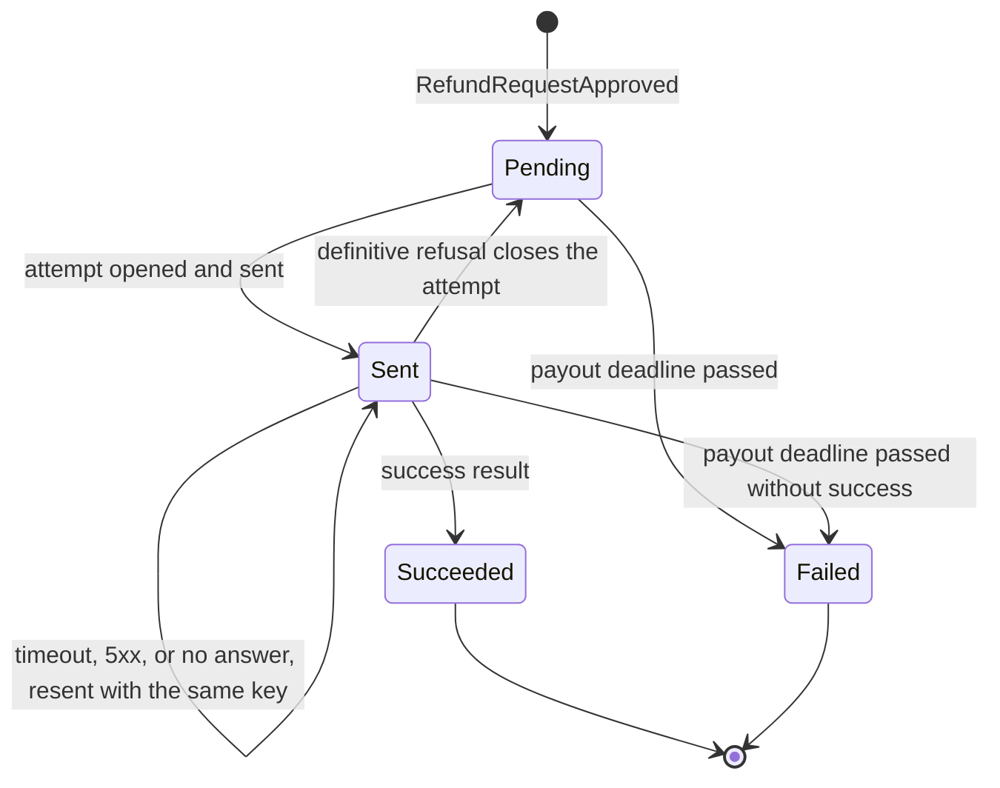
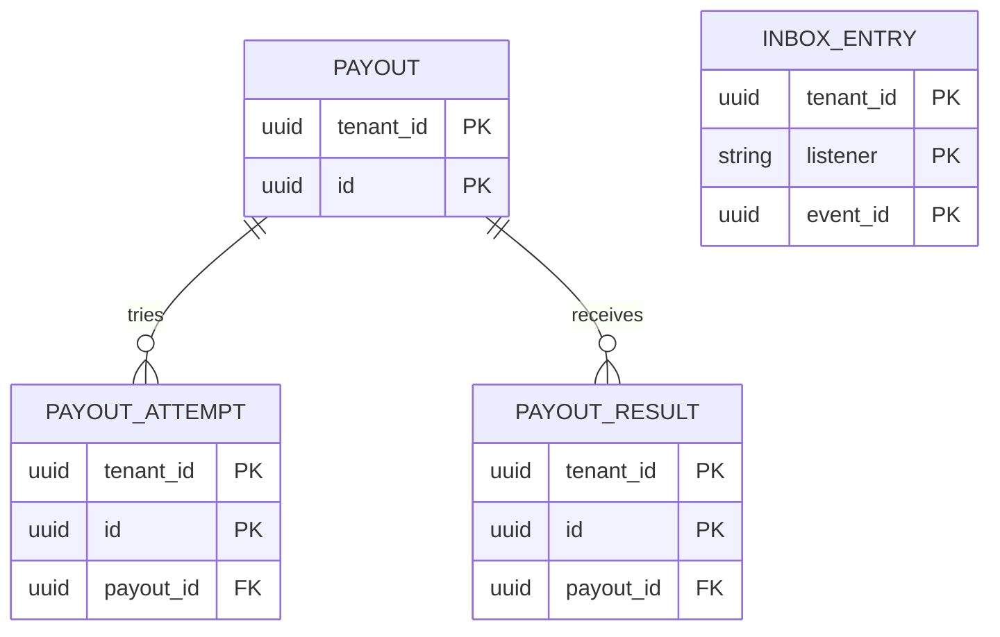
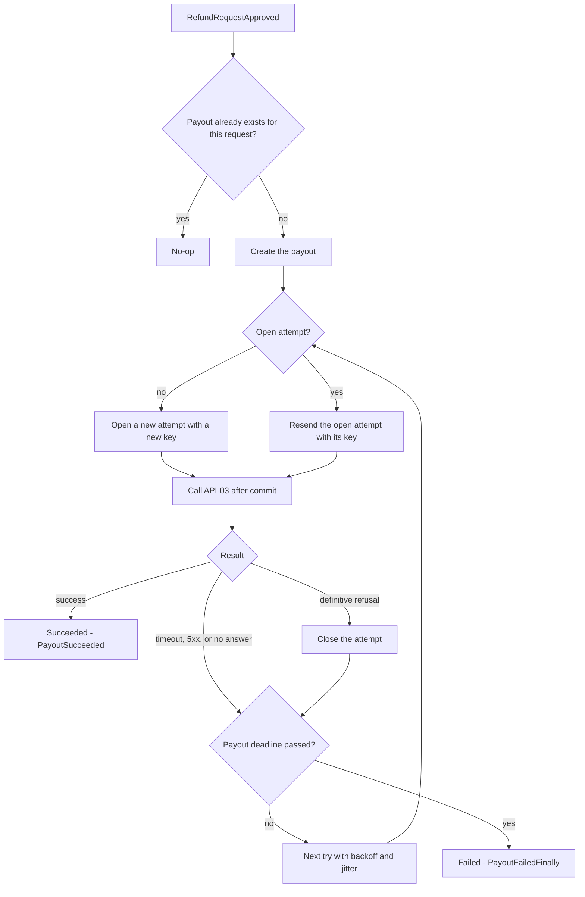

<!--
CHUNK: 13c
TITLE: Detailed Service Spec - payouts
PROJECT: Refunds Platform
VERSION: 1.0
DEPENDS_ON: 09, 07, 10 (event hub - topic names, event names, and payload contracts must match chunk 10 verbatim), 11 (API contracts - integration endpoints carry their API ID and match chunk 11 verbatim), 12 (roles - permission tokens match chunk 12 verbatim)
PART OF: SDD - Refunds Platform
-->

# 17. Detailed Service Specs

---

## 17.3 payouts

### What

The module that moves the money: for each approved refund request it sends one payout to the customer's original card through the Payment Provider, retries it until the payout deadline, and reports success or final failure back to refund-requests. It serves the payout steps of [REFUNDS/UC-04](../brd-refunds-portal/06b-use-cases-branch-manager.md#uc-04-approve--reject-refund) (steps 6-7, E1) and carries REFUNDS/NFR-01 (never lost or paid twice).

### Boundaries

- **Owns:** payouts (one per refund request) and their attempts, the attempt keys and provider references, the inbound payout results.
- **Does not own:** refund requests and their statuses (refund-requests); card data (the Payment Provider; the platform keeps only the original payment reference); messages (notifications).
- **Upstream consumers:** refund-requests (event `RefundRequestApproved`); the Payment Provider (API-04).
- **Downstream dependencies:** the Payment Provider (API-03); refund-requests (events `PayoutSucceeded`, `PayoutFailedFinally`). No other module calls the Payment Provider.

### Input

| Type | Source | Description |
|------|--------|-------------|
| Event | refund-requests: `RefundRequestApproved` | Creates the payout and makes its first try |
| REST (external inbound) | Payment Provider: API-04 | Payout result |
| Schedule | `payout-retry`, every minute | The send job of payouts (§11.1): makes the tries that are due and fails the payouts past the payout deadline |

### Business Logic

- **Create and send** ([REFUNDS/UC-04](../brd-refunds-portal/06b-use-cases-branch-manager.md#uc-04-approve--reject-refund) step 6): the listener for `RefundRequestApproved` creates one payout per refund request (a unique key on the refund request makes a repeated event a no-op), with the approved amount and the original payment reference, and makes the first try right after its commit, never inside the transaction. The first try sets a deadline 24 hours after the first try (the limit of [REFUNDS/UC-04](../brd-refunds-portal/06b-use-cases-branch-manager.md#uc-04-approve--reject-refund) E1). Every later try is made by the `payout-retry` job.
- **Result** (step 7): a success, from the API-03 answer or from an API-04 result, marks the payout succeeded and publishes `PayoutSucceeded`. Results are matched by provider reference or attempt key and applied once.
- **Retry** ([REFUNDS/UC-04](../brd-refunds-portal/06b-use-cases-branch-manager.md#uc-04-approve--reject-refund) E1): each try belongs to an attempt with its own key (payout id and attempt number), and at most one attempt is open. A timeout, a 5xx, or no answer leaves the attempt open: the next try resends it with the same key, or asks the provider for its status when API-03 offers that. Only a definitive refusal closes the attempt, and the next try opens a new attempt with a new key. So a refusal can still be followed by a success, and an outcome the platform did not see is never paid again (REFUNDS/NFR-01). The request stays Approved while tries run.
- **Final failure** (E1): the `payout-retry` job marks a payout failed when the payout deadline passes without success, closes any open attempt as expired, and publishes `PayoutFailedFinally`; refund-requests then marks the request Payout failed. A success reported after the deadline is recorded, pages the on-call engineer with the refund reference and the branch (no PII at INFO), and changes no status (R-14, §20.1.8).

**State machine (if applicable):**

**Figure 21: State Machine - payout**

**Summary:** A payout starts Pending and becomes Sent when an attempt goes out. An unknown outcome keeps the attempt open and resends it with the same key, and only a definitive refusal returns the payout to Pending, where the next try opens a new attempt with a new key. A success ends it Succeeded, and the payout deadline ends it Failed, even with an attempt still open.

This state machine is the persisted payout model. Pending to Sent happens only before the deadline and with no open attempt; Sent to Pending only on a definitive refusal of the open attempt; Sent to Succeeded only on a success for one of the payout's attempts; Pending or Sent to Failed only by the `payout-retry` job once the deadline has passed. Each transition is a conditional update on the payout's status and version. A success for a Failed payout changes no status: it is recorded as a late success (R-14).

### Output

| Type | Destination | Description |
|------|-------------|-------------|
| Outbound call | Payment Provider (API-03) | The payout attempt, with its key |
| Event | refund-requests | `PayoutSucceeded`, `PayoutFailedFinally` |
| REST response | Payment Provider (API-04) | Acknowledgement of a payout result |

### Integrations

| Integration | Direction | Protocol | Purpose | Contract | Failure Handling |
|-------------|-----------|----------|---------|----------|------------------|
| Payment Provider | Outbound, sync; the first try after the listener's commit, every later try by the `payout-retry` job (§11.1) | Provider API | Send a payout | API-03 (§15) | Tries with backoff and jitter until the payout deadline, the same key while an attempt's outcome is unknown and a new key only after a definitive refusal (§12 INT-01), then final failure ([REFUNDS/UC-04](../brd-refunds-portal/06b-use-cases-branch-manager.md#uc-04-approve--reject-refund) E1) |
| Payment Provider | Inbound, provider route (§11.6) | Provider callback | Payout result | API-04 (§15) | Applied once per provider result; an unknown payout gets a not-found answer; a failed signature check is refused and alerts (§20.1.12) |
| refund-requests | Inbound, async | In-process event | Start the payout | `RefundRequestApproved` (§14.10) | Redelivered from the publication log |
| refund-requests | Outbound, async | In-process events | Payout outcome | `PayoutSucceeded`, `PayoutFailedFinally` (§14.10) | Redelivered from the publication log |

### DB Modeling

#### Entity Relationship

**Figure 22: Entity Relationship - payouts**

**Summary:** A payout has its attempts and the provider results it received. The listener inbox stands alone.

#### Tables Design

| Table | Column | Type | Constraints | Notes |
|-------|--------|------|-------------|-------|
| `payout` | `tenant_id`, `id` | uuid, uuid | PK (`tenant_id`, `id`), NOT NULL | `id` is UUIDv7 |
| `payout` | `refund_request_id` | uuid | NOT NULL; unique (`tenant_id`, `refund_request_id`) | One payout per request; not a foreign key: the request lives in refund-requests |
| `payout` | `reference_number`, `branch_id` | varchar(16), varchar(32) | NOT NULL | For the late-success page (R-14) |
| `payout` | `amount`, `currency` | numeric(19,4), char(3) | NOT NULL; amount above 0 | EUR |
| `payout` | `original_payment_reference` | varchar(128) | NOT NULL | From the event; format `TBD - external` |
| `payout` | `status` | varchar(10) | NOT NULL; PENDING, SENT, SUCCEEDED, or FAILED; index (`tenant_id`, `status`, `next_try_at`) | |
| `payout` | `first_try_at`, `deadline_at` | timestamptz, timestamptz | NULL until the first try | The deadline of Create and send |
| `payout` | `next_try_at` | timestamptz | NULL once SUCCEEDED or FAILED | |
| `payout` | `attempt_count` | integer | NOT NULL | |
| `payout` | `ended_at` | timestamptz | NULL until SUCCEEDED or FAILED | |
| `payout` | `late_success_at` | timestamptz | NULL unless a success came after FAILED | R-14 |
| `payout` | `created_at`, `created_by`, `updated_at`, `updated_by`, `version` | per §11.1 | NOT NULL | `version` guards the transitions |
| `payout_attempt` | `tenant_id`, `id` | uuid, uuid | PK (`tenant_id`, `id`), NOT NULL | |
| `payout_attempt` | `payout_id` | uuid | NOT NULL; FK (`tenant_id`, `payout_id`) to `payout`; unique (`tenant_id`, `payout_id`) where `status` is OPEN | At most one open attempt |
| `payout_attempt` | `attempt_number` | integer | NOT NULL; unique (`tenant_id`, `payout_id`, `attempt_number`) | |
| `payout_attempt` | `attempt_key` | varchar(80) | NOT NULL; unique (`tenant_id`, `attempt_key`) | Payout id and attempt number; the idempotency key sent to API-03 |
| `payout_attempt` | `status` | varchar(10) | NOT NULL; OPEN, REFUSED, SUCCEEDED, or EXPIRED | |
| `payout_attempt` | `provider_reference` | varchar(128) | NULL until the provider gives one; unique (`tenant_id`, `provider_reference`) when set | Matches API-04 results |
| `payout_attempt` | `sends` | integer | NOT NULL | Sends of this attempt |
| `payout_attempt` | `last_outcome` | varchar(16) | NULL before the first send; ACCEPTED, TIMEOUT, ERROR, REFUSED, or SUCCEEDED | |
| `payout_attempt` | `opened_at` | timestamptz | NOT NULL | |
| `payout_attempt` | `closed_at` | timestamptz | NULL while OPEN | |
| `payout_result` | `tenant_id`, `id` | uuid, uuid | PK (`tenant_id`, `id`), NOT NULL | |
| `payout_result` | `payout_id` | uuid | NOT NULL; FK (`tenant_id`, `payout_id`) to `payout` | |
| `payout_result` | `provider_result_key` | varchar(160) | NOT NULL; unique (`tenant_id`, `provider_result_key`) | The provider's identity of a result, `TBD - external`; applied once |
| `payout_result` | `outcome` | varchar(10) | NOT NULL; SUCCEEDED or REFUSED | |
| `payout_result` | `payload` | jsonb | NOT NULL | The opaque provider message kept for audit (§11.1) |
| `payout_result` | `received_at` | timestamptz | NOT NULL | |
| `inbox_entry` | `tenant_id`, `listener`, `event_id` | uuid, varchar(80), uuid | PK (`tenant_id`, `listener`, `event_id`), NOT NULL | One row per event a listener handled |
| `inbox_entry` | `status`, `attempts`, `updated_at` | varchar(8), integer, timestamptz | NOT NULL; status DONE or PARKED | |
| `inbox_entry` | `last_error_code` | varchar(64) | NULL unless a run failed | |

#### Migration Strategy

- **Tool:** Flyway, versioned SQL in the module's own location for the `payouts` schema (§11.1).
- **Backward compatibility:** additive changes; expand, then contract for a breaking change.
- **Data backfill:** a separate versioned migration, run before the code that reads the new column.
- **Rollback:** a forward fix migration; no down scripts.

#### Retention Policy

- `payout`, `payout_attempt`, `payout_result`: kept 7 years after the payout ends, like the refund records ([REFUNDS 03 § Refund records](../brd-refunds-portal/03-definitions-and-domain-concepts.md#refund-records)), then deleted.
- `inbox_entry`: DONE rows deleted after 30 days; PARKED rows kept until the §20.1.3 procedure closes them.

#### Archival

- **Cold storage:** Not applicable: no record is archived.
- **Format:** Not applicable.
- **Schedule:** Not applicable.
- **Restore SLA:** Not applicable.

#### Data Encryption

- **At rest:** the database volume encryption of the hosting.
- **In transit:** TLS 1.2 or later (§11.6).
- **Key management:** Vault for the provider credentials, rotation per §11.6.
- **PII columns:** none; the original payment reference is a provider reference, not a card number.

### Multi-Tenancy Specifications

- **Strategy override:** None: shared schema with `tenant_id`, PostgreSQL, and the §11.4 instrumentation, as §11 sets.
- **Tenant filter:** `tenant_id` from the event; inbound results map the provider credentials to a tenant (§11.2).
- **Cross-tenant queries:** forbidden; the `payout-retry` job runs per tenant from the tenant registry (§11.2).

### API Standards

- **Style:** the module calls the provider's API and exposes only the provider's result callback; it has no endpoint for users.
- **Versioning:** the callback path follows the provider's scheme, `TBD - external` (API-04).
- **Authentication:** the provider's scheme on the callback, `TBD - external` (§15.1), behind the provider route of §11.6.
- **Idempotency:** a unique payout per refund request; one key per attempt, kept on every resend of that attempt; results applied once.
- **Pagination:** Not applicable.
- **Error envelope:** per the §15.1 error model.

#### List of APIs (Swagger-friendly)

| Method | Path | Summary | Request Body | Response | Permission token (§16) | API ID (§15) |
|--------|------|---------|--------------|----------|------------------------|--------------|
| TBD | TBD | Receive a payout result ([REFUNDS/UC-04](../brd-refunds-portal/06b-use-cases-branch-manager.md#uc-04-approve--reject-refund) step 7, E1) | Provider-defined | Provider-defined | - | API-04 |

### Event-Driven Architecture (If Applicable)

#### Event Model

**Published events:**

Not applicable - no integration events.

**Consumed events:**

Not applicable - no integration events.

**In-process domain events (modules only):**

| Event | Publisher module | Listener modules | Transaction phase (before commit / after commit) | Payload (DTO) | Notes |
|---|---|---|---|---|---|
| `RefundRequestApproved` | refund-requests | payouts | after commit | `RefundRequestApprovedDto`: tenantId, correlationId, refundRequestId, referenceNumber, branchId, approvedAmount (Money), originalPaymentReference, approvedAt | Here: creates the payout and makes its first try |
| `PayoutSucceeded` | payouts | refund-requests | after commit | `PayoutSucceededDto`: tenantId, correlationId, payoutId, refundRequestId, paidAmount (Money), succeededAt | - |
| `PayoutFailedFinally` | payouts | refund-requests | after commit | `PayoutFailedFinallyDto`: tenantId, correlationId, payoutId, refundRequestId, attemptCount, failedAt | - |

#### Messaging Infra

Not applicable - no integration events.

### Constraints

- No user role calls this module; it runs on events and on the provider's callback, which carries the provider's scheme and no §16 token (§15.1).
- One payout per refund request, at most one open attempt per payout, and one key per attempt (REFUNDS/NFR-01).
- Payouts go only to the original card ([REFUNDS 02 § Assumptions / Constraints](../brd-refunds-portal/02-glossary-assumptions-facts.md#assumptions--constraints), Constraint 2).

### Error Handling

- **Synchronous APIs:** the API-04 callback answers per its contract (`TBD - external`) with the §15.1 error model on our side.
- **Validation errors:** a malformed result is refused with 400 `VALIDATION_FAILED` and logged.
- **Domain errors:** a definitive refusal closes the attempt, and the payout waits for its next try ([REFUNDS/UC-04](../brd-refunds-portal/06b-use-cases-branch-manager.md#uc-04-approve--reject-refund) E1); the payout deadline ends it failed.
- **Auth errors:** a callback that fails the provider's signature or scheme check is refused and alerts (§20.1.12).
- **Server errors:** a provider 5xx or timeout leaves the attempt open, and the next try resends it with the same key.
- **Async consumers:** the listener for `RefundRequestApproved` records each event in `inbox_entry` and creates at most one payout per refund request.
- **Poison messages:** a listener run that fails is retried by the `publication-resubmit` job (§11.1); after 10 failed runs the listener parks the event (`inbox_entry` PARKED), completes the publication, and raises an alert, and §20.1.3 replays it. The `payout-retry` job spaces the tries of a payout with exponential backoff and jitter from 5 minutes, doubling to at most 30 minutes, until the payout deadline; each API-03 call is bounded by the INT-01 timeout (§12). A Resilience4j circuit breaker around API-03 opens when 50% of the last 20 calls fail and lets a trial call through after 60 seconds; while it is open, due tries wait for the next run and no attempt changes. An API-04 result that cannot be applied is answered with an error so that the provider sends it again (`TBD - external`), and raises an alert.

### Observability & Monitoring

#### Logging

- JSON per §11.4.
- Fields: correlation id, payout id, refund request id, attempt number, provider outcome; never credentials.
- Retention per §11.4.

#### Metrics

| Metric | Type | Labels | Purpose |
|--------|------|--------|---------|
| `payouts_total` | counter | `outcome` | Payouts succeeded or failed |
| `payout_tries_total` | counter | `outcome` | Tries by outcome: success, refusal, timeout, error |
| `payouts_open` | gauge | - | Payouts not yet ended |
| `payout_deadline_remaining_seconds` | gauge | - | Least time left before the payout deadline among open payouts (the §11.4 alert) |
| `payout_late_successes_total` | counter | - | Successes after Failed (R-14 page) |
| `payout_results_total` | counter | `outcome` | API-04 results applied, repeated, unknown, or refused |

#### Tracing

- OpenTelemetry spans for each listener run, each API-03 call, and each API-04 result.
- W3C trace context on the outbound call when the provider accepts it.
- Sampling per §11.4.

### Developer Notes

- **Recommended patterns:** hexagonal port `PaymentProviderPort`; a Resilience4j circuit breaker and bulkhead around it; the deadline stored with the payout, never computed from attempts.
- **Avoid:** a new attempt key while the open attempt's outcome is unknown; calling the provider inside the database transaction.
- **Testing:** JUnit 5 and Mockito for the attempt, retry, and deadline rules; Testcontainers with PostgreSQL and a stubbed provider for repeated results, timeouts, a refusal followed by a success ([REFUNDS 16](../brd-refunds-portal/16-uat-bat-test-cases.md) REFUNDS/TC-DEC-09), and a success after the deadline.

### Service-Level Diagrams

#### Implementation Flow Chart

**Figure 23: Implementation Flow - payouts**

**Summary:** Each approved request gets exactly one payout. A try resends the open attempt with its key, or opens a new attempt with a new key once the last one was refused, and tries repeat with backoff until the payout succeeds or the payout deadline passes.

#### Sequence Diagram (Service-Internal)

Not applicable - the module's interaction is the decision and payout sequence in §8.5.2; there is no further internal step to show.

### Compliance

- **GDPR:** applies through pseudonymous data only: payout rows hold the refund request id, the reference number, the amount, and the original payment reference, and no contact details; the customer is identified only through refund-requests and the Payment Provider. Retention windows: 7 years after the payout ends, then deleted. The lawful basis is the one recorded for the refund request data (§17.2 Compliance).
- **PCI-DSS:** Not applicable: no card number enters the platform; the original payment reference is the provider's reference.
- **ISO 27001 / SOC 2:** neither BRD requires a certification; the controls of §11.6 apply.
- **Local regulations:** none known for this module.

### Deployment Strategy

- **Service-specific override:** None - a module of the one deployable (§11.3).
- **Replicas:** those of the deployable (§11.3); the `payout-retry` job runs on one replica under the job lock.
- **Strategy:** rolling, with the deployable.
- **Health checks:** the deployable's liveness and readiness probes.
- **Rollback:** Helm rollback of the deployable.

### Future Enhancements

- None identified at this time.

<!-- MASTER: refunds-platform-sdd-master.md | PREV: 13b-service-refund-requests.md | NEXT: 13d-service-notifications.md -->
