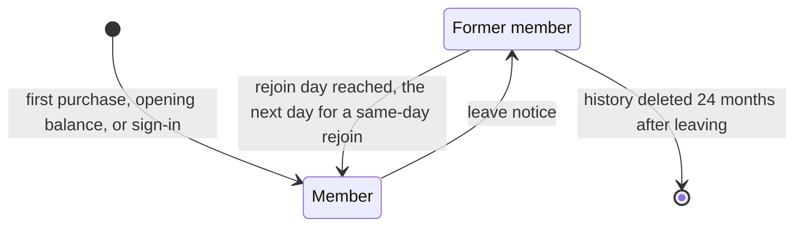
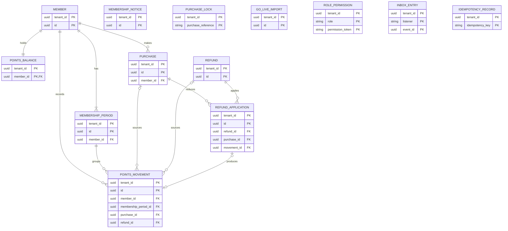
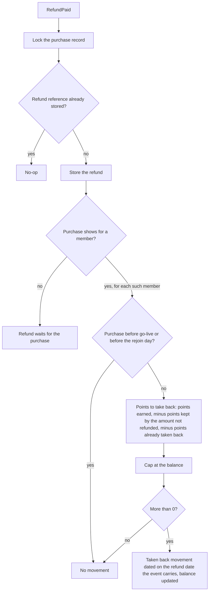

<!--
CHUNK: 13e
TITLE: Detailed Service Spec - loyalty-points
PROJECT: Refunds Platform
VERSION: 1.6
DEPENDS_ON: 09, 07, 10 (event hub - topic names, event names, and payload contracts must match chunk 10 verbatim), 11 (API contracts - integration endpoints carry their API ID and match chunk 11 verbatim), 12 (roles - permission tokens match chunk 12 verbatim)
PART OF: SDD - Refunds Platform
-->

# 17. Detailed Service Specs

---

## 17.5 loyalty-points

### What

The module that owns the points ledger of Loyalty Points: members and their membership state, points movements (Earned, Taken back, Opening balance, Corrected), the balance, corrections by the Loyalty Administrator, the monthly corrections report, and the retention of former-member history. It realises [LOYALTY/UC-01](../brd-loyalty-points/06a-use-cases-member.md#uc-01-view-points-balance), [LOYALTY/UC-02](../brd-loyalty-points/06a-use-cases-member.md#uc-02-view-points-history), and [LOYALTY/UC-03](../brd-loyalty-points/06b-use-cases-loyalty-administrator.md#uc-03-correct-a-members-points), following the rules of [LOYALTY 03 § Points movement](../brd-loyalty-points/03-definitions-and-domain-concepts.md#points-movement) and [LOYALTY 03 § Membership end and data retention](../brd-loyalty-points/03-definitions-and-domain-concepts.md#membership-end-and-data-retention).

### Boundaries

- **Owns:** members (by member number) with their membership periods and the membership notices received, purchases as reported for each member, paid refunds waiting for or applied to a purchase, points movements, balances, the go-live import record.
- **Does not own:** refund requests and payouts (refund-requests, payouts); member identities and membership decisions (member sign-in, INT-04); staff roles (staff sign-in, INT-05); purchases at the source (POS Records). The refund facts it receives are owned by refund-requests.
- **Upstream consumers:** Loyalty Points web (members, Loyalty Administrators); POS Records (API-07); the member sign-in and membership notices (API-08); the go-live import (API-09); refund-requests (event `RefundPaid`).
- **Downstream dependencies:** none outside its schema.

### Input

| Type | Source | Description |
|------|--------|-------------|
| REST | Loyalty Points web (member) | Balance, history, one movement |
| REST | Loyalty Points web (Loyalty Administrator) | Member lookup, correction, monthly corrections report |
| REST (external inbound) | POS Records: API-07 | A member purchase: member number, purchase reference, purchase date, branch, amount paid |
| REST (external inbound) | Member sign-in and membership: API-08 | A member left or rejoined, with the date |
| REST (external inbound) | Points balances at go-live: API-09 | Each member's points at the start of the go-live date, once |
| Event | refund-requests: `RefundPaid` | Takes back the points of a paid refund |
| Schedule | `former-member-retention`, daily | Deletes former-member history 24 months after the member left |
| Schedule | `waiting-refund-check`, daily | Applies any waiting refund whose purchase shows, with an alert for each, and deletes any refund still waiting at the end of its retention period (Retention Policy) |
| Schedule | `balance-invariant-check`, daily | Compares each balance with the sum of its movements |

### Business Logic

Every movement and its balance change commit in one transaction, so the balance always equals the sum of the movements since the member last joined (LOYALTY/NFR-01).

- **Membership** ([LOYALTY 03 § Membership end and data retention](../brd-loyalty-points/03-definitions-and-domain-concepts.md#membership-end-and-data-retention)): API-08 notices open and close membership periods, in the order of their dates (membership model below). A member who left has no balance and gets no new movements; a member who rejoins starts at 0 and counts only the movements from the rejoin day; a rejoin on the day of leaving starts the next day, and the person counts as a former member until then. The signed-in member is the member number in the token (API-10); a token without a member number, or a former member, gets [LOYALTY/UC-01](../brd-loyalty-points/06a-use-cases-member.md#uc-01-view-points-balance) E2 and [LOYALTY/UC-02](../brd-loyalty-points/06a-use-cases-member.md#uc-02-view-points-history) E2.
- **Earning** ([LOYALTY 03 § Movement types](../brd-loyalty-points/03-definitions-and-domain-concepts.md#movement-types), Earned): each API-07 purchase is stored for its member and earns 1 point per 1 EUR paid after discounts, rounded down per purchase. A purchase earns once per member, however often it is reported ([LOYALTY 03 § Structure](../brd-loyalty-points/03-definitions-and-domain-concepts.md#structure)). No movement is added for 0 points, for a purchase dated before the go-live date, or for a purchase dated before the day the member last rejoined ([LOYALTY 03 § Membership end and data retention](../brd-loyalty-points/03-definitions-and-domain-concepts.md#membership-end-and-data-retention)). A purchase reported while the member counts as a former member is kept and earns when a rejoin notice makes its date count, even when that notice arrives later (LOYALTY/NFR-03).
- **Take-back** ([LOYALTY/UC-02](../brd-loyalty-points/06a-use-cases-member.md#uc-02-view-points-history) BR-1: take back on paid refunds): the listener for `RefundPaid` stores the refund once per refund reference and applies it to every member whose purchase has that purchase reference. For each, the purchase keeps the points its amount not refunded earns and the rest is taken back, less the points already taken back (BR-3: partial refunds keep the points of the amount not refunded; BR-4: only points the purchase earned); a take-back never takes the balance below 0 (BR-6: capped at the balance); a purchase dated before the rejoin day or before go-live takes nothing back (BR-7: no take-back before the rejoin day; BR-8: no take-back before go-live). A refund whose purchase does not show yet waits and is applied when the purchase shows (BR-5: take-back recorded when the purchase shows). The movement is dated on the refund date that `RefundPaid` carries.
- **One purchase at a time:** every step on one purchase (an API-07 report, a `RefundPaid` take-back, applying a waiting refund, a correction that names a missing purchase) first takes a row lock on the purchase record keyed by (`tenant_id`, purchase reference), inserting it when absent, in the same transaction, so each step sees the committed result of the one before it. A daily `waiting-refund-check` job applies any waiting refund whose purchase shows and raises an alert for each one it finds, as a check that the lock works. The same job deletes a refund still waiting at the end of its retention period (Retention Policy), under the purchase lock.
- **Opening balance** ([LOYALTY/UC-02](../brd-loyalty-points/06a-use-cases-member.md#uc-02-view-points-history) A5; [LOYALTY 03 § Movement types](../brd-loyalty-points/03-definitions-and-domain-concepts.md#movement-types)): the one-off API-09 import records one Opening balance movement per member who held points at the start of the go-live date, dated on the go-live date; a member with 0 points gets none. The import runs again safely: a member who already has an Opening balance movement gets no second one.
- **Balance** ([LOYALTY/UC-01](../brd-loyalty-points/06a-use-cases-member.md#uc-01-view-points-balance) steps 1-2, A1, E1): `GET /v1/points-balance` returns the balance and the date of the newest movement; a member with no movements gets 0 and how points are earned (A1). When the balance cannot be read, the answer is an error, never 0 or an old figure (E1). The screen states that points for a new purchase show by the end of the purchase day (BR-2: the screen says when new points show). A daily `balance-invariant-check` job compares each balance with the sum of the movements of the member's current period and raises an alert for any difference (LOYALTY/NFR-01).
- **History** ([LOYALTY/UC-02](../brd-loyalty-points/06a-use-cases-member.md#uc-02-view-points-history) steps 1-4, A1 to A5, E1): `GET /v1/points-movements` returns the movements since the member last joined, newest first by the day of the purchase or refund, 20 per page; `GET /v1/points-movements/{movementId}` returns where one movement came from. Refunds (A1), corrections with their reason and any purchase reference (A3), and the opening balance (A5) carry their labels; when the history cannot be read completely the answer is an error, never part of it (E1). The web app shows where to report a problem (A4).
- **Corrections** ([LOYALTY/UC-03](../brd-loyalty-points/06b-use-cases-loyalty-administrator.md#uc-03-correct-a-members-points) steps 1-4, E1 to E6): `GET /v1/members/{memberNumber}/points` finds a current member (a former member gives no match, E1) and returns the balance and history since the member last joined. `POST /v1/members/{memberNumber}/point-corrections` takes the points to add or remove and a reason, or a missing purchase (reference, date, branch, amount paid) and a reason. It refuses a correction with no reason (E2), a removal larger than the balance with the most that can be removed (E3), a missing purchase that already shows in any member's history (E4), dated before the day the member last rejoined (E5), or dated before go-live (E6). It records who made the correction and when (BR-3: who and when recorded), and the correction is dated on the day it is made in the tenant's business time zone (§6 Time rule). A missing purchase earns points by the earning rule and counts as that member's purchase: a later report for the same member earns nothing more, a report for another member earns as usual, and refunds use the amount the administrator entered for this member and the amount POS Records reported for the other member (BR-4: the corrected purchase counts as shown; BR-5: another member earns as usual; BR-6: refunds use the entered amount).
- **Monthly corrections report** ([LOYALTY 09](../brd-loyalty-points/09-reporting-and-analytics.md#reporting--analytics)): `GET /v1/point-correction-reports/{month}` lists every correction of the month, the month taken in the tenant's business time zone (§6 Time rule), with the member, points, reason, who, and when, as JSON, CSV, or Excel. It counts corrections, not distinct upheld complaints; the business complaint tally stays with the LOYALTY owner outside this product ([LOYALTY 09](../brd-loyalty-points/09-reporting-and-analytics.md#reporting--analytics)).
- **Retention** ([LOYALTY 03 § Membership end and data retention](../brd-loyalty-points/03-definitions-and-domain-concepts.md#membership-end-and-data-retention)): former-member history is never shown in [LOYALTY/UC-01](../brd-loyalty-points/06a-use-cases-member.md#uc-01-view-points-balance), [LOYALTY/UC-02](../brd-loyalty-points/06a-use-cases-member.md#uc-02-view-points-history), or [LOYALTY/UC-03](../brd-loyalty-points/06b-use-cases-loyalty-administrator.md#uc-03-correct-a-members-points) and is deleted by the `former-member-retention` job 24 months after the member left; a deletion request does not shorten the period.

**State machine (if applicable):**

**Figure 26: State Machine - membership**

**Summary:** A member is created when first seen and becomes a former member on a leave notice; a rejoin makes them a member again from the rejoin day, or from the next day when they rejoin on the day they left. A former member's history is deleted 24 months after they left.

This state machine is the persisted membership model: `member` holds the current state and `membership_period` one row per period. A member first seen through a purchase, an opening balance, or a sign-in gets an open period with no start date, a member since before the platform knew them; one first seen through a leave notice gets a closed period that ends on the leave date, and one first seen through a rejoin notice gets a period from the rejoin day. A rejoin opens a new period from the rejoin day, or from the next day when it is dated on the day of leaving. Notices are stored once per member number, type, and date and applied in date order, so a notice that arrives late lands at its date. Every movement belongs to the period it was recorded in.

### Output

| Type | Destination | Description |
|------|-------------|-------------|
| REST response | Loyalty Points web | Balance, history page, movement detail, member points, correction result, monthly report |
| REST response | POS Records, member sign-in, go-live import (API-07, API-08, API-09) | Acknowledgements |

### Integrations

| Integration | Direction | Protocol | Purpose | Contract | Failure Handling |
|-------------|-----------|----------|---------|----------|------------------|
| POS Records | Inbound, provider route (§11.6) | Provider feed | Member purchases | API-07 (§15) | Idempotent by purchase reference and member; the sender retries |
| Member sign-in and membership | Inbound, provider route (§11.6) | Provider notices | Leave and rejoin dates | API-08 (§15) | Idempotent by member number, type, and date; the sender retries |
| Member sign-in, through Keycloak | Inbound, sync, in the token | Brokered identity | Which member is signed in | API-10 (§15) | No member number in the token: E2 |
| Staff sign-in, through Keycloak | Inbound, sync, in the token | Brokered identity | The Loyalty Administrator role | API-11 (§15) | No role: 403 |
| Points balances at go-live | Inbound, once, provider route (§11.6) | Import | Opening balances | API-09 (§15) | Idempotent per member; can run again |
| refund-requests | Inbound, async | In-process event | Paid refunds | `RefundPaid` (§14.10) | Redelivered from the publication log; applied once per refund reference |

### DB Modeling

#### Entity Relationship

**Figure 27: Entity Relationship - loyalty-points**

**Summary:** A member has membership periods, one balance, purchases, and movements; each movement belongs to a period and may come from a purchase, a Taken back movement also from its refund, and paid refunds reach purchases through refund applications, each naming the movement it produced. Notices, purchase locks, import runs, role permissions, the inbox, and idempotency records stand alone.

#### Tables Design

| Table | Column | Type | Constraints | Notes |
|-------|--------|------|-------------|-------|
| `member` | `tenant_id`, `id` | uuid, uuid | PK (`tenant_id`, `id`), NOT NULL | `id` is UUIDv7 |
| `member` | `member_number` | varchar(32) | NOT NULL; unique (`tenant_id`, `member_number`) | From API-07, API-08, API-09, or the token |
| `member` | `status` | varchar(8) | NOT NULL; MEMBER or FORMER | |
| `member` | `left_on` | date | NULL unless FORMER | |
| `member` | `created_at`, `created_by`, `updated_at`, `updated_by`, `version` | per §11.1 | NOT NULL | |
| `membership_period` | `tenant_id`, `id` | uuid, uuid | PK (`tenant_id`, `id`), NOT NULL | |
| `membership_period` | `member_id` | uuid | NOT NULL; FK (`tenant_id`, `member_id`) to `member`; index (`tenant_id`, `member_id`, `starts_on`) | |
| `membership_period` | `starts_on` | date | NULL for a member since before first sight | |
| `membership_period` | `ends_on` | date | NULL while open | |
| `membership_notice` | `tenant_id`, `id` | uuid, uuid | PK (`tenant_id`, `id`), NOT NULL | |
| `membership_notice` | `member_number`, `notice_type`, `effective_on` | varchar(32), varchar(6), date | NOT NULL; type LEAVE or REJOIN; unique (`tenant_id`, `member_number`, `notice_type`, `effective_on`) | API-08 idempotency |
| `membership_notice` | `received_at` | timestamptz | NOT NULL | |
| `purchase_lock` | `tenant_id`, `purchase_reference` | uuid, varchar(64) | PK (`tenant_id`, `purchase_reference`), NOT NULL | Locked first by every step on one purchase |
| `purchase` | `tenant_id`, `id` | uuid, uuid | PK (`tenant_id`, `id`), NOT NULL | |
| `purchase` | `member_id` | uuid | NOT NULL; FK (`tenant_id`, `member_id`) to `member` | |
| `purchase` | `purchase_reference` | varchar(64) | NOT NULL; unique (`tenant_id`, `purchase_reference`, `member_id`) | Earns once per member |
| `purchase` | `purchase_date`, `branch_id` | date, varchar(32) | NOT NULL | Date as POS Records delivers it |
| `purchase` | `amount_paid`, `currency` | numeric(19,4), char(3) | NOT NULL | EUR, after discounts |
| `purchase` | `source` | varchar(10) | NOT NULL; POS or CORRECTION | A missing purchase entered by an administrator is CORRECTION |
| `purchase` | `status` | varchar(10) | NOT NULL; EARNED, NO_POINTS, or HELD; index (`tenant_id`, `member_id`, `status`) | HELD while the member counts as a former member |
| `purchase` | `points_earned`, `points_taken_back` | integer, integer | NOT NULL; 0 or more | |
| `purchase` | `created_at`, `created_by`, `updated_at`, `updated_by`, `version` | per §11.1 | NOT NULL | |
| `refund` | `tenant_id`, `id` | uuid, uuid | PK (`tenant_id`, `id`), NOT NULL | |
| `refund` | `refund_reference` | varchar(16) | NOT NULL; unique (`tenant_id`, `refund_reference`) | Stored once per refund reference |
| `refund` | `purchase_reference` | varchar(64) | NOT NULL; index (`tenant_id`, `purchase_reference`, `status`) | |
| `refund` | `paid_amount`, `currency`, `refund_date` | numeric(19,4), char(3), date | NOT NULL | From `RefundPaid` |
| `refund` | `status` | varchar(8) | NOT NULL; WAITING or APPLIED | |
| `refund` | `received_at` | timestamptz | NOT NULL | |
| `refund_application` | `tenant_id`, `id` | uuid, uuid | PK (`tenant_id`, `id`), NOT NULL | |
| `refund_application` | `refund_id`, `purchase_id` | uuid, uuid | NOT NULL; FKs to `refund` and `purchase`; unique (`tenant_id`, `refund_id`, `purchase_id`); index (`tenant_id`, `purchase_id`) | Applied once per member purchase |
| `refund_application` | `points_taken_back` | integer | NOT NULL; 0 or more | |
| `refund_application` | `movement_id` | uuid | NULL when nothing was taken back, or after the movement it named was deleted with former-member history (Retention Policy); FK (`tenant_id`, `movement_id`) to `points_movement`; index (`tenant_id`, `movement_id`) | |
| `refund_application` | `applied_at` | timestamptz | NOT NULL | |
| `points_movement` | `tenant_id`, `id` | uuid, uuid | PK (`tenant_id`, `id`), NOT NULL | Append-only |
| `points_movement` | `member_id`, `membership_period_id` | uuid, uuid | NOT NULL; FKs to `member` and `membership_period`; index (`tenant_id`, `member_id`, `movement_date`); index (`tenant_id`, `membership_period_id`) | |
| `points_movement` | `movement_type` | varchar(16) | NOT NULL; EARNED, TAKEN_BACK, OPENING_BALANCE, or CORRECTED; index (`tenant_id`, `movement_type`, `recorded_at`); unique (`tenant_id`, `member_id`) where OPENING_BALANCE | |
| `points_movement` | `points` | integer | NOT NULL; not 0 | Signed |
| `points_movement` | `movement_date` | date | NOT NULL | Purchase date, refund date, go-live date, or correction day (§6 Time rule) |
| `points_movement` | `purchase_id`, `refund_id` | uuid, uuid | NULL unless the movement comes from them; `purchase_id` FK (`tenant_id`, `purchase_id`) to `purchase` and `refund_id` FK (`tenant_id`, `refund_id`) to `refund`; index (`tenant_id`, `purchase_id`) and index (`tenant_id`, `refund_id`) | |
| `points_movement` | `reason`, `corrected_by_staff_id` | varchar(500), varchar(64) | NULL unless CORRECTED | |
| `points_movement` | `recorded_at`, `created_by` | timestamptz, varchar(64) | NOT NULL | |
| `points_balance` | `tenant_id`, `member_id` | uuid, uuid | PK (`tenant_id`, `member_id`); FK to `member`; NOT NULL | |
| `points_balance` | `balance` | integer | NOT NULL; 0 or more | |
| `points_balance` | `newest_movement_date` | date | NULL until the first movement of the current period | |
| `points_balance` | `updated_at`, `version` | timestamptz, integer | NOT NULL | |
| `go_live_import` | `tenant_id`, `id` | uuid, uuid | PK (`tenant_id`, `id`), NOT NULL | One row per run |
| `go_live_import` | `started_at`, `status` | timestamptz, varchar(10) | NOT NULL; RUNNING, COMPLETED, or FAILED | |
| `go_live_import` | `finished_at`, `members_imported`, `points_total` | timestamptz, integer, bigint | NULL while RUNNING | |
| `role_permission` | `tenant_id`, `role`, `permission_token` | uuid, varchar(40), varchar(80) | PK (`tenant_id`, `role`, `permission_token`), NOT NULL | Seed of §16.12.1 |
| `inbox_entry` | `tenant_id`, `listener`, `event_id` | uuid, varchar(80), uuid | PK (`tenant_id`, `listener`, `event_id`), NOT NULL | One row per event a listener handled |
| `inbox_entry` | `status`, `attempts`, `updated_at` | varchar(8), integer, timestamptz | NOT NULL; status DONE or PARKED | |
| `inbox_entry` | `last_error_code` | varchar(64) | NULL unless a run failed | |
| `idempotency_record` | `tenant_id`, `idempotency_key` | uuid, varchar(64) | PK (`tenant_id`, `idempotency_key`), NOT NULL | |
| `idempotency_record` | `request_hash`, `response_status`, `response_body`, `created_at` | varchar(64), integer, jsonb, timestamptz | NOT NULL | The first response, replayed (§11.1); a reused key with another body answers 409 `CONFLICT` |

#### Migration Strategy

- **Tool:** Flyway, versioned SQL in the module's own location for the `loyalty_points` schema (§11.1).
- **Backward compatibility:** additive changes; expand, then contract for a breaking change.
- **Data backfill:** a separate versioned migration, run before the code that reads the new column.
- **Rollback:** a forward fix migration; no down scripts.

#### Retention Policy

- Former-member history (`membership_period` of the ended membership, its `points_movement` rows, the member's `purchase` rows dated in that period, or after it and before the day the member next rejoined (HELD purchases included), with their `refund_application` rows): deleted 24 months after the member left ([LOYALTY 03 § Membership end and data retention](../brd-loyalty-points/03-definitions-and-domain-concepts.md#membership-end-and-data-retention)); a deletion request does not shorten the period. Each deletion removes the rows that refer to others first: the refund applications, then the movements, then the purchases, the refunds left with no application, and the period. A refund application that the deletion keeps, because its purchase is dated in a later membership, but that names one of the period's movements has its `movement_id` cleared before the movements are deleted.
- `member`, `points_balance`: kept while the person is a member; a former member's rows are deleted with their last membership period.
- `membership_notice`: deleted with the membership period it opened or closed.
- `purchase`, `refund_application`, `points_movement` of current members: kept while the person is a member.
- `refund`: deleted with its last refund application; a refund that never finds its purchase is deleted 24 months after its refund date.
- `purchase_lock`: deleted with the last purchase and refund of its purchase reference.
- `go_live_import`: kept; it holds counts only.
- `role_permission`: the seed of the running release.
- `inbox_entry`: DONE rows deleted after 30 days; PARKED rows kept until the §20.1.3 procedure closes them.
- `idempotency_record`: deleted 24 hours after creation.

#### Archival

- **Cold storage:** Not applicable: history is deleted at the end of the retention period, not archived.
- **Format:** Not applicable.
- **Schedule:** Not applicable.
- **Restore SLA:** Not applicable.

#### Data Encryption

- **At rest:** the database volume encryption of the hosting.
- **In transit:** TLS 1.2 or later (§11.6).
- **Key management:** Vault for the inbound credentials, rotation per §11.6.
- **PII columns:** the member number; the purchase reference, date, branch, and amount of each purchase; the refund reference, purchase reference, amount, and date of each refund, waiting or applied; correction reasons; the Loyalty Administrator id of each correction; masked in every non-production environment, each purchase reference to the same value in every table, so waiting refunds still find their purchases in a masked copy.

### Multi-Tenancy Specifications

- **Strategy override:** None: shared schema with `tenant_id`, PostgreSQL, and the §11.4 instrumentation, as §11 sets.
- **Tenant filter:** `tenant_id` from the token, the inbound credentials, or the event (§11.2); member numbers are unique within a tenant.
- **Cross-tenant queries:** forbidden; the three jobs run per tenant from the tenant registry (§11.2); their retention steps run for every tenant in the registry, whatever its status.

### API Standards

- **Style:** REST (ADR-04).
- **Versioning:** URI prefix `/v1`; inbound feed paths follow the providers' schemes, `TBD - external`.
- **Authentication:** Keycloak tokens for members and Loyalty Administrators; the providers' schemes on the inbound feeds (§15.1), behind the provider routes of §11.6.
- **Idempotency:** the correction POST takes an `Idempotency-Key`; inbound feeds are idempotent by their business keys.
- **Pagination:** page and size, 20 movements by default ([LOYALTY 11 § UI/UX Expectations](../brd-loyalty-points/11-summary-and-uiux.md#uiux-expectations)).
- **Error envelope:** per the §15.1 error model.

#### List of APIs (Swagger-friendly)

| Method | Path | Summary | Request Body | Response | Permission token (§16) | API ID (§15) |
|--------|------|---------|--------------|----------|------------------------|--------------|
| GET | `/v1/points-balance` | Own balance and newest movement date ([LOYALTY/UC-01](../brd-loyalty-points/06a-use-cases-member.md#uc-01-view-points-balance)) | - | `PointsBalanceResponse` | `loyalty-points.balance.read-own` | - |
| GET | `/v1/points-movements` | Own history, newest first ([LOYALTY/UC-02](../brd-loyalty-points/06a-use-cases-member.md#uc-02-view-points-history) steps 1-2) | - | `PointsMovementPage` | `loyalty-points.movement.read-own` | - |
| GET | `/v1/points-movements/{movementId}` | Where one movement came from ([LOYALTY/UC-02](../brd-loyalty-points/06a-use-cases-member.md#uc-02-view-points-history) steps 3-4) | - | `PointsMovementDetailResponse` | `loyalty-points.movement.read-own` | - |
| GET | `/v1/members/{memberNumber}/points` | Find a member: balance and history ([LOYALTY/UC-03](../brd-loyalty-points/06b-use-cases-loyalty-administrator.md#uc-03-correct-a-members-points) steps 1-2) | - | `MemberPointsResponse` | `loyalty-points.member.read` | - |
| POST | `/v1/members/{memberNumber}/point-corrections` | Record a correction ([LOYALTY/UC-03](../brd-loyalty-points/06b-use-cases-loyalty-administrator.md#uc-03-correct-a-members-points) steps 3-4) | `PointCorrectionRequest` | `PointCorrectionResponse` | `loyalty-points.correction.create` | - |
| GET | `/v1/point-correction-reports/{month}` | Monthly corrections report, JSON, CSV, or Excel ([LOYALTY 09](../brd-loyalty-points/09-reporting-and-analytics.md#reporting--analytics)) | - | `CorrectionReport` | `loyalty-points.correction-report.read` | - |
| TBD | TBD | Receive member purchases | Provider-defined | Provider-defined | - | API-07 |
| TBD | TBD | Receive membership changes | Provider-defined | Provider-defined | - | API-08 |
| TBD | TBD | Receive opening balances | Provider-defined | Provider-defined | - | API-09 |

**Request and response fields**

| Schema | Field | Type | Required | Constraints | Description |
|--------|-------|------|----------|-------------|-------------|
| `PointsBalanceResponse` | `balance`, `hasMovements` | integer, boolean | Yes | Balance 0 or more | A1 when `hasMovements` is false |
| `PointsBalanceResponse` | `newestMovementDate` | date | When the member has movements | - | Step 2 |
| `PointsMovementPage` | `items`, `page`, `size`, `totalElements` | array, integer, integer, integer | Yes | Size 20 by default; newest first by `movementDate` | Each item: `movementId`, `movementType`, `points`, `movementDate` |
| `PointsMovementDetailResponse` | `movementId`, `movementType`, `points`, `movementDate` | UUIDv7, enum, integer, date | Yes | - | Steps 3-4 |
| `PointsMovementDetailResponse` | `purchaseReference`, `branchId`, `amountPaid`, `refundReference`, `reason` | string, string, `Money`, string, string | When the movement has them | - | Where it came from (A1, A3, A5) |
| `MemberPointsResponse` | `memberNumber`, `balance`, `movements` | string, integer, `PointsMovementPage` | Yes | Query `page`, `size` | Steps 1-2 |
| `PointCorrectionRequest` | `kind`, `reason` | enum POINTS, MISSING_PURCHASE; string | Yes | Reason 1 to 500 characters (E2) | |
| `PointCorrectionRequest` | `points` | integer | For POINTS | Not 0; a removal not larger than the balance (E3) | Points to add or remove |
| `PointCorrectionRequest` | `purchaseReference`, `purchaseDate`, `branchId`, `amountPaid` | string, date, string, `Money` | For MISSING_PURCHASE | Not already shown (E4); date not before the rejoin day (E5) or go-live (E6) | The missing purchase |
| `PointCorrectionResponse` | `movementId`, `points`, `balance`, `recordedBy`, `recordedAt` | UUIDv7, integer, integer, string, timestamp | Yes | - | Step 4 |
| `CorrectionReport` | `month`, `rows` | string (YYYY-MM), array | Yes | Query `format` json, csv, or xlsx | Each row: `memberNumber`, `points`, `reason`, `recordedBy`, `recordedAt` |

### Event-Driven Architecture (If Applicable)

#### Event Model

**Published events:**

Not applicable - no integration events.

**Consumed events:**

Not applicable - no integration events.

**In-process domain events (modules only):**

| Event | Publisher module | Listener modules | Transaction phase (before commit / after commit) | Payload (DTO) | Notes |
|---|---|---|---|---|---|
| `RefundPaid` | refund-requests | notifications, loyalty-points | after commit | `RefundPaidDto`: tenantId, correlationId, refundRequestId, referenceNumber, customerAccountId, branchId, branchCountry, purchaseReference, paidAmount (Money), refundDate, partialReason (optional), paidAt | Here: points take-back |

#### Messaging Infra

Not applicable - no integration events.

### Constraints

- Authorization ([LOYALTY 07](../brd-loyalty-points/07-users-use-cases-matrix.md#users--use-cases-matrix)): [LOYALTY/UC-01](../brd-loyalty-points/06a-use-cases-member.md#uc-01-view-points-balance) and [LOYALTY/UC-02](../brd-loyalty-points/06a-use-cases-member.md#uc-02-view-points-history) are open to role MEMBER for its own points only (matrix footnote 1) with `loyalty-points.balance.read-own` and `loyalty-points.movement.read-own`; [LOYALTY/UC-03](../brd-loyalty-points/06b-use-cases-loyalty-administrator.md#uc-03-correct-a-members-points) is open to role LOYALTY_ADMINISTRATOR for all members with `loyalty-points.member.read` and `loyalty-points.correction.create`; the monthly corrections report needs `loyalty-points.correction-report.read`, held by LOYALTY_ADMINISTRATOR only ([LOYALTY 09](../brd-loyalty-points/09-reporting-and-analytics.md#reporting--analytics)).
- One member never sees another member's points, and a staff member without the Loyalty Administrator role opens neither [LOYALTY/UC-03](../brd-loyalty-points/06b-use-cases-loyalty-administrator.md#uc-03-correct-a-members-points) nor the report (LOYALTY/NFR-07).
- Members' personal data is handled under the GDPR; the Data Protection Officer owns the rules (LOYALTY/NFR-07).

### Error Handling

- **Synchronous APIs:** Problem Details per §15.1 with a plain-language `detail`.
- **Validation errors:** 400 `VALIDATION_FAILED`, for example a correction with no reason ([LOYALTY/UC-03](../brd-loyalty-points/06b-use-cases-loyalty-administrator.md#uc-03-correct-a-members-points) E2).
- **Domain errors:** [LOYALTY/UC-01](../brd-loyalty-points/06a-use-cases-member.md#uc-01-view-points-balance) E1 and [LOYALTY/UC-02](../brd-loyalty-points/06a-use-cases-member.md#uc-02-view-points-history) E1 -> 503 `POINTS_UNAVAILABLE`, with no figure or partial history; [LOYALTY/UC-01](../brd-loyalty-points/06a-use-cases-member.md#uc-01-view-points-balance) E2 and [LOYALTY/UC-02](../brd-loyalty-points/06a-use-cases-member.md#uc-02-view-points-history) E2 -> 404 `NO_LOYALTY_ACCOUNT`; [LOYALTY/UC-03](../brd-loyalty-points/06b-use-cases-loyalty-administrator.md#uc-03-correct-a-members-points) E1 -> 404 `MEMBER_NOT_FOUND`; E3 -> 422 `REMOVAL_EXCEEDS_BALANCE` with the most that can be removed (`maxRemovable`); E4 -> 422 `PURCHASE_ALREADY_SHOWS`; E5 -> 422 `PURCHASE_BEFORE_REJOIN`; E6 -> 422 `PURCHASE_BEFORE_GO_LIVE`.
- **Auth errors:** 401 `UNAUTHENTICATED`; 403 `FORBIDDEN` for a staff member without the role (LOYALTY/NFR-07).
- **Server errors:** 500 `INTERNAL_ERROR`.
- **Async consumers:** the `RefundPaid` listener records each event in `inbox_entry` and applies each refund reference once; inbound feeds apply each business key once.
- **Poison messages:** a listener run that fails is retried by the `publication-resubmit` job (§11.1); after 10 failed runs the listener parks the event (`inbox_entry` PARKED), completes the publication, and raises an alert, and §20.1.3 replays it. An inbound feed record (API-07, API-08, API-09) that cannot be applied is answered with an error so that the sender retries it (`TBD - external`), and raises an alert. The three jobs work one member or one refund per transaction; a failing one is logged by its id and retried at the next run. Rows still held 2 days after their retention period raise an alert (`retention_overdue_rows`, §20.1.16).

### Observability & Monitoring

#### Logging

- JSON per §11.4.
- Fields: correlation id, movement type, outcome; never the member number with history at INFO.
- Retention per §11.4.

#### Metrics

| Metric | Type | Labels | Purpose |
|--------|------|--------|---------|
| `points_movements_total` | counter | `type` | Movements by type |
| `purchase_reports_total` | counter | `outcome` | API-07 reports that earned, earned nothing, were held, or repeated |
| `purchase_feed_last_report_age_seconds` | gauge | `branch` | Time since the last API-07 report per branch (purchase-feed lag, R-13) |
| `refunds_waiting` | gauge | - | Paid refunds waiting for their purchase |
| `waiting_refunds_applied_by_check_total` | counter | - | Waiting refunds the daily check applied |
| `retention_overdue_rows` | gauge | `kind` | Former-member history and waiting refunds still held after their retention period (Retention Policy) |
| `balance_mismatches_total` | counter | - | Balances that differ from the sum of their movements (LOYALTY/NFR-01) |
| `points_read_duration_seconds` | histogram | `endpoint` | Balance and history response time (LOYALTY/NFR-04, LOYALTY/NFR-05) |

#### Tracing

- OpenTelemetry spans for each endpoint, each inbound feed call, and each listener run.
- Trace context from the gateway.
- Sampling per §11.4.

### Developer Notes

- **Recommended patterns:** one ledger service applies every movement with its balance change; integer points; date rules compare business dates as given by the sources; every step on one purchase takes the purchase lock first.
- **Avoid:** computing a balance by summing at read time on the hot path; reading the refund-requests schema; turning a UTC time into a business date (§6 Time rule).
- **Testing:** JUnit 5 for every acceptance criterion of [LOYALTY/UC-02](../brd-loyalty-points/06a-use-cases-member.md#uc-02-view-points-history) and [LOYALTY/UC-03](../brd-loyalty-points/06b-use-cases-loyalty-administrator.md#uc-03-correct-a-members-points) as table-driven cases; Testcontainers with PostgreSQL for the listener, the feeds, notices out of order, and the races that the purchase lock closes.

### Service-Level Diagrams

#### Implementation Flow Chart

**Figure 28: Implementation Flow - loyalty-points**

**Summary:** A paid refund locks its purchase record, is stored once, and is applied to each member whose purchase shows, or waits for the purchase. The take-back is the earned points minus the points the amount not refunded keeps and minus earlier take-backs, capped at the balance, and no movement is added for 0.

#### Sequence Diagram (Service-Internal)

Not applicable - the module's interactions are in §8.5.2, §8.5.4, and §8.5.5; there is no further internal step to show.

### Compliance

- **GDPR:** applies: member numbers with their purchase and refund history, paid refunds waiting for their purchase (refund reference, purchase reference, amount, and refund date), and correction reasons are personal data under the GDPR (LOYALTY/NFR-07). Retention windows and erasure: the Retention Policy. Access: members see their own balance and history in [LOYALTY/UC-01](../brd-loyalty-points/06a-use-cases-member.md#uc-01-view-points-balance) and [LOYALTY/UC-02](../brd-loyalty-points/06a-use-cases-member.md#uc-02-view-points-history). Lawful basis: contract (GDPR Art. 6(1)(b)) under the loyalty program's terms, owned by the Data Protection Officer (LOYALTY/NFR-07). Two parts of this processing run without a current membership: former-member history and paid refunds waiting for their purchase, which include refunds of customers who are not members, each kept for its period of the Retention Policy. The lawful basis of these two parts is legitimate interests (GDPR Art. 6(1)(f)): settling refunds and complaints within the retention period, owned by the Data Protection Officer (LOYALTY/NFR-07). Purchases reported for a person who counts as a former member are also kept without a current membership, as HELD, so that a rejoin notice that arrives later can make them earn (Earning; [LOYALTY 03 § Membership end and data retention](../brd-loyalty-points/03-definitions-and-domain-concepts.md#membership-end-and-data-retention)); their lawful basis is legitimate interests (GDPR Art. 6(1)(f)): crediting the points of a purchase that a later rejoin notice makes count (LOYALTY/NFR-03), owned by the Data Protection Officer (LOYALTY/NFR-07). An earlier erasure of former-member history is refused under GDPR Art. 17(3)(e), the establishment, exercise, or defence of legal claims, for the refunds and complaints settled within its retention period, owned by the Data Protection Officer (LOYALTY/NFR-07). The Loyalty Administrator id of each correction is staff data (§11.6). Access and portability requests (GDPR Art. 15 and 20): §20.1.15.
- **PCI-DSS:** Not applicable: no card data is handled.
- **ISO 27001 / SOC 2:** neither BRD requires a certification; the controls of §11.6 apply.
- **Local regulations:** the GDPR, owned by the Data Protection Officer (LOYALTY/NFR-07).

### Deployment Strategy

- **Service-specific override:** None - a module of the one deployable (§11.3).
- **Replicas:** those of the deployable (§11.3); each job runs on one replica under the job lock.
- **Strategy:** rolling, with the deployable.
- **Health checks:** the deployable's liveness and readiness probes.
- **Rollback:** Helm rollback of the deployable.

### Future Enhancements

- Export the history ([LOYALTY/UC-02](../brd-loyalty-points/06a-use-cases-member.md#uc-02-view-points-history) Future Enhancements).

<!-- MASTER: refunds-platform-sdd-master.md | PREV: 13d-service-notifications.md | NEXT: 14-performance-and-capacity.md -->
