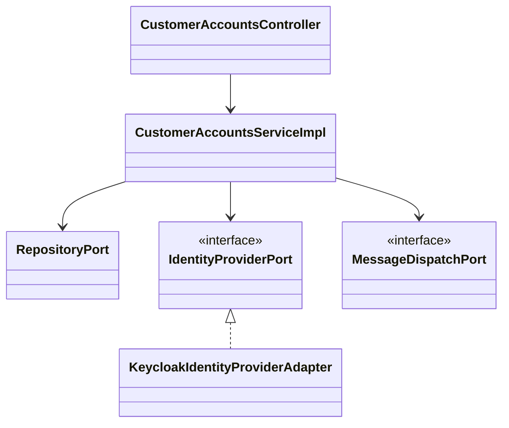
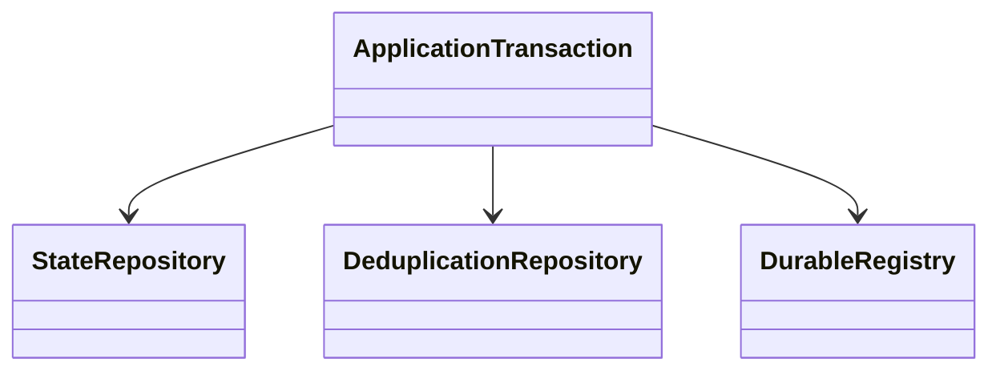
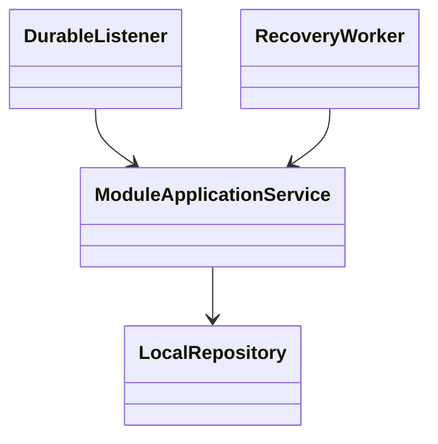
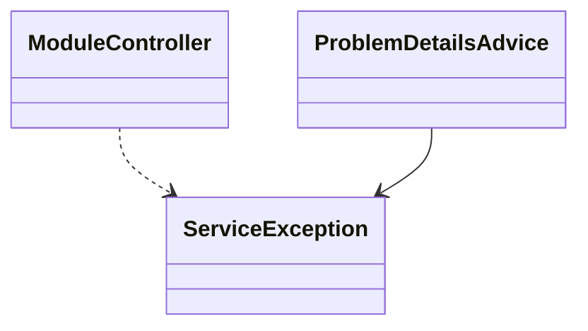
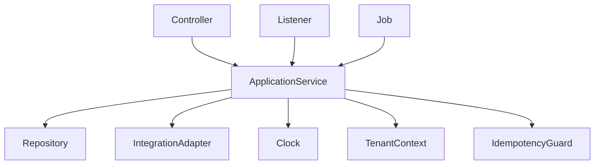
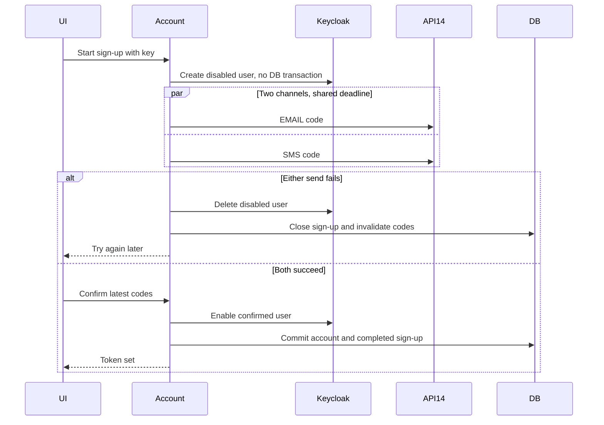

<!--
CHUNK: 04
TITLE: Per-Service Implementation - customer-accounts
PROJECT: Refunds Platform
VERSION: 1.4
PART OF: LLD - Refunds Platform
MODE: from-sdd
-->

# 7. Per-Service Implementation - customer-accounts

> **Bounded context:** [SDD §17 customer-accounts](../../sdd-refunds-platform/13a-service-customer-accounts.md)
>
> **Type:** module, in the single refunds-platform deployable.
>
> **Source code:** Not applicable - Greenfield from-sdd build target.
>
> **Owns use cases (SDD 09):** [REFUNDS/UC-06](../../brd-refunds-portal/06a-use-cases-customer.md#uc-06-sign-up-and-sign-in)
>
> **Participates in:** See event participation in §7.2.

## 7.1 Responsibility

Create and close customer accounts, confirm addresses, reset passwords, and provide current contacts through its owned port. Keycloak owns credentials. Contract and scope home: [SDD §17 customer-accounts](../../sdd-refunds-platform/13a-service-customer-accounts.md).

## 7.2 Class & Interface Map

> Confirm: customer-accounts class names and method signatures are proposed; verify during implementation against [SDD §17 customer-accounts](../../sdd-refunds-platform/13a-service-customer-accounts.md).

### Controllers

| Class | Endpoints | Notes |
| --- | --- | --- |
| CustomerAccountsController | `POST /v1/sign-ups` | `@UseCase("REFUNDS/UC-06")` |
| CustomerAccountsController | `POST /v1/sign-ups/{signUpId}/confirmation` | None - section-derived endpoint |
| CustomerAccountsController | `POST /v1/sign-ups/{signUpId}/codes` | None - section-derived endpoint |
| CustomerAccountsController | `POST /v1/password-resets` | `@UseCase("REFUNDS/UC-06")` |
| CustomerAccountsController | `POST /v1/password-resets/{passwordResetId}/confirmation` | None - section-derived endpoint |
| CustomerAccountsController | `GET /v1/customer-accounts/me` | None - endpoint not in SDD section 7.3 entry-point register |
| CustomerAccountsEventListener | `Event: RefundRequestSubmitted` | None - participating or platform listener |
| CustomerAccountsEventListener | `Event: RefundRequestUnlinked` | None - participating or platform listener |
| CustomerAccountsEventListener | `Event: CustomerAccountClosed` | None - participating or platform listener |
| CustomerAccountsJob | `Schedule: account-closure` | None - system workflow |
| CustomerAccountsJob | `Schedule: keycloak-user-reconciliation` | None - system workflow |

### Services (interfaces)

| Interface | Purpose | Implementations |
| --- | --- | --- |
| CustomerAccountsService | Create and close customer accounts, confirm addresses, reset passwords, and provide current contacts through its owned port. Keycloak owns credentials. | CustomerAccountsServiceImpl |

### Service Implementations

| Class | Implements | Key methods |
| --- | --- | --- |
| CustomerAccountsServiceImpl | CustomerAccountsService | See method-level algorithm below |
| CustomerAccountsEventListener | Durable listener adapter | RefundRequestSubmitted, RefundRequestUnlinked, CustomerAccountClosed |
| CustomerAccountsJob | Tenant-aware runner | account-closure, keycloak-user-reconciliation |

### Repositories

| Class | Entity | Notes |
| --- | --- | --- |
| CustomerAccountRepository | customer_account | Module-owned schema; tenant filter + RLS; see §8.2 |
| SignUpRepository | sign_up | Module-owned schema; tenant filter + RLS; see §8.2 |
| PasswordResetRepository | password_reset | Module-owned schema; tenant filter + RLS; see §8.2 |
| ConfirmationCodeRepository | confirmation_code | Module-owned schema; tenant filter + RLS; see §8.2 |
| RolePermissionRepository | role_permission | Module-owned schema; tenant filter + RLS; see §8.2 |
| InboxEntryRepository | inbox_entry | Module-owned schema; tenant filter + RLS; see §8.2 |
| IdempotencyRecordRepository | idempotency_record | Module-owned schema; tenant filter + RLS; see §8.2 |

### Domain Types (records)

Key signatures above use source DTO names; Subject, TenantContext, PageQuery, KeycloakUserId, SignInEvent, TokenSet and verified provider command types are proposed implementation records. Domain records and validations use the exact DTO names in [SDD §17 customer-accounts](../../sdd-refunds-platform/13a-service-customer-accounts.md). Persistence entities map only that module's §8.2 tables. `Money` is EUR decimal(19,4); `Clock`, tenant context and publication identity are injected, not read from static state.

### Method Signatures (key methods only)

```java
public interface CustomerAccountsService {
  SignUpResponse startSignUp(SignUpRequest command, TenantContext tenant, IdempotencyKey key);
  SignUpConfirmationResponse confirm(UUID signUpId, SignUpConfirmationRequest command, TenantContext tenant, IdempotencyKey key);
  NewCodeResponse issueCode(UUID signUpId, NewCodeRequest command, TenantContext tenant, IdempotencyKey key);
  PasswordResetResponse reset(PasswordResetRequest command, TenantContext tenant, IdempotencyKey key);
  PasswordResetConfirmationResponse confirmReset(UUID resetId, PasswordResetConfirmationRequest command, TenantContext tenant, IdempotencyKey key);
  CustomerAccountResponse currentAccount(Subject caller, TenantContext tenant);
}

public interface IdentityProviderPort {
  KeycloakUserId createDisabledUser(TenantContext tenant, String email, String password);
  void enableCustomer(TenantContext tenant, KeycloakUserId user, UUID customerAccountId);
  void disableUser(TenantContext tenant, KeycloakUserId user);
  void deleteUser(TenantContext tenant, KeycloakUserId user);
  void setPassword(TenantContext tenant, KeycloakUserId user, String newPassword);
  List<SignInEvent> readSignInEvents(TenantContext tenant, Instant since);
  TokenSet obtainFirstTokenSet(TenantContext tenant, String email, String password);
}
```

`IdentityProviderPort` carries the Keycloak admin and token calls of [SDD §17 customer-accounts](../../sdd-refunds-platform/13a-service-customer-accounts.md) Output: `enableCustomer` sets the CUSTOMER role, the `customer_account_id` attribute and the tenant attribute, then enables the user; `obtainFirstTokenSet` uses the confidential client `refunds-platform-sign-in`. Passwords pass through and are never stored or logged.

### Ports and Adapters (in-process contracts)

| Port interface | Operation | API ID (§15) | Role here | Adapter class |
| --- | --- | --- | --- | --- |
| CustomerContactPort | getContact | API-12 | Provider | CustomerContactPortAdapter |
| MessageDispatchPort | sendNow | API-14 | Caller and interface owner | MessageDispatchPortAdapter in notifications |
| IdentityProviderPort | createDisabledUser, enableCustomer, disableUser, deleteUser, setPassword, readSignInEvents, obtainFirstTokenSet | None - platform IAM, SDD §15.1 | Caller and interface owner | KeycloakIdentityProviderAdapter in customer-accounts, wrapped by the keycloakAdmin instance ([§12.3](../09-cross-cutting.md#123-resilience-downstream-calls)) |

Contract home: [SDD §15](../../sdd-refunds-platform/11-api-contracts.md); binding view: [§9.6](../06-api-contracts.md#96-in-process-port-contracts-sdd-15). No HTTP resilience wrapper around an in-process port. `IdentityProviderPort` is not a §15 contract: Keycloak is platform infrastructure with no `API-NN` ([SDD §15.1](../../sdd-refunds-platform/11-api-contracts.md#151-contract-conventions-platform-defaults)), so only its Keycloak adapter, an outside call, takes the keycloakAdmin instance.

### Authorization

| Entry point | Kind | Permission token (SDD §16, verbatim) | Enforcement point |
| --- | --- | --- | --- |
| `POST /v1/sign-ups` | REST | `None - public` | Method permission plus subject/branch guard; public route rate limit |
| `POST /v1/sign-ups/{signUpId}/confirmation` | REST | `None - public` | Method permission plus subject/branch guard; public route rate limit |
| `POST /v1/sign-ups/{signUpId}/codes` | REST | `None - public` | Method permission plus subject/branch guard; public route rate limit |
| `POST /v1/password-resets` | REST | `None - public` | Method permission plus subject/branch guard; public route rate limit |
| `POST /v1/password-resets/{passwordResetId}/confirmation` | REST | `None - public` | Method permission plus subject/branch guard; public route rate limit |
| `GET /v1/customer-accounts/me` | REST | `customer-accounts.profile.read` | Method permission plus subject/branch guard; public route rate limit |
| Event: RefundRequestSubmitted | Listener | None - system consumer | Trusted durable publication, explicit tenant context |
| Event: RefundRequestUnlinked | Listener | None - system consumer | Trusted durable publication, explicit tenant context |
| Event: CustomerAccountClosed | Listener | None - system consumer | Trusted durable publication, explicit tenant context |
| Schedule: account-closure | Job | None - system job | Job lock and per-tenant transaction |
| Schedule: keycloak-user-reconciliation | Job | None - system job | Job lock and per-tenant transaction |
| CustomerContactPort.getContact | Port | `customer-accounts.contact.read` | Fixed module identity guard in adapter |

## 7.3 Method-Level Pseudocode (non-trivial logic only)

Source: [SDD §17 customer-accounts](../../sdd-refunds-platform/13a-service-customer-accounts.md) Business Logic.

> Confirm: customer-accounts pseudocode combines the stated algorithm with inferred lock/transaction wiring; verify failure and concurrency paths in PostgreSQL integration tests.

### CustomerAccountsServiceImpl.startSignUp and confirm

```text
startSignUp(command, key): validate host tenant, formats, notice version and rate limits.
  Reserve the tenant/key operation; repeat the saved first response or reject a changed hash.
  With no DB transaction, create a disabled Keycloak user (500 ms budget).
  Generate independent cryptographic six-digit codes; persist hashes and latest-code metadata,
  with one sent_at read from the business clock in that write and expires_at = sent_at + CODE_TTL.
  Send EMAIL and SMS concurrently through MessageDispatchPort within one shared 2 s deadline.
  On either failure, close the sign-up, invalidate both codes and delete the disabled user.
  Persist the replayable outcome; never persist a password or a cleartext code.
confirm(signUpId, codes, password, key): lock sign-up and current codes in the tenant transaction.
  Reject expired, used or superseded codes; compare hashes in constant time.
  Increment wrong_entries durably on a bad code; fifth bad entry ends that code.
  After both checks, with no DB transaction, set password, CUSTOMER role and tenant attribute,
  then enable the Keycloak user. Commit account + COMPLETED sign-up + used codes together.
  If that commit fails, disable the user; reconciliation is the crash safety net.
  Return the first token set from refunds-platform-sign-in; never include credentials in logs.
```

### CustomerAccountsServiceImpl.reset and scheduled reconciliation

```text
reset(email, key): return the same outward reset-id shape for an existing or absent account.
  For an existing account, enforce three resets/account/hour and five codes/address/hour.
  Send the latest email code through API-14; share the E1 and E3 code failure paths.
confirmReset: validate current code; update Keycloak password outside a DB transaction;
  mark reset completed and code used; obtain token set using the dedicated sign-in client.
hourly reconcile: disable enabled users without accounts; delete orphan disabled users.
daily closure: first ingest Keycloak sign-in events (source keeps them seven days).
  Lock account; close only after two years without sign-in and linked_request_count == 0.
  Clear contacts and Keycloak id, commit CLOSED + CustomerAccountClosed publication atomically.
  The durable closure consumer deletes the Keycloak user after commit, retrying on failure.
RefundRequestSubmitted/RefundRequestUnlinked: apply count +1/-1 with tenant/listener/event inbox;
  count and inbox commit together, never decrement twice on redelivery.
```

The confirmation failure update must commit before returning the domain error; throwing from the mutation transaction would erase the attempt counter. Code issuance and validation serialize on the sign-up or reset row and on the destination guard: a transaction-scoped PostgreSQL advisory lock (`pg_advisory_xact_lock`) on a 64-bit key derived from (`tenant_id`, `destination_hash`), the bounded guard of [§12.2](../09-cross-cutting.md#122-idempotency), taken before the latest-code read, the hourly counts and, for a sign-up, the pending sign-up lookup; a request that issues to two destinations (the email address and the mobile number of a sign-up) takes the two locks in ascending `destination_hash` order. Every code row takes its `sent_at` from the business clock when it is written, in the transaction before its API-14 call, and `expires_at` is `sent_at` plus `CODE_TTL` ([§13.1](../10-operations.md#131-configuration-per-service)); both codes of a sign-up share that instant, so the one `codesExpireAt` of `SignUpResponse` is their `expires_at`. Cross-system steps use explicit transaction templates, not a transaction around the whole method.

## 7.4 Design Patterns Applied

### Pattern: Hexagonal composition

**Applied rule:** CLAUDE.md composition over inheritance; SDD §6 requires hexagonal modules and isolated data, and [SDD §17 customer-accounts](../../sdd-refunds-platform/13a-service-customer-accounts.md#developer-notes) Developer Notes recommend the ports `IdentityProviderPort` (Keycloak) and `MessageDispatchPort`. **Rationale:** transport/provider adapters cannot reach another module's persistence, and the code rules are tested against ports the module owns. **Roles:** CustomerAccountsServiceImpl is the application context; repositories, `IdentityProviderPort` (implemented by `KeycloakIdentityProviderAdapter`) and `MessageDispatchPort` (API-14, implemented in notifications) are injected.



**Summary:** The application service composes persistence, the identity provider port and the message dispatch port through constructor injection. The Keycloak adapter implements the identity port in this module; each concrete adapter stays in its module.

```text
Controller validates transport input -> application port
Application validates domain command -> owned repository / permitted integration port
Adapters translate transport errors; domain raises ServiceException with stable code
```

### Pattern: Durable outbox and idempotent work

**Applied rule:** CLAUDE.md at-least-once consumer idempotency and mandatory outbox for emitted state changes. **Rationale:** committed state cannot lose its downstream publication; redelivery cannot create duplicate provider work. **Roles:** application transaction owns state and inbox; platform.event_publication is the atomic registry; module worker owns provider acknowledgement.



**Summary:** State and deduplication commit together. Any outgoing durable event joins that same commit; provider acknowledgement completes separate work.

```text
BEGIN tenant transaction
lock business key; reject changed idempotency hash or detect applied event
write aggregate + inbox/replay + any outgoing durable publication
COMMIT; only then call an external provider; persist acknowledged result separately
worker: load due source work with stable key/payload; send outside transaction
if acknowledged: commit source work completion; if state changed meanwhile, keep new work due
if failed/timed out: keep work incomplete and retry same identity with source backoff
crash after acknowledgement before completion: resend original identity; provider dedup contract required
```

### Pattern: Choreography and local compensation

**Applied rule:** CLAUDE.md event-driven choreography for cross-boundary business transactions, no distributed 2PC. **Rationale:** module commits survive external failure without a transaction crossing providers. **Roles:** the named module application service commits its local step; stable listeners and source workers advance the next step. This module's steps and compensation are: Account confirmation enables a Keycloak user; on account commit failure disable it, and source reconciliation closes/deletes orphan users. Refund request count consumers commit inbox/count together.



**Summary:** This is source choreography with local commit/retry boundaries, not a new central orchestrator. Compensation is limited to the source actions stated above.

```text
onSourceEvent: begin tenant transaction; dedupe source identity; apply guarded local step
commit local state + inbox + any source-defined outgoing publication
onFailure: rollback local step; retry original source identity through the source schedule
onGiveUp: source terminal failure/park + alert; do not invent a reverse business transition
```

### Pattern: Central RFC 9457 boundary adapter

**Applied rule:** CLAUDE.md global RestControllerAdvice and base ServiceException. **Rationale:** the module controller cannot leak provider/SQL/PII internals while the domain retains stable source errorCode. **Roles:** module controller invokes application service; shared ProblemDetailsAdvice translates ServiceException; §7.7 supplies the module mapping.



**Summary:** Advice is shared deployable infrastructure; the module owns its domain errors and user scope checks.

```text
catch ServiceException at HTTP boundary -> source status/code + sanitized ProblemDetails
catch unexpected exception -> sanitized server failure + traceId; log no PII payload
port/listener errors remain typed and obey their source transaction/retry rules
```

## 7.5 Dependency Injection Graph



**Summary:** Backend wiring uses constructor injection only. Runtime modules share the injected clock and platform transaction/tenant infrastructure, not their repositories.

## 7.6 Transaction Boundaries

| Method | Propagation | Isolation | Rollback rules |
| --- | --- | --- | --- |
| CustomerAccountsServiceImpl mutation | REQUIRED | READ_COMMITTED + source row locks/version checks | Any failure rolls back state + inbox/replay + publication |
| CustomerAccountsServiceImpl read | REQUIRED read-only | REPEATABLE_READ for balance/history or multi-query snapshot | No fallback data on failure |
| CustomerAccountsEventListener | Own REQUIRED after publisher commit | READ_COMMITTED | Retry only after rollback; completion after durable work commit |
| CustomerAccountsJob | One explicit tenant transaction per unit of work | READ_COMMITTED | Provider calls outside transaction; finally restore context |


> Confirm: transaction propagation and read snapshot isolation are implementation choices; ports use the SDD contract verbatim in §9.6. Fault-test lock order and rollback visibility.

Business errors that must persist counters/outcomes use an outcome record committed before the transport layer raises the error. No REQUIRES_NEW publication insert. No whole-workflow database transaction across external calls.

## 7.7 Error Handling

| Exception | RFC 9457 type | errorCode (SDD §15.1) | HTTP Status | When thrown | Caller action |
| --- | --- | --- | --- | --- | --- |
| NotFoundServiceException | urn:refunds-platform:problem:not-found | NOT_FOUND | 404 | Scoped row absent | Correct reference; do not reveal another tenant |
| ValidationServiceException | urn:refunds-platform:problem:validation | VALIDATION_FAILED | 400 / 422 per source endpoint | Payload/domain rule invalid | Explain fix; no raw code displayed |
| ConflictServiceException | urn:refunds-platform:problem:conflict | CONFLICT | 409 | Changed key/hash, stale version or business-key race | Refetch; retain key for exact retry |
| UnavailableServiceException | urn:refunds-platform:problem:unavailable | UNAVAILABLE | 503 | Dependency/read unavailable | Try later; no invented data |

Domain-specific errors and statuses remain as [SDD §17 customer-accounts](../../sdd-refunds-platform/13a-service-customer-accounts.md) Error Handling and [SDD §15](../../sdd-refunds-platform/11-api-contracts.md) specify. Port errors are raised domain errors, not HTTP statuses. `ServiceException` is translated centrally.

## 7.8 Use-Case Workflows

### REFUNDS/UC-06: Sign Up and Sign In

> **Traceability:** BRD [REFUNDS/UC-06](../../brd-refunds-portal/06a-use-cases-customer.md#uc-06-sign-up-and-sign-in) · SDD [§7.3](../../sdd-refunds-platform/03-users-and-use-cases.md#73-use-case-traceability-brd--sdd) · Owner: customer-accounts · Entry points: `POST /v1/sign-ups`, `POST /v1/password-resets` · UAT/BAT: [REFUNDS/TC-ACC-01](../../brd-refunds-portal/16-uat-bat-test-cases.md#1-sign-up-and-sign-in-uc-06-uc-04-mk-04-mk-03), [REFUNDS/TC-ACC-02](../../brd-refunds-portal/16-uat-bat-test-cases.md#1-sign-up-and-sign-in-uc-06-uc-04-mk-04-mk-03), [REFUNDS/TC-ACC-03](../../brd-refunds-portal/16-uat-bat-test-cases.md#1-sign-up-and-sign-in-uc-06-uc-04-mk-04-mk-03), [REFUNDS/TC-ACC-04](../../brd-refunds-portal/16-uat-bat-test-cases.md#1-sign-up-and-sign-in-uc-06-uc-04-mk-04-mk-03), [REFUNDS/TC-ACC-05](../../brd-refunds-portal/16-uat-bat-test-cases.md#1-sign-up-and-sign-in-uc-06-uc-04-mk-04-mk-03), [REFUNDS/TC-ACC-06](../../brd-refunds-portal/16-uat-bat-test-cases.md#1-sign-up-and-sign-in-uc-06-uc-04-mk-04-mk-03), [REFUNDS/TC-ACC-07](../../brd-refunds-portal/16-uat-bat-test-cases.md#1-sign-up-and-sign-in-uc-06-uc-04-mk-04-mk-03), [REFUNDS/TC-ACC-08](../../brd-refunds-portal/16-uat-bat-test-cases.md#1-sign-up-and-sign-in-uc-06-uc-04-mk-04-mk-03), [REFUNDS/TC-ACC-09](../../brd-refunds-portal/16-uat-bat-test-cases.md#1-sign-up-and-sign-in-uc-06-uc-04-mk-04-mk-03), [REFUNDS/TC-ACC-10](../../brd-refunds-portal/16-uat-bat-test-cases.md#1-sign-up-and-sign-in-uc-06-uc-04-mk-04-mk-03), [REFUNDS/TC-ACC-11](../../brd-refunds-portal/16-uat-bat-test-cases.md#1-sign-up-and-sign-in-uc-06-uc-04-mk-04-mk-03), [REFUNDS/TC-ACC-12](../../brd-refunds-portal/16-uat-bat-test-cases.md#1-sign-up-and-sign-in-uc-06-uc-04-mk-04-mk-03), [REFUNDS/TC-ACC-13](../../brd-refunds-portal/16-uat-bat-test-cases.md#1-sign-up-and-sign-in-uc-06-uc-04-mk-04-mk-03), [REFUNDS/TC-ACC-14](../../brd-refunds-portal/16-uat-bat-test-cases.md#1-sign-up-and-sign-in-uc-06-uc-04-mk-04-mk-03), [REFUNDS/TC-ACC-15](../../brd-refunds-portal/16-uat-bat-test-cases.md#1-sign-up-and-sign-in-uc-06-uc-04-mk-04-mk-03), [REFUNDS/TC-REQ-20](../../brd-refunds-portal/16-uat-bat-test-cases.md#2-refund-requests-uc-01-uc-02-uc-03-mk-01-scr-01-mk-02-scr-02-nfr-04), [REFUNDS/TC-UIX-04](../../brd-refunds-portal/16-uat-bat-test-cases.md#5-cross-cutting-uiux-standards-chunk-11), [REFUNDS/TC-UIX-07](../../brd-refunds-portal/16-uat-bat-test-cases.md#5-cross-cutting-uiux-standards-chunk-11) · Screens: [REFUNDS/MK-04](../../brd-refunds-portal/14-todo.md#mockup-coverage) via `/refunds/sign-up`, `/refunds/sign-in`, `/refunds/password-reset`

**Trigger:** `POST /v1/sign-ups`, `POST /v1/password-resets`; handlers carry `@UseCase("REFUNDS/UC-06")`.

**Pre-conditions:** Public host resolves a configured tenant.

**Post-conditions:** Confirmed account signs in or the stated E1-E4 recovery remains available.

**Control flow:**

1. Show notice before details.
2. Serialize issuance; persist only hashes; create disabled Keycloak user and send both codes concurrently.
3. Confirmation checks both latest codes.
4. A1 sign-in delegates Keycloak; A2 redirects visitor to sign-in/sign-up; A3 reset uses latest email code.
5. E1 allows re-entry/new code; E2 offers sign-in or another email; declining returns to form.
6. E3 closes pending work; E4 permits retry.
7. Details and exception mapping: §7.3 above and [REFUNDS/UC-06](../../brd-refunds-portal/06a-use-cases-customer.md#uc-06-sign-up-and-sign-in).



**Summary:** The immediate code path has a bounded provider wait; account commit and reconciliation protect the separate Keycloak write.

**Idempotency points:** Reads are repeatable; every write requires tenant/key plus request hash and first outcome; listeners use stable publication identity.

**Outbox emission points:** No public lifecycle event; CustomerAccountClosed is an internal retention publication.

**Retry / timeout policy:** Keycloak 500 ms creation; shared API-14/API-05 two-second deadline; no inline send retry.

**Error handling:** §7.7 plus the E/A paths above; all expected results stay in the linked BRD tests.

### Workflow: account-closure

> **Traceability:** No BRD use case - realises [SDD §17 customer-accounts](../../sdd-refunds-platform/13a-service-customer-accounts.md) Input / Business Logic · Entry points: Schedule: account-closure

Acquire database job lock, enumerate the source-defined tenants, set tenant context and process due work through §7.3. Commit each bounded unit; clear context in finally. Provider failure preserves due work and schedules the source backoff. Retention uses source dates and never invents an archive.

### Workflow: keycloak-user-reconciliation

> **Traceability:** No BRD use case - realises [SDD §17 customer-accounts](../../sdd-refunds-platform/13a-service-customer-accounts.md) Input / Business Logic · Entry points: Schedule: keycloak-user-reconciliation

Acquire database job lock, enumerate the source-defined tenants, set tenant context and process due work through §7.3. Commit each bounded unit; clear context in finally. Provider failure preserves due work and schedules the source backoff. Retention uses source dates and never invents an archive.

### Workflow: Supporting platform work

> **Traceability:** No BRD use case - realises [SDD §17 customer-accounts](../../sdd-refunds-platform/13a-service-customer-accounts.md) Business Logic / Retention Policy · Entry points: Event: RefundRequestSubmitted, Event: RefundRequestUnlinked, Event: CustomerAccountClosed

Use the event-specific §7.3 handler, persistent business keys and publication inbox. No new use case is created for reconciliation, provider feeds, internal closure or retention. Each listener installs the publisher tenant and correlation context before any repository call.


<!-- MASTER: ../refunds-platform-lld-master.md | PREV: ../03-architecture.md | NEXT: ../05-data-model.md -->
