<!--
TYPE: Master Index
PROJECT: Refunds Platform
VERSION: 1.4
PART OF: LLD - Refunds Platform
-->

# LLD Master Index - Refunds Platform

## Document Metadata

**Version:** 1.4 | **Status:** Draft | **Mode:** from-sdd | **Date:** 2026-10-07

**Related SDD:** [Refunds Platform 1.8](../sdd-refunds-platform/refunds-platform-sdd-master.md)

**Related BRDs:** [REFUNDS 1.9](../brd-refunds-portal/refunds-portal-brd-master.md), [LOYALTY 1.8](../brd-loyalty-points/loyalty-points-brd-master.md)

**Production bug:** start at [§19.9](./16-references.md#199-use-case-traceability-index).

**Project Type:** Greenfield; SDD-sourced, from-sdd direction.

**Tech Stack snapshot:** Java 21 / Spring Boot 3.5+; Angular 17+ standalone / PrimeNG / Tailwind; PostgreSQL 17+; Spring Modulith durable in-process registry; no broker. Missing pins stay flagged in [§6.3](./03-architecture.md#63-runtime-stack), matching [Specs](./17-specs.md).

## Chunk Index

| File | Purpose |
| --- | --- |
| [00-metadata.md](./00-metadata.md) | Low-Level Design Document - Refunds Platform |
| [01-purpose-and-scope.md](./01-purpose-and-scope.md) | 1. Purpose |
| [02-context.md](./02-context.md) | 5. Context |
| [03-architecture.md](./03-architecture.md) | 6. Architecture Overview |
| [04-implementation/customer-accounts.md](./04-implementation/customer-accounts.md) | 7. Per-Service Implementation - customer-accounts |
| [04-implementation/loyalty-points.md](./04-implementation/loyalty-points.md) | 7. Per-Service Implementation - loyalty-points |
| [04-implementation/notifications.md](./04-implementation/notifications.md) | 7. Per-Service Implementation - notifications |
| [04-implementation/payouts.md](./04-implementation/payouts.md) | 7. Per-Service Implementation - payouts |
| [04-implementation/refund-requests.md](./04-implementation/refund-requests.md) | 7. Per-Service Implementation - refund-requests |
| [05-data-model.md](./05-data-model.md) | 8. Data Model |
| [06-api-contracts.md](./06-api-contracts.md) | 9. API Contracts |
| [07-event-contracts.md](./07-event-contracts.md) | 10. Event Contracts |
| [08-state-and-rules.md](./08-state-and-rules.md) | 11. State Machines & Business Rules |
| [09-cross-cutting.md](./09-cross-cutting.md) | 12. Cross-Cutting Concerns |
| [10-operations.md](./10-operations.md) | 13. Operations |
| [11-security.md](./11-security.md) | 14. Security |
| [12-performance.md](./12-performance.md) | 15. Performance |
| [13-testing.md](./13-testing.md) | 16. Testing |
| [14-frontend.md](./14-frontend.md) | 17. Frontend |
| [15-open-questions.md](./15-open-questions.md) | 18. Open Questions & Flag Index |
| [16-references.md](./16-references.md) | 19. References |
| [17-specs.md](./17-specs.md) | Specs |
| [18-open-items-and-clarifications.md](./18-open-items-and-clarifications.md) | Open Items & Clarifications |
| [decision-log.md](./decision-log.md) | Decision Log - Refunds Platform LLD |

## Strategic Framing

| Chunk | Content |
| --- | --- |
| [01-purpose-and-scope.md](./01-purpose-and-scope.md) | 1. Purpose |
| [02-context.md](./02-context.md) | 5. Context |
| [03-architecture.md](./03-architecture.md) | 6. Architecture Overview |

## Implementation (load-bearing)

| Chunk | Content |
| --- | --- |
| [04-implementation/customer-accounts.md](./04-implementation/customer-accounts.md) | 7. Per-Service Implementation - customer-accounts |
| [04-implementation/loyalty-points.md](./04-implementation/loyalty-points.md) | 7. Per-Service Implementation - loyalty-points |
| [04-implementation/notifications.md](./04-implementation/notifications.md) | 7. Per-Service Implementation - notifications |
| [04-implementation/payouts.md](./04-implementation/payouts.md) | 7. Per-Service Implementation - payouts |
| [04-implementation/refund-requests.md](./04-implementation/refund-requests.md) | 7. Per-Service Implementation - refund-requests |

### Per-Service Sub-Sections (within each `04-implementation/<service>.md`)

§7.1 Responsibility; §7.2 classes, signatures, ports and authorization; §7.3 non-trivial pseudocode; §7.4 attributed patterns; §7.5 constructor wiring; §7.6 transactions; §7.7 errors; §7.8 keyed and platform workflows.

## Contracts & Data

| Chunk | Content |
| --- | --- |
| [05-data-model.md](./05-data-model.md) | 8. Data Model |
| [06-api-contracts.md](./06-api-contracts.md) | 9. API Contracts |
| [07-event-contracts.md](./07-event-contracts.md) | 10. Event Contracts |
| [08-state-and-rules.md](./08-state-and-rules.md) | 11. State Machines & Business Rules |

## Platform Concerns

| Chunk | Content |
| --- | --- |
| [09-cross-cutting.md](./09-cross-cutting.md) | 12. Cross-Cutting Concerns |
| [10-operations.md](./10-operations.md) | 13. Operations |
| [11-security.md](./11-security.md) | 14. Security |
| [12-performance.md](./12-performance.md) | 15. Performance |
| [13-testing.md](./13-testing.md) | 16. Testing |
| [14-frontend.md](./14-frontend.md) | 17. Frontend |

## Audit & Reference

| Chunk | Content |
| --- | --- |
| [15-open-questions.md](./15-open-questions.md) | 18. Open Questions & Flag Index |
| [16-references.md](./16-references.md) | 19. References |
| [17-specs.md](./17-specs.md) | Specs |
| [18-open-items-and-clarifications.md](./18-open-items-and-clarifications.md) | Open Items & Clarifications |

## Confidence & Drift Marker Legend

Confirm marks proposed implementation choices; TODO marks unresolved source detail. Both indexes live in chunk 15. Hybrid/code policy markers do not apply to this from-sdd run. Chunk 18 records reviewer decisions separately.

## Chunk Dependency Graph

```mermaid
flowchart LR
  Sources[SDD 1.8, REFUNDS 1.9, LOYALTY 1.8] --> Architecture
  Architecture --> Modules[Five implementation files]
  Modules --> Contracts[Data and contract binding views]
  Contracts --> Platform[Operations, security, testing and routes]
  Platform --> Trace[Trace reconciliation]
  Trace --> Specs
  Specs --> Review[Separate disk reviewer pass]
  Review --> Index[Flags and master]
```

**Summary:** Source facts drive the body and derived trace; Specs follow the body and review follows Specs. Refreshes target the source-changed chunks and retain decision history.

### Reading Order by Task

Bug: §19.9 -> owner workflow -> linked BRD/TC and spec. Implement module: §6 -> module §7 -> §8/9/10 -> shared concerns -> tests. Operate: §13 -> SDD runbook. Resolve gap: §18 author flags or chunk 18 reviewer item, then its source home.

### Cross-Document Navigation (BRD ↔ SDD ↔ LLD)

The SDD Source BRDs register fixes REFUNDS/LOYALTY keys. Its Child LLDs row points here and records source 1.8. [§19.1](./16-references.md#191-source-documents) records test-suite/mockup state used by this trace. Parent scope/contracts and business behavior remain in their own documents.
