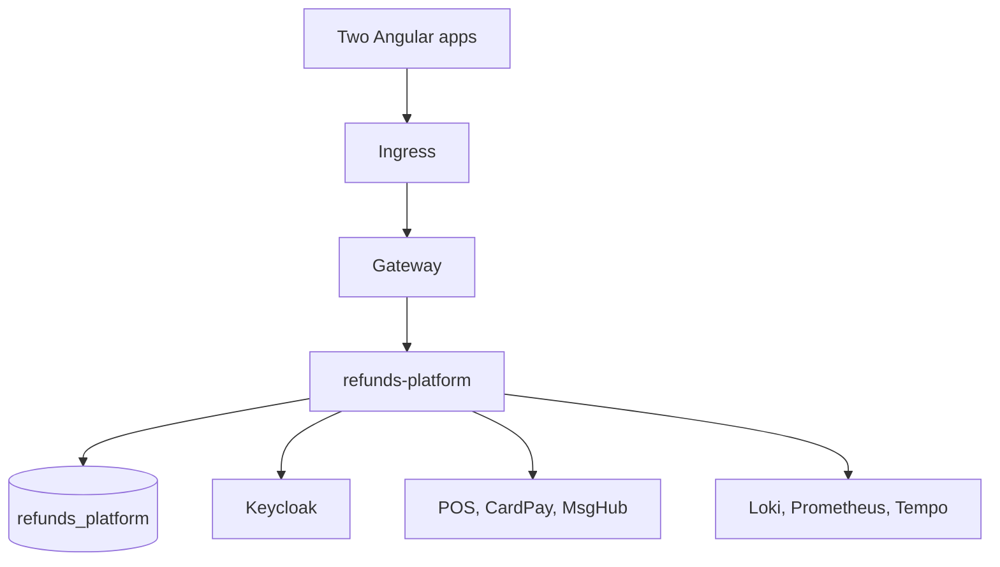

<!--
CHUNK: 03
TITLE: Architecture
PROJECT: Refunds Platform
VERSION: 1.4
PART OF: LLD - Refunds Platform
MODE: from-sdd
-->

# 6. Architecture Overview

## 6.1 Component Topology

**Summary:** One application hosts five modules and uses one PostgreSQL database with private schemas. Only integration traffic leaves the process.

## 6.2 Deployment Topology

| Concern | Choice | Source |
| --- | --- | --- |
| Image/chart | One OCI image; refunds-platform Helm chart | [SDD §11.3](../sdd-refunds-platform/07-cross-cutting-concerns.md) |
| Replicas | At least two over two nodes; one DB job lock | [SDD §11.3](../sdd-refunds-platform/07-cross-cutting-concerns.md) |
| Rollout | No unavailable replicas; expand/contract Flyway before traffic | [SDD §11.3](../sdd-refunds-platform/07-cross-cutting-concerns.md) |

## 6.3 Runtime Stack

Sourced derived view; version ranges remain ranges. The technology cells reproduce SDD §6, with punctuation normalized to the run's text rule. An upstream clarification remains upstream.

| Layer | Technology | Version | Source |
| --- | --- | --- | --- |
| Architecture Doctrine | Modular monolith: one deployable (`refunds-platform`) with five DDD modules (§13); in-process module ports and durable in-process domain events; a publication log as the outbox for every outside call that follows a committed state change (exceptions in §8.1.1); hexagonal structure inside each module | n/a | [SDD §6 Architecture Doctrine](../sdd-refunds-platform/02-ecosystem-overview.md#6-ecosystem-overview) |
| Compute / Infra | Kubernetes, one Helm chart for the one deployable | [NEEDS CLARIFICATION: hosting (an on-premises cluster or a managed cloud Kubernetes service) and the version pins of the cluster stack: Kubernetes, containerd, the ingress controller, Keycloak, Vault, the gateway, and the observability components. Neither BRD names a hosting target.] | [SDD §6 Compute / Infra](../sdd-refunds-platform/02-ecosystem-overview.md#6-ecosystem-overview) |
| Container Runtime | containerd, the cluster runtime | Per Compute / Infra | [SDD §6 Container Runtime](../sdd-refunds-platform/02-ecosystem-overview.md#6-ecosystem-overview) |
| Service Mesh / Ingress | Mesh: Not applicable (one deployable, no network calls between modules). Ingress: NGINX Ingress Controller in front of the API gateway, TLS terminated here | Per Compute / Infra | [SDD §6 Service Mesh / Ingress](../sdd-refunds-platform/02-ecosystem-overview.md#6-ecosystem-overview) |
| Primary RDBMS | PostgreSQL, one database `refunds_platform`, one schema per module plus the `platform` schema for the publication log | 17+ | [SDD §6 Primary RDBMS](../sdd-refunds-platform/02-ecosystem-overview.md#6-ecosystem-overview) |
| Caching | Not applicable for this release | - | [SDD §6 Caching](../sdd-refunds-platform/02-ecosystem-overview.md#6-ecosystem-overview) |
| Event Broker / Streaming | Not applicable for this release | - | [SDD §6 Event Broker / Streaming](../sdd-refunds-platform/02-ecosystem-overview.md#6-ecosystem-overview) |
| Object Storage | Not applicable for this release | - | [SDD §6 Object Storage](../sdd-refunds-platform/02-ecosystem-overview.md#6-ecosystem-overview) |
| IAM / AuthN | Keycloak, one realm: local customer accounts ([REFUNDS/UC-06](../brd-refunds-portal/06a-use-cases-customer.md#uc-06-sign-up-and-sign-in)) and identity brokering to the member sign-in and the staff sign-in ([LOYALTY 08](../brd-loyalty-points/08-integrations.md#integrations)) | Per Compute / Infra | [SDD §6 IAM / AuthN](../sdd-refunds-platform/02-ecosystem-overview.md#6-ecosystem-overview) |
| Secrets Management | HashiCorp Vault | Per Compute / Infra | [SDD §6 Secrets Management](../sdd-refunds-platform/02-ecosystem-overview.md#6-ecosystem-overview) |
| API Gateway | Spring Cloud Gateway | Per Compute / Infra | [SDD §6 API Gateway](../sdd-refunds-platform/02-ecosystem-overview.md#6-ecosystem-overview) |
| CI/CD | [NEEDS CLARIFICATION: CI platform and deployment tool; neither the BRDs nor the CLAUDE.md defaults name one] | - | [SDD §6 CI/CD](../sdd-refunds-platform/02-ecosystem-overview.md#6-ecosystem-overview) |
| Observability: Logging | Structured JSON logs with correlation id, stored in Grafana Loki | Per Compute / Infra | [SDD §6 Observability: Logging](../sdd-refunds-platform/02-ecosystem-overview.md#6-ecosystem-overview) |
| Observability: Metrics | Prometheus + Grafana | Per Compute / Infra | [SDD §6 Observability: Metrics](../sdd-refunds-platform/02-ecosystem-overview.md#6-ecosystem-overview) |
| Observability: Tracing | OpenTelemetry + Grafana Tempo | Per Compute / Infra | [SDD §6 Observability: Tracing](../sdd-refunds-platform/02-ecosystem-overview.md#6-ecosystem-overview) |
| Backend Runtime | Java 21, Spring Boot 3.5+, Spring Modulith (module boundaries and the event publication registry), Resilience4j, Flyway | Java 21; Spring Boot 3.5+ | [SDD §6 Backend Runtime](../sdd-refunds-platform/02-ecosystem-overview.md#6-ecosystem-overview) |
| Frontend Stack | Angular 17+ standalone components, PrimeNG, Tailwind; two apps: Refunds Portal web and Loyalty Points web | Angular 17+ | [SDD §6 Frontend Stack](../sdd-refunds-platform/02-ecosystem-overview.md#6-ecosystem-overview) |
| Reporting / BI | Not applicable for this release | - | [SDD §6 Reporting / BI](../sdd-refunds-platform/02-ecosystem-overview.md#6-ecosystem-overview) |

> TODO: Missing version pin: Spring Modulith - verify compatible exact pin in SDD §6 through sdd-unifier; no local pin.
> TODO: Missing version pin: Resilience4j - verify in SDD §6 through sdd-unifier; no local pin.
> TODO: Missing version pin: Flyway - verify in SDD §6 through sdd-unifier; no local pin.
> TODO: Missing version pin: PrimeNG - verify in SDD §6 through sdd-unifier; no local pin.
> TODO: Missing version pin: Tailwind - verify in SDD §6 through sdd-unifier; no local pin.
> TODO: Missing version pin: Kubernetes - verify in SDD §6 Compute / Infra through sdd-unifier.
> TODO: Missing version pin: containerd - verify in SDD §6 Compute / Infra through sdd-unifier.
> TODO: Missing version pin: NGINX Ingress Controller - verify in SDD §6 Compute / Infra through sdd-unifier.
> TODO: Missing version pin: Keycloak - verify in SDD §6 Compute / Infra through sdd-unifier.
> TODO: Missing version pin: HashiCorp Vault - verify in SDD §6 Compute / Infra through sdd-unifier.
> TODO: Missing version pin: Spring Cloud Gateway - verify in SDD §6 Compute / Infra through sdd-unifier.
> TODO: Missing version pin: Grafana Loki - verify in SDD §6 Compute / Infra through sdd-unifier.
> TODO: Missing version pin: Prometheus - verify in SDD §6 Compute / Infra through sdd-unifier.
> TODO: Missing version pin: Grafana - verify in SDD §6 Compute / Infra through sdd-unifier.
> TODO: Missing version pin: OpenTelemetry - verify in SDD §6 Compute / Infra through sdd-unifier.
> TODO: Missing version pin: Grafana Tempo - verify in SDD §6 Compute / Infra through sdd-unifier.
> TODO: CI platform and deployment tool, plus hosting target, are unspecified - verify at SDD §6; keep configuration portable.

## 6.4 Architectural Style - As Operationalised

Source [SDD ADR-01 to ADR-07](../sdd-refunds-platform/06-principles-and-decisions.md) overrides the microservices default. Verify the acyclic Spring Modulith graph on every build. API-12/13/14 are in-process ports with permission checks, no network resilience. Durable events commit to platform.event_publication with the aggregate. Provider work is persisted by listeners before their completion. Only the five synchronous outside calls of [SDD §8.1.1](../sdd-refunds-platform/04-architecture-style-and-diagrams.md#811-what) leave the process inside a request or job instead of from the publication log; each runs with no database transaction open and with its [§12.3](./09-cross-cutting.md#123-resilience-downstream-calls) timeout, the API-06 one and the Keycloak ones beyond the user creation still open upstream. No Kafka topic, HTTP between modules, distributed 2PC or duplicate per-module outbox is created.

<!-- MASTER: refunds-platform-lld-master.md | PREV: 02-context.md | NEXT: 05-data-model.md -->
