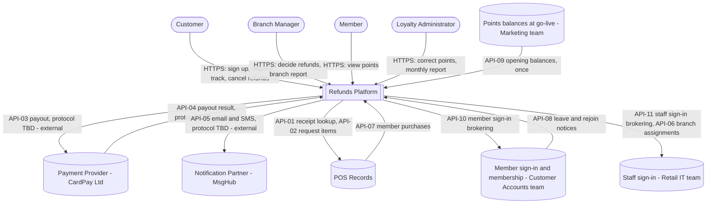
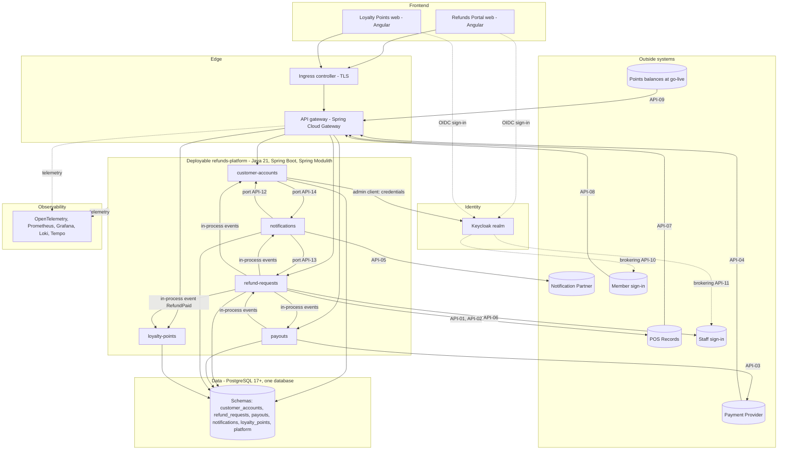

<!--
CHUNK: 04
TITLE: System Design - Architecture Style, Context & HLA Diagrams
PROJECT: Refunds Platform
VERSION: 1.12
DEPENDS_ON: 01, 02
PART OF: SDD - Refunds Platform
-->

# 8. System Design / High-Level Architecture

## 8.1 Architecture Style

### 8.1.1 What

A modular monolith (ADR-01): one Spring Boot deployable, `refunds-platform`, built from five modules, one per bounded context: customer-accounts, refund-requests, payouts, notifications, and loyalty-points (§13). Modules call each other only through in-process ports (§15, type `Internal (in-process)`) and react to durable in-process domain events (§14.10, ADR-02); no module reads another module's schema. Every call to an outside system that follows a committed state change runs from the publication log after commit, never inside the business transaction. Five synchronous outside calls are allowed, each made with no database transaction open and with a timeout: the receipt lookup (API-01), the code sends of API-14 through API-05 (ADR-05), the branch assignment reads (API-06), the Keycloak admin calls of the sign-up request and the Keycloak admin and token calls of the confirmation and password reset requests (§17.1), and the Keycloak admin calls of the `account-closure` and `keycloak-user-reconciliation` jobs (§17.1). §12 holds the timeouts of the first three (the API-06 value is still open there) and of the Keycloak user creation of the sign-up (INT-02). [NEEDS CLARIFICATION: timeout of the Keycloak admin calls of the sign-up request other than the user creation (the deletions of the user of a replaced pending sign-up, of a sign-up closed because a code cannot be sent, and of a sign-up that does not commit), of the Keycloak admin and token calls of the confirmation and password reset requests, and of the Keycloak admin calls of the `account-closure` and `keycloak-user-reconciliation` jobs.] Each module is hexagonal: a domain core, inbound adapters (REST, inbound feeds, event listeners), and outbound adapters (persistence, providers). Synchronous HTTP exists only at the edge: the two web apps and the outside systems reach the deployable through the API gateway.

### 8.1.2 Why

- **Stage and team:** a first production release of two products that will grow, built by one delivery team (§3 Assumption 7; questionnaire Q1, Q2; [REFUNDS 04 § In Scope](../brd-refunds-portal/04-scope-and-personas.md#in-scope), [LOYALTY 04 § Out of Scope](../brd-loyalty-points/04-scope-and-personas.md#out-of-scope)). One deployable keeps operations small, and the module boundaries keep a later split cheap (ADR-01 trigger).
- **Load:** moderate with peaks: about 1,200 requests a month across 40 branches, tripled for about 3 weeks of seasonal sales ([REFUNDS 02 § Facts](../brd-refunds-portal/02-glossary-assumptions-facts.md#facts)). Horizontal replicas of one deployable carry it; no BRD NFR states a separate scaling, failure, or release need for one part.
- **Never lost, never twice:** REFUNDS/NFR-01 and LOYALTY/NFR-01 need exactly-once effects. Local transactions per module plus the publication log give them without distributed transactions.
- **Paid refunds reach loyalty quickly:** LOYALTY expects a paid refund within 15 minutes ([LOYALTY 02 § Assumptions / Constraints](../brd-loyalty-points/02-glossary-assumptions-facts.md#assumptions--constraints), Assumption 3) and its take-back within 1 hour (LOYALTY/NFR-02). Inside one deployable the `RefundPaid` event reaches loyalty-points right after the refund is Paid.

### 8.1.3 How

- **Bounded contexts:** customer-accounts (customer accounts and confirmation codes; [REFUNDS/UC-06](../brd-refunds-portal/06a-use-cases-customer.md#uc-06-sign-up-and-sign-in)); refund-requests (refund requests, decisions, branch scope, branch report; [REFUNDS/UC-01](../brd-refunds-portal/06a-use-cases-customer.md#uc-01-request-a-refund), [REFUNDS/UC-02](../brd-refunds-portal/06a-use-cases-customer.md#uc-02-track-refund-status), [REFUNDS/UC-03](../brd-refunds-portal/06a-use-cases-customer.md#uc-03-cancel-a-refund-request), [REFUNDS/UC-04](../brd-refunds-portal/06b-use-cases-branch-manager.md#uc-04-approve--reject-refund)); payouts (payouts to the original card); notifications (email and SMS); loyalty-points (points ledger, membership, corrections, monthly report; [LOYALTY/UC-01](../brd-loyalty-points/06a-use-cases-member.md#uc-01-view-points-balance), [LOYALTY/UC-02](../brd-loyalty-points/06a-use-cases-member.md#uc-02-view-points-history), [LOYALTY/UC-03](../brd-loyalty-points/06b-use-cases-loyalty-administrator.md#uc-03-correct-a-members-points)).
- **Inter-module communication:** in-process domain events after commit, durable through the publication log (§14.10); three port calls for request-response needs (API-12, API-13, API-14); no HTTP between modules.
- **External communication:** outbound adapters behind ports, with timeouts, retries with backoff and jitter, and circuit breakers (Resilience4j, §12); inbound feeds and callbacks arrive through the gateway at inbound adapters (API-04, API-07, API-08, API-09).
- **Data ownership:** one PostgreSQL database, one schema per module, no cross-schema joins or foreign keys; shared-schema tenancy with `tenant_id` (ADR-03); the publication log lives in the `platform` schema, owned by the deployable runtime.
- **Deployment model:** one container image and one Helm chart on Kubernetes, at least 2 replicas, rolling updates (§11.3); each scheduled job takes a database lock so it runs on one replica.
- **Edge and identity:** ingress, then Spring Cloud Gateway (token validation, rate limits, correlation id), then the deployable; Keycloak issues the tokens (ADR-07).

## 8.2 Context Diagram

**Figure 2: System Context Diagram**

**Summary:** Customers, branch managers, members, and Loyalty Administrators use the platform over HTTPS through two web apps. The platform calls the Payment Provider, the Notification Partner, POS Records, and the two sign-in providers, and receives payout results, member purchases, membership notices, and the one-off opening balances; every outside protocol is `TBD - external` until the provider documentation is supplied (§15.6).

## 8.3 High-Level Architecture Diagram

**Figure 3: High-Level Architecture**

**Summary:** Both web apps reach the one deployable through the ingress and the API gateway and sign in through the Keycloak realm, which brokers the member and staff sign-ins. Inside the deployable the five modules exchange in-process events and three port calls, share one PostgreSQL database with one schema each, and reach the outside systems through their own adapters; there is no broker and no cache.

<!-- MASTER: refunds-platform-sdd-master.md | PREV: 03-users-and-use-cases.md | NEXT: 05-workflows-and-sequences.md -->
