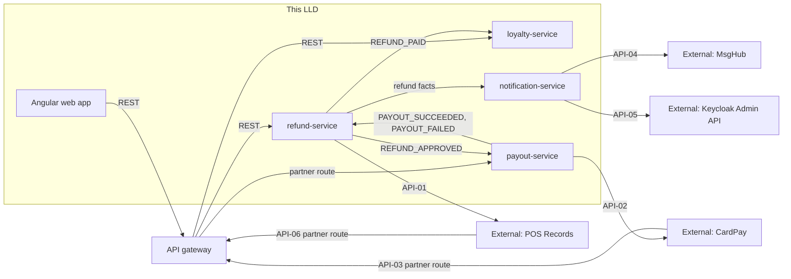

<!--
CHUNK: 02
TITLE: Context - Bounded Context & System Neighbours
PROJECT: Refunds Platform
VERSION: 1.0
PART OF: LLD - Refunds Platform
-->

# 5. Context

## 5.1 Bounded Context

This LLD covers the whole Refunds Platform: four bounded contexts in three deployables ([SDD §8.1.3](../sdd-refunds-platform/04-architecture-style-and-diagrams.md#813-how), ADR-01). refund-service (refund requests, decisions, payout outcome tracking, daily branch report) and loyalty-service (members, points movements, balances) are modules of `refunds-platform-core` with private schemas `refund` and `loyalty`; payout-service (payouts and CardPay attempts) and notification-service (customer and branch-manager messages) are separate deployables with databases `payout` and `notification`. No module or service reads another's tables or calls another synchronously; facts cross boundaries only as events on Kafka (ADR-05).

## 5.2 Upstream Producers (callers / event-publishers into this system)

| Upstream | Interaction | Protocol | Notes |
|----------|-------------|----------|-------|
| Angular web app (customers, members, branch managers) | Sync REST | HTTPS via the API gateway web route | JWT from Keycloak (OIDC code + PKCE); gateway and core both verify it (ADR-07) |
| CardPay (payout results, API-03) | Inbound partner call | HTTPS via the gateway partner route (ADR-11); transport TBD - external | Tenant from the partner key in our path, then signature check |
| POS Records (member purchases, API-06) | Inbound partner call or file | Via the gateway partner route (ADR-11); delivery mode TBD - external | Tenant from the partner key, then signature check |

## 5.3 Downstream Consumers (systems this LLD's services call / publish to)

| Downstream | Interaction | Protocol | Notes |
|------------|-------------|----------|-------|
| POS Records (receipt lookup, API-01) | Sync REST, called by refund-service | HTTPS | Resilience4j timeout, retry (2), circuit breaker, bulkhead (`09-cross-cutting.md` § 12.3) |
| CardPay (payout, API-02) | Sync REST, called by payout-service's scheduler | HTTPS | Same `Idempotency-Key` (payout id) on every attempt (ADR-10) |
| MsgHub (email and SMS, API-04) | Sync REST, called by notification-service | HTTPS | Bulkhead per channel |
| Keycloak Admin API (contacts, API-05) | Sync REST, called by notification-service | HTTPS, client credentials | Tenant check on every read (SDD §11.2) |
| Kafka | Async events | Kafka (TLS) | Topics `refunds-platform-refund-events`, `refunds-platform-payout-events` (SDD §14.4) |

## 5.4 Cross-Service Dependencies (within this LLD)

**Summary:** The web app reaches only the core, through the gateway; the core's refund module is the hub of the event flow, feeding payout-service, notification-service, and the loyalty module, and consuming only payout facts. Each provider is called by exactly one module or service, and both provider pushes enter through the gateway's partner route.

> **Convention:** this diagram is service-level. Class-level wiring lives in `04-implementation/<service>.md`. Event edges are Kafka (outbox to inbox), never a direct call.

## 5.5 Shared Conventions (apply to every service in scope)

- **Auth:** Keycloak, one realm for all tenants; JWT verified at the gateway and again in each deployable (ADR-07); roles map to the permission tokens of [SDD §16.11](../sdd-refunds-platform/12-centralized-user-roles.md#1611-permission--role-matrix-platform-wide) in each module's configuration (ADR-08).
- **Tenant resolution:** the `tenant_id` token claim for user calls; the partner key in our path for API-03 and API-06 (ADR-11); the envelope `tenant_id` for consumers ([SDD §11.2](../sdd-refunds-platform/07-cross-cutting-concerns.md#112-multi-tenancy-default)). No `X-Tenant-Id` header is trusted from a client ([SDD §15.1](../sdd-refunds-platform/11-api-contracts.md#151-contract-conventions-platform-defaults)).
- **Correlation ID:** `X-Correlation-Id` on every call made or received, generated at the gateway when absent, copied into the log MDC as `correlation_id`, into the event envelope `correlation_id`, and into outgoing provider calls; W3C `traceparent` for tracing over HTTP and Kafka headers.
- **Time zone:** UTC for every stored and transmitted timestamp; business calendar rules (refund window, daily report day, take-back parking deadline) use the tenant's IANA time zone from tenant configuration (SDD §6 rules).
- **ID strategy:** UUIDv7 generated at the service layer through `IdGenerator` (CLAUDE.md default, SDD §6).
- **Money:** `BigDecimal` with scale 4 in Java, `numeric(19,4)` in PostgreSQL, JSON strings on the wire, always with an ISO-4217 currency (SDD §6 rules).

<!-- MASTER: refunds-platform-lld-master.md | PREV: 01-purpose-and-scope.md | NEXT: 03-architecture.md -->
