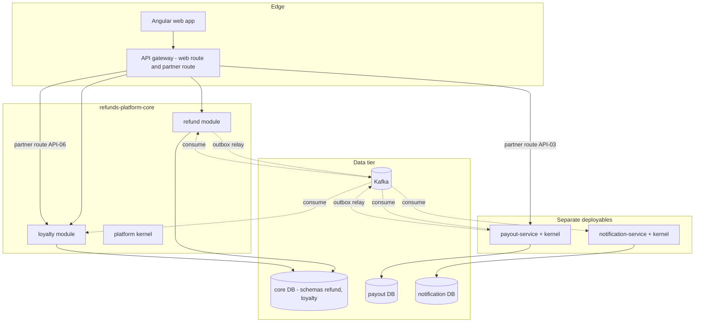

<!--
CHUNK: 03
TITLE: Architecture Overview - Components & Deployment
PROJECT: Refunds Platform
VERSION: 1.0
PART OF: LLD - Refunds Platform
-->

# 6. Architecture Overview

> **Note:** this chunk is a high-level orientation. Per-service detail lives in `04-implementation/<service>.md`. The architecture style, its drivers, and its alternatives are owned by [SDD §8.1](../sdd-refunds-platform/04-architecture-style-and-diagrams.md#81-architecture-style) and ADR-01 and are not restated.

## 6.1 Component Topology

**Summary:** Two publishers (the refund module and payout-service) relay their outboxes to Kafka; four consumer groups read from it. The web app reaches the core through the gateway's web route, and the two provider pushes reach payout-service and the loyalty module through the partner route. Outbound provider calls are drawn in `02-context.md` § 5.4.

## 6.2 Deployment Topology

| Concern | Choice | Source / Rationale |
|---------|--------|--------------------|
| Container | One OCI image per deployable: `refunds-platform-core`, `payout-service`, `notification-service` | [SDD §11.3](../sdd-refunds-platform/07-cross-cutting-concerns.md#113-deployment-default) |
| Orchestrator | On-premises Kubernetes, one Helm chart per deployable (3 charts) | SDD §6, A-2 |
| Namespace strategy | One namespace per environment (Dev, SIT, UAT, Prod) | [SDD §19](../sdd-refunds-platform/15-environments.md#19-environments); namespace naming not pinned |
| Service mesh / Ingress | Ingress controller only, no mesh; the API gateway fronts the core and the partner route | SDD §6 (products not pinned) |
| Replicas (per service, baseline) | Not pinned: SDD §11.3 marks requests, limits, replica minimum and maximum as open | SDD §11.3 |
| Deployment strategy | Rolling update with readiness gates; readiness checks the database only; Flyway runs at startup before readiness | SDD §11.3 |
| Autoscaling | HPA on the core (CPU) and on notification-service (CPU and consumer lag); thresholds not pinned | SDD §11.3, §17.3 |

> TODO: best guess 2 replicas minimum per deployable (so rolling updates and one-pod loss keep REFUNDS/NFR-02), maximum 6 for the core and notification-service, 3 for payout-service - verify with SDD §11.3 once sizing is settled.

## 6.3 Runtime Stack

Derived view of [SDD §6](../sdd-refunds-platform/02-ecosystem-overview.md#6-ecosystem-overview); a value that disagrees with the Source is drift to flag, never a local override.

| Layer | Technology | Version | Source |
|-------|-----------|---------|--------|
| Language | Java | 21 | SDD §6 Backend Runtime (REFUNDS/TI-01) |
| Framework | Spring Boot | 3.5+ | SDD §6 Backend Runtime |
| Build | Maven (multi-module) | Not pinned | LLD assumption A-L01 |
| Database | PostgreSQL | 17+ | SDD §6 Primary RDBMS (REFUNDS/TI-02) |
| Message Broker | Apache Kafka with a JSON Schema registry (additive-only) | Not pinned (SDD §6 open) | SDD §6 Event Broker, ADR-02 |
| Cache | None in this release | - | SDD §6 Caching |
| Auth | Keycloak, one realm | Not pinned (SDD §6 open) | SDD §6 IAM, ADR-07 |
| Migrations | Flyway, versioned SQL | Not pinned | SDD ADR-06, §11.1 |
| Resilience | Resilience4j (Spring Boot 3 integration) | Not pinned | CLAUDE.md default; SDD §12 |
| Messaging client | Spring for Apache Kafka | Managed by Spring Boot | LLD choice |
| Observability | Prometheus metrics, OpenTelemetry tracing, structured JSON logs | Not pinned (SDD §6 open) | SDD §6, §11.4 |
| API gateway | Product not pinned | - | SDD §6 |
| Frontend (if applicable) | Angular (standalone components), PrimeNG, Tailwind, NgRx SignalStore | Angular 17+ | SDD §6 Frontend Stack; CLAUDE.md |

> TODO: best guess Maven as the build tool - verify; the SDD pins neither the build tool nor the Kafka, Keycloak, Flyway, or observability versions (SDD §6 carries `[NEEDS CLARIFICATION]` markers for them).

## 6.4 Architectural Style - As Operationalised

> **Inherits from:** [SDD §8.1 Architecture Style](../sdd-refunds-platform/04-architecture-style-and-diagrams.md#81-architecture-style) (hybrid, EDA, DDD, hexagonal).
>
> **What this section adds:** the concrete operationalisation.

- **Service boundary rule:** one bounded context = one package tree (core modules) or one deployable, with a private schema or database. Core packages: `<base-package>.kernel` (shared), `<base-package>.refund.{domain,application,adapter}` and `<base-package>.loyalty.{domain,application,adapter}`. Adapters are split into `adapter.web`, `adapter.messaging`, `adapter.persistence`, `adapter.partner`, and one package per provider (`adapter.pos`, `adapter.cardpay`, `adapter.msghub`, `adapter.keycloak`).
- **Module isolation in the core:** architecture tests fail the build when `refund..` imports `loyalty..` (or the reverse), or when an adapter in one module names the other module's schema (ADR-01).
- **Inter-service async:** topics exactly as SDD §14.4 names them (`refunds-platform-refund-events`, `refunds-platform-payout-events`), one per producing context, keyed by `aggregate_id`; consumers filter on `event_type`. JSON payloads validated against the registry subject of each event (`07-event-contracts.md`).
- **Inter-service sync:** none between modules or services (ADR-05). Synchronous HTTPS only web app to core, and deployable to provider, one hop.
- **Outbox pattern:** `outbox_event` in every publishing schema or database (refund, payout), written in the aggregate's transaction, relayed by one active relay per database under an advisory lock (`09-cross-cutting.md` § 12.4).
- **Inbox pattern:** `inbox_event` in every consuming schema or database, primary key (`tenant_id`, `consumer`, `event_id`).
- **Saga choreography vs orchestration:** choreography (ADR-05). SAGA-01 has no orchestrator; its step table lives in `04-implementation/refund-service.md` because refund-service owns REFUNDS/UC-04 and is the hub of the event flow.

> Confirm: the architecture-test tool is not pinned by the SDD (ADR-01 only requires build-time architecture tests); ArchUnit or Spring Modulith are the usual choices and need approval as a new test dependency.

<!-- MASTER: refunds-platform-lld-master.md | PREV: 02-context.md | NEXT: 04-implementation/loyalty-service.md -->
