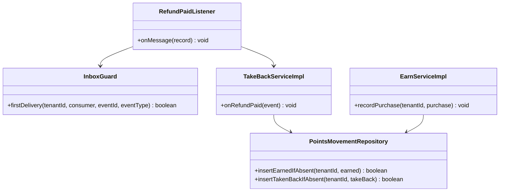
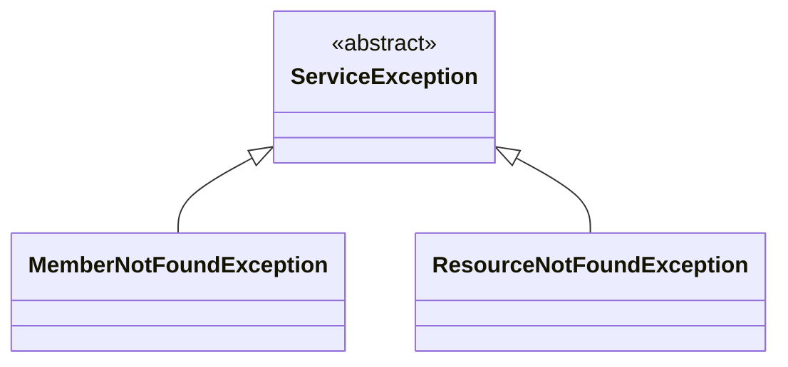
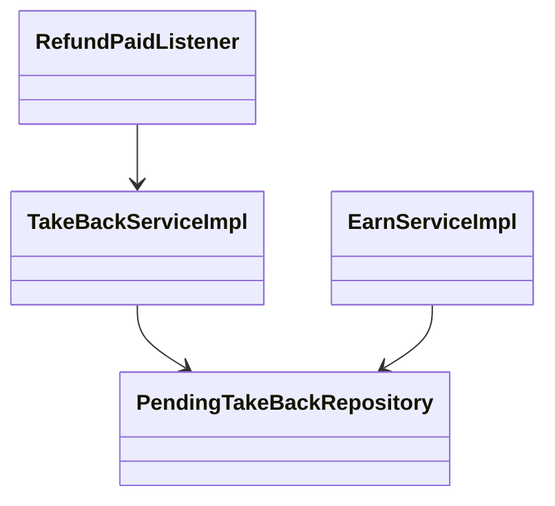
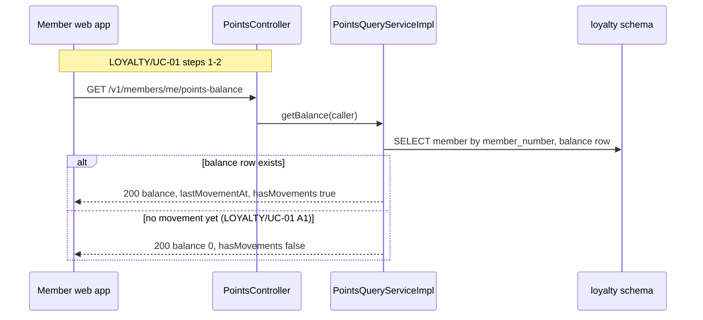
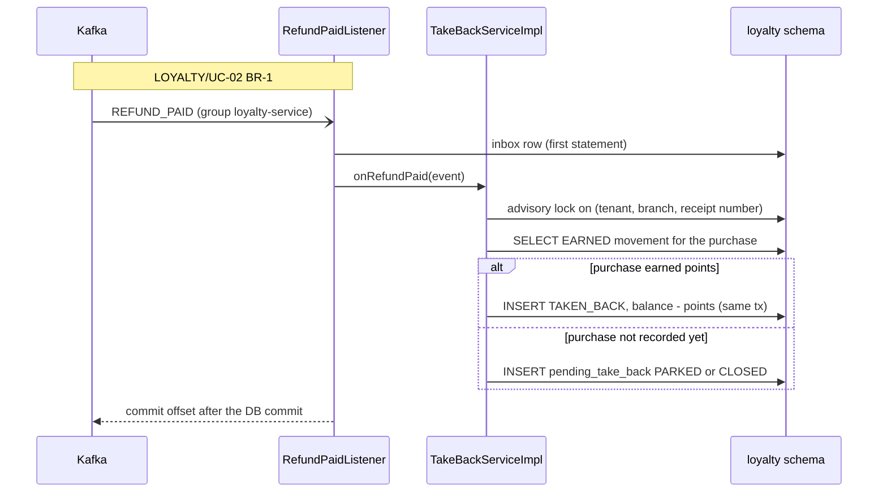

<!--
CHUNK: 04
TITLE: Per-Service Implementation - loyalty-service
PROJECT: Refunds Platform
VERSION: 1.0
DEPENDS_ON: 03, 09
PART OF: LLD - Refunds Platform
-->

# 7. Per-Service Implementation - loyalty-service

> **Bounded context:** [SDD §17.4 loyalty-service](../../sdd-refunds-platform/13d-service-loyalty.md#174-loyalty-service), a module of `refunds-platform-core` (ADR-01)
>
> **Source code:** None yet (greenfield). Planned: `refunds-platform-core`, packages `<base-package>.loyalty.{domain,application,adapter}`
>
> **Owns use cases (SDD 09):** [LOYALTY/UC-01](../../brd-loyalty-points/06a-use-cases-member.md#uc-01-view-points-balance), [LOYALTY/UC-02](../../brd-loyalty-points/06a-use-cases-member.md#uc-02-view-points-history)
>
> **Participates in:** None

---

## 7.1 Responsibility

loyalty-service owns the points ledger: `Member` (the loyalty member number and its link to a customer identity), append-only `PointsMovement` rows (EARNED on a member purchase, TAKEN_BACK when that purchase's refund is paid), the `PointsBalance` projection kept equal to the sum of movements, and `PendingTakeBack` rows for take-backs that arrive before their purchase. It receives member purchases from POS Records through the gateway's partner route (API-06), consumes `REFUND_PAID` from `refunds-platform-refund-events` (group `loyalty-service`) even though it runs in the same deployable as refund-service (ADR-05), and serves the member's balance and history. It publishes no event and makes no outbound provider call. It does not own purchases (POS Records), refunds (refund-service), or identities (Keycloak).

---

## 7.2 Class & Interface Map

### Controllers

| Class | Endpoints | Notes |
|-------|-----------|-------|
| `PointsController` | `GET /v1/members/me/points-balance`, `GET /v1/members/me/points-movements`, `GET /v1/members/me/points-movements/{movementId}` | Auth scopes per [SDD §17.4 List of APIs](../../sdd-refunds-platform/13d-service-loyalty.md#174-loyalty-service); member resolved from the `member_id` claim, never from the path |
| `MemberPurchaseController` | API-06: method and path TBD - external; when POS Records pushes, `/v1/partners/{partnerKey}/<resource>` (ADR-11) | Provider scheme; no `@UseCase` (not an SDD §7.3 entry point) |

> **Convention:** every entry point a § 7.8 traceability line names carries `@UseCase("KEY/UC-NN")` with the §7.3 value (`09-cross-cutting.md` § 12.8).

**Traced entry points and their `@UseCase` values (from SDD §7.3):**

| Entry point (as §7.3 writes it) | Handler method | `@UseCase` |
|---------------------------------|----------------|------------|
| `GET /v1/members/me/points-balance` | `PointsController.getBalance` | `LOYALTY/UC-01` |
| `GET /v1/members/me/points-movements` | `PointsController.listMovements` | `LOYALTY/UC-02` |
| `GET /v1/members/me/points-movements/{movementId}` | `PointsController.getMovement` | `LOYALTY/UC-02` |

> TODO: API-06 delivery mode (push, file, or pull), path, fields, and signature are `TBD - external` ([SDD API-06](../../sdd-refunds-platform/11-api-contracts.md#api-06-receive-member-purchases-pos-records---loyalty-service)); best guess a JSON push `POST /v1/partners/{partnerKey}/member-purchases` carrying a batch of purchases with an HMAC signature header - verify with the POS Records specification.

### Other entry points (no `@UseCase`)

| Class | Trigger | Notes |
|-------|---------|-------|
| `RefundPaidListener` | `@KafkaListener` on `refunds-platform-refund-events`, group `loyalty-service` | Realises LOYALTY/UC-02 BR-1; SDD §7.3 names no event entry point, so no `@UseCase` |
| `TakeBackClosureJob` | `@Scheduled`, hourly, one replica (advisory lock) | Closes PARKED take-backs past their deadline |
| `LedgerReconciliationJob` | `@Scheduled`, daily, one replica | Balance equals the sum of movements; PARKED older than two days |
| `HousekeepingJob` (kernel) | `@Scheduled` | Prunes `inbox_event` |

### Services (interfaces)

| Interface | Purpose | Implementations |
|-----------|---------|-----------------|
| `PointsQueryService` | Balance, movement page, movement detail (LOYALTY/UC-01, LOYALTY/UC-02) | `PointsQueryServiceImpl` |
| `EarnService` | EARNED movement per member purchase; applies waiting take-backs | `EarnServiceImpl` |
| `TakeBackService` | TAKEN_BACK, PARKED, or CLOSED on `REFUND_PAID`; closure of PARKED rows | `TakeBackServiceImpl` |
| `LedgerReconciliationService` | Daily recomputation and alerts (LOYALTY/NFR-01) | `LedgerReconciliationServiceImpl` |

### Outbound ports and adapters

| Port | Adapter | Notes |
|------|---------|-------|
| `MemberRepository`, `PointsMovementRepository`, `PointsBalanceRepository`, `PendingTakeBackRepository` | `Jdbc*` implementations | Extend `TenantScopedJdbcRepository`; schema `loyalty` |
| `PurchaseLocks` | `AdvisoryPurchaseLocks` | `pg_advisory_xact_lock` on hash(tenant, branch, purchase reference) |
| `PartnerSignatureVerifier` | `PosRecordsSignatureVerifier` | API-06 signature (TBD - external) |
| `PartnerKeyResolver`, `InboxGuard`, `TenantCalendar`, `IdGenerator`, `Clock` | Kernel | `09-cross-cutting.md` |

### Domain Types (records)

| Type | Kind | Purpose |
|------|------|---------|
| `Member` | entity | Member number and optional `customerId` link |
| `PointsMovement` | entity (append-only) | EARNED (points > 0) or TAKEN_BACK (points < 0) with purchase or refund reference |
| `PointsBalance` | projection | `balance`, `lastMovementAt`, `version` |
| `PendingTakeBack` | entity | `PARKED -> APPLIED` or `PARKED -> CLOSED -> APPLIED` |
| `MovementType`, `TakeBackStatus` | enums | `EARNED, TAKEN_BACK`; `PARKED, APPLIED, CLOSED` |
| `MemberPurchase` | record | One parsed API-06 purchase: member number, branch, purchase reference, amount, currency, purchase time |
| `PointsPolicy` | class | Earn rate and take-back computation (`08-state-and-rules.md` § 11.3) |
| `PointsBalanceResponse`, `PointsMovementPageResponse`, `PointsMovementDetailResponse` | records | OpenAPI `PointsBalance`, `PointsMovementPage`, `PointsMovementDetail` |
| `RefundPaidPayload` | record | Event payload (`07-event-contracts.md` § 10.2) |

### Method Signatures (key methods only)

```java
public interface PointsQueryService {
  PointsBalanceResponse getBalance(CallerContext caller);
  PointsMovementPageResponse listMovements(CallerContext caller, Cursor cursor, int limit);
  PointsMovementDetailResponse getMovement(CallerContext caller, UUID movementId);
}

public interface EarnService {
  void recordPurchase(UUID tenantId, MemberPurchase purchase);          // one transaction per purchase
}

public interface TakeBackService {
  void onRefundPaid(EventEnvelope<RefundPaidPayload> event);            // inside the listener transaction
  int closeExpiredParks(UUID tenantId, Instant now);
}

public interface PointsMovementRepository {
  boolean insertEarnedIfAbsent(UUID tenantId, PointsMovement earned);   // ON CONFLICT on the EARNED partial index
  boolean insertTakenBackIfAbsent(UUID tenantId, PointsMovement takeBack);
  Optional<PointsMovement> findEarned(UUID tenantId, String branchId, String purchaseReference);
  int sumPointsForPurchase(UUID tenantId, String branchId, String purchaseReference);
  Slice<PointsMovement> findByMember(UUID tenantId, UUID memberId, Cursor cursor, int limit);
}

public interface PointsBalanceRepository {
  void addDelta(UUID tenantId, UUID memberId, int delta, Instant movementAt); // atomic upsert, version + 1
}
```

> Confirm: class and port names follow CLAUDE.md conventions inside the SDD's hexagonal layout; verify with the team.

---

## 7.3 Method-Level Pseudocode (non-trivial logic only)

### `PointsQueryServiceImpl.getBalance` and `getMovement`

```text
getBalance(caller):
1. memberNumber = caller.memberId       -> absent: throw MemberNotFoundException (404 MEMBER_NOT_FOUND, detail explains how to join)
2. member = memberRepository.findByNumber(tenant, memberNumber)
3. if member == null or no balance row: return PointsBalanceResponse(0, lastMovementAt = null, hasMovements = false)  // LOYALTY/UC-01 A1
4. return PointsBalanceResponse(balance, lastMovementAt, hasMovements = true)                                          // LOYALTY/UC-01 step 2
getMovement(caller, movementId):
1. member as above; movement = find(tenant, movementId) where member_id = member.id -> else 404 NOT_FOUND (BR-2)
2. EARNED -> purchase view (receipt number, branch, date, amount); TAKEN_BACK -> refund view (reference, paid amount, date)
```

> Confirm: the `member_id` claim is read as the loyalty member number (`member.member_number`), because members are created on first sight from POS purchases and the Keycloak link (A-5) is made against the member number; SDD A-5 is still open and the SDD reviewer notes two homes for the customer-to-member link.

### `EarnServiceImpl.recordPurchase` (API-06)

```text
one transaction per purchase:
1. purchaseLocks.lock(tenant, p.branchId, p.purchaseReference)          // serialises with REFUND_PAID for the same purchase
2. member = memberRepository.findOrCreate(tenant, p.memberNumber)       // INSERT ... ON CONFLICT DO NOTHING, then SELECT
3. points = pointsPolicy.earned(p.amount, p.currency)                   // 1 point per 1 EUR (LOYALTY 02 Glossary)
4. if !movements.insertEarnedIfAbsent(tenant, EARNED(member, p, points)): return   // redelivery: no-op (SDD API-06)
5. balances.addDelta(tenant, member.id, +points, p.purchaseTime)
6. for tb in pendingTakeBacks.findOpen(tenant, p.branchId, p.purchaseReference):   // PARKED or CLOSED
     applyTakeBack(tenant, member, tb)                                   // UPDATE ... WHERE status IN ('PARKED','CLOSED')
     if tb.status was CLOSED: meter points_take_backs_applied_late_total + alert (SDD §17.4)
```

### `TakeBackServiceImpl.onRefundPaid` (LOYALTY/UC-02 BR-1)

```text
Inside RefundPaidListener's transaction, after InboxGuard.firstDelivery(...) returned true:
1. p = event.payload; refundId = event.aggregateId
2. purchaseLocks.lock(tenant, p.branchId, p.receiptNumber)                      // A-4: purchase = (branch, receipt number)
3. earned = movements.findEarned(tenant, p.branchId, p.receiptNumber)
4. if earned != null:
     held = movements.sumPointsForPurchase(tenant, p.branchId, p.receiptNumber)   // earned minus earlier take-backs
     points = pointsPolicy.takeBack(p.paidAmount, earned.points, held)
     if points > 0 and movements.insertTakenBackIfAbsent(tenant, TAKEN_BACK(earned.memberId, -points, refundId,
                                                         p.referenceNumber, p.paidAmount, p.branchId, p.receiptNumber)):
         balances.addDelta(tenant, earned.memberId, -points, now)
         histogram points_take_back_lag_seconds.observe(now - p.paidAt)          // LOYALTY/NFR-02
5. else:
     deadline = tenantCalendar.startOfDay(tenant, p.purchaseDate.plusDays(2))    // end of the day after purchaseDate
     status = now < deadline ? PARKED : CLOSED
     pendingTakeBacks.insertIfAbsent(tenant, refundId, p.branchId, p.receiptNumber, p.purchaseDate,
                                     p.paidAmount, p.referenceNumber, status, deadline)   // unique (tenant_id, refund_id)
```

> Confirm: the per-purchase advisory lock is an LLD addition; without it a `REFUND_PAID` and the API-06 purchase for the same receipt can commit concurrently, each seeing no row of the other, leaving a PARKED take-back that nothing applies (SDD §17.4 does not state the concurrency rule).

### `TakeBackServiceImpl.closeExpiredParks`

```text
UPDATE loyalty.pending_take_back SET status = 'CLOSED', updated_at = :now
WHERE tenant_id = :t AND status = 'PARKED' AND park_deadline <= :now      // CLOSED rows stay matchable (SDD §17.4)
```

---

## 7.4 Design Patterns Applied

### Pattern: Idempotency (partner purchases and consumer inbox)

> **Applied:** Idempotency (CLAUDE.md: "Idempotency keys on all write endpoints touching money/ wallet/ notifications or external providers." and "Idempotency on every consumer and every write endpoint. Assume at-least-once delivery everywhere.")
>
> **Rationale (this service):** POS Records redelivers purchases on failure (SDD INT-03) and Kafka redelivers `REFUND_PAID`; either duplicate would change a balance twice, which LOYALTY/NFR-01 forbids ("the points balance is always right"). The natural keys make both writes idempotent without an `Idempotency-Key` header, which the provider does not send.

**Roles:**

| Role | Class / Component | Notes |
|------|-------------------|-------|
| Purchase dedup | Partial unique index (`tenant_id`, `branch_id`, `purchase_reference`) WHERE `type = 'EARNED'` | `insertEarnedIfAbsent` |
| Take-back dedup | Partial unique index (`tenant_id`, `refund_id`) WHERE `type = 'TAKEN_BACK'`, and unique (`tenant_id`, `refund_id`) on `pending_take_back` | `insertTakenBackIfAbsent`, `insertIfAbsent` |
| Consumer dedup | `InboxGuard` (`loyalty-service`, `event_id`) | First statement of the listener transaction |

**Class diagram:**



**Pseudocode skeleton:**

```text
INSERT INTO loyalty.points_movement (...) VALUES (...)
ON CONFLICT (tenant_id, branch_id, purchase_reference) WHERE type = 'EARNED' DO NOTHING   -- 0 rows = duplicate
```

### Pattern: RFC 9457 Problem Details

> **Applied:** Problem Details (CLAUDE.md: "Global @RestControllerAdvice, Problem Details (RFC 9457)" and "Business exceptions extend a base ServiceException with error code.")
>
> **Rationale (this service):** a signed-in person without a `member_id` claim must get a plain-language answer that explains how to join (SDD §17.4), and a foreign movement id must look exactly like an unknown one (LOYALTY/UC-02 BR-2).

**Roles:**

| Role | Class / Component |
|------|-------------------|
| Base exception | `ServiceException` (kernel) |
| Subclasses | `MemberNotFoundException` (404 `MEMBER_NOT_FOUND`), kernel `ResourceNotFoundException` (404 `NOT_FOUND`), `PartnerSignatureInvalidException` (401) |
| Translator | `ProblemDetailsAdvice` (kernel), shared with refund-service in the core |

**Class diagram:**



**Pseudocode skeleton:**

```text
public final class MemberNotFoundException extends ServiceException {
  public MemberNotFoundException() { super("MEMBER_NOT_FOUND", HttpStatus.NOT_FOUND, "loyalty.member-not-found.how-to-join"); }
}
```

### Pattern: Saga (choreography, participant)

> **Applied:** Saga (CLAUDE.md: "Sagas (choreography by default, orchestration when the flow is complex or needs central visibility) for cross-service business transactions. No distributed 2PC.")
>
> **Rationale (this service):** the take-back is SAGA-01 step 4b ([refund-service § Cross-service Saga](./refund-service.md#cross-service-saga-orchestrator-role)), consumed from the broker even inside the core so either module can be extracted (ADR-05). A take-back that cannot match yet is parked, not dropped; it has no compensation because a paid refund is final.

**Roles:**

| Role | Class / Component |
|------|-------------------|
| Step trigger | `RefundPaidListener` |
| Step work | `TakeBackServiceImpl.onRefundPaid`, later `EarnServiceImpl.recordPurchase` for parked or closed take-backs |

**Class diagram:**



**Pseudocode skeleton:**

```text
REFUND_PAID -> earned found ? TAKEN_BACK : (before deadline ? PARKED : CLOSED)
purchase arrives -> EARNED + apply PARKED or CLOSED take-backs (CLOSED -> late alert)
```

**Not applied:** Outbox (the module publishes no event, SDD §14.4) and Resilience4j (no outbound provider call; API-06 is inbound). **Discretionary:** none; the ledger (append-only movements plus a projection updated in the same transaction) is the SDD's domain design, not a GoF pattern.

---

## 7.5 Dependency Injection Graph

```mermaid
graph TB
  PointsController --> PointsQueryService
  MemberPurchaseController --> PartnerKeyResolver
  MemberPurchaseController --> PartnerSignatureVerifier
  MemberPurchaseController --> EarnService
  RefundPaidListener --> InboxGuard
  RefundPaidListener --> TakeBackService
  TakeBackClosureJob --> TakeBackService
  LedgerReconciliationJob --> LedgerReconciliationService
  PointsQueryServiceImpl --> MemberRepository
  PointsQueryServiceImpl --> PointsBalanceRepository
  PointsQueryServiceImpl --> PointsMovementRepository
  EarnServiceImpl --> PurchaseLocks
  EarnServiceImpl --> MemberRepository
  EarnServiceImpl --> PointsMovementRepository
  EarnServiceImpl --> PointsBalanceRepository
  EarnServiceImpl --> PendingTakeBackRepository
  EarnServiceImpl --> PointsPolicy
  TakeBackServiceImpl --> PurchaseLocks
  TakeBackServiceImpl --> PointsMovementRepository
  TakeBackServiceImpl --> PointsBalanceRepository
  TakeBackServiceImpl --> PendingTakeBackRepository
  TakeBackServiceImpl --> PointsPolicy
  TakeBackServiceImpl --> TenantCalendar
```



---

## 7.6 Transaction Boundaries

| Method | Propagation | Isolation | Rollback rules |
|--------|-------------|-----------|----------------|
| `PointsQueryServiceImpl.*` | `REQUIRED`, read-only | `READ_COMMITTED` | - |
| `EarnServiceImpl.recordPurchase` | `REQUIRED`, one transaction per purchase | `READ_COMMITTED` + advisory lock on the purchase | Rollback on any exception; the API-06 call answers 5xx only if a purchase failed, so POS redelivers the batch (duplicates are no-ops) |
| `RefundPaidListener.onMessage` + `TakeBackServiceImpl.onRefundPaid` | `REQUIRED` (listener transaction) | `READ_COMMITTED` + advisory lock on the purchase | Rollback on any exception; retry, then `loyalty-service.dlq` |
| `TakeBackServiceImpl.closeExpiredParks` | `REQUIRED` per tenant | `READ_COMMITTED` | - |
| `LedgerReconciliationServiceImpl.run` | Read-only per tenant | `REPEATABLE_READ` | - |

> **Convention:** a movement and its balance delta always commit together (SDD §17.4 Balance integrity); `points_balance` is updated with an atomic `balance = balance + :delta` upsert, so concurrent movements of one member never lose an update.

---

## 7.7 Error Handling

| Exception | RFC 9457 type | HTTP Status | When thrown | Caller action |
|-----------|---------------|-------------|-------------|---------------|
| `MemberNotFoundException` | `.../member-not-found` (`MEMBER_NOT_FOUND`) | 404 | Token without a `member_id` claim (SDD §17.4) | Web app shows how to join |
| `ResourceNotFoundException` | `.../not-found` (`NOT_FOUND`) | 404 | Unknown or another member's movement (LOYALTY/UC-02 BR-2) | None |
| `MethodArgumentNotValidException` | `.../validation-failed` (`VALIDATION_FAILED`) | 400 | Bad cursor or limit | Fix the request |
| `PartnerKeyUnknownException`, `PartnerSignatureInvalidException` | `.../not-found`, `.../unauthenticated` | 404, 401 | API-06 partner key or signature invalid; logged as a security event | None |
| `MalformedEventException` (consumer) | None | - | `REFUND_PAID` missing a field the take-back needs | `loyalty-service.dlq` with an alarm |

> **Convention:** all exceptions extend `ServiceException`; 401 and 403 come from Spring Security in the same envelope. An unmatched take-back is parked or closed, never an error.

---

## 7.8 Use-Case Workflows

> **Convention:** one subsection per active use case this service owns (SDD §7.3 Owner), headed with the SDD's BRD key and the BRD's ID and title exactly.

### LOYALTY/UC-01: View Points Balance

> **Traceability:** BRD [LOYALTY/UC-01](../../brd-loyalty-points/06a-use-cases-member.md#uc-01-view-points-balance) · SDD [§7.3](../../sdd-refunds-platform/03-users-and-use-cases.md#73-use-case-traceability-brd--sdd) · Owner: loyalty-service · Entry points: `GET /v1/members/me/points-balance` · UAT/BAT: Pending (BRD 16 not written) · Screens: [LOYALTY/LP-01](../../brd-loyalty-points/06a-use-cases-member.md#uc-01-view-points-balance) via `/points`

**Trigger:** `PointsController.getBalance`, `@UseCase("LOYALTY/UC-01")`.

**Pre-conditions:** signed in with `loyalty.balance.read-own` (role `MEMBER`) and a `member_id` claim.

**Post-conditions:** none (read).

**Control flow:**

```text
1. Member opens their points; the web app calls GET points-balance (LOYALTY/UC-01 step 1)
2. Member resolved from the member_id claim only (LOYALTY/UC-01 BR-1); no claim -> 404 MEMBER_NOT_FOUND
3. Return balance and the date of the last movement from points_balance (LOYALTY/UC-01 step 2)
4. No movement yet -> balance 0, hasMovements false; the web app explains how points are earned (LOYALTY/UC-01 A1)
```

**Sequence diagram:**



**Idempotency points:** none (read).

**Outbox emission points:** none.

**Retry / timeout policy:** none server-side.

**Error handling:** no claim -> 404 `MEMBER_NOT_FOUND`; missing token scope -> 403 `FORBIDDEN`.

### LOYALTY/UC-02: View Points History

> **Traceability:** BRD [LOYALTY/UC-02](../../brd-loyalty-points/06a-use-cases-member.md#uc-02-view-points-history) · SDD [§7.3](../../sdd-refunds-platform/03-users-and-use-cases.md#73-use-case-traceability-brd--sdd) · Owner: loyalty-service · Entry points: `GET /v1/members/me/points-movements`, `GET /v1/members/me/points-movements/{movementId}` · UAT/BAT: Pending (BRD 16 not written) · Screens: [LOYALTY/LP-02](../../brd-loyalty-points/06a-use-cases-member.md#uc-02-view-points-history) via `/points/history`, `/points/history/:movementId`

**Trigger:** `PointsController.listMovements` and `PointsController.getMovement`, both `@UseCase("LOYALTY/UC-02")`. The take-back of BR-1 is realised by `RefundPaidListener` (no `@UseCase`, § 7.2).

**Pre-conditions:** signed in with `loyalty.movement.read-own` and a `member_id` claim.

**Post-conditions:** reads have none; a consumed `REFUND_PAID` leaves one TAKEN_BACK movement and a lower balance, or one PARKED or CLOSED take-back.

**Control flow:**

```text
1. GET points-movements: movements of the claim's member, newest first, cursor pagination (LOYALTY/UC-02 steps 1-2, BR-2)
   each with date, purchase or refund reference, and signed whole points; a take-back shows the refund reference (LOYALTY/UC-02 A1)
2. GET points-movements/{movementId}: the purchase or the refund it came from (LOYALTY/UC-02 steps 3-4)
3. REFUND_PAID (group loyalty-service): inbox, purchase lock, EARNED lookup by (branch, receipt number)
   found -> TAKEN_BACK movement + balance delta (LOYALTY/UC-02 BR-1)
   not found -> PARKED until the end of the day after the purchase date, else CLOSED; applied when the purchase arrives
```

**Sequence diagram (take-back):**



**Idempotency points:** inbox (`loyalty-service`, `event_id`); unique (`tenant_id`, `refund_id`) on TAKEN_BACK movements and on `pending_take_back`.

**Outbox emission points:** none (the module publishes no event).

**Retry / timeout policy:** consumer retries three times with backoff, then dead-letters; LOYALTY/NFR-02 (60 minutes from `paidAt`) is watched through `points_take_back_lag_seconds` and consumer lag.

**Error handling:** foreign or unknown movement -> 404 `NOT_FOUND`; malformed `REFUND_PAID` -> `loyalty-service.dlq`; unmatched take-back -> PARKED or CLOSED with the parked and late-apply alerts.

> TODO: points to take back for a partial refund and the rounding of fractional EUR amounts are open in SDD §17.4 (R-04); best guess the SDD's proposal, whole EUR of the paid amount capped at the points still held from that purchase (`08-state-and-rules.md` § 11.3) - verify with the LOYALTY owner.

### Workflow: Earn movements (API-06)

> **Traceability:** No BRD use case. Realises [LOYALTY 03 § Points movement](../../brd-loyalty-points/03-definitions-and-domain-concepts.md#points-movement) and LOYALTY 08 through API-06 (SDD §17.4); it feeds the balance and history of LOYALTY/UC-01 and LOYALTY/UC-02.

**Control flow:**

```text
1. Partner call on the gateway partner route; partnerKey -> tenant (ADR-11); signature verified with the tenant's secret
2. Per purchase, one transaction: purchase lock, member find-or-create, EARNED at 1 point per 1 EUR,
   balance delta, apply PARKED or CLOSED take-backs of that purchase (CLOSED -> late alert)
3. Acknowledge after every purchase committed; a duplicate purchase is a no-op
```

**Idempotency points:** partial unique index on EARNED (`tenant_id`, `branch_id`, `purchase_reference`).

**Outbox emission points:** none.

**Retry / timeout policy:** provider-driven redelivery (SDD INT-03); no in-call retry on our side.

**Error handling:** unknown partner key -> 404; bad signature -> 401 and a security event; malformed purchase -> 400 for the batch (TODO above on the payload format).

### Workflow: Ledger reconciliation

> **Traceability:** No BRD use case. Realises LOYALTY/NFR-01 checks ([SDD §18](../../sdd-refunds-platform/14-performance-and-capacity.md#18-performance--capacity-planning)); platform job.

```text
daily, advisory lock "loyalty.reconciliation", per tenant:
1. drift = members whose points_balance.balance <> SUM(points_movement.points)  -> points_balance_drift_total += drift
2. stalled = COUNT(pending_take_back WHERE status = 'PARKED' AND created_at < now - 2 days) -> gauge + alert
```

### Cross-service Saga (orchestrator role)

Not applicable for this service: SAGA-01 is choreographed; loyalty-service is step 4b (see [refund-service § Cross-service Saga](./refund-service.md#cross-service-saga-orchestrator-role)).

<!-- MASTER: refunds-platform-lld-master.md | PREV: 03-architecture.md | NEXT: 04-implementation/notification-service.md -->
