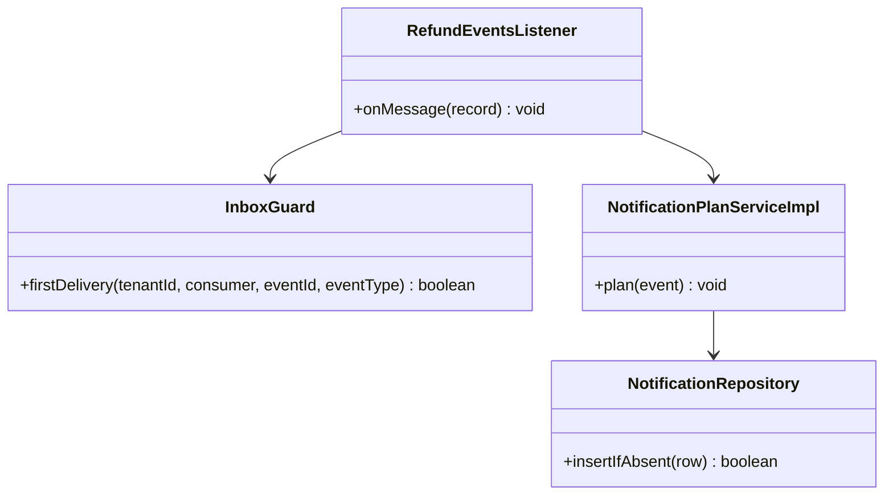
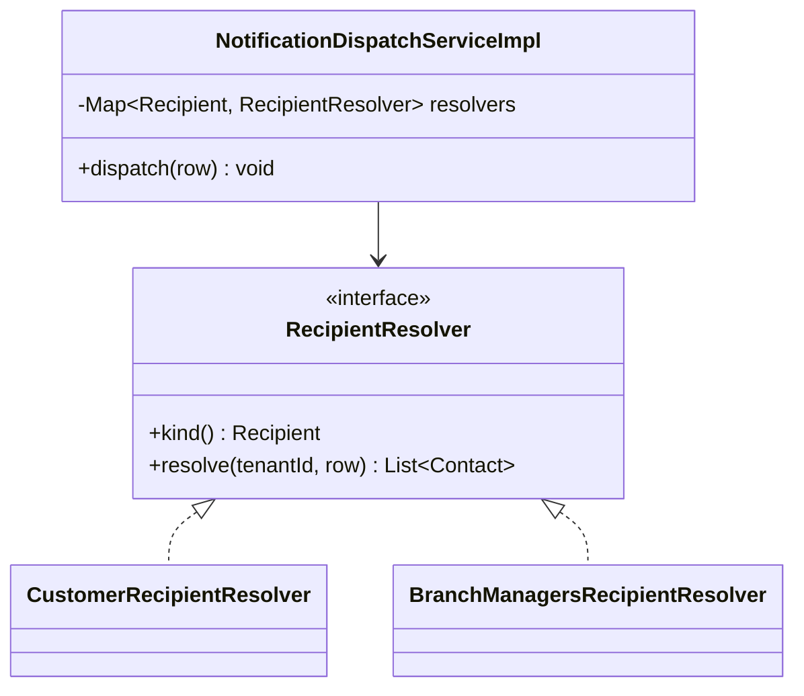
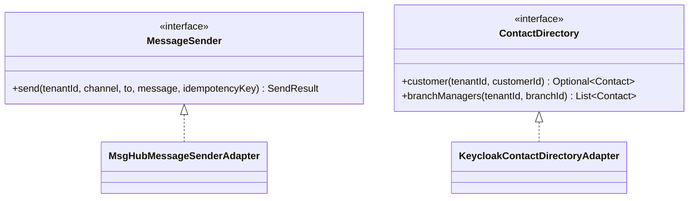
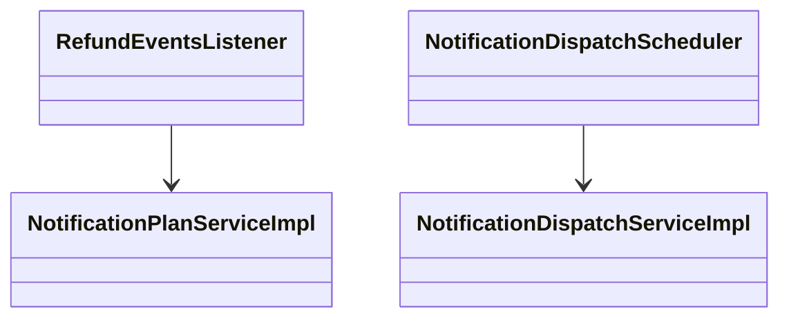
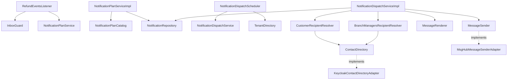
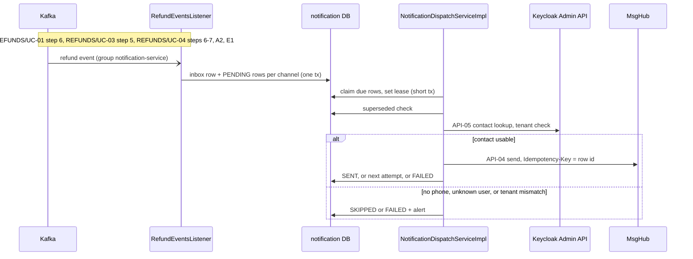

<!--
CHUNK: 04
TITLE: Per-Service Implementation - notification-service
PROJECT: Refunds Platform
VERSION: 1.0
DEPENDS_ON: 03, 09
PART OF: LLD - Refunds Platform
-->

# 7. Per-Service Implementation - notification-service

> **Bounded context:** [SDD §17.3 notification-service](../../sdd-refunds-platform/13c-service-notification.md#173-notification-service), a separate deployable (ADR-01)
>
> **Source code:** None yet (greenfield). Planned: `notification-service`, packages `<base-package>.notification.{domain,application,adapter}`
>
> **Owns use cases (SDD 09):** None - sends refund messages to customers and branch managers
>
> **Participates in:** REFUNDS/UC-01, REFUNDS/UC-03, REFUNDS/UC-04 (owner: refund-service)

---

## 7.1 Responsibility

notification-service owns the send log (one `notification` row per consumed event and channel), the message templates per event, channel, and locale, and the retry state of each message. It consumes the six refund events on `refunds-platform-refund-events` (group `notification-service`), resolves the recipient's contact details from Keycloak at send time (API-05) without storing them (ADR-09), renders the template, and sends through MsgHub (API-04) with the row id as the `Idempotency-Key`. It publishes no event and exposes no business endpoint; a message outcome never changes refund state. It does not own refund state (refund-service), contact details (Keycloak), or delivery to the handset or mailbox (MsgHub).

---

## 7.2 Class & Interface Map

### Controllers

Not applicable for this service: no business REST endpoint (SDD §17.3 List of APIs); only actuator health, readiness, and metrics.

> **Convention:** notification-service has no SDD §7.3 entry point, so none of its handlers carries `@UseCase` (`09-cross-cutting.md` § 12.8).

### Other entry points

| Class | Trigger | Notes |
|-------|---------|-------|
| `RefundEventsListener` | `@KafkaListener` on `refunds-platform-refund-events`, group `notification-service` | Plans the six refund events; ignores other `event_type` values |
| `NotificationDispatchScheduler` | `@Scheduled(fixedDelay)`, every replica | Claims due PENDING rows per tenant with `FOR UPDATE SKIP LOCKED` |
| `HousekeepingJob` (kernel) | `@Scheduled` | Deletes `notification` and `inbox_event` rows older than the retention (SDD §17.3) |

### Services (interfaces)

| Interface | Purpose | Implementations |
|-----------|---------|-----------------|
| `NotificationPlanService` | Turn one event into one PENDING row per channel | `NotificationPlanServiceImpl` |
| `NotificationDispatchService` | Resolve, render, send, and record one row | `NotificationDispatchServiceImpl` |
| `RecipientResolver` (strategy) | Resolve the contacts of a row | `CustomerRecipientResolver`, `BranchManagersRecipientResolver` |

### Outbound ports and adapters

| Port | Adapter | Notes |
|------|---------|-------|
| `ContactDirectory` | `KeycloakContactDirectoryAdapter` | API-05; OAuth2 client credentials of the `notification-service` Keycloak client; Resilience4j `keycloak-admin` |
| `MessageSender` | `MsgHubMessageSenderAdapter` | API-04; Resilience4j `msghub-email` and `msghub-sms` |
| `MessageRenderer` | `MessageSourceRenderer` | Spring `MessageSource` bundles per template code and locale; named arguments, no string concatenation |
| `NotificationRepository` | `JdbcNotificationRepository` | Extends `TenantScopedJdbcRepository` |
| `InboxGuard`, `IdGenerator`, `Clock`, `ProviderCredentials`, `TenantDirectory` | Kernel | `09-cross-cutting.md` |

### Domain Types (records)

| Type | Kind | Purpose |
|------|------|---------|
| `Notification` | entity (send-log row) | `PENDING -> SENT, SKIPPED, FAILED`; `attemptCount`, `nextAttemptAt` (due time or lease) |
| `Channel`, `Recipient`, `NotificationStatus` | enums | `EMAIL, SMS`; `CUSTOMER, BRANCH_MANAGERS`; `PENDING, SENT, SKIPPED, FAILED` |
| `NotificationPlan` | record | Recipient, channels, template code, params extractor for one event type |
| `Contact` | record (memory only) | Email, phone, locale, `tenantId` attribute of a Keycloak user |
| `RenderedMessage` | record | Subject (email only) and body |
| Event payload records | records | Shared with the kernel's event model (`07-event-contracts.md` § 10.2) |

### `NotificationPlanCatalog` (implementation delta)

The event-to-channel mapping is owned by [SDD §17.3 Business Logic](../../sdd-refunds-platform/13c-service-notification.md#173-notification-service); the catalog encodes it and adds the template code and parameters.

| Event | Recipient strategy | Template code | Template params (from the payload) |
|-------|--------------------|---------------|------------------------------------|
| `REFUND_SUBMITTED` | `CustomerRecipientResolver` | `refund-submitted` | `referenceNumber`, `requestedAmount` |
| `REFUND_CANCELLED` | `CustomerRecipientResolver` | `refund-cancelled` | `referenceNumber` |
| `REFUND_APPROVED` | `CustomerRecipientResolver` | `refund-approved` or `refund-approved-partial` | `referenceNumber`, `approvedAmount`, `decisionReason` when `partial` |
| `REFUND_REJECTED` | `CustomerRecipientResolver` | `refund-rejected` | `referenceNumber`, `decisionReason` |
| `REFUND_PAID` | `CustomerRecipientResolver` | `refund-paid` | `referenceNumber`, `paidAmount` |
| `REFUND_PAYOUT_FAILED` | `BranchManagersRecipientResolver` | `refund-payout-failed` | `referenceNumber`, `approvedAmount`, `branchId` |

### Method Signatures (key methods only)

```java
public interface NotificationPlanService {
  void plan(EventEnvelope<? extends RefundEventPayload> event);           // inside the listener transaction
}

public interface NotificationDispatchService {
  List<Notification> claimDue(UUID tenantId, int batchSize);             // short tx, sets the lease
  void dispatch(Notification row);                                       // no tx during provider calls
}

public interface RecipientResolver {
  Recipient kind();
  List<Contact> resolve(UUID tenantId, Notification row);                // tenant check included
}

public interface ContactDirectory {
  Optional<Contact> customer(UUID tenantId, UUID customerId);                   // API-05, TBD - external
  List<Contact> branchManagers(UUID tenantId, String branchId);                 // API-05 role + attribute read
}

public interface MessageSender {
  SendResult send(UUID tenantId, Channel channel, List<Contact> to, RenderedMessage message, UUID idempotencyKey); // API-04
}
```

> Confirm: class and port names follow CLAUDE.md conventions inside the SDD's hexagonal layout; verify with the team.

---

## 7.3 Method-Level Pseudocode (non-trivial logic only)

### `NotificationPlanServiceImpl.plan`

```text
Inside RefundEventsListener's transaction, after InboxGuard.firstDelivery(...) returned true:
1. plan = catalog.planFor(event.eventType)                  -> none: return (event not messaged)
2. validate the payload fields the plan needs               -> missing: throw MalformedEventException (DLQ)
3. for channel in plan.channels:                            // channels per SDD §17.3
     INSERT notification(id = idGenerator.next(), tenant, source_event_id = event.eventId, event_type,
                         aggregate_version = event.aggregateVersion, refund_id = event.aggregateId,
                         recipient = plan.recipient, customer_id = payload.customerId (null for BRANCH_MANAGERS),
                         channel, template_code, template_params (json), status = PENDING,
                         attempt_count = 0, next_attempt_at = now)
     ON CONFLICT (tenant_id, source_event_id, channel) DO NOTHING         // redelivery sends nothing twice
4. no provider call in this transaction (SDD §17.3 Error Handling)
```

### `NotificationDispatchServiceImpl.dispatch`

```text
0. claimDue (short tx): rows WHERE tenant_id = :t AND status = 'PENDING' AND next_attempt_at <= now()
   ORDER BY next_attempt_at LIMIT :batch FOR UPDATE SKIP LOCKED; next_attempt_at = now + lease; commit
1. superseded = EXISTS(SELECT 1 FROM notification WHERE tenant_id = :t AND refund_id = row.refund_id
                       AND channel = row.channel AND status = 'SENT' AND aggregate_version > row.aggregate_version)
   if superseded: record SKIPPED (reason SUPERSEDED); return                      // SDD §14.6 item 3
2. contacts = resolverFor(row.recipient).resolve(tenant, row)
     directory unavailable -> retryLater(row); return                            // SDD INT-04 fallback
     unknown user or no manager -> record FAILED + alert; return
     contact.tenantId != row.tenantId -> record FAILED + security alert; return  // SDD §11.2
3. if row.channel == SMS and every contact lacks a phone: record SKIPPED; return
4. message = renderer.render(row.templateCode, row.channel, contact.locale, row.templateParams)
   // amounts with their currency, reference number always (REFUNDS 11); RTL-safe for Arabic
5. result = messageSender.send(tenant, row.channel, contacts, message, idempotencyKey = row.id)
6. short tx: accepted -> SENT, provider_message_id, sent_at
            rejected or unavailable -> attempt_count + 1; attempts left ? PENDING with next_attempt_at = backoff
                                                                        : FAILED + alert
```

> TODO: best guess retry policy for messages (SDD INT-02 leaves attempts and window open): 8 attempts, equal-jitter backoff from 1 minute capped at 1 hour, then FAILED with an alert - verify.

> TODO: a `REFUND_PAYOUT_FAILED` row can address several branch managers, while the send-log row and its `Idempotency-Key` are one per event and channel (SDD §17.3); best guess one MsgHub call with all managers as recipients if API-04 supports it, else one call per manager with the key `<row id>-<n>` and the row SENT only when every call succeeds - verify with the MsgHub documentation (API-04 is TBD - external).

> Confirm: a crash between the MsgHub send and the SENT record re-sends the message after the lease expires; only MsgHub honouring the row-id `Idempotency-Key` (support TBD - external, SDD API-04) prevents a duplicate message.

---

## 7.4 Design Patterns Applied

### Pattern: Idempotency (consumer inbox, send log, provider key)

> **Applied:** Idempotency (CLAUDE.md: "Idempotency keys on all write endpoints touching money/ wallet/ notifications or external providers." and "Idempotency on every consumer and every write endpoint. Assume at-least-once delivery everywhere.")
>
> **Rationale (this service):** every consumed event may be redelivered (at-least-once) or redriven from the DLQ; the customer must receive each message once (SDD §17.3 Constraints). The inbox row and the unique (`tenant_id`, `source_event_id`, `channel`) key make planning idempotent, and the row id sent as MsgHub's `Idempotency-Key` makes the send idempotent across lease expiries.

**Roles:**

| Role | Class / Component | Notes |
|------|-------------------|-------|
| Consumer dedup | `InboxGuard` in `RefundEventsListener` | PK (`tenant_id`, `consumer`, `event_id`) |
| Plan dedup | `notification` unique (`tenant_id`, `source_event_id`, `channel`) | `ON CONFLICT DO NOTHING` |
| Provider key | `MsgHubMessageSenderAdapter.send(..., idempotencyKey = row.id)` | Header name TBD - external |

**Class diagram:**



**Pseudocode skeleton:**

```text
@KafkaListener(topics = "refunds-platform-refund-events", groupId = "notification-service") @Transactional
void onMessage(ConsumerRecord<String, String> r) {
  var e = envelopeReader.read(r);
  if (!inbox.firstDelivery(e.tenantId(), "notification-service", e.eventId(), e.eventType())) return;
  planService.plan(e);                          // rows only; sending happens after commit
}
```

### Pattern: Strategy (recipient resolution)

> **Applied:** Strategy (CLAUDE.md: "Strategy for runtime variants")
>
> **Rationale (this service):** a row is addressed either to the customer (by `customerId`) or to the branch's managers (users holding `BRANCH_MANAGER` with a `branch_id` attribute, OI-08). Both variants share the tenant check and the "nothing stored" rule but read Keycloak differently; the `recipient` column selects the strategy at runtime, so a third recipient kind (for example a mobile push, SDD §17.3 Future Enhancements) is a new class, not a new branch in `dispatch`.

**Roles:**

| Role | Class / Component |
|------|-------------------|
| Strategy interface | `RecipientResolver` |
| Concrete strategies | `CustomerRecipientResolver`, `BranchManagersRecipientResolver` |
| Context | `NotificationDispatchServiceImpl` with an injected `Map<Recipient, RecipientResolver>` |

**Class diagram:**



**Pseudocode skeleton:**

```text
NotificationDispatchServiceImpl(List<RecipientResolver> all, ...) {
  this.resolvers = all.stream().collect(toMap(RecipientResolver::kind, identity()));
}
List<Contact> contacts = resolvers.get(row.recipient()).resolve(row.tenantId(), row);
```

> Confirm: Strategy is a CLAUDE.md guideline pattern applied here because two runtime variants exist; verify it is wanted over a two-way switch.

### Pattern: Resilience4j on MsgHub (API-04) and the Keycloak Admin API (API-05)

> **Applied:** Resilience defaults (CLAUDE.md: "Resilience defaults: timeouts, retries with exponential backoff and jitter, circuit breakers (Resilience4j), bulkheads for downstream provider calls (e.g., eSIM, payment, SMS).")
>
> **Rationale (this service):** seasonal peaks triple the message volume (REFUNDS/NFR-03); a slow SMS channel must not starve email (SDD INT-02: bulkhead per channel), and a Keycloak outage must pause sending without losing messages (INT-04).

**Roles:**

| Role | Class / Component |
|------|-------------------|
| Timeouts | `RestClient` connect and read timeouts per provider client |
| Retry (in-call) | `@Retry(name = "keycloak-admin")`: 2 retries with jitter on idempotent reads (SDD INT-04) |
| Retry (scheduled) | Message backoff via `next_attempt_at` (SDD INT-02) |
| Circuit breakers | `msghub-email`, `msghub-sms`, `keycloak-admin` |
| Bulkheads | `msghub-email`, `msghub-sms` (one per channel) |

**Class diagram:**



**Pseudocode skeleton:**

```text
public SendResult send(UUID tenantId, Channel channel, ...) {
  return channel == EMAIL ? emailPipeline.executeSupplier(() -> call(...))   // CB + bulkhead msghub-email
                          : smsPipeline.executeSupplier(() -> call(...));    // CB + bulkhead msghub-sms
}   // programmatic Resilience4j decoration, because the instance depends on the channel argument
```

### Pattern: Saga (choreography, participant)

> **Applied:** Saga (CLAUDE.md: "Sagas (choreography by default, orchestration when the flow is complex or needs central visibility) for cross-service business transactions. No distributed 2PC.")
>
> **Rationale (this service):** notification-service is SAGA-01 step 4a ([refund-service § Cross-service Saga](./refund-service.md#cross-service-saga-orchestrator-role)) and the "tells the customer" steps of REFUNDS/UC-01 and REFUNDS/UC-03. Its outcome never feeds back into the saga, so it needs no compensation.

**Roles:**

| Role | Class / Component |
|------|-------------------|
| Step trigger | `RefundEventsListener` |
| Step work | `NotificationDispatchScheduler` -> `NotificationDispatchServiceImpl` |

**Class diagram:**



**Pseudocode skeleton:**

```text
refund event -> PENDING rows (one per channel) -> tick -> resolve -> render -> send -> SENT | retry | FAILED
```

**Not applied:** Outbox (the service publishes no event, SDD §14.4) and RFC 9457 (no business REST endpoint, SDD §17.3 API Standards).

---

## 7.5 Dependency Injection Graph



---

## 7.6 Transaction Boundaries

| Method | Propagation | Isolation | Rollback rules |
|--------|-------------|-----------|----------------|
| `RefundEventsListener.onMessage` + `NotificationPlanServiceImpl.plan` | `REQUIRED` (listener transaction) | `READ_COMMITTED` | Rollback on any exception; retry, then `notification-service.dlq` |
| `NotificationDispatchServiceImpl.claimDue` | `REQUIRED`, short | `READ_COMMITTED` with `FOR UPDATE SKIP LOCKED` | Rows stay due on failure |
| `NotificationDispatchServiceImpl.dispatch` (resolve, render, send) | None during provider calls | - | - |
| Recording SENT, SKIPPED, FAILED, or the next attempt | `REQUIRED`, short, optimistic on `attempt_count` | `READ_COMMITTED` | A lost update means another replica recorded first; keep its result |

> **Convention:** no provider call inside a transaction; contact details live only in memory for the duration of one dispatch (ADR-09).

---

## 7.7 Error Handling

| Exception | RFC 9457 type | HTTP Status | When thrown | Caller action |
|-----------|---------------|-------------|-------------|---------------|
| `MalformedEventException` (consumer) | None | - | An event misses a field its plan needs (SDD §17.3) | `notification-service.dlq` with an alarm; redrive after the fix |
| Unknown customer in Keycloak | None (row outcome) | - | API-05 finds no user | Row FAILED + alert |
| Tenant mismatch on a contact | None (row outcome) | - | User's `tenant_id` attribute differs from the event's | Row FAILED + security alert |
| Missing phone | None (row outcome) | - | SMS row, no phone | Row SKIPPED |
| Credential rejected by Keycloak or MsgHub | None | - | 401 or 403 from the provider | Circuit opens, alert, rows wait (SDD §17.3) |
| Provider 5xx or timeout | None | - | MsgHub or Keycloak unavailable | Next attempt with backoff |

> **Convention:** there is no inbound business API, so no Problem Details are produced; the kernel advice still renders actuator errors.

---

## 7.8 Use-Case Workflows

> **Convention:** notification-service owns no use case (SDD 09), so it has no `KEY/UC-NN` block. It realises the "tells the customer" and "tells the branch manager" parts of three REFUNDS use cases owned by refund-service.

### Participates in REFUNDS/UC-01: Request a Refund

> **Owner's block:** [refund-service § REFUNDS/UC-01](./refund-service.md#refundsuc-01-request-a-refund) · Part realised here: REFUNDS/UC-01 step 6 (the customer is told by email and SMS) · Entry points here: None (SDD §7.3 names no event entry point; reached through `REFUND_SUBMITTED`)

**Control flow:** `REFUND_SUBMITTED` -> inbox -> one EMAIL and one SMS row (`refund-submitted`) -> dispatch per § Workflow: Plan and dispatch (REFUNDS/UC-01 step 6).

### Participates in REFUNDS/UC-03: Cancel a Refund Request

> **Owner's block:** [refund-service § REFUNDS/UC-03](./refund-service.md#refundsuc-03-cancel-a-refund-request) · Part realised here: REFUNDS/UC-03 step 5 (the customer is told by email) · Entry points here: None (reached through `REFUND_CANCELLED`)

**Control flow:** `REFUND_CANCELLED` -> inbox -> one EMAIL row (`refund-cancelled`) -> dispatch (REFUNDS/UC-03 step 5). A redriven older `REFUND_SUBMITTED` for the same refund is skipped as superseded.

### Participates in REFUNDS/UC-04: Approve / Reject Refund

> **Owner's block:** [refund-service § REFUNDS/UC-04](./refund-service.md#refundsuc-04-approve--reject-refund) · Part realised here: REFUNDS/UC-04 step 6 and AC-1 (the customer is told the approved amount), A2 (the customer is told the reason), step 7 (email and SMS on payment), E1 and AC-2 (the branch's managers are told) · Entry points here: None (reached through `REFUND_APPROVED`, `REFUND_REJECTED`, `REFUND_PAID`, `REFUND_PAYOUT_FAILED`)

**Control flow:**

```text
REFUND_APPROVED      -> EMAIL + SMS rows, refund-approved(-partial) with the approved amount (REFUNDS/UC-04 step 6, A1)
REFUND_REJECTED      -> EMAIL + SMS rows with the reason (REFUNDS/UC-04 A2)
REFUND_PAID          -> EMAIL + SMS rows with the paid amount (REFUNDS/UC-04 step 7)
REFUND_PAYOUT_FAILED -> one EMAIL row to the branch's managers (REFUNDS/UC-04 E1)
```

### Workflow: Plan and dispatch (every refund event)

> **Traceability:** No use case of its own; the mechanism behind the three Participates blocks above.

**Sequence diagram:**



**Idempotency points:** inbox; unique (`tenant_id`, `source_event_id`, `channel`); MsgHub `Idempotency-Key` = row id.

**Outbox emission points:** none (publishes no event).

**Retry / timeout policy:** scheduled backoff per row (TODO above); `keycloak-admin` 2 in-call retries; circuit breakers and per-channel bulkheads.

**Error handling:** see § 7.7; refund state is never touched.

### Cross-service Saga (orchestrator role)

Not applicable for this service: SAGA-01 is choreographed; notification-service is step 4a (see [refund-service § Cross-service Saga](./refund-service.md#cross-service-saga-orchestrator-role)).

<!-- MASTER: refunds-platform-lld-master.md | PREV: 04-implementation/loyalty-service.md | NEXT: 04-implementation/payout-service.md -->
