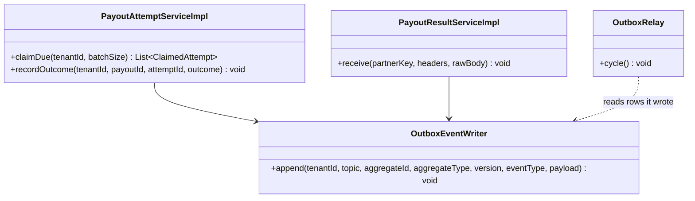
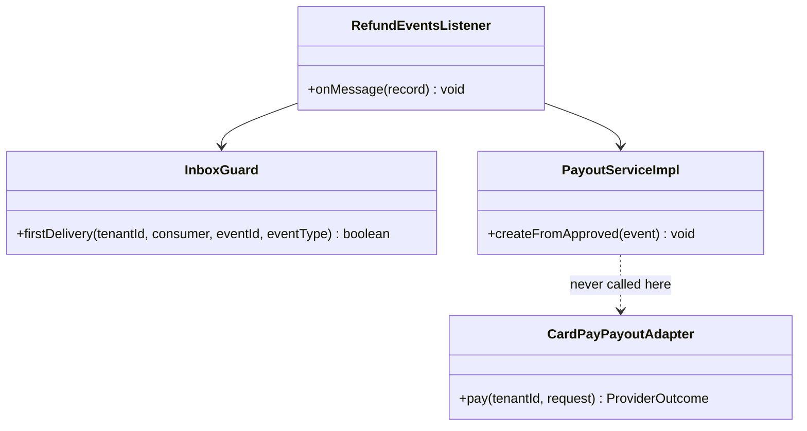
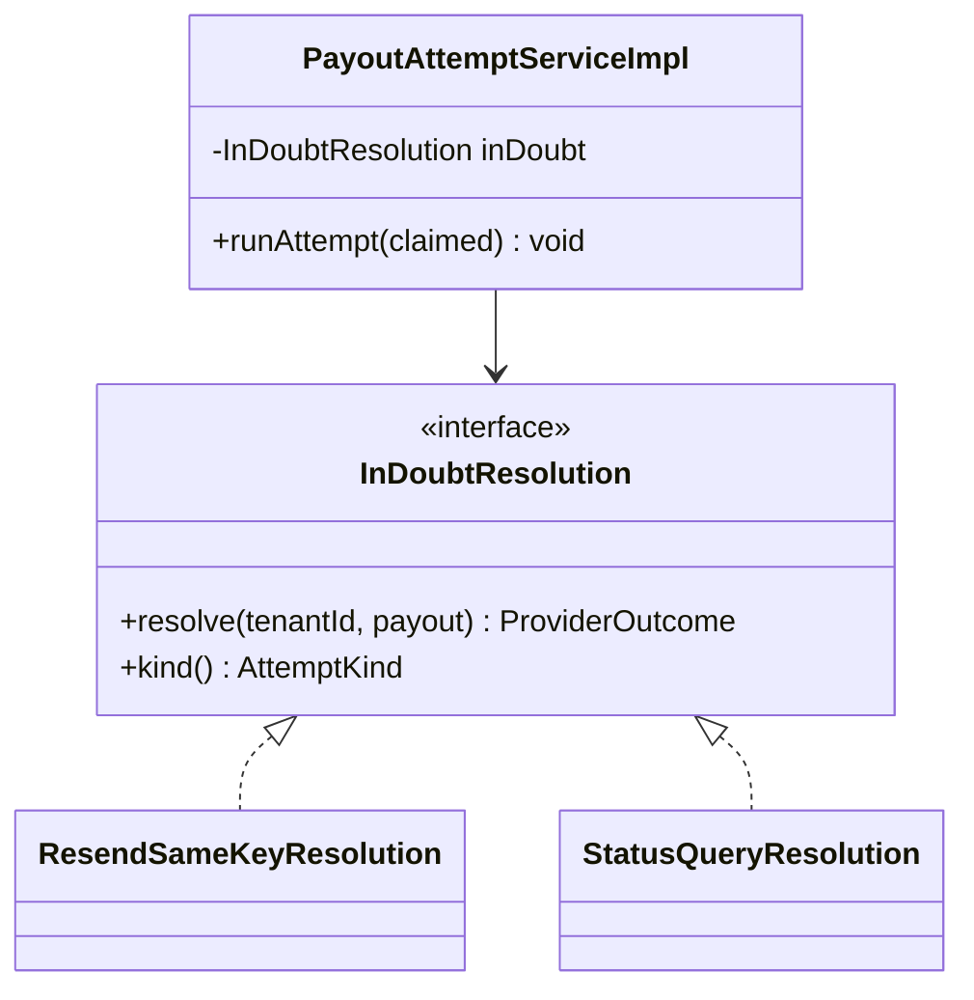
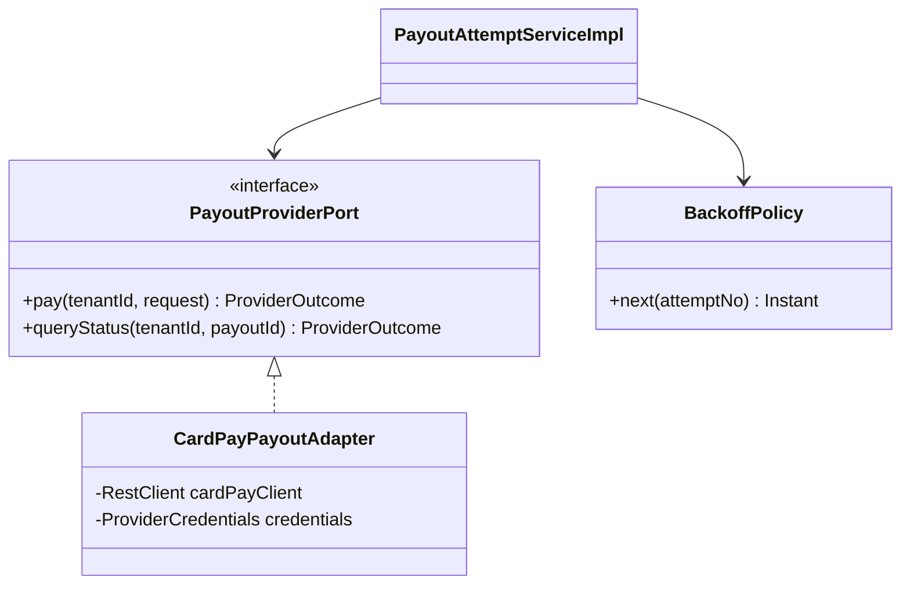
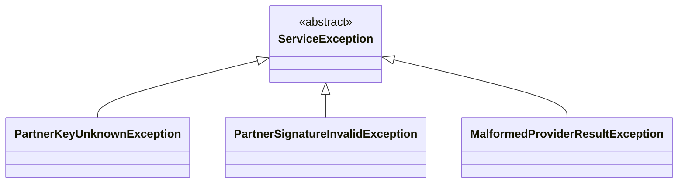
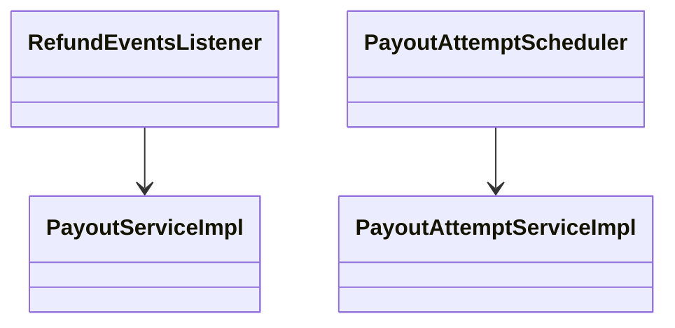
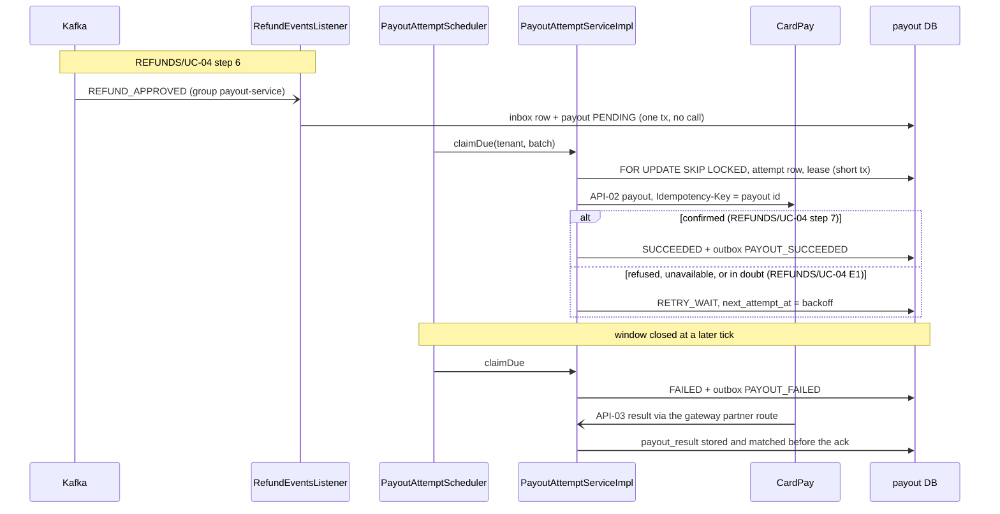

<!--
CHUNK: 04
TITLE: Per-Service Implementation - payout-service
PROJECT: Refunds Platform
VERSION: 1.0
DEPENDS_ON: 03, 09
PART OF: LLD - Refunds Platform
-->

# 7. Per-Service Implementation - payout-service

> **Bounded context:** [SDD §17.2 payout-service](../../sdd-refunds-platform/13b-service-payout.md#172-payout-service), a separate deployable (ADR-01)
>
> **Source code:** None yet (greenfield). Planned: `payout-service`, packages `<base-package>.payout.{domain,application,adapter}`
>
> **Owns use cases (SDD 09):** None - pays approved refunds back to the original card
>
> **Participates in:** REFUNDS/UC-04 (owner: refund-service)

---

## 7.1 Responsibility

payout-service owns the `Payout` aggregate: one payout per approved refund, its CardPay attempts, the CardPay results received for it, and its retry schedule inside the ADR-10 retry window. It consumes `REFUND_APPROVED` from `refunds-platform-refund-events`, calls CardPay (API-02) with the payout id as the `Idempotency-Key` on every attempt, receives CardPay results through the gateway's partner route (API-03), and publishes `PAYOUT_SUCCEEDED` and `PAYOUT_FAILED` on `refunds-platform-payout-events`, consumed only by refund-service. It runs a daily reconciliation against CardPay's own payout records. It does not own refund status (refund-service), messages (notification-service), or card data (CardPay), and it never calls refund-service.

---

## 7.2 Class & Interface Map

### Controllers

| Class | Endpoints | Notes |
|-------|-----------|-------|
| `PayoutResultController` | API-03: method and path TBD - external; when CardPay pushes, `/v1/partners/{partnerKey}/<resource>` (ADR-11) | No permission token (provider scheme, verified with the tenant's secret); no `@UseCase` (not an SDD §7.3 entry point) |

> TODO: API-03 transport (callback or polling), path, signature scheme, and body are `TBD - external` ([SDD API-03](../../sdd-refunds-platform/11-api-contracts.md#api-03-receive-a-payout-result-cardpay---payout-service)); best guess a JSON callback `POST /v1/partners/{partnerKey}/payout-results` with an HMAC signature header - verify with the CardPay documentation.

> **Convention:** payout-service has no SDD §7.3 entry point, so none of its handlers carries `@UseCase` (`09-cross-cutting.md` § 12.8).

### Other entry points

| Class | Trigger | Notes |
|-------|---------|-------|
| `RefundEventsListener` | `@KafkaListener` on `refunds-platform-refund-events`, group `payout-service` | Handles `REFUND_APPROVED`; ignores every other `event_type` |
| `PayoutAttemptScheduler` | `@Scheduled(fixedDelay)`, every replica | Claims due payouts per tenant with `FOR UPDATE SKIP LOCKED` |
| `ProviderReconciliationJob` | `@Scheduled`, daily, one replica (advisory lock) | REFUNDS/NFR-01 comparison with CardPay |
| `OutboxRelay`, `HousekeepingJob` (kernel) | `@Scheduled` | Relays `outbox_event`; prunes `inbox_event` |

### Services (interfaces)

| Interface | Purpose | Implementations |
|-----------|---------|-----------------|
| `PayoutService` | Create a payout from `REFUND_APPROVED` | `PayoutServiceImpl` |
| `PayoutAttemptService` | Claim due payouts, run an attempt, record its outcome, close the window | `PayoutAttemptServiceImpl` |
| `PayoutResultService` | Store, match, apply, and re-match API-03 results | `PayoutResultServiceImpl` |
| `ProviderReconciliationService` | Daily comparison with CardPay's payout records | `ProviderReconciliationServiceImpl` |
| `InDoubtResolution` (strategy) | How an in-doubt attempt is re-run | `ResendSameKeyResolution`, `StatusQueryResolution` |

### Outbound ports and adapters

| Port | Adapter | Notes |
|------|---------|-------|
| `PayoutProviderPort` | `CardPayPayoutAdapter` | API-02 (`pay`, `queryStatus`); Resilience4j instance `cardpay` |
| `ProviderReportPort` | `CardPayReportAdapter` | CardPay payout report or query by date (TBD - external, SDD §15.6) |
| `PartnerSignatureVerifier` | `CardPaySignatureVerifier` | API-03 signature (TBD - external) |
| `PartnerKeyResolver` | Kernel `ConfiguredPartnerKeyResolver` | `partnerKey` to `tenant_id` from tenant configuration (ADR-11) |
| `PayoutRepository`, `PayoutResultRepository` | `JdbcPayoutRepository`, `JdbcPayoutResultRepository` | Extend `TenantScopedJdbcRepository` |
| `OutboxEventWriter`, `InboxGuard`, `IdGenerator`, `Clock`, `ProviderCredentials` | Kernel | `09-cross-cutting.md` |

### Domain Types (records)

| Type | Kind | Purpose |
|------|------|---------|
| `Payout` | aggregate root | State machine: `pending`, `startAttempt`, `succeed`, `retryWait`, `fail`; window and lease rules |
| `PayoutAttempt` | entity | One CardPay call: `attemptNo`, `kind` (PAY, STATUS_QUERY), `outcome` (null while in flight) |
| `PayoutResult` | entity | One API-03 result: MATCHED or UNMATCHED |
| `PayoutStatus`, `AttemptOutcome`, `AttemptKind` | enums | `PENDING, RETRY_WAIT, SUCCEEDED, FAILED`; `CONFIRMED, REFUSED, UNAVAILABLE, IN_DOUBT`; `PAY, STATUS_QUERY` |
| `PayoutRequest`, `ProviderOutcome` | records | Adapter input (key, amount, currency, original payment reference, reference number) and mapped output (outcome, provider ref, provider code) |
| `BackoffPolicy` | class | Exponential backoff with equal jitter, clamped to the window end |
| `RefundApprovedPayload`, `PayoutSucceededPayload`, `PayoutFailedPayload` | records | Event payloads (`07-event-contracts.md` § 10.2) |

### Method Signatures (key methods only)

```java
public interface PayoutService {
  void createFromApproved(EventEnvelope<RefundApprovedPayload> event);   // inside the listener transaction
}

public interface PayoutAttemptService {
  List<ClaimedAttempt> claimDue(UUID tenantId, int batchSize);          // short tx; FOR UPDATE SKIP LOCKED
  void runAttempt(ClaimedAttempt claimed);                              // no tx: provider call, then recordOutcome
  void recordOutcome(UUID tenantId, UUID payoutId, UUID attemptId, ProviderOutcome outcome); // short tx
}

public interface PayoutResultService {
  void receive(String partnerKey, HttpHeaders headers, byte[] rawBody); // store before acknowledging
  void rematch(UUID tenantId, String providerPayoutRef);                // called inside recordOutcome's tx
}

public interface PayoutProviderPort {
  ProviderOutcome pay(UUID tenantId, PayoutRequest request);            // Idempotency-Key = request.payoutId()
  ProviderOutcome queryStatus(UUID tenantId, UUID payoutId);            // only if CardPay offers it (TBD)
}

public interface InDoubtResolution {
  ProviderOutcome resolve(UUID tenantId, Payout payout);
}
```

> Confirm: class and port names follow CLAUDE.md conventions inside the SDD's hexagonal layout; verify with the team.

---

## 7.3 Method-Level Pseudocode (non-trivial logic only)

### `PayoutServiceImpl.createFromApproved` (REFUNDS/UC-04 step 6)

```text
Inside RefundEventsListener's transaction, after InboxGuard.firstDelivery(...) returned true:
1. p = event.payload
2. payout = Payout.pending(id = idGenerator.next(), tenant = event.tenantId, refundId = event.aggregateId,
                           referenceNumber = p.referenceNumber, originalPaymentRef = p.originalPaymentRef,
                           amount = p.approvedAmount, nextAttemptAt = clock.now())
3. inserted = payoutRepository.insertIfAbsent(payout)      // INSERT ... ON CONFLICT (tenant_id, refund_id) DO NOTHING
4. if !inserted: meter payout_duplicate_blocked_total      // replay or redelivery: never a second payout (REFUNDS/NFR-01)
5. no provider call here (ADR-10: attempts only from committed rows)
```

### `PayoutAttemptServiceImpl.claimDue`

```text
short tx (READ_COMMITTED):
1. rows = SELECT * FROM payout WHERE tenant_id = :t AND status IN ('PENDING','RETRY_WAIT')
          AND next_attempt_at <= now() ORDER BY next_attempt_at LIMIT :batch FOR UPDATE SKIP LOCKED
2. for payout in rows:
     open = attempt of payout with outcome IS NULL (an in-flight attempt whose lease expired)
     if open != null: open.outcome = IN_DOUBT; meter payout_attempt_leases_expired_total
     windowEnd = payout.firstAttemptAt == null ? null : payout.firstAttemptAt + retryWindow     // ADR-10 value
     if windowEnd != null and now >= windowEnd:
         payout.fail(now)                                                   // FAILED, failed_at
         outbox.append(PAYOUT_FAILED(refundId, amount, attempts = count(attempts), lastProviderCode,
                                     firstAttemptAt, failedAt))
         continue
     inDoubt = open != null or payout.lastOutcome == IN_DOUBT
     payout.startAttempt(now, lease = now + callTimeout + 60s)             // PENDING, next_attempt_at = lease,
                                                                            // first_attempt_at ??= now
     attempt = PayoutAttempt(attemptNo = n + 1, kind = inDoubt ? resolution.kind() : PAY, attemptedAt = now, outcome = null)
     save payout (version check) and attempt; collect ClaimedAttempt(payout, attempt, inDoubt)
3. commit; return the claimed list (runAttempt runs after commit, on the bounded attempt executor)
```

### `PayoutAttemptServiceImpl.runAttempt` and `recordOutcome` (REFUNDS/UC-04 step 7, E1)

```text
runAttempt(c):                       // no transaction, no connection held during the call
1. outcome = c.inDoubt ? inDoubtResolution.resolve(tenant, c.payout)
                       : payoutProvider.pay(tenant, PayoutRequest(c.payout.id, amount, currency,
                                                                  originalPaymentRef, referenceNumber))
   adapter mapping: success -> CONFIRMED(providerPayoutRef); refusal code -> REFUSED(code);
                    connect failure, circuit open, bulkhead full -> UNAVAILABLE;
                    read timeout or lost response after send, "accepted, result later" -> IN_DOUBT
2. recordOutcome(tenant, c.payout.id, c.attempt.id, outcome)

recordOutcome(tenant, payoutId, attemptId, o):   short tx
1. payout = repo.findForUpdate(tenant, payoutId); attempt = payout.attempt(attemptId)
2. attempt.complete(o.outcome, o.providerCode, now)
3. if o.providerPayoutRef != null and payout.providerPayoutRef == null:
       payout.providerPayoutRef = o.providerPayoutRef; payoutResultService.rematch(tenant, o.providerPayoutRef)
4. if payout.status == SUCCEEDED: save attempt; return                  // an API-03 result won the race
5. stale = attemptId != payout.latestAttemptId                          // a newer in-doubt attempt exists
6. switch o.outcome:
     CONFIRMED -> payout.succeed(now)                                    // from PENDING, RETRY_WAIT, or FAILED (late)
                  outbox.append(PAYOUT_SUCCEEDED(refundId, paidAmount = amount, providerPayoutRef, succeededAt))
     REFUSED, UNAVAILABLE, IN_DOUBT ->
                  if stale or payout.status == FAILED: record only
                  else payout.retryWait(next = min(backoff.next(attemptNo), payout.windowEnd()))
7. save payout (version check) and attempt; commit
```

### `PayoutResultServiceImpl.receive` (API-03)

```text
1. tenant = partnerKeyResolver.resolve(CARDPAY, partnerKey)           -> unknown: 404, no body detail
2. signatureVerifier.verify(headers, rawBody, secrets.forTenant(tenant, "cardpay-callback"))
                                                                       -> invalid: 401, security event (ADR-11)
3. r = parse(rawBody)                                                  -> malformed: 400
4. tx: inserted = INSERT payout_result(UNMATCHED, dedup_key, raw_body) ON CONFLICT (tenant_id, dedup_key) DO NOTHING
       if !inserted: commit; return 200                                // duplicate result is a no-op
       payout = match(tenant, echoed payout id | echoed reference number | providerPayoutRef)
       if payout == null: keep UNMATCHED; commit; return 200           // gauge payout_results_unmatched alerts
       result.matched(payout.id); payout.providerPayoutRef ??= r.providerPayoutRef
       success -> if payout.status != SUCCEEDED: payout.succeed(now); outbox PAYOUT_SUCCEEDED
       failure -> close the open attempt as REFUSED; if payout in PENDING: payout.retryWait(...)
5. commit, then acknowledge (2xx)                                      // stored before acknowledged (SDD API-03)
```

> TODO: best guess `dedup_key` for API-03 results = CardPay's own event or message id, else SHA-256 of (provider payout ref, outcome, echoed reference); SDD API-03 says a duplicate result is a no-op but the provider fields are TBD - external - verify with the CardPay documentation.

> Confirm: ADR-11 asks the service to refuse "any body that names a payout ... of another tenant" as a security event; matching only inside the resolved tenant cannot tell a foreign payout id from an unknown one without a cross-tenant read (forbidden in application code, SDD §11.2), so such a result stays UNMATCHED with the unmatched alarm. Confirm this reading.

### `BackoffPolicy.next`

```text
next(attemptNo):                                   // attemptNo starts at 1
  d = min(cap, base * 2^(attemptNo - 1))
  return now + d/2 + random(0, d/2)                // equal jitter; the caller clamps to the window end
```

> TODO: best guess base 1 minute and cap 2 hours for CardPay retries (SDD INT-01 leaves the initial delay and backoff cap open), giving about 19 attempts inside a 24-hour window - verify.

---

## 7.4 Design Patterns Applied

### Pattern: Outbox

> **Applied:** Outbox pattern (CLAUDE.md: "Outbox pattern is mandatory for any state change that must produce an event. No dual-writes to DB and Kafka.")
>
> **Rationale (this service):** a payout that reaches SUCCEEDED or FAILED must publish `PAYOUT_SUCCEEDED` or `PAYOUT_FAILED` exactly when that state commits; a dual-write could mark a payout SUCCEEDED while refund-service never hears of it (the request stays APPROVED and the watchdog fires), or publish a success whose transaction rolled back.

**Roles:**

| Role | Class / Component | Notes |
|------|-------------------|-------|
| Outbox table | `outbox_event` in database `payout` | Same shape as the refund schema's (`05-data-model.md`) |
| Outbox writer | `PayoutAttemptServiceImpl.claimDue` (FAILED), `recordOutcome` and `PayoutResultServiceImpl.receive` (SUCCEEDED) | Same transaction as the payout update |
| Outbox publisher | `OutboxRelay` (kernel) | One active relay per database |

**Class diagram:**



**Pseudocode skeleton:**

```text
payout.succeed(now); payouts.update(payout);
outbox.append(tenant, "refunds-platform-payout-events", payout.id(), "Payout", payout.version(),
              "PAYOUT_SUCCEEDED", new PayoutSucceededPayload(payout.refundId(), payout.amount(), ref, now));
```

### Pattern: Idempotency (consumer, provider key, and partner results)

> **Applied:** Idempotency (CLAUDE.md: "Idempotency keys on all write endpoints touching money/ wallet/ notifications or external providers." and "Idempotency on every consumer and every write endpoint.")
>
> **Rationale (this service):** this is the REFUNDS/NFR-01 service. Three duplicates are possible: a redelivered or replayed `REFUND_APPROVED` (stopped by the inbox and the unique (`tenant_id`, `refund_id`) index), a re-sent CardPay call after an unknown outcome (stopped by CardPay honouring the same `Idempotency-Key`, the payout id, ADR-10), and a redelivered CardPay result (stopped by the unique `dedup_key`).

**Roles:**

| Role | Class / Component | Notes |
|------|-------------------|-------|
| Consumer dedup | `InboxGuard` + unique (`tenant_id`, `refund_id`) on `payout` | Belt and braces: the unique index also stops a replay into a new consumer group |
| Provider idempotency key | `CardPayPayoutAdapter.pay` sends `payout.id` on every attempt | Never a new key for the same payout (ADR-10) |
| Partner result dedup | `payout_result` unique (`tenant_id`, `dedup_key`) | Stored before acknowledgement |

**Class diagram:**



**Pseudocode skeleton:**

```text
restClient.post().uri(cardPayPayoutUri)                 // API-02, TBD - external
    .header(cardPayIdempotencyHeader, payout.id().toString())   // header name TBD - external
    .body(new CardPayPayoutBody(...)) ...
```

### Pattern: Strategy (in-doubt resolution)

> **Applied:** Strategy (CLAUDE.md: "Strategy for runtime variants")
>
> **Rationale (this service):** an in-doubt attempt is resolved either by re-sending with the same key or by a status query, "if CardPay offers it" (ADR-10, SDD §17.2); API-02 is `TBD - external`, so the variant must be switchable by configuration (`refunds-platform.payout.in-doubt-resolution: RESEND | STATUS_QUERY`) when the CardPay documentation arrives, without touching the attempt logic.

**Roles:**

| Role | Class / Component |
|------|-------------------|
| Strategy interface | `InDoubtResolution` |
| Concrete strategies | `ResendSameKeyResolution` (calls `pay` with the same key), `StatusQueryResolution` (calls `queryStatus`) |
| Context | `PayoutAttemptServiceImpl.runAttempt`, given the bean selected by configuration |

**Class diagram:**



**Pseudocode skeleton:**

```text
@Bean InDoubtResolution inDoubtResolution(PayoutProperties props, PayoutProviderPort provider) {
  return switch (props.inDoubtResolution()) {
    case RESEND -> new ResendSameKeyResolution(provider);
    case STATUS_QUERY -> new StatusQueryResolution(provider);
  };
}
```

> Confirm: Strategy is a CLAUDE.md guideline pattern applied because the variant depends on the pending API-02 documentation; default `RESEND` until CardPay confirms a status query.

### Pattern: Resilience4j on the CardPay call (API-02)

> **Applied:** Resilience defaults (CLAUDE.md: "Resilience defaults: timeouts, retries with exponential backoff and jitter, circuit breakers (Resilience4j), bulkheads for downstream provider calls (e.g., eSIM, payment, SMS).")
>
> **Rationale (this service):** CardPay outages must not exhaust the attempt threads, and a recovering CardPay must not be hit by every due payout at once (SDD §18.3). Retries are not a Resilience4j `@Retry` inside the call: each retry is a new scheduled attempt with the same key, inside the ADR-10 window, so it survives restarts and is recorded.

**Roles:**

| Role | Class / Component |
|------|-------------------|
| Timeouts | `RestClient` connect and read timeouts on the CardPay client (the attempt lease derives from them) |
| Circuit breaker | `@CircuitBreaker(name = "cardpay")` on `CardPayPayoutAdapter.pay` and `queryStatus`; open -> outcome UNAVAILABLE without a call |
| Bulkhead | `@Bulkhead(name = "cardpay")` plus the bounded attempt executor of the same size |
| Retry with backoff and jitter | `BackoffPolicy` via `RETRY_WAIT` and `next_attempt_at` (scheduler-driven) |

**Class diagram:**



**Pseudocode skeleton:**

```text
@CircuitBreaker(name = "cardpay", fallbackMethod = "unavailable") @Bulkhead(name = "cardpay")
public ProviderOutcome pay(UUID tenantId, PayoutRequest r) { ... map CardPay response ... }
private ProviderOutcome unavailable(UUID tenantId, PayoutRequest r, Throwable t) {
  return t instanceof SocketTimeoutException ? ProviderOutcome.inDoubt() : ProviderOutcome.unavailable();
}
```

### Pattern: RFC 9457 Problem Details (partner endpoint)

> **Applied:** Problem Details (CLAUDE.md: "Global @RestControllerAdvice, Problem Details (RFC 9457).")
>
> **Rationale (this service):** API-03 is our endpoint; until the CardPay contract says otherwise, its errors use the kernel `ProblemDetailsAdvice` with SDD §15.1 codes and no internals, because a provider-facing error must not reveal whether a payout id exists (ADR-11).

**Roles:**

| Role | Class / Component |
|------|-------------------|
| Base exception | `ServiceException` (kernel) |
| Subclasses | `PartnerKeyUnknownException` (404), `PartnerSignatureInvalidException` (401), `MalformedProviderResultException` (400) |
| Translator | `ProblemDetailsAdvice` (kernel) |

**Class diagram:**



**Pseudocode skeleton:**

```text
throw new PartnerSignatureInvalidException();   // 401, errorCode UNAUTHENTICATED, detail without payload data
```

> Confirm: the API-03 error envelope may have to follow the CardPay contract instead of RFC 9457 (SDD §17.2 API Standards: "per the CardPay contract once supplied").

### Pattern: Saga (choreography, participant)

> **Applied:** Saga (CLAUDE.md: "Sagas (choreography by default, orchestration when the flow is complex or needs central visibility) for cross-service business transactions. No distributed 2PC.")
>
> **Rationale (this service):** payout-service is SAGA-01 step 2 ([refund-service § Cross-service Saga](./refund-service.md#cross-service-saga-orchestrator-role)): it reacts to `REFUND_APPROVED` and answers with a payout fact. It has no compensation of its own; its recovery is forward (retries in the window), and a closed window is reported, not reversed.

**Roles:**

| Role | Class / Component |
|------|-------------------|
| Step trigger | `RefundEventsListener` -> `PayoutServiceImpl.createFromApproved` |
| Step work | `PayoutAttemptScheduler` -> `PayoutAttemptServiceImpl` |
| Step result | `PAYOUT_SUCCEEDED` or `PAYOUT_FAILED` through the outbox |

**Class diagram:**



**Pseudocode skeleton:**

```text
on REFUND_APPROVED -> payout PENDING (no call)
tick -> claim due -> attempt (same key) -> CONFIRMED: PAYOUT_SUCCEEDED | else RETRY_WAIT
window closed -> FAILED + PAYOUT_FAILED
```

---

## 7.5 Dependency Injection Graph

```mermaid
graph TB
  RefundEventsListener --> InboxGuard
  RefundEventsListener --> PayoutService
  PayoutAttemptScheduler --> PayoutAttemptService
  PayoutAttemptScheduler --> TenantDirectory
  PayoutAttemptScheduler --> AttemptExecutor
  PayoutResultController --> PayoutResultService
  ProviderReconciliationJob --> ProviderReconciliationService
  PayoutServiceImpl --> PayoutRepository
  PayoutAttemptServiceImpl --> PayoutRepository
  PayoutAttemptServiceImpl --> PayoutProviderPort
  PayoutAttemptServiceImpl --> InDoubtResolution
  PayoutAttemptServiceImpl --> BackoffPolicy
  PayoutAttemptServiceImpl --> OutboxEventWriter
  PayoutAttemptServiceImpl --> PayoutResultService
  PayoutResultServiceImpl --> PartnerKeyResolver
  PayoutResultServiceImpl --> PartnerSignatureVerifier
  PayoutResultServiceImpl --> PayoutResultRepository
  PayoutResultServiceImpl --> PayoutRepository
  PayoutResultServiceImpl --> OutboxEventWriter
  ProviderReconciliationServiceImpl --> ProviderReportPort
  PayoutProviderPort -.implements.-> CardPayPayoutAdapter
```



---

## 7.6 Transaction Boundaries

| Method | Propagation | Isolation | Rollback rules |
|--------|-------------|-----------|----------------|
| `RefundEventsListener.onMessage` + `PayoutServiceImpl.createFromApproved` | `REQUIRED` (listener transaction) | `READ_COMMITTED` | Rollback on any exception; retry, then `payout-service.dlq` |
| `PayoutAttemptServiceImpl.claimDue` | `REQUIRED`, short | `READ_COMMITTED` with `FOR UPDATE SKIP LOCKED` | Rollback on any exception; rows stay due |
| `PayoutAttemptServiceImpl.runAttempt` | None (no transaction during the CardPay call) | - | - |
| `PayoutAttemptServiceImpl.recordOutcome` | `REQUIRED`, short, row lock on the payout | `READ_COMMITTED` | Rollback on any exception; the lease expiry re-runs the attempt in doubt |
| `PayoutResultServiceImpl.receive` | `REQUIRED`; acknowledgement only after commit | `READ_COMMITTED` | Rollback -> 5xx, CardPay redelivers |
| `ProviderReconciliationServiceImpl.run` | Read-only per tenant; the provider call outside any transaction | `READ_COMMITTED` | - |

> **Convention:** never a CardPay call inside a transaction (SDD §17.2 Developer Notes). The outbox row commits with the payout state change.

> Confirm: transaction propagation and isolation defaults are applied as above; verify per method, in particular that `recordOutcome` must lock the payout row (`SELECT ... FOR UPDATE`) because an API-03 result can race it.

---

## 7.7 Error Handling

| Exception | RFC 9457 type | HTTP Status | When thrown | Caller action |
|-----------|---------------|-------------|-------------|---------------|
| `PartnerKeyUnknownException` | `.../not-found` (`NOT_FOUND`) | 404 | API-03 path names no registered partner key | CardPay operations check the registration |
| `PartnerSignatureInvalidException` | `.../unauthenticated` (`UNAUTHENTICATED`) | 401 | Signature fails with the tenant's secret; logged as a security event | None (possible attack or rotated secret, RB-05) |
| `MalformedProviderResultException` | `.../validation-failed` (`VALIDATION_FAILED`) | 400 | Result body cannot be parsed | Provider fixes and redelivers |
| Storage failure on API-03 | `.../internal-error` (`INTERNAL_ERROR`) | 500 | Transaction failed before commit | CardPay redelivers (nothing acknowledged) |
| `MalformedEventException` (consumer) | None | - | `REFUND_APPROVED` missing a field the payout needs | `payout-service.dlq` with an alarm |
| Provider refusal, 5xx, timeout | None (attempt outcome) | - | Mapped to REFUSED, UNAVAILABLE, or IN_DOUBT | Next attempt with the same key inside the window |

> **Convention:** all exceptions extend `ServiceException`; `ProblemDetailsAdvice` renders them. No stack trace or payout data in any response.

---

## 7.8 Use-Case Workflows

> **Convention:** payout-service owns no use case (SDD 09), so it has no `KEY/UC-NN` block. It realises part of REFUNDS/UC-04, owned by refund-service.

### Participates in REFUNDS/UC-04: Approve / Reject Refund

> **Owner's block:** [refund-service § REFUNDS/UC-04](./refund-service.md#refundsuc-04-approve--reject-refund) · Part realised here: REFUNDS/UC-04 step 6 (the payout is sent to the original card), step 7 (the payout succeeds), E1 (the payout is retried and reported after the ADR-10 retry window) · Entry points here: None (SDD §7.3 names no event entry point; this service is reached through `REFUND_APPROVED`, its scheduler, and API-03)

**Control flow:**

```text
1. REFUND_APPROVED consumed (group payout-service): inbox, then one PENDING payout per refund, no call
   (REFUNDS/UC-04 step 6)
2. Scheduler tick claims the due payout, opens an attempt under a lease, commits
3. CardPay API-02 with Idempotency-Key = payout id, outside any transaction (REFUNDS/UC-04 step 6)
4. CONFIRMED -> SUCCEEDED, outbox PAYOUT_SUCCEEDED (REFUNDS/UC-04 step 7; outbox emission point)
5. REFUSED / UNAVAILABLE / IN_DOUBT -> RETRY_WAIT with jittered backoff inside the window (REFUNDS/UC-04 E1)
6. Lease expired with no outcome -> next attempt in doubt: same key or status query (ADR-10)
7. Window closed -> FAILED, outbox PAYOUT_FAILED (REFUNDS/UC-04 E1; outbox emission point)
8. API-03 result at any time: stored, matched, applied; a late success moves FAILED to SUCCEEDED
```

**Sequence diagram:**



**Idempotency points:** inbox (`payout-service`, `event_id`) and unique (`tenant_id`, `refund_id`); CardPay `Idempotency-Key` = payout id on every attempt; API-03 `dedup_key`.

**Outbox emission points:** `PAYOUT_SUCCEEDED` (step 4, or step 8 on a matched success); `PAYOUT_FAILED` (step 7).

**Retry / timeout policy:** scheduler-driven retries with `BackoffPolicy` inside the ADR-10 retry window; `cardpay` circuit breaker and bulkhead; call timeouts define the lease (`call timeout + 60 s`, SDD §17.2).

**Error handling:** refusal, unavailability, and timeout are attempt outcomes, never exceptions to the caller; a malformed `REFUND_APPROVED` goes to `payout-service.dlq`; an unmatched API-03 result stays UNMATCHED with an alarm and is re-matched when a provider reference is learned.

### Workflow: Provider reconciliation

> **Traceability:** No BRD use case. Realises the payout-service half of REFUNDS/NFR-01 ([SDD §18](../../sdd-refunds-platform/14-performance-and-capacity.md#18-performance--capacity-planning)); platform job.

```text
@Scheduled(cron = "${refunds-platform.payout.reconciliation.cron}", zone = "UTC"); advisory lock "payout.reconciliation"
for tenant in tenantDirectory.all():
  day = yesterday in the tenant zone; [from, to) = dayBounds
  ours   = SELECT id, provider_payout_ref, amount FROM payout WHERE tenant_id = :t AND status = 'SUCCEEDED'
           AND succeeded_at in [from, to)
  theirs = providerReportPort.payouts(tenant, day)                  // TBD - external (SDD §15.6)
  mismatches = theirs counted twice + only in ours + only in theirs
  meter payout_reconciliation_mismatches_total += mismatches        // alert above zero
```

> TODO: CardPay's payout report or query by date is `TBD - external`; best guess a daily report fetched over API-02's host with the same credentials - verify with the CardPay documentation.

### Cross-service Saga (orchestrator role)

Not applicable for this service: SAGA-01 is choreographed; payout-service is step 2 (see [refund-service § Cross-service Saga](./refund-service.md#cross-service-saga-orchestrator-role)).

<!-- MASTER: refunds-platform-lld-master.md | PREV: 04-implementation/notification-service.md | NEXT: 04-implementation/refund-service.md -->
