<!--
CHUNK: 04
TITLE: Per-Service Implementation - refund-service
PROJECT: Refunds Platform
VERSION: 1.0
DEPENDS_ON: 03, 09
PART OF: LLD - Refunds Platform
-->

# 7. Per-Service Implementation - refund-service

> **Bounded context:** [SDD §17.1 refund-service](../../sdd-refunds-platform/13a-service-refund.md#171-refund-service), a module of `refunds-platform-core` (ADR-01)
>
> **Source code:** None yet (greenfield). Planned: `refunds-platform-core`, packages `<base-package>.refund.{domain,application,adapter}`
>
> **Owns use cases (SDD 09):** [REFUNDS/UC-01](../../brd-refunds-portal/06a-use-cases-customer.md#uc-01-request-a-refund), [REFUNDS/UC-02](../../brd-refunds-portal/06a-use-cases-customer.md#uc-02-track-refund-status-web-and-mobile), [REFUNDS/UC-03](../../brd-refunds-portal/06a-use-cases-customer.md#uc-03-cancel-a-refund-request), [REFUNDS/UC-04](../../brd-refunds-portal/06b-use-cases-branch-manager.md#uc-04-approve--reject-refund)
>
> **Participates in:** None (its `REFUND_PAID` feeds LOYALTY/UC-02 BR-1, which loyalty-service owns and realises)

---

## 7.1 Responsibility

refund-service owns the `RefundRequest` aggregate: the request, its receipt lines with their item claims, its status history, the branch decision, and the payout status mirrored from payout-service. It is the source of truth for where a refund stands and the hub of the event flow: it publishes `REFUND_SUBMITTED`, `REFUND_CANCELLED`, `REFUND_APPROVED`, `REFUND_REJECTED`, `REFUND_PAID`, and `REFUND_PAYOUT_FAILED` on `refunds-platform-refund-events` (consumed by payout-service, notification-service, and loyalty-service) and consumes `PAYOUT_SUCCEEDED` and `PAYOUT_FAILED` from `refunds-platform-payout-events`. It reads receipts synchronously from POS Records (API-01), always taking amounts from POS, never from the client, and serves the daily branch refund report from its own tables. It does not own payouts or CardPay attempts (payout-service), messages (notification-service), points (loyalty-service), or identities (Keycloak).

---

## 7.2 Class & Interface Map

> **Convention:** load-bearing classes only. Constructor injection only; records for every DTO, command, and payload (CLAUDE.md).

### Controllers

| Class | Endpoints | Notes |
|-------|-----------|-------|
| `ReceiptController` | `GET /v1/receipts/{receiptNumber}/refundable-items` | `refund.receipt.read`; gateway limit of 10 lookups per customer per rolling hour (SDD §17.1 Constraints) |
| `RefundRequestController` | `POST /v1/refund-requests`, `GET /v1/refund-requests`, `GET /v1/refund-requests/{refundId}`, `POST /v1/refund-requests/{refundId}/cancellation`, `POST /v1/refund-requests/{refundId}/decision` | `Idempotency-Key` required on the three POSTs; Auth scopes per [SDD §17.1 List of APIs](../../sdd-refunds-platform/13a-service-refund.md#171-refund-service) |
| `BranchRefundController` | `GET /v1/branches/{branchId}/refund-requests`, `GET /v1/branches/{branchId}/refund-report` | `branchId` must equal the `branch_id` claim, else 403 |

> **Convention:** every entry point a § 7.8 traceability line names carries `@UseCase("KEY/UC-NN")` with the §7.3 value (`09-cross-cutting.md` § 12.8). Platform endpoints carry none.

**Traced entry points and their `@UseCase` values (from SDD §7.3):**

| Entry point (as §7.3 writes it) | Handler method | `@UseCase` |
|---------------------------------|----------------|------------|
| `GET /v1/receipts/{receiptNumber}/refundable-items` | `ReceiptController.findRefundableItems` | `REFUNDS/UC-01` |
| `POST /v1/refund-requests` | `RefundRequestController.submit` | `REFUNDS/UC-01` |
| `GET /v1/refund-requests` | `RefundRequestController.listOwn` | `REFUNDS/UC-02` |
| `GET /v1/refund-requests/{refundId}` | `RefundRequestController.getDetail` | `REFUNDS/UC-02` |
| `POST /v1/refund-requests/{refundId}/cancellation` | `RefundRequestController.cancel` | `REFUNDS/UC-03` |
| `GET /v1/branches/{branchId}/refund-requests` | `BranchRefundController.branchQueue` | `REFUNDS/UC-04` |
| `POST /v1/refund-requests/{refundId}/decision` | `RefundRequestController.decide` | `REFUNDS/UC-04` |

> Confirm: the branch manager also calls `GET /v1/refund-requests/{refundId}` at REFUNDS/UC-04 step 3 ("opens a request"), but SDD §7.3 lists that entry point under REFUNDS/UC-02 only (the SDD reviewer notes the gap). Its `use_case` stays `REFUNDS/UC-02` until §7.3 lists it under REFUNDS/UC-04 too; then the annotation becomes `@UseCase({"REFUNDS/UC-02", "REFUNDS/UC-04"})`.

### Other entry points (no `@UseCase`)

| Class | Trigger | Notes |
|-------|---------|-------|
| `PayoutEventsListener` | `@KafkaListener` on `refunds-platform-payout-events`, group `refund-service` | Realises REFUNDS/UC-04 step 7 and E1; SDD §7.3 names no event entry point, so no `@UseCase` (`09-cross-cutting.md` § 12.8) |
| `BranchRefundController.dailyReport` | `GET /v1/branches/{branchId}/refund-report` | REFUNDS 09 report; no BRD use case |
| `PayoutWatchdogJob` | `@Scheduled`, daily | REFUNDS/NFR-01 check |
| `OutboxRelay` (kernel) | `@Scheduled(fixedDelay)` | Relays `refund.outbox_event` |
| `HousekeepingJob` (kernel) | `@Scheduled`, hourly | Deletes expired `idempotency_record`, old `inbox_event`, old lookup counters |

### Services (interfaces, inbound ports)

| Interface | Purpose | Implementations |
|-----------|---------|-----------------|
| `ReceiptQueryService` | Refundable items of a receipt (REFUNDS/UC-01 steps 1-2) | `ReceiptQueryServiceImpl` |
| `RefundRequestService` | Submit and cancel (REFUNDS/UC-01 steps 3-6, REFUNDS/UC-03) | `RefundRequestServiceImpl` |
| `RefundDecisionService` | Approve in full or in part, or reject (REFUNDS/UC-04 steps 3-6) | `RefundDecisionServiceImpl` |
| `RefundQueryService` | Own list and detail, branch queue (REFUNDS/UC-02, REFUNDS/UC-04 steps 1-2) | `RefundQueryServiceImpl` |
| `PayoutOutcomeService` | Apply `PAYOUT_SUCCEEDED` and `PAYOUT_FAILED` (REFUNDS/UC-04 step 7, E1) | `PayoutOutcomeServiceImpl` |
| `BranchReportService` | Daily branch refund report | `BranchReportServiceImpl` |

### Outbound ports and adapters

| Port | Adapter | Notes |
|------|---------|-------|
| `ReceiptLookupPort` | `PosReceiptLookupAdapter` | API-01; `RestClient`; Resilience4j instance `pos-receipt` |
| `RefundRequestRepository` | `JdbcRefundRequestRepository` | Loads and saves the whole aggregate (request, items, history) |
| `RefundReportQueries` | `JdbcRefundReportQueries` | Read-only aggregations for the report and the watchdog |
| `ReferenceNumberGenerator` | `SequenceReferenceNumberGenerator` | PostgreSQL sequence `refund.reference_number_seq` |
| `ReceiptLookupCounter` | `JdbcReceiptLookupCounter` | Per-customer daily `RECEIPT_NOT_FOUND` count |
| `OutboxEventWriter`, `InboxGuard`, `IdempotencyRecordRepository`, `TenantCalendar`, `IdGenerator`, `Clock` | Kernel | `09-cross-cutting.md` |

### Repositories

| Class | Entity | Notes |
|-------|--------|-------|
| `JdbcRefundRequestRepository` | `RefundRequest` (+ `RefundRequestItem`, `RefundStatusHistory`) | Extends `TenantScopedJdbcRepository`; optimistic update `WHERE tenant_id = ? AND id = ? AND version = ?` |
| `JdbcRefundReportQueries` | Projections | Report aggregation, overdue payout count |
| `JdbcReceiptLookupCounter` | `receipt_lookup_counter` rows | Upsert with `ON CONFLICT DO UPDATE` |

### Domain Types (records)

| Type | Kind | Purpose |
|------|------|---------|
| `RefundRequest` | aggregate root (plain class) | State machine methods `submit`, `cancel`, `approve`, `reject`, `markPaid`, `markPayoutFailed`; holds `version` |
| `RefundRequestItem` | entity | One POS line with `claimActive` |
| `RefundStatusHistory` | entity | Append-only status change |
| `RefundStatus`, `PayoutStatus`, `DecisionType` | enums | `SUBMITTED, APPROVED, REJECTED, PAID, CANCELLED`; `NONE, PENDING, FAILED, SUCCEEDED`; `APPROVE, REJECT` |
| `Money` | record (kernel) | `BigDecimal amount` (scale 4), `String currency` |
| `ReceiptSnapshot`, `ReceiptLine` | records | POS response mapped by the adapter (lines, branch, purchase date, currency, original payment reference) |
| `SubmitRefundCommand`, `DecideRefundCommand` | records | Application commands |
| `CreateRefundRequestDto`, `RefundDecisionDto` | records | Web bodies (OpenAPI `CreateRefundRequest`, `RefundDecision`) |
| `RefundableItemsResponse`, `RefundRequestResponse`, `RefundRequestPageResponse`, `RefundRequestDetailResponse`, `BranchRefundReportResponse` | records | Web responses (OpenAPI `RefundableItems`, `RefundRequest`, `RefundRequestPage`, `RefundRequestDetail`, `BranchRefundReport`) |
| `RefundSubmittedPayload` ... `RefundPayoutFailedPayload`, `PayoutSucceededPayload`, `PayoutFailedPayload` | records | Event payloads (`07-event-contracts.md` § 10.2) |

### Method Signatures (key methods only)

```java
public interface ReceiptQueryService {
  RefundableItemsResponse findRefundableItems(CallerContext caller, String receiptNumber);
}

public interface RefundRequestService {
  RefundRequestResponse submit(CallerContext caller, SubmitRefundCommand cmd, IdempotencyContext idem);
  RefundRequestResponse cancel(CallerContext caller, UUID refundId, IdempotencyContext idem);
}

public interface RefundDecisionService {
  RefundRequestResponse decide(CallerContext caller, UUID refundId, DecideRefundCommand cmd, IdempotencyContext idem);
}

public interface RefundQueryService {
  RefundRequestPageResponse listOwn(CallerContext caller, Cursor cursor, int limit);
  RefundRequestDetailResponse getDetail(CallerContext caller, UUID refundId);
  RefundRequestPageResponse branchQueue(CallerContext caller, String branchId, Cursor cursor, int limit);
}

public interface PayoutOutcomeService {
  void onPayoutSucceeded(EventEnvelope<PayoutSucceededPayload> event);
  void onPayoutFailed(EventEnvelope<PayoutFailedPayload> event);
}

public interface BranchReportService {
  BranchRefundReportResponse dailyReport(CallerContext caller, String branchId, LocalDate date);
}

public interface ReceiptLookupPort {
  ReceiptSnapshot lookup(UUID tenantId, String receiptNumber); // throws ReceiptNotFoundException, ReceiptLookupUnavailableException
}

public interface RefundRequestRepository {
  Optional<RefundRequest> find(UUID tenantId, UUID refundId);
  Set<String> findActiveClaimLineIds(UUID tenantId, String branchId, String receiptNumber);
  void insert(RefundRequest request);          // request, items, first history row
  void update(RefundRequest request);          // optimistic on version; throws OptimisticConflictException
  Slice<RefundRequest> findOwn(UUID tenantId, UUID customerId, Cursor cursor, int limit);
  Slice<RefundRequest> findBranchQueue(UUID tenantId, String branchId, Cursor cursor, int limit);
}
```

> Confirm: class and port names follow CLAUDE.md conventions (`<Domain>Controller`, `<Domain>Service`, `<Domain>ServiceImpl`, `<Domain>Repository`) inside the SDD's hexagonal layout; verify with the team.

---

## 7.3 Method-Level Pseudocode (non-trivial logic only)

### `ReceiptQueryServiceImpl.findRefundableItems`

```text
1. receipt = receiptLookupPort.lookup(caller.tenantId, receiptNumber)
     ReceiptNotFoundException -> receiptLookupCounter.incrementNotFound(tenant, caller.subject, today) in its own tx,
                                 then rethrow (404 RECEIPT_NOT_FOUND, REFUNDS/UC-01 E2)
     ReceiptLookupUnavailableException -> rethrow (503 RECEIPT_LOOKUP_UNAVAILABLE)
2. today = tenantCalendar.today(caller.tenantId)                  // tenant IANA zone (SDD §6)
3. if receipt.purchaseDate < today.minusDays(30): throw RefundWindowPassedException (422, E1, BR-1)
4. claimed = refundRequestRepository.findActiveClaimLineIds(tenant, receipt.branchId, receiptNumber)
5. lines = receipt.lines.map(l -> RefundableLine(l.lineId, l.description, l.quantity, Money(l.amount, receipt.currency),
                                                  refundable = !claimed.contains(l.lineId)))   // A1, BR-2
6. return RefundableItemsResponse(receiptNumber, receipt.branchName, receipt.purchaseDate, lines)
   // never originalPaymentRef, never member data (SDD §17.1, R-09)
```

> Confirm: SDD §17.1 lists the lookup response fields as description, quantity, amount, refundable flag, branch name, and purchase date, but `POST /v1/refund-requests` takes `lineIds[]`, so the response must also carry each POS line id; the LLD adds `lineId` (not sensitive). Confirm with the SDD owner.

> TODO: best guess for the not-found alert (SDD §17.1: more than 20 `RECEIPT_NOT_FOUND` answers per customer per day): a `receipt_lookup_counter` row per (tenant, customer, date) incremented in its own transaction; when the count passes 20 the service increments `refund_receipt_lookup_not_found_burst_total` (no customer label) and writes a security-audit event with the customer id at DEBUG only - verify against the gateway's own capabilities once the gateway product is chosen.

### `RefundRequestServiceImpl.submit`

```text
0. Called by IdempotentCommandExecutor after the IN_PROGRESS record committed (09 § 12.2).
1. Validate cmd: receiptNumber 1..40, lineIds non-empty and distinct, reason 1..500 -> else 400 VALIDATION_FAILED
2. receipt = receiptLookupPort.lookup(tenant, cmd.receiptNumber)      // outside any DB transaction (REFUNDS/UC-01 step 5)
3. re-apply BR-1 (window, as above) and resolve selected = receipt.lines where lineId in cmd.lineIds
     unknown lineId -> 400 VALIDATION_FAILED (errors[].field = "lineIds")
4. requested = sum(selected.amount) in receipt.currency; requested must be > 0     // REFUNDS/UC-01 step 4
5. transactionTemplate.execute:
     a. claimed = repository.findActiveClaimLineIds(tenant, receipt.branchId, receiptNumber)
        if claimed intersects cmd.lineIds -> throw ItemAlreadyRefundedException (409)
     b. request = RefundRequest.submit(id = idGenerator.next(), tenant, referenceNumberGenerator.next(),
                                       customerId = caller.subject, receipt, selected, requested, cmd.reason, clock.now())
        // status SUBMITTED, payout NONE, items claim_active = true, history(null -> SUBMITTED)
     c. repository.insert(request)
        unique violation uk_refund_item_active_claim -> throw ItemAlreadyRefundedException (409, concurrent A1)
     d. outbox.append(tenant, "refunds-platform-refund-events", request.id, "RefundRequest", request.version,
                      REFUND_SUBMITTED, RefundSubmittedPayload(referenceNumber, customerId, branchId, receiptNumber,
                                                              requested, submittedAt))
     e. idempotencyRecords.complete(idem, 201, response)
6. return response (201)
```

### `RefundRequestServiceImpl.cancel`

```text
transactionTemplate.execute:
1. request = repository.find(tenant, refundId) filtered by customer_id = caller.subject -> else 404 NOT_FOUND
2. request.cancel(caller.subject, clock.now())
     status != SUBMITTED -> RefundAlreadyDecidedException (409, REFUNDS/UC-03 E1, BR-1)
     sets CANCELLED, cancelled_at, releases every item claim, appends history(SUBMITTED -> CANCELLED)
3. repository.update(request)   // version check; OptimisticConflictException -> 409 REFUND_ALREADY_DECIDED (E1)
4. outbox.append(... REFUND_CANCELLED, RefundCancelledPayload(referenceNumber, customerId, branchId, cancelledAt))
5. idempotencyRecords.complete(idem, 200, response)
```

### `RefundDecisionServiceImpl.decide`

```text
transactionTemplate.execute:
1. request = repository.find(tenant, refundId) -> else 404 NOT_FOUND
2. if request.branchId != caller.branchId -> throw ForbiddenBranchException (403, REFUNDS/UC-04 BR-1)
3. if request.status != SUBMITTED -> throw RefundAlreadyDecidedException (409)
4. switch cmd.decision:
   APPROVE:
     amount = cmd.approvedAmount (required, same currency as the request) -> else 400
     if amount <= 0 or amount > request.requestedAmount -> InvalidPartialAmountException (422, A1, BR-2)
     partial = amount < request.requestedAmount
     if partial and blank(cmd.reason) -> ReasonRequiredException (422)
     request.approve(amount, cmd.reason, caller.subject, now)      // APPROVED, payout_status PENDING, history row
     event = REFUND_APPROVED(referenceNumber, customerId, branchId, receiptNumber, originalPaymentRef,
                             requestedAmount, approvedAmount, partial, decisionReason, approvedAt)
   REJECT:
     if blank(cmd.reason) -> ReasonRequiredException (422, A2, BR-3)
     request.reject(cmd.reason, caller.subject, now)               // REJECTED, claims released, history row
     event = REFUND_REJECTED(referenceNumber, customerId, branchId, decisionReason, rejectedAt)
5. repository.update(request)   // OptimisticConflictException -> 409 REFUND_ALREADY_DECIDED
6. outbox.append(... event)
7. idempotencyRecords.complete(idem, 200, response)
```

> Confirm: REFUNDS/TC-DEC-02 expects an amount equal to the requested amount (50.00 of 50.00) to be refused in the partial-approval flow, and the SDD's own test name `decide_partialAmountEqualToRequested_throwsInvalidPartialAmount` (SDD §17.1 Developer Notes) says the same, while SDD §17.1 Business Logic treats `approvedAmount` equal to the requested amount as a full approval and `RefundDecision` has no partial flag. The LLD enforces "above 0 and below the requested amount" on the decision screen's partial-amount field (`RefundDecisionComponent`) and the API accepts an equal amount as a full approval; confirm, or add an explicit partial flag to `RefundDecision` through the SDD (an upstream inconsistency, not resolved here).

### `PayoutOutcomeServiceImpl.onPayoutSucceeded` / `onPayoutFailed`

```text
Called inside the listener transaction after InboxGuard.firstDelivery(...) returned true.
onPayoutSucceeded(e):
1. request = repository.find(e.tenantId, e.payload.refundId) -> absent: throw UnknownAggregateException (DLQ)
2. if request.status != APPROVED -> throw InvalidTransitionException (DLQ with alarm; SDD §17.1 consumed-events rule)
3. request.markPaid(e.payload.paidAmount, e.payload.succeededAt)   // PAID, payout SUCCEEDED, paid_at, history row
   if paidAmount != approvedAmount: meter refund_payout_amount_mismatch_total + WARN (no ids at INFO)
4. repository.update(request)
5. outbox.append(... REFUND_PAID(referenceNumber, customerId, branchId, receiptNumber, purchaseDate, paidAmount, paidAt),
                 causationId = e.eventId)
6. observe refund_time_to_paid_seconds (paidAt - submittedAt)
onPayoutFailed(e):
1. request = repository.find(...) -> absent: DLQ
2. if request.status == PAID -> return (ignored, SDD §17.1)
3. if request.status != APPROVED -> throw InvalidTransitionException (DLQ)
4. if request.payoutStatus == FAILED -> return (already flagged)
5. request.markPayoutFailed()   // stays APPROVED, payout_status FAILED; no status history row
6. repository.update(request)
7. outbox.append(... REFUND_PAYOUT_FAILED(referenceNumber, branchId, approvedAmount, attempts, failedAt), causationId = e.eventId)
```

> Confirm: the daily report's "amounts paid" uses `approved_amount` of PAID requests because `refund_request` has no paid-amount column (SDD §17.1 Tables Design); a `PAYOUT_SUCCEEDED` whose `paidAmount` differs is counted and alerted, not stored.

### `RefundQueryServiceImpl.branchQueue`

```text
1. if branchId != caller.branchId -> 403 FORBIDDEN (REFUNDS/UC-04 BR-1)
2. rows = SELECT ... FROM refund.refund_request
          WHERE tenant_id = :t AND branch_id = :b
            AND (status = 'SUBMITTED' OR (status = 'APPROVED' AND payout_status = 'FAILED'))
            AND (segment, submitted_at, id) > (:cursorSegment, :cursorAt, :cursorId)
          ORDER BY CASE status WHEN 'SUBMITTED' THEN 0 ELSE 1 END, submitted_at, id
          LIMIT :limit + 1                       // REFUNDS/UC-04 steps 1-2 oldest first, then E1 flagged rows
3. nextCursor = encode(last row's segment, submitted_at, id) when limit + 1 rows came back
```

---

## 7.4 Design Patterns Applied

> **Convention:** every pattern below is applied because a CLAUDE.md rule triggers it (from-sdd). Kernel mechanics (relay, executor, inbox, advice) are specified once in `09-cross-cutting.md`; this section gives this service's roles, rationale, structure, and skeleton.

### Pattern: Outbox

> **Applied:** Outbox pattern (CLAUDE.md: "Outbox pattern is mandatory for any state change that must produce an event. No dual-writes to DB and Kafka.")
>
> **Rationale (this service):** every state change of `RefundRequest` produces one of six refund events that drive payouts (payout-service), customer and branch-manager messages (notification-service), and points take-backs (loyalty-service). A dual-write could approve a refund with no `REFUND_APPROVED` on the topic (a refund never paid, REFUNDS/NFR-01) or publish an approval whose transaction rolled back (a payout for a refund that is not approved). The outbox row commits with the aggregate, and the relay publishes it after commit.

**Roles:**

| Role | Class / Component | Notes |
|------|-------------------|-------|
| Outbox table | `refund.outbox_event` | Envelope as JSON (SDD §14.3), `seq` identity for relay order |
| Outbox writer | `OutboxEventWriter.append`, called by `RefundRequestServiceImpl`, `RefundDecisionServiceImpl`, `PayoutOutcomeServiceImpl` inside their transaction | After `repository.update`, so `aggregate_version` is the committed version |
| Outbox publisher | `OutboxRelay` (kernel), one active relay per database under an advisory lock | Deletes each row once Kafka acknowledges it (SDD §17.1 Retention) |

**Class diagram:**

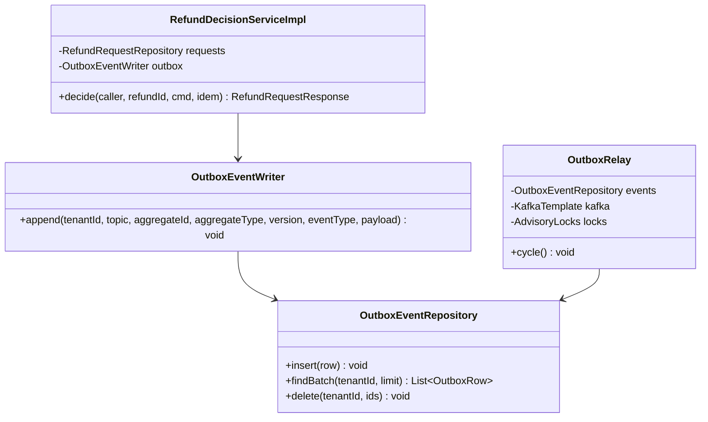

**Pseudocode skeleton:**

```text
transactionTemplate.execute(tx -> {
  request.approve(...);                       // domain change
  requests.update(request);                   // version = version + 1
  outbox.append(tenant, REFUND_TOPIC, request.id(), "RefundRequest", request.version(),
                "REFUND_APPROVED", payload);  // same transaction
  idempotencyRecords.complete(idem, 200, response);
});                                           // OutboxRelay publishes after commit (09 § 12.4)
```

### Pattern: Idempotency (write endpoints)

> **Applied:** Idempotency keys (CLAUDE.md: "Idempotency keys on all write endpoints touching money/ wallet/ notifications or external providers.")
>
> **Rationale (this service):** submit, cancel, and decide each produce customer messages, and decide produces a payout. A double click or a web-app retry after a gateway timeout would otherwise answer 409 `ITEM_ALREADY_REFUNDED` or 409 `REFUND_ALREADY_DECIDED` for a request that succeeded (SDD OI-05). The record replays the first response, scoped to the caller so no user can replay another's response (REFUNDS/NFR-04).

**Roles:**

| Role | Class / Component | Notes |
|------|-------------------|-------|
| Idempotency record table | `refund.idempotency_record` | SDD §11.1 columns; PK (`tenant_id`, `subject`, `operation`, `idempotency_key`) |
| Idempotency check | `IdempotentCommandExecutor` (kernel), invoked by `RefundRequestController` for the three POSTs | Begins the record in its own transaction before the command |
| Cached-response storage | `IdempotencyRecordRepository.complete`, called by the service inside the command transaction | Stores status and JSON body |

**Class diagram:**

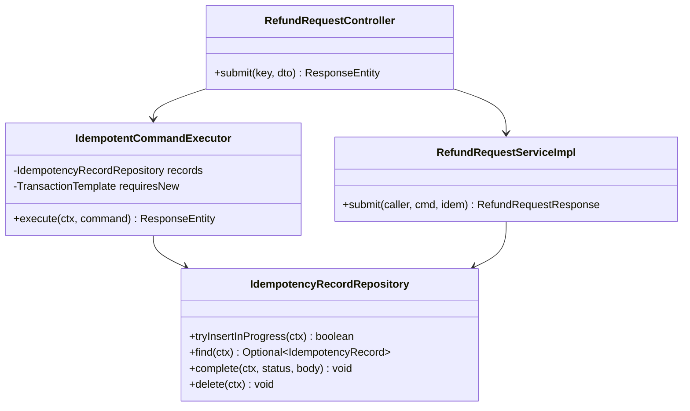

**Pseudocode skeleton:**

```text
@PostMapping("/v1/refund-requests") @UseCase("REFUNDS/UC-01")
ResponseEntity<?> submit(@RequestHeader("Idempotency-Key") UUID key, @Valid @RequestBody CreateRefundRequestDto dto) {
  var ctx = IdempotencyContext.of(caller, "POST /v1/refund-requests", key, sha256(canonicalJson(dto)));
  return executor.execute(ctx, () -> ResponseEntity.status(201).body(service.submit(caller, dto.toCommand(), ctx)));
}
```

### Pattern: Idempotent consumer (inbox)

> **Applied:** Consumer idempotency (CLAUDE.md: "Idempotency on every consumer and every write endpoint. Assume at-least-once delivery everywhere.")
>
> **Rationale (this service):** a redelivered `PAYOUT_SUCCEEDED` must not publish a second `REFUND_PAID`, which would send the customer two "paid" messages and ask loyalty-service for a second take-back (its own unique index would stop it, but the message would not be stopped). The inbox row commits with the state change, so a redelivery is a no-op.

**Roles:**

| Role | Class / Component | Notes |
|------|-------------------|-------|
| Inbox table | `refund.inbox_event` | PK (`tenant_id`, `consumer`, `event_id`) |
| Dedup check | `InboxGuard.firstDelivery` (kernel) in `PayoutEventsListener` | `INSERT ... ON CONFLICT DO NOTHING`, first in the listener transaction |
| Effect | `PayoutOutcomeServiceImpl` | Same transaction as the inbox row |

**Class diagram:**

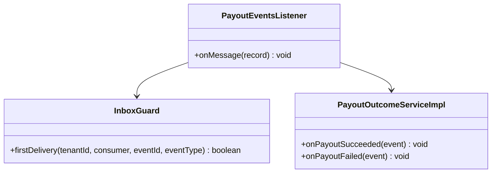

**Pseudocode skeleton:**

```text
@KafkaListener(topics = "refunds-platform-payout-events", groupId = "refund-service")
@Transactional
void onMessage(ConsumerRecord<String, String> record) {
  var envelope = envelopeReader.read(record);                      // schema-validated; bad -> DLQ
  TenantContext.set(envelope.tenantId());
  if (!inbox.firstDelivery(envelope.tenantId(), "refund-service", envelope.eventId(), envelope.eventType())) return;
  switch (envelope.eventType()) {
    case "PAYOUT_SUCCEEDED" -> outcomes.onPayoutSucceeded(envelope.as(PayoutSucceededPayload.class));
    case "PAYOUT_FAILED"    -> outcomes.onPayoutFailed(envelope.as(PayoutFailedPayload.class));
    default                 -> { }                                  // additive event types are ignored
  }
}
```

### Pattern: RFC 9457 Problem Details

> **Applied:** Problem Details error model (CLAUDE.md: "Global @RestControllerAdvice, Problem Details (RFC 9457)" and "Business exceptions extend a base ServiceException with error code.")
>
> **Rationale (this service):** refund-service is customer-facing; every error must say what went wrong and what to do next in plain language (REFUNDS 11, SDD §11.6) and carry the SDD's `errorCode` so the web app can map it to an i18n message without parsing text.

**Roles:**

| Role | Class / Component | Notes |
|------|-------------------|-------|
| Base exception | `ServiceException(errorCode, status, detailKey)` (kernel) | `detailKey` resolves to a localized plain-language `detail` |
| Per-domain subclasses | `ReceiptNotFoundException`, `RefundWindowPassedException`, `ItemAlreadyRefundedException`, `RefundAlreadyDecidedException`, `InvalidPartialAmountException`, `ReasonRequiredException`, `ReceiptLookupUnavailableException`, `ForbiddenBranchException` | § 7.7 |
| Translator | `ProblemDetailsAdvice` (`@RestControllerAdvice`, kernel) | `application/problem+json`, extensions `errorCode`, `traceId`, `errors[]` |

**Class diagram:**

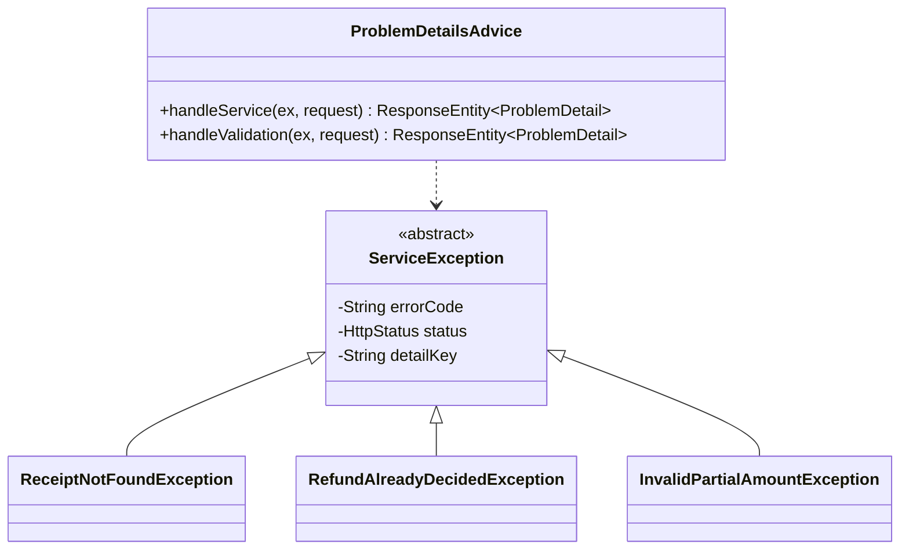

**Pseudocode skeleton:**

```text
public final class RefundAlreadyDecidedException extends ServiceException {
  public RefundAlreadyDecidedException() { super("REFUND_ALREADY_DECIDED", HttpStatus.CONFLICT, "refund.already-decided"); }
}
```

### Pattern: Resilience4j on the POS Records call (API-01)

> **Applied:** Resilience defaults (CLAUDE.md: "Resilience defaults: timeouts, retries with exponential backoff and jitter, circuit breakers (Resilience4j), bulkheads for downstream provider calls (e.g., eSIM, payment, SMS).")
>
> **Rationale (this service):** receipt lookup is synchronous at REFUNDS/UC-01 steps 2 and 5 with no fallback (R-08), so a slow POS Records must fail fast with 503 `RECEIPT_LOOKUP_UNAVAILABLE` instead of holding request threads of the whole core, which also serves loyalty endpoints (R-07). The lookup is read-only, so SDD INT-03's two retries with jitter are safe.

**Roles:**

| Role | Class / Component |
|------|-------------------|
| Port | `ReceiptLookupPort` |
| Adapter with policies | `PosReceiptLookupAdapter.lookup` with `@Retry(name = "pos-receipt")`, `@CircuitBreaker(name = "pos-receipt")`, `@Bulkhead(name = "pos-receipt")`; HTTP connect and read timeouts on its `RestClient` |
| Fallback | Circuit open, bulkhead full, or timeouts after retries -> `ReceiptLookupUnavailableException` (503) |

**Class diagram:**

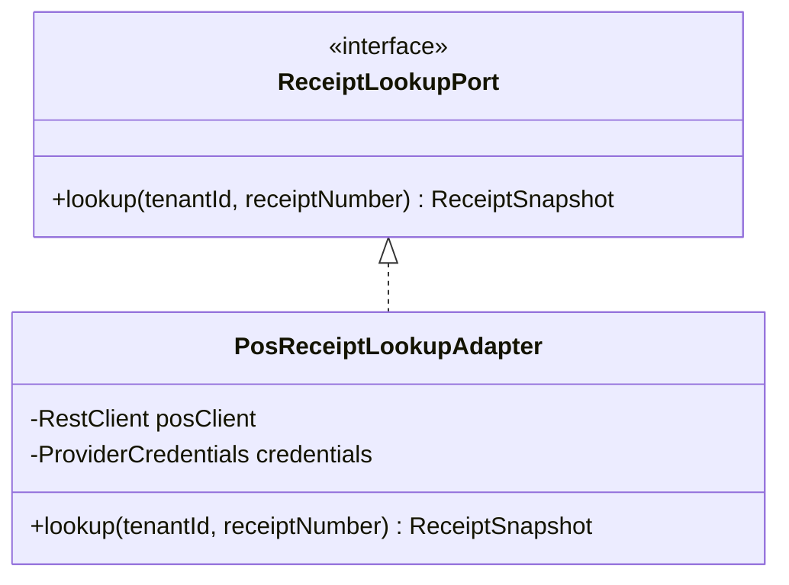

**Pseudocode skeleton:**

```text
@Retry(name = "pos-receipt") @CircuitBreaker(name = "pos-receipt", fallbackMethod = "unavailable") @Bulkhead(name = "pos-receipt")
public ReceiptSnapshot lookup(UUID tenantId, String receiptNumber) {
  var creds = credentials.forTenant(tenantId, "pos-records");        // per-tenant secret (SDD §6)
  return posClient.get()... // API-01, TBD - external; 404 -> ReceiptNotFoundException (not retried, not a CB failure)
}
private ReceiptSnapshot unavailable(UUID tenantId, String receiptNumber, Throwable t) {
  if (t instanceof ReceiptNotFoundException nf) throw nf;
  throw new ReceiptLookupUnavailableException();
}
```

### Pattern: Saga (choreography, hub role)

> **Applied:** Saga (CLAUDE.md: "Sagas (choreography by default, orchestration when the flow is complex or needs central visibility) for cross-service business transactions. No distributed 2PC.")
>
> **Rationale (this service):** the refund decision, payout, customer message, and points take-back change state in four bounded contexts. ADR-05 chose choreography: refund-service publishes `REFUND_APPROVED`, payout-service answers with a payout fact, refund-service turns it into `REFUND_PAID` or `REFUND_PAYOUT_FAILED`. Each step is a local transaction plus an outbox row; SAGA-01's step table is in § Cross-service Saga below.

**Roles:**

| Role | Class / Component |
|------|-------------------|
| Saga start (step 1) | `RefundDecisionServiceImpl.decide` emits `REFUND_APPROVED` |
| Saga continuation (step 3) | `PayoutOutcomeServiceImpl` consumes payout facts, emits `REFUND_PAID` or `REFUND_PAYOUT_FAILED` |
| Recovery signal | `PayoutWatchdogJob` (no outcome after the ADR-10 retry window plus 1 hour) |

**Class diagram:**

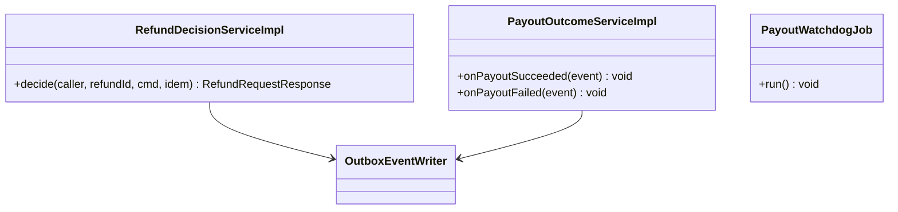

**Pseudocode skeleton:**

```text
decide(APPROVE)     -> APPROVED + outbox REFUND_APPROVED          (saga step 1)
on PAYOUT_SUCCEEDED -> PAID + outbox REFUND_PAID                  (saga step 3, success)
on PAYOUT_FAILED    -> payout_status FAILED + REFUND_PAYOUT_FAILED (saga step 3, window closed)
watchdog            -> alert when APPROVED/PENDING outlives window + 1 h (no automatic compensation)
```

> **Discretionary patterns:** none. The APPROVE/REJECT branch is a two-way switch inside one method, and the state machine lives in the aggregate's methods; a Strategy per decision type would add classes without a third variant (CLAUDE.md: "do not over-engineer").

---

## 7.5 Dependency Injection Graph

> **Convention:** constructor injection only. `Clock`, `IdGenerator`, and `TransactionTemplate` are injected into every service implementation and omitted below.

```mermaid
graph TB
  ReceiptController --> ReceiptQueryService
  RefundRequestController --> IdempotentCommandExecutor
  RefundRequestController --> RefundRequestService
  RefundRequestController --> RefundDecisionService
  RefundRequestController --> RefundQueryService
  BranchRefundController --> RefundQueryService
  BranchRefundController --> BranchReportService
  PayoutEventsListener --> InboxGuard
  PayoutEventsListener --> PayoutOutcomeService
  ReceiptQueryServiceImpl --> ReceiptLookupPort
  ReceiptQueryServiceImpl --> ReceiptLookupCounter
  RefundRequestServiceImpl --> ReceiptLookupPort
  RefundRequestServiceImpl --> RefundRequestRepository
  RefundRequestServiceImpl --> OutboxEventWriter
  RefundRequestServiceImpl --> IdempotencyRecordRepository
  RefundDecisionServiceImpl --> RefundRequestRepository
  RefundDecisionServiceImpl --> OutboxEventWriter
  PayoutOutcomeServiceImpl --> RefundRequestRepository
  PayoutOutcomeServiceImpl --> OutboxEventWriter
  BranchReportServiceImpl --> RefundReportQueries
  PayoutWatchdogJob --> RefundReportQueries
  ReceiptLookupPort -.implements.-> PosReceiptLookupAdapter
  RefundRequestRepository -.implements.-> JdbcRefundRequestRepository
```

---

## 7.6 Transaction Boundaries

| Method | Propagation | Isolation | Rollback rules |
|--------|-------------|-----------|----------------|
| `IdempotentCommandExecutor` begin / store 4xx / delete on 5xx | `REQUIRES_NEW` (kernel) | `READ_COMMITTED` | Commits independently of the command |
| `RefundRequestServiceImpl.submit` | Programmatic `TransactionTemplate` (`REQUIRED`) around the writes only; the POS call runs before it | `READ_COMMITTED` | Rollback on any exception; unique-claim violation mapped to 409 after rollback |
| `RefundRequestServiceImpl.cancel`, `RefundDecisionServiceImpl.decide` | `REQUIRED` | `READ_COMMITTED` | Rollback on `ServiceException` and `OptimisticConflictException` (mapped to 409 `REFUND_ALREADY_DECIDED`) |
| `PayoutEventsListener.onMessage` (with `PayoutOutcomeServiceImpl`) | `REQUIRED`, listener transaction on the core `DataSource` | `READ_COMMITTED` | Rollback on any exception; the error handler retries, then dead-letters (`07-event-contracts.md` § 10.4) |
| `RefundQueryServiceImpl.*` | `REQUIRED`, read-only | `READ_COMMITTED` | - |
| `BranchReportServiceImpl.dailyReport` | `REQUIRED`, read-only | `REPEATABLE_READ` (one snapshot for all figures) | - |
| `JdbcReceiptLookupCounter.incrementNotFound` | `REQUIRES_NEW` | `READ_COMMITTED` | Failure is logged and swallowed (the 404 still returns) |
| `OutboxRelay.cycle` (kernel) | `REQUIRED` per tenant batch | `READ_COMMITTED` | Rollback on a send failure: rows stay for the next cycle |

> **Convention:** the outbox row, the inbox row, and the idempotency completion live in the same transaction as the aggregate write. No remote call (POS, Kafka send) runs inside an aggregate transaction; the relay's Kafka send runs inside the relay's own transaction only to delete rows after acknowledgement.

> Confirm: storing 4xx outcomes (for example 422 `INVALID_PARTIAL_AMOUNT`) as COMPLETED records, so a repeat with the same key replays the same Problem Details, is an LLD reading of SDD §11.1, which only states the 5xx rule (delete the record); verify.

---

## 7.7 Error Handling

`type` URIs are `{problem-base-uri}/<error-code-in-kebab-case>` (`09-cross-cutting.md` § 12.6); `errorCode` values are the SDD's ([SDD §17.1 Error Handling](../../sdd-refunds-platform/13a-service-refund.md#171-refund-service)).

| Exception | RFC 9457 type | HTTP Status | When thrown | Caller action |
|-----------|---------------|-------------|-------------|---------------|
| `ReceiptNotFoundException` | `.../receipt-not-found` (`RECEIPT_NOT_FOUND`) | 404 | POS has no such receipt (REFUNDS/UC-01 E2) | Check the number and try again |
| `RefundWindowPassedException` | `.../refund-window-passed` (`REFUND_WINDOW_PASSED`) | 422 | Purchase older than 30 days in the tenant zone (E1, BR-1) | Visit the branch |
| `ItemAlreadyRefundedException` | `.../item-already-refunded` (`ITEM_ALREADY_REFUNDED`) | 409 | A selected line has an active claim (A1 at submission) | Reload the receipt |
| `RefundAlreadyDecidedException` | `.../refund-already-decided` (`REFUND_ALREADY_DECIDED`) | 409 | Cancel or decide on a request no longer SUBMITTED, or a concurrent change won (REFUNDS/UC-03 E1) | Reload the request |
| `InvalidPartialAmountException` | `.../invalid-partial-amount` (`INVALID_PARTIAL_AMOUNT`) | 422 | Amount not above 0 or above the requested amount (REFUNDS/UC-04 A1, BR-2) | Fix the amount |
| `ReasonRequiredException` | `.../reason-required` (`REASON_REQUIRED`) | 422 | Reject or partial approval without a reason (A2, BR-3) | Enter a reason |
| `ForbiddenBranchException` | `.../forbidden` (`FORBIDDEN`) | 403 | Another branch's request or queue (REFUNDS/UC-04 BR-1) | None |
| `ResourceNotFoundException` (kernel) | `.../not-found` (`NOT_FOUND`) | 404 | Unknown id, or another customer's request (existence not revealed) | None |
| `ReceiptLookupUnavailableException` | `.../receipt-lookup-unavailable` (`RECEIPT_LOOKUP_UNAVAILABLE`) | 503 | POS circuit open, bulkhead full, or timeouts after retries | Try again later |
| `RequestInProgressException` (kernel) | `.../request-in-progress` (`REQUEST_IN_PROGRESS`) | 409 + `Retry-After` | Same key while IN_PROGRESS | Web app retries silently with the same key |
| `IdempotencyConflictException` (kernel) | `.../conflict` (`CONFLICT`) | 409 | Same key, different request hash | New key for a new request |
| `MethodArgumentNotValidException` | `.../validation-failed` (`VALIDATION_FAILED`) | 400 | Bean Validation, bad cursor, bad `Idempotency-Key` format | Fix the fields in `errors[]` |
| `InvalidTransitionException`, `UnknownAggregateException` | None (consumer) | - | Payout event for an unknown refund or a request not in APPROVED | Dead-lettered to `refund-service.dlq` with an alarm |

> **Convention:** all exceptions extend `ServiceException`; `ProblemDetailsAdvice` renders them. 401 `UNAUTHENTICATED` and 403 `FORBIDDEN` for a missing permission token come from the Spring Security entry point and access-denied handler, in the same envelope. 500 `INTERNAL_ERROR` never carries internals.

---

## 7.8 Use-Case Workflows

> **Convention:** one subsection per active use case this service owns (SDD §7.3 Owner), headed with the SDD's BRD key and the BRD's ID and title exactly. REFUNDS/UC-05 (Issue Partial Refund) is merged into REFUNDS/UC-04 in its BRD and gets no block. Steps cite the BRD part they realise; the Main Flow is not restated.

### REFUNDS/UC-01: Request a Refund

> **Traceability:** BRD [REFUNDS/UC-01](../../brd-refunds-portal/06a-use-cases-customer.md#uc-01-request-a-refund) · SDD [§7.3](../../sdd-refunds-platform/03-users-and-use-cases.md#73-use-case-traceability-brd--sdd) · Owner: refund-service · Entry points: `GET /v1/receipts/{receiptNumber}/refundable-items`, `POST /v1/refund-requests` · UAT/BAT: [REFUNDS/TC-REQ-01](../../brd-refunds-portal/16-uat-bat-test-cases.md#1-refund-requests-uc-01-uc-02-uc-03-scr-01-scr-02), [REFUNDS/TC-REQ-02](../../brd-refunds-portal/16-uat-bat-test-cases.md#1-refund-requests-uc-01-uc-02-uc-03-scr-01-scr-02), [REFUNDS/TC-REQ-03](../../brd-refunds-portal/16-uat-bat-test-cases.md#1-refund-requests-uc-01-uc-02-uc-03-scr-01-scr-02), [REFUNDS/TC-REQ-04](../../brd-refunds-portal/16-uat-bat-test-cases.md#1-refund-requests-uc-01-uc-02-uc-03-scr-01-scr-02), [REFUNDS/TC-UIX-01](../../brd-refunds-portal/16-uat-bat-test-cases.md#3-cross-cutting-uiux-standards-chunk-11) · Screens: [REFUNDS/SCR-01](../../brd-refunds-portal/11-summary-and-uiux.md#screens) via `/refunds/new`

**Trigger:** `ReceiptController.findRefundableItems` and `RefundRequestController.submit`, both `@UseCase("REFUNDS/UC-01")`.

**Pre-conditions:** caller has `refund.receipt.read` and `refund.request.create` (role `CUSTOMER`); the BRD precondition (purchase within the refund window) is checked, not assumed.

**Post-conditions:** one SUBMITTED request with a new reference number, its lines with active claims, one history row, one `REFUND_SUBMITTED` outbox row, and a COMPLETED idempotency record holding the 201 body.

**Control flow:**

```text
1. GET refundable-items -> ReceiptQueryServiceImpl (REFUNDS/UC-01 steps 1-2)
   unknown receipt -> 404 RECEIPT_NOT_FOUND (REFUNDS/UC-01 E2); window passed -> 422 (REFUNDS/UC-01 E1, BR-1)
   lines with an active claim -> refundable=false (REFUNDS/UC-01 A1, BR-2)
2. Web app shows lines; customer picks lines and a reason; the web app shows their sum (REFUNDS/UC-01 steps 3-4)
3. POST refund-requests with Idempotency-Key -> executor inserts IN_PROGRESS (REFUNDS/UC-01 step 5)
4. Re-read the receipt from POS, re-apply BR-1 and BR-2, amount = sum of the selected POS lines
5. One transaction: request SUBMITTED + reference number, items, history, outbox REFUND_SUBMITTED,
   idempotency record COMPLETED (REFUNDS/UC-01 step 6; outbox emission point)
6. Concurrent claim on a line -> unique index -> 409 ITEM_ALREADY_REFUNDED (REFUNDS/UC-01 A1 at submission)
7. 201 with the reference number; email and SMS follow from notification-service (REFUNDS/UC-01 step 6)
```

**Sequence diagram:**

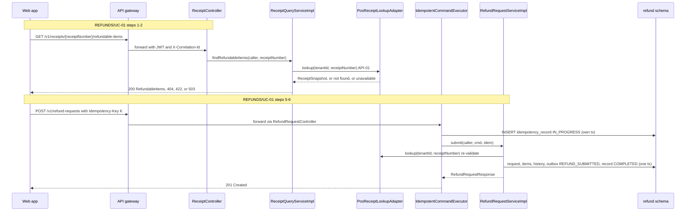

**Idempotency points:** `Idempotency-Key` (UUID) required on the POST; record key (`tenant_id`, `subject`, `POST /v1/refund-requests`, key); request hash = SHA-256 of the canonical JSON body; expiry 24 hours (SDD §11.1). The lookup GET is read-only.

**Outbox emission points:** `REFUND_SUBMITTED` in step 5, topic `refunds-platform-refund-events`, key `aggregate_id` (the request id), `aggregate_version` = the request's version after insert.

**Retry / timeout policy:** POS lookup per `pos-receipt` (`09-cross-cutting.md` § 12.3): two retries with jitter on idempotent failures, then the circuit opens. No server-side retry of the POST; the web app retries a 409 `REQUEST_IN_PROGRESS` after `Retry-After` with the same key.

**Error handling:** E2 -> 404 `RECEIPT_NOT_FOUND`; E1 -> 422 `REFUND_WINDOW_PASSED`; A1 at submission -> 409 `ITEM_ALREADY_REFUNDED`; POS down -> 503 `RECEIPT_LOOKUP_UNAVAILABLE`; lookup burst -> 429 `RATE_LIMITED` at the gateway; bad body -> 400 `VALIDATION_FAILED`.

### REFUNDS/UC-02: Track Refund Status (Web and Mobile)

> **Traceability:** BRD [REFUNDS/UC-02](../../brd-refunds-portal/06a-use-cases-customer.md#uc-02-track-refund-status-web-and-mobile) · SDD [§7.3](../../sdd-refunds-platform/03-users-and-use-cases.md#73-use-case-traceability-brd--sdd) · Owner: refund-service · Entry points: `GET /v1/refund-requests`, `GET /v1/refund-requests/{refundId}` · UAT/BAT: [REFUNDS/TC-REQ-05](../../brd-refunds-portal/16-uat-bat-test-cases.md#1-refund-requests-uc-01-uc-02-uc-03-scr-01-scr-02), [REFUNDS/TC-REQ-06](../../brd-refunds-portal/16-uat-bat-test-cases.md#1-refund-requests-uc-01-uc-02-uc-03-scr-01-scr-02), [REFUNDS/TC-UIX-01](../../brd-refunds-portal/16-uat-bat-test-cases.md#3-cross-cutting-uiux-standards-chunk-11) · Screens: [REFUNDS/SCR-02](../../brd-refunds-portal/11-summary-and-uiux.md#screens) via `/refunds`, `/refunds/:refundId`

**Trigger:** `RefundRequestController.listOwn` and `RefundRequestController.getDetail`, both `@UseCase("REFUNDS/UC-02")`.

**Pre-conditions:** caller has `refund.request.read-own` (or `refund.request.read-branch` for the detail).

**Post-conditions:** none (reads).

**Control flow:**

```text
1. listOwn: WHERE tenant_id = :t AND customer_id = caller.subject ORDER BY submitted_at DESC, id DESC,
   cursor pagination (REFUNDS/UC-02 steps 1-2, BR-1); an empty page is the "no requests yet" answer (REFUNDS/UC-02 A1)
2. getDetail: find(tenant, refundId)
   CUSTOMER: customer_id must equal caller.subject, else 404 NOT_FOUND (REFUNDS/NFR-04)
   BRANCH_MANAGER: branch_id must equal the branch_id claim, else 403 FORBIDDEN
3. Detail carries the status history with the date of each change, the approved amount, and the
   decision reason when REJECTED (REFUNDS/UC-02 steps 3-4)
```

**Sequence diagram:**

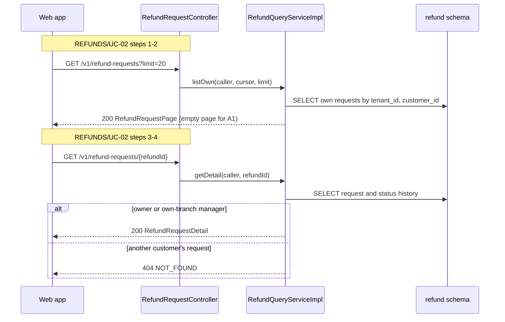

**Idempotency points:** none (reads).

**Outbox emission points:** none.

**Retry / timeout policy:** none server-side; the web app retries idempotent GETs once on network failure.

**Error handling:** 404 `NOT_FOUND` for an unknown or foreign request; 403 `FORBIDDEN` for another branch's request; 400 `VALIDATION_FAILED` for a bad cursor or limit.

### REFUNDS/UC-03: Cancel a Refund Request

> **Traceability:** BRD [REFUNDS/UC-03](../../brd-refunds-portal/06a-use-cases-customer.md#uc-03-cancel-a-refund-request) · SDD [§7.3](../../sdd-refunds-platform/03-users-and-use-cases.md#73-use-case-traceability-brd--sdd) · Owner: refund-service · Entry points: `POST /v1/refund-requests/{refundId}/cancellation` · UAT/BAT: [REFUNDS/TC-REQ-07](../../brd-refunds-portal/16-uat-bat-test-cases.md#1-refund-requests-uc-01-uc-02-uc-03-scr-01-scr-02), [REFUNDS/TC-REQ-08](../../brd-refunds-portal/16-uat-bat-test-cases.md#1-refund-requests-uc-01-uc-02-uc-03-scr-01-scr-02) · Screens: [REFUNDS/SCR-02](../../brd-refunds-portal/11-summary-and-uiux.md#screens) via `/refunds`, `/refunds/:refundId`

**Trigger:** `RefundRequestController.cancel`, `@UseCase("REFUNDS/UC-03")`.

**Pre-conditions:** caller has `refund.request.cancel-own`; the request is the caller's own.

**Post-conditions:** request CANCELLED, claims released, history row, `REFUND_CANCELLED` outbox row, idempotency record COMPLETED.

**Control flow:**

```text
1. Web app: customer opens a SUBMITTED request and chooses cancel; a two-step confirmation dialog
   (REFUNDS/UC-03 steps 1-4) - the confirmation of step 3 is client-side (SDD §17.1)
2. POST cancellation with Idempotency-Key -> executor begins the record
3. One transaction: load own request (else 404); request.cancel() -> CANCELLED, claims released, history;
   outbox REFUND_CANCELLED (REFUNDS/UC-03 step 5; outbox emission point); record COMPLETED
4. Not SUBMITTED, or a decision committed first (version conflict) -> 409 REFUND_ALREADY_DECIDED (REFUNDS/UC-03 E1, BR-1)
```

**Sequence diagram:**

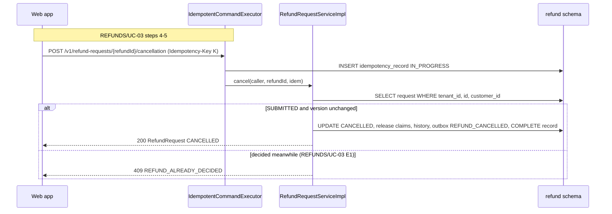

**Idempotency points:** `Idempotency-Key` required; request hash = SHA-256 of the path (no body).

**Outbox emission points:** `REFUND_CANCELLED` in step 3.

**Retry / timeout policy:** no remote call; the optimistic conflict is final (no automatic retry), because the loser must see the winner's decision.

**Error handling:** E1 -> 409 `REFUND_ALREADY_DECIDED`; foreign or unknown -> 404 `NOT_FOUND`; repeat in flight -> 409 `REQUEST_IN_PROGRESS`.

### REFUNDS/UC-04: Approve / Reject Refund

> **Traceability:** BRD [REFUNDS/UC-04](../../brd-refunds-portal/06b-use-cases-branch-manager.md#uc-04-approve--reject-refund) · SDD [§7.3](../../sdd-refunds-platform/03-users-and-use-cases.md#73-use-case-traceability-brd--sdd) · Owner: refund-service · Entry points: `GET /v1/branches/{branchId}/refund-requests`, `POST /v1/refund-requests/{refundId}/decision` · UAT/BAT: [REFUNDS/TC-DEC-01](../../brd-refunds-portal/16-uat-bat-test-cases.md#2-refund-decisions-uc-04-mk-03), [REFUNDS/TC-DEC-02](../../brd-refunds-portal/16-uat-bat-test-cases.md#2-refund-decisions-uc-04-mk-03), [REFUNDS/TC-DEC-03](../../brd-refunds-portal/16-uat-bat-test-cases.md#2-refund-decisions-uc-04-mk-03), [REFUNDS/TC-DEC-04](../../brd-refunds-portal/16-uat-bat-test-cases.md#2-refund-decisions-uc-04-mk-03), [REFUNDS/TC-DEC-05](../../brd-refunds-portal/16-uat-bat-test-cases.md#2-refund-decisions-uc-04-mk-03), [REFUNDS/TC-UIX-01](../../brd-refunds-portal/16-uat-bat-test-cases.md#3-cross-cutting-uiux-standards-chunk-11) · Screens: [REFUNDS/MK-03](../../brd-refunds-portal/14-todo.md#mockup-coverage) via `/manager/refunds`, `/manager/refunds/:refundId`

**Trigger:** `BranchRefundController.branchQueue` and `RefundRequestController.decide`, both `@UseCase("REFUNDS/UC-04")`; the asynchronous continuation is `PayoutEventsListener` (no `@UseCase`, see § 7.2).

**Pre-conditions:** caller has `refund.request.read-branch` and `refund.request.decide` (role `BRANCH_MANAGER`) and a `branch_id` claim; the request is SUBMITTED and of that branch.

**Post-conditions:** APPROVED with payout status PENDING and `REFUND_APPROVED` in the outbox, or REJECTED with claims released and `REFUND_REJECTED`; later PAID with `REFUND_PAID`, or APPROVED with payout status FAILED and `REFUND_PAYOUT_FAILED`.

**Control flow:**

```text
1. GET branch queue: SUBMITTED oldest first with amount and reason, then APPROVED rows whose payout failed
   (REFUNDS/UC-04 steps 1-2, E1 flag); branchId != claim -> 403 (REFUNDS/UC-04 BR-1)
2. Web app opens the request (GET detail) and the manager chooses Approve or Reject (REFUNDS/UC-04 step 3);
   the amount confirmation dialog is client-side (REFUNDS/UC-04 steps 4-5)
3. POST decision with Idempotency-Key -> executor begins the record
4. One transaction: load, branch check (403), status check (409), rules:
   APPROVE full or partial -> APPROVED, payout PENDING, outbox REFUND_APPROVED (REFUNDS/UC-04 step 6, A1, BR-2)
   REJECT with reason -> REJECTED, claims released, outbox REFUND_REJECTED (REFUNDS/UC-04 A2, BR-3)
   record COMPLETED (outbox emission point)
5. payout-service pays (Participates block in payout-service.md), then publishes PAYOUT_SUCCEEDED or PAYOUT_FAILED
6. PayoutEventsListener, inbox first:
   PAYOUT_SUCCEEDED -> PAID, outbox REFUND_PAID (REFUNDS/UC-04 step 7)
   PAYOUT_FAILED -> stays APPROVED, payout_status FAILED, outbox REFUND_PAYOUT_FAILED; the queue flags it (REFUNDS/UC-04 E1)
```

**Sequence diagram (decision):**

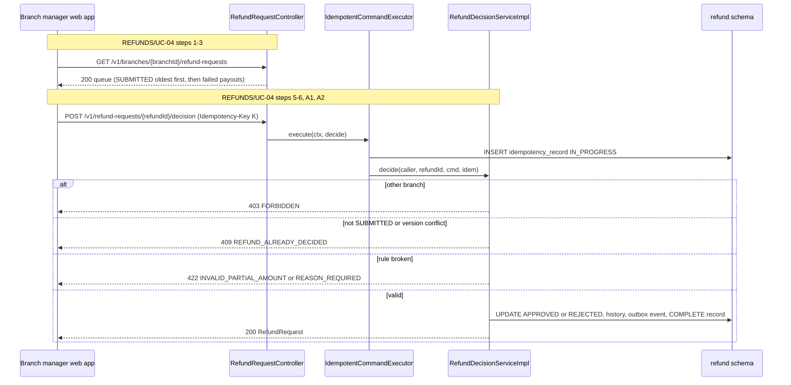

**Sequence diagram (payout outcome):**

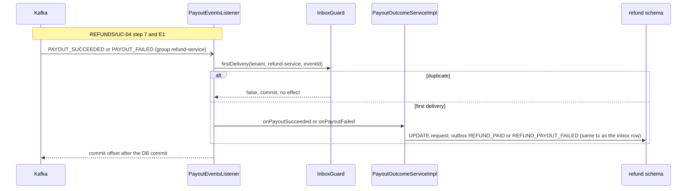

**Idempotency points:** `Idempotency-Key` on the decision (hash of body + path); the consumer inbox (`refund-service`, `event_id`); `REFUND_PAID` carries `causation_id` = the payout event id.

**Outbox emission points:** `REFUND_APPROVED` or `REFUND_REJECTED` in step 4; `REFUND_PAID` or `REFUND_PAYOUT_FAILED` in step 6.

**Retry / timeout policy:** no remote call in the decision. The consumer retries three times with exponential backoff on transient errors, then dead-letters (`07-event-contracts.md` § 10.4); invalid transitions are not retried.

**Error handling:** BR-1 -> 403 `FORBIDDEN` (REFUNDS/TC-DEC-05); A1 and BR-2 -> 422 `INVALID_PARTIAL_AMOUNT`; A2 and BR-3 -> 422 `REASON_REQUIRED`; decided or concurrent -> 409 `REFUND_ALREADY_DECIDED`; payout event for a request not in APPROVED -> `refund-service.dlq` with an alarm; E1 -> `REFUND_PAYOUT_FAILED` drives the managers' email.

### Workflow: Daily branch refund report

> **Traceability:** No BRD use case. Realises [REFUNDS 09 § Reporting / Analytics](../../brd-refunds-portal/09-reporting-and-analytics.md#reporting--analytics) through `GET /v1/branches/{branchId}/refund-report` ([SDD §17.1](../../sdd-refunds-platform/13a-service-refund.md#171-refund-service)); not an SDD §7.3 entry point, so it carries no `@UseCase`.

> Confirm: the daily report is required by REFUNDS 09 but no BRD use case, screen ID, or `MK-NN` covers it, so its endpoint has no `use_case` and its route has no BRD screen (`14-frontend.md` § 17.3); a missing-scenario question for the REFUNDS owner, never a new UC.

**Trigger:** `BranchRefundController.dailyReport` (`refund.report.read-branch`), `date` query parameter (default: yesterday in the tenant zone).

**Control flow:**

```text
1. branchId must equal the branch_id claim -> else 403
2. [from, to) = tenantCalendar.dayBounds(tenant, date)                    // tenant IANA zone -> UTC instants
3. perStatus  = COUNT(*) GROUP BY status  WHERE branch_id = :b AND submitted_at in [from, to)
   amountPaid = SUM(approved_amount)       WHERE branch_id = :b AND paid_at in [from, to)   // grouped by currency
   avgToDecision = AVG(decided_at - submitted_at) WHERE branch_id = :b AND decided_at in [from, to)
4. return BranchRefundReportResponse(date, perStatus, amountPaid[], avgToDecision)
```

> TODO: best guess for the report's day semantics (requests counted by submission day, amounts by payment day, decision time by decision day); REFUNDS 09 and SDD §17.1 do not say which date each figure is keyed on - verify with the REFUNDS owner.

### Workflow: Payout watchdog

> **Traceability:** No BRD use case. Realises the refund-service half of REFUNDS/NFR-01 ([SDD §18](../../sdd-refunds-platform/14-performance-and-capacity.md#18-performance--capacity-planning)); platform job.

```text
@Scheduled(cron = "${refunds-platform.refund.payout-watchdog.cron}", zone = "UTC")
1. read-only tx; if !pg_try_advisory_xact_lock(hash("refund.payout-watchdog")) return   // one replica runs it
2. for tenant in tenantDirectory.all():
     cutoff = now - payoutRetryWindow - 1 hour                                            // ADR-10 window
     overdue = COUNT(*) WHERE status = 'APPROVED' AND payout_status = 'PENDING' AND decided_at < cutoff
     gauge refund_payout_outcome_overdue{tenant_ref} = overdue                           // alert above zero
```

> Confirm: the watchdog cron (default `0 15 3 * * *` UTC) is an LLD choice; SDD §17.1 only says "daily".

### Cross-service Saga (orchestrator role)

> **Not an orchestrator.** SAGA-01 is choreographed (ADR-05): no service holds its state. The step table is kept here because refund-service owns REFUNDS/UC-04 and is the hub of the event flow ([SDD §14.2.2](../../sdd-refunds-platform/10-events-hub.md#142-hub-topology-decision)). payout-service, notification-service, and loyalty-service each describe their own step.

**Saga name:** SAGA-01: Refund payout and points take-back

**Participating services:** refund-service, payout-service, notification-service, loyalty-service

**Steps:**

| Step | Service | Action | Compensating action | Idempotency |
|------|---------|--------|---------------------|-------------|
| 1 | refund-service | Decision APPROVE: APPROVED, `REFUND_APPROVED` | None: an approval is not undone; REJECT and cancel exist only before approval | `Idempotency-Key` on the decision |
| 2 | payout-service | Payout created, attempts inside the ADR-10 retry window, `PAYOUT_SUCCEEDED` or `PAYOUT_FAILED` | Forward recovery only (retries); after the window, manual resolution ([SDD §20.1.7](../../sdd-refunds-platform/16-operations-runbook.md#2017-payout-failed-after-the-retry-window), still a template) | Inbox + unique (`tenant_id`, `refund_id`); CardPay key = payout id |
| 3 | refund-service | PAID and `REFUND_PAID`, or payout status FAILED and `REFUND_PAYOUT_FAILED` | None: PAID is final because money left | Inbox (`refund-service`, `event_id`) |
| 4a | notification-service | Customer or branch-manager messages | None: a message outcome never changes refund state | Inbox + unique send-log key |
| 4b | loyalty-service | TAKEN_BACK movement, or parked or closed take-back | None: an unmatched take-back is parked or closed, never dropped | Inbox + unique (`tenant_id`, `refund_id`) |

**Compensation triggers:** none automatic. A payout that is not confirmed at the end of the retry window leaves the request APPROVED and flagged (step 3), the managers are emailed (step 4a), and resolution is manual.

> Confirm: SAGA-01 deliberately has no compensating transactions (money cannot be un-sent and an approval is not reversed); CLAUDE.md asks for a documented compensation per step, recorded here as "forward recovery, then manual" pending the SDD §20.1.7 procedure.

**Sequence diagram:**

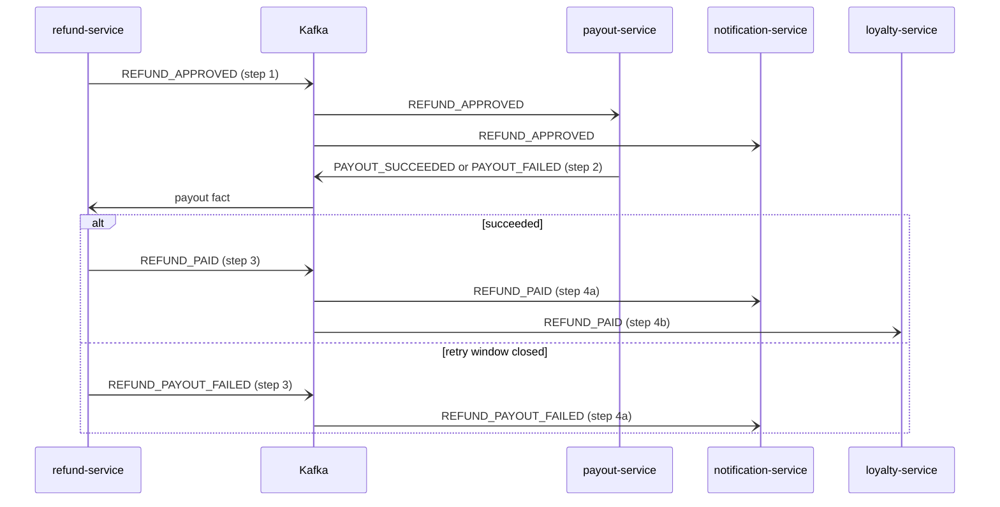

<!-- MASTER: refunds-platform-lld-master.md | PREV: 04-implementation/payout-service.md | NEXT: 05-data-model.md -->
