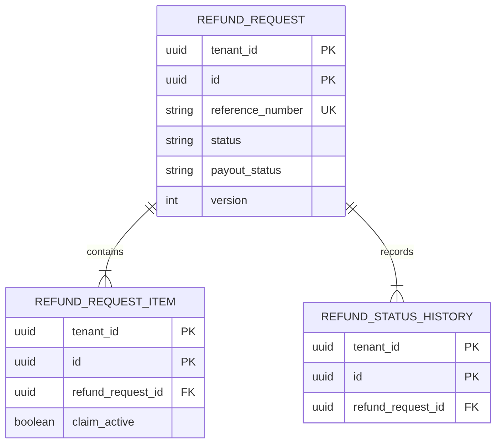
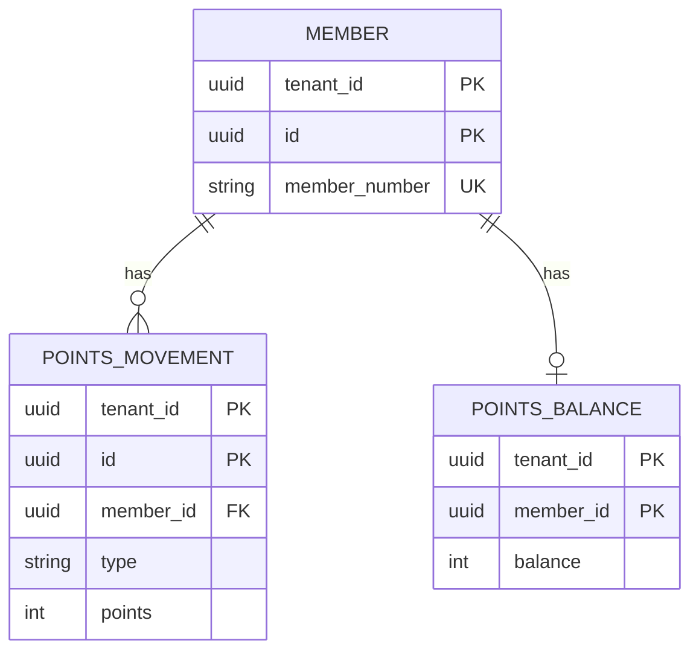
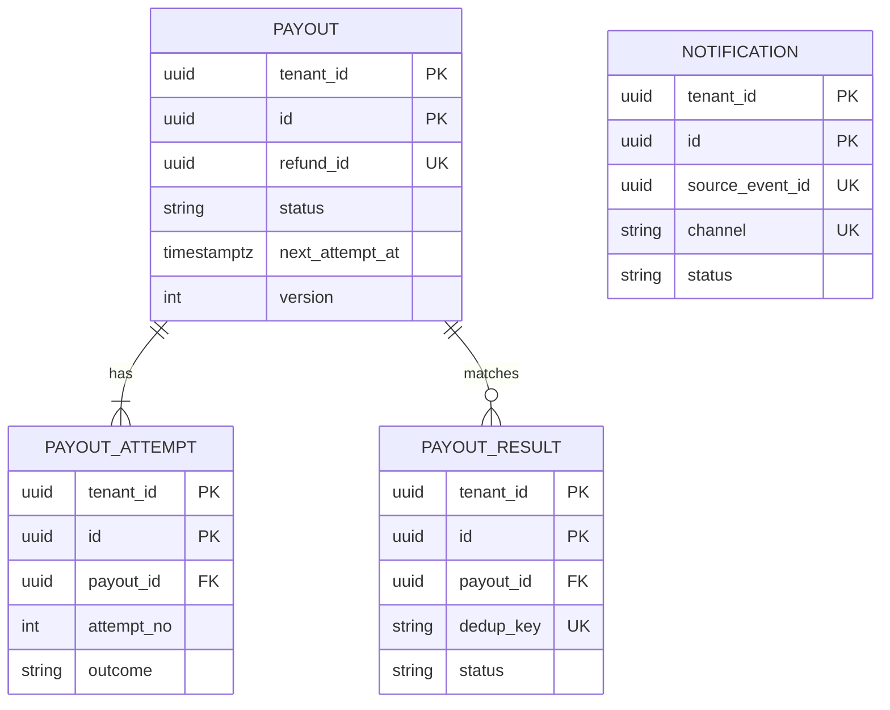

<!--
CHUNK: 05
TITLE: Data Model
PROJECT: Refunds Platform
VERSION: 1.0
DEPENDS_ON: 04
PART OF: LLD - Refunds Platform
-->

# 8. Data Model

> **Per-service ownership:** each module or service owns a private schema or database (ADR-06): schemas `refund` and `loyalty` in the core database, databases `payout` and `notification`. The meaning of every business column is owned by the SDD's Tables Design ([§17.1](../sdd-refunds-platform/13a-service-refund.md#171-refund-service), [§17.2](../sdd-refunds-platform/13b-service-payout.md#172-payout-service), [§17.3](../sdd-refunds-platform/13c-service-notification.md#173-notification-service), [§17.4](../sdd-refunds-platform/13d-service-loyalty.md#174-loyalty-service)) and the defaults of [SDD §11.1](../sdd-refunds-platform/07-cross-cutting-concerns.md#111-db-modeling-default); this chunk adds the DDL-level delta: keys, constraint and index names, the kernel tables, and LLD-only columns (marked "LLD").

## 8.1 Entity Relationship (system-wide)

**Core database, schema `refund`:**



**Core database, schema `loyalty` (no relationship across schemas):**



**Summary:** the refund module owns a request with its lines and status history; the loyalty module owns members, their append-only movements, and one balance row each (`pending_take_back` stands alone until a purchase arrives, and is not drawn). The outbox, inbox, and idempotency tables of § 8.2 are not drawn.

**Databases `payout` and `notification`:**



**Summary:** one payout per refund with its attempts and the CardPay results matched to it; notification-service keeps one send-log row per event and channel.

## 8.2 Tables (per service)

> **Convention:** every table below also carries the SDD §11.1 auditing columns, omitted for brevity: `created_at timestamptz NOT NULL`, `created_by varchar(64) NOT NULL`, `updated_at timestamptz NOT NULL`, `updated_by varchar(64) NOT NULL` (`created_by`/`updated_by` hold the token subject, or `system:<component>` for consumers and jobs). Timestamps are UTC.

### Service: `refund-service` - schema `refund`

```sql
CREATE SEQUENCE refund.reference_number_seq;

CREATE TABLE refund.refund_request (
  tenant_id uuid NOT NULL, id uuid NOT NULL,
  reference_number varchar(20) NOT NULL, customer_id uuid NOT NULL, branch_id varchar(20) NOT NULL,
  receipt_number varchar(40) NOT NULL, purchase_date date NOT NULL, original_payment_ref varchar(100) NOT NULL,
  currency char(3) NOT NULL,
  requested_amount numeric(19,4) NOT NULL CONSTRAINT ck_rr_requested CHECK (requested_amount > 0),
  approved_amount numeric(19,4),
  status varchar(20) NOT NULL CONSTRAINT ck_rr_status CHECK (status IN ('SUBMITTED','APPROVED','REJECTED','PAID','CANCELLED')),
  payout_status varchar(20) NOT NULL DEFAULT 'NONE' CONSTRAINT ck_rr_payout CHECK (payout_status IN ('NONE','PENDING','FAILED','SUCCEEDED')),
  reason varchar(500) NOT NULL, decision_reason varchar(500),
  submitted_at timestamptz NOT NULL, decided_at timestamptz, decided_by uuid, paid_at timestamptz, cancelled_at timestamptz,
  version int NOT NULL DEFAULT 0,
  CONSTRAINT pk_refund_request PRIMARY KEY (tenant_id, id),
  CONSTRAINT uk_refund_request_reference UNIQUE (tenant_id, reference_number),
  CONSTRAINT ck_rr_approved CHECK (approved_amount IS NULL OR (approved_amount > 0 AND approved_amount <= requested_amount)),
  CONSTRAINT ck_rr_reject_reason CHECK (status <> 'REJECTED' OR decision_reason IS NOT NULL),
  CONSTRAINT ck_rr_partial_reason CHECK (approved_amount IS NULL OR approved_amount = requested_amount OR decision_reason IS NOT NULL)
);

CREATE TABLE refund.refund_request_item (
  tenant_id uuid NOT NULL, id uuid NOT NULL, refund_request_id uuid NOT NULL,
  branch_id varchar(20) NOT NULL, receipt_number varchar(40) NOT NULL, receipt_line_id varchar(40) NOT NULL,
  description varchar(200) NOT NULL, quantity int NOT NULL CHECK (quantity > 0), amount numeric(19,4) NOT NULL CHECK (amount >= 0),
  claim_active boolean NOT NULL,
  CONSTRAINT pk_refund_request_item PRIMARY KEY (tenant_id, id),
  CONSTRAINT fk_item_request FOREIGN KEY (tenant_id, refund_request_id) REFERENCES refund.refund_request (tenant_id, id)
);

CREATE TABLE refund.refund_status_history (
  tenant_id uuid NOT NULL, id uuid NOT NULL, refund_request_id uuid NOT NULL,
  from_status varchar(20), to_status varchar(20) NOT NULL, changed_at timestamptz NOT NULL, changed_by uuid, reason varchar(500),
  CONSTRAINT pk_refund_status_history PRIMARY KEY (tenant_id, id),
  CONSTRAINT fk_history_request FOREIGN KEY (tenant_id, refund_request_id) REFERENCES refund.refund_request (tenant_id, id)
);

-- LLD: per-customer daily RECEIPT_NOT_FOUND count for the SDD §17.1 alert
CREATE TABLE refund.receipt_lookup_counter (
  tenant_id uuid NOT NULL, customer_id uuid NOT NULL, lookup_date date NOT NULL, not_found_count int NOT NULL,
  CONSTRAINT pk_receipt_lookup_counter PRIMARY KEY (tenant_id, customer_id, lookup_date)
);
```

**Kernel tables (same DDL in every schema or database that uses them; shown once for `refund`):**

```sql
CREATE TABLE refund.outbox_event (                      -- publishers: refund, payout
  tenant_id uuid NOT NULL, id uuid NOT NULL,             -- id = envelope event_id
  seq bigint GENERATED ALWAYS AS IDENTITY,               -- relay order
  topic varchar(100) NOT NULL, aggregate_type varchar(40) NOT NULL, aggregate_id uuid NOT NULL,
  aggregate_version int NOT NULL, event_type varchar(60) NOT NULL,
  envelope jsonb NOT NULL, headers jsonb NOT NULL,       -- SDD §14.3 envelope; traceparent, correlation id
  created_at timestamptz NOT NULL,
  CONSTRAINT pk_outbox_event PRIMARY KEY (tenant_id, id)
);

CREATE TABLE refund.inbox_event (                       -- consumers: refund, loyalty, payout, notification
  tenant_id uuid NOT NULL, consumer varchar(60) NOT NULL, event_id uuid NOT NULL,
  event_type varchar(60) NOT NULL, processed_at timestamptz NOT NULL,
  CONSTRAINT pk_inbox_event PRIMARY KEY (tenant_id, consumer, event_id)
);

CREATE TABLE refund.idempotency_record (                -- modules that accept Idempotency-Key: refund
  tenant_id uuid NOT NULL, subject varchar(64) NOT NULL, operation varchar(120) NOT NULL,
  idempotency_key varchar(64) NOT NULL, request_hash char(64) NOT NULL,
  status varchar(12) NOT NULL CHECK (status IN ('IN_PROGRESS','COMPLETED')),
  response_status int, response_body jsonb, expires_at timestamptz NOT NULL,
  CONSTRAINT pk_idempotency_record PRIMARY KEY (tenant_id, subject, operation, idempotency_key)
);
```

### Service: `loyalty-service` - schema `loyalty`

```sql
CREATE TABLE loyalty.member (
  tenant_id uuid NOT NULL, id uuid NOT NULL, member_number varchar(40) NOT NULL, customer_id uuid,
  CONSTRAINT pk_member PRIMARY KEY (tenant_id, id),
  CONSTRAINT uk_member_number UNIQUE (tenant_id, member_number)
);
CREATE UNIQUE INDEX uk_member_customer ON loyalty.member (tenant_id, customer_id) WHERE customer_id IS NOT NULL;

CREATE TABLE loyalty.points_movement (
  tenant_id uuid NOT NULL, id uuid NOT NULL, member_id uuid NOT NULL,
  type varchar(12) NOT NULL CHECK (type IN ('EARNED','TAKEN_BACK')), points int NOT NULL,
  purchase_reference varchar(40) NOT NULL, branch_id varchar(20) NOT NULL,
  purchase_amount numeric(19,4), currency char(3),
  refund_id uuid, refund_reference varchar(20), paid_amount numeric(19,4),
  occurred_at timestamptz NOT NULL,
  CONSTRAINT pk_points_movement PRIMARY KEY (tenant_id, id),
  CONSTRAINT fk_movement_member FOREIGN KEY (tenant_id, member_id) REFERENCES loyalty.member (tenant_id, id),
  CONSTRAINT ck_movement_sign CHECK ((type = 'EARNED' AND points > 0) OR (type = 'TAKEN_BACK' AND points < 0)),
  CONSTRAINT ck_movement_refund CHECK (type = 'EARNED' OR refund_id IS NOT NULL)
);

CREATE TABLE loyalty.points_balance (
  tenant_id uuid NOT NULL, member_id uuid NOT NULL, balance int NOT NULL, last_movement_at timestamptz, version int NOT NULL,
  CONSTRAINT pk_points_balance PRIMARY KEY (tenant_id, member_id),
  CONSTRAINT fk_balance_member FOREIGN KEY (tenant_id, member_id) REFERENCES loyalty.member (tenant_id, id)
);

CREATE TABLE loyalty.pending_take_back (
  tenant_id uuid NOT NULL, id uuid NOT NULL, refund_id uuid NOT NULL, branch_id varchar(20) NOT NULL,
  purchase_reference varchar(40) NOT NULL, purchase_date date NOT NULL, paid_amount numeric(19,4) NOT NULL,
  currency char(3) NOT NULL, refund_reference varchar(20) NOT NULL,
  status varchar(10) NOT NULL CHECK (status IN ('PARKED','APPLIED','CLOSED')),
  park_deadline timestamptz NOT NULL,                    -- LLD: end of the day after purchase_date, tenant zone
  applied_movement_id uuid,                              -- LLD
  CONSTRAINT pk_pending_take_back PRIMARY KEY (tenant_id, id),
  CONSTRAINT uk_pending_take_back_refund UNIQUE (tenant_id, refund_id)
);
-- + inbox_event (kernel DDL above, schema loyalty)
```

### Service: `payout-service` - database `payout`

```sql
CREATE TABLE payout (
  tenant_id uuid NOT NULL, id uuid NOT NULL, refund_id uuid NOT NULL,
  reference_number varchar(20) NOT NULL, original_payment_ref varchar(100) NOT NULL,
  amount numeric(19,4) NOT NULL CHECK (amount > 0), currency char(3) NOT NULL,
  status varchar(20) NOT NULL CHECK (status IN ('PENDING','RETRY_WAIT','SUCCEEDED','FAILED')),
  first_attempt_at timestamptz, next_attempt_at timestamptz NOT NULL,
  provider_payout_ref varchar(100), last_provider_code varchar(50),
  succeeded_at timestamptz, failed_at timestamptz, version int NOT NULL DEFAULT 0,
  CONSTRAINT pk_payout PRIMARY KEY (tenant_id, id),
  CONSTRAINT uk_payout_refund UNIQUE (tenant_id, refund_id)
);
CREATE UNIQUE INDEX uk_payout_provider_ref ON payout (tenant_id, provider_payout_ref) WHERE provider_payout_ref IS NOT NULL;

CREATE TABLE payout_attempt (
  tenant_id uuid NOT NULL, id uuid NOT NULL, payout_id uuid NOT NULL, attempt_no int NOT NULL,
  kind varchar(12) NOT NULL CHECK (kind IN ('PAY','STATUS_QUERY')),                           -- LLD
  attempted_at timestamptz NOT NULL, completed_at timestamptz,                                 -- LLD: completed_at
  outcome varchar(20) CHECK (outcome IN ('CONFIRMED','REFUSED','UNAVAILABLE','IN_DOUBT')),    -- NULL while in flight
  provider_code varchar(50),
  CONSTRAINT pk_payout_attempt PRIMARY KEY (tenant_id, id),
  CONSTRAINT fk_attempt_payout FOREIGN KEY (tenant_id, payout_id) REFERENCES payout (tenant_id, id),
  CONSTRAINT uk_attempt_no UNIQUE (tenant_id, payout_id, attempt_no)
);

CREATE TABLE payout_result (
  tenant_id uuid NOT NULL, id uuid NOT NULL, payout_id uuid,
  provider_payout_ref varchar(100), echoed_reference varchar(100),
  outcome varchar(20) NOT NULL, status varchar(10) NOT NULL CHECK (status IN ('MATCHED','UNMATCHED')),
  dedup_key varchar(200) NOT NULL, raw_body jsonb NOT NULL, received_at timestamptz NOT NULL,   -- LLD: dedup_key, raw_body
  CONSTRAINT pk_payout_result PRIMARY KEY (tenant_id, id),
  CONSTRAINT fk_result_payout FOREIGN KEY (tenant_id, payout_id) REFERENCES payout (tenant_id, id),
  CONSTRAINT uk_result_dedup UNIQUE (tenant_id, dedup_key)
);
-- + outbox_event, inbox_event (kernel DDL above, no schema prefix)
```

### Service: `notification-service` - database `notification`

```sql
CREATE TABLE notification (
  tenant_id uuid NOT NULL, id uuid NOT NULL, source_event_id uuid NOT NULL, event_type varchar(40) NOT NULL,
  aggregate_version int NOT NULL, refund_id uuid NOT NULL,
  recipient varchar(20) NOT NULL CHECK (recipient IN ('CUSTOMER','BRANCH_MANAGERS')), customer_id uuid,
  channel varchar(10) NOT NULL CHECK (channel IN ('EMAIL','SMS')),
  template_code varchar(60) NOT NULL, template_params jsonb NOT NULL,
  status varchar(10) NOT NULL CHECK (status IN ('PENDING','SENT','SKIPPED','FAILED')),
  attempt_count int NOT NULL DEFAULT 0, next_attempt_at timestamptz NOT NULL,
  last_error_code varchar(50), provider_message_id varchar(100), sent_at timestamptz,
  CONSTRAINT pk_notification PRIMARY KEY (tenant_id, id),
  CONSTRAINT uk_notification_event_channel UNIQUE (tenant_id, source_event_id, channel),
  CONSTRAINT ck_notification_customer CHECK (recipient = 'BRANCH_MANAGERS' OR customer_id IS NOT NULL)
);
-- + inbox_event (kernel DDL above, no schema prefix)
```

## 8.3 Indexes

| Index | Table | Columns | Type | Rationale |
|-------|-------|---------|------|-----------|
| `ix_rr_customer` | `refund.refund_request` | `(tenant_id, customer_id, submitted_at DESC, id DESC)` | btree | REFUNDS/UC-02 own list (SDD §17.1) |
| `ix_rr_branch_queue` | `refund.refund_request` | `(tenant_id, branch_id, status, submitted_at)` | btree | REFUNDS/UC-04 queue (SDD §17.1) |
| `ix_rr_payout_watch` | `refund.refund_request` | `(tenant_id, status, payout_status, decided_at)` | btree | Payout watchdog (LLD) |
| `uk_refund_item_active_claim` | `refund.refund_request_item` | `(tenant_id, branch_id, receipt_number, receipt_line_id) WHERE claim_active` | partial unique | REFUNDS/UC-01 BR-2 under concurrency (SDD §17.1) |
| `ix_item_request` | `refund.refund_request_item` | `(tenant_id, refund_request_id)` | btree | Aggregate load |
| `ix_history_request` | `refund.refund_status_history` | `(tenant_id, refund_request_id, changed_at)` | btree | REFUNDS/UC-02 step 4 (SDD §17.1) |
| `uk_movement_earned` | `loyalty.points_movement` | `(tenant_id, branch_id, purchase_reference) WHERE type = 'EARNED'` | partial unique | One earn per purchase (SDD §17.4) |
| `uk_movement_taken_back` | `loyalty.points_movement` | `(tenant_id, refund_id) WHERE type = 'TAKEN_BACK'` | partial unique | One take-back per refund (SDD §17.4) |
| `ix_movement_member_history` | `loyalty.points_movement` | `(tenant_id, member_id, occurred_at DESC, id DESC)` | btree | LOYALTY/UC-02 newest first (SDD §17.4) |
| `ix_movement_purchase` | `loyalty.points_movement` | `(tenant_id, branch_id, purchase_reference)` | btree | Points still held for a purchase (LLD) |
| `ix_ptb_purchase` | `loyalty.pending_take_back` | `(tenant_id, branch_id, purchase_reference)` | btree | Apply on purchase arrival (SDD §17.4) |
| `ix_ptb_deadline` | `loyalty.pending_take_back` | `(tenant_id, status, park_deadline)` | btree | Closure job (LLD) |
| `ix_payout_due` | `payout` | `(tenant_id, status, next_attempt_at)` | btree | Scheduler claim (SDD §17.2) |
| `ix_payout_succeeded` | `payout` | `(tenant_id, status, succeeded_at)` | btree | Reconciliation (LLD) |
| `ix_attempt_payout` | `payout_attempt` | `(tenant_id, payout_id, attempted_at)` | btree | SDD §17.2 |
| `ix_result_status` | `payout_result` | `(tenant_id, status, received_at)` | btree | Unmatched gauge (SDD §17.2) |
| `ix_result_provider_ref` | `payout_result` | `(tenant_id, provider_payout_ref)` | btree | Re-match (LLD) |
| `ix_notification_due` | `notification` | `(tenant_id, status, next_attempt_at)` | btree | Dispatcher claim (SDD §17.3) |
| `ix_notification_supersede` | `notification` | `(tenant_id, refund_id, channel, status)` | btree | Superseded check (LLD) |
| `ix_outbox_relay` | every `outbox_event` | `(tenant_id, seq)` | btree | Relay per tenant in order |
| `ix_inbox_processed` | every `inbox_event` | `(tenant_id, processed_at)` | btree | Retention cleanup |
| `ix_idempotency_expiry` | `refund.idempotency_record` | `(tenant_id, expires_at)` | btree | 24-hour cleanup |

## 8.4 Multi-Tenancy Strategy

> **Default per CLAUDE.md:** schema-per-tenant for high-volume services; shared-schema with `tenant_id` for low-volume.

| Service | Strategy | Rationale |
|---------|----------|-----------|
| `refund-service` | Shared schema with `tenant_id` | ADR-03: about 1,200 requests a month is low volume; one retailer today (A-3) |
| `loyalty-service` | Shared schema with `tenant_id` | ADR-03 |
| `payout-service` | Shared schema with `tenant_id` | ADR-03 |
| `notification-service` | Shared schema with `tenant_id` | ADR-03 |

**Tenant filter enforcement:** `TenantScopedJdbcRepository` (kernel). Every repository method takes the tenant id as its first parameter; every statement starts its predicate with `tenant_id = :tenantId`; the base class rejects a call whose tenant differs from `TenantContext`. Every primary key, foreign key, and index leads with `tenant_id`, so a row can only be addressed with its tenant. Integration tests seed `tenant_a` and `tenant_b` and assert that every repository method returns nothing of the other tenant (SDD §11.2).

**Cross-tenant queries:** forbidden at the application layer (SDD §11.2). The relays, schedulers, and jobs iterate over `TenantDirectory.all()` and run one tenant-scoped query per tenant.

> Confirm: primary keys are (`tenant_id`, `id`) instead of the SDD ERDs' `id` alone, so the CLAUDE.md rule "every index in shared-schema includes tenant_id" and SDD §11.1 ("every index starts with `tenant_id`") hold for primary keys too (the SDD reviewer notes this exception); foreign keys become composite. Verify with the SDD owner.

## 8.5 Migration Plan (Flyway)

| Version | File | Purpose |
|---------|------|---------|
| `V1__refund_domain.sql` | `refunds-platform-core/src/main/resources/db/migration/refund` | `refund_request`, `refund_request_item`, `refund_status_history`, `receipt_lookup_counter`, sequence, indexes |
| `V2__refund_messaging.sql` | same | `outbox_event`, `inbox_event`, `idempotency_record` |
| `V1__loyalty_domain.sql` | `refunds-platform-core/src/main/resources/db/migration/loyalty` | `member`, `points_movement`, `points_balance`, `pending_take_back`, indexes |
| `V2__loyalty_messaging.sql` | same | `inbox_event` |
| `V1__payout_domain.sql` | `payout-service/src/main/resources/db/migration` | `payout`, `payout_attempt`, `payout_result`, indexes |
| `V2__payout_messaging.sql` | same | `outbox_event`, `inbox_event` |
| `V1__notification_domain.sql` | `notification-service/src/main/resources/db/migration` | `notification`, indexes |
| `V2__notification_messaging.sql` | same | `inbox_event` |

**Core: two histories in one database.** `CoreFlywayConfig` disables the auto-configured Flyway (`spring.flyway.enabled=false`) and runs one `Flyway` instance per schema at startup, before the web server accepts traffic: `Flyway.configure().dataSource(ds).schemas("refund").locations("classpath:db/migration/refund").load().migrate()`, then the same for `loyalty` (one history per schema, ADR-06).

> **Convention per CLAUDE.md:** versioned SQL only; backward-compatible changes only; expand-contract for breaking changes (SDD §11.1, §11.3). Migrations run before the new version takes traffic and must work with the running version.

> Confirm: running both schema migrations from the core's startup (instead of a Helm pre-upgrade job) is an LLD choice; with several replicas, Flyway's history-table lock serialises them.

## 8.6 Retention & Archival

| Table | Hot retention | Archival destination | Restore SLA |
|-------|---------------|---------------------|-------------|
| `refund_request`, `refund_request_item`, `refund_status_history` | Per the retention decision still open in SDD §17.1 Compliance | None in this release | Set with that decision |
| `member`, `points_movement`, `points_balance`, `pending_take_back` | Per SDD §17.4 Compliance (open) | None | Set with that decision |
| `payout`, `payout_attempt`, `payout_result` | Per SDD §17.2 Compliance (open) | None | Set with that decision |
| `outbox_event` | Deleted by the relay once Kafka acknowledges | N/A | N/A |
| `inbox_event` | At least the consumed topic's retention, plus 7 days | Cleanup job (delete) | N/A |
| `notification` | At least the consumed topic's retention, plus 7 days (SDD §17.3) | Cleanup job (delete) | N/A |
| `idempotency_record` | 24 hours (`expires_at`) | Cleanup job (delete) | N/A |
| `receipt_lookup_counter` | 7 days | Cleanup job (delete) | N/A |

> TODO: topic retention is not pinned (SDD §6), so the inbox and send-log cleanup age is "topic retention + 7 days" with a best-guess topic retention of 7 days (14 days total) - verify once SDD §6 pins partitions and retention.

## 8.7 Encryption

| Concern | Approach |
|---------|----------|
| At rest | Storage-level encryption of PostgreSQL volumes, keys held outside the cluster (SDD §11.6; mechanism open) |
| In transit | TLS 1.2 or higher to PostgreSQL (`sslmode=verify-full`), Kafka, and every provider (SDD §11.6) |
| Key management | Per SDD §11.6 (key management service open) |
| PII columns | As listed in SDD §17.1 to §17.4 Data Encryption; masked in non-production copies (`11-security.md` § 14.2) |

<!-- MASTER: refunds-platform-lld-master.md | PREV: 04-implementation/refund-service.md | NEXT: 06-api-contracts.md -->
