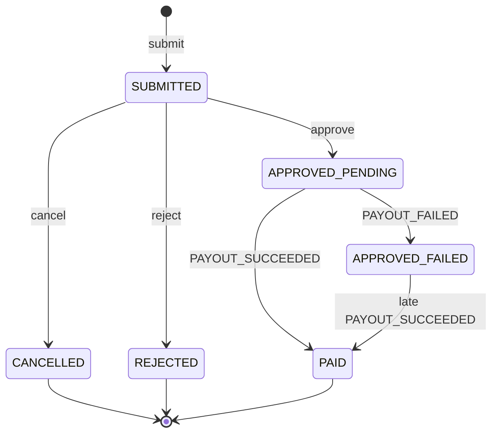
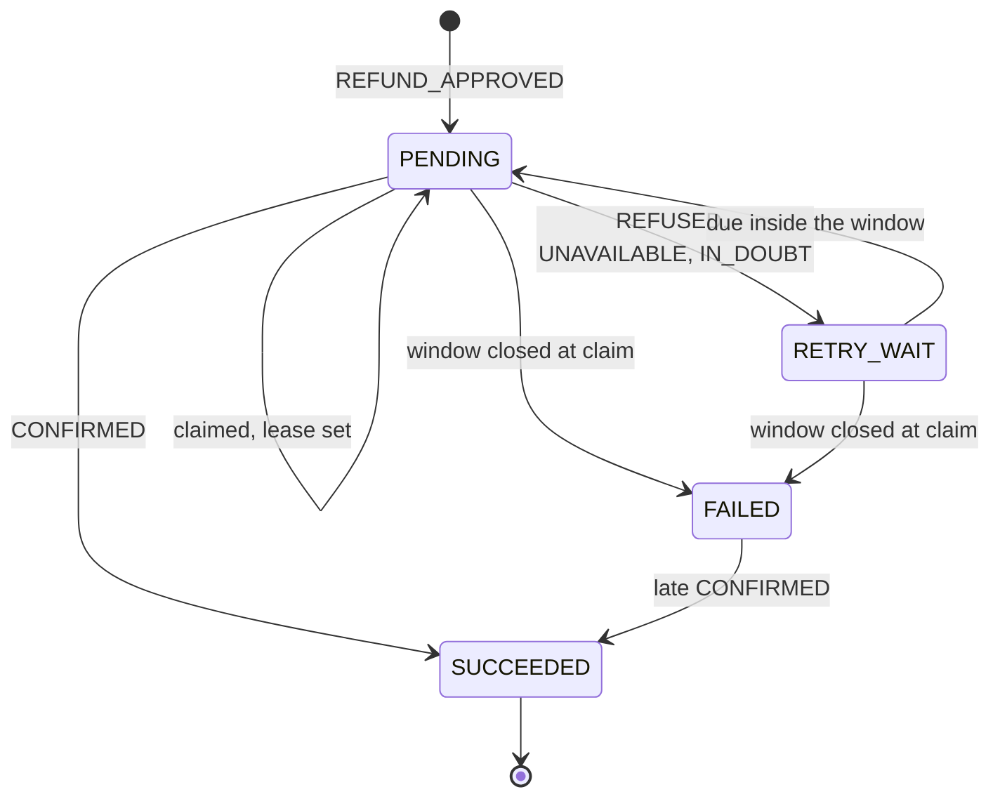
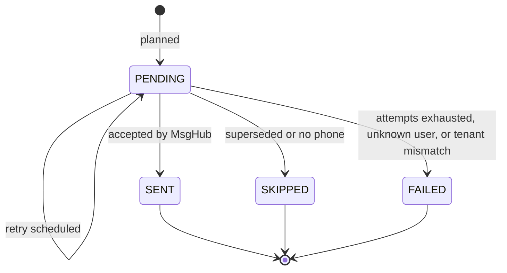
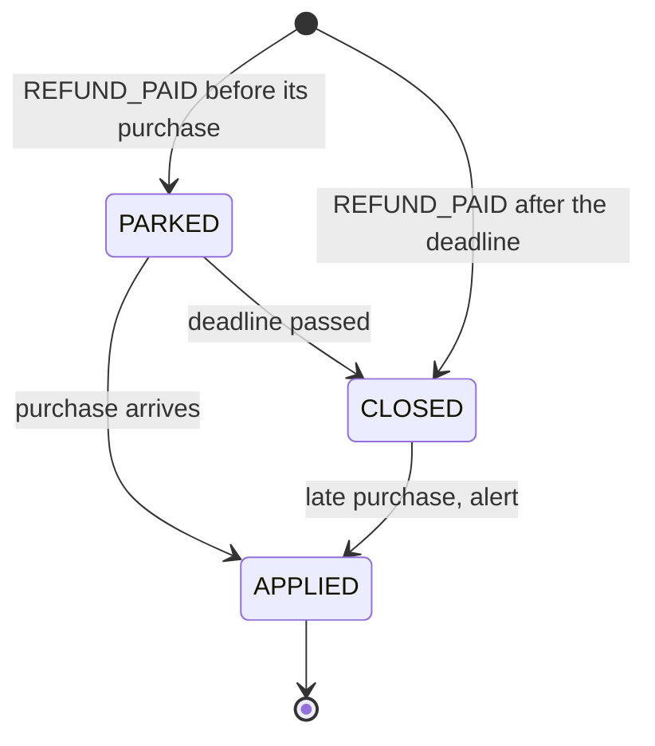

<!--
CHUNK: 08
TITLE: State Machines & Business Rules
PROJECT: Refunds Platform
VERSION: 1.0
DEPENDS_ON: 04
PART OF: LLD - Refunds Platform
-->

# 11. State Machines & Business Rules

> **Convention:** the designed state machines are the SDD's (Figure 14 in [§17.1](../sdd-refunds-platform/13a-service-refund.md#171-refund-service), Figure 17 in [§17.2](../sdd-refunds-platform/13b-service-payout.md#172-payout-service)); this chunk adds the implementation view: sub-states, the method that performs each transition, its guard, and its side effects. Business rules are the BRDs'; they are cited, not restated.

## 11.1 Aggregate State Machines

### `RefundRequest` aggregate (in `refund-service`)

**States:** `status` in SUBMITTED, APPROVED, REJECTED, PAID, CANCELLED, with `payout_status` (NONE, PENDING, FAILED, SUCCEEDED) as a sub-state of APPROVED. `APPROVED_PENDING` and `APPROVED_FAILED` below are status APPROVED with payout status PENDING or FAILED.



**Transition rules:**

| From | Event | To | Guard | Side effect | Method |
|------|-------|----|-------|-------------|--------|
| - | submit | SUBMITTED | Window (REFUNDS/UC-01 BR-1), no active claim (BR-2) | Claims active, history, `REFUND_SUBMITTED` | `RefundRequest.submit` |
| SUBMITTED | cancel | CANCELLED | Caller owns it (REFUNDS/UC-03 BR-1) | Claims released, history, `REFUND_CANCELLED` | `RefundRequest.cancel` |
| SUBMITTED | reject | REJECTED | Own branch, reason (REFUNDS/UC-04 BR-1, BR-3) | Claims released, history, `REFUND_REJECTED` | `RefundRequest.reject` |
| SUBMITTED | approve | APPROVED + PENDING | Own branch, amount rule, reason when partial (BR-1, BR-2) | History, `REFUND_APPROVED` | `RefundRequest.approve` |
| APPROVED + PENDING or FAILED | `PAYOUT_SUCCEEDED` | PAID + SUCCEEDED | Status APPROVED | History, `REFUND_PAID` | `RefundRequest.markPaid` |
| APPROVED + PENDING | `PAYOUT_FAILED` | APPROVED + FAILED | Status APPROVED | No history row, `REFUND_PAYOUT_FAILED`, queue flag | `RefundRequest.markPayoutFailed` |

> **Invariants enforced at every transition:** optimistic `version` must match (`UPDATE ... WHERE version = :v`); `tenant_id`, `customer_id`, `branch_id`, `receipt_number`, `requested_amount`, and `submitted_at` are immutable; CANCELLED, REJECTED, and PAID are final; claims are active only while SUBMITTED, APPROVED, or PAID.

### `Payout` aggregate (in `payout-service`)

**States:** PENDING (due, or an attempt in flight under a lease), RETRY_WAIT, SUCCEEDED, FAILED.



**Transition rules:**

| From | Event | To | Guard | Side effect | Method |
|------|-------|----|-------|-------------|--------|
| - | `REFUND_APPROVED` | PENDING | No payout for the refund | `next_attempt_at` = now | `Payout.pending` |
| PENDING or RETRY_WAIT | claim | PENDING | Due and window open | Attempt row, lease, `first_attempt_at` set once | `Payout.startAttempt` |
| PENDING, RETRY_WAIT, FAILED | CONFIRMED (API-02 or API-03) | SUCCEEDED | Not already SUCCEEDED | `PAYOUT_SUCCEEDED` | `Payout.succeed` |
| PENDING | REFUSED, UNAVAILABLE, IN_DOUBT | RETRY_WAIT | Latest attempt, not FAILED | `next_attempt_at` = backoff, clamped to the window end | `Payout.retryWait` |
| PENDING or RETRY_WAIT | claim after the window | FAILED | `now >= first_attempt_at + window` | `PAYOUT_FAILED` | `Payout.fail` |

> **Invariants:** one payout per (`tenant_id`, `refund_id`); `id` (the CardPay key) never changes; `amount`, `currency`, and `original_payment_ref` are immutable after creation; at most one attempt with a NULL outcome.

### `Notification` send-log row (in `notification-service`)



### `PendingTakeBack` (in `loyalty-service`)



## 11.2 Cross-Service Business Rules

> **Rules that one service depends on another to enforce.** When you change a rule here, check downstream consumers.

### Rule: One payout per approved refund

**Statement:** an approved refund is paid at most once, and a missing payout is detected (REFUNDS/NFR-01).

**Source of truth:** payout-service (ADR-10).

**Enforcement points:** payout-service unique (`tenant_id`, `refund_id`) and inbox; CardPay `Idempotency-Key` = payout id; refund-service watchdog; payout-service provider reconciliation.

| Input condition | Expected outcome |
|-----------------|------------------|
| `REFUND_APPROVED` redelivered or replayed | No second payout; `payout_duplicate_blocked_total` + 1 |
| CardPay call times out, attempt re-run | Same key; CardPay returns the first result |
| No payout outcome after the window + 1 hour | `refund_payout_outcome_overdue` above zero, alert |

### Rule: A purchase is identified by (branch, receipt number)

**Statement:** every claim, earn, and take-back keys a purchase by branch and receipt number (SDD A-4, OI-04).

**Source of truth:** POS Records data, as copied by refund-service and loyalty-service.

**Enforcement points:** `uk_refund_item_active_claim`; `uk_movement_earned`; take-back match on `REFUND_PAID.branchId` + `receiptNumber`.

| Input condition | Expected outcome |
|-----------------|------------------|
| Same receipt number in two branches | Independent claims and independent earn movements |
| `REFUND_PAID` for branch B, receipt R; EARNED exists for (B, R) | TAKEN_BACK on that member |

### Rule: Amounts and destination come only from POS Records

**Statement:** requested amounts are sums of POS lines; a payout pays `approvedAmount` to `originalPaymentRef` from `REFUND_APPROVED` and nothing the client supplied (REFUNDS 02 Assumption 2, SDD §17.1 Constraints).

**Source of truth:** refund-service.

**Enforcement points:** `RefundRequestServiceImpl.submit` re-reads POS; payout-service copies both fields from the event only.

| Input condition | Expected outcome |
|-----------------|------------------|
| Client sends an amount | Ignored; `CreateRefundRequest` has no amount field |
| Approved amount above requested | 422 `INVALID_PARTIAL_AMOUNT` |

### Rule: Business dates use the tenant's time zone

**Statement:** the refund window, the report day, and the parking deadline are calendar dates in the tenant's IANA zone; stored timestamps are UTC (SDD §6).

**Source of truth:** tenant configuration (`TenantCalendar`).

**Enforcement points:** refund window check, `BranchReportServiceImpl`, `TakeBackServiceImpl`.

| Input condition | Expected outcome |
|-----------------|------------------|
| Purchase 30 days before today (tenant zone) | Refundable |
| Purchase 31 days before today (tenant zone) | 422 `REFUND_WINDOW_PASSED` (REFUNDS/TC-REQ-02) |

## 11.3 Algorithm Pseudocode (non-trivial only)

### Algorithm: Points earned and taken back (`PointsPolicy`)

**Input:** purchase amount and currency; or paid amount, points earned on the purchase, points still held from it.

**Output:** whole points (LOYALTY 11: points are whole numbers).

```text
earned(amount, currency):
  require currency == EUR                     // rate defined as 1 point per 1 EUR (LOYALTY 02 Glossary)
  return floor(amount)
takeBack(paidAmount, earnedPoints, heldPoints):
  proposed = floor(paidAmount.amount)         // SDD §17.4 proposal: whole EUR of the paid amount
  return max(0, min(proposed, heldPoints))    // capped at the points still held from that purchase
```

**Edge cases:** a full refund of the whole receipt takes back exactly the earned points; several refunds of lines of one receipt each take back part until `heldPoints` reaches 0; a paid amount below 1 EUR takes back 0 (no movement is written); a purchase in another currency is refused by `earned`.

**Complexity:** O(1).

> TODO: rounding (floor) and non-EUR purchases are best guesses; SDD §17.4 and R-04 leave the partial take-back and fractional rounding to the LOYALTY owner, and A-8 does not say whether a non-EUR purchase earns points - verify.

### Algorithm: Refund window and parking deadline (`TenantCalendar`)

**Input:** tenant id, purchase date (a date in the tenant zone), now (UTC).

**Output:** refundable flag; parking deadline instant.

```text
zone = tenantConfig(tenant).timeZone                          // IANA id
today = LocalDate.ofInstant(now, zone)
refundable = !purchaseDate.isBefore(today.minusDays(30))       // REFUNDS/UC-01 BR-1
parkDeadline = purchaseDate.plusDays(2).atStartOfDay(zone).toInstant()   // end of the day after purchaseDate
dayBounds(date) = [date.atStartOfDay(zone), date.plusDays(1).atStartOfDay(zone))   // report day, in UTC instants
```

**Edge cases:** a daylight-saving change makes a day 23 or 25 hours long, which `atStartOfDay` handles; a zone change in tenant configuration applies to later evaluations only.

**Complexity:** O(1).

<!-- MASTER: refunds-platform-lld-master.md | PREV: 07-event-contracts.md | NEXT: 09-cross-cutting.md -->
