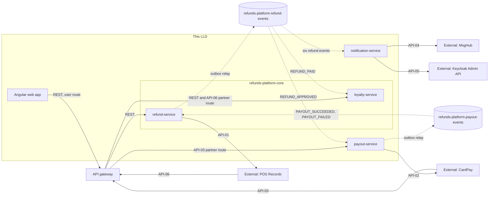

<!--
CHUNK: 02
TITLE: Context - Bounded Context & System Neighbours
PROJECT: Refunds Platform
VERSION: 1.0
PART OF: LLD - Refunds Platform
-->

# 5. Context

## 5.1 Bounded Context

This LLD covers all four bounded contexts of the platform, in three deployables, as decomposed in [SDD §13](../sdd-refunds-platform/09-services-summary.md#13-services-decomposition-summary) and styled in [SDD §8.1](../sdd-refunds-platform/04-architecture-style-and-diagrams.md#81-architecture-style): refund requests (refund-service) and the points ledger (loyalty-service) as modules of `refunds-platform-core`, payouts (payout-service) and customer messages (notification-service) as separate deployables, plus the Angular web app. The contexts share no table and make no synchronous call to each other; every cross-context fact travels on Kafka through an outbox and an inbox (ADR-05).

## 5.2 Upstream Producers (callers / event-publishers into this system)

| Upstream | Interaction | Protocol | Notes |
|----------|-------------|----------|-------|
| Angular web app (customers, members, branch managers) | Sync REST | HTTPS through the API gateway user route | JWT from Keycloak (OIDC code flow with PKCE, ADR-07); reaches refund-service and loyalty-service only. |
| CardPay | Sync REST (API-03 payout results) | HTTPS through the gateway partner route (ADR-11) | Transport and fields `TBD - external` (SDD API-03); tenant from the partner key in our path. |
| POS Records | Sync REST or file (API-06 member purchases) | HTTPS through the gateway partner route (ADR-11), or a per-tenant file drop | Delivery mode `TBD - external` (SDD API-06). |
| refund-service and payout-service (internal) | Async event | Kafka | `refunds-platform-refund-events` and `refunds-platform-payout-events` (SDD §14.4); consumers in this LLD are listed in 07 § 10.4. |

## 5.3 Downstream Consumers (systems this LLD's services call / publish to)

| Downstream | Interaction | Protocol | Notes |
|------------|-------------|----------|-------|
| POS Records | Sync REST (API-01 receipt lookup) | HTTPS | Caller: refund-service; Resilience4j instance `posRecords` (09 § 12.3). |
| CardPay | Sync REST (API-02 payout) | HTTPS | Caller: payout-service scheduler only, never inside a consumer transaction (ADR-10). |
| MsgHub | Sync REST (API-04 email and SMS) | HTTPS | Caller: notification-service; one bulkhead per channel. |
| Keycloak Admin API | Sync REST (API-05 contact lookup) | HTTPS | Caller: notification-service with its own client credentials (ADR-09). |
| Kafka | Async event | Kafka | Publishers: refund-service and payout-service outbox relays; DLQ topics per consumer. |

## 5.4 Cross-Service Dependencies (within this LLD)

The two core modules never call each other: loyalty-service learns about paid refunds only from `REFUND_PAID` on Kafka (SDD §14.7 broker-only module doctrine). refund-service is the only consumer of payout facts and re-publishes them as refund facts, so notification-service and loyalty-service never read the payout topic.

> **Convention:** keep this diagram service-level (not class-level). Class-level wiring lives in `04-implementation/<service>.md`.

## 5.5 Shared Conventions (apply to every service in scope)

- **Auth:** one Keycloak realm for all tenants; the JWT is validated at the API gateway and again in each deployable (ADR-07, which overrides the gateway-only default of CLAUDE.md for these money-moving endpoints). Partner calls carry no JWT (ADR-11).
- **Tenant resolution:** users: the `tenant_id` claim; partners: the partner key in our path, resolved before the signature is verified (ADR-11); events: the envelope `tenant_id` (SDD §14.3); jobs: one run per tenant from the tenant registry (LA-01).
- **Correlation ID:** `X-Correlation-Id` (UUID) on every HTTP call we make or receive and `correlation_id` in every event envelope; W3C `traceparent` over HTTP and Kafka record headers (SDD §15.1, §11.4).
- **Time zone:** UTC for every stored and transmitted timestamp; business calendar rules (refund window, daily report day, take-back parking deadline) use the tenant's IANA zone from tenant configuration (SDD §6 ecosystem rules).
- **ID strategy:** UUIDv7 generated in the application through an `IdGenerator` port, never by the database (SDD §11.1).
- **Money:** `numeric(19,4)` in the database, `BigDecimal` plus ISO-4217 currency in Java, never floating point (SDD §6); JSON representation in 06 § 9.2.

> TODO: best guess: a small in-house UUIDv7 generator behind the `IdGenerator` port, since the Java 21 `UUID` class offers no version-7 factory; a library instead is a new dependency needing approval per CLAUDE.md - verify with the team.

<!-- MASTER: lld-master.md | PREV: 01-purpose-and-scope.md | NEXT: 03-architecture.md -->
