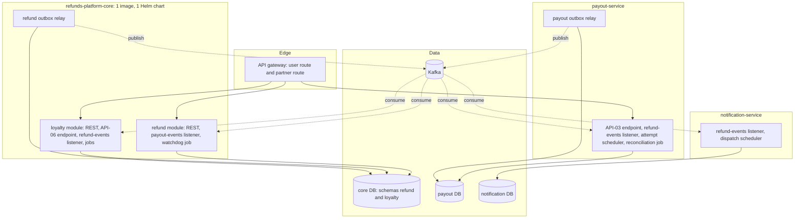
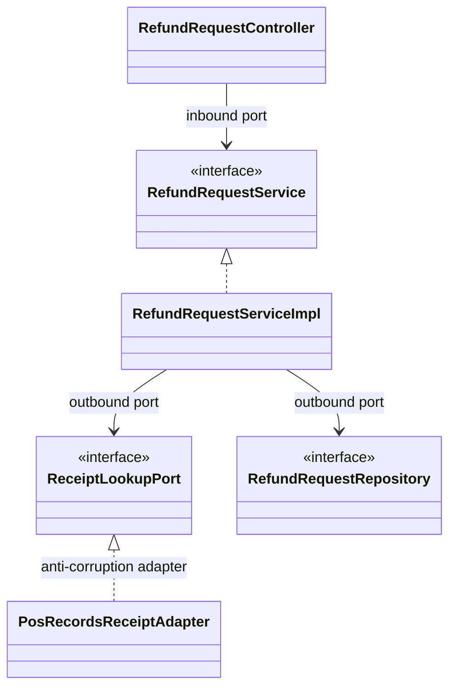

<!--
CHUNK: 03
TITLE: Architecture Overview - Components & Deployment
PROJECT: Refunds Platform
VERSION: 1.0
PART OF: LLD - Refunds Platform
-->

# 6. Architecture Overview

> **Note:** this chunk is a high-level orientation. Per-service detail lives in `04-implementation/<service>.md`. If you need class-level or method-level detail, jump straight there.

## 6.1 Component Topology

Derived from [SDD §8.3 Figure 3](../sdd-refunds-platform/04-architecture-style-and-diagrams.md#83-high-level-architecture-diagram); this view adds the runtime components inside each deployable (listeners, relays, schedulers).

The core deployable runs its two modules with separate connection pools, listener containers, and scheduler pools, so a fault in one module cannot exhaust the other's resources (SDD R-07). The outbox relay of each database is active on exactly one replica at a time (advisory lock, 09 § 12.4); consumers and schedulers run on every replica.

## 6.2 Deployment Topology

Defaults are owned by [SDD §11.3](../sdd-refunds-platform/07-cross-cutting-concerns.md#113-deployment-default); this table records only the implementation choices.

| Concern | Choice | Source / Rationale |
|---------|--------|--------------------|
| Container | One OCI image per deployable: `refunds-platform-core`, `payout-service`, `notification-service` | SDD §11.3 |
| Orchestrator | On-premises Kubernetes, one Helm chart per deployable | SDD §11.3, A-2 |
| Namespace strategy | One namespace per environment (Dev, SIT, UAT, Prod) | LLD proposal |
| Service mesh / Ingress | Ingress controller only; no mesh | SDD §6 |
| Replicas (per deployable, baseline) | core 2 min / 6 max; payout-service 2 / 3; notification-service 2 / 6 | LLD proposal; SDD §11.3 leaves sizing open |
| Deployment strategy | Rolling update with readiness gates; Flyway runs before the new version takes traffic | SDD §11.3 |
| Autoscaling | HPA on CPU for the core and notification-service; notification-service also on consumer lag (SDD §17.3) | SDD §11.3, §17.3 |
| Readiness | Database only; relays and consumers never gate readiness | SDD §11.3 |
| Module isolation inside the core | One datasource, Hikari pool, and PostgreSQL role per module (role `refund_app` sees only schema `refund`, `loyalty_app` only `loyalty`); one Kafka listener container factory and one scheduler pool per module | SDD R-07, ADR-01 |

> TODO: best-guess namespace strategy and replica minimum / maximum per deployable (SDD §11.3 and §19 leave sizing open) - verify with the platform team and replace.

> TODO: autoscaling on consumer lag needs an external-metrics source for the HPA (for example a Prometheus metrics adapter); no such component is named in SDD §6 - verify with the platform team, and treat any new component as a dependency needing approval.

> Confirm: one datasource and database role per core module is an LLD proposal that turns the ADR-01 "no cross-schema reads" rule into a database-level guarantee; verify the two-datasource wiring cost with the team.

## 6.3 Runtime Stack

Derived view of [SDD §6 Ecosystem Overview](../sdd-refunds-platform/02-ecosystem-overview.md#6-ecosystem-overview); every row keeps its SDD source, and a value that disagrees with SDD §6 is drift, never a local override.

| Layer | Technology | Version | Source |
|-------|-----------|---------|--------|
| Language | Java | 21 | SDD §6 Backend Runtime (REFUNDS/TI-01) |
| Framework | Spring Boot | 3.5+ | SDD §6 Backend Runtime |
| Build | Maven or Gradle | not pinned | not in SDD §6 |
| Database | PostgreSQL | 17+ | SDD §6 Primary RDBMS (REFUNDS/TI-02) |
| Message Broker | Apache Kafka, JSON Schema registry | not pinned | SDD §6 Event Broker / Streaming |
| Cache | None in this release | - | SDD §6 Caching |
| Auth | Keycloak, one realm | not pinned | SDD §6 IAM / AuthN |
| Migrations | Flyway | not pinned | SDD ADR-06 |
| Resilience | Resilience4j | not pinned | SDD §15.1 Resilience row; CLAUDE.md default |
| API gateway | Product not chosen | not pinned | SDD §6 API Gateway |
| Observability | Prometheus metrics, OpenTelemetry tracing, JSON logs | not pinned | SDD §6 Observability rows |
| Orchestration | Kubernetes (on-premises), containerd | not pinned | SDD §6 Compute / Infra, Container Runtime |
| Frontend (if applicable) | Angular (standalone components), PrimeNG, Tailwind | Angular 17+; PrimeNG and Tailwind not pinned | SDD §6 Frontend Stack |
| Testing | JUnit 5, Mockito, Testcontainers, Jest, Playwright | not pinned | SDD AP-11; CLAUDE.md |

> TODO: not derivable from inputs - version pins for Kafka, the schema registry, Keycloak, the API gateway, Flyway, Resilience4j, PrimeNG, Tailwind, and the build tool are open in SDD §6; no pin is invented here - please specify in SDD §6.

> **Convention:** any value flagged `> Confirm:` here means the SDD/code did not pin it; the row uses CLAUDE.md default but should be verified.

## 6.4 Architectural Style - As Operationalised

> **Inherits from:** [SDD §8.1 Architecture Style](../sdd-refunds-platform/04-architecture-style-and-diagrams.md#81-architecture-style) (hybrid: modular monolith core plus two services; EDA; DDD; hexagonal).
>
> **What this section adds:** the concrete operationalisation.

- **Service boundary rule:** one module or service = one bounded context = one private schema (`refund`, `loyalty`) or database (`payout`, `notification`). No cross-schema reads; in the core this is enforced by the per-module database role (6.2) and by architecture tests.
- **Inter-service async:** topics per producing context, named `refunds-platform-<context>-events` (SDD §14.2 convention, which replaces the `<context>.<entity>.<event>` template default); consumers filter by `event_type`. JSON Schema subjects per event in the registry (07 § 10.2).
- **Inter-service sync:** none. Synchronous HTTPS only web app to core (through the gateway) and deployable to external provider, one hop (ADR-05).
- **Outbox pattern:** `outbox_event` in every publishing schema or database, written in the aggregate's transaction; one active relay per database (09 § 12.4).
- **Inbox:** `inbox_event` in every consuming schema or database; the inbox guard is the first statement of every consumer transaction (09 § 12.2).
- **Saga choreography vs orchestration:** choreography only; SAGA-01 has no orchestrator (ADR-05, 09 § 12.5).
- **Hexagonal package layout** per module and service, under a base package:

| Package | Contents |
|---------|----------|
| `<base>.<context>.domain` | Aggregates, entities, value objects, enums, domain exceptions; no Spring imports |
| `<base>.<context>.application` | `*Service` interfaces (inbound ports), `*ServiceImpl`, `*Port` interfaces (outbound ports), commands and results |
| `<base>.<context>.adapter.in.rest` | `*Controller`, `*Dto` and `*Response` records |
| `<base>.<context>.adapter.in.kafka` | `*Listener` classes |
| `<base>.<context>.adapter.in.partner` | Partner endpoints (API-03, API-06) |
| `<base>.<context>.adapter.out.persistence` | Spring Data repositories and JPA mappings |
| `<base>.<context>.adapter.out.<provider>` | Provider clients (POS Records, CardPay, MsgHub, Keycloak Admin API) |
| `<base>.platform` (shared library, LA-03) | Tenant and caller context, security permission map, idempotency, outbox, inbox, Problem Details |

The diagram shows the shape every module and service follows, with refund-service names: adapters depend on the application layer, never the reverse; provider types (POS, CardPay, MsgHub, Keycloak) never leave their adapter package (SDD §6 ecosystem rule on anti-corruption adapters).

- **Architecture tests:** build-time rules forbid imports between `<base>.refund` and `<base>.loyalty`, forbid `domain` depending on Spring or adapters, and require every repository query method to take the tenant (ADR-01, ADR-03).

> TODO: base package name (`<base>`) and repository layout (one repository per deployable plus the shared library) are not stated in the SDD - verify with the team.

> Confirm: ArchUnit is proposed for the ADR-01 architecture tests; it is a new test dependency and needs approval per CLAUDE.md.

<!-- MASTER: lld-master.md | PREV: 02-context.md | NEXT: 04-implementation/<service>.md -->
