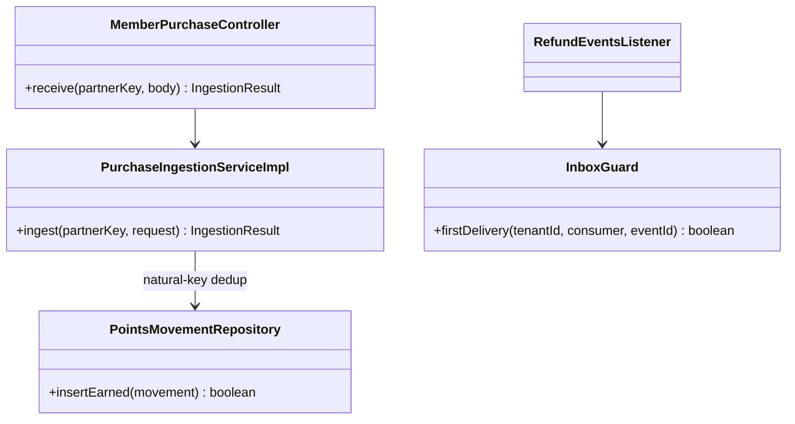
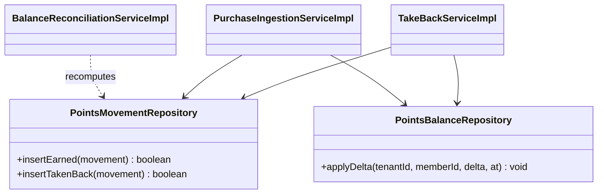
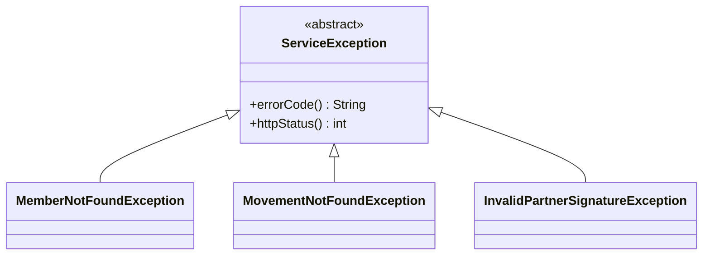
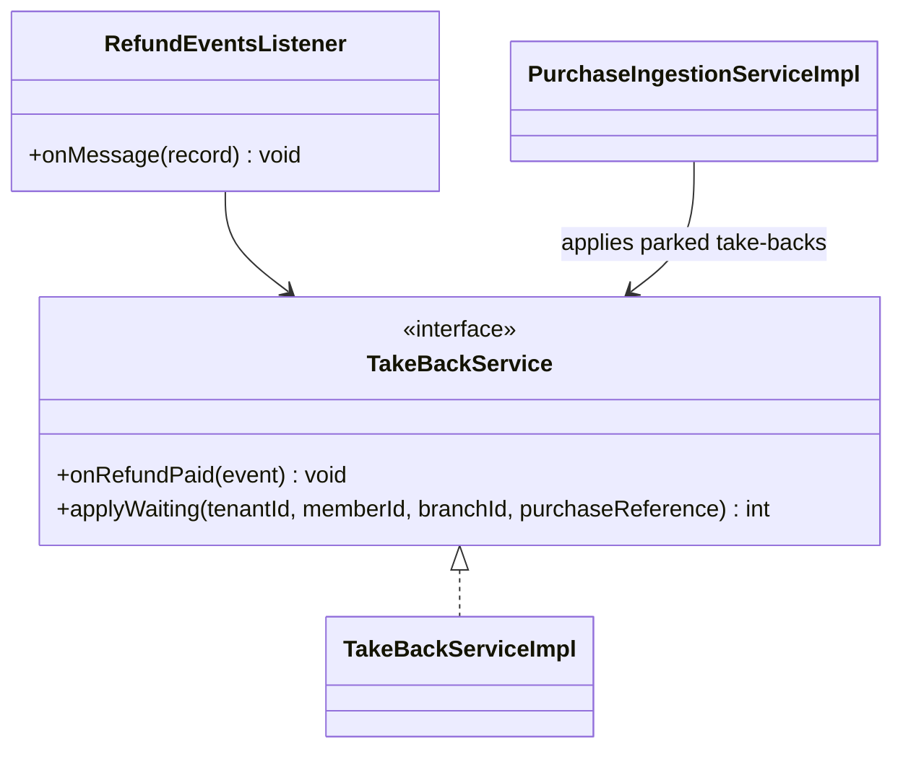
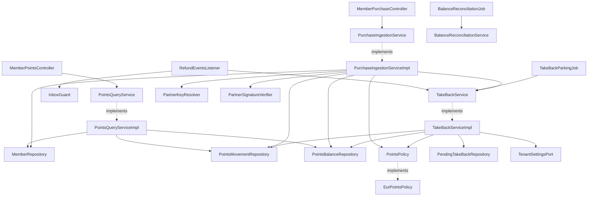
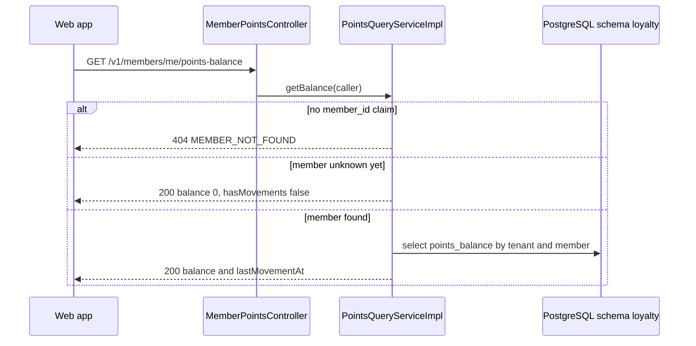
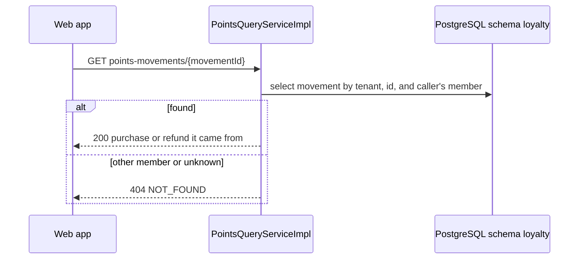
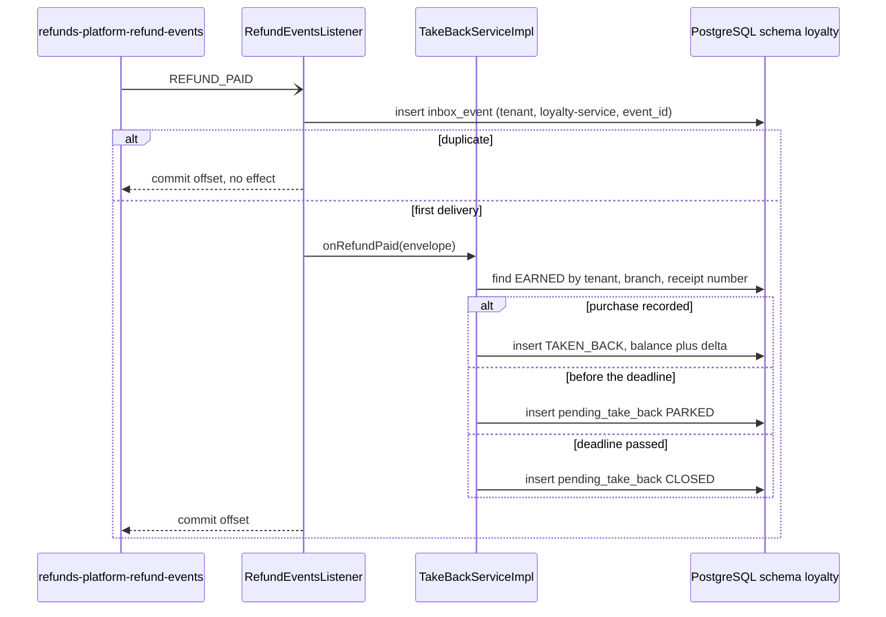
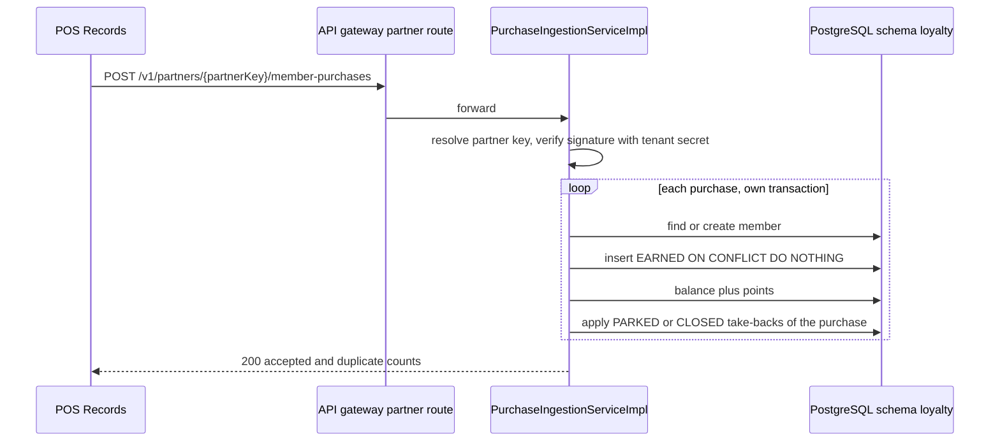

<!--
CHUNK: 04
TITLE: Per-Service Implementation - loyalty-service
PROJECT: Refunds Platform
VERSION: 1.0
DEPENDS_ON: 03, 09
PART OF: LLD - Refunds Platform
-->

# 7. Per-Service Implementation - loyalty-service

> **Bounded context:** points ledger, [SDD §17.4](../../sdd-refunds-platform/13d-service-loyalty.md#174-loyalty-service); module `loyalty` of the core deployable `refunds-platform-core` (ADR-01).
>
> **Source code:** Not applicable (from-sdd, greenfield). Target: package `<base>.loyalty` in `refunds-platform-core`, layout per [03 § 6.4](../03-architecture.md#64-architectural-style---as-operationalised).
>
> **Owns workflows:** LOYALTY/UC-01, LOYALTY/UC-02 (including BR-1, the take-back on a paid refund); earn movements from POS member purchases (API-06); parked take-back closing; daily balance reconciliation. Participates in SAGA-01 as its last step ([09 § 12.5](../09-cross-cutting.md#125-saga-pattern-cross-service-transactions)).

---

## 7.1 Responsibility

loyalty-service owns `Member` (the loyalty member number and its customer link), the append-only `PointsMovement` ledger (EARNED on member purchases, TAKEN_BACK when a purchase's refund is paid), the `PointsBalance` projection kept equal to the sum of movements, and `PendingTakeBack` for take-backs that arrive before their purchase. It consumes only `REFUND_PAID` from `refunds-platform-refund-events` (from Kafka, even though refund-service runs in the same deployable, SDD §14.7) and receives member purchases from POS Records (API-06, gateway partner route, ADR-11). It publishes no event. It serves the member's balance and history to the web app, resolving the member only from the token. It does not own purchases (POS Records), refunds or their payment (refund-service), or identities (Keycloak), and it never reads refund-service tables.

---

## 7.2 Class & Interface Map

### Controllers

| Class | Endpoints | Notes |
|-------|-----------|-------|
| `MemberPointsController` | `GET /v1/members/me/points-balance`, `GET /v1/members/me/points-movements`, `GET /v1/members/me/points-movements/{movementId}` | `loyalty.balance.read-own`, `loyalty.movement.read-own`; member from the `member_id` claim, never from the path |
| `MemberPurchaseController` | API-06: `POST /v1/partners/{partnerKey}/member-purchases` (proposed, ADR-11 pattern) | No JWT; partner key resolved to the tenant before the signature check |
| `RefundEventsListener` (Kafka) | topic `refunds-platform-refund-events`, group `loyalty-service` | Handles `REFUND_PAID` only |
| `TakeBackParkingJob` (scheduled) | every 15 minutes, per tenant | Closes PARKED take-backs past their deadline; stalled-feed gauge |
| `BalanceReconciliationJob` (scheduled) | daily, per tenant | Recomputes balances from movements (LOYALTY/NFR-01) |

> TODO: best-guess API-06 path `/v1/partners/{partnerKey}/member-purchases`; the delivery mode (push, file, or pull) is `TBD - external` (SDD API-06) - verify with the Retail IT team.

### Services (interfaces)

| Interface | Purpose | Implementations |
|-----------|---------|-----------------|
| `PointsQueryService` | Balance, movements, movement detail (UC-01, UC-02) | `PointsQueryServiceImpl` |
| `PurchaseIngestionService` | Earn movements from member purchases; applies waiting take-backs | `PurchaseIngestionServiceImpl` |
| `TakeBackService` | Take back points on `REFUND_PAID`; close expired parked take-backs | `TakeBackServiceImpl` |
| `BalanceReconciliationService` | Daily balance check | `BalanceReconciliationServiceImpl` |
| `PointsPolicy` (domain service) | Points to earn and to take back | `EurPointsPolicy` |
| `PartnerKeyResolver`, `PartnerSignatureVerifier` (outbound) | ADR-11 tenant resolution and POS signature check | shared library; `PosRecordsSignatureVerifier` |

### Service Implementations

| Class | Implements | Key methods |
|-------|------------|-------------|
| `PointsQueryServiceImpl` | `PointsQueryService` | `getBalance(...)`, `listMovements(...)`, `getMovement(...)` |
| `PurchaseIngestionServiceImpl` | `PurchaseIngestionService` | `ingest(...)`, private `earnOne(...)` |
| `TakeBackServiceImpl` | `TakeBackService` | `onRefundPaid(...)`, `closeExpiredParked(...)`, `applyWaiting(...)` |
| `BalanceReconciliationServiceImpl` | `BalanceReconciliationService` | `reconcile(...)` |
| `EurPointsPolicy` | `PointsPolicy` | `earnPoints(...)`, `takeBackPoints(...)` |

### Repositories

| Class | Entity | Notes |
|-------|--------|-------|
| `MemberRepository` | `Member` | `findByMemberNumber(tenantId, memberNumber)` |
| `PointsMovementRepository` | `PointsMovement` | `findEarned(tenantId, branchId, purchaseReference)`, `sumTakenBack(...)`, `existsTakeBack(tenantId, refundId)`, keyset page by member |
| `PointsBalanceRepository` | `PointsBalance` | `applyDelta(tenantId, memberId, delta, at)`: one atomic upsert (`balance = balance + delta`) |
| `PendingTakeBackRepository` | `PendingTakeBack` | `findWaiting(tenantId, branchId, purchaseReference)`, `closeExpired(tenantId, now)` |
| `InboxEventRepository` | platform table | Shared library |

### Domain Types (records)

| Type | Kind | Purpose |
|------|------|---------|
| `Member` | entity | `memberNumber`, `customerId` (nullable, A-5) |
| `PointsMovement` | entity (append-only) | EARNED (points > 0) or TAKEN_BACK (points < 0); never updated or deleted |
| `PointsBalance` | entity (projection) | `balance`, `lastMovementAt`, `version` |
| `PendingTakeBack` | entity | PARKED, APPLIED, or CLOSED (08 § 11.1) |
| `MovementType`, `TakeBackStatus` | enum | `EARNED`/`TAKEN_BACK`; `PARKED`/`APPLIED`/`CLOSED` |
| `MemberPurchase` | record | API-06 purchase after parsing: member number, purchase reference, amount, currency, branch, purchase time |
| `IngestionResult`, `ReconciliationReport` | record | API-06 response counts (accepted, duplicates, failed); reconciliation differences per member |
| `PointsBalanceResponse`, `PointsMovementPageResponse`, `PointsMovementDetailResponse` | record | OpenAPI schemas `PointsBalance`, `PointsMovementPage`, `PointsMovementDetail` (SDD §17.4) |
| `RefundPaidPayload` | record | Fields per SDD §14.9.5 (not restated) |

### Method Signatures (key methods only)

```java
public interface PointsQueryService {
  PointsBalanceResponse getBalance(CallerContext caller);
  PointsMovementPageResponse listMovements(CallerContext caller, PageCursor cursor, int limit);
  PointsMovementDetailResponse getMovement(CallerContext caller, UUID movementId);
}

public interface PurchaseIngestionService {
  IngestionResult ingest(String partnerKey, PartnerRequest request);
}

public interface TakeBackService {
  void onRefundPaid(EventEnvelope<RefundPaidPayload> event);
  int closeExpiredParked(UUID tenantId);
  int applyWaiting(UUID tenantId, UUID memberId, String branchId, String purchaseReference);
}

public interface PointsPolicy {
  int earnPoints(Money purchaseAmount);
  int takeBackPoints(int earnedPoints, int alreadyTakenBack, Money purchaseAmount, Money paidAmount);
}
```

> **Convention:** records are used for all DTOs (CLAUDE.md default). Constructor injection only; no `@Autowired` on fields.

> Confirm: class names follow CLAUDE.md conventions; verify with team (SDD §17.4 names none).

---

## 7.3 Method-Level Pseudocode (non-trivial logic only)

> **Confidence:** High for the matching and parking steps, which SDD §17.4 dictates; the points arithmetic carries the SDD's open question as a TODO.

### `PointsQueryServiceImpl.getBalance`

```text
1. caller.memberNumber absent -> throw MemberNotFoundException (404 MEMBER_NOT_FOUND; detail explains how to join)
2. member = memberRepo.findByMemberNumber(tenantId, caller.memberNumber)
   absent (no purchase recorded yet) -> PointsBalanceResponse(balance = 0, lastMovementAt = null, hasMovements = false)  (UC-01 A1)
3. b = balanceRepo.find(tenantId, member.id) -> PointsBalanceResponse(b.balance, b.lastMovementAt, hasMovements = true)
```

### `TakeBackServiceImpl.onRefundPaid`

```text
(listener transaction; inbox guard row already inserted)
1. p = event.payload; refundId = event.aggregateId
2. movementRepo.existsTakeBack(tenantId, refundId) or pendingRepo.existsByRefundId(tenantId, refundId) -> return
3. earned = movementRepo.findEarned(tenantId, p.branchId, p.receiptNumber)                 (purchase identity, SDD A-4)
4. found:
     points = policy.takeBackPoints(earned.points, movementRepo.sumTakenBack(tenantId, p.branchId, p.receiptNumber),
                                    earned.purchaseAmount, p.paidAmount)
     points > 0 -> insert PointsMovement(TAKEN_BACK, memberId = earned.memberId, points = -points, refundId,
                     refundReference = p.referenceNumber, paidAmount = p.paidAmount, branchId, purchaseReference, occurredAt = now)
                   balanceRepo.applyDelta(tenantId, earned.memberId, -points, now)
     points = 0 -> nothing left to take back; log DEBUG
     after commit: points_take_back_lag_seconds.record(now - p.paidAt)                     (LOYALTY/NFR-02)
5. not found:
     deadline = start of (p.purchaseDate + 2 days) in the tenant zone                        (end of the day after purchaseDate)
     insert PendingTakeBack(refundId, branchId, purchaseReference = p.receiptNumber, purchaseDate, paidAmount, currency,
                            refundReference = p.referenceNumber, deadlineAt = deadline,
                            status = now < deadline ? PARKED : CLOSED)
```

### `EurPointsPolicy.takeBackPoints`

```text
remaining = earnedPoints - alreadyTakenBack                  (a receipt can have several paid refunds for different lines)
if paidAmount >= purchaseAmount: return remaining            (full refund: all points still held from that purchase)
return min(floor(paidAmount in EUR), remaining)              (partial refund: SDD §17.4 proposal)
```

> TODO: best guess: partial take-back = whole EUR of the paid amount, capped at the points still held from that purchase, and earn = floor of the EUR amount (SDD §17.4 proposal; R-04 and the rounding question are open) - verify with the LOYALTY owner; the rule lives only in `EurPointsPolicy`.

> TODO: best guess: a purchase in a currency other than EUR earns no points and its take-back is 0, because the LOYALTY glossary rate is per EUR - verify with the LOYALTY owner.

### `PurchaseIngestionServiceImpl.ingest` (API-06)

```text
1. tenantId = partnerKeyResolver.resolve(partnerKey, POS_RECORDS) -> unknown -> 404 and security event
2. signatureVerifier.verify(tenantId, request) -> invalid -> 401 and security event
3. purchases = parse(request.body) (fields TBD - external) -> unparseable -> 400
4. for each purchase, its own transaction (earnOne):
   a. member = memberRepo.findByMemberNumber(tenantId, memberNumber) or insert Member(id = idGen.next(), memberNumber)
   b. insert PointsMovement(EARNED, points = policy.earnPoints(amount), purchaseReference, purchaseAmount, currency, branchId,
      occurredAt = purchaseTime); unique violation on uq_movement_earned -> duplicate, skip (no-op)
   c. balanceRepo.applyDelta(tenantId, member.id, +points, purchaseTime)
   d. takeBackService.applyWaiting(tenantId, member.id, branchId, purchaseReference): each PARKED or CLOSED take-back of
      that purchase, oldest first -> TAKEN_BACK movement, applyDelta, status APPLIED;
      a CLOSED one -> points_take_backs_applied_late_total++ and alert (SDD §17.4)
5. 200 with IngestionResult(accepted, duplicates) after the commits
```

### `TakeBackServiceImpl.closeExpiredParked` and `BalanceReconciliationServiceImpl.reconcile`

```text
closeExpiredParked(tenantId): UPDATE pending_take_back SET status = CLOSED, closed_at = now
                              WHERE tenant_id = :t AND status = PARKED AND deadline_at <= now
                              gauge points_take_backs_parked; gauge of PARKED rows older than 2 days (alert above zero)
reconcile(tenantId): per member, sum(points_movement.points) vs points_balance.balance (read-only snapshot)
                     each difference -> points_balance_drift_total++, alert; no automatic correction (runbook RB-05)
```

---

## 7.4 Design Patterns Applied

### Pattern: Idempotency (partner write, consumer, and take-back)

> **Applied:** Idempotency (CLAUDE.md: "Idempotency keys on all write endpoints touching money/wallet/notifications or external providers." and "Idempotency on every consumer and every write endpoint. Assume at-least-once delivery everywhere.")
>
> **Rationale (this service):** POS Records redelivers purchases on failure (SDD §12 INT-03) and `REFUND_PAID` arrives at least once; a duplicate earn or take-back would move a balance members must trust (LOYALTY/NFR-01). API-06 carries no `Idempotency-Key` (a provider-owned contract), so the natural key of the purchase is the idempotency key.

**Roles:**

| Role | Class / Component | Notes |
|------|-------------------|-------|
| Natural-key dedup (API-06) | `UNIQUE (tenant_id, branch_id, purchase_reference) WHERE type = 'EARNED'` | A redelivered purchase is a no-op (SDD API-06) |
| Consumer dedup | `InboxGuard` on (`tenant_id`, `loyalty-service`, `event_id`) | First statement of the listener transaction |
| Take-back dedup | `UNIQUE (tenant_id, refund_id) WHERE type = 'TAKEN_BACK'`; `UNIQUE (tenant_id, refund_id)` on `pending_take_back` | A refund takes back once |

**Class diagram:**



**Pseudocode skeleton:**

```text
boolean insertEarned(m): INSERT ... ON CONFLICT (tenant_id, branch_id, purchase_reference) WHERE type = 'EARNED' DO NOTHING
                         return rowCount == 1
```

### Pattern: Ledger (append-only movements with a balance projection)

> **Applied:** Ledger (CLAUDE.md: "Other patterns if needed (ie: Template method, Facade, .. etc)"; named by SDD §17.4 Developer Notes: "ledger with an append-only movement table and a balance projection updated in the same transaction")
>
> **Rationale (this service):** LOYALTY 03 defines the balance as the sum of the movements, and members must see every movement (UC-02). An append-only table keeps the history auditable and the balance rebuildable (SDD §17.4 Migration Strategy); updating the projection in the movement's transaction with one atomic `balance = balance + delta` keeps concurrent earn and take-back on one member correct without application-level locks.

**Roles:**

| Role | Class / Component |
|------|-------------------|
| Ledger (append-only) | `points_movement`, `PointsMovementRepository` (insert and read only) |
| Projection | `points_balance`, `PointsBalanceRepository.applyDelta` |
| Writers | `PurchaseIngestionServiceImpl.earnOne`, `TakeBackServiceImpl.onRefundPaid`, `TakeBackServiceImpl.applyWaiting` |
| Verifier | `BalanceReconciliationServiceImpl.reconcile` |

**Class diagram:**



**Pseudocode skeleton:**

```text
applyDelta(t, m, delta, at):
  INSERT INTO points_balance (tenant_id, member_id, balance, last_movement_at, version, ...)
  VALUES (:t, :m, :delta, :at, 0, ...)
  ON CONFLICT (tenant_id, member_id) DO UPDATE
     SET balance = points_balance.balance + EXCLUDED.balance,
         last_movement_at = GREATEST(points_balance.last_movement_at, EXCLUDED.last_movement_at),
         version = points_balance.version + 1
  always called in the transaction that inserted the movement; never without a movement (SDD §17.4 Avoid)
```

### Pattern: RFC 9457 Problem Details error model

> **Applied:** RFC 9457 error model (CLAUDE.md: "Global @RestControllerAdvice, Problem Details (RFC 9457). Business exceptions extend a base ServiceException with error code.")
>
> **Rationale (this service):** the member screens show `MEMBER_NOT_FOUND` as an invitation to join (UC-01 A1 for non-members), and API-06 refusals must be diagnosable by the Retail IT team; the shared advice gives both one envelope.

**Roles:**

| Role | Class / Component |
|------|-------------------|
| Base exception | `ServiceException` (shared) |
| Subclasses | `MemberNotFoundException` (404 `MEMBER_NOT_FOUND`), `MovementNotFoundException` (404 `NOT_FOUND`), `UnknownPartnerKeyException`, `InvalidPartnerSignatureException`, `InvalidPartnerPayloadException` (shared) |
| Translator | `ProblemDetailsAdvice` (shared) |

**Class diagram:**



**Pseudocode skeleton:**

```text
class MemberNotFoundException extends ServiceException:
  constructor() -> super(errorCode = "MEMBER_NOT_FOUND", httpStatus = 404)   detail key: how to join the program
```

### Pattern: Saga (choreography participant, SAGA-01 step 5)

> **Applied:** Saga, choreography (CLAUDE.md: "Sagas (choreography by default, orchestration when the flow is complex or needs central visibility) for cross-service business transactions. No distributed 2PC.")
>
> **Rationale (this service):** the take-back is the last state change of SAGA-01 and runs in its own module transaction, reacting to `REFUND_PAID` from Kafka, never through an in-process call (ADR-05), so loyalty-service can leave the core without a code change (ADR-01). It has no compensation: a take-back that cannot match is parked or closed and stays matchable, never dropped.

**Roles:**

| Role | Class / Component |
|------|-------------------|
| Step 5 handler | `RefundEventsListener` -> `TakeBackServiceImpl.onRefundPaid` |
| Deferred completion | `PurchaseIngestionServiceImpl.earnOne` -> `TakeBackServiceImpl.applyWaiting` |

**Class diagram:**



**Pseudocode skeleton:**

```text
RefundEventsListener.onMessage(record):
  envelope = deserialize(record); envelope.eventType != REFUND_PAID -> ignore
  transaction: inbox guard -> takeBackService.onRefundPaid(envelope)
```

**Not applied (conditions not met):** Outbox (the module publishes no event), Resilience4j (no outbound provider call: API-06 is inbound), Strategy (one points rule set), Factory Method, Mediator, Chain of Responsibility.

---

## 7.5 Dependency Injection Graph



---

## 7.6 Transaction Boundaries

| Method | Propagation | Isolation | Rollback rules |
|--------|-------------|-----------|----------------|
| `PointsQueryServiceImpl.*` | `REQUIRED`, read-only | `READ_COMMITTED` | Not applicable |
| `PurchaseIngestionServiceImpl.earnOne` | `REQUIRED` (`TransactionTemplate`), one purchase per transaction | `READ_COMMITTED` | Rollback on any exception; that purchase is reported failed and POS redelivers |
| `TakeBackServiceImpl.onRefundPaid` | `REQUIRED` (listener transaction, inbox guard first) | `READ_COMMITTED` | Rollback on any exception; invalid payload goes to `loyalty-service.dlq` |
| `TakeBackServiceImpl.applyWaiting` | `MANDATORY` (joins `earnOne`) | caller's | Rolls back with the earn movement |
| `TakeBackServiceImpl.closeExpiredParked` | `REQUIRED`, one statement per tenant | `READ_COMMITTED` | Retried at the next run |
| `BalanceReconciliationServiceImpl.reconcile` | `REQUIRED`, read-only | `REPEATABLE_READ` (one snapshot) | Not applicable |

> Confirm: transaction propagation default applied; verify per method.

---

## 7.7 Error Handling

| Exception | RFC 9457 type | HTTP Status | When thrown | Caller action |
|-----------|---------------|-------------|-------------|---------------|
| `MemberNotFoundException` | `{problemBase}/member-not-found` | 404 | Token without a `member_id` claim (SDD §17.4) | Web app explains how to join |
| `MovementNotFoundException` | `{problemBase}/not-found` | 404 | Unknown movement or another member's movement | None (terminal) |
| Bean Validation failure | `{problemBase}/validation-failed` | 400 | Bad cursor or limit | Fix the request |
| `UnknownPartnerKeyException` | `{problemBase}/not-found` | 404 | API-06 partner key unknown (security event) | Retail IT checks the registered key |
| `InvalidPartnerSignatureException` | `{problemBase}/unauthenticated` | 401 | API-06 signature invalid (security event) | Retail IT fixes the signature |
| `InvalidPartnerPayloadException` | `{problemBase}/validation-failed` | 400 | API-06 body unparseable | Retail IT fixes the feed |
| `InvalidEventException` (async) | not applicable | - | `REFUND_PAID` missing a used field | `loyalty-service.dlq`, alarm |
| Anything else | `{problemBase}/internal-error` | 500 | Unexpected | Retry later |

> **Convention:** all exceptions extend `ServiceException`; envelope in 09 § 12.6. An unmatched take-back is parked or closed, never an error (SDD §17.4).

---

## 7.8 Use-Case Workflows

### LOYALTY/UC-01: View Points Balance

**Trigger:** REST `GET /v1/members/me/points-balance` ([BRD UC-01](../../brd-loyalty-points/06a-use-cases-member.md#uc-01-view-points-balance)).

**Pre-conditions:** `loyalty.balance.read-own`. **Post-conditions:** none (read).

**Control flow:** `getBalance` (7.3).

**Sequence diagram:**



**Idempotency points / Outbox emission points:** not applicable (read). **Retry / timeout policy:** none server-side. **Error handling:** 404 `MEMBER_NOT_FOUND`, 401, 403.

### LOYALTY/UC-02: View Points History

**Trigger:** REST `GET /v1/members/me/points-movements` and `GET /v1/members/me/points-movements/{movementId}` ([BRD UC-02](../../brd-loyalty-points/06a-use-cases-member.md#uc-02-view-points-history)).

**Pre-conditions:** `loyalty.movement.read-own`. **Post-conditions:** none (read).

**Control flow:**

```text
1. list: WHERE tenant_id = :t AND member_id = :m ORDER BY occurred_at DESC, id DESC (keyset cursor)
   each item: date, type, signed whole points, purchase reference (EARNED) or refund reference (TAKEN_BACK, UC-02 A1)
2. detail: by (tenant, movementId) AND member_id = caller's member, else 404 NOT_FOUND;
   EARNED -> purchase (receipt number, branch, date, amount); TAKEN_BACK -> refund (reference number, paid amount, date)
```

**Sequence diagram:**



**Idempotency points / Outbox emission points:** not applicable. **Retry / timeout policy:** none. **Error handling:** 404 `MEMBER_NOT_FOUND`, 404 `NOT_FOUND`, 400.

### LOYALTY/UC-02 BR-1: Take back points on `REFUND_PAID`

**Trigger:** Kafka `REFUND_PAID` on `refunds-platform-refund-events`, group `loyalty-service` (SDD §8.4.2, §8.5.2).

**Pre-conditions:** the event passes the inbox guard.

**Post-conditions:** one TAKEN_BACK movement and the balance updated, or one PARKED or CLOSED `pending_take_back`.

**Control flow:** `onRefundPaid` (7.3).

**Sequence diagram:**



**Idempotency points:** inbox; unique `refund_id` on TAKEN_BACK and on `pending_take_back`.

**Outbox emission points:** none (the module publishes nothing).

**Retry / timeout policy:** listener container retries with backoff, then `loyalty-service.dlq`; the take-back lag metric measures LOYALTY/NFR-02.

**Error handling:** payload missing a used field -> DLQ with alarm.

### Earn points from a POS member purchase (API-06)

**Trigger:** REST call from POS Records on the partner route (API-06, `TBD - external`).

**Pre-conditions:** partner key registered for the tenant; valid signature.

**Post-conditions:** one EARNED movement per new purchase, balance updated, waiting take-backs of that purchase applied.

**Control flow:** `ingest` (7.3).

**Sequence diagram:**



**Idempotency points:** natural key (`tenant_id`, `branch_id`, `purchase_reference`).

**Outbox emission points:** none.

**Retry / timeout policy:** provider-driven redelivery (`TBD - external`).

**Error handling:** 404 unknown key, 401 bad signature, 400 bad body; a failed purchase transaction is reported in the response so POS can redeliver it.

### Job: Close parked take-backs

**Trigger:** `TakeBackParkingJob`, every 15 minutes per tenant. **Control flow:** `closeExpiredParked` (7.3). **Post-conditions:** expired PARKED rows CLOSED (still matchable). One statement: no sequence diagram. **Error handling:** a failed run retries at the next tick.

### Job: Daily balance reconciliation (LOYALTY/NFR-01)

**Trigger:** `BalanceReconciliationJob`, daily per tenant. **Control flow:** `reconcile` (7.3). **Post-conditions:** drift metric and alert; no correction. One read: no sequence diagram.

### Cross-service Saga (orchestrator role)

Not applicable for this service: SAGA-01 is choreographed (ADR-05); see [09 § 12.5](../09-cross-cutting.md#125-saga-pattern-cross-service-transactions). The take-back lifecycle is in [08 § 11.1](../08-state-and-rules.md#111-aggregate-state-machines).

<!-- MASTER: lld-master.md | PREV: 03-architecture.md | NEXT: 05-data-model.md -->
