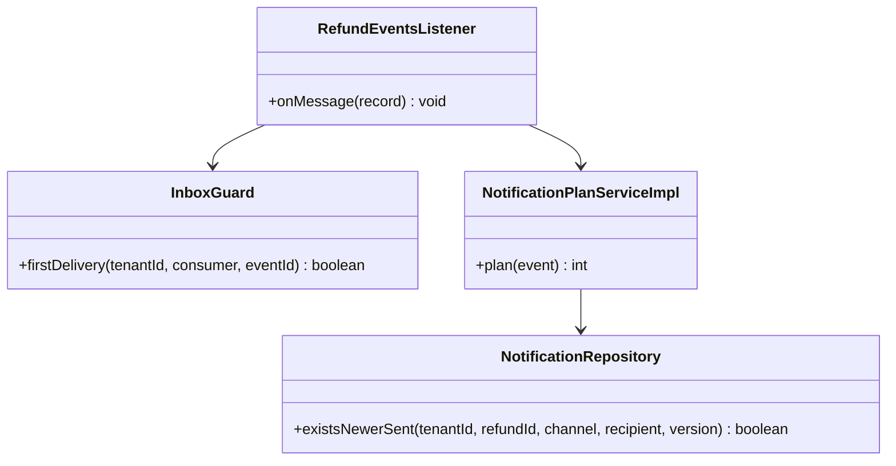
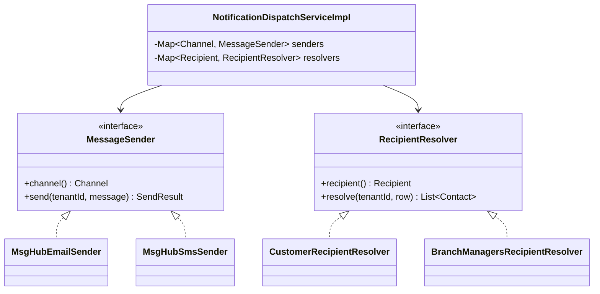
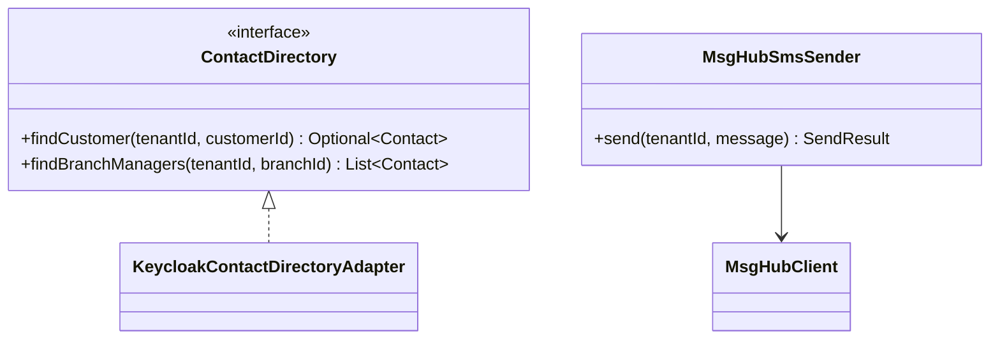
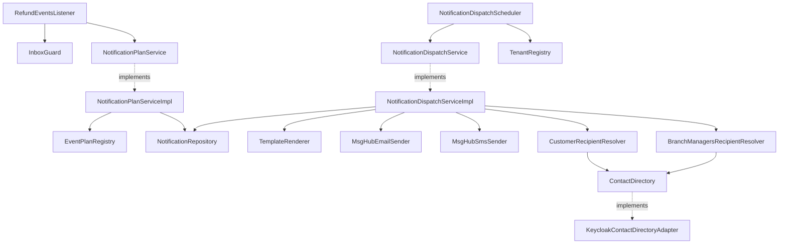
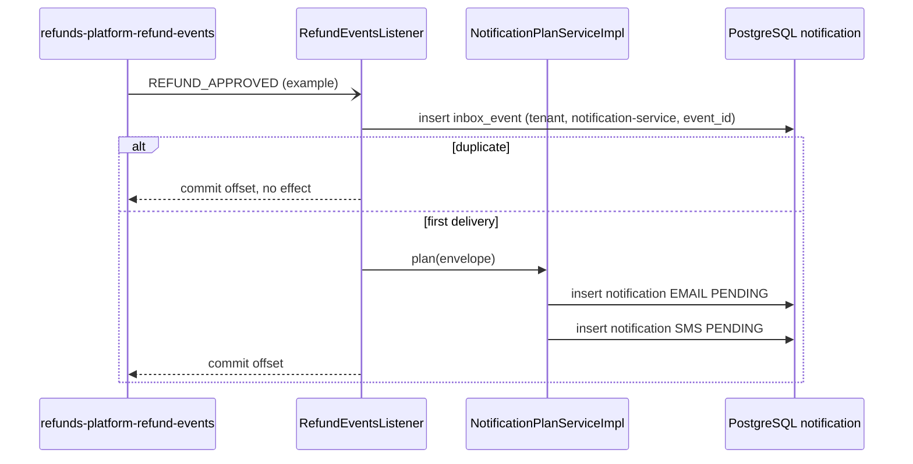
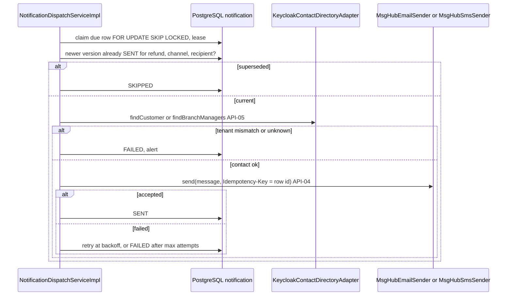

<!--
CHUNK: 04
TITLE: Per-Service Implementation - notification-service
PROJECT: Refunds Platform
VERSION: 1.0
DEPENDS_ON: 03, 09
PART OF: LLD - Refunds Platform
-->

# 7. Per-Service Implementation - notification-service

> **Bounded context:** refund messaging, [SDD §17.3](../../sdd-refunds-platform/13c-service-notification.md#173-notification-service); separate deployable `notification-service` with its own database `notification` (ADR-01).
>
> **Source code:** Not applicable (from-sdd, greenfield). Target: package `<base>.notification` in the `notification-service` repository, layout per [03 § 6.4](../03-architecture.md#64-architectural-style---as-operationalised).
>
> **Owns workflows:** no BRD use case (SDD §13). Realises the "tell the customer" steps of REFUNDS/UC-01 step 6, UC-03 step 5, UC-04 steps 6, 7, and A2, and the "tell the branch manager" step of UC-04 E1. Not a SAGA-01 step: it reacts to SAGA-01 facts but changes no saga state.

---

## 7.1 Responsibility

notification-service owns the send log (one `notification` row per consumed event and channel), the message templates per event, channel, and locale, and the retry state of each message. It consumes the six refund facts from `refunds-platform-refund-events` (`REFUND_SUBMITTED`, `REFUND_CANCELLED`, `REFUND_APPROVED`, `REFUND_REJECTED`, `REFUND_PAID`, `REFUND_PAYOUT_FAILED`), resolves the recipient's contact details from Keycloak at send time (API-05, ADR-09), and sends email and SMS through MsgHub (API-04). It publishes no event and exposes no business endpoint. It does not own refund state (refund-service), contact details (Keycloak; held only in memory while sending), or delivery to the handset or mailbox (MsgHub); a message outcome never changes refund state.

---

## 7.2 Class & Interface Map

### Controllers

| Class | Endpoints | Notes |
|-------|-----------|-------|
| `RefundEventsListener` (Kafka) | topic `refunds-platform-refund-events`, group `notification-service` | Handles all six refund events; unknown types ignored |
| `NotificationDispatchScheduler` (scheduled) | fixed delay, every replica | Claims due PENDING rows per tenant with `FOR UPDATE SKIP LOCKED` |
| Actuator only | `/actuator/health/liveness`, `/actuator/health/readiness`, `/actuator/prometheus` | No business REST endpoint (SDD §17.3 List of APIs) |

### Services (interfaces)

| Interface | Purpose | Implementations |
|-----------|---------|-----------------|
| `NotificationPlanService` | Turn one consumed event into send-log rows | `NotificationPlanServiceImpl` |
| `NotificationDispatchService` | Send due rows: supersession, contacts, render, send, retry | `NotificationDispatchServiceImpl` |
| `ContactDirectory` (outbound, SDD name) | Customer contact, or the branch's managers, from Keycloak (API-05) | `KeycloakContactDirectoryAdapter` |
| `MessageSender` (outbound, SDD name; Strategy) | Send one message on one channel (API-04) | `MsgHubEmailSender`, `MsgHubSmsSender` |
| `RecipientResolver` (Strategy) | Contacts for a row's recipient type | `CustomerRecipientResolver`, `BranchManagersRecipientResolver` |
| `TemplateRenderer` | Render a template for event, channel, and locale | `ResourceBundleTemplateRenderer` |

### Service Implementations

| Class | Implements | Key methods |
|-------|------------|-------------|
| `NotificationPlanServiceImpl` | `NotificationPlanService` | `plan(...)` |
| `NotificationDispatchServiceImpl` | `NotificationDispatchService` | `dispatchDue(...)`, private `dispatchOne(...)` |
| `KeycloakContactDirectoryAdapter` | `ContactDirectory` | `findCustomer(...)`, `findBranchManagers(...)`; instance `keycloakAdmin` |
| `MsgHubEmailSender`, `MsgHubSmsSender` | `MessageSender` | `send(...)`; instances `msgHubEmail`, `msgHubSms` |
| `EventPlanRegistry` | - | `planFor(eventType)`: recipient, channels, template code per event (the SDD §17.3 table) |

### Repositories

| Class | Entity | Notes |
|-------|--------|-------|
| `NotificationRepository` | `Notification` | `claimNextDue` (native `FOR UPDATE SKIP LOCKED`), `existsNewerSent(tenantId, refundId, channel, recipient, aggregateVersion)` |
| `InboxEventRepository` | platform table | Shared platform library |

### Domain Types (records)

| Type | Kind | Purpose |
|------|------|---------|
| `Notification` | entity | Send-log row; `markSent`, `markSkipped`, `markFailed`, `scheduleRetry` (08 § 11.1 table) |
| `Channel`, `Recipient`, `NotificationStatus` | enum | `EMAIL`/`SMS`; `CUSTOMER`/`BRANCH_MANAGERS`; `PENDING`/`SENT`/`SKIPPED`/`FAILED` |
| `EventPlan` | record | `Recipient recipient`, `Set<Channel> channels`, `String templateCode` |
| `Contact` | record | `email`, `phone` (nullable), `locale`, `tenantId` attribute; never persisted, never logged |
| `OutboundMessage` | record | `idempotencyKey` (row id), `channel`, recipients, rendered subject and body |
| `SendResult` | record | `accepted`, `providerMessageId`, `errorCode`, `retryable` |
| Consumed payload records | record | Fields per SDD §14.9.1 to §14.9.5 and §14.9.8 (not restated) |

### Method Signatures (key methods only)

```java
public interface NotificationPlanService {
  int plan(EventEnvelope<JsonNode> event);
}

public interface NotificationDispatchService {
  int dispatchDue(UUID tenantId, int maxClaims);
}

public interface ContactDirectory {
  Optional<Contact> findCustomer(UUID tenantId, UUID customerId);
  List<Contact> findBranchManagers(UUID tenantId, String branchId);
}

public interface MessageSender {
  Channel channel();
  SendResult send(UUID tenantId, OutboundMessage message);
}

public interface RecipientResolver {
  Recipient recipient();
  List<Contact> resolve(UUID tenantId, Notification row);
}
```

> **Convention:** records are used for all DTOs (CLAUDE.md default). Constructor injection only; no `@Autowired` on fields.

> Confirm: class names follow CLAUDE.md conventions; verify with team (SDD §17.3 names only `ContactDirectory` and `MessageSender`).

---

## 7.3 Method-Level Pseudocode (non-trivial logic only)

> **Confidence:** High for the steps SDD §17.3 dictates; the recipient-scoped supersession and the retry values carry their own flags.

### `NotificationPlanServiceImpl.plan`

```text
(listener transaction; inbox guard row already inserted)
1. plan = eventPlanRegistry.planFor(event.eventType) -> none -> return 0 (forward-compatible)
2. validate the payload fields the plan needs (customerId, referenceNumber, amounts, decisionReason when partial,
   branchId for BRANCH_MANAGERS) -> missing -> InvalidEventException (DLQ, SDD §17.3)
3. for channel in plan.channels:
     insert Notification(id = idGen.next(), sourceEventId = event.eventId, eventType, aggregateVersion = event.aggregateVersion,
       refundId = event.aggregateId, recipient = plan.recipient, customerId (CUSTOMER rows), branchId (BRANCH_MANAGERS rows),
       channel, templateCode = plan.templateCode, templateParams = {referenceNumber, amount + currency, reason, branch},
       status = PENDING, attemptCount = 0, nextAttemptAt = now)
     unique violation on (tenant_id, source_event_id, channel) -> skip that channel (redelivery)
4. no provider call in this transaction (SDD §17.3 Error Handling)
```

### `NotificationDispatchServiceImpl.dispatchOne`

```text
A. claim transaction: row = claimNextDue(tenantId) FOR UPDATE SKIP LOCKED; row.nextAttemptAt = now + lease; commit
B. supersession: existsNewerSent(tenantId, row.refundId, row.channel, row.recipient, row.aggregateVersion)
     -> markSkipped("SUPERSEDED"), done
C. contacts = recipientResolvers[row.recipient].resolve(tenantId, row)            (API-05)
     unknown customer or no manager for the branch -> markFailed + alert
     any contact.tenantId != tenantId -> markFailed + security alert (SDD §11.2)
     SMS and no phone -> markSkipped("NO_PHONE")
D. message = renderer.render(row.templateCode, row.channel, locale = contacts.locale or tenant default, row.templateParams)
     amounts formatted with the tenant locale and always with the ISO currency code; reference number always included
E. result = senders[row.channel].send(tenantId, OutboundMessage(idempotencyKey = row.id, ...))          (API-04)
F. record transaction:
     accepted -> markSent(providerMessageId, now)
     retryable and attemptCount + 1 < maxAttempts -> scheduleRetry(now + backoff(attemptCount) with jitter, errorCode)
     otherwise -> markFailed(errorCode) + alert
   contact details are dropped from memory after E and never logged
```

> Confirm: supersession is checked within (refund, channel, recipient), not only (refund, channel) as SDD §17.3 words it, so a branch-manager email can never suppress a customer message of the same refund (for example `REFUND_APPROVED` behind `REFUND_PAYOUT_FAILED`); verify with the architect.

> TODO: best guess: one MsgHub email per `REFUND_PAYOUT_FAILED` row, addressed to all managers of the branch; whether MsgHub accepts several recipients per call is `TBD - external` (SDD API-04) - verify with MsgHub.

---

## 7.4 Design Patterns Applied

### Pattern: Idempotency (consumer, send log, and provider key)

> **Applied:** Idempotency (CLAUDE.md: "Idempotency keys on all write endpoints touching money/wallet/notifications or external providers." and "Idempotency on every consumer and every write endpoint. Assume at-least-once delivery everywhere.")
>
> **Rationale (this service):** refund events arrive at least once and DLQ redrives replay them; a customer must receive each message once (SDD §17.3 Constraints). The inbox stops a redelivered event, the unique send-log key stops a replanned channel, and the MsgHub idempotency key (the row id) stops a re-sent message after a timeout.

**Roles:**

| Role | Class / Component | Notes |
|------|-------------------|-------|
| Consumer dedup | `InboxGuard` on (`tenant_id`, `notification-service`, `event_id`) | First statement of the listener transaction |
| Plan dedup | `UNIQUE (tenant_id, source_event_id, channel)` on `notification` | 05 § 8.3 |
| Provider idempotency key | `OutboundMessage.idempotencyKey` = `notification.id` | Only if MsgHub supports a key (`TBD - external`) |
| Stale-message guard | `NotificationRepository.existsNewerSent` | Supersession by `aggregate_version` |

**Class diagram:**



**Pseudocode skeleton:**

```text
RefundEventsListener.onMessage(record):
  envelope = deserialize(record)
  transaction: if inbox.firstDelivery(tenant, "notification-service", envelope.eventId): planService.plan(envelope)
```

### Pattern: Strategy (channel senders and recipient resolvers)

> **Applied:** Strategy (CLAUDE.md: "Strategy for runtime variants")
>
> **Rationale (this service):** a row is sent over one of two channels, each with its own MsgHub URI and its own bulkhead (SDD §12 INT-02, API-04), and addressed to one of two recipient types, each resolved differently through API-05 (the customer by `customerId`, the branch's managers by `branch_id`). Both are selected at runtime by an enum on the row; a Strategy per channel and per recipient type keeps a third channel (push, SDD §17.3 Future Enhancements) an added class, not an edit of the dispatcher.

**Roles:**

| Role | Class / Component |
|------|-------------------|
| Strategy interfaces | `MessageSender`, `RecipientResolver` |
| Concrete strategies | `MsgHubEmailSender`, `MsgHubSmsSender`; `CustomerRecipientResolver`, `BranchManagersRecipientResolver` |
| Context | `NotificationDispatchServiceImpl`, holding `Map<Channel, MessageSender>` and `Map<Recipient, RecipientResolver>` built from the injected lists |

**Class diagram:**



**Pseudocode skeleton:**

```text
NotificationDispatchServiceImpl(List<MessageSender> senders, List<RecipientResolver> resolvers, ...):
  this.senders = senders keyed by sender.channel()          (fail at startup if a Channel has no sender)
  this.resolvers = resolvers keyed by resolver.recipient()
dispatchOne(row): contacts = resolvers[row.recipient].resolve(...); result = senders[row.channel].send(...)
```

> Confirm: Strategy is a CLAUDE.md guideline pattern applied because channel and recipient are runtime variants; verify it is not over-engineering for two variants each.

### Pattern: Resilience4j on MsgHub and the Keycloak Admin API

> **Applied:** Resilience defaults (CLAUDE.md: "Resilience defaults: timeouts, retries with exponential backoff and jitter, circuit breakers (Resilience4j), bulkheads for downstream provider calls (e.g., eSIM, payment, SMS).")
>
> **Rationale (this service):** seasonal peaks triple message volume (REFUNDS/NFR-03). A MsgHub SMS outage must not block email (one bulkhead and one circuit breaker per channel, SDD §12 INT-02), and a Keycloak slowdown must not hold dispatch threads (time limiter plus up to two jittered retries, SDD §12 INT-04). Message-level retries are the persisted `next_attempt_at` schedule, so they survive restarts.

**Roles:**

| Role | Class / Component |
|------|-------------------|
| Guarded calls | `MsgHubEmailSender.send`, `MsgHubSmsSender.send`, `KeycloakContactDirectoryAdapter.find*` |
| Policies | Instances `msgHubEmail`, `msgHubSms` (time limiter, circuit breaker, bulkhead); `keycloakAdmin` (time limiter, retry, circuit breaker) - values in 09 § 12.3 |
| Message retry | `Notification.scheduleRetry` with backoff and jitter; `maxAttempts` per 10 § 13.1 |

**Class diagram:**



**Pseudocode skeleton:**

```text
@TimeLimiter(name = "msgHubSms") @CircuitBreaker(name = "msgHubSms") @Bulkhead(name = "msgHubSms")
SendResult send(tenantId, message): tenant credentials and sender identity; API-04 with the idempotency key
  open circuit or bulkhead full -> SendResult(accepted = false, retryable = true, errorCode = "UNAVAILABLE")
@TimeLimiter(name = "keycloakAdmin") @Retry(name = "keycloakAdmin") @CircuitBreaker(name = "keycloakAdmin")
Optional<Contact> findCustomer(tenantId, customerId): API-05 read with the notification-service client credentials
```

**Not applied (conditions not met):** Outbox (the service publishes no event), RFC 9457 error model (no business REST surface; actuator endpoints only), Saga (no saga state changes here), Factory Method, Mediator, Chain of Responsibility.

---

## 7.5 Dependency Injection Graph



---

## 7.6 Transaction Boundaries

| Method | Propagation | Isolation | Rollback rules |
|--------|-------------|-----------|----------------|
| `NotificationPlanServiceImpl.plan` | `REQUIRED` (listener transaction, inbox guard first) | `READ_COMMITTED` | Rollback on any exception; `InvalidEventException` goes to `notification-service.dlq` |
| Dispatch claim step | `REQUIRED` (`TransactionTemplate`), one row | `READ_COMMITTED` + `FOR UPDATE SKIP LOCKED` | Rollback releases the claim |
| Contact lookup, render, send | none (no transaction, no connection held) | - | - |
| Dispatch record step | `REQUIRED` (`TransactionTemplate`) | `READ_COMMITTED` | Rollback leaves the lease; the row is due again after it expires (the MsgHub key prevents a double send if MsgHub honours keys) |

> Confirm: transaction propagation default applied; verify per method.

---

## 7.7 Error Handling

No business REST surface, so no RFC 9457 mapping; errors are row outcomes and alerts (SDD §17.3 Error Handling).

| Exception / condition | RFC 9457 type | HTTP Status | When thrown | Caller action |
|-----------------------|---------------|-------------|-------------|---------------|
| `InvalidEventException` | not applicable | - | Event misses a field its plan needs | `notification-service.dlq`, alarm, redrive after fix |
| `ContactNotFoundException` | not applicable | - | Customer unknown in Keycloak, or no manager for the branch | Row FAILED, alert |
| `TenantMismatchException` | not applicable | - | Contact's `tenant_id` attribute differs from the event's | Row FAILED, security alert |
| No phone for SMS | not applicable | - | Contact without a phone number | Row SKIPPED (`NO_PHONE`) |
| Provider 5xx, timeout, open circuit | not applicable | - | API-04 or API-05 unavailable | Retry with backoff; FAILED and alert after the last attempt |
| Credential rejected (401/403 from a provider) | not applicable | - | Keycloak or MsgHub credential invalid | Circuit opens, alert; rows wait for the fix |

---

## 7.8 Use-Case Workflows

### REFUNDS/UC-01 step 6, UC-03 step 5, UC-04 steps 6, 7, A2, E1: Plan messages for a refund event

**Trigger:** Kafka refund event on `refunds-platform-refund-events`, group `notification-service`.

**Pre-conditions:** the event passes the inbox guard; its type has a plan (SDD §17.3 Business Logic table: channels and recipient per event).

**Post-conditions:** one PENDING row per planned channel; nothing sent yet.

**Control flow:**

```text
1. Deserialise; inbox guard; plan (7.3); commit; offset committed
2. The dispatch scheduler picks the rows up (next workflow)
```

**Sequence diagram:**



**Idempotency points:** inbox; unique (`tenant_id`, `source_event_id`, `channel`).

**Outbox emission points:** none (no events published).

**Retry / timeout policy:** listener container retries with backoff, then `notification-service.dlq`.

**Error handling:** missing fields -> DLQ with alarm.

### Dispatch a planned message (all refund messages)

**Trigger:** `NotificationDispatchScheduler` tick (fixed delay, 10 § 13.1).

**Pre-conditions:** a PENDING row with `next_attempt_at <= now`.

**Post-conditions:** row SENT, SKIPPED, FAILED, or rescheduled.

**Control flow:** `dispatchOne` (7.3).

**Sequence diagram:**



**Idempotency points:** row id as MsgHub key; supersession guard.

**Outbox emission points:** none.

**Retry / timeout policy:** per-channel instances and persisted backoff with jitter (09 § 12.3); `maxAttempts` per 10 § 13.1.

**Error handling:** 7.7; refund state never changes.

### Cross-service Saga (orchestrator role)

Not applicable for this service: it is a side-effect consumer of SAGA-01 facts, not a saga step; see [09 § 12.5](../09-cross-cutting.md#125-saga-pattern-cross-service-transactions).

<!-- MASTER: lld-master.md | PREV: 03-architecture.md | NEXT: 05-data-model.md -->
