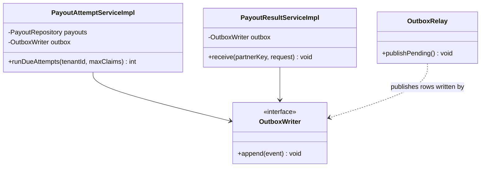
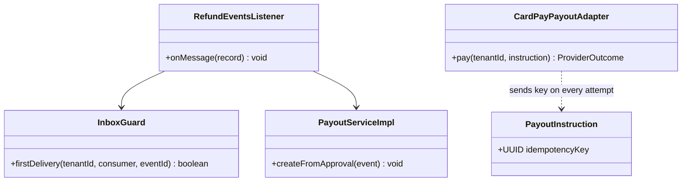
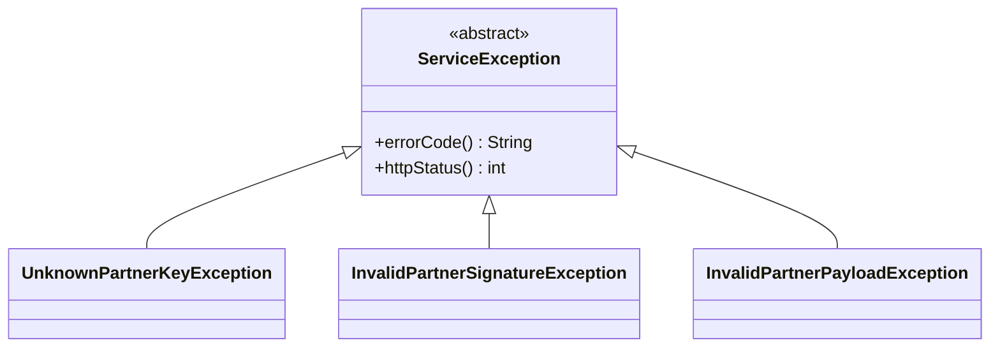
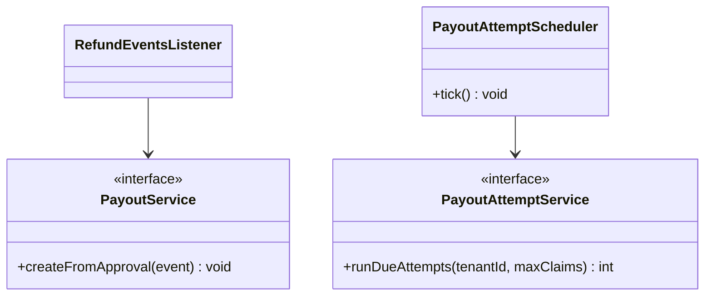
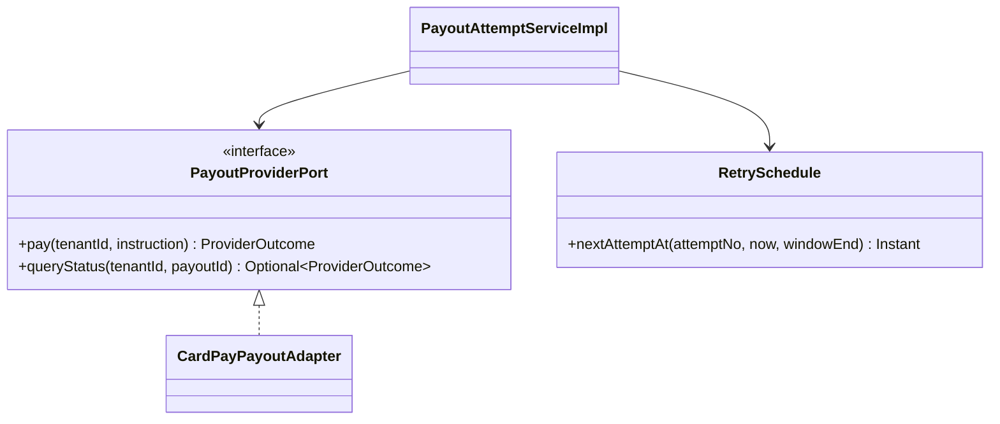
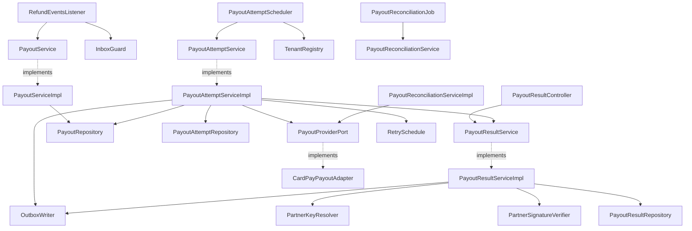
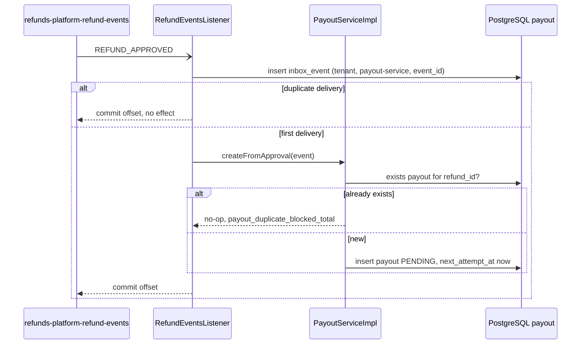
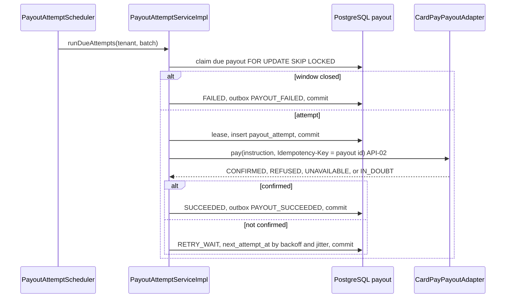
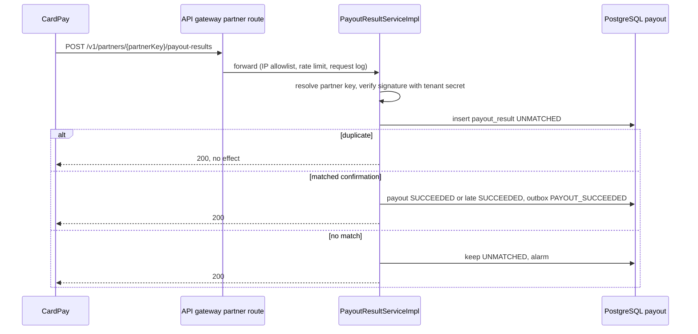

<!--
CHUNK: 04
TITLE: Per-Service Implementation - payout-service
PROJECT: Refunds Platform
VERSION: 1.0
DEPENDS_ON: 03, 09
PART OF: LLD - Refunds Platform
-->

# 7. Per-Service Implementation - payout-service

> **Bounded context:** payouts, [SDD §17.2](../../sdd-refunds-platform/13b-service-payout.md#172-payout-service); separate deployable `payout-service` with its own database `payout` (ADR-01, ADR-06).
>
> **Source code:** Not applicable (from-sdd, greenfield). Target: package `<base>.payout` in the `payout-service` repository, layout per [03 § 6.4](../03-architecture.md#64-architectural-style---as-operationalised).
>
> **Owns workflows:** no BRD use case (SDD §13). Realises REFUNDS/UC-04 step 6 (pay the approved amount), step 7 (payout confirmed), and E1 (retry, then report failure), plus REFUNDS/NFR-01 through ADR-10. Participates in SAGA-01 ([09 § 12.5](../09-cross-cutting.md#125-saga-pattern-cross-service-transactions)).

---

## 7.1 Responsibility

payout-service owns the `Payout` aggregate: exactly one payout per approved refund, its CardPay attempts, the CardPay results it receives, the idempotency key it sends (the payout id, never changed), and the retry schedule inside the ADR-10 retry window. It consumes `REFUND_APPROVED` from `refunds-platform-refund-events` and publishes `PAYOUT_SUCCEEDED` and `PAYOUT_FAILED` on `refunds-platform-payout-events`, which only refund-service consumes. It is the only caller of CardPay (API-02) and the only receiver of CardPay results (API-03, through the gateway partner route, ADR-11). It does not own refund requests or their status (refund-service), messages (notification-service), or card data (CardPay); it never calls refund-service.

---

## 7.2 Class & Interface Map

### Controllers

| Class | Endpoints | Notes |
|-------|-----------|-------|
| `PayoutResultController` | API-03: `POST /v1/partners/{partnerKey}/payout-results` (proposed, ADR-11 pattern) | No JWT; partner key resolved to the tenant before the signature check (ADR-11) |
| `RefundEventsListener` (Kafka) | topic `refunds-platform-refund-events`, group `payout-service` | Handles `REFUND_APPROVED` only; other event types ignored |
| `PayoutAttemptScheduler` (scheduled) | fixed delay, every replica | Claims due payouts per tenant with `FOR UPDATE SKIP LOCKED` |
| `PayoutReconciliationJob` (scheduled) | daily, per tenant | Compares SUCCEEDED payouts with CardPay's records (REFUNDS/NFR-01) |

> TODO: best-guess API-03 path `/v1/partners/{partnerKey}/payout-results`; the resource name, method, and even push versus polling are `TBD - external` (SDD API-03) - verify when the CardPay documentation arrives.

### Services (interfaces)

| Interface | Purpose | Implementations |
|-----------|---------|-----------------|
| `PayoutService` | Create the payout for an approved refund | `PayoutServiceImpl` |
| `PayoutAttemptService` | Claim due payouts, call CardPay, record outcomes, close the window | `PayoutAttemptServiceImpl` |
| `PayoutResultService` | Store, match, and apply API-03 results | `PayoutResultServiceImpl` |
| `PayoutReconciliationService` | Daily comparison with CardPay | `PayoutReconciliationServiceImpl` |
| `PayoutProviderPort` (outbound) | CardPay payout, status query, payout listing (API-02) | `CardPayPayoutAdapter` |
| `PartnerSignatureVerifier` (outbound) | Verify the CardPay signature with the tenant's secret | `CardPaySignatureVerifier` |
| `PartnerKeyResolver` (shared) | Partner key to `tenant_id` (ADR-11) | shared platform library |

### Service Implementations

| Class | Implements | Key methods |
|-------|------------|-------------|
| `PayoutServiceImpl` | `PayoutService` | `createFromApproval(...)` |
| `PayoutAttemptServiceImpl` | `PayoutAttemptService` | `runDueAttempts(...)`, private `claim(...)`, `record(...)` |
| `PayoutResultServiceImpl` | `PayoutResultService` | `receive(...)`, `rematchUnmatched(...)` |
| `PayoutReconciliationServiceImpl` | `PayoutReconciliationService` | `reconcile(...)` |
| `CardPayPayoutAdapter` | `PayoutProviderPort` | `pay(...)`, `queryStatus(...)`, `listPayouts(...)`; Resilience4j instance `cardPay` |
| `RetrySchedule` (domain policy) | - | `nextAttemptAt(attemptNo, now, windowEnd)` |

### Repositories

| Class | Entity | Notes |
|-------|--------|-------|
| `PayoutRepository` | `Payout` | `existsByRefundId`, `claimNextDue` (native `FOR UPDATE SKIP LOCKED`), `lockById`, `findByEchoedReference`, `findSucceededOn` |
| `PayoutAttemptRepository` | `PayoutAttempt` | Last attempt of a payout; open attempts |
| `PayoutResultRepository` | `PayoutResult` | Dedup by `dedup_key`; UNMATCHED rows by provider reference |
| `OutboxEventRepository`, `InboxEventRepository` | platform tables | Shared platform library |

### Domain Types (records)

| Type | Kind | Purpose |
|------|------|---------|
| `Payout` | entity (aggregate root) | `startAttempt`, `succeed`, `scheduleRetry`, `fail`, `confirmLate` with the guards of 08 § 11.1 |
| `PayoutAttempt` | entity | One CardPay call: attempt number, kind (`SEND`, `STATUS_QUERY`), outcome |
| `PayoutResult` | entity | One API-03 result, stored before acknowledgement |
| `PayoutStatus`, `AttemptOutcome`, `AttemptKind`, `ResultStatus` | enum | `PENDING`/`RETRY_WAIT`/`SUCCEEDED`/`FAILED`; `CONFIRMED`/`REFUSED`/`UNAVAILABLE`/`IN_DOUBT`; `SEND`/`STATUS_QUERY`; `MATCHED`/`UNMATCHED` |
| `PayoutInstruction` | record | `idempotencyKey` (payout id), `Money amount`, `originalPaymentRef`, `referenceNumber` |
| `ProviderOutcome` | record | `AttemptOutcome outcome`, `providerPayoutRef`, `providerCode` |
| `ProviderPayoutRecord` | record | One CardPay-side payout for reconciliation |
| `PartnerRequest` | record | Raw body bytes and headers of an API-03 call (shared platform type) |
| `ReconciliationReport` | record | Mismatches of one daily comparison: paid twice, ours-only, theirs-only |
| `RefundApprovedPayload`, `PayoutSucceededPayload`, `PayoutFailedPayload` | record | Fields per SDD §14.9.3, §14.9.6, §14.9.7 (not restated) |

### Method Signatures (key methods only)

```java
public interface PayoutService {
  void createFromApproval(EventEnvelope<RefundApprovedPayload> event);
}

public interface PayoutAttemptService {
  int runDueAttempts(UUID tenantId, int maxClaims);
}

public interface PayoutResultService {
  void receive(String partnerKey, PartnerRequest request);
  int rematchUnmatched(UUID tenantId, String providerPayoutRef);
}

public interface PayoutReconciliationService {
  ReconciliationReport reconcile(UUID tenantId, LocalDate businessDate);
}

public interface PayoutProviderPort {
  ProviderOutcome pay(UUID tenantId, PayoutInstruction instruction);
  Optional<ProviderOutcome> queryStatus(UUID tenantId, UUID payoutId);
  List<ProviderPayoutRecord> listPayouts(UUID tenantId, LocalDate businessDate);
}

public interface PartnerSignatureVerifier {
  void verify(UUID tenantId, PartnerRequest request);
}
```

> **Convention:** records are used for all DTOs (CLAUDE.md default). Constructor injection only; no `@Autowired` on fields.

> Confirm: class names follow CLAUDE.md conventions; verify with team (SDD §17.2 names only `PayoutProviderPort`).

> TODO: best guess: `queryStatus` and `listPayouts` exist on the port because SDD API-02 asks whether CardPay offers a status query and a payout report; both stay unimplemented stubs until the CardPay documentation confirms them - verify with CardPay.

---

## 7.3 Method-Level Pseudocode (non-trivial logic only)

> **Confidence:** High for the steps, which SDD §17.2 Business Logic and ADR-10 dictate; LLD additions carry their own flags.

### `PayoutServiceImpl.createFromApproval`

```text
(listener transaction; the inbox guard row is already inserted, 09 § 12.2)
1. p = event.payload; approvedAmount > 0, originalPaymentRef and referenceNumber present -> else InvalidEventException (DLQ)
2. payoutRepo.existsByRefundId(tenantId, event.aggregateId) -> payout_duplicate_blocked_total++ and return
3. insert Payout(id = idGen.next(), refundId = event.aggregateId, referenceNumber, originalPaymentRef,
     amount = approvedAmount, status = PENDING, nextAttemptAt = now, firstAttemptAt = null, attemptCount = 0, inDoubt = false)
   unique violation on uq_payout_refund (race with a parallel redelivery) -> rollback; the container redelivers and step 2 finds it
4. no CardPay call in this transaction (ADR-10)
```

### `PayoutAttemptServiceImpl.runDueAttempts`

```text
repeat up to maxClaims times:
  A. claim transaction (short, TransactionTemplate REQUIRED):
     p = claimNextDue(tenantId): status IN (PENDING, RETRY_WAIT) AND next_attempt_at <= now
         ORDER BY next_attempt_at LIMIT 1 FOR UPDATE SKIP LOCKED
     none -> stop
     windowEnd = p.firstAttemptAt + payoutRetryWindow                       (ADR-10)
     if p.firstAttemptAt != null and now >= windowEnd:
        p.fail(now); outbox PAYOUT_FAILED (payload per SDD §14.9.7: attempts, firstAttemptAt, lastProviderCode)
        commit; continue
     inDoubt = p.inDoubt or lastAttemptHasNoOutcome(p)                      (lease expired: counts payout_attempt_leases_expired_total)
     kind = inDoubt and statusQuerySupported ? STATUS_QUERY : SEND
     p.startAttempt(now, leaseUntil = now + cardPayCallTimeout + 60s)       (sets firstAttemptAt on the first attempt)
     insert PayoutAttempt(attemptNo = p.attemptCount, kind, attemptedAt = now, outcome = null)
     commit
  B. provider call, no transaction and no connection held:
     outcome = kind == SEND ? provider.pay(tenantId, PayoutInstruction(p.id, p.amount, p.originalPaymentRef, p.referenceNumber))
                            : provider.queryStatus(tenantId, p.id)
     timeout or lost response -> IN_DOUBT; open circuit or bulkhead full -> UNAVAILABLE (no call made)
  C. record transaction (REQUIRED):
     p = lockById(tenantId, p.id) FOR UPDATE; attempt.complete(outcome, providerCode, now)
     p.status == SUCCEEDED -> commit (an API-03 result confirmed it first)
     outcome CONFIRMED -> p.status == FAILED ? p.confirmLate(ref, now) : p.succeed(ref, now)
                          outbox PAYOUT_SUCCEEDED (payload per SDD §14.9.6); resultService.rematchUnmatched(tenantId, ref)
     otherwise         -> p.scheduleRetry(next = retrySchedule.nextAttemptAt(p.attemptCount, now, windowEnd),
                          inDoubt = (outcome == IN_DOUBT), lastProviderCode = providerCode)      (status RETRY_WAIT)
     commit
```

> TODO: best guess: when the ADR-10 window closes while the last attempt is in doubt and CardPay offers a status query, one final status query runs before `PAYOUT_FAILED` is written; without a status query the payout fails and a late API-03 confirmation or the daily reconciliation corrects it - verify with CardPay's API-02 capabilities.

> TODO: best guess: if the CardPay API-02 response is not final (the outcome arrives only through API-03), a confirmed acceptance sets `next_attempt_at` to a result-wait time instead of a retry, and the next attempt is a status query - verify when SDD API-02 is completed.

### `PayoutResultServiceImpl.receive` (API-03)

```text
1. tenantId = partnerKeyResolver.resolve(partnerKey, CARDPAY) -> unknown key -> 404 and security event
2. signatureVerifier.verify(tenantId, request) -> invalid -> 401 and security event (SDD §17.2 Error Handling)
3. result = parse(request.body) (fields TBD - external) -> unparseable -> 400
4. transaction (REQUIRED):
   a. insert PayoutResult(status = UNMATCHED, dedupKey, providerPayoutRef, echoedReference, outcome, receivedAt, rawBody)
      duplicate dedupKey -> commit and return (a duplicate result is a no-op)
   b. payout = match inside tenantId, in order: echoed payout id (the idempotency key), echoed referenceNumber,
      providerPayoutRef (SDD API-03 matching rule)
      no match -> stays UNMATCHED; gauge payout_results_unmatched; alert
   c. matched: result.match(payout.id)
      outcome CONFIRMED and payout not SUCCEEDED -> succeed or confirmLate (from PENDING, RETRY_WAIT, or FAILED); outbox PAYOUT_SUCCEEDED
      outcome REFUSED -> recorded only; the scheduler keeps retrying inside the window
5. 200 after commit (stored before acknowledged)
```

> Confirm: ADR-11 asks to refuse, as a security event, a result that names a payout of another tenant; matching runs only inside the partner key's tenant, so such a result surfaces as UNMATCHED with an alert rather than an explicit refusal (a cross-tenant lookup is forbidden in application code, SDD §11.2) - verify this reading with the architect.

### `PayoutReconciliationServiceImpl.reconcile` (daily)

```text
1. ours = payouts SUCCEEDED with succeeded_at inside the previous tenant-zone day
2. theirs = provider.listPayouts(tenantId, day)                  (TBD - external: CardPay report or query by date)
3. compare on providerPayoutRef and on the idempotency key: a key CardPay paid twice, ours-only, theirs-only
4. each mismatch -> payout_reconciliation_mismatches_total++, alert, WARN log with payout ids only
```

---

## 7.4 Design Patterns Applied

### Pattern: Outbox

> **Applied:** Outbox pattern (CLAUDE.md: "Outbox pattern is mandatory for any state change that must produce an event. No dual-writes to DB and Kafka.")
>
> **Rationale (this service):** `PAYOUT_SUCCEEDED` and `PAYOUT_FAILED` are the only way refund-service learns that money left or that the ADR-10 window closed. A payout marked SUCCEEDED without its event would leave the request APPROVED forever and the points untouched; an event for a rolled-back state change would mark a request PAID that was never paid (REFUNDS/NFR-01).

**Roles:**

| Role | Class / Component | Notes |
|------|-------------------|-------|
| Outbox table | `payout.outbox_event` | 05 § 8.2 |
| Outbox writer | `PayoutAttemptServiceImpl` (record and window-close transactions), `PayoutResultServiceImpl` (matched confirmation) | Same transaction as the payout update |
| Outbox publisher | `OutboxRelay` (shared), one active per `payout` database | 09 § 12.4 |

**Class diagram:**



**Pseudocode skeleton:**

```text
within the record transaction:
  payout.succeed(ref, now)
  outbox.append(PAYOUT_SUCCEEDED, aggregateType = "Payout", aggregateId = payout.id,
                aggregateVersion = payout.version, topic = "refunds-platform-payout-events",
                payload = PayoutSucceededPayload(refundId, paidAmount = payout.amount, providerPayoutRef, succeededAt))
```

### Pattern: Idempotency (provider calls, consumer, and partner results)

> **Applied:** Idempotency (CLAUDE.md: "Idempotency keys on all write endpoints touching money/wallet/notifications or external providers." and "Idempotency on every consumer and every write endpoint. Assume at-least-once delivery everywhere.")
>
> **Rationale (this service):** this is the money edge: a redelivered `REFUND_APPROVED`, a timed-out CardPay call, a restarted pod, and a redelivered API-03 result must each leave exactly one payout effect (ADR-10, REFUNDS/NFR-01). Four mechanisms cover the four paths.

**Roles:**

| Role | Class / Component | Notes |
|------|-------------------|-------|
| Consumer dedup | `InboxGuard` on (`tenant_id`, `payout-service`, `event_id`) | First statement of the listener transaction |
| Business dedup | `UNIQUE (tenant_id, refund_id)` on `payout` | One payout per refund, also for replays |
| Provider idempotency key | `PayoutInstruction.idempotencyKey` = payout id, same on every attempt | Header name `TBD - external` (SDD API-02) |
| Result dedup | `UNIQUE (tenant_id, dedup_key)` on `payout_result` | A duplicate result is a no-op |

**Class diagram:**



**Pseudocode skeleton:**

```text
CardPayPayoutAdapter.pay(tenantId, instruction):
  headers[<CardPay idempotency header, TBD>] = instruction.idempotencyKey     (never regenerated)
  send API-02; never retry in-process: the scheduler is the retry mechanism
```

### Pattern: RFC 9457 Problem Details error model

> **Applied:** RFC 9457 error model (CLAUDE.md: "Global @RestControllerAdvice, Problem Details (RFC 9457). Business exceptions extend a base ServiceException with error code.")
>
> **Rationale (this service):** API-03 is this service's only REST surface; our-side refusals (unknown partner key, bad signature, malformed body) are rendered by the shared advice so logs and CardPay support see one error shape.

**Roles:**

| Role | Class / Component |
|------|-------------------|
| Base exception | `ServiceException` (shared) |
| Subclasses | `UnknownPartnerKeyException` (404 `NOT_FOUND`), `InvalidPartnerSignatureException` (401 `UNAUTHENTICATED`), `InvalidPartnerPayloadException` (400 `VALIDATION_FAILED`) |
| Translator | `ProblemDetailsAdvice` (shared) |

**Class diagram:**



**Pseudocode skeleton:**

```text
PayoutResultController.receive(partnerKey, rawBody, headers):
  resultService.receive(partnerKey, PartnerRequest(rawBody, headers))  -> 200 empty body
  ServiceException -> ProblemDetailsAdvice (09 § 12.6); security events logged at WARN with tenant_ref only
```

> Confirm: SDD §17.2 says the API-03 error envelope follows the CardPay contract once supplied; Problem Details is applied until then and may have to change to CardPay's format - verify with the CardPay documentation.

### Pattern: Saga (choreography participant, SAGA-01 steps 2 and 3)

> **Applied:** Saga, choreography (CLAUDE.md: "Sagas (choreography by default, orchestration when the flow is complex or needs central visibility) for cross-service business transactions. No distributed 2PC.")
>
> **Rationale (this service):** payout-service reacts to `REFUND_APPROVED` and answers with a payout fact; it never calls refund-service, so a CardPay outage never blocks the branch manager's decision (ADR-05, ADR-10). There is no compensation: a payout that cannot be made inside the window is reported as `PAYOUT_FAILED`, and money is never reversed by the platform.

**Roles:**

| Role | Class / Component |
|------|-------------------|
| Step 2 (create payout) | `RefundEventsListener` -> `PayoutServiceImpl.createFromApproval` |
| Step 3 (pay and report) | `PayoutAttemptScheduler` -> `PayoutAttemptServiceImpl`; `PayoutResultController` -> `PayoutResultServiceImpl` |
| Outcome facts | `PAYOUT_SUCCEEDED`, `PAYOUT_FAILED` |

**Class diagram:**



**Pseudocode skeleton:**

```text
PayoutAttemptScheduler.tick():            (fixed delay; every replica; SKIP LOCKED keeps replicas apart)
  for tenant in tenantRegistry.activeTenants():
    attemptService.runDueAttempts(tenant.id, maxClaims = payout.scheduler.batch-size)
```

### Pattern: Resilience4j on CardPay

> **Applied:** Resilience defaults (CLAUDE.md: "Resilience defaults: timeouts, retries with exponential backoff and jitter, circuit breakers (Resilience4j), bulkheads for downstream provider calls (e.g., eSIM, payment, SMS).")
>
> **Rationale (this service):** CardPay is a hard dependency (REFUNDS 02 Dependencies). A time limiter bounds every call so the attempt lease is meaningful; a circuit breaker stops hammering CardPay during an outage and turns the wait into scheduled retries; a bulkhead caps concurrent calls so a slow CardPay cannot starve the scheduler threads. Retries with exponential backoff and jitter are the persisted schedule of ADR-10 (`RetrySchedule`), not an in-memory Resilience4j retry, because an in-memory retry would re-send inside one lease and die with the pod.

**Roles:**

| Role | Class / Component |
|------|-------------------|
| Guarded call | `CardPayPayoutAdapter.pay`, `queryStatus`, `listPayouts` |
| Policies | Resilience4j instance `cardPay`: time limiter, circuit breaker, bulkhead (values 09 § 12.3) |
| Retry with backoff and jitter | `RetrySchedule.nextAttemptAt`, capped at the window end |

**Class diagram:**



**Pseudocode skeleton:**

```text
@TimeLimiter(name = "cardPay") @CircuitBreaker(name = "cardPay") @Bulkhead(name = "cardPay")
ProviderOutcome pay(tenantId, instruction): credentials per tenant; map CardPay codes to CONFIRMED | REFUSED | UNAVAILABLE | IN_DOUBT
RetrySchedule.nextAttemptAt(n, now, windowEnd) = min(now + min(base * 2^(n-1), cap) * random(0.5 .. 1.5), windowEnd)
```

**Not applied (conditions not met):** Strategy (one provider, one payout operation), Factory Method, Mediator, Chain of Responsibility.

---

## 7.5 Dependency Injection Graph



Every implementation also receives `Clock`, `IdGenerator`, and `TransactionTemplate` by constructor.

---

## 7.6 Transaction Boundaries

| Method | Propagation | Isolation | Rollback rules |
|--------|-------------|-----------|----------------|
| `PayoutServiceImpl.createFromApproval` | `REQUIRED` (listener transaction, inbox guard first) | `READ_COMMITTED` | Rollback on any exception; `InvalidEventException` goes to `payout-service.dlq` without retry |
| `PayoutAttemptServiceImpl` claim step | `REQUIRED` (`TransactionTemplate`), one payout per transaction | `READ_COMMITTED` + `FOR UPDATE SKIP LOCKED` | Rollback releases the claim |
| CardPay call | none (no transaction, no connection held) | - | - |
| `PayoutAttemptServiceImpl` record step | `REQUIRED` (`TransactionTemplate`) | `READ_COMMITTED` + `FOR UPDATE` + `@Version` | Rollback leaves the lease; it expires and the next attempt runs in doubt |
| `PayoutResultServiceImpl.receive` | `REQUIRED` | `READ_COMMITTED` + `FOR UPDATE` on the matched payout | Rollback -> 500, CardPay redelivers |
| `PayoutReconciliationServiceImpl.reconcile` | `REQUIRED`, read-only | `READ_COMMITTED` | Not applicable |

> **Convention:** outbox row insert lives inside the same transaction as the aggregate write. No `REQUIRES_NEW` for outbox writes.

> Confirm: transaction propagation default applied; verify per method.

---

## 7.7 Error Handling

| Exception | RFC 9457 type | HTTP Status | When thrown | Caller action |
|-----------|---------------|-------------|-------------|---------------|
| `UnknownPartnerKeyException` | `{problemBase}/not-found` | 404 | API-03 partner key unknown (security event) | CardPay support checks the registered key |
| `InvalidPartnerSignatureException` | `{problemBase}/unauthenticated` | 401 | API-03 signature invalid (security event) | CardPay fixes the signature; no retry of the same body |
| `InvalidPartnerPayloadException` | `{problemBase}/validation-failed` | 400 | API-03 body unparseable | CardPay fixes the body |
| Persistence failure | `{problemBase}/internal-error` | 500 | Result not stored | CardPay redelivers (provider-driven, TBD) |
| `InvalidEventException` (async) | not applicable | - | Malformed `REFUND_APPROVED` | `payout-service.dlq` and alarm |
| Provider outcome REFUSED / UNAVAILABLE / IN_DOUBT | not applicable | - | API-02 attempt | Scheduled retry with the same key inside the window |

> **Convention:** all exceptions extend `ServiceException`; envelope in 09 § 12.6. A timeout inside the window is never FAILED (SDD §17.2 Developer Notes).

---

## 7.8 Use-Case Workflows

### REFUNDS/UC-04 step 6: Create a payout on `REFUND_APPROVED`

**Trigger:** Kafka `REFUND_APPROVED` on `refunds-platform-refund-events`, group `payout-service`.

**Pre-conditions:** the event passes the inbox guard; payload fields of SDD §14.9.3 present.

**Post-conditions:** one `payout` row, PENDING, due now; no CardPay call yet.

**Control flow:**

```text
1. Listener deserialises the envelope; event_type != REFUND_APPROVED -> ignore
2. Transaction: inbox guard -> createFromApproval (7.3) -> commit -> offset committed
3. The next scheduler tick makes the first attempt from committed state (ADR-10)
```

**Sequence diagram:**



**Idempotency points:** inbox (`payout-service`, `event_id`); unique (`tenant_id`, `refund_id`).

**Outbox emission points:** none in this step.

**Retry / timeout policy:** listener container retries with backoff, then `payout-service.dlq` (07 § 10.4).

**Error handling:** malformed payload -> DLQ, alarm; database failure -> redelivery.

### REFUNDS/UC-04 steps 6-7 and E1: Attempt cycle

**Trigger:** `PayoutAttemptScheduler` tick (fixed delay, 10 § 13.1).

**Pre-conditions:** a payout PENDING or RETRY_WAIT with `next_attempt_at <= now`.

**Post-conditions:** the attempt is recorded; the payout is SUCCEEDED with `PAYOUT_SUCCEEDED`, RETRY_WAIT with its next time, or FAILED with `PAYOUT_FAILED` once the ADR-10 window closed.

**Control flow:** `runDueAttempts` (7.3): claim under a lease, call CardPay without a transaction, record the outcome.

**Sequence diagram:**



**Idempotency points:** the payout id as CardPay idempotency key on every attempt; in-doubt re-attempts reuse it or query status.

**Outbox emission points:** `PAYOUT_SUCCEEDED` (record step), `PAYOUT_FAILED` (window close).

**Retry / timeout policy:** time limiter per call; persisted backoff with jitter capped at the window end; circuit breaker and bulkhead (09 § 12.3); lease = call timeout + 60 s.

**Error handling:** every provider failure is an outcome, never an exception out of the scheduler; a crash leaves a lease that expires into an in-doubt re-attempt.

### REFUNDS/UC-04 step 7 and E1: Receive a payout result (API-03), late confirmation

**Trigger:** REST call from CardPay on the partner route (API-03, `TBD - external`).

**Pre-conditions:** partner key registered for the tenant; valid signature.

**Post-conditions:** the result is stored before the 2xx; a matched confirmation moves the payout to SUCCEEDED (also from FAILED) with `PAYOUT_SUCCEEDED`.

**Control flow:** `receive` (7.3).

**Sequence diagram:**



**Idempotency points:** `dedup_key` on `payout_result`; applying a confirmation to a SUCCEEDED payout is a no-op.

**Outbox emission points:** `PAYOUT_SUCCEEDED` on a matched confirmation.

**Retry / timeout policy:** provider-driven redelivery (`TBD - external`); UNMATCHED rows re-match whenever an API-02 response records a provider reference.

**Error handling:** 404 unknown key, 401 bad signature, 400 bad body, 500 on storage failure (7.7).

> TODO: best guess: `dedup_key` is the CardPay result id if API-03 carries one, else a SHA-256 of the verified raw body - verify when SDD API-03 is completed.

### REFUNDS/NFR-01: Daily provider reconciliation

**Trigger:** `PayoutReconciliationJob`, daily per tenant (10 § 13.1). **Pre-conditions:** CardPay offers a payout report or a query by date (`TBD - external`). **Post-conditions:** mismatch metric and alert; no state change. **Control flow:** `reconcile` (7.3). One call and one comparison: no sequence diagram. **Idempotency / Outbox:** not applicable. **Retry / timeout policy:** instance `cardPay`; a failed run alerts and runs again the next day. **Error handling:** CardPay unavailable -> job marked failed with an alert.

### Cross-service Saga (orchestrator role)

Not applicable for this service: SAGA-01 is choreographed (ADR-05); see [09 § 12.5](../09-cross-cutting.md#125-saga-pattern-cross-service-transactions). The payout state machine is in [08 § 11.1](../08-state-and-rules.md#111-aggregate-state-machines).

<!-- MASTER: lld-master.md | PREV: 03-architecture.md | NEXT: 05-data-model.md -->
