<!--
CHUNK: 04
TITLE: Per-Service Implementation - refund-service
PROJECT: Refunds Platform
VERSION: 1.0
DEPENDS_ON: 03, 09
PART OF: LLD - Refunds Platform
-->

# 7. Per-Service Implementation - refund-service

> **Bounded context:** refund requests, [SDD §17.1](../../sdd-refunds-platform/13a-service-refund.md#171-refund-service); module `refund` of the core deployable `refunds-platform-core` (ADR-01).
>
> **Source code:** Not applicable (from-sdd, greenfield). Target: package `<base>.refund` in `refunds-platform-core`, layout per [03 § 6.4](../03-architecture.md#64-architectural-style---as-operationalised).
>
> **Owns workflows:** REFUNDS/UC-01, REFUNDS/UC-02, REFUNDS/UC-03, REFUNDS/UC-04 (REFUNDS/UC-05 is merged into UC-04 in its BRD); the daily branch refund report; the payout watchdog. Participates in SAGA-01 ([09 § 12.5](../09-cross-cutting.md#125-saga-pattern-cross-service-transactions)).

---

## 7.1 Responsibility

refund-service owns the `RefundRequest` aggregate (its items and active item claims, its status history, the branch decision, and the payout status it learns from payout-service), the per-tenant reference numbers, and the data behind the daily branch refund report. It publishes the six refund facts on `refunds-platform-refund-events` (`REFUND_SUBMITTED`, `REFUND_CANCELLED`, `REFUND_APPROVED`, `REFUND_REJECTED`, `REFUND_PAID`, `REFUND_PAYOUT_FAILED`) and consumes the two payout facts (`PAYOUT_SUCCEEDED`, `PAYOUT_FAILED`) from `refunds-platform-payout-events`, re-publishing them as refund facts so no other consumer ever reads the payout topic. It calls POS Records (API-01) through `ReceiptLookupPort` for every amount it stores. It does not own payouts or CardPay attempts (payout-service), messages (notification-service), points (loyalty-service), receipts (POS Records), or identities (Keycloak).

---

## 7.2 Class & Interface Map

> **Convention:** list the load-bearing classes only. Records for all DTOs; constructor injection only.

### Controllers

| Class | Endpoints | Notes |
|-------|-----------|-------|
| `ReceiptController` | `GET /v1/receipts/{receiptNumber}/refundable-items` | `refund.receipt.read`; the gateway limits this route to 10 lookups per customer per rolling hour (SDD §17.1 Constraints) |
| `RefundRequestController` | `POST /v1/refund-requests`, `GET /v1/refund-requests`, `GET /v1/refund-requests/{refundId}`, `POST /v1/refund-requests/{refundId}/cancellation` | `Idempotency-Key` on both POSTs (`@IdempotentOperation`); detail accepts `refund.request.read-own` or `refund.request.read-branch` |
| `RefundDecisionController` | `POST /v1/refund-requests/{refundId}/decision` | `refund.request.decide`; `Idempotency-Key` required |
| `BranchRefundController` | `GET /v1/branches/{branchId}/refund-requests`, `GET /v1/branches/{branchId}/refund-report` | `branchId` must equal the `branch_id` claim, else 403 |
| `PayoutEventsListener` (Kafka) | topic `refunds-platform-payout-events`, group `refund-service` | Handles `PAYOUT_SUCCEEDED`, `PAYOUT_FAILED`; other types ignored |
| `PayoutWatchdogJob` (scheduled) | daily, per tenant | REFUNDS/NFR-01 missing-payout check |

### Services (interfaces)

| Interface | Purpose | Implementations |
|-----------|---------|-----------------|
| `ReceiptService` | Refundable items of a receipt (UC-01 steps 1-2) | `ReceiptServiceImpl` |
| `RefundRequestService` | Submit and cancel (UC-01 steps 3-6, UC-03) | `RefundRequestServiceImpl` |
| `RefundDecisionService` | Approve in full or in part, reject (UC-04 steps 3-6, A1, A2) | `RefundDecisionServiceImpl` |
| `RefundQueryService` | Own list, detail, branch queue (UC-02, UC-04 steps 1-2) | `RefundQueryServiceImpl` |
| `PayoutOutcomeService` | Apply payout facts (UC-04 step 7, E1) | `PayoutOutcomeServiceImpl` |
| `BranchReportService` | Daily branch refund report (REFUNDS 09) | `BranchReportServiceImpl` |
| `ReceiptLookupPort` (outbound) | POS receipt lookup, API-01 | `PosRecordsReceiptAdapter` |
| `ReferenceNumberGenerator` (outbound) | Next customer-facing reference number | `SequenceReferenceNumberGenerator` |

### Service Implementations

| Class | Implements | Key methods |
|-------|------------|-------------|
| `ReceiptServiceImpl` | `ReceiptService` | `getRefundableItems(...)` |
| `RefundRequestServiceImpl` | `RefundRequestService` | `submit(...)`, `cancel(...)` |
| `RefundDecisionServiceImpl` | `RefundDecisionService` | `decide(...)` |
| `RefundQueryServiceImpl` | `RefundQueryService` | `listOwn(...)`, `getDetail(...)`, `listBranchQueue(...)` |
| `PayoutOutcomeServiceImpl` | `PayoutOutcomeService` | `applyPayoutSucceeded(...)`, `applyPayoutFailed(...)` |
| `BranchReportServiceImpl` | `BranchReportService` | `dailyReport(...)` |
| `PosRecordsReceiptAdapter` | `ReceiptLookupPort` | `lookup(...)`; Resilience4j instance `posRecords` |

### Repositories

| Class | Entity | Notes |
|-------|--------|-------|
| `RefundRequestRepository` | `RefundRequest` | Spring Data JPA; key `TenantScopedId`; `findByIdAndCustomerId`, `findOwnPage`, `findBranchQueuePage`, `findOverduePayouts` |
| `RefundRequestItemRepository` | `RefundRequestItem` | `findActiveClaimLineIds(tenantId, branchId, receiptNumber)`, `releaseClaims(tenantId, refundRequestId)` |
| `RefundStatusHistoryRepository` | `RefundStatusHistory` | History by request, ordered by `changed_at` |
| `BranchReportRepository` | read projection | Native aggregate queries for the daily report |
| `OutboxEventRepository`, `InboxEventRepository`, `IdempotencyRecordRepository` | platform tables | From the shared platform library (09) |

### Domain Types (records)

| Type | Kind | Purpose |
|------|------|---------|
| `RefundRequest` | entity (aggregate root) | Status and payout-status transitions (`cancel`, `approve`, `reject`, `markPaid`, `markPayoutFailed`) with the guards of 08 § 11.1 |
| `RefundRequestItem` | entity | One claimed receipt line; `claimActive` released on CANCELLED and REJECTED |
| `RefundStatusHistory` | entity | One row per status change (UC-02 step 4) |
| `RefundStatus`, `PayoutStatus`, `DecisionType` | enum | `SUBMITTED`/`APPROVED`/`REJECTED`/`PAID`/`CANCELLED`; `NONE`/`PENDING`/`FAILED`/`SUCCEEDED`; `APPROVE`/`REJECT` |
| `Money` | record (shared value object) | `BigDecimal amount` (scale 4), `String currency` (ISO-4217) |
| `Receipt`, `ReceiptLine` | record | `ReceiptLookupPort` result: branch, purchase date, currency, original payment reference, lines (A-6) |
| `CreateRefundRequestDto`, `RefundDecisionDto` | record | Inbound bodies; OpenAPI schemas `CreateRefundRequest`, `RefundDecision` (SDD §17.1) |
| `RefundableItemsResponse`, `RefundRequestResponse`, `RefundRequestPageResponse`, `RefundRequestDetailResponse`, `BranchRefundReportResponse` | record | Outbound bodies; OpenAPI schemas `RefundableItems`, `RefundRequest`, `RefundRequestPage`, `RefundRequestDetail`, `BranchRefundReport` |
| `RefundSubmittedPayload` ... `RefundPayoutFailedPayload`, `PayoutSucceededPayload`, `PayoutFailedPayload` | record | Event payloads; fields are the SDD §14.9 contracts, not restated (07 § 10.2) |
| `CallerContext`, `IdempotencyScope`, `TenantScopedId`, `EventEnvelope<P>` | record | Shared platform types (09) |

### Method Signatures (key methods only)

```java
public interface ReceiptService {
  RefundableItemsResponse getRefundableItems(CallerContext caller, String receiptNumber);
}

public interface RefundRequestService {
  RefundRequestResponse submit(CallerContext caller, CreateRefundRequestDto body, IdempotencyScope scope);
  RefundRequestResponse cancel(CallerContext caller, UUID refundId, IdempotencyScope scope);
}

public interface RefundDecisionService {
  RefundRequestResponse decide(CallerContext caller, UUID refundId, RefundDecisionDto body, IdempotencyScope scope);
}

public interface RefundQueryService {
  RefundRequestPageResponse listOwn(CallerContext caller, PageCursor cursor, int limit);
  RefundRequestDetailResponse getDetail(CallerContext caller, UUID refundId);
  RefundRequestPageResponse listBranchQueue(CallerContext caller, String branchId, PageCursor cursor, int limit);
}

public interface PayoutOutcomeService {
  void applyPayoutSucceeded(EventEnvelope<PayoutSucceededPayload> event);
  void applyPayoutFailed(EventEnvelope<PayoutFailedPayload> event);
}

public interface BranchReportService {
  BranchRefundReportResponse dailyReport(CallerContext caller, String branchId, LocalDate businessDate);
}

public interface ReceiptLookupPort {
  Optional<Receipt> lookup(UUID tenantId, String receiptNumber);
}

public interface ReferenceNumberGenerator {
  String next(UUID tenantId);
}
```

> **Convention:** records are used for all DTOs (CLAUDE.md default). Constructor injection only; no `@Autowired` on fields.

> Confirm: class names follow CLAUDE.md conventions; verify with team (SDD §17.1 names only `ReceiptLookupPort` and the OpenAPI schemas).

---

## 7.3 Method-Level Pseudocode (non-trivial logic only)

> **Confidence:** High for the steps, which SDD §17.1 Business Logic dictates; LLD additions (transaction split, lock handling, claim-violation mapping) carry their own flags below.

### `ReceiptServiceImpl.getRefundableItems`

```text
1. receipt = receiptLookup.lookup(caller.tenantId, receiptNumber)
     - empty -> throw ReceiptNotFoundException (404 RECEIPT_NOT_FOUND); count refund_receipt_not_found for the alert of 10 § 13.7
     - circuit open, timeout, or 5xx after retries -> throw ReceiptLookupUnavailableException (503 RECEIPT_LOOKUP_UNAVAILABLE)
2. today = tenantSettings.today(caller.tenantId)                       (tenant IANA zone, SDD §6)
   if receipt.purchaseDate < today - 30 days -> throw RefundWindowPassedException (422 REFUND_WINDOW_PASSED)
3. claimed = itemRepo.findActiveClaimLineIds(tenantId, receipt.branchId, receiptNumber)      (read-only transaction)
4. return RefundableItemsResponse(branchName, purchaseDate,
     lines -> (lineId, description, quantity, Money(amount, receipt.currency), refundable = lineId not in claimed))
   never copy originalPaymentRef or member data into the response (SDD §17.1, R-09)
```

### `RefundRequestServiceImpl.submit`

```text
1. Validate body: lineIds non-empty and distinct, reason 1..500 chars -> else 400 VALIDATION_FAILED
2. receipt = lookup + window check exactly as getRefundableItems steps 1-2 (outside any DB transaction, so no
   connection is held during the POS call)
3. lines = receipt.lines filtered by lineIds; any unknown lineId -> 400 VALIDATION_FAILED (errors[].field = lineIds)
4. requested = sum(lines.amount) in receipt.currency (A-8: one currency per receipt)
5. transactionTemplate.execute (REQUIRED, READ_COMMITTED):
   a. request = RefundRequest.submit(id = idGen.next(), tenantId, referenceNumber = refGen.next(tenantId),
        customerId = caller.subject, branchId = receipt.branchId, receiptNumber, purchaseDate,
        originalPaymentRef, currency, requested, reason, submittedAt = now)
   b. items = lines -> RefundRequestItem(claimActive = true, branchId, receiptNumber, receiptLineId, description, quantity, amount)
   c. history.append(from = null, to = SUBMITTED, changedBy = caller.subject)
   d. repo.saveAndFlush(request with items)
        unique violation on uq_refund_item_active_claim -> throw ItemAlreadyRefundedException (409 ITEM_ALREADY_REFUNDED)
   e. outbox.append(REFUND_SUBMITTED, aggregate = request, payload per SDD §14.9.1)
   f. response = RefundRequestResponse.from(request)
   g. idempotency.complete(scope, 201, response)
6. return response
```

> Confirm: the POS re-read runs before the transaction and the write runs in a `TransactionTemplate` (self-invocation would bypass `@Transactional`); verify the split with the team.

### `RefundRequestServiceImpl.cancel`

```text
1. transactionTemplate.execute (REQUIRED):
   a. request = repo.findByIdAndCustomerId(TenantScopedId(tenantId, refundId), caller.subject)
        absent -> throw RefundNotFoundException (404 NOT_FOUND; existence not revealed)
   b. request.cancel(now)            (guard: status == SUBMITTED else RefundAlreadyDecidedException 409)
   c. itemRepo.releaseClaims(tenantId, refundId); history.append(SUBMITTED -> CANCELLED)
   d. outbox.append(REFUND_CANCELLED, payload per SDD §14.9.2)
   e. idempotency.complete(scope, 200, response)
2. OptimisticLockException on flush (a decision committed first) -> re-read status; decided -> 409 REFUND_ALREADY_DECIDED
```

### `RefundDecisionServiceImpl.decide`

```text
1. transactionTemplate.execute (REQUIRED):
   a. request = repo.findById(TenantScopedId(tenantId, refundId)) -> absent -> 404 NOT_FOUND
   b. request.branchId != caller.branchId -> throw BranchAccessDeniedException (403 FORBIDDEN, UC-04 BR-1)
      request.customerId == caller.subject -> throw BranchAccessDeniedException (403 FORBIDDEN, no self-decision)
   c. request.status != SUBMITTED -> 409 REFUND_ALREADY_DECIDED              (SDD Figure 16 order: auth, state, rules)
   d. switch body.decision:
      REJECT : reason blank -> 422 REASON_REQUIRED
               request.reject(reason, decidedBy = caller.subject, now); itemRepo.releaseClaims(...)
               outbox.append(REFUND_REJECTED, payload per SDD §14.9.4)
      APPROVE: amount = body.approvedAmount; amount.currency != request.currency -> 400 VALIDATION_FAILED
               amount <= 0 or amount > requested -> 422 INVALID_PARTIAL_AMOUNT
               partial = amount < requested; partial and reason blank -> 422 REASON_REQUIRED
               request.approve(amount, partial ? reason : null, caller.subject, now)   (payoutStatus = PENDING)
               outbox.append(REFUND_APPROVED, payload per SDD §14.9.3, incl. originalPaymentRef and partial)
   e. history.append(SUBMITTED -> APPROVED | REJECTED, reason)
   f. idempotency.complete(scope, 200, response)
2. OptimisticLockException (customer cancelled first) -> 409 REFUND_ALREADY_DECIDED
```

> TODO: best guess: a branch manager may not decide a request filed from their own customer account (step 1b, 403); segregation of duties is not ruled in SDD §16 or the BRD - verify with the REFUNDS owner; if allowed, drop the check.

### `PayoutOutcomeServiceImpl.applyPayoutSucceeded`

```text
(listener transaction; inbox guard already inserted, 09 § 12.2)
1. request = repo.findById(TenantScopedId(tenantId, payload.refundId)) -> absent -> throw UnknownAggregateException (DLQ)
2. event.aggregateVersion <= request.lastPayoutEventVersion -> return (stale redelivery, count and skip)
3. request.status == PAID -> return (idempotent no-op)
   request.status != APPROVED -> throw InvalidTransitionException (DLQ, SDD §17.1)
4. request.markPaid(paidAmount = payload.paidAmount, paidAt = payload.succeededAt)   (payoutStatus = SUCCEEDED)
   payload.paidAmount != request.approvedAmount -> still PAID, raise refund_paid_amount_mismatch alert
5. history.append(APPROVED -> PAID); request.lastPayoutEventVersion = event.aggregateVersion
6. outbox.append(REFUND_PAID, payload per SDD §14.9.5, causationId = event.eventId)
7. after commit: record refund_time_to_paid_seconds(paidAt - submittedAt)
```

> TODO: best guess: `paid_at` takes the provider-confirmed `succeededAt`, and a paid amount that differs from the approved amount is accepted with an alert; neither rule is in SDD §17.1 - verify with the REFUNDS owner.

### `PayoutOutcomeServiceImpl.applyPayoutFailed`

```text
1. request = repo.findById(...) -> absent -> DLQ
2. stale version -> skip (as above)
3. request.status == PAID -> return (ignored, SDD §17.1)
   request.status != APPROVED -> DLQ
4. request.markPayoutFailed(payoutFailedAt = payload.failedAt)          (status stays APPROVED, payoutStatus = FAILED)
5. outbox.append(REFUND_PAYOUT_FAILED, payload per SDD §14.9.8: referenceNumber, branchId, approvedAmount,
   attempts and failedAt from the event; causationId = event.eventId)
6. no status-history row: the customer-visible status does not change
```

### `PayoutWatchdogJob.run` (daily)

```text
for tenant in tenantRegistry.activeTenants():
  overdue = repo.findOverduePayouts(tenant, status = APPROVED, payoutStatus = PENDING,
                                    decidedBefore = now - payoutRetryWindow - 1h)     (window from ADR-10)
  gauge refund_payout_outcome_overdue{tenant_ref} = overdue.size
  log WARN event=payout_outcome_overdue refund_id=... (no customer data)
```

---

## 7.4 Design Patterns Applied

### Pattern: Outbox

> **Applied:** Outbox pattern (CLAUDE.md: "Outbox pattern is mandatory for any state change that must produce an event. No dual-writes to DB and Kafka.")
>
> **Rationale (this service):** every state change of `RefundRequest` produces one of six refund facts that drive payouts (payout-service), customer and branch-manager messages (notification-service), and points take-backs (loyalty-service). A lost `REFUND_APPROVED` would leave a refund unpaid (REFUNDS/NFR-01); a dual-write would publish facts for rolled-back decisions. The outbox row commits with the aggregate, and the relay publishes it after commit.

**Roles:**

| Role | Class / Component | Notes |
|------|-------------------|-------|
| Outbox table | `refund.outbox_event` | Columns and index in 05 § 8.2 |
| Outbox writer | `OutboxWriter.append` called from `submit`, `cancel`, `decide`, `applyPayoutSucceeded`, `applyPayoutFailed` | Joins the caller's transaction (`MANDATORY`) |
| Outbox publisher | `OutboxRelay` (shared platform) | One active relay per core database; only schema `refund` has an outbox, because loyalty-service publishes nothing |

**Class diagram:**

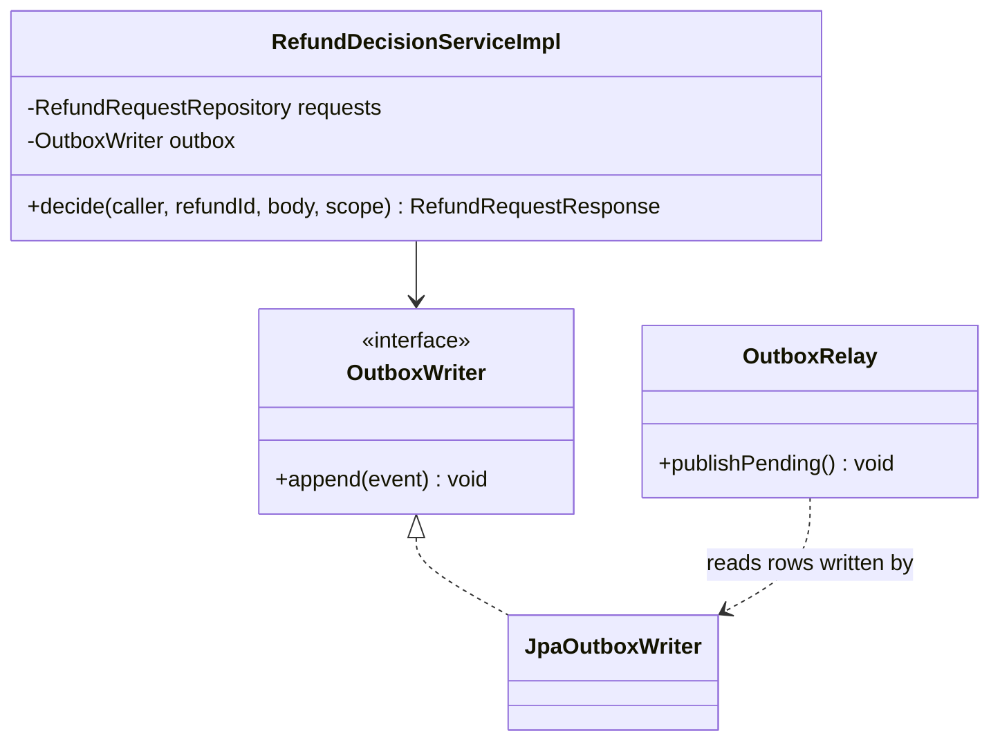

**Pseudocode skeleton:**

```text
@Transactional(propagation = MANDATORY)
void append(OutboxEvent e):
  row = outbox_event(tenant_id = e.tenantId, id = idGen.next(), aggregate_type = "RefundRequest",
        aggregate_id = e.refundId, aggregate_version = request.version, event_type = e.type,
        schema_version = registryVersion(e.type), topic = "refunds-platform-refund-events",
        occurred_at = now, correlation_id = MDC.correlation_id, causation_id = e.causationId,
        traceparent = currentSpan.traceparent, payload = json(e.payload))
  insert row                                     (relay mechanics: 09 § 12.4)
```

### Pattern: Idempotency (write endpoints and consumer)

> **Applied:** Idempotency (CLAUDE.md: "Idempotency keys on all write endpoints touching money/wallet/notifications or external providers." and "Idempotency on every consumer and every write endpoint. Assume at-least-once delivery everywhere.")
>
> **Rationale (this service):** submit, cancel, and decide each trigger customer messages, and decide triggers a payout; a double click or a gateway retry must replay the first response rather than surface a false `ITEM_ALREADY_REFUNDED` or `REFUND_ALREADY_DECIDED` (SDD §11.1). Payout facts arrive at least once, so each is applied once through the inbox.

**Roles:**

| Role | Class / Component | Notes |
|------|-------------------|-------|
| Idempotency record table | `refund.idempotency_record` | SDD §11.1 columns; 05 § 8.2 |
| Idempotency check | `IdempotencyInterceptor` on `@IdempotentOperation` handlers | Begin, replay, 409 rules in 09 § 12.2 |
| Cached-response storage | `IdempotencyService.complete` inside the command transaction | Status and body of the first response |
| Consumer dedup | `InboxGuard` on (`tenant_id`, `refund-service`, `event_id`) | `refund.inbox_event` |

**Class diagram:**

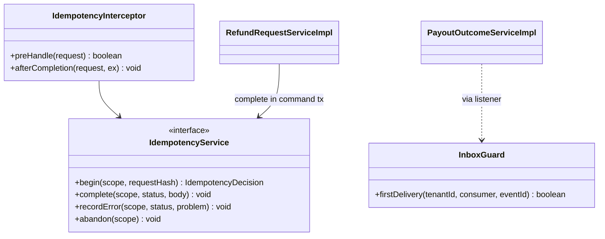

**Pseudocode skeleton:**

```text
RefundRequestController.submit(@RequestHeader Idempotency-Key, body):
  scope = request attribute set by IdempotencyInterceptor (replays never reach the controller)
  return 201, refundRequestService.submit(caller, body, scope)   (service completes the record in its tx)
```

### Pattern: RFC 9457 Problem Details error model

> **Applied:** RFC 9457 error model (CLAUDE.md: "Global @RestControllerAdvice, Problem Details (RFC 9457). Business exceptions extend a base ServiceException with error code.")
>
> **Rationale (this service):** the web app maps each `errorCode` to a plain-language message that says what to do next (REFUNDS 11); the SDD fixes the codes (SDD §15.1, §17.1 Error Handling), so the exceptions carry them verbatim and the shared advice renders them.

**Roles:**

| Role | Class / Component |
|------|-------------------|
| Base exception | `ServiceException` (shared) with `errorCode`, `httpStatus` |
| Domain subclasses | `ReceiptNotFoundException`, `RefundWindowPassedException`, `ItemAlreadyRefundedException`, `RefundAlreadyDecidedException`, `InvalidPartialAmountException`, `ReasonRequiredException`, `ReceiptLookupUnavailableException`, `RefundNotFoundException`, `BranchAccessDeniedException` |
| Translator | `ProblemDetailsAdvice` (`@RestControllerAdvice`, shared) |

**Class diagram:**

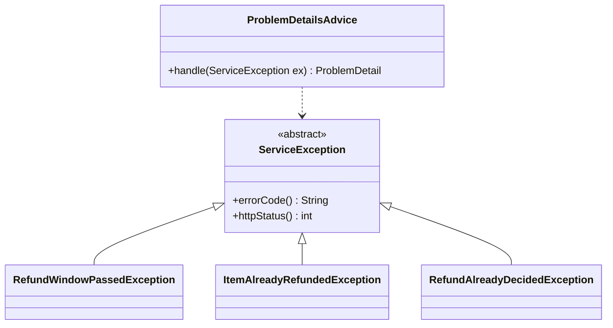

**Pseudocode skeleton:**

```text
class RefundWindowPassedException extends ServiceException:
  constructor() -> super(errorCode = "REFUND_WINDOW_PASSED", httpStatus = 422)
ProblemDetailsAdvice.handle(ex) -> envelope of 09 § 12.6 with type = {problemBase}/refund-window-passed
```

### Pattern: Saga (choreography participant, SAGA-01)

> **Applied:** Saga, choreography (CLAUDE.md: "Sagas (choreography by default, orchestration when the flow is complex or needs central visibility) for cross-service business transactions. No distributed 2PC.")
>
> **Rationale (this service):** the refund payout and points flow changes state in refund-service, payout-service, and loyalty-service. ADR-05 rejects an orchestrator for this linear flow. refund-service opens SAGA-01 with `REFUND_APPROVED`, closes it with `REFUND_PAID`, or surfaces its failure with `REFUND_PAYOUT_FAILED` (the request stays APPROVED and flagged; there is no money to compensate). Step table: 09 § 12.5.

**Roles:**

| Role | Class / Component |
|------|-------------------|
| Saga start (step 1) | `RefundDecisionServiceImpl.decide` writes `REFUND_APPROVED` |
| Outcome handler (step 4) | `PayoutEventsListener` -> `PayoutOutcomeServiceImpl` |
| Success fact | `REFUND_PAID` (drives SAGA-01 step 5 in loyalty-service and the customer message) |
| Failure signal | `REFUND_PAYOUT_FAILED` (branch managers emailed; queue flag) |

**Class diagram:**

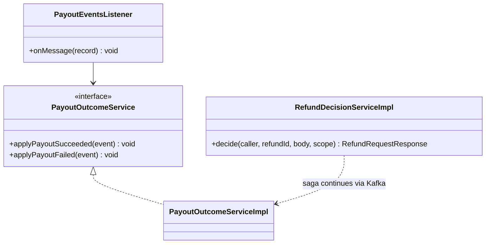

**Pseudocode skeleton:**

```text
PayoutEventsListener.onMessage(record):
  envelope = deserialize(record)
  switch envelope.eventType:
    PAYOUT_SUCCEEDED -> inbox guard, payoutOutcome.applyPayoutSucceeded(envelope)
    PAYOUT_FAILED    -> inbox guard, payoutOutcome.applyPayoutFailed(envelope)
    default          -> ignore (forward-compatible)
```

### Pattern: Resilience4j on the POS Records lookup

> **Applied:** Resilience defaults (CLAUDE.md: "Resilience defaults: timeouts, retries with exponential backoff and jitter, circuit breakers (Resilience4j), bulkheads for downstream provider calls (e.g., eSIM, payment, SMS).")
>
> **Rationale (this service):** refund intake calls POS Records synchronously twice per request (UC-01 steps 2 and 5) with no fallback, so every POS failure is customer-visible disruption counted against REFUNDS/NFR-02 (SDD R-08). A short timeout, two jittered retries on idempotent failures (SDD §12 INT-03), a circuit breaker, and a bulkhead keep a slow POS from holding request threads; an open circuit answers 503 `RECEIPT_LOOKUP_UNAVAILABLE` at once.

**Roles:**

| Role | Class / Component |
|------|-------------------|
| Guarded call | `PosRecordsReceiptAdapter.lookup` |
| Policies | Resilience4j instance `posRecords`: time limiter, retry, circuit breaker, bulkhead (values 09 § 12.3) |
| Fallback | Translate open circuit, timeout, and exhausted retries to `ReceiptLookupUnavailableException` |

**Class diagram:**

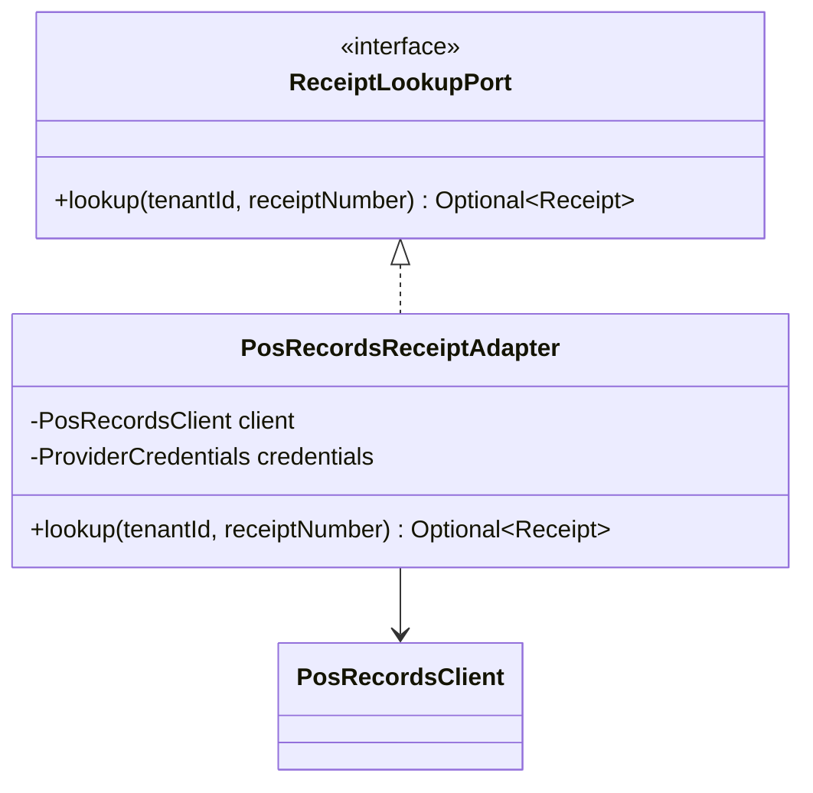

**Pseudocode skeleton:**

```text
@CircuitBreaker(name = "posRecords") @Retry(name = "posRecords") @Bulkhead(name = "posRecords")
Optional<Receipt> lookup(tenantId, receiptNumber):
  creds = credentials.forTenant(tenantId, POS_RECORDS)
  resp = client.getReceipt(creds, receiptNumber, headers = X-Correlation-Id, traceparent)   (API-01, TBD - external)
  404 -> Optional.empty()        (not retried, not a circuit failure)
  2xx -> map to Receipt (anti-corruption: POS fields never leave this adapter)
fallback(ex) -> throw ReceiptLookupUnavailableException
```

**Not applied (conditions not met):** Strategy (APPROVE and REJECT are two commands with different rules, not variants of one operation), Chain of Responsibility (the submit validations are four fixed steps in one method), Factory Method, Mediator.

---

## 7.5 Dependency Injection Graph

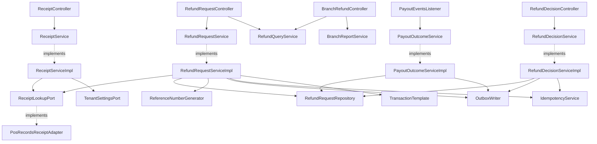

Every service implementation also receives `Clock` and `IdGenerator` by constructor. Composition over inheritance: no service class extends another; shared behaviour comes from injected platform components.

---

## 7.6 Transaction Boundaries

| Method | Propagation | Isolation | Rollback rules |
|--------|-------------|-----------|----------------|
| `ReceiptServiceImpl.getRefundableItems` | none around the API-01 call; `REQUIRED` read-only for the claim query | `READ_COMMITTED` | Not applicable (read) |
| `RefundRequestServiceImpl.submit` | none around the API-01 call; `TransactionTemplate` `REQUIRED` for the write | `READ_COMMITTED` | Rollback on any `RuntimeException`; the claim unique violation becomes `ItemAlreadyRefundedException` after rollback |
| `RefundRequestServiceImpl.cancel` | `REQUIRED` | `READ_COMMITTED` + `@Version` | Rollback on `ServiceException` and `OptimisticLockException` (mapped to 409 after a re-read) |
| `RefundDecisionServiceImpl.decide` | `REQUIRED` | `READ_COMMITTED` + `@Version` | Same as `cancel` |
| `PayoutOutcomeServiceImpl.apply*` | `REQUIRED` (listener transaction, inbox guard first) | `READ_COMMITTED` | Rollback on any exception; non-retryable exceptions go to `refund-service.dlq` (07 § 10.4) |
| `RefundQueryServiceImpl.*` | `REQUIRED`, read-only | `READ_COMMITTED` | Not applicable |
| `BranchReportServiceImpl.dailyReport` | `REQUIRED`, read-only | `REPEATABLE_READ` (one snapshot for all report figures) | Not applicable |
| `IdempotencyService.begin` / `recordError` / `abandon` | `REQUIRES_NEW` | `READ_COMMITTED` | Independent of the command |
| `IdempotencyService.complete`, `OutboxWriter.append` | `MANDATORY` | caller's | Roll back with the command |

> **Convention:** outbox row insert lives inside the same transaction as the aggregate write. No `REQUIRES_NEW` for outbox writes.

> Confirm: transaction propagation default applied; verify per method.

---

## 7.7 Error Handling

Codes and statuses are the SDD's ([SDD §15.1](../../sdd-refunds-platform/11-api-contracts.md#151-contract-conventions-platform-defaults) standard codes, [SDD §17.1](../../sdd-refunds-platform/13a-service-refund.md#171-refund-service) domain codes); this table adds the exception class and the RFC 9457 `type`.

| Exception | RFC 9457 type | HTTP Status | When thrown | Caller action |
|-----------|---------------|-------------|-------------|---------------|
| `ReceiptNotFoundException` | `{problemBase}/receipt-not-found` | 404 | UC-01 E2 | Check the number and try again |
| `RefundWindowPassedException` | `{problemBase}/refund-window-passed` | 422 | UC-01 E1, BR-1 | Visit the branch |
| `ItemAlreadyRefundedException` | `{problemBase}/item-already-refunded` | 409 | UC-01 A1 at submission (claim index) | Reload the refundable items |
| `RefundAlreadyDecidedException` | `{problemBase}/refund-already-decided` | 409 | UC-03 E1; decision on a non-SUBMITTED request | Reload the request |
| `InvalidPartialAmountException` | `{problemBase}/invalid-partial-amount` | 422 | UC-04 A1, BR-2 | Enter an amount above 0 and not above the requested amount |
| `ReasonRequiredException` | `{problemBase}/reason-required` | 422 | UC-04 A2, BR-3, partial approval | Enter a reason |
| `ReceiptLookupUnavailableException` | `{problemBase}/receipt-lookup-unavailable` | 503 | POS Records unavailable | Try again later |
| `RefundNotFoundException` | `{problemBase}/not-found` | 404 | Unknown id, or another customer's request | None (terminal) |
| `BranchAccessDeniedException` | `{problemBase}/forbidden` | 403 | Another branch's request or report (UC-04 BR-1); a decision on the manager's own customer request | None |
| `RequestInProgressException` (shared) | `{problemBase}/request-in-progress` | 409 + `Retry-After` | Same key while IN_PROGRESS | Web app retries silently |
| `IdempotencyConflictException` (shared) | `{problemBase}/conflict` | 409 | Same key, different body | Use a new key |
| Bean Validation failure | `{problemBase}/validation-failed` | 400 | Body or header invalid | Fix fields in `errors[]` |
| Anything else | `{problemBase}/internal-error` | 500 | Unexpected | Retry later; no internals in the body |

> **Convention:** all exceptions extend `ServiceException` (CLAUDE.md base class). Global `@RestControllerAdvice` translates to Problem Details (RFC 9457). Envelope in 09 § 12.6. Async: an unknown refund or an invalid transition on a payout event is dead-lettered to `refund-service.dlq`, never dropped.

---

## 7.8 Use-Case Workflows

### REFUNDS/UC-01: Request a Refund

**Trigger:** REST `GET /v1/receipts/{receiptNumber}/refundable-items`, then `POST /v1/refund-requests` ([BRD UC-01](../../brd-refunds-portal/06a-use-cases-customer.md#uc-01-request-a-refund); SDD §8.5.1).

**Pre-conditions:** caller holds `refund.receipt.read` and `refund.request.create`; purchase within 30 days in the tenant zone.

**Post-conditions:** one `refund_request` (SUBMITTED, new reference number), its items with active claims, one history row, one `REFUND_SUBMITTED` outbox row, one COMPLETED idempotency record.

**Control flow:**

```text
1. Web app -> GET refundable-items -> ReceiptServiceImpl.getRefundableItems (7.3)
2. Customer selects lines and a reason; web app generates one Idempotency-Key per submission
3. POST /v1/refund-requests -> IdempotencyInterceptor.begin (09 § 12.2)
4. RefundRequestServiceImpl.submit: POS re-read (API-01), window re-check, amount = sum of lines
5. One transaction: aggregate, items, history, outbox REFUND_SUBMITTED (outbox emission point), idempotency complete
6. 201 with the reference number; the relay publishes REFUND_SUBMITTED; notification-service emails and texts
```

**Sequence diagram:**

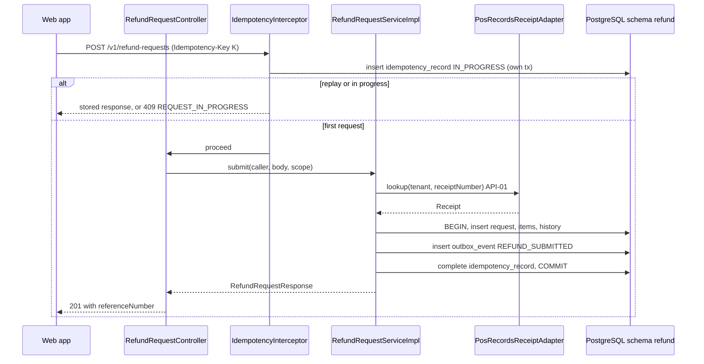

**Idempotency points:** `Idempotency-Key` on the POST, scope (`tenant_id`, subject, `POST /v1/refund-requests`, key), 24-hour expiry (SDD §11.1); the claim index is the concurrency backstop for two different keys.

**Outbox emission points:** `REFUND_SUBMITTED` in step 5; topic `refunds-platform-refund-events`, key = refund id.

**Retry / timeout policy:** API-01 per instance `posRecords` (09 § 12.3); no retry of the POST by the server; the web app retries 409 `REQUEST_IN_PROGRESS` after `Retry-After`.

**Error handling:** 404 `RECEIPT_NOT_FOUND`, 422 `REFUND_WINDOW_PASSED`, 409 `ITEM_ALREADY_REFUNDED`, 503 `RECEIPT_LOOKUP_UNAVAILABLE` (record abandoned so the client can retry), 400 `VALIDATION_FAILED`.

### REFUNDS/UC-02: Track Refund Status (Web and Mobile)

**Trigger:** REST `GET /v1/refund-requests` and `GET /v1/refund-requests/{refundId}` ([BRD UC-02](../../brd-refunds-portal/06a-use-cases-customer.md#uc-02-track-refund-status-web-and-mobile)).

**Pre-conditions:** `refund.request.read-own` (or `refund.request.read-branch` for the detail).

**Post-conditions:** none (read).

**Control flow:**

```text
1. listOwn: WHERE tenant_id = :t AND customer_id = :subject ORDER BY submitted_at DESC, id DESC (keyset cursor)
   empty page -> items = [] (UC-02 A1)
2. getDetail: load by (tenant, id); a CUSTOMER sees it only if customer_id = subject (else 404);
   a BRANCH_MANAGER only if branch_id = claim (else 403); returns history ordered by changed_at with reasons
```

**Sequence diagram:**

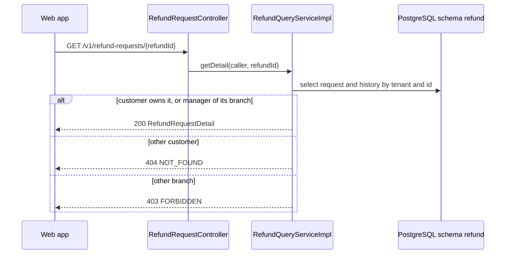

**Idempotency points:** not applicable (reads). **Outbox emission points:** none. **Retry / timeout policy:** none server-side. **Error handling:** 404, 403, 400 (bad cursor or limit).

### REFUNDS/UC-03: Cancel a Refund Request

**Trigger:** REST `POST /v1/refund-requests/{refundId}/cancellation` ([BRD UC-03](../../brd-refunds-portal/06a-use-cases-customer.md#uc-03-cancel-a-refund-request); SDD §8.5.3).

**Pre-conditions:** own request, status SUBMITTED; the web app has shown its two-step confirmation (UC-03 step 3).

**Post-conditions:** status CANCELLED, claims released, history row, `REFUND_CANCELLED` outbox row.

**Control flow:**

```text
1. IdempotencyInterceptor.begin
2. cancel (7.3): load own request, guard SUBMITTED, transition, release claims, history, outbox REFUND_CANCELLED
3. 200 RefundRequest; a concurrent decision makes the version check fail -> 409 REFUND_ALREADY_DECIDED
```

**Sequence diagram:**

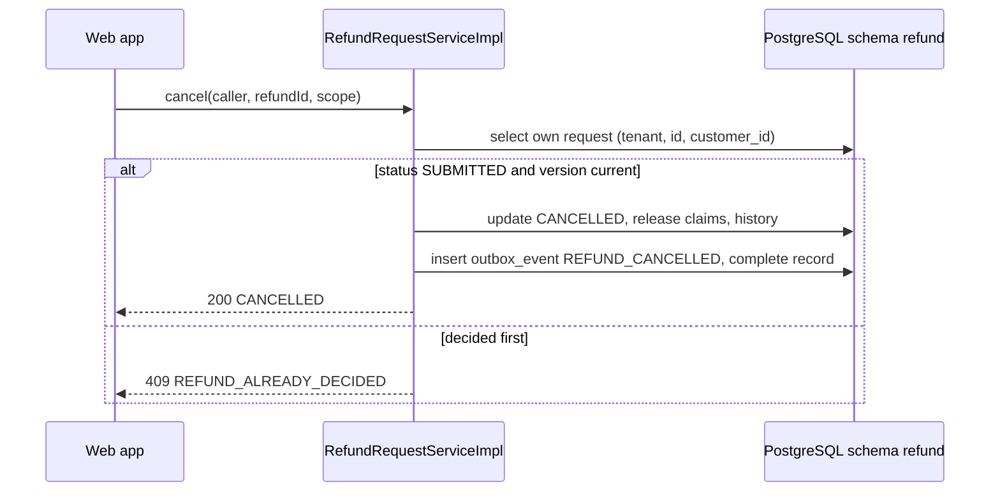

**Idempotency points:** `Idempotency-Key` required; a replay returns the first 200 or the first 409. **Outbox emission points:** `REFUND_CANCELLED`. **Retry / timeout policy:** none server-side. **Error handling:** 404 `NOT_FOUND`, 409 `REFUND_ALREADY_DECIDED`.

### REFUNDS/UC-04: Approve / Reject Refund

**Trigger:** REST `GET /v1/branches/{branchId}/refund-requests`, `GET /v1/refund-requests/{refundId}`, `POST /v1/refund-requests/{refundId}/decision`; Kafka `PAYOUT_SUCCEEDED` and `PAYOUT_FAILED` ([BRD UC-04](../../brd-refunds-portal/06b-use-cases-branch-manager.md#uc-04-approve--reject-refund); SDD §8.5.2).

**Pre-conditions:** `refund.request.read-branch` and `refund.request.decide`; the request belongs to the manager's branch and is SUBMITTED.

**Post-conditions:** APPROVED with payout status PENDING and `REFUND_APPROVED`, or REJECTED with claims released and `REFUND_REJECTED`; later PAID with `REFUND_PAID`, or APPROVED with payout status FAILED and `REFUND_PAYOUT_FAILED`.

**Control flow:**

```text
1. Queue: SUBMITTED of the branch, oldest first (submitted_at ASC, id ASC), then APPROVED with payout_status FAILED
   (payout_failed_at ASC), flagged; one keyset cursor spans both sections (08 § 11.3)
2. Decision: decide (7.3) with the SDD Figure 16 check order; outbox REFUND_APPROVED or REFUND_REJECTED
3. payout-service pays (SAGA-01 steps 2-3)
4. PAYOUT_SUCCEEDED -> applyPayoutSucceeded -> PAID, outbox REFUND_PAID (step 7)
5. PAYOUT_FAILED -> applyPayoutFailed -> payout status FAILED, flag, outbox REFUND_PAYOUT_FAILED (E1)
```

**Sequence diagram (decision):**

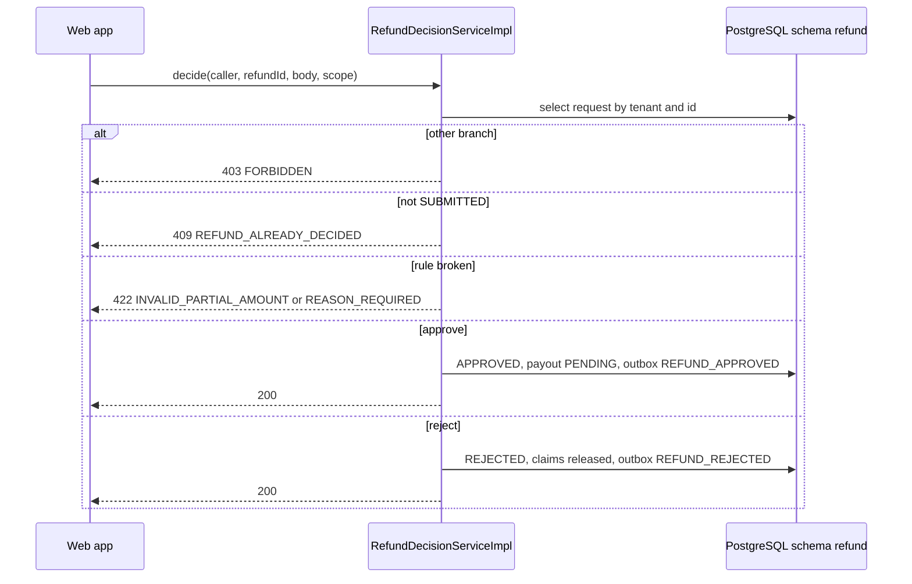

**Sequence diagram (payout outcome):**

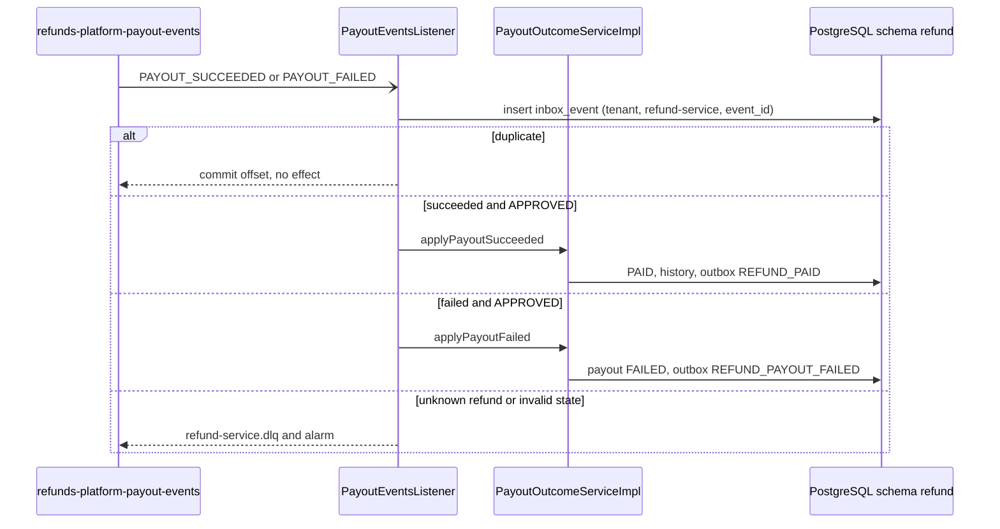

**Idempotency points:** `Idempotency-Key` on the decision; inbox on (`tenant_id`, `refund-service`, `event_id`) for payout facts; `aggregate_version` guard against stale redrives.

**Outbox emission points:** `REFUND_APPROVED` or `REFUND_REJECTED` (decision); `REFUND_PAID` or `REFUND_PAYOUT_FAILED` (payout outcome, `causation_id` = the payout event id).

**Retry / timeout policy:** decision: none server-side; consumer: container retries with backoff, then `refund-service.dlq` (07 § 10.4).

**Error handling:** 403, 404, 409 `REFUND_ALREADY_DECIDED`, 422 `INVALID_PARTIAL_AMOUNT` / `REASON_REQUIRED`; async: DLQ with alarm.

### Report: Daily branch refund report (REFUNDS 09)

**Trigger:** REST `GET /v1/branches/{branchId}/refund-report?date=YYYY-MM-DD` ([BRD REFUNDS 09](../../brd-refunds-portal/09-reporting-and-analytics.md#reporting--analytics)).

**Pre-conditions:** `refund.report.read-branch`; `branchId` = claim; `date` not in the future (tenant zone).

**Post-conditions:** none (read).

**Control flow:** one read-only query per figure over the tenant-zone day `[date 00:00, date+1 00:00)` converted to UTC instants: status transitions per `to_status` from `refund_status_history`, sum of `paid_amount` for requests that became PAID that day, average `decided_at - submitted_at` for decisions taken that day. No sequence diagram: a single-step read.

> TODO: best guess: "requests per status" counts the status changes that happened during the day, not a status snapshot at day end (REFUNDS 09 and SDD §17.1 do not say which) - verify with the REFUNDS owner.

**Idempotency points / Outbox / Retry:** not applicable. **Error handling:** 400 (bad date), 403.

### Job: Payout watchdog (REFUNDS/NFR-01)

**Trigger:** daily schedule (`refund.watchdog.cron`, 10 § 13.1). **Control flow:** `PayoutWatchdogJob.run` (7.3). **Post-conditions:** gauge `refund_payout_outcome_overdue` set per tenant; alert above zero. No state change, no event, no diagram.

### Cross-service Saga (orchestrator role)

Not applicable for this service: SAGA-01 is choreographed (ADR-05) and has no orchestrator; the step table and compensation rules are in [09 § 12.5](../09-cross-cutting.md#125-saga-pattern-cross-service-transactions).

<!-- MASTER: lld-master.md | PREV: 03-architecture.md | NEXT: 05-data-model.md -->
