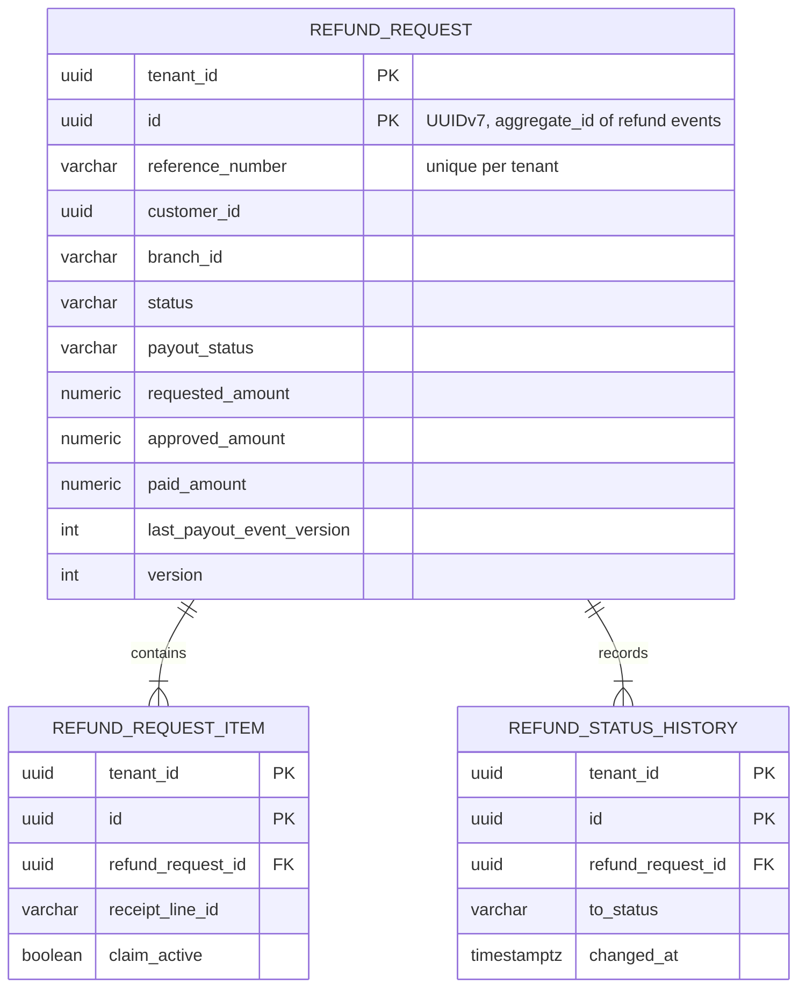
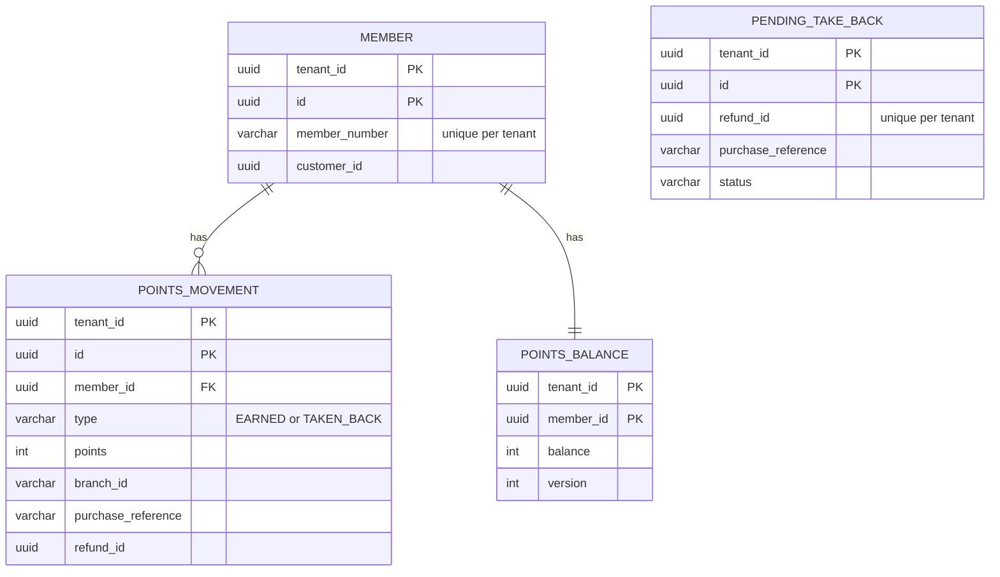
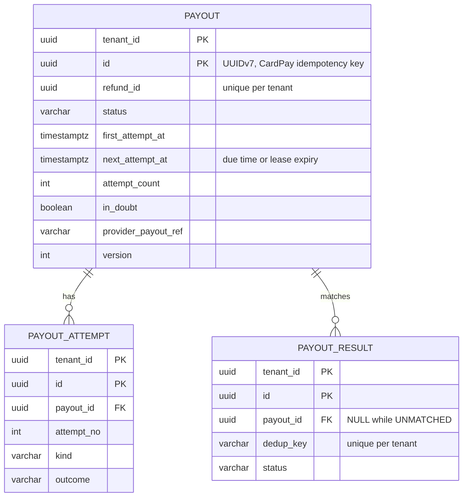
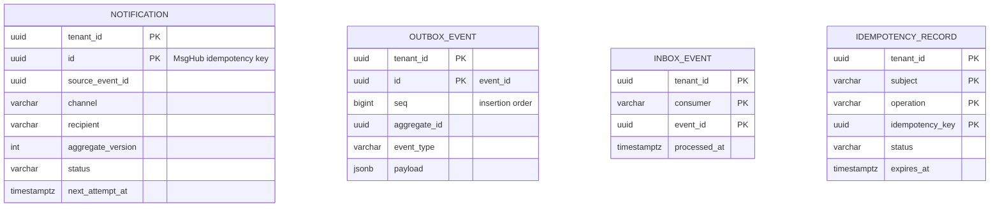

<!--
CHUNK: 05
TITLE: Data Model
PROJECT: Refunds Platform
VERSION: 1.0
DEPENDS_ON: 04
PART OF: LLD - Refunds Platform
-->

# 8. Data Model

> **Per-service ownership:** each module owns a private schema in the core database (`refund`, `loyalty`) and each separate service a private database (`payout`, `notification`) (ADR-06). The design-level models are SDD §17.1 to §17.4 DB Modeling; this chunk is the physical model: composite tenant keys, platform tables, LLD-added columns, index names, and Flyway files.

## 8.1 Entity Relationship (system-wide)

There is no relationship across schemas or databases (ADR-06), so the model is drawn per owner. Every table also carries the SDD §11.1 auditing columns (`created_at`, `created_by`, `updated_at`, `updated_by`), which the diagrams omit.

**Schema `refund` (core database):**

**Schema `loyalty` (core database):**

**Database `payout`:**

**Database `notification` and the platform tables (in every schema or database that publishes, consumes, or accepts `Idempotency-Key`):**

## 8.2 Tables (per service)

**Key rule (all tables):** the primary key starts with `tenant_id` (`PRIMARY KEY (tenant_id, id)`), and every foreign key is composite (`(tenant_id, parent_id)`), so a child row can never point at another tenant's parent and a lookup by id is tenant-scoped by construction (CLAUDE.md "Every index in shared-schema includes `tenant_id`"; SDD §11.1 "every index starts with `tenant_id`").

> Confirm: composite tenant-first primary keys are an LLD choice (SDD §17.x draws `id` as the key); they remove the SDD reviewer's noted exception to the tenant-index rule at the cost of composite JPA ids (`TenantScopedId`) - verify with the team.

### Service: refund-service - schema `refund`

| Table | Column | Type | Constraints | Notes |
|-------|--------|------|-------------|-------|
| `refund_request` | `tenant_id`, `id` | `uuid`, `uuid` | PK (`tenant_id`, `id`) | `id` UUIDv7 from the application |
| `refund_request` | `reference_number` | `varchar(20)` | NOT NULL; UNIQUE (`tenant_id`, `reference_number`) | Format in 08 § 11.3 |
| `refund_request` | `customer_id` | `uuid` | NOT NULL | Token subject (pseudonymous PII) |
| `refund_request` | `branch_id`, `receipt_number`, `purchase_date` | `varchar(20)`, `varchar(40)`, `date` | NOT NULL | From POS Records (API-01) |
| `refund_request` | `original_payment_ref` | `varchar(100)` | NOT NULL | Confidential; never logged, never returned to a client |
| `refund_request` | `currency`, `requested_amount`, `approved_amount`, `paid_amount` | `char(3)`, `numeric(19,4)` (x3) | requested > 0; approved NULL or (> 0 and <= requested); paid NULL or > 0 | `paid_amount` is an LLD addition, set from `PAYOUT_SUCCEEDED` |
| `refund_request` | `status` | `varchar(20)` | NOT NULL; CHECK in (`SUBMITTED`, `APPROVED`, `REJECTED`, `PAID`, `CANCELLED`) | 08 § 11.1 |
| `refund_request` | `payout_status` | `varchar(20)` | NOT NULL DEFAULT `NONE`; CHECK in (`NONE`, `PENDING`, `FAILED`, `SUCCEEDED`) | |
| `refund_request` | `reason`, `decision_reason` | `varchar(500)` | `reason` NOT NULL; CHECK `decision_reason` NOT NULL when REJECTED or when `approved_amount < requested_amount` | Free text (PII) |
| `refund_request` | `submitted_at`, `decided_at`, `decided_by`, `paid_at`, `cancelled_at`, `payout_failed_at` | `timestamptz`, `timestamptz`, `uuid`, `timestamptz` (x3) | `submitted_at` NOT NULL | `payout_failed_at` is an LLD addition (queue order of failed payouts) |
| `refund_request` | `last_payout_event_version` | `int` | NULL | LLD addition: `aggregate_version` guard for payout events (SDD §14.6 item 3) |
| `refund_request` | `version` | `int` | NOT NULL DEFAULT 0 | Optimistic lock (`@Version`) |
| `refund_request_item` | `tenant_id`, `id`, `refund_request_id` | `uuid` (x3) | PK (`tenant_id`, `id`); FK (`tenant_id`, `refund_request_id`) | |
| `refund_request_item` | `branch_id`, `receipt_number`, `receipt_line_id` | `varchar(20)`, `varchar(40)`, `varchar(40)` | NOT NULL | Copied from the request; claim identity (SDD A-4) |
| `refund_request_item` | `description`, `quantity`, `amount` | `varchar(200)`, `int`, `numeric(19,4)` | NOT NULL; quantity > 0; amount > 0 | Copied from POS at submission |
| `refund_request_item` | `claim_active` | `boolean` | NOT NULL DEFAULT true | Released on CANCELLED and REJECTED |
| `refund_status_history` | `tenant_id`, `id`, `refund_request_id` | `uuid` (x3) | PK; FK (`tenant_id`, `refund_request_id`) | |
| `refund_status_history` | `from_status`, `to_status`, `changed_at`, `changed_by`, `reason` | `varchar(20)`, `varchar(20)`, `timestamptz`, `uuid`, `varchar(500)` | `to_status`, `changed_at` NOT NULL | `changed_by` NULL for system transitions (payout outcome) |
| sequence `reference_number_seq` | - | `bigint` | - | Feeds `SequenceReferenceNumberGenerator` |
| `outbox_event`, `inbox_event`, `idempotency_record` | - | - | - | Platform tables below |

### Service: loyalty-service - schema `loyalty`

| Table | Column | Type | Constraints | Notes |
|-------|--------|------|-------------|-------|
| `member` | `tenant_id`, `id`, `member_number`, `customer_id` | `uuid`, `uuid`, `varchar(40)`, `uuid` | PK (`tenant_id`, `id`); UNIQUE (`tenant_id`, `member_number`); UNIQUE (`tenant_id`, `customer_id`) WHERE NOT NULL | Created on the first purchase; `customer_id` link open (A-5) |
| `points_movement` | `tenant_id`, `id`, `member_id` | `uuid` (x3) | PK; FK (`tenant_id`, `member_id`) | Append-only: no UPDATE or DELETE grant for `loyalty_app` |
| `points_movement` | `type`, `points`, `occurred_at` | `varchar(12)`, `int`, `timestamptz` | CHECK type in (`EARNED`, `TAKEN_BACK`); CHECK (type = `EARNED` AND points > 0) OR (type = `TAKEN_BACK` AND points < 0) | Whole points (LOYALTY 11) |
| `points_movement` | `branch_id`, `purchase_reference`, `purchase_amount`, `currency` | `varchar(20)`, `varchar(40)`, `numeric(19,4)`, `char(3)` | `branch_id`, `purchase_reference` NOT NULL on both types | Take-back rows also carry the purchase, so the cap in 08 § 11.3 is one query |
| `points_movement` | `refund_id`, `refund_reference`, `paid_amount` | `uuid`, `varchar(20)`, `numeric(19,4)` | NOT NULL when type = `TAKEN_BACK` | |
| `points_balance` | `tenant_id`, `member_id`, `balance`, `last_movement_at`, `version` | `uuid`, `uuid`, `int`, `timestamptz`, `int` | PK (`tenant_id`, `member_id`); FK to `member` | Projection; atomic upsert only |
| `pending_take_back` | `tenant_id`, `id`, `refund_id` | `uuid` (x3) | PK; UNIQUE (`tenant_id`, `refund_id`) | |
| `pending_take_back` | `branch_id`, `purchase_reference`, `purchase_date`, `paid_amount`, `currency`, `refund_reference` | `varchar(20)`, `varchar(40)`, `date`, `numeric(19,4)`, `char(3)`, `varchar(20)` | NOT NULL | From `REFUND_PAID` |
| `pending_take_back` | `status`, `deadline_at`, `applied_at`, `closed_at` | `varchar(10)`, `timestamptz` (x3) | CHECK status in (`PARKED`, `APPLIED`, `CLOSED`) | `deadline_at` is an LLD addition (tenant-zone end of the day after `purchase_date`) |
| `inbox_event` | - | - | - | Platform table below (no outbox: the module publishes nothing) |

### Service: payout-service - database `payout` (schema `payout`)

| Table | Column | Type | Constraints | Notes |
|-------|--------|------|-------------|-------|
| `payout` | `tenant_id`, `id`, `refund_id` | `uuid` (x3) | PK (`tenant_id`, `id`); UNIQUE (`tenant_id`, `refund_id`) | `id` = CardPay idempotency key and `aggregate_id` |
| `payout` | `reference_number`, `original_payment_ref` | `varchar(20)`, `varchar(100)` | NOT NULL | From `REFUND_APPROVED`; payment reference confidential |
| `payout` | `amount`, `currency` | `numeric(19,4)`, `char(3)` | amount > 0 | Approved amount |
| `payout` | `status` | `varchar(20)` | CHECK in (`PENDING`, `RETRY_WAIT`, `SUCCEEDED`, `FAILED`) | 08 § 11.1 |
| `payout` | `first_attempt_at`, `next_attempt_at` | `timestamptz` | `next_attempt_at` NOT NULL | Window starts at `first_attempt_at` (ADR-10) |
| `payout` | `attempt_count`, `in_doubt` | `int`, `boolean` | NOT NULL DEFAULT 0 / false | LLD additions |
| `payout` | `provider_payout_ref`, `last_provider_code`, `succeeded_at`, `failed_at`, `version` | `varchar(100)`, `varchar(50)`, `timestamptz`, `timestamptz`, `int` | UNIQUE (`tenant_id`, `provider_payout_ref`) WHERE NOT NULL | |
| `payout_attempt` | `tenant_id`, `id`, `payout_id`, `attempt_no`, `kind` | `uuid` (x3), `int`, `varchar(12)` | PK; FK (`tenant_id`, `payout_id`); CHECK kind in (`SEND`, `STATUS_QUERY`) | `kind` is an LLD addition |
| `payout_attempt` | `attempted_at`, `outcome`, `provider_code`, `completed_at` | `timestamptz`, `varchar(20)`, `varchar(50)`, `timestamptz` | outcome NULL while in flight; CHECK in (`CONFIRMED`, `REFUSED`, `UNAVAILABLE`, `IN_DOUBT`) | |
| `payout_result` | `tenant_id`, `id`, `payout_id`, `dedup_key` | `uuid` (x3), `varchar(100)` | PK; `payout_id` NULL while UNMATCHED; UNIQUE (`tenant_id`, `dedup_key`) | `dedup_key` is an LLD addition (04 payout-service 7.8) |
| `payout_result` | `provider_payout_ref`, `echoed_reference`, `outcome`, `status`, `received_at`, `raw_body` | `varchar(100)`, `varchar(100)`, `varchar(20)`, `varchar(10)`, `timestamptz`, `jsonb` | CHECK status in (`MATCHED`, `UNMATCHED`) | `raw_body` kept for audit (SDD §11.1 JSON rule) |
| `outbox_event`, `inbox_event` | - | - | - | Platform tables below |

### Service: notification-service - database `notification` (schema `notification`)

| Table | Column | Type | Constraints | Notes |
|-------|--------|------|-------------|-------|
| `notification` | `tenant_id`, `id`, `source_event_id`, `channel` | `uuid` (x3), `varchar(10)` | PK; UNIQUE (`tenant_id`, `source_event_id`, `channel`); CHECK channel in (`EMAIL`, `SMS`) | `id` = MsgHub idempotency key |
| `notification` | `event_type`, `aggregate_version`, `refund_id` | `varchar(40)`, `int`, `uuid` | NOT NULL | Supersession check |
| `notification` | `recipient`, `customer_id`, `branch_id` | `varchar(20)`, `uuid`, `varchar(20)` | CHECK recipient in (`CUSTOMER`, `BRANCH_MANAGERS`); `customer_id` NOT NULL for CUSTOMER; `branch_id` NOT NULL for BRANCH_MANAGERS | `branch_id` is an LLD addition |
| `notification` | `template_code`, `template_params` | `varchar(60)`, `jsonb` | NOT NULL | Params: reference number, amount with currency, reason, branch |
| `notification` | `status`, `attempt_count`, `next_attempt_at`, `last_error_code`, `provider_message_id`, `sent_at` | `varchar(10)`, `int`, `timestamptz`, `varchar(50)`, `varchar(100)`, `timestamptz` | CHECK status in (`PENDING`, `SENT`, `SKIPPED`, `FAILED`) | |
| `inbox_event` | - | - | - | Platform table below |

### Platform tables (shared library DDL, one copy per owning schema or database)

| Table | Column | Type | Constraints | Notes |
|-------|--------|------|-------------|-------|
| `outbox_event` | `tenant_id`, `id` | `uuid`, `uuid` | PK (`tenant_id`, `id`) | `id` is the envelope `event_id` |
| `outbox_event` | `seq` | `bigint` | GENERATED ALWAYS AS IDENTITY | Insertion order for the relay |
| `outbox_event` | `aggregate_type`, `aggregate_id`, `aggregate_version`, `event_type`, `schema_version`, `topic` | `varchar(40)`, `uuid`, `int`, `varchar(60)`, `varchar(20)`, `varchar(120)` | NOT NULL | Envelope fields (SDD §14.3) |
| `outbox_event` | `occurred_at`, `correlation_id`, `causation_id`, `traceparent`, `payload` | `timestamptz`, `uuid`, `uuid`, `varchar(55)`, `jsonb` | `causation_id`, `traceparent` NULL | Deleted after broker acknowledgement |
| `inbox_event` | `tenant_id`, `consumer`, `event_id`, `event_type`, `aggregate_id`, `processed_at` | `uuid`, `varchar(60)`, `uuid`, `varchar(60)`, `uuid`, `timestamptz` | PK (`tenant_id`, `consumer`, `event_id`) | `consumer` = consumer group name |
| `idempotency_record` | `tenant_id`, `subject`, `operation`, `idempotency_key` | `uuid`, `varchar(64)`, `varchar(120)`, `uuid` | PK (all four, SDD §11.1) | Only schema `refund` accepts `Idempotency-Key` |
| `idempotency_record` | `request_hash`, `status`, `response_status`, `response_body`, `expires_at` | `char(64)`, `varchar(12)`, `int`, `jsonb`, `timestamptz` | CHECK status in (`IN_PROGRESS`, `COMPLETED`) | 24-hour expiry (SDD §11.1) |

## 8.3 Indexes

Primary keys and the unique constraints above are not repeated. Every index starts with `tenant_id`.

| Index | Table | Columns | Type | Rationale |
|-------|-------|---------|------|-----------|
| `ix_refund_request_customer` | `refund_request` | `(tenant_id, customer_id, submitted_at DESC, id DESC)` | btree | UC-02 own list, keyset |
| `ix_refund_request_branch_queue` | `refund_request` | `(tenant_id, branch_id, status, submitted_at, id)` | btree | UC-04 queue, SUBMITTED oldest first |
| `ix_refund_request_branch_failed` | `refund_request` | `(tenant_id, branch_id, payout_failed_at, id) WHERE status = 'APPROVED' AND payout_status = 'FAILED'` | partial btree | Queue section of failed payouts (UC-04 E1) |
| `ix_refund_request_payout_watch` | `refund_request` | `(tenant_id, status, payout_status, decided_at)` | btree | Payout watchdog (REFUNDS/NFR-01) |
| `uq_refund_item_active_claim` | `refund_request_item` | `(tenant_id, branch_id, receipt_number, receipt_line_id) WHERE claim_active` | partial unique | UC-01 BR-2 under concurrency |
| `ix_refund_item_request` | `refund_request_item` | `(tenant_id, refund_request_id)` | btree | Items of a request; claim release |
| `ix_refund_history_request` | `refund_status_history` | `(tenant_id, refund_request_id, changed_at)` | btree | UC-02 step 4 |
| `ix_refund_history_changed` | `refund_status_history` | `(tenant_id, changed_at)` | btree | Daily branch report |
| `ix_movement_member_history` | `points_movement` | `(tenant_id, member_id, occurred_at DESC, id DESC)` | btree | UC-02 history, keyset |
| `uq_movement_earned` | `points_movement` | `(tenant_id, branch_id, purchase_reference) WHERE type = 'EARNED'` | partial unique | API-06 idempotency; take-back match |
| `uq_movement_taken_back` | `points_movement` | `(tenant_id, refund_id) WHERE type = 'TAKEN_BACK'` | partial unique | One take-back per refund |
| `ix_movement_purchase` | `points_movement` | `(tenant_id, branch_id, purchase_reference)` | btree | Take-back cap (sum per purchase) |
| `ix_pending_take_back_purchase` | `pending_take_back` | `(tenant_id, branch_id, purchase_reference)` | btree | Apply waiting take-backs on earn |
| `ix_pending_take_back_deadline` | `pending_take_back` | `(tenant_id, status, deadline_at)` | btree | Parking job |
| `ix_payout_due` | `payout` | `(tenant_id, status, next_attempt_at)` | btree | Scheduler claim |
| `ix_payout_reference` | `payout` | `(tenant_id, reference_number)` | btree | API-03 match on the echoed reference |
| `ix_payout_succeeded` | `payout` | `(tenant_id, status, succeeded_at)` | btree | Daily reconciliation |
| `ix_payout_attempt_payout` | `payout_attempt` | `(tenant_id, payout_id, attempted_at)` | btree | Last attempt, lease check |
| `ix_payout_result_status` | `payout_result` | `(tenant_id, status, received_at)` | btree | Unmatched gauge |
| `ix_payout_result_provider_ref` | `payout_result` | `(tenant_id, provider_payout_ref)` | btree | Re-match on a new provider reference |
| `ix_notification_due` | `notification` | `(tenant_id, status, next_attempt_at)` | btree | Dispatch claim |
| `ix_notification_supersede` | `notification` | `(tenant_id, refund_id, channel, recipient, status, aggregate_version)` | btree | Supersession check |
| `ix_notification_created` | `notification` | `(tenant_id, created_at)` | btree | Retention purge |
| `ix_outbox_event_seq` | `outbox_event` | `(tenant_id, seq)` | btree | Relay poll in insertion order |
| `ix_inbox_event_processed` | `inbox_event` | `(tenant_id, processed_at)` | btree | Retention purge |
| `ix_idempotency_expires` | `idempotency_record` | `(tenant_id, expires_at)` | btree | Hourly expiry purge |

## 8.4 Multi-Tenancy Strategy

> **Default per CLAUDE.md:** schema-per-tenant for high-volume services; shared-schema with `tenant_id` for low-volume.

| Service | Strategy | Rationale |
|---------|----------|-----------|
| refund-service | Shared schema with `tenant_id` | ADR-03: about 1,200 requests a month is low volume; no override in SDD §17.1 |
| loyalty-service | Shared schema with `tenant_id` | ADR-03; no override in SDD §17.4 |
| payout-service | Shared schema with `tenant_id` | ADR-03; no override in SDD §17.2 |
| notification-service | Shared schema with `tenant_id` | ADR-03; no override in SDD §17.3 |

**Tenant filter enforcement:** every repository extends the shared `TenantScopedRepository<T>` base interface, whose query methods take the tenant as their first parameter, and every id is a `TenantScopedId`; an architecture test fails the build on a repository method without a tenant parameter, and an integration test per repository writes rows for `tenant_a` and asserts `tenant_b` sees none (SDD §11.2). No Hibernate session filter: it does not apply to primary-key loads or native queries, which the composite key and explicit predicates cover.

**Cross-tenant queries:** forbidden in application code (SDD §11.2). Jobs that span tenants (relays, schedulers, watchdog, reconciliations, purges) loop over the tenant registry (LA-01) and run tenant-scoped statements.

## 8.5 Migration Plan (Flyway)

| Version | File | Purpose |
|---------|------|---------|
| `V1__create_refund_request.sql` | `refunds-platform-core/src/main/resources/db/migration/refund` | `refund_request`, `refund_request_item`, `refund_status_history`, `reference_number_seq`, indexes |
| `V2__create_outbox_inbox.sql` | `.../db/migration/refund` | `outbox_event`, `inbox_event` |
| `V3__create_idempotency_record.sql` | `.../db/migration/refund` | `idempotency_record` |
| `V1__create_member_and_ledger.sql` | `refunds-platform-core/src/main/resources/db/migration/loyalty` | `member`, `points_movement`, `points_balance`, indexes |
| `V2__create_pending_take_back.sql` | `.../db/migration/loyalty` | `pending_take_back` |
| `V3__create_inbox.sql` | `.../db/migration/loyalty` | `inbox_event` |
| `V1__create_payout.sql` | `payout-service/src/main/resources/db/migration` | `payout`, `payout_attempt`, `payout_result`, indexes |
| `V2__create_outbox_inbox.sql` | `payout-service/.../db/migration` | `outbox_event`, `inbox_event` |
| `V1__create_notification.sql` | `notification-service/src/main/resources/db/migration` | `notification`, indexes |
| `V2__create_inbox.sql` | `notification-service/.../db/migration` | `inbox_event` |

The core runs two Flyway instances, one per module schema, each with its own location and its own history table inside its schema (ADR-06: one history per schema or database). Migrations run as a migration role that owns the schema; the application roles (`refund_app`, `loyalty_app`, `payout_app`, `notification_app`) get DML only, and `loyalty_app` gets no UPDATE or DELETE on `points_movement`.

> Confirm: two Flyway instances in one Spring Boot application need explicit bean wiring (Spring Boot auto-configures one), and the migration and application roles are an LLD proposal; verify with the team and the DBA.

> **Convention per CLAUDE.md:** versioned SQL only; backward-compatible changes only; expand-contract for breaking changes (SDD §17.x Migration Strategy).

## 8.6 Retention & Archival

| Table | Hot retention | Archival destination | Restore SLA |
|-------|---------------|---------------------|-------------|
| `refund_request`, `refund_request_item`, `refund_status_history` | Per the open GDPR and record-keeping decision (SDD §17.1 Compliance) | None in this release (SDD §6 Object Storage) | Not applicable |
| `member`, `points_movement`, `points_balance`, `pending_take_back` | Per the open decision (SDD §17.4 Compliance) | None | Not applicable |
| `payout`, `payout_attempt`, `payout_result` | Per the open decision (SDD §17.2 Compliance) | None | Not applicable |
| `notification` | At least the consumed topic's retention, then deleted (SDD §17.3) | None | Not applicable |
| `outbox_event` | Deleted by the relay once the broker acknowledges (SDD §17.1) | None | Not applicable |
| `inbox_event` | At least the consumed topic's retention, then purged daily | None | Not applicable |
| `idempotency_record` | 24 hours after creation; hourly purge (SDD §11.1) | None | Not applicable |

> TODO: not derivable from inputs - retention periods for refund, payout, and loyalty records, and topic retention (which bounds `inbox_event` and `notification`), are open in SDD §17.1, §17.2, §17.4, and §6 - please specify; purge jobs are built with the period as configuration.

## 8.7 Encryption

| Concern | Approach |
|---------|----------|
| At rest | Storage-level encryption for PostgreSQL volumes (SDD §11.6); no column-level encryption in this release |
| In transit | TLS 1.2+ between every deployable and PostgreSQL, Kafka, and providers (SDD §11.6) |
| Key management | Keys held outside the cluster (SDD §11.6); product open |
| PII columns | `refund_request.customer_id`, `reason`, `decision_reason`, `original_payment_ref`; `refund_status_history.reason`; `refund_request_item.description`; `member.member_number`, `member.customer_id`; `points_movement.purchase_reference`; `notification.customer_id`, `notification.template_params` (reason). Masked in non-production copies (SDD §17.x, §19); inventory in 11 § 14.2 |

> TODO: not derivable from inputs - the encryption mechanism, key management service, and the masking method for non-production copies are open in SDD §11.6 and §19 - please specify.

<!-- MASTER: lld-master.md | PREV: 04-implementation/<service>.md | NEXT: 06-api-contracts.md -->
