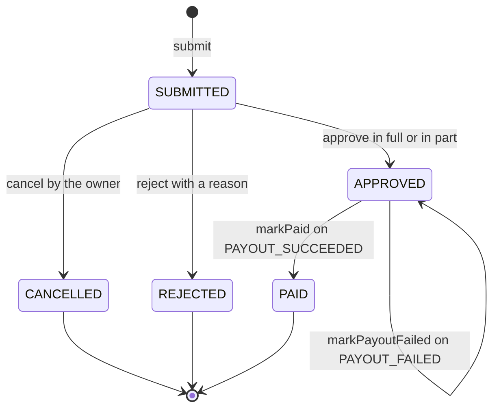
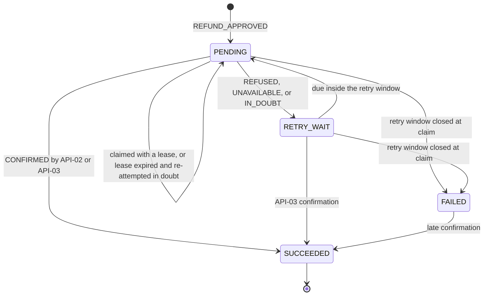
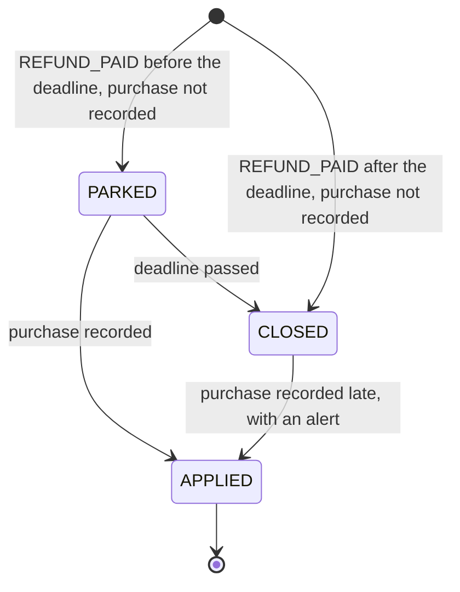

<!--
CHUNK: 08
TITLE: State Machines & Business Rules
PROJECT: Refunds Platform
VERSION: 1.0
DEPENDS_ON: 04
PART OF: LLD - Refunds Platform
-->

# 11. State Machines & Business Rules

> **Convention:** include a state machine only for entities that are genuinely stateful with named states. Per-service rules that are mostly local stay in `04-implementation/<service>.md`; rules that span services live here. The design-level machines are SDD Figure 14 (refund request) and Figure 17 (payout); this chunk adds the implementing method, guard, and side effect of each transition.

## 11.1 Aggregate State Machines

### `RefundRequest` aggregate (in refund-service)

**States:** `SUBMITTED`, `CANCELLED`, `REJECTED`, `APPROVED`, `PAID`; orthogonal `payout_status`: `NONE`, `PENDING`, `FAILED`, `SUCCEEDED`.



**Transition rules:**

| From | Event | To | Guard | Side effect |
|------|-------|----|-------|-------------|
| - | `submit` | `SUBMITTED` (payout `NONE`) | Receipt found, within the window, lines not claimed | Items with active claims, history row, `REFUND_SUBMITTED` |
| `SUBMITTED` | `cancel` | `CANCELLED` | Caller is the owner; version current | Claims released, history row, `REFUND_CANCELLED` |
| `SUBMITTED` | `reject` | `REJECTED` | Caller's branch; reason present | Claims released, history row, `REFUND_REJECTED` |
| `SUBMITTED` | `approve` | `APPROVED` (payout `PENDING`) | Caller's branch; 0 < amount <= requested; reason when partial | History row, `REFUND_APPROVED` |
| `APPROVED` | `PAYOUT_SUCCEEDED` | `PAID` (payout `SUCCEEDED`) | Status `APPROVED` (payout `PENDING` or `FAILED`); event version newer | `paid_amount`, `paid_at`, history row, `REFUND_PAID` |
| `APPROVED` | `PAYOUT_FAILED` | `APPROVED` (payout `FAILED`) | Status `APPROVED`; event version newer | `payout_failed_at`, queue flag, `REFUND_PAYOUT_FAILED`; no history row |
| `PAID` | `PAYOUT_FAILED` | `PAID` | - | Ignored (SDD §17.1) |
| any other | payout event | unchanged | - | `refund-service.dlq` with alarm |

> **Invariants enforced at every transition:**
> - Optimistic lock version must match.
> - Tenant ID, customer, branch, receipt, currency, and requested amount are immutable after `submit`.
> - `approved_amount` is set once, by `approve`.
> - Item claims stay active on `APPROVED` and `PAID` (the item is refunded) and are released only on `CANCELLED` and `REJECTED`.

### `Payout` aggregate (in payout-service)

**States:** `PENDING` (due, or an attempt in flight under a lease), `RETRY_WAIT`, `SUCCEEDED`, `FAILED`.



**Transition rules:**

| From | Event | To | Guard | Side effect |
|------|-------|----|-------|-------------|
| - | `REFUND_APPROVED` | `PENDING` | No payout for the refund | `next_attempt_at` = now; no provider call |
| `PENDING` / `RETRY_WAIT` | claim (`startAttempt`) | `PENDING` | Due; window open | Lease in `next_attempt_at`; `payout_attempt` row; `first_attempt_at` on the first attempt |
| `PENDING` / `RETRY_WAIT` | provider or API-03 `CONFIRMED` | `SUCCEEDED` | - | `provider_payout_ref`, `succeeded_at`, `PAYOUT_SUCCEEDED`, re-match unmatched results |
| `PENDING` | `REFUSED` / `UNAVAILABLE` / `IN_DOUBT` | `RETRY_WAIT` | Window open | `next_attempt_at` by the retry schedule (11.3); `in_doubt` on `IN_DOUBT` |
| `PENDING` / `RETRY_WAIT` | claim with window closed | `FAILED` | now >= `first_attempt_at` + ADR-10 window | `failed_at`, `PAYOUT_FAILED` |
| `FAILED` | `CONFIRMED` (API-03, or an in-flight attempt) | `SUCCEEDED` | - | `PAYOUT_SUCCEEDED` (late confirmation) |
| `SUCCEEDED` | any outcome | `SUCCEEDED` | - | Recorded on the attempt or result only |

> **Invariants:** one payout per (`tenant_id`, `refund_id`); `id` (the CardPay idempotency key) never changes; amount and payment reference are immutable; no attempt is made outside a claim transaction's lease.

### `PendingTakeBack` (in loyalty-service)

**States:** `PARKED`, `APPLIED`, `CLOSED` (SDD §17.4 treats it as a lifecycle, not a state machine; drawn here because `CLOSED -> APPLIED` is easy to miss).



**Transition rules:** `PARKED` or `CLOSED` to `APPLIED` inserts the TAKEN_BACK movement and updates the balance in the earn transaction; `PARKED` to `CLOSED` is the parking job; `CLOSED` to `APPLIED` counts `points_take_backs_applied_late_total`. Deadline: the end of the day after `purchase_date` in the tenant zone.

### `Notification` send-log row (in notification-service)

A lifecycle, not an aggregate machine (SDD §17.3): no diagram.

| From | Event | To | Guard | Side effect |
|------|-------|----|-------|-------------|
| - | plan | `PENDING` | Event type has a plan | - |
| `PENDING` | superseded | `SKIPPED` | A newer `aggregate_version` already SENT for (refund, channel, recipient) | - |
| `PENDING` | SMS without phone | `SKIPPED` | - | - |
| `PENDING` | send accepted | `SENT` | - | `provider_message_id`, `sent_at` |
| `PENDING` | retryable failure | `PENDING` | Attempts left | `attempt_count` + 1, later `next_attempt_at` |
| `PENDING` | last attempt failed, unknown contact, or tenant mismatch | `FAILED` | - | Alert (security alert on tenant mismatch) |

## 11.2 Cross-Service Business Rules

> **Rules that one service depends on another to enforce.** When you change a rule here, check downstream consumers.

### Rule: One payout per refund

**Statement:** an approved refund is paid at most once, for the approved amount, to the original payment reference.

**Source of truth:** payout-service (ADR-10, SDD §14.6 item 7).

**Enforcement points:** payout-service UNIQUE (`tenant_id`, `refund_id`) and the unchanging CardPay idempotency key; refund-service ignores `PAYOUT_FAILED` after PAID and dead-letters payout events for non-APPROVED requests; both daily NFR-01 checks (refund-service watchdog, payout-service reconciliation).

**Validation matrix:**

| Input condition | Expected outcome |
|-----------------|------------------|
| `REFUND_APPROVED` delivered twice | One payout; `payout_duplicate_blocked_total` + 1 |
| CardPay times out, then confirms on the in-doubt re-attempt | One CardPay payout (same key); SUCCEEDED once |
| Pod dies after the CardPay call, before recording | Lease expires; re-attempt in doubt with the same key |
| Confirmation arrives after FAILED | SUCCEEDED; `PAYOUT_SUCCEEDED`; refund APPROVED (payout FAILED) becomes PAID |

### Rule: A purchase is identified by (tenant, branch, receipt number)

**Statement:** item claims, earn movements, take-back matching, and parked take-backs key a purchase by (`tenant_id`, `branch_id`, receipt number), whether POS numbers receipts per branch or per retailer (SDD A-4).

**Source of truth:** POS Records data; the rule is SDD A-4.

**Enforcement points:** `uq_refund_item_active_claim`; `uq_movement_earned`; `ix_pending_take_back_purchase`; `REFUND_PAID` carries `branchId` and `receiptNumber`.

**Validation matrix:**

| Input condition | Expected outcome |
|-----------------|------------------|
| Same receipt number at two branches, both refunded | Two independent claims; two independent take-backs |
| Loyalty purchase reference differs from the receipt number (A-4 false) | Take-back parks, then closes; alert on PARKED older than two days (R-03) |

### Rule: Money comes from the source

**Statement:** requested amounts come from POS Records (never the client), payouts use the approved amount, and PAID records the provider-confirmed amount.

**Source of truth:** refund-service for requested and approved amounts; payout-service for paid amounts.

**Enforcement points:** `submit` re-reads the receipt (API-01) and accepts only line ids; `REFUND_APPROVED` carries `approvedAmount` and `originalPaymentRef`; `applyPayoutSucceeded` alerts when `paidAmount` differs from `approved_amount`.

**Validation matrix:**

| Input condition | Expected outcome |
|-----------------|------------------|
| Client sends an amount in `CreateRefundRequest` | Ignored: the schema has no amount field |
| Approved amount 20.0000 EUR | Payout 20.0000 EUR; `REFUND_PAID.paidAmount` 20.0000 EUR |

### Rule: Payout facts are consumed only by refund-service

**Statement:** notification-service and loyalty-service react to refund facts, never to payout facts (SDD §14.7 re-publication doctrine).

**Source of truth:** refund-service.

**Enforcement points:** Kafka ACLs (payout topic readable by the `refund-service` group only, SDD §11.6); architecture review of new consumers.

**Validation matrix:**

| Input condition | Expected outcome |
|-----------------|------------------|
| Payout succeeds | `PAYOUT_SUCCEEDED` -> refund-service -> `REFUND_PAID` -> customer message and take-back |
| Payout window closes | `PAYOUT_FAILED` -> refund-service -> `REFUND_PAYOUT_FAILED` -> branch managers emailed |

### Rule: Points taken back never exceed the points earned on the purchase

**Statement:** the sum of TAKEN_BACK points of one purchase never exceeds its EARNED points; each paid refund takes back at most once.

**Source of truth:** loyalty-service (LOYALTY/UC-02 BR-1).

**Enforcement points:** `EurPointsPolicy.takeBackPoints` cap; `uq_movement_taken_back`; UNIQUE `refund_id` on `pending_take_back`.

**Validation matrix:**

| Input condition | Expected outcome |
|-----------------|------------------|
| Purchase 50 EUR earned 50; full refund paid | TAKEN_BACK -50 (LOYALTY UC-02 AC) |
| Two refunds of one receipt, 30 EUR then 20 EUR | -30, then -20 (cap not reached) |
| Refund paid 60 EUR after 50 points already taken back | 0 more points taken back |

## 11.3 Algorithm Pseudocode (non-trivial only)

### Algorithm: Refund window check

**Input:** `purchaseDate` (POS date, tenant-local), `now` (UTC), tenant IANA zone. **Output:** allowed or `REFUND_WINDOW_PASSED`.

```text
today = LocalDate.ofInstant(now, zone)
allowed = not purchaseDate.isBefore(today.minusDays(30))
```

**Edge cases:** a purchase exactly 30 days old is allowed, 31 days old is refused (REFUNDS UC-01 AC-2); the day boundary is tenant-local midnight, not UTC; a `purchaseDate` after today (POS clock skew) is allowed. **Complexity:** O(1).

### Algorithm: Payout retry schedule

**Input:** attempt number `n` (1-based), `now`, `windowEnd` = `first_attempt_at` + ADR-10 window. **Output:** next attempt time.

```text
delay = min(base * 2^(n-1), cap)
jittered = delay * uniform(0.5, 1.5)
return min(now + jittered, windowEnd)        (the claim at windowEnd writes PAYOUT_FAILED)
```

**Edge cases:** the last scheduled attempt is exactly `windowEnd`, so a claim then fails the payout instead of attempting; a circuit-open outcome consumes an attempt number without a call. **Complexity:** O(1).

> TODO: best-guess `base` = 1 minute and `cap` = 2 hours (SDD §12 INT-01 leaves the initial delay and backoff cap open) - verify with the team and CardPay's rate limits.

### Algorithm: Keyset cursor

**Input:** last row's sort key and id. **Output:** opaque cursor.

```text
cursor = base64url(json({ "k": <sort key>, "id": <uuid>, "s": <queue section, branch queue only> }))
next page: WHERE (sort key, id) > (k, id) in the endpoint's sort direction, LIMIT limit + 1; nextCursor only if limit + 1 rows
branch queue: section 1 = SUBMITTED by submitted_at ASC; when exhausted, section 2 = APPROVED with payout FAILED by payout_failed_at ASC
```

**Edge cases:** rows inserted during paging appear at most once; a tampered cursor fails JSON or UUID parsing and is 400. **Complexity:** O(limit) with the 05 § 8.3 indexes.

### Algorithm: Reference number

**Input:** tenant. **Output:** customer-facing reference, at most 20 characters.

```text
"RF-" + zeroPad(nextval('refund.reference_number_seq'), 8)          e.g. RF-00001234
```

> TODO: best-guess reference format `RF-` plus 8 digits from one sequence (SDD §17.1 fixes only `varchar(20)`, human-readable, unique per tenant) - verify with the REFUNDS owner.

### Algorithm: Daily report window

**Input:** `date`, tenant zone. **Output:** UTC interval.

```text
from = date.atStartOfDay(zone).toInstant(); to = date.plusDays(1).atStartOfDay(zone).toInstant()
```

**Edge cases:** DST days are 23 or 25 hours long, which `atStartOfDay(zone)` handles. **Complexity:** O(1).

<!-- MASTER: lld-master.md | PREV: 07-event-contracts.md | NEXT: 09-cross-cutting.md -->
