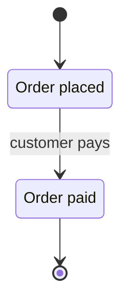

# Triage: brd

## Summary

Scope: brd-unifier findings from steps 3, 4, and 5, read against the working tree on 2026-10-01 (branch `fix/unifier-fix-round`). Duplicate IDs are triaged once: M2/R6, M4/R5, M5/R2, M7/R7, M9/R10, A1/G2, A3/G9, A4 = DEFECT 1, G5/S5/X4. That gives 44 items plus 2 new items.

**Status (44 items):** Present 38, Not a skill issue 5 (A2, A11, G14, G16, G17), Not reproducible 1 (M3), Fixed 0, Partly fixed 0.

**Class (38 Present):** M 12, S 20, D 6.

- M: M1, M2/R6, M4/R5, M7/R7, M8, A6, A14, G3, G7, G12, G15, ST5.
- S: M5/R2, M6, M9/R10, R3, R4, R8, R9, A3/G9, A4 (DEFECT 1), DEFECT 2, A8, A9, A10, A12, A13, G1, G6, G8, G11, G13.
- New items: N-1 (M), N-2 (M).

**D items:**

- R1: re-chunk and deviation rule 4 disagree on collapsing 05 and `06*`. Recommend: re-chunk always writes one `06*` chunk per persona.
- A1/G2: the consistency check has no stop condition (5 runs in 3.5 h; 13 runs). Recommend: scoped reruns of the changed chunks, at most 3 runs per session.
- A5: a MoSCoW Should item in a later roadmap phase goes to scope or to the wishlist. Recommend: MoSCoW decides scope, the phase labels the scope item.
- G5/S5/X4: no rule for the cover Status, Date, and approver after a change. Recommend: a change to an Approved BRD sets In Review; Approved and the approver only on the user's word.
- G10: editorial rewording is not on the "not a content change" list. Recommend: list it (no fact, number, rule, actor, ID, or meaning changed); when unsure, treat it as content.
- W-10: go-live and launch conditions have no home (the review added G6 and a legal table). Recommend: a `Needed before` column in the 02 Dependencies table; no G6.

## Items

### M1: The merge's structure list has no stated source

- Status: Present
- Evidence: `brd-unifier/chunking.md:136` "After chunk 05, write `## Detailed Use Cases` and the structure list once." No rule says where the list comes from. It exists word for word in `TEMPLATE-COMBINED.md:218-229` and `chunks/06a-use-cases-detailed.md:14-25`, and a legacy `06*` chunk may have none (`step3-findings.md:15`).
- Class: M
- Fix: two edits in `brd-unifier/chunking.md`.

Edit 1. current:
```text
write `## Detailed Use Cases` and the structure list once.
```
new:
```text
write `## Detailed Use Cases` and the structure list once, as `TEMPLATE-COMBINED.md` gives it (also when a `06*` chunk has none).
```
Edit 2. current:
```text
restore the title `# Detailed Use Cases - [Persona]` and the structure list
```
new:
```text
restore the title `# Detailed Use Cases - [Persona]` and the structure list of `chunks/06a-use-cases-detailed.md`
```
- Files: `brd-unifier/chunking.md`

### M2 / R6: Figures and Tables indices: "if they exist" against "always present"

- Status: Present
- Evidence: `chunking.md:158` "5. Regenerates the Figures and Tables indices if they exist." against `modes.md:128` "6. Regenerate the Figures and Tables indices." and `chunking.md:111` "include an empty skeleton; populate as Mermaid figures and tables are added across other chunks." The skeleton comments add a third reading: `chunks/00-cover-and-changelog.md:29` and `TEMPLATE-COMBINED.md:24` "Include Figures and Tables indices if the document is large." (`step3-findings.md:16`, `:34`)
- Class: M (the Skip rule is the rule: chunk 00 always has the indices, as the skeleton's own tables show)
- Fix: three edits.

Edit 1, `brd-unifier/chunking.md`. current:
```text
5. Regenerates the Figures and Tables indices if they exist.
```
new:
```text
5. Regenerates the Figures and Tables indices (chunk 00 always has them: § Skip rules).
```
Edit 2, `brd-unifier/chunks/00-cover-and-changelog.md`, and Edit 3, `brd-unifier/TEMPLATE-COMBINED.md` (same text in both). current:
```text
Include Figures and Tables indices if the document is large.
```
new:
```text
The Figures and Tables indices are always present, empty until the first figure or table (chunking.md § Skip rules).
```
- Files: `brd-unifier/chunking.md`, `brd-unifier/chunks/00-cover-and-changelog.md`, `brd-unifier/TEMPLATE-COMBINED.md`

### M3: Chunks 15 and 16 without a `MERGE:` key

- Status: Not reproducible. `chunking.md:152` merges by chunk number ("13, then 15 and 16 when they exist") and names 14 and 17 as never merged. A missing `MERGE:` key cannot drop 15 or 16 or pull in 14 or 17, and the run merged them correctly.
- Evidence: `chunking.md:152` "On merge, chunks are concatenated in numeric order (00, 01, ... 13, then 15 and 16 when they exist). **Chunks 14 (`14-todo.md`) and 17 (`17-for-ppt.md`) are never merged**"
- Class: none
- Fix: none
- Files: none

### M4 / R5: `---` separators at chunk boundaries

- Status: Present
- Evidence: `chunking.md:156` "3. Concatenates with a single blank line between chunks (no extra `---` separators unless the template calls for one)." against `modes.md:126` "4. Concatenate with a single blank line between chunks." `TEMPLATE-COMBINED.md` has a `---` line before every `#` heading, so the merge added 16. Re-chunk (`chunking.md:169-179`) says nothing; the re-chunk run dropped them (`step3-findings.md:18`, `:33`).
- Class: M (chunking.md follows the template; modes.md omits the exception; re-chunk needs the mirror)
- Fix: three edits.

Edit 1, `brd-unifier/chunking.md`. current:
```text
3. Concatenates with a single blank line between chunks (no extra `---` separators unless the template calls for one).
```
new:
```text
3. Concatenates with a single blank line between chunks, and a `---` line before each chunk that starts with a `# ` heading, as the template has before every `# ` heading. No other `---` is added.
```
Edit 2, `brd-unifier/modes.md`. current:
```text
4. Concatenate with a single blank line between chunks.
```
new:
```text
4. Concatenate with a single blank line between chunks, and a `---` line before each chunk that starts with a `# ` heading (`chunking.md` § Merge handling).
```
Edit 3, `brd-unifier/chunking.md` (re-chunk step 4b). current:
```text
Same-file anchors that point at another chunk become file links again.
```
new:
```text
Same-file anchors that point at another chunk become file links again. The `---` line just before a chunk's first `# ` heading only separates chunks in the combined file: leave it out.
```
- Files: `brd-unifier/chunking.md`, `brd-unifier/modes.md`

### M5 / R2: Table of Contents format on merge and re-chunk

- Status: Present
- Evidence: `chunking.md:157` "4. Regenerates the Table of Contents in chunk 00 against the merged heading outline." It gives no format or depth, nothing for a cover without one, and nothing on whether 14 is listed. Re-chunk (`chunking.md:169-179`) is silent, so a round trip adds a ToC the original never had. The chunk 00 skeleton (`chunks/00-cover-and-changelog.md:27-29`) has the heading and a comment but no ToC body, and two runs wrote two formats: a table (`_fixtures/chain/run-2026-10-01-e2e/brd-loyalty-points/00-cover-and-changelog.md:30`) and a numbered list (`_fixtures/scenarios/pre-brd-to-brd/run/brd-clinic-reminders/00-cover-and-changelog.md:29`). (`step3-findings.md:19`, `:30`)
- Class: S
- Fix: Recommended: in chunks, one link per chunk file in order (00 to 13 with every `06*` chunk, then 14, 15 to 17 once written, `decision-log.md` once it exists); in a merged file, one link per `#` and `##` heading, then the files that are never merged; a re-chunk rebuilds the chunk list. Why: every run then writes the same Table of Contents, and the round trip gives back the chunk-mode one. Three edits.

Edit 1, `brd-unifier/chunking.md`. current:
```text
4. Regenerates the Table of Contents in chunk 00 against the merged heading outline.
```
new:
```text
4. Regenerates the Table of Contents in chunk 00 against the merged heading outline: one link per `#` and `##` heading, in order, then the files that are never merged (`14-todo.md`, `decision-log.md` once it exists, `17-for-ppt.md` once written). A cover without a Table of Contents gets one.
```
Edit 2, `brd-unifier/chunking.md` (re-chunk step 6). current:
```text
(`**Generation:** whole`; the **Source** line names the combined file).
```
new:
```text
(`**Generation:** whole`; the **Source** line names the combined file). Rebuild chunk 00's Table of Contents as the chunk list that `chunks/00-cover-and-changelog.md` shows.
```
Edit 3, `brd-unifier/chunks/00-cover-and-changelog.md`. current:
```text
## Table of Contents
```
new:
```text
## Table of Contents

- [00 Cover, Changelog & Table of Contents](./00-cover-and-changelog.md)
- [NN Chunk title](./NN-chunk-file.md)

<!-- One line per chunk file, in order: 00-13 (one line per 06* chunk), then 14, then 15-17 once written, then decision-log.md once it exists. -->
```
- Files: `brd-unifier/chunking.md`, `brd-unifier/chunks/00-cover-and-changelog.md`

### M6: Link text and plain-text chunk references on merge

- Status: Present
- Evidence: `chunking.md:144` "A link to a whole chunk points at the anchor of its first heading." Nothing says what happens to link text that names a file, or to plain text such as "chunk 11" (`step3-findings.md:20`).
- Class: S
- Fix: Recommended: keep both as written, in both directions. Why: the merged file is a view, and unchanged text lets a re-chunk give back every line (the step 3b round trip relied on it).

`brd-unifier/chunking.md`. current:
```text
- Links to files that are never merged (`14-todo.md`, `17-for-ppt.md`, `decision-log.md`) stay file links in both directions.
```
new:
```text
- Links to files that are never merged (`14-todo.md`, `17-for-ppt.md`, `decision-log.md`) stay file links in both directions.
- Link text and plain-text chunk references ("chunk 11") are copied as they are, in both directions.
```
- Files: `brd-unifier/chunking.md`

### M7 / R7: Which steps a pure conversion runs; the Changes Log row

- Status: Present
- Evidence: `transform-detection.md:16-17` classify merge and re-chunk as TRANSFORM. `SKILL.md:171-177` sends every TRANSFORM through `sow-transformation.md`, whose sanity check reads "The Changes Log has a row for this transformation" (`sow-transformation.md:246`). Against that, `delivery-chunks.md:426` "Only a **content change** bumps the version: a change to what chunks 00-13 say about the product." No file says which workflow steps a pure conversion runs (`step3-findings.md:21`, `:35`).
- Class: M (the Version rule is right: a merge changes the layout, not what the BRD says)
- Fix: three edits.

Edit 1, `brd-unifier/transform-detection.md`. current:
```text
there is nothing to review between parts.
```
new:
```text
there is nothing to review between parts. A pure conversion runs only SKILL.md step 10 and `chunking.md` § Merge handling or § Re-chunk handling: no `sow-transformation.md` mapping or sanity checks, no reviewer pass, and no version bump.
```
Edit 2, `brd-unifier/SKILL.md`. current:
```text
**TRANSFORM intent (either mode):**
```
new:
```text
**TRANSFORM intent (either mode; a merge or re-chunk is a pure conversion and follows step 10 only):**
```
Edit 3, `brd-unifier/delivery-chunks.md`. current:
```text
- a task's Delivery status in 15, and a case's Testing Result and Testing Comment in 16: execution tracking, recorded at any time, whether the gate is open or shut.
```
new:
```text
- a task's Delivery status in 15, and a case's Testing Result and Testing Comment in 16: execution tracking, recorded at any time, whether the gate is open or shut;
- a merge or re-chunk (`chunking.md`): the layout changes, not what the BRD says.
```
- Files: `brd-unifier/transform-detection.md`, `brd-unifier/SKILL.md`, `brd-unifier/delivery-chunks.md`

### M8: "project root" is undefined

- Status: Present
- Evidence: `SKILL.md:98` "look in the project root for `AGENTS.md` (or `AGENT.md`) and `ui-ux-global-constitution.md`". The BRD goes to `./brd-[project-slug]/` (`SKILL.md:158`). Elsewhere in the suite, the project root is the folder that holds the document folders: `lld-unifier/chunking.md:157` "at the project root, beside the `lld-[project-slug]/` folder" (`step3-findings.md:22`).
- Class: M (align with the suite's meaning)
- Fix: `brd-unifier/SKILL.md`. current:
```text
look in the project root for
```
new:
```text
look in the project root (the folder that holds the BRD folder or file, normally the working directory) for
```
- Files: `brd-unifier/SKILL.md`

### M9 / R10: Gate check when a merge or re-chunk carries chunks 15 and 16

- Status: Present
- Evidence: `chunking.md:152` merges 15 and 16 "when they exist", and `chunking.md:176` turns the combined sections into chunks 15 and 16. Neither says whether the gate is checked. The gate covers generating and refreshing: `delivery-chunks.md:26` "Chunks 15, 16, and 17 cannot be generated or refreshed until every action item in `14-todo.md` is closed." The fixture would fail G5 (`step3-findings.md:23`, `:38`).
- Class: S
- Fix: Recommended: copy 15 and 16 as they are, status line included, and check no gate. Why: a layout change neither generates nor refreshes them, and a `Stale` chunk keeps saying `Stale` in the new layout. Two edits in `brd-unifier/chunking.md`.

Edit 1. current:
```text
6. Writes to `BRD-[ProjectName]-v[X.X]-MERGED.md` alongside the chunks.
```
new:
```text
6. Writes to `BRD-[ProjectName]-v[X.X]-MERGED.md` alongside the chunks. Chunks 15 and 16 are copied as they are, status line included: a merge is not a refresh, so no gate is checked.
```
Edit 2. current:
```text
sections become chunks 15 and 16.
```
new:
```text
sections become chunks 15 and 16, copied as they are with their status line; like a merge, this checks no gate.
```
- Files: `brd-unifier/chunking.md`

### R1: Deviation rule 4 collapses 05 and `06*` on a conversion; re-chunk writes one `06*` per persona

- Status: Present
- Evidence: `chunking.md:103` "Collapse `05-user-journeys-overview.md` and `06a-use-cases-*.md` into one chunk, `05-user-journeys-and-use-cases.md`, but only in a run that is `whole` from the start or on an explicit conversion (SKILL.md step 10)." against `chunking.md:170` "Split the `## Detailed Use Cases` section at each `### Use Cases - [Persona]` heading: one `06*` chunk per persona, in order." Collapsing would break the file links to `06a` and `06b` (14-todo, chunk 13 text, SDD §7.3); the run kept them (`step3-findings.md:29`).
- Class: D (file layout and chunk structure)
- Options:
  - A. Rule 4 applies only to a fresh `whole` generation; a re-chunk always writes one `06*` chunk per persona (drop "or on an explicit conversion (SKILL.md step 10)"). Tradeoff: one layout rule for conversions and an exact round trip; a small combined BRD re-chunks into one or two more files than rule 4 gives.
  - B. A re-chunk applies rule 4 only when the source came from COMBINED mode (no `06*` file ever existed); a `-MERGED.md` file goes back to its `06*` chunks. Tradeoff: fewer files for small combined BRDs and an exact round trip; two paths to describe and test.
  - C. A re-chunk applies rule 4 whenever the counts fit and repoints every link. Tradeoff: fewest files; links held outside the folder (SDD §7.3, LLD traces) break, and the round trip changes the layout.
- Recommendation: A. Stable file names are a suite rule (`README.md:48` "Numbers never shift, so links stay valid"), and the SDD and LLD link `06*` files.
- Files: `brd-unifier/chunking.md` (§ When to deviate, rule 4). The "Collapsed layout" notes in `chunking.md` § Heading map and `delivery-chunks.md` § Special cases stay: they still serve a `whole` generation.

### R3: Reversing a whole-chunk anchor on re-chunk

- Status: Present
- Evidence: `chunking.md:144` "A link to a whole chunk points at the anchor of its first heading." and `:145` "On re-chunk, these anchors become file links again." It does not say `./X.md` or `./X.md#anchor`. The `06*` group anchors (`### Use Cases - [Persona]`) do not exist in the chunks, so only `./X.md` works for them (`step3-findings.md:31`).
- Class: S
- Fix: Recommended: `./X.md` for every first-heading anchor. Why: it is the exact reverse of the merge rule and the only form that works for `06*`.

`brd-unifier/chunking.md`. current:
```text
- On re-chunk, these anchors become file links again.
```
new:
```text
- On re-chunk, these anchors become file links again. The anchor of a chunk's first heading becomes a link to the whole file (`./08-integrations.md`): the `06*` group anchors do not exist in the chunks.
```
- Files: `brd-unifier/chunking.md`

### R4: Which header keys a re-chunk writes

- Status: Present
- Evidence: `chunking.md:173` "a. Prepend the chunk header from its skeleton (`<!-- CHUNK: NN ... -->`, with the keys in § Chunk header)." § Chunk header (`chunking.md:73-90`) lists six keys plus TYPE and MERGE, but the skeletons have more (chunk 05 LANGUAGE; chunk 16 DATE, GATE, PURPOSE, RULES, and "VERSION: [X.X] (baselined against BRD v[X.X])"). A merge strips headers (`chunking.md:154`), so old values cannot come back (`step3-findings.md:27`, `:32`).
- Class: S
- Fix: Recommended: the skeleton's full header, filled from the combined file. Why: the skeleton is the template, and the values that matter can be read from the file.

`brd-unifier/chunking.md`. current:
```text
a. Prepend the chunk header from its skeleton (`<!-- CHUNK: NN ... -->`, with the keys in § Chunk header).
```
new:
```text
a. Prepend the chunk header from its skeleton, with every key the skeleton has (`<!-- CHUNK: NN ... -->`), filled with this BRD's values: TITLE from the chunk's title, VERSION from the combined file's cover, and for chunk 16 the baseline from its `Baseline:` line. A merge strips headers, so earlier header values are not restored.
```
- Files: `brd-unifier/chunking.md`

### R8: Re-chunk step 7 for a `-MERGED.md` source

- Status: Present
- Evidence: `chunking.md:178` "7. `14-todo.md` and `17-for-ppt.md` already exist as files in `./brd-[slug]/` (combined mode writes them there). Keep them, and repoint their BRD links from the combined file to the new chunk files." A `-MERGED.md` file sits inside the chunk folder, and a merge never repoints the to-do links, so they already point at chunk files (`step3-findings.md:36`).
- Class: S
- Fix: Recommended: keep those links. Why: they already resolve.

`brd-unifier/chunking.md`. current:
```text
Keep them, and repoint their BRD links from the combined file to the new chunk files.
```
new:
```text
Keep them, and repoint their BRD links from the combined file to the new chunk files. When the source is a `-MERGED.md` file in the chunk folder, their links already point at the chunk files: keep them.
```
- Files: `brd-unifier/chunking.md`

### R9: The master skeleton hard-codes a `decision-log.md` link

- Status: Present
- Evidence: `chunks/brd-master.md:113` "| Decision history & clarification Q&A (companion register) | `[decision-log.md](./decision-log.md)` once it exists; created on the first decided clarification |". A master written before the register exists gets a broken link plus instruction text. The 15 to 17 rows use plain text and a comment instead (`chunks/brd-master.md:122-126`) (`step3-findings.md:37`).
- Class: S
- Fix: Recommended: the 15 to 17 pattern: plain text until the file exists, the instruction in a comment. Instruction comments may stay in a generated master, as the 15 to 17 one does; no new rule. Why: no broken link, and one pattern for every file that comes later.

`brd-unifier/chunks/brd-master.md`. current:
```text
| Decision history & clarification Q&A (companion register) | [decision-log.md](./decision-log.md) once it exists; created on the first decided clarification |
```
new:
```text
| Decision history & clarification Q&A (companion register) | decision-log.md (not created yet) |

<!-- Turn decision-log.md into a link ([decision-log.md](./decision-log.md)) once it exists: it is created on the first decided clarification. -->
```
- Files: `brd-unifier/chunks/brd-master.md`

### A1 / G2: The consistency check has no stop condition

- Status: Present
- Evidence: `delivery-chunks.md:159` "Run the check during generation and record it as Run 1; rerun it whenever chunks 00-13 change." and `:185` "After corrections, **recheck** and add a run row." Check-raised items go through the acceptance loop "before anything is applied" (`:445`), and every accepted answer is a content change, so each run starts the next. Step 3a: 5 runs in 3.5 h (23, 9, 8, 7, 5 findings); B1: 13 runs (`step3-findings.md:67`, `step4-findings.md:7`, `:11`).
- Class: D (changes when step 2 and G2 can complete)
- Options:
  - A. One full run per session. Apply every decision in hand first, then run the check once; apply its mechanical corrections and recheck only the corrected spots. Findings that need a decision become OI or TD rows, and applying them makes the next full run due on the next "update the todo". Tradeoff: every session ends; step 2 completes only in a session whose full run raises nothing new, so it can take more sessions.
  - B. Scoped reruns with a cap. After a full run, each rerun checks only the chunks changed since the last run and the chunks that link to them. Stop when a run raises nothing new, or after 3 runs in the session; findings left at the cap stay as CF or TD rows. Tradeoff: usually converges in one session; a cross-chunk effect outside the changed set waits for the next full run.
  - C. Stop on convergence only: rerun the full check until a run raises nothing that needs a decision. Tradeoff: closest to today; still unbounded when every run finds something new.
  - D. Keep the current rule. Tradeoff: correct but unbounded.
- Recommendation: B. A short scoped run keeps G2's "a run after the last change" true, and the cap bounds the session, which the 13-run case shows is needed.
- Files: `brd-unifier/delivery-chunks.md` (§ Step 2: the rerun rule and "After corrections, recheck"; § Refresh triggers, the step fall-back paragraph; § Special cases, check-raised items), `brd-unifier/chunks/14-todo.md` (§ Step 2 completion criteria; the Check runs table, whose Scope column already fits a scoped run; § Step 3 completion criteria), `brd-unifier/SKILL.md` (step 8a.2; the step 10 "update the todo" row).

### A2: Check-raised open items are walked through with the user

- Status: Not a skill issue. `delivery-chunks.md:445` is clear: walk the user through them "with the same acceptance loop (SKILL.md step 8) before anything is applied". The run's accept-all answered that loop. The loop it feeds is A1.
- Evidence: `delivery-chunks.md:445` "walk the user through them with the same acceptance loop (SKILL.md step 8) before anything is applied" (`step3-findings.md:68`)
- Class: none
- Fix: none (see A1)
- Files: none

### A3 / G9: "Corrected" when an applied decision already confirms the text

- Status: Present
- Evidence: `delivery-chunks.md:180` "`Corrected ([where], [date])` - only for **confirmed corrections**: the user confirmed it, or it is mechanical with an unambiguous source of truth already fixed by this skill". It does not say whether an applied decision counts as the user's confirmation for text the decision did not name. The runs said yes: "Corrected (04, 05, 06b Preconditions, 2026-10-01; completes accepted OI-07 and OI-20)" (clinic `14-todo.md:180`, also CF-04, 14, 25, 26, 33, 34, 47) and "confirmed by TD-10" (LOYALTY CF-07, CF-09, CF-13) (`step3-findings.md:69`, `step4-findings.md:18`).
- Class: S
- Fix: Recommended: yes, when the correction only carries an applied decision to text that still contradicts it or leaves it out, and names the decision's ID; anything the decision does not state stays an open item. Why: the user already decided, and asking again only lengthens the loop (A1).

`brd-unifier/delivery-chunks.md`. current:
```text
the user confirmed it, or it is mechanical
```
new:
```text
the user confirmed it (directly, or through an applied decision that the correction only carries to text that still contradicts it or leaves it out; name the decision's ID), or it is mechanical
```
- Files: `brd-unifier/delivery-chunks.md`

### A4 (DEFECT 1): The reviewer removed the pre-BRD verdict word

- Status: Present
- Evidence: `sow-transformation.md:181` "Cite the verdict (`Go`, `Conditional Go`, or `No-Go`) with a link; never restate the scores." against `:171` "Market figures, scores, and verdicts stay in the pre-BRD: cite them with a link, never copy them (one fact, one home)." The reviewer brief (`SKILL.md:211-223`) carries neither. Run: chunk 01 before review "The pre-BRD synthesis returns **No-Go** as scoped" (`brd-clinic-reminders.before-review/01-executive-summary-and-context.md:35`); OI-03 (Duplication) said "verdicts are meant to stay in the pre-BRD and be cited by link" (`brd-clinic-reminders/13-open-items-and-clarifications.md:69`); after acceptance chunk 01 reads "The pre-BRD's go / no-go verdict and its conditions are in [pre-BRD 22 ...]" (`brd-clinic-reminders/01-executive-summary-and-context.md:35`).
- Class: S (the mapping row is the rule the step 3 report calls required; line 171 and the brief must agree with it)
- Fix: Recommended: the verdict word stays next to its link, and the reviewer brief says that is a citation. Why: the step 3 report calls its removal a defect, and a reader should see a No-Go at once. Two edits.

Edit 1, `brd-unifier/sow-transformation.md`. current:
```text
Market figures, scores, and verdicts stay in the pre-BRD: cite them with a link, never copy them (one fact, one home).
```
new:
```text
Market figures and scores stay in the pre-BRD: cite them with a link, never copy them (one fact, one home). The verdict word (`Go`, `Conditional Go`, or `No-Go`) is named next to its link, as the 22-23 row says: that is a citation, not a copy.
```
Edit 2, `brd-unifier/SKILL.md` (reviewer prompt skeleton). current:
```text
duplication (the same fact stated in two chunks, or source content restated where a cross-reference belongs: one fact, one home)
```
new:
```text
duplication (the same fact stated in two chunks, or source content restated where a cross-reference belongs: one fact, one home; a pre-BRD verdict word named next to its link is a citation, not a duplicate)
```
- Files: `brd-unifier/sow-transformation.md`, `brd-unifier/SKILL.md`

### DEFECT 2: BO-11 keeps a price the pre-BRD flags, with no marker

- Status: Present (the rule exists, but "where it applies" does not lead from the item's Where to the BRD homes; the run missed it)
- Evidence: `sow-transformation.md:182` "An open item becomes a `[NEEDS CLARIFICATION: ...]` marker where it applies." Pre-BRD OI-10 (Where: "07 ARPU row ... 03 Revenue Streams ... 15 O3 KR2 ... 21 Pricing") questions the EGP 650 planning price (`pre-brd-clinic-reminders/24-open-items-and-assumptions-log.md:164-168`), yet `brd-clinic-reminders/01-executive-summary-and-context.md:55` reads "Monthly recurring revenue of EGP 26,000 (40 clinics x EGP 650) by 2027-09-30" with no marker (`step3-findings.md:65`).
- Class: S
- Fix: Recommended: an item marks every BRD home that took content from a chunk its Where names. Why: it turns "where it applies" into a lookup the author can do from the item itself.

`brd-unifier/sow-transformation.md`. current:
```text
An open item becomes a `[NEEDS CLARIFICATION: ...]` marker where it applies.
```
new:
```text
An open item becomes a `[NEEDS CLARIFICATION: ...]` marker at every BRD home that took content from a chunk its Where names (an item on 15 OKRs marks the business objective made from that key result).
```
- Files: `brd-unifier/sow-transformation.md`

### A5: A MoSCoW Should item in a later roadmap phase

- Status: Present
- Evidence: `sow-transformation.md:178` "Must and Should items go in scope; Could and Won't items go out of scope or to the wishlist." against `:180` "A phase that changes system behaviour becomes scope or use cases (...); later phases go to the wishlist." A Should item in a later phase fits both rows. The run put such items in scope under "**Paid launch (from 2027-04-01):**" (`brd-clinic-reminders/04-scope-and-personas.md`) (`step3-findings.md:71`).
- Class: D (decides what the BRD specifies in detail)
- Options:
  - A. MoSCoW decides scope: Must and Should are in scope, each scope item labelled with its roadmap phase; only later phases that hold Could or Won't items go to the wishlist. Tradeoff: one scope list shows the release order, which the SDD and chunk 15 use; some programme timing enters the BRD.
  - B. The roadmap decides: only the first release is in scope; later phases go to the wishlist whatever their MoSCoW class. Tradeoff: a lean BRD; Should items get no detailed use cases until a new version.
  - C. MoSCoW decides scope, and the phases and dates stay in pre-BRD 21, linked from 04 (§ "Timeline" keeps timing out of the BRD). Tradeoff: no timing in the BRD; the release order must be read in the pre-BRD.
- Recommendation: A. It is what the step 3 run produced, it keeps both rows true, and downstream skills need to know which scope comes first.
- Files: `brd-unifier/sow-transformation.md` (§ pre-BRD to BRD, rows "13 RICE, 14 MoSCoW" and "21 Roadmap and Project Plan").

### A6: The quote rule against `stateDiagram-v2` transition labels

- Status: Present
- Evidence: `mermaid-diagrams.md:151` "- Wrap every node label and every edge label in double quotes." against `:23`, which maps a concept lifecycle to `stateDiagram-v2`, whose transition syntax (`A --> B : label`) has no quoted form (`step3-findings.md:72`).
- Class: M (the dialect's syntax wins)
- Fix: `brd-unifier/mermaid-diagrams.md`. current:
```text
- Wrap every node label and every edge label in double quotes. No double quotes, Markdown, or line breaks inside a label.
```
new:
```text
- Wrap every node label and every edge label in double quotes. No double quotes, Markdown, or line breaks inside a label. In `stateDiagram-v2`, declare a state with a business name as `state "Order placed" as Placed`, and write a transition label after the colon, unquoted: `Placed --> Paid : customer pays`.
```
- Files: `brd-unifier/mermaid-diagrams.md` (see N-1 for the example block)

### A8: One to-do row per distinct question against many proposals

- Status: Present
- Evidence: `delivery-chunks.md:139` "One row per **distinct question**: when the same question sits in several places (...), it is one row whose Source lists every location." The clinic run put 74 proposal markers into 17 rows, for example TD-16 "Confirm or replace 5 proposals: account opening; sender model (pre-BRD OI-15); report opt-in later; not-ready state; owner-only setup." (`brd-clinic-reminders/14-todo.md:93`) (`step3-findings.md:74`).
- Class: S
- Fix: Recommended: allow one row per use case (or chunk section) for its proposals, naming each, as the run did. Why: the product manager confirms a use case's proposals together, and 74 rows would bury the real questions.

`brd-unifier/delivery-chunks.md`. current:
```text
it is one row whose Source lists every location.
```
new:
```text
it is one row whose Source lists every location. The proposals of one use case (or one chunk section) may share a row that names each proposal; its priority is the highest among them, and it is `Resolved` when every proposal in it is confirmed or replaced.
```
- Files: `brd-unifier/delivery-chunks.md`

### A9: Repeated markers inflate the counts

- Status: Present
- Evidence: accepted OI-44 says "A criterion on a flow that is still a proposal carries the same proposal marker." (`brd-clinic-reminders/13-open-items-and-clarifications.md:645`). The counts then count one question twice: `SKILL.md:285` "- Count of inline `[NEEDS CLARIFICATION: ...]` markers, as two numbers:" and `sow-transformation.md:212`, whose 0-5, 6-14, and 15+ thresholds read these counts (`step3-findings.md:75`).
- Class: S
- Fix: Recommended: keep the repeated marker (an unconfirmed criterion must not read as settled) and count questions, not marker strings. Why: the thresholds measure the source's gaps, and the to-do already keeps one row per question. Two edits.

Edit 1, `brd-unifier/SKILL.md`. current:
```text
- Count of inline `[NEEDS CLARIFICATION: ...]` markers, as two numbers:
```
new:
```text
- Count of inline `[NEEDS CLARIFICATION: ...]` markers by question (a marker repeated for one question, on a flow and on its acceptance criterion for example, counts once), as two numbers:
```
Edit 2, `brd-unifier/sow-transformation.md`. current:
```text
count the `[NEEDS CLARIFICATION: ...]` markers in two groups
```
new:
```text
count the `[NEEDS CLARIFICATION: ...]` markers by question (a repeated marker counts once) in two groups
```
- Files: `brd-unifier/SKILL.md`, `brd-unifier/sow-transformation.md`

### A10: Pre-BRD inline markers in chunks 01-23

- Status: Present
- Evidence: `sow-transformation.md:182` covers chunk 24 only ("An open item becomes a `[NEEDS CLARIFICATION: ...]` marker where it applies."), and the rules at `:184-189` say nothing about inline markers in pre-BRD chunks 01-23. The run kept 14 requirement-relevant ones as markers, left market and team ones in the pre-BRD, and turned 4 into unmarked text: the WhatsApp share became "**WhatsApp first (assumption)**; most patients use WhatsApp." (`brd-clinic-reminders/02-glossary-assumptions-facts.md:57`) (`step3-findings.md:63`, `:76`).
- Class: S
- Fix: Recommended: write down the run's rule, with no unmarked conversions. Why: it is what row 24 already does for open items, and it stops an open pre-BRD question from becoming a settled BRD fact.

`brd-unifier/sow-transformation.md`. current:
```text
behaviour the source does not state is a proposal with the clarification marker.
```
new:
```text
behaviour the source does not state is a proposal with the clarification marker.
- An inline `[NEEDS CLARIFICATION: ...]` marker in pre-BRD chunks 01-23 goes where its content goes. When the BRD takes the marked content (a persona, a scope item, a rule, a measure, an assumption), the BRD text keeps a marker that names the pre-BRD chunk. A marker on content the BRD only links (market figures, scores, team) stays in the pre-BRD.
```
- Files: `brd-unifier/sow-transformation.md`

### A11: The snapshot's chunk 00 already lists chunk 13

- Status: Not a skill issue (test artifact of the before-review snapshot, as the log says).
- Evidence: `step3-findings.md:77` "A11 (test artifact) snapshot's 00 already lists chunk 13."
- Class: none
- Fix: none
- Files: none

### A12: A relative link inside a verbatim Technical Input breaks

- Status: Present
- Evidence: `sow-transformation.md:186` "- Business language only. A technical statement in the pre-BRD goes verbatim to Appendix § Technical Inputs for the SDD." A verbatim statement with a relative link stops resolving once it moves into the BRD folder (`step3-findings.md:78`).
- Class: S
- Fix: Recommended: repoint the link target, keep the words. Why: verbatim protects the wording, not a path that no longer resolves.

`brd-unifier/sow-transformation.md`. current:
```text
- Business language only. A technical statement in the pre-BRD goes verbatim to Appendix § Technical Inputs for the SDD.
```
new:
```text
- Business language only. A technical statement in the pre-BRD goes verbatim to Appendix § Technical Inputs for the SDD. A relative link inside it is repointed so it still resolves from the BRD folder; the words stay as they are.
```
- Files: `brd-unifier/sow-transformation.md`

### A13: No author in the source

- Status: Present
- Evidence: `chunks/00-cover-and-changelog.md:13` "**Author:** [Author Name]" (same at `TEMPLATE-COMBINED.md:4`). No rule covers a source with no author, and the author also fills the to-do Owner cells (`delivery-chunks.md:125`). The run wrote "Clinic Reminders founding team" (`step3-findings.md:79`).
- Class: S
- Fix: Recommended: a clarification marker, as for any missing fact. Why: principle 8 forbids an invented value, and the marker reaches the to-do as one small question. (Other option: add the author to the first intake question.) Edit both files with the same text.

`brd-unifier/chunks/00-cover-and-changelog.md` and `brd-unifier/TEMPLATE-COMBINED.md`. current:
```text
**Author:** [Author Name]
```
new:
```text
**Author:** [Author Name, as the source or the user gives it; never invented. None given: `[NEEDS CLARIFICATION: Who is the BRD author?]`]
```
- Files: `brd-unifier/chunks/00-cover-and-changelog.md`, `brd-unifier/TEMPLATE-COMBINED.md`

### A14: When `decision-log.md` is created

- Status: Present
- Evidence: `decision-log.md:8` "- Created on first use: when the first clarification is raised or decided." against `SKILL.md:339` "Created on first use (the first decided clarification)" and `chunks/brd-master.md:113` "created on the first decided clarification". `decision-log.md:14` keeps open items out of the register. The run created it at intake for two answered intake questions (Q-01, Q-02), which "decided" allows (`step3-findings.md:80`).
- Class: M ("decided" is the rule SKILL.md and the master follow)
- Fix: `brd-unifier/decision-log.md`. current:
```text
- Created on first use: when the first clarification is raised or decided. Do not write an empty register.
```
new:
```text
- Created on first use: when the first clarification is decided (SKILL.md step 8). Do not write an empty register.
```
- Files: `brd-unifier/decision-log.md`

### G1: Running grill-me when the runtime cannot load a skill by name

- Status: Present (the fixture to-do's missing step 3 inputs and prompt are fixture staleness, G17)
- Evidence: the "Running outside Claude Code" table (`SKILL.md:27-33`) has rows for `CLAUDE.md`, the Agent tool, AskUserQuestion, Miro, and invoking this skill, but none for `/grill-me`, which to-do step 3 tells the user to run (`delivery-chunks.md:191`; `chunks/14-todo.md:135-146`). The local grill-me skill only says "Call the Skill tool with "grilling"" (`step4-findings.md:10`).
- Class: S
- Fix: Recommended: one table row in brd-unifier's own text; nothing in `grill-me/` or `grilling/`. Why: the step 3 prompt is already self-contained; only the way to start it differs by runtime.

`brd-unifier/SKILL.md`. current:
```text
| Miro MCP | Use only if a Miro tool is available; otherwise follow this skill's rule for when Miro is unavailable. |
```
new:
```text
| Miro MCP | Use only if a Miro tool is available; otherwise follow this skill's rule for when Miro is unavailable. |
| `/grill-me` in the to-do (step 3) | The user starts the step 3 prompt the runtime's way (`$grill-me`, `/skill:grill-me`). If that skill only hands over to another skill and the runtime cannot load a skill by name, open that skill's `SKILL.md` and follow it. With no grill-me skill, drop `/grill-me` and paste the rest of the prompt into a new chat. |
```
- Files: `brd-unifier/SKILL.md`

### G3: Grill-me decisions with and without an open item

- Status: Present
- Evidence: `delivery-chunks.md:192` "apply confirmed decisions to the affected chunks through the step 8 mechanics (OI status, Resolution Log, Changes Log)" and `:446` "A grill-me decision that matches no `OI-NN` gets its own `TD-NN` row, status `Resolved`, pointing at the Changes Log entry." Step 3 does not point to the TD route, and neither line names the `decision-log.md` record that `SKILL.md:233` (step 8.3) and principle 12 require. The skeleton repeats the short list (`chunks/14-todo.md:148`) (`step4-findings.md:12`).
- Class: M (step 8.3 is the rule; the two lists are incomplete, not in conflict)
- Fix: three edits.

Edit 1, `brd-unifier/delivery-chunks.md`. current:
```text
through the step 8 mechanics (OI status, Resolution Log, Changes Log), rerun step 2
```
new:
```text
through the step 8 mechanics (OI status, Resolution Log, `decision-log.md` record, Changes Log; a decision that matches no `OI-NN` gets its own `TD-NN` row, § Special cases), rerun step 2
```
Edit 2, `brd-unifier/delivery-chunks.md`. current:
```text
pointing at the Changes Log entry.
```
new:
```text
pointing at the Changes Log entry, and a `decision-log.md` record like any other decision (SKILL.md step 8.3).
```
Edit 3, `brd-unifier/chunks/14-todo.md`. current:
```text
Confirmed decisions are applied to the affected chunks (status, Resolution Log, Changes Log), and step 2 is rerun.
```
new:
```text
Confirmed decisions are applied to the affected chunks (status, Resolution Log, decision-log record, Changes Log; a TD row for a decision with no open item), and step 2 is rerun.
```
- Files: `brd-unifier/delivery-chunks.md`, `brd-unifier/chunks/14-todo.md`

### G5 / S5 / X4 (brd side): Cover Status and Date after a change; the approver of an In Review row

- Status: Present
- Evidence: `chunks/00-cover-and-changelog.md:15` "**Status:** [Draft | In Review | Approved]" and `:21` "| Version | Updated Date | Updated By | Reviewed/Approved By | Update Summary |". The only Status rule is `parts-mode.md:121` (Draft until part 3, then `Draft`). Nothing says when Status becomes In Review or Approved, what Date shows after a change, or who fills Reviewed/Approved By. B1 raised it as CF-01 and decided it by OI-08 ("In Review"); LOYALTY v1.2 then had no approver on its 1.1 and 1.2 rows (`step4-findings.md:14`, `:45`, `:62`).
- Class: D (approval and versioning policy; it also decides what sdd-unifier sees for an unsigned source, S5)
- Options:
  - A. Status follows sign-off. A content change to an Approved BRD sets Status to `In Review` and Date to the change date, and the new Changes Log row leaves Reviewed/Approved By empty. The skill sets `Approved`, and writes the approver in that row, only when the user names the approver. Tradeoff: the cover never claims an approval that did not happen; BRDs read In Review until someone signs.
  - B. The cover shows both states ("Approved (v1.0); v1.1 In Review"). Tradeoff: nothing lost; one line with two states to read and to check.
  - C. The skill never changes Status or Reviewed/Approved By; an unsigned row under an Approved cover becomes a consistency finding and an open item. Tradeoff: no new rule; every post-approval change raises the same open item (B1's OI-08).
- Recommendation: A. It is what B1's OI-08 decided, and it gives sdd-unifier one field to read for an unsigned source BRD.
- Files: `brd-unifier/chunks/00-cover-and-changelog.md` (Status and Changes Log guidance), `brd-unifier/TEMPLATE-COMBINED.md` (cover, the same), `brd-unifier/delivery-chunks.md` (§ Refresh triggers, Version: one sentence on Status, Date, and the approver cell, separate from the bump rules owned by the version-family checker), `brd-unifier/SKILL.md` (§ Things this skill never does: never sets Approved or fills Reviewed/Approved By unless the user names the approver). CROSS-SKILL, owned by the sdd checker: `sdd-unifier/brd-to-sdd.md` § Source BRDs (what the SDD does with an In Review source, S5).

### G6: No step 5 row status for "gate met, not drawn yet"

- Status: Present
- Evidence: `delivery-chunks.md:123` "every other row is `Pending gate` until the gate opens, then `Drafted`, `Provisional (TD-NN)`, or `Final`." and `chunks/14-todo.md:227` "Status: Skipped (from the start, for planned skips) / Pending gate / Drafted / Provisional (TD-NN) / Final." A row whose gate is met but whose diagram is not drawn has no value; step 4 can run first (`step4-findings.md:15`).
- Class: S
- Fix: Recommended: reuse `Not started` from the step vocabulary. Why: no new word, and it reads correctly in the table. Two edits.

Edit 1, `brd-unifier/delivery-chunks.md`. current:
```text
every other row is `Pending gate` until the gate opens, then `Drafted`, `Provisional (TD-NN)`, or `Final`.
```
new:
```text
every other row is `Pending gate` until the gate opens, `Not started` while the gate is open and the diagram is not drawn yet, then `Drafted`, `Provisional (TD-NN)`, or `Final`.
```
Edit 2, `brd-unifier/chunks/14-todo.md`. current:
```text
Status: Skipped (from the start, for planned skips) / Pending gate / Drafted / Provisional (TD-NN) / Final.
```
new:
```text
Status: Skipped (from the start, for planned skips) / Pending gate / Not started (gate open, not drawn yet) / Drafted / Provisional (TD-NN) / Final.
```
- Files: `brd-unifier/delivery-chunks.md`, `brd-unifier/chunks/14-todo.md`

### G7: Two definitions of `Locked`

- Status: Present
- Evidence: `chunks/14-todo.md:54` "Locked (gate shut, never generated)" against `chunks/brd-master.md:130` "`Locked` means the file does not exist yet." With the gate open and 17 not requested, B1 wrote "Locked (not written: the gate is open, but it was not requested)" (`run-2026-10-01-e2e/brd-loyalty-points/loyalty-points-brd-master.md:46`), which only the master's definition allows (`step4-findings.md:16`).
- Class: M (the master's definition covers every case, including 16 waiting for 15 with the gate open)
- Fix: `brd-unifier/chunks/14-todo.md`. current:
```text
Locked (gate shut, never generated)
```
new:
```text
Locked (not written yet: it waits for the gate, or for the chunk before it)
```
- Files: `brd-unifier/chunks/14-todo.md`

### G8: A missing NFR target: fact or choice

- Status: Present
- Evidence: `delivery-chunks.md:181` "`Open item raised: OI-NN / TD-NN` - a business ambiguity: there are options and someone must **choose**." against `:182` "a missing **fact**: nobody has to choose, someone has to tell (a number, a name, a date)." A missing NFR target is a number, but the business sets it. B1 raised it as OI-04 and added NFR-03 at 1 hour (`brd-loyalty-points/13-open-items-and-clarifications.md`, OI-04) (`step4-findings.md:17`).
- Class: S
- Fix: Recommended: a target the business sets is a choice (an open item with options); a value that already exists is a fact (a TD row only). Why: it matches what B1 did and the never-invent rule, since the user picks the target.

`brd-unifier/delivery-chunks.md`. current:
```text
someone has to tell (a number, a name, a date).
```
new:
```text
someone has to tell (a number that already exists, such as a volume or a contract term; a name; a date). A target the business sets (an NFR measure, a time limit) is a choice: raise an open item.
```
- Files: `brd-unifier/delivery-chunks.md`

### G10: Editorial rewording and the "not a content change" list

- Status: Present
- Evidence: `delivery-chunks.md:426` "Only a **content change** bumps the version: a change to what chunks 00-13 say about the product." and `:428` "These are **not** content changes. They bump nothing, do not reopen step 2, and make nothing `Stale`:", followed by a list (`:430-434`) that does not name editorial rewording. B1 rewrote the Figure 2 Summary after Run 6 without a recheck (`step4-findings.md:19`).
- Class: D (changes what reopens step 2, and so G2)
- Options:
  - A. Editorial rewording that changes no fact, number, rule, actor, identifier, or meaning (a Summary line put in plain language) is not a content change: add it to the list, and when unsure treat the edit as a content change. Tradeoff: matches the existing definition and keeps reruns short; a rewording that shifts meaning can slip past step 2.
  - B. Every edit to chunks 00-13 is a content change, rewording included: it reopens step 2 and bumps the version. Tradeoff: G2 stays exact; more reruns (A1).
  - C. Rewording bumps nothing but needs a scoped recheck of the edited chunk. Tradeoff: safe and cheap per edit; two thresholds to track.
- Recommendation: A. The definition already says "what chunks 00-13 say about the product"; listing the case removes the doubt without a new threshold.
- Files: `brd-unifier/delivery-chunks.md` (§ Refresh triggers, Version: the "not content changes" list; one bullet, after the M7 bullet if both are applied).

### G11: The wave limit when `Related Task` names two tasks

- Status: Present
- Evidence: `delivery-chunks.md:297` "Every task in `Needs` comes from the Related Task's wave or an earlier one, so a task's acceptance never waits for a later wave." The same paragraph allows "a case that names both tasks in Related Task"; with tasks from two waves, "the Related Task's wave" is unclear. B1's CF-14 named TASK-01 (wave 1), TASK-03, and TASK-04 (wave 2) on TC-NFR-01 (`brd-loyalty-points/16-uat-bat-test-cases.md:105`) (`step4-findings.md:20`).
- Class: S
- Fix: Recommended: the latest of their waves is the limit. Why: the exception exists so that a task with nothing of its own to see is checked on a later screen.

`brd-unifier/delivery-chunks.md`. current:
```text
Every task in `Needs` comes from the Related Task's wave or an earlier one, so
```
new:
```text
Every task in `Needs` comes from the Related Task's wave or an earlier one (when `Related Task` names more than one task, the latest of their waves), so
```
- Files: `brd-unifier/delivery-chunks.md`

### G12: The citation label rule against chunk 16's `Related UC`

- Status: Present
- Evidence: `delivery-chunks.md:115` "Always write them with a short label (`UC-04 AC-3: customer is notified`), so a shifted bullet is easy to spot." against `:284` "`Related UC` names the use case or NFR and, in brackets, what the case proves: `UC-04 (E1, AC-3)`" and the chunk 16 skeleton, which "encodes the owner's reference format" (`SKILL.md:270`) (`step4-findings.md:21`).
- Class: M (the skeleton is the template)
- Fix: `brd-unifier/delivery-chunks.md`. current:
```text
Always write them with a short label (`UC-04 AC-3: customer is notified`), so a shifted bullet is easy to spot.
```
new:
```text
Write them with a short label (`UC-04 AC-3: customer is notified`), so a shifted bullet is easy to spot. Chunk 16's `Related UC` cell is the one exception: it keeps its fixed form, `UC-04 (E1, AC-3)` (§ Chunk 16, Format).
```
- Files: `brd-unifier/delivery-chunks.md`

### G13: No caption format for flowcharts

- Status: Present
- Evidence: `chunks/05-user-journeys-overview.md:49` captions a use-case diagram with a heading, "### Figure N - Use cases: [Overview | Persona name]"; `chunks/06a-use-cases-detailed.md:62` only says "The flowchart is a numbered figure: inline Mermaid (flowchart TD) plus the mandatory Summary line." B1 wrote a bold line, "**Figure 2 - Flowchart: UC-02 View Points History**" (`brd-loyalty-points/06a-use-cases-member.md:93`), and the Figures index links `./06a-use-cases-member.md#flowchart` (`00-cover-and-changelog.md:58`), an anchor that repeats when a chunk has several flowcharts (`step4-findings.md:22`).
- Class: S
- Fix: Recommended: a caption heading one level under `### Flowchart`, like chunk 05. Why: one pattern for both figure kinds, and each figure gets a unique anchor for the Figures index. Two edits.

Edit 1, `brd-unifier/chunks/06a-use-cases-detailed.md`. current:
```text
The flowchart is a numbered figure: inline Mermaid (flowchart TD) plus the mandatory Summary line.
```
new:
```text
The flowchart is a numbered figure: a caption heading `#### Figure N - Flowchart: UC-NN [Title]`, then inline Mermaid (flowchart TD) and the mandatory Summary line. The Figures index links the caption heading.
```
Edit 2, `brd-unifier/TEMPLATE-COMBINED.md`. current:
```text
Linear or shorter use cases get none; the skip reason is recorded in 14-todo.md.
```
new:
```text
Linear or shorter use cases get none; the skip reason is recorded in 14-todo.md. The caption is a heading, `###### Figure N - Flowchart: UC-NN [Title]`.
```
- Files: `brd-unifier/chunks/06a-use-cases-detailed.md`, `brd-unifier/TEMPLATE-COMBINED.md`

### G14: The fixture BRD never had a key colour

- Status: Not a skill issue. The skill covers a missing colour: principle 16 asks for it once (`SKILL.md:98`), and a missing key colour is a P3 to-do item (`delivery-chunks.md:151` "P3 - wording, presentation, or a design choice that changes no flow (a key colour, a missing wireframe)."). The fixture LOYALTY BRD predates the rule, and the step 4 brief answered for it.
- Evidence: `step4-findings.md:23`
- Class: none
- Fix: none
- Files: none

### G15: Chunk 16 points to an unreachable reference file

- Status: Present
- Evidence: `delivery-chunks.md:270` "come from the owner's reference file, `PricePulse/brd-pricepulse/uat-bat-test-cases.md`, encoded in the skeleton `chunks/16-uat-bat-test-cases.md`" and `:290` "Read the reference file itself when it is reachable (`PricePulse/brd-pricepulse/uat-bat-test-cases.md` in the owner's eSIM workspace)". The path is outside the skill and unreachable for other users; the skeleton already carries the format (`step4-findings.md:24`).
- Class: M (broken external reference)
- Fix: two edits in `brd-unifier/delivery-chunks.md`.

Edit 1. current:
```text
come from the owner's reference file, `PricePulse/brd-pricepulse/uat-bat-test-cases.md`, encoded in the skeleton
```
new:
```text
come from the owner's reference file, encoded in the skeleton
```
Edit 2 (delete the sentence; the paragraph then ends with "one observable outcome per case."). current:
```text
 Read the reference file itself when it is reachable (`PricePulse/brd-pricepulse/uat-bat-test-cases.md` in the owner's eSIM workspace); the skeleton carries its structure when it is not.
```
new: (nothing)
- Files: `brd-unifier/delivery-chunks.md`

### G16: The MK-NN rule against LP-01 and LP-02

- Status: Not a skill issue. The rule is clear (`delivery-chunks.md:91` "the BRD never defines its own screen IDs"; `:198`). LP-01 and LP-02 were kept by the step 4 brief; upgrading the fixture BRDs is step 6 item 2.
- Evidence: `step4-findings.md:25`
- Class: none
- Fix: none
- Files: none

### G17: Fixture quality

- Status: Not a skill issue (fixture content: the old to-do's claims, the off-skeleton master, 02 without Facts and Challenges, the non-template columns; also a six-column Changes Log in LOYALTY chunk 00). Upgrading the fixture BRDs is step 6 item 2.
- Evidence: `step4-findings.md:26`
- Class: none
- Fix: none
- Files: none

### ST5: The Stale and Locked rules omit the master's Delivery Chunks State cell

- Status: Present
- Evidence: `delivery-chunks.md:53` "mark the affected outputs `Stale` in Downstream outputs."; `:403` "IDs stay stable; statuses and links are updated; chunk 14 is always updated last."; `SKILL.md:269` "Update the Delivery gate block and the Downstream outputs rows in `14-todo.md` (`Locked`, or `Stale` if they already exist)."; `delivery-chunks.md:474` (verification). None names the State cell of the master's Delivery Chunks table (`chunks/brd-master.md:119-124`), which lld-unifier reads first: `lld-unifier/sdd-to-lld.md:53` "Read their state from the BRD master's delivery rows (or `14-todo.md` § Downstream outputs)." (`UNIFIER-ENHANCEMENTS.md` § Step 5, "Held from the (c) consistency check")
- Class: M (the master's table already has the State column; the rules only miss it)
- Fix: four edits. `SKILL.md:260` (step 8b.4), `delivery-chunks.md:393`, and the step 10 rows point to § Refresh triggers, so edit 1 covers them.

Edit 1, `brd-unifier/delivery-chunks.md`. current:
```text
Later confirmed changes must reach the downstream outputs. IDs stay stable; statuses and links are updated; chunk 14 is always updated last.
```
new:
```text
Later confirmed changes must reach the downstream outputs. IDs stay stable; statuses and links are updated; chunk 14 is always updated last. In CHUNKS mode, every state written in 14's Downstream outputs (`Locked`, `Up to date`, `Provisional (TD-NN)`, `Stale`) is written in the same run in the State cell of the master's Delivery Chunks table: `lld-unifier` reads that cell first.
```
Edit 2, `brd-unifier/delivery-chunks.md`. current:
```text
mark the affected outputs `Stale` in Downstream outputs.
```
new:
```text
mark the affected outputs `Stale` in Downstream outputs and in the master's Delivery Chunks table (§ Refresh triggers).
```
Edit 3, `brd-unifier/SKILL.md`. current:
```text
Update the Delivery gate block and the Downstream outputs rows in `14-todo.md` (`Locked`, or `Stale` if they already exist).
```
new:
```text
Update the Delivery gate block and the Downstream outputs rows in `14-todo.md` (`Locked`, or `Stale` if they already exist), and, in CHUNKS mode, the same states in the master's Delivery Chunks table.
```
Edit 4, `brd-unifier/delivery-chunks.md`. current:
```text
their Downstream outputs rows say `Locked` (or `Stale`) with the failed conditions,
```
new:
```text
their Downstream outputs rows say `Locked` (or `Stale`) with the failed conditions, the master's Delivery Chunks table shows the same states (CHUNKS mode),
```
- Files: `brd-unifier/delivery-chunks.md`, `brd-unifier/SKILL.md`

### W-10: Go-live and launch conditions have no home in the BRD template

- Status: Present
- Evidence: the delivery gate is G1-G5 and gates documents only (`delivery-chunks.md:28-36`). `delivery-chunks.md:38` "a pending dependency is resolved when the product manager decides how the BRD treats it (confirmed, replaced, or taken out of scope)": no outcome for "still pending, needed before go-live". The Dependencies table is `| Dependency | Type | Owner | Status | Notes |` (`chunks/02-glossary-assumptions-facts.md:58`). The business review needed a home for launch conditions: it added G6 (sign-off) to both BRDs, a "Legal clearances" table, and a "Needed before" column (`step5-findings.md:76`, `:98`, `:167`).
- Class: D (a template table's shape and a gate)
- Options:
  - A. A `Needed before` column in the 02 Dependencies table (a task, BAT sign-off, or go-live). A pending dependency is `Resolved` in the to-do once the product manager confirms its owner and when it is needed; the go-live ones are listed in chunk 16's Exit criteria. The delivery gate stays G1-G5. Tradeoff: one template column; legal clearances and partner confirmations get an owner and a deadline without a new gate.
  - B. A "Go-live conditions" section in chunk 04 (Condition, Owner, Needed before, Status), cited by chunk 16's Exit criteria. Tradeoff: launch conditions in one visible list; it overlaps the Dependencies table.
  - C. A G6 gate condition (the version is signed off) plus A. Tradeoff: delivery chunks wait for sign-off, which can stall the delivery team; it overlaps the cover Status decision (G5).
  - D. No template change: "needed before go-live" goes in the Dependencies Notes cell. Tradeoff: nothing to check against; the review's need stays unmet.
- Recommendation: A. The launch blockers the review found were all dependencies (partners, legal clearances), and the to-do already collects unconfirmed dependencies; sign-off belongs to the cover Status decision (G5).
- Files: `brd-unifier/chunks/02-glossary-assumptions-facts.md` and `brd-unifier/TEMPLATE-COMBINED.md` (Dependencies table; the combined Exit criteria line), `brd-unifier/sow-transformation.md` (§ "Dependencies"), `brd-unifier/delivery-chunks.md` (the `Resolved` sentence under the gate table; § Step 1, "Assumption to validate"; § Chunk 16, Exit criteria), `brd-unifier/chunks/16-uat-bat-test-cases.md` (Exit criteria line). CROSS-SKILL, owned elsewhere: `sdd-unifier/brd-to-sdd.md` § Field mapping, Dependencies row (reads the new column); business-reviewer-unifier (uses the column instead of adding tables).

## New items

### N-1: `mermaid-diagrams.md` points outside the skill folder

- Status: Present
- Evidence: `brd-unifier/mermaid-diagrams.md:163` "See `../lld-unifier/mermaid-diagrams.md` § Mermaid syntax quick reference for the dialect cheatsheet" (the line continues after a dash). Each skill is uploaded as its own folder (`README.md:468`), so the pointer breaks; it is the brd-unifier copy of sdd-unifier's D12. The BRD needs only `flowchart` (shown in this file) and `stateDiagram-v2` (not shown; the lld file has no `journey` either).
- Class: M (broken reference)
- Fix: replace the whole line 163 (the text quoted above, through its end) with the block below. If the D12 decision for sdd-unifier goes another way, follow it here too.

````text
The examples above cover `flowchart`. A concept lifecycle uses `stateDiagram-v2`:



**Summary:** An order is placed, then the customer pays for it.
````
- Files: `brd-unifier/mermaid-diagrams.md`

### N-2: The root README's Known gaps line is stale

- Status: Present
- Evidence: `README.md:541` "- The newest paths have not been run on a sample project yet: the LLD's modular-monolith path, the BRD merge and re-chunk heading map, SDD version tracking, and the pre-BRD to BRD mapping." Step 3 ran all four (`UNIFIER-ENHANCEMENTS.md` § Step 3).
- Class: M
- Fix: `README.md`. current: the bullet quoted above. new: delete it, or list only what still fails, at step 6 item 4 (README after the chain rerun), since the rerun decides what remains.
- Files: `README.md`
