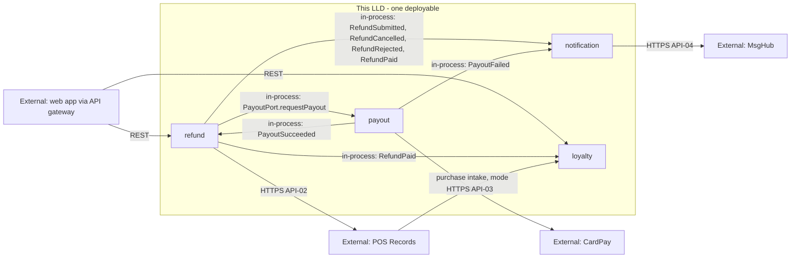

<!--
CHUNK: 02
TITLE: Context - Bounded Context & System Neighbours
PROJECT: Refunds Platform
VERSION: 1.0
PART OF: LLD - Refunds Platform
-->

# 5. Context

## 5.1 Bounded Context

This LLD covers the whole Refunds Platform deployable: four DDD modules behind one REST API, each owning one PostgreSQL schema ([SDD §8.1](../sdd-refunds-platform/04-architecture-style-and-diagrams.md#81-architecture-style), [SDD §13](../sdd-refunds-platform/09-services-summary.md#13-services-decomposition-summary)). `refund` owns refund requests and decisions, `payout` owns payouts to CardPay, `notification` owns customer and branch manager messages, and `loyalty` owns the points ledger. The modules meet only in process: one port call (API-01) and six in-process domain events (SDD §14.10). Only the provider adapters leave the process.

## 5.2 Upstream Producers (callers / event-publishers into this system)

| Upstream | Interaction | Protocol | Notes |
|----------|-------------|----------|-------|
| Angular web app (customer, branch manager, member screens) through the API gateway | Sync REST | HTTPS | Keycloak JWT; reaches the `refund` and `loyalty` REST adapters only (06 § 9.1) |
| POS Records member purchase intake (Retail IT team) | Mode open (SDD §12 INT-03 (b)) | TBD | Inbound to `loyalty` through `PurchaseIntakePort`; idempotent on the purchase reference |

## 5.3 Downstream Consumers (systems this LLD's services call / publish to)

| Downstream | Interaction | Protocol | Notes |
|------------|-------------|----------|-------|
| POS Records | Sync REST (API-02) | HTTPS | Called by `refund` on the request thread, outside any database transaction |
| CardPay Ltd | Sync REST (API-03) | HTTPS | Called only by the `payout` dispatcher |
| MsgHub | Sync REST (API-04) | HTTPS | Called only by the `notification` dispatcher |
| Keycloak | Token key fetch (JWKS) | HTTPS | Token validation inside the deployable (ADR-07) |
| PostgreSQL 17+ | JDBC | TLS | One database, schemas `refund`, `payout`, `notification`, `loyalty`, `platform` |

## 5.4 Cross-Service Dependencies (within this LLD)

**Summary:** the web app calls `refund` and `loyalty`; `refund` calls `payout` through its port and the modules exchange in-process events with no broker; each provider is reached by exactly one module, and the dependency graph stays acyclic (`refund` → `payout`; `notification` → `refund`, `payout`; `loyalty` → `refund`), as SDD §6 requires.

> **Convention:** keep this diagram service-level (not class-level). Class-level wiring lives in `04-implementation/<service>.md`. In a modular monolith, label module-to-module edges `in-process: [Port.operation]` or `in-process: [EventName]` (SDD §15 API-01 and §14.10; SDD §24.7 once its gated chunk 19 is written), never as REST or topic edges.

## 5.5 Shared Conventions (apply to every service in scope)

- **Auth:** Keycloak, one realm for customers, members, and branch managers; JWT validated at the gateway and again in the deployable (ADR-07); realm roles mapped to SDD §16 permission tokens by a static map (ADR-08, chunk 09 § 12.1).
- **Tenant resolution:** `tenant_id` JWT claim, copied into `CallContext` by the inbound adapter; listeners take it from the event DTO, jobs from the tenant configuration loop (SDD §11.2).
- **Correlation ID:** `X-Correlation-Id` on every inbound request and outbound provider call (generated when absent), kept in `CallContext`, copied into every event DTO as `correlationId` (SDD §15.1, §14.10 rule 6).
- **Time zone:** UTC for all timestamps (CLAUDE.md default).
- **ID strategy:** UUIDv7 generated at the service layer (CLAUDE.md default).

<!-- MASTER: refunds-platform-lld-master.md | PREV: 01-purpose-and-scope.md | NEXT: 03-architecture.md -->
