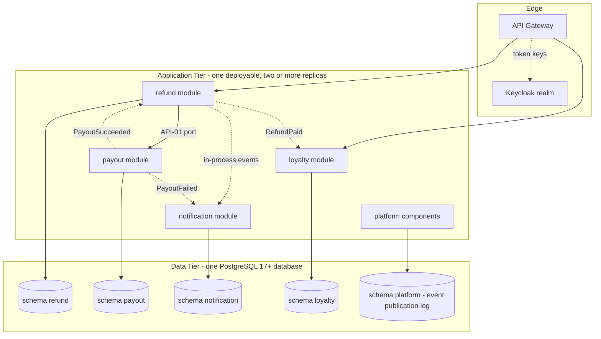

<!--
CHUNK: 03
TITLE: Architecture Overview - Components & Deployment
PROJECT: Refunds Platform
VERSION: 1.0
PART OF: LLD - Refunds Platform
-->

# 6. Architecture Overview

> **Note:** this chunk is a high-level orientation. Per-service detail lives in `04-implementation/<service>.md`. If you need class-level or method-level detail, jump straight there.

## 6.1 Component Topology

**Summary:** one deployable runs four modules plus the platform components (call context, `@UseCase` aspect, idempotency, Problem Details, event publication registry); each module writes only its own schema, the event publication log lives in schema `platform`, and dashed edges are in-process events delivered after commit. The figure refines [SDD §8.3](../sdd-refunds-platform/04-architecture-style-and-diagrams.md#83-high-level-architecture-diagram).

## 6.2 Deployment Topology

| Concern | Choice | Source / Rationale |
|---------|--------|--------------------|
| Container | Docker-compatible OCI image, one for the deployable | CLAUDE.md default; [SDD §11.3](../sdd-refunds-platform/07-cross-cutting-concerns.md#113-deployment-default) |
| Orchestrator | Kubernetes, one Helm chart for the deployable | CLAUDE.md default; SDD ADR-01 |
| Namespace strategy | One namespace per environment (Dev, SIT, UAT, Prod) | [SDD §19](../sdd-refunds-platform/15-environments.md#19-environments) |
| Service mesh / Ingress | No service mesh; the cluster ingress controller in front of the API gateway | SDD §6 Service Mesh / Ingress row |
| Replicas (per deployable, baseline) | Two or more, on separate nodes | SDD §6 Compute row (REFUNDS/NFR-02) |
| Deployment strategy | Rolling update, no unavailable replica; Flyway migrations in a Helm pre-upgrade job | SDD §11.3, §11.1 |

> TODO: replica maximum, CPU and memory requests and limits, and autoscaling bounds are open in SDD §11.3 and §18.3; best guess: 2 to 4 replicas, 1 vCPU / 1 GiB request, CPU-based autoscaling at 70% - verify.

## 6.3 Runtime Stack

| Layer | Technology | Version | Source |
|-------|-----------|---------|--------|
| Language | Java | 21 | [SDD §6](../sdd-refunds-platform/02-ecosystem-overview.md#6-ecosystem-overview) Backend Runtime row |
| Framework | Spring Boot | 3.5+ | [SDD §6](../sdd-refunds-platform/02-ecosystem-overview.md#6-ecosystem-overview) Backend Runtime row |
| Module framework | Spring Modulith (boundary verification, event publication registry) | Open in SDD §6 | [SDD §6](../sdd-refunds-platform/02-ecosystem-overview.md#6-ecosystem-overview) Backend Runtime row |
| Build | Maven | Not pinned | CLAUDE.md is silent; LLD choice |
| Database | PostgreSQL | 17+ | [SDD §6](../sdd-refunds-platform/02-ecosystem-overview.md#6-ecosystem-overview) Primary RDBMS row |
| Message Broker | Not applicable - no broker in this release (ADR-02) | - | [SDD §6](../sdd-refunds-platform/02-ecosystem-overview.md#6-ecosystem-overview) Event Broker row |
| Cache | None | - | [SDD §6](../sdd-refunds-platform/02-ecosystem-overview.md#6-ecosystem-overview) Caching row |
| Auth | Keycloak | Open in SDD §6 | [SDD §6](../sdd-refunds-platform/02-ecosystem-overview.md#6-ecosystem-overview) IAM / AuthN row |
| Migrations | Flyway | Not pinned | SDD ADR-06; CLAUDE.md default |
| Resilience | Resilience4j | Not pinned | SDD ADR-09; CLAUDE.md default |
| Observability | Prometheus + Grafana, OpenTelemetry, JSON logs to a central store | Open in SDD §6 | [SDD §6](../sdd-refunds-platform/02-ecosystem-overview.md#6-ecosystem-overview) Observability rows |
| Frontend (if applicable) | Angular standalone, Tailwind + PrimeNG | 17+ | [SDD §6](../sdd-refunds-platform/02-ecosystem-overview.md#6-ecosystem-overview) Frontend Stack row |

> Confirm: Maven as the build tool, and Flyway and Resilience4j without a version pin, are LLD choices filling rows SDD §6 does not pin (CLAUDE.md defaults); the Spring Modulith, Keycloak, and observability versions stay open in SDD §6.

> **Convention:** each Source cell links the SDD §6 row it derives from (no SDD: the dependency manifest); a value that disagrees with SDD §6 is drift to flag (`sdd-to-lld.md` § One fact, one home, rule 3). A CLAUDE.md default fills only a row neither pins, flagged `> Confirm:`.

## 6.4 Architectural Style - As Operationalised

> **Inherits from:** [SDD §8.1 Architecture Style](../sdd-refunds-platform/04-architecture-style-and-diagrams.md#81-architecture-style) (modular monolith, ADR-01).
>
> **What this section adds:** the concrete operationalisation. Where the SDD says "event-driven microservices", this section names the topics, the consumer-group conventions, the schema-registry choice, the outbox-table convention. Where it says "modular monolith" (its ADR-01), this section names the module boundaries, the ports, and the in-process events.

- **Service boundary rule:** one module = one bounded context = one private PostgreSQL schema. No cross-schema reads. Each module is a top-level Java package with sub-packages `api` (ports and event records other modules may use), `domain`, `application`, and `adapter` (`adapter.in.web`, `adapter.in.event`, `adapter.out.persistence`, `adapter.out.<provider>`); Spring Modulith's `ApplicationModules.of(RefundsPlatformApplication.class).verify()` runs in CI as the module boundary test.
- **Inter-service async:** Not applicable - no topics (ADR-02). Module-to-module events are in-process (`07-event-contracts.md` § 10.6): published with `ApplicationEventPublisher` inside the business transaction, stored in the event publication registry (schema `platform`), and delivered after commit to listeners annotated `@ApplicationModuleListener` (asynchronous, own transaction).
- **Inter-service sync:** no HTTP between modules. The one module-to-module call is `PayoutPort.requestPayout` (API-01, `06-api-contracts.md` § 9.6), which joins the caller's transaction. Outbound HTTP is limited to the provider adapters (API-02 to API-04), one hop deep.
- **Outbox pattern:** not applicable to the broker (no integration events). The same delivery contract is applied to provider writes through the `payout` and `notification` dispatch tables (ADR-09, `09-cross-cutting.md` § 12.4).
- **Saga choreography vs orchestration:** choreography, in process: `refund` approves and instructs the payout in one transaction, `payout` reports `PayoutSucceeded` or `PayoutFailed`, `refund` re-publishes `RefundPaid` for `notification` and `loyalty` (`09-cross-cutting.md` § 12.5). No orchestrator.

> Confirm: the Spring Modulith API names used in this LLD (`ApplicationModules.verify()`, `@ApplicationModuleListener`, `IncompleteEventPublications`, `EventSerializer`) are taken from Spring Modulith 1.x; verify them against the version SDD §6 pins once it is chosen.

<!-- MASTER: refunds-platform-lld-master.md | PREV: 02-context.md | NEXT: 04-implementation/loyalty.md -->
