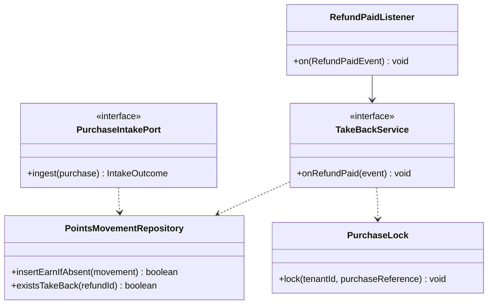
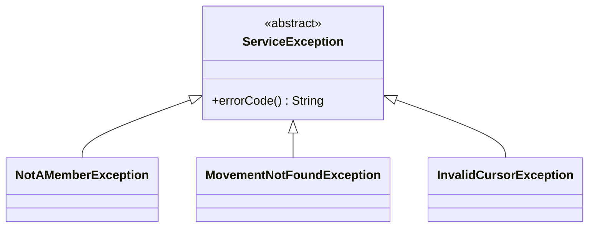
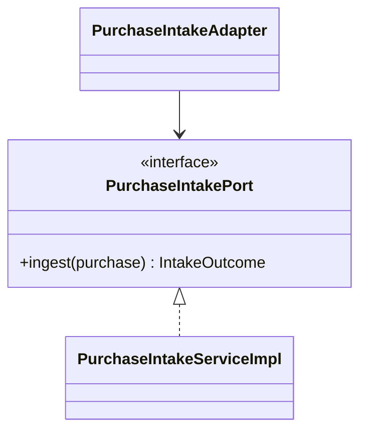
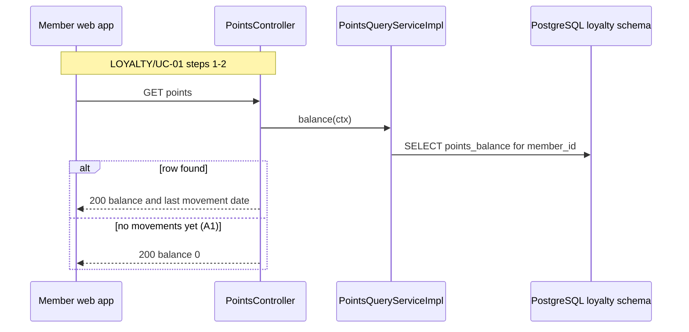
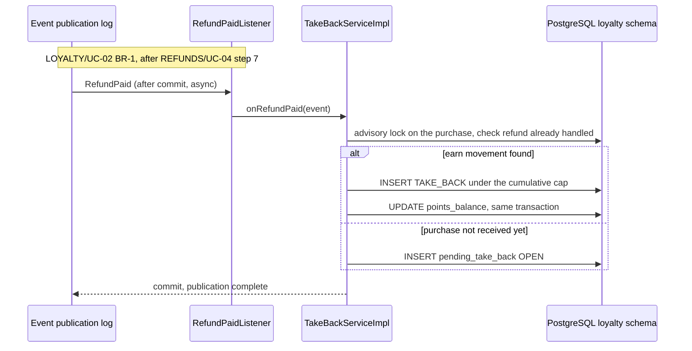
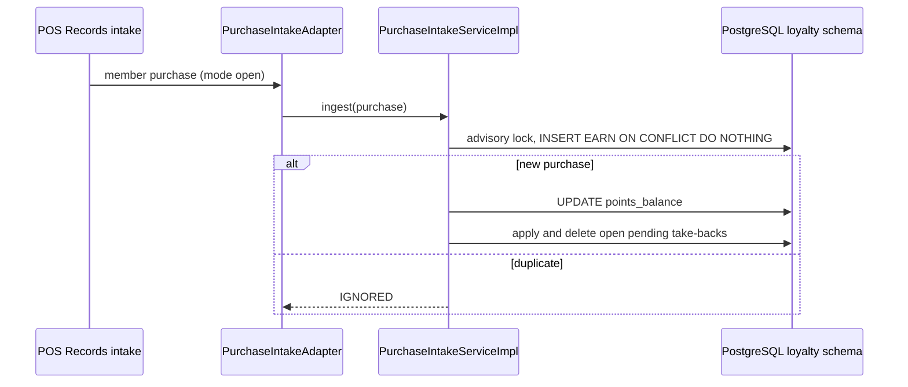

<!--
CHUNK: 04
TITLE: Per-Service Implementation - loyalty
PROJECT: Refunds Platform
VERSION: 1.0
DEPENDS_ON: 03, 09
PART OF: LLD - Refunds Platform
-->

# 7. Per-Service Implementation - loyalty

> **Bounded context:** SDD §13 row `loyalty` and [SDD §17.4 Boundaries](../../sdd-refunds-platform/13d-service-loyalty.md#boundaries)
>
> **Type:** module (SDD §13 Type; one part of the modular monolith's single deployable)
>
> **Source code:** not yet written (from-sdd); top-level package `loyalty` with sub-packages `domain`, `application`, `adapter`
>
> **Owns use cases (SDD 09):** [LOYALTY/UC-01](../../brd-loyalty-points/06a-use-cases-member.md#uc-01-view-points-balance), [LOYALTY/UC-02](../../brd-loyalty-points/06a-use-cases-member.md#uc-02-view-points-history)
>
> **Participates in:** None

---

## 7.1 Responsibility

`loyalty` owns the points ledger in schema `loyalty`: append-only `PointsMovement` rows (EARN on a member purchase, TAKE_BACK when that purchase is refunded), one `PointsBalance` projection per member updated in the same transaction as each movement, and `PendingTakeBack` rows for refunds whose purchase has not arrived yet. It serves the member's balance and history over REST, earns points from the POS member purchase intake (mode open), and consumes one in-process event, `RefundPaid` from `refund`, to take points back (LOYALTY/UC-02 BR-1: points taken back when the purchase is refunded). It publishes no event, calls no provider, and never reads the `refund` schema: every movement detail comes from the ledger's own columns.

---

## 7.2 Class & Interface Map

> **Convention:** list the load-bearing classes only - controllers, services, service implementations, repositories, mappers, key domain types. Skip DTOs that are obvious from controller signatures.

### Controllers

| Class | Endpoints | Notes |
|-------|-----------|-------|
| `PointsController` | `GET /v1/members/me/points`, `GET /v1/members/me/points-movements`, `GET /v1/members/me/points-movements/{movementId}` | `loyalty.balance.read` / `loyalty.movement.read`; `@UseCase("LOYALTY/UC-01")`, `@UseCase("LOYALTY/UC-02")`, `@UseCase("LOYALTY/UC-02")`; every query bound to the `member_id` claim |
| `RefundPaidListener` (`adapter.in.event`) | In-process listener for `RefundPaid` | System principal; no `@UseCase` (§7.3 lists no event entry point) |
| `PurchaseIntakeAdapter` (`adapter.in.pos`) | POS member purchase intake | Mode open (SDD §12 INT-03 (b)) |
| `LoyaltyNightlyJob` | Scheduled nightly job, one replica at a time | Balance integrity check and pending take-back expiry |

> **Convention:** every entry point a § 7.8 traceability line names (REST method, event listener, scheduled job) carries `@UseCase("[KEY]/UC-NN")` with that use case's keyed ID (`09-cross-cutting.md` § 12.8). Platform endpoints carry none.

> Confirm: SDD §7.3 lists no event entry point for the take-back of LOYALTY/UC-02 (`Event: RefundPaid`), although §7.3 links §8.4.2 to it; `RefundPaidListener` therefore carries no `use_case`, and a take-back incident is not found by a use-case search until SDD §7.3 adds it.

### Services (interfaces)

| Interface | Purpose | Implementations |
|-----------|---------|-----------------|
| `PointsQueryService` | Balance, movements, one movement (LOYALTY/UC-01, LOYALTY/UC-02) | `PointsQueryServiceImpl` |
| `TakeBackService` | `RefundPaid`: take-back movement or pending take-back | `TakeBackServiceImpl` |
| `PurchaseIntakePort` (driving port) | Ingest one member purchase: EARN, then apply pending take-backs | `PurchaseIntakeServiceImpl` |
| `BalanceIntegrityService` | Nightly balance versus sum of movements | `BalanceIntegrityServiceImpl` |
| `PendingTakeBackExpiryService` | OPEN to EXPIRED after the wait | `PendingTakeBackExpiryServiceImpl` |

### Service Implementations

| Class | Implements | Key methods |
|-------|------------|-------------|
| `PointsQueryServiceImpl` | `PointsQueryService` | `balance(...)`, `movements(...)`, `movement(...)` |
| `TakeBackServiceImpl` | `TakeBackService` | `onRefundPaid(...)` |
| `PurchaseIntakeServiceImpl` | `PurchaseIntakePort` | `ingest(...)` |
| `EarnPolicy`, `TakeBackPolicy` (domain services) | - | Points earned per purchase; points to take back under the cumulative cap |
| `PurchaseLock` | - | `lock(tenantId, purchaseReference)`: PostgreSQL transaction advisory lock per purchase |

### Repositories

| Class | Entity | Notes |
|-------|--------|-------|
| `PointsMovementRepository` | `PointsMovement` | Insert-only; `findEarn(purchaseReference)`, `sumTakenBack(purchaseReference)`, `findPage(memberId, cursor)`, `findByIdAndMemberId` |
| `PointsBalanceRepository` | `PointsBalance` | `findByMemberId`, `apply(memberId, delta, at)` with optimistic `version` |
| `PendingTakeBackRepository` | `PendingTakeBack` | `findOpen(purchaseReference)` oldest `paid_at` first, `expireOlderThan(cutoff)` |

### Domain Types (records)

| Type | Kind | Purpose |
|------|------|---------|
| `PointsMovement` | entity | Immutable ledger row: type, signed points, purchase reference, refund ID and reference, amounts, `occurred_at` |
| `PointsBalance` | entity | Projection: balance and last movement date per member |
| `PendingTakeBack` | entity | A take-back waiting for its purchase; `OPEN` or `EXPIRED` |
| `MovementType`, `PendingStatus` | enum | `EARN`, `TAKE_BACK`; `OPEN`, `EXPIRED` |
| `MemberPurchase` | record | Intake DTO: member ID, purchase reference, amount, currency, purchase time (LOYALTY 08 fields) |
| `PointsBalanceResponse` | record | Response of `GET /v1/members/me/points`, published in OpenAPI under the SDD schema name `PointsBalance` |
| `PointsMovementPage`, `PointsMovementDetail` | record | Responses, SDD §17.4 List of APIs names (shapes in 06 § 9.2) |

> Confirm: the response record is named `PointsBalanceResponse` with OpenAPI schema name `PointsBalance` because the SDD uses `PointsBalance` for both the aggregate (§17.4 Boundaries) and the response (§17.4 List of APIs).

### Method Signatures (key methods only)

```java
public interface PointsQueryService {
  PointsBalanceResponse balance(CallContext ctx);
  PointsMovementPage movements(PageCursor cursor, int size, CallContext ctx);
  PointsMovementDetail movement(UUID movementId, CallContext ctx);
}

public interface TakeBackService {
  void onRefundPaid(RefundPaidEvent event);
}

public interface PurchaseIntakePort {
  IntakeOutcome ingest(MemberPurchase purchase);
}

public interface BalanceIntegrityService {
  int verify(UUID tenantId);
}
```

> **Convention:** records are used for all DTOs (CLAUDE.md default). Constructor injection only - no `@Autowired` on fields.

> Confirm: class and method names follow the CLAUDE.md naming conventions plus the hexagonal suffixes; verify with the team.

### Ports and Adapters (in-process contracts)

| Port interface | Operation | API ID (§15) | Role here | Adapter class |
|----------------|-----------|--------------|-----------|---------------|
| Not applicable - this module provides and calls no `Internal (in-process)` contract | - | - | - | - |

> **Convention:** modular monolith or hybrid core only: one row per SDD §15 `Internal (in-process)` contract this module provides or calls; the contract itself is in `06-api-contracts.md` § 9.6. The classes that publish or listen to in-process domain events (`07-event-contracts.md` § 10.6) go in the Service Implementations table, naming the event. A microservices SDD writes "Not applicable - no in-process contracts".

Listener here: `RefundPaidListener` (`RefundPaid`); the module publishes no event. `PurchaseIntakePort` is a driving port for an external system, not an SDD §15 contract (SDD §15.4: not applicable yet).

### Authorization

| Entry point | Kind | Permission token (SDD §16, verbatim) | Enforcement point |
|-------------|------|--------------------------------------|-------------------|
| `GET /v1/members/me/points` | REST | `loyalty.balance.read` | `@PreAuthorize` on `PointsController.balance`; `member_id` claim required (else 403 `FORBIDDEN`) |
| `GET /v1/members/me/points-movements` | REST | `loyalty.movement.read` | `@PreAuthorize`; query bound to the `member_id` claim, never a path parameter |
| `GET /v1/members/me/points-movements/{movementId}` | REST | `loyalty.movement.read` | `@PreAuthorize`; a movement of another member gives 404 `NOT_FOUND` |
| `RefundPaidListener.on` | Listener | None - system consumer | None |
| `PurchaseIntakeAdapter` | Intake (mode open) | None - system intake | Provider authentication of the intake, TBD with its mode |
| `LoyaltyNightlyJob.run` | Job | None - system job | None |

> **Convention:** one row per entry point of this service (REST method, event listener, scheduled job, in-process port). Tokens are the SDD §16 permission tokens, verbatim; the role catalogue stays in the SDD (`sdd-to-lld.md` § One fact, one home). On an internal HTTP entry point the provider's filter or sidecar checks the caller's client-credentials token against the token (SDD §15.1). From code with no SDD: the scopes the code checks.

---

## 7.3 Method-Level Pseudocode (non-trivial logic only)

> **Convention:** include pseudocode only for methods where the algorithm is non-obvious. Skip for plain CRUD.

### `TakeBackServiceImpl.onRefundPaid`

```text
@ApplicationModuleListener on RefundPaidListener          // after the refund commit, async, own transaction
1. callContext.runAsSystem(event.tenantId(), event.correlationId())
2. purchaseLock.lock(tenant, event.purchaseReference())   // serialises take-backs and the earn step per purchase
3. if movements.existsTakeBack(event.refundId()) or pendings.exists(event.refundId()) -> return   // repeat: no-op
4. earn = movements.findEarn(event.purchaseReference())
   if earn is empty:
     pendings.insert(PendingTakeBack(OPEN, refundId, purchaseReference, refundReference, paidAmount, paidAt))
     return                                                                  // SDD §17.4 Pending take-back
5. currency check: event.paidAmount().currency() != earn.currency -> log ERROR, alert, throw (poison)
6. remaining = earn.points - |movements.sumTakenBack(event.purchaseReference())|
7. points = min(remaining, takeBackPolicy.points(earn, event.paidAmount()))
   if points == 0 -> return                                                  // cumulative cap reached, record nothing
8. movements.insert(TAKE_BACK, -points, earn.memberId, refundId, refundReference = event.referenceNumber(),
                    paidAmount, occurredAt = event.paidAt())                 (LOYALTY/UC-02 A1)
9. balances.apply(earn.memberId, -points, event.paidAt())                    // same transaction (LOYALTY/NFR-01)
10. loyalty_take_back_lag_seconds.observe(now - event.paidAt())
```

> Confirm: pseudocode derived from SDD §17.4 Take-back, Pending take-back, and Timeliness; the per-purchase advisory lock is an LLD addition that closes the race between a take-back and the earn step of the same purchase.

> TODO: the take-back rule for a refund of some items or a lower amount is open in SDD §17.4 (R-04); best guess: points for `paidAmount` at 1 point per 1 EUR rounded down, under the cumulative cap, so a full refund takes back every earned point - verify with the LOYALTY owner.

### `PurchaseIntakeServiceImpl.ingest` (earn)

```text
1. callContext.runAsSystem(purchase.tenantId())
2. purchaseLock.lock(tenant, purchase.purchaseReference())
3. inserted = movements.insertEarnIfAbsent(EARN, earnPolicy.points(purchase.amount()), purchase)
              // unique (tenant_id, purchase_reference) where type = EARN; duplicate -> IGNORED (idempotent intake)
   if not inserted -> loyalty_purchases_ingested_total{outcome=duplicate}++; return IGNORED
4. balances.apply(memberId, +points, purchase.purchasedAt())
5. for p in pendings.findOpen(purchaseReference) ordered by paid_at:        // SDD §17.4, oldest paidAt first
     apply as onRefundPaid steps 6-9 under the same cumulative cap; delete p
6. if pendings.existsExpired(purchaseReference) -> loyalty_late_purchase_after_expiry_total++
7. return EARNED
```

> TODO: rounding of purchase amounts with cents is open in SDD §17.4 (points are whole numbers, LOYALTY 11); best guess: 1 point per whole EUR, rounded down (12.50 EUR earns 12 points) - verify.

> TODO: the POS member purchase intake mode (push API, pull API, or daily file) is open in SDD §12 INT-03 (b); best guess: a POS push to an internal endpoint authenticated with a per-tenant client credential, feeding `PurchaseIntakePort.ingest` - verify with the Retail IT team.

### `LoyaltyNightlyJob.run`

```text
under SingleReplicaJobLock("loyalty-nightly"), per tenant:
1. expiry: pendings.expireOlderThan(now - PENDING_TAKE_BACK_WAIT)          // OPEN -> EXPIRED, kept for audit
2. integrity: for each member, balance != sum(points) of movements
       -> loyalty_balance_mismatch_total++, log ERROR with movement ID range (member_id only at DEBUG)
```

> TODO: how long a pending take-back waits before it expires is open in SDD §17.4; best guess: 30 days, matching the refund window - verify.

---

## 7.4 Design Patterns Applied

> **Convention:** every applied pattern carries name, triggering CLAUDE.md rule, roles, rationale specific to this service, Mermaid class diagram, and pseudocode skeleton. Patterns inferred from code (from-code) include `> Confirm:` unless a test exercises the pattern (`confidence-rules.md`); patterns proposed (from-sdd) carry the rule attribution explicitly.

### Pattern: Outbox

> **Not applied in this module:** `loyalty` publishes no event and makes no provider write.

### Pattern: Idempotent consumer and idempotent intake

> **Applied:** Idempotency on every consumer (CLAUDE.md: "Idempotency on every consumer and every write endpoint. Assume at-least-once delivery everywhere.")
>
> **Rationale (this service):** a re-delivered `RefundPaid` or a repeated POS purchase must never move the balance twice (LOYALTY/NFR-01: the points balance is always right). Unique constraints are the dedup store: (`tenant_id`, `refund_id`) for a take-back and a pending take-back, (`tenant_id`, `purchase_reference`) for an earn.

**Roles:**

| Role | Class / Component |
|------|-------------------|
| Dedup keys | `uq_movement_take_back`, `uq_pending_refund`, `uq_movement_earn` (05 § 8.3) |
| Consumers | `RefundPaidListener` → `TakeBackServiceImpl`; `PurchaseIntakeAdapter` → `PurchaseIntakeServiceImpl` |
| Serialisation | `PurchaseLock` per purchase |

**Class diagram:**



**Summary:** the take-back service and the intake both lock the purchase first and write through unique keys.

**Pseudocode skeleton:**

```text
void lock(tenant, ref) { jdbc.query("SELECT pg_advisory_xact_lock(hashtextextended(:k, 0))", tenant + ":" + ref); }
boolean insertEarnIfAbsent(m) { return jdbc.update("INSERT ... ON CONFLICT DO NOTHING") == 1; }
```

### Pattern: RFC 9457 Problem Details

> **Applied:** RFC 9457 error model (CLAUDE.md: "Global @RestControllerAdvice, Problem Details (RFC 9457). Business exceptions extend a base ServiceException with error code.")
>
> **Rationale (this service):** the three read endpoints return `FORBIDDEN` for a token without `member_id`, `NOT_FOUND` for another member's movement, and `VALIDATION_FAILED` for a malformed cursor (SDD §17.4 Error Handling); the platform advice renders them like every other module.

**Roles:**

| Role | Class / Component |
|------|-------------------|
| Base exception | `ServiceException` (platform) |
| Subclasses | `NotAMemberException` (`FORBIDDEN`), `MovementNotFoundException` (`NOT_FOUND`), `InvalidCursorException` (`VALIDATION_FAILED`) |
| Translator | `ProblemDetailsAdvice` (platform) |

**Class diagram:**



**Summary:** the three loyalty errors extend `ServiceException` and render as Problem Details.

**Pseudocode skeleton:**

```text
String memberId = ctx.memberId().orElseThrow(NotAMemberException::new);     // 403 FORBIDDEN
movements.findByIdAndMemberId(id, memberId).orElseThrow(MovementNotFoundException::new);   // 404 NOT_FOUND
```

### Pattern: Ports and Adapters (hexagonal)

> **Applied:** Ports and adapters (CLAUDE.md: "Layered architecture (controller, service, service impl, entity, repository, dto, etc.) unless specified (e.g., enforce hexagonal)."; SDD §6 Architecture Doctrine and §17.4 Developer Notes: the POS intake behind a port)
>
> **Rationale (this service):** the intake mode is open, so the earn logic sits behind `PurchaseIntakePort`; whichever adapter (push endpoint, pull job, file reader) the Retail IT answer brings, the domain does not change.

**Roles:**

| Role | Class / Component |
|------|-------------------|
| Driving port | `PurchaseIntakePort` |
| Adapter (mode open) | `PurchaseIntakeAdapter` |
| Implementation | `PurchaseIntakeServiceImpl` |

**Class diagram:**



**Summary:** the intake adapter, whatever the intake mode, calls the driving port that the intake service implements.

**Pseudocode skeleton:**

```text
class PurchaseIntakeAdapter {                    // shape depends on the open intake mode
  void receive(posPayload) { purchaseIntakePort.ingest(PosPurchaseMapper.toDomain(posPayload)); }
}
```

---

## 7.5 Dependency Injection Graph

> **Convention:** constructor injection only. Document the wiring graph for non-trivial cases (3+ collaborators, or any factory/strategy/mediator wiring).

```mermaid
graph TB
  PointsController --> PointsQueryService
  PointsQueryServiceImpl --> PointsBalanceRepository
  PointsQueryServiceImpl --> PointsMovementRepository
  RefundPaidListener --> TakeBackService
  TakeBackServiceImpl --> PurchaseLock
  TakeBackServiceImpl --> PointsMovementRepository
  TakeBackServiceImpl --> PendingTakeBackRepository
  TakeBackServiceImpl --> PointsBalanceRepository
  TakeBackServiceImpl --> TakeBackPolicy
  PurchaseIntakeAdapter --> PurchaseIntakePort
  PurchaseIntakeServiceImpl --> EarnPolicy
  PurchaseIntakeServiceImpl --> PurchaseLock
  PurchaseIntakeServiceImpl --> PendingTakeBackRepository
  LoyaltyNightlyJob --> BalanceIntegrityService
  LoyaltyNightlyJob --> PendingTakeBackExpiryService
  LoyaltyNightlyJob --> SingleReplicaJobLock
```



**Summary:** the take-back and intake services share the purchase lock and the ledger repositories; the nightly job runs under the single-replica lock.

---

## 7.6 Transaction Boundaries

| Method | Propagation | Isolation | Rollback rules |
|--------|-------------|-----------|----------------|
| `PointsQueryServiceImpl.*` | `REQUIRED`, read-only | `READ_COMMITTED` | Not applicable |
| `TakeBackServiceImpl.onRefundPaid` | `REQUIRES_NEW` (the listener's own transaction) | `READ_COMMITTED` plus the per-purchase advisory lock | Rollback on any exception: the publication stays incomplete and is re-delivered |
| `PurchaseIntakeServiceImpl.ingest` | `REQUIRED` (one transaction per purchase) | `READ_COMMITTED` plus the per-purchase advisory lock | Rollback on any exception; the intake retries the purchase |
| `LoyaltyNightlyJob` steps | `REQUIRES_NEW` per tenant and step | `REPEATABLE_READ` for the integrity comparison | Per-step rollback; the next night retries |

> **Convention:** outbox row insert lives inside the same transaction as the aggregate write. No `@Transactional(propagation = REQUIRES_NEW)` for outbox writes - the whole point of the pattern is one-tx commit.

> Confirm: transaction propagation defaults applied per CLAUDE.md; verify per method, in particular `REPEATABLE_READ` for the integrity check.

---

## 7.7 Error Handling

| Exception | RFC 9457 type | `errorCode` (SDD §15.1) | HTTP Status | When thrown | Caller action |
|-----------|---------------|-------------------------|-------------|-------------|---------------|
| `NotAMemberException` | `/problems/loyalty/not-a-member` | `FORBIDDEN` | 403 | Signed-in user without a `member_id` claim | None |
| `MovementNotFoundException` | `/problems/loyalty/movement-not-found` | `NOT_FOUND` | 404 | Unknown movement, or another member's | None (terminal) |
| `InvalidCursorException` | `/problems/validation` | `VALIDATION_FAILED` | 400 | Malformed cursor or movement ID | Fix the request |
| `PoisonEventException` (listener) | - | - | None | `RefundPaid` with a currency other than the earn's | Logged at ERROR, alerted; publication stays incomplete for the SDD §20 procedure |

> **Convention:** all exceptions extend `ServiceException` (CLAUDE.md base class). Global `@RestControllerAdvice` translates to `ProblemDetails` (RFC 9457). Error envelope schema in `09-cross-cutting.md` § Error Model.

A balance with no movements is 0, not an error (LOYALTY/UC-01 A1).

---

## 7.8 Use-Case Workflows

> **Convention:** one subsection per active use case this service owns (SDD §7.3 Owner), headed with the SDD's BRD key and the BRD's ID and title exactly. A merged or removed use case gets no block. Cross-service sagas live in the orchestrator service's file. Each workflow has: the traceability line, control flow, sequence diagram (Mermaid), idempotency points, outbox emission points, retry/timeout choices.

### LOYALTY/UC-01: View Points Balance

> **Traceability:** BRD [LOYALTY/UC-01](../../brd-loyalty-points/06a-use-cases-member.md#uc-01-view-points-balance) · SDD [§7.3](../../sdd-refunds-platform/03-users-and-use-cases.md#73-use-case-traceability-brd--sdd) · Owner: loyalty · Entry points: `GET /v1/members/me/points` · UAT/BAT: Pending (BRD 16 not written) · Screens: [LOYALTY/LP-01](../../brd-loyalty-points/14-todo.md#mockup-coverage) via `/points`

**Trigger:** `PointsController.balance` with `@UseCase("LOYALTY/UC-01")`.

**Pre-conditions:** signed-in member with `loyalty.balance.read` and a `member_id` claim.

**Post-conditions:** none (read only).

**Control flow:**

```text
1. Member opens their points                                                 (LOYALTY/UC-01 step 1)
2. Read points_balance for the member_id claim: balance and last movement date (LOYALTY/UC-01 step 2)
   - no row -> balance 0, no date; the client explains how points are earned  (LOYALTY/UC-01 A1)
```

**Sequence diagram:**



**Summary:** the balance comes from the member's projection row, or 0 when the member has no movement yet.

**Idempotency points:** not applicable (read).

**Outbox emission points:** none.

**Retry / timeout policy:** none server-side.

**Error handling:** no `member_id` claim → 403 `FORBIDDEN`.

### LOYALTY/UC-02: View Points History

> **Traceability:** BRD [LOYALTY/UC-02](../../brd-loyalty-points/06a-use-cases-member.md#uc-02-view-points-history) · SDD [§7.3](../../sdd-refunds-platform/03-users-and-use-cases.md#73-use-case-traceability-brd--sdd) · Owner: loyalty · Entry points: `GET /v1/members/me/points-movements`, `GET /v1/members/me/points-movements/{movementId}` · UAT/BAT: Pending (BRD 16 not written) · Screens: [LOYALTY/LP-02](../../brd-loyalty-points/14-todo.md#mockup-coverage) via `/points/history` and `/points/history/:movementId`

**Trigger:** `PointsController.movements` and `PointsController.movement`, both with `@UseCase("LOYALTY/UC-02")`; the take-back of BR-1 is realised by `RefundPaidListener` (no `@UseCase`, § 7.2).

**Pre-conditions:** signed-in member with `loyalty.movement.read` and a `member_id` claim.

**Post-conditions:** reads: none. Take-back: one TAKE_BACK movement and the balance updated in one transaction, or one OPEN pending take-back.

**Control flow:**

```text
1. Movements of the member, newest first, cursor-paged: date, purchase or refund reference, signed points
                                                                             (LOYALTY/UC-02 steps 1-2)
2. One movement: the purchase or refund it came from, from the ledger's own columns
                                                                             (LOYALTY/UC-02 steps 3-4)
3. On RefundPaid: take back the purchase's points with the refund reference, under the cumulative cap,
   or keep a pending take-back until the purchase arrives
             (LOYALTY/UC-02 BR-1: points taken back when the purchase is refunded; A1: negative movement shown)
```

**Sequence diagram (take-back, step 3):**



**Summary:** under the purchase lock, `RefundPaid` becomes a capped TAKE_BACK with its balance update, or a pending take-back when the purchase has not arrived.

**Idempotency points:** unique (`tenant_id`, `refund_id`) on TAKE_BACK movements and on pending take-backs; reads need none.

**Outbox emission points:** none (the module publishes nothing).

**Retry / timeout policy:** a failed listener run is re-delivered by age (`09-cross-cutting.md` § 12.4); the re-delivery threshold must keep the take-back within the 1 hour of LOYALTY/NFR-02.

**Error handling:** another member's movement → 404 `NOT_FOUND`; malformed cursor → 400 `VALIDATION_FAILED`; currency mismatch on `RefundPaid` → poison, alert, publication left incomplete.

### Workflow: Member purchase intake (earn)

> **Traceability:** No BRD use case - SDD §17.4 Earn ("no use case; feeds the two above"); see the `> Confirm:` below

**Trigger:** `PurchaseIntakeAdapter` (mode open) calling `PurchaseIntakePort.ingest`.

**Control flow:**

```text
1. Lock the purchase; insert EARN idempotently on (tenant_id, purchase_reference)
2. Update the balance in the same transaction
3. Apply open pending take-backs of the purchase, oldest paidAt first, under the cumulative cap; delete them
4. Count a purchase arriving after its pending take-back expired
```

**Sequence diagram:**



**Summary:** a new purchase earns once, updates the balance, and applies its waiting take-backs; a duplicate is ignored.

**Idempotency points:** unique (`tenant_id`, `purchase_reference`) where type = EARN.

**Outbox emission points:** none.

**Retry / timeout policy:** depends on the intake mode (TODO in § 7.3).

**Error handling:** a malformed purchase is rejected at the adapter and counted (`loyalty_purchases_ingested_total{outcome}`).

> Confirm: earning points on member purchases is behaviour no BRD use case covers (LOYALTY 01 states it, LOYALTY 05 has no use case for it, SDD §17.4 marks it "no use case"); it is an open question for the LOYALTY owner, never a new use case.

### Cross-service Saga (orchestrator role)

> **Only present if this service is the orchestrator of a multi-service saga.** Choreography-style sagas (each service reacts to events without an orchestrator) are documented per-step in the participating services' workflow sections.

Not applicable for this service: participant of the choreography in [refund § 7.4](./refund.md#74-design-patterns-applied) (step 4).

<!-- MASTER: refunds-platform-lld-master.md | PREV: 03-architecture.md | NEXT: 04-implementation/notification.md -->
