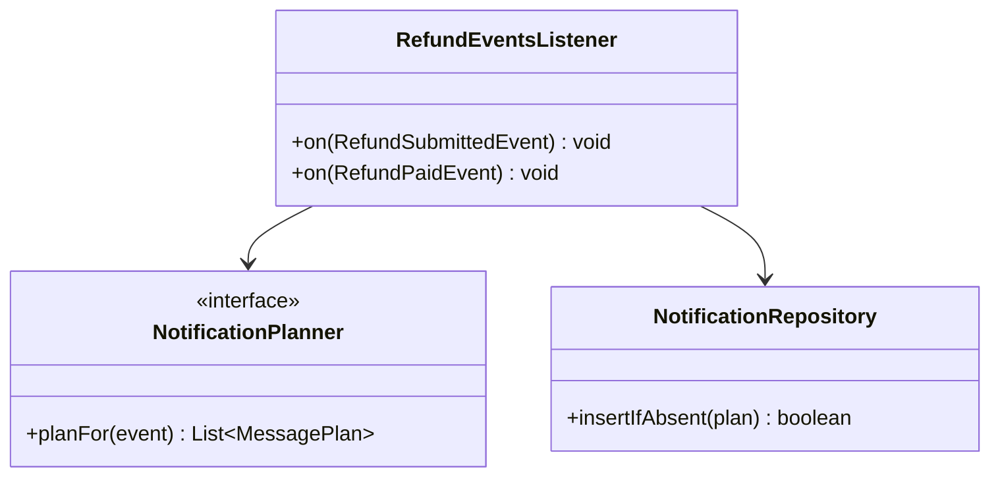
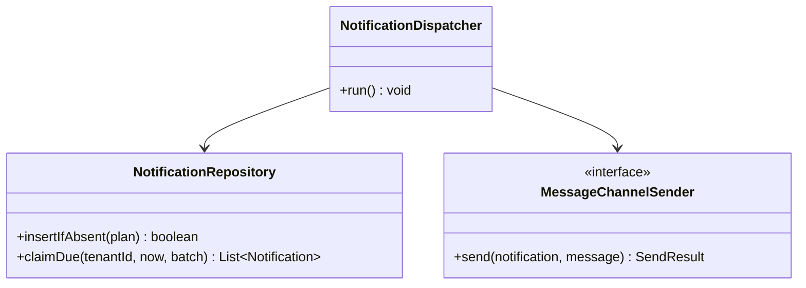
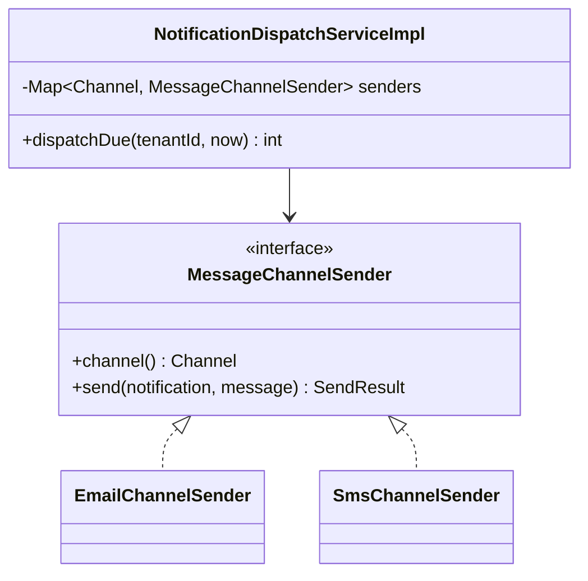
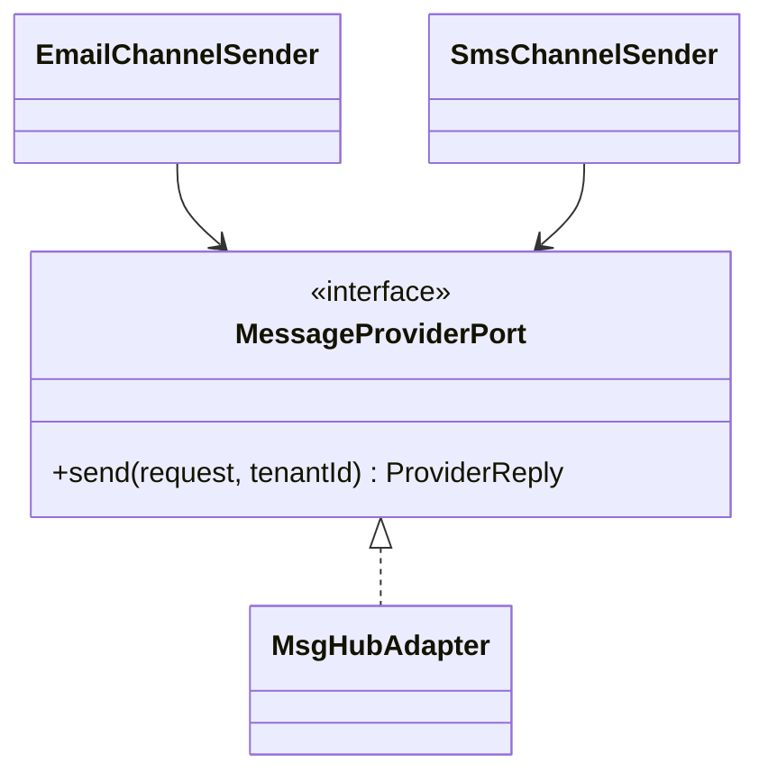
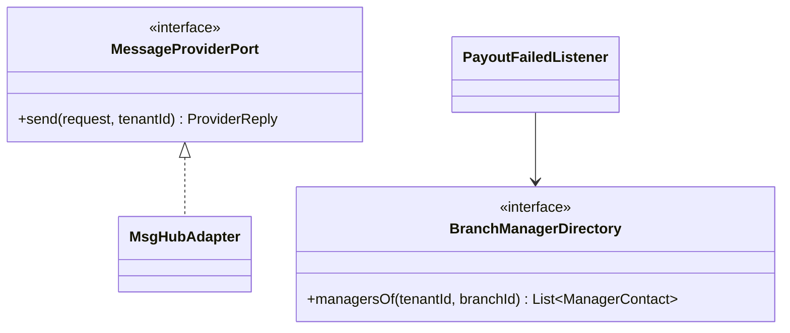
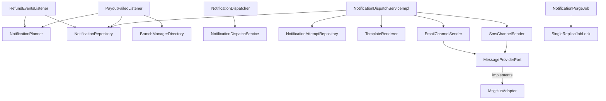
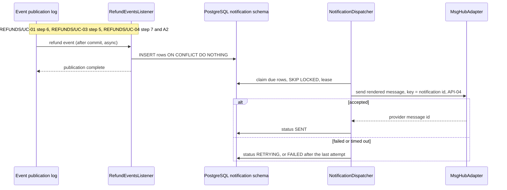

<!--
CHUNK: 04
TITLE: Per-Service Implementation - notification
PROJECT: Refunds Platform
VERSION: 1.0
DEPENDS_ON: 03, 09
PART OF: LLD - Refunds Platform
-->

# 7. Per-Service Implementation - notification

> **Bounded context:** SDD §13 row `notification` and [SDD §17.3 Boundaries](../../sdd-refunds-platform/13c-service-notification.md#boundaries)
>
> **Type:** module (SDD §13 Type; one part of the modular monolith's single deployable)
>
> **Source code:** not yet written (from-sdd); top-level package `notification` with sub-packages `domain`, `application`, `adapter` (no `api` package: nothing calls into it)
>
> **Owns use cases (SDD 09):** None - sends refund messages to customers and payout alerts to branch managers
>
> **Participates in:** REFUNDS/UC-01 (owner: refund), REFUNDS/UC-03 (owner: refund), REFUNDS/UC-04 (owner: refund)

---

## 7.1 Responsibility

`notification` owns outbound messages in schema `notification`: one `Notification` row per source event, recipient, and channel, plus its delivery attempts, message templates per message type and locale, the notification dispatcher, and the MsgHub adapter (API-04). It listens to five in-process events (`RefundSubmitted`, `RefundCancelled`, `RefundRejected`, `RefundPaid` from `refund`; `PayoutFailed` from `payout`), publishes none, and exposes no REST endpoint and no port. It never delays or changes a refund: listeners only insert rows, and the dispatcher sends them after commit with retries. It does not own refund or payout state, and it holds customer contact data only as the recipient of the message it sends.

---

## 7.2 Class & Interface Map

> **Convention:** list the load-bearing classes only - controllers, services, service implementations, repositories, mappers, key domain types. Skip DTOs that are obvious from controller signatures.

### Controllers

None - no REST endpoint and no port (SDD §17.3 API Standards). The driving adapters are:

| Class | Endpoints | Notes |
|-------|-----------|-------|
| `RefundEventsListener` | In-process listeners for `RefundSubmitted`, `RefundCancelled`, `RefundRejected`, `RefundPaid` | System principal; tenant from the DTO |
| `PayoutFailedListener` | In-process listener for `PayoutFailed` | System principal |
| `NotificationDispatcher` | Scheduled job, every `NOTIFICATION_DISPATCH_INTERVAL_MS`, every replica | Row claims with `FOR UPDATE SKIP LOCKED` and a lease |
| `NotificationPurgeJob` | Scheduled daily job, one replica at a time | Deletes rows past retention (retention open) |

> **Convention:** every entry point a § 7.8 traceability line names (REST method, event listener, scheduled job) carries `@UseCase("[KEY]/UC-NN")` with that use case's keyed ID (`09-cross-cutting.md` § 12.8). Platform endpoints carry none.

None of these carries `@UseCase`: SDD §7.3 lists no notification entry point (see § 7.8).

### Services (interfaces)

| Interface | Purpose | Implementations |
|-----------|---------|-----------------|
| `NotificationPlanner` | Turn one event into message rows (recipient by channel) | `NotificationPlannerImpl` |
| `NotificationDispatchService` | Claim due rows, render, send, record the outcome | `NotificationDispatchServiceImpl` |
| `MessageChannelSender` (strategy) | Send one rendered message on one channel | `EmailChannelSender`, `SmsChannelSender` |
| `MessageProviderPort` (driven port) | Send through MsgHub (API-04) | `MsgHubAdapter` (`adapter.out.msghub`) |
| `BranchManagerDirectory` (driven port) | Managers of a branch with their contact | Adapter open (§ 7.3 TODO) |
| `TemplateRenderer` | Render a template per message type and locale; amounts with their currency | `TemplateRendererImpl` |

### Service Implementations

| Class | Implements | Key methods |
|-------|------------|-------------|
| `NotificationPlannerImpl` | `NotificationPlanner` | `planFor(RefundSubmittedEvent)`, ... one per event type |
| `NotificationDispatchServiceImpl` | `NotificationDispatchService` | `dispatchDue(...)`, `recordOutcome(...)` |
| `EmailChannelSender`, `SmsChannelSender` | `MessageChannelSender` | `send(notification, renderedMessage)` |

### Repositories

| Class | Entity | Notes |
|-------|--------|-------|
| `NotificationRepository` | `Notification` | `insertIfAbsent` (`ON CONFLICT (tenant_id, source_event_id, channel, recipient_key) DO NOTHING`), native `claimDue` with `FOR UPDATE SKIP LOCKED`, `deleteOlderThan` |
| `NotificationAttemptRepository` | `NotificationAttempt` | Insert-only |

### Domain Types (records)

| Type | Kind | Purpose |
|------|------|---------|
| `Notification` | entity | One message: recipient, channel, template key, locale, the render data, status, attempts |
| `NotificationAttempt` | entity | One MsgHub call and its outcome |
| `NotificationStatus` | enum | `PENDING`, `RETRYING`, `SENT`, `FAILED` |
| `Channel`, `RecipientType` | enum | `EMAIL`, `SMS`; `CUSTOMER`, `BRANCH_MANAGER` |
| `MessagePlan` | record | Recipient key and type, channel, recipient, template key, locale, render data |
| `RenderedMessage` | record | Subject (email only) and body |

**Event to message plan** (SDD §17.3 Business Logic, channels per SDD §3 assumption 4):

| Event | Recipients | Channels | Template key | Render data |
|-------|------------|----------|--------------|-------------|
| `RefundSubmitted` | Customer | EMAIL, SMS (when a mobile exists) | `refund-submitted` | reference number, requested amount |
| `RefundCancelled` | Customer | EMAIL | `refund-cancelled` | reference number |
| `RefundRejected` | Customer | EMAIL, SMS (when a mobile exists) | `refund-rejected` | reference number, rejection reason |
| `RefundPaid` | Customer | EMAIL, SMS (when a mobile exists) | `refund-paid` | reference number, paid amount |
| `PayoutFailed` | Every branch manager of `branchId` | EMAIL (channel open) | `payout-failed` | refund reference, amount, last failure reason |

### Method Signatures (key methods only)

```java
public interface NotificationPlanner {
  List<MessagePlan> planFor(RefundSubmittedEvent event);
  List<MessagePlan> planFor(RefundCancelledEvent event);
  List<MessagePlan> planFor(RefundRejectedEvent event);
  List<MessagePlan> planFor(RefundPaidEvent event);
  List<MessagePlan> planFor(PayoutFailedEvent event);
}

public interface NotificationDispatchService {
  int dispatchDue(UUID tenantId, Instant now);
}

public interface MessageChannelSender {
  Channel channel();
  SendResult send(Notification notification, RenderedMessage message);
}

public interface BranchManagerDirectory {
  List<ManagerContact> managersOf(UUID tenantId, String branchId);
}
```

> **Convention:** records are used for all DTOs (CLAUDE.md default). Constructor injection only - no `@Autowired` on fields.

> Confirm: class and method names follow the CLAUDE.md naming conventions plus the hexagonal suffixes; verify with the team.

### Ports and Adapters (in-process contracts)

| Port interface | Operation | API ID (§15) | Role here | Adapter class |
|----------------|-----------|--------------|-----------|---------------|
| Not applicable - this module provides and calls no `Internal (in-process)` contract | - | - | - | - |

> **Convention:** modular monolith or hybrid core only: one row per SDD §15 `Internal (in-process)` contract this module provides or calls; the contract itself is in `06-api-contracts.md` § 9.6. The classes that publish or listen to in-process domain events (`07-event-contracts.md` § 10.6) go in the Service Implementations table, naming the event. A microservices SDD writes "Not applicable - no in-process contracts".

Listeners here: `RefundEventsListener` (four refund events) and `PayoutFailedListener`; the module publishes no event.

### Authorization

| Entry point | Kind | Permission token (SDD §16, verbatim) | Enforcement point |
|-------------|------|--------------------------------------|-------------------|
| `RefundEventsListener.on(RefundSubmittedEvent)`, `on(RefundCancelledEvent)`, `on(RefundRejectedEvent)`, `on(RefundPaidEvent)` | Listener | None - system consumer | None (SDD §17.3 Constraints) |
| `PayoutFailedListener.on` | Listener | None - system consumer | None |
| `NotificationDispatcher.run` | Job | None - system job | None |
| `NotificationPurgeJob.run` | Job | None - system job | None |

> **Convention:** one row per entry point of this service (REST method, event listener, scheduled job, in-process port). Tokens are the SDD §16 permission tokens, verbatim; the role catalogue stays in the SDD (`sdd-to-lld.md` § One fact, one home). On an internal HTTP entry point the provider's filter or sidecar checks the caller's client-credentials token against the token (SDD §15.1). From code with no SDD: the scopes the code checks.

---

## 7.3 Method-Level Pseudocode (non-trivial logic only)

> **Convention:** include pseudocode only for methods where the algorithm is non-obvious. Skip for plain CRUD.

### `RefundEventsListener.on(RefundSubmittedEvent)` (same shape for the other refund events)

```text
@ApplicationModuleListener(id = "notification.refund-submitted")   // after commit, async, own transaction
1. callContext.runAsSystem(event.tenantId(), event.correlationId())
2. plans = planner.planFor(event)
     EMAIL to contact.email; SMS to contact.mobile only when present (SDD §17.3)
     recipient_key = customerId; locale = contact.locale or the tenant default locale
3. if contact.email is missing -> insert one FAILED row with reason "no usable recipient", alert (SDD §17.3 Error Handling)
4. for p in plans: repository.insertIfAbsent(p)    // ON CONFLICT DO NOTHING: a re-delivered event inserts nothing
5. commit -> publication complete
```

### `PayoutFailedListener.on`

```text
1. callContext.runAsSystem(event.tenantId(), event.correlationId())
2. managers = branchManagerDirectory.managersOf(event.tenantId(), event.branchId())
     directory unreachable -> throw: publication stays incomplete and is re-delivered
     no manager found      -> log ERROR, alert, complete (nothing to send)
3. for m in managers: insertIfAbsent(MessagePlan(BRANCH_MANAGER, recipientKey = m.userId, EMAIL,
                                     recipient = m.email, "payout-failed", render data from the event))
```

> TODO: the channel of the branch manager alert and the source of the managers' contact details are open in SDD §17.3; best guess: email, read from the Keycloak users holding `BRANCH_MANAGER` with that `branch_id` through a `BranchManagerDirectory` adapter, which adds an outbound call SDD §12 does not list - verify.

### `NotificationDispatchServiceImpl.dispatchDue`

```text
for tenant in tenantConfig.tenants():                          // per-tenant loop (SDD §11.2)
  callContext.runAsSystem(tenant)
  claimed = tx(REQUIRES_NEW) { claimDue(tenant, now, batch) FOR UPDATE SKIP LOCKED; set lease on next_attempt_at }
  for n in claimed:
    message = renderer.render(n.templateKey, n.locale, n.renderData)    // amounts with currency (REFUNDS 11)
    result  = senders.get(n.channel).send(n, message)                   // API-04 outside any transaction, key = n.id
    tx(REQUIRES_NEW) {
      attempts.insert(...)
      if result.sent:                     n.sent(result.providerMessageId, now)              // SENT
      else if n.attemptCount < MAX_ATTEMPTS: n.retryAt(backoff.nextAttemptAt(n.attemptCount, now), result.error)
      else:                               n.failed(result.error); alert                       // FAILED, never dropped silently
    }
```

> Confirm: pseudocode derived from SDD §17.3 Dispatch and Retries; the lease-based claim matches `payout` (A-03).

> TODO: the maximum attempts or age before a message is marked Failed is open in SDD §17.3 and §12 INT-02; best guess: 10 attempts with backoff from 1 min doubling to a 1 h cap - verify.

---

## 7.4 Design Patterns Applied

> **Convention:** every applied pattern carries name, triggering CLAUDE.md rule, roles, rationale specific to this service, Mermaid class diagram, and pseudocode skeleton. Patterns inferred from code (from-code) include `> Confirm:` unless a test exercises the pattern (`confidence-rules.md`); patterns proposed (from-sdd) carry the rule attribution explicitly.

### Pattern: Idempotent consumer

> **Applied:** Idempotency on every consumer (CLAUDE.md: "Idempotency on every consumer and every write endpoint. Assume at-least-once delivery everywhere.")
>
> **Rationale (this service):** the publication log re-delivers an event whose listener failed or was interrupted (SDD §14.10 rule 3); a second run must not send a second email. The listener only inserts rows guarded by the unique key (`tenant_id`, `source_event_id`, `channel`, `recipient_key`), so a repeat inserts nothing and completes.

**Roles:**

| Role | Class / Component |
|------|-------------------|
| Dedup key | Unique (`tenant_id`, `source_event_id`, `channel`, `recipient_key`) on `notification.notification` |
| Consumer | `RefundEventsListener`, `PayoutFailedListener` |
| Idempotent write | `NotificationRepository.insertIfAbsent` |

**Class diagram:**



**Summary:** the listener plans the messages of an event and inserts them through an idempotent repository call.

**Pseudocode skeleton:**

```text
boolean insertIfAbsent(plan) {
  return jdbc.update("INSERT INTO notification (...) VALUES (...) "
                   + "ON CONFLICT (tenant_id, source_event_id, channel, recipient_key) DO NOTHING") == 1;
}
```

### Pattern: Outbox (dispatch table for provider writes)

> **Applied:** Outbox pattern applied to the MsgHub write (CLAUDE.md: "Outbox pattern is mandatory for any state change that must produce an event. No dual-writes to DB and Kafka."; SDD ADR-09)
>
> **Rationale (this service):** a listener that called MsgHub directly would couple the publication's completion to MsgHub availability and could send twice on a re-delivery. The row commits in the listener's transaction and the dispatcher delivers it at least once, marking it Sent only after MsgHub accepts it.

**Roles:**

| Role | Class / Component | Notes |
|------|-------------------|-------|
| Outbox table | `notification.notification` (the dispatch table) | `status`, `next_attempt_at`, `attempt_count` |
| Outbox writer | `RefundEventsListener`, `PayoutFailedListener` (inside the listener transaction) | Insert only |
| Outbox publisher | `NotificationDispatcher` (scheduled, every replica, row claims with a lease) | Sent only after MsgHub accepts |

**Class diagram:**



**Summary:** listeners write rows, and the dispatcher claims due rows and hands each to the sender of its channel.

**Pseudocode skeleton:**

```text
for row in claimDue(tenant, now, batch) {
  result = senders.get(row.channel()).send(row, render(row));   // idempotency key = row.id
  if (!result.sent()) { retryOrFail(row, result); continue; }   // stays retryable until MAX_ATTEMPTS
  markSent(row, result.providerMessageId());                    // only after MsgHub accepts
}
```

**Delivery rules:** a message is `SENT` only after MsgHub accepts it; a failure or timeout leaves it `RETRYING`; a crash between acceptance and `markSent` re-sends it with the same key (the notification ID), which MsgHub must deduplicate.

> TODO: MsgHub idempotency support is TBD - external (SDD §15.3 API-04); best guess: MsgHub honours an idempotency key, otherwise a crash window can send a message twice - verify.

### Pattern: Strategy (channel senders)

> **Applied:** Strategy (CLAUDE.md: "Strategy for runtime variants")
>
> **Rationale (this service):** a message is sent as email or SMS, chosen at runtime by its `channel`; the two differ in rendering (subject and body versus short text) and possibly in the MsgHub URI (API-04 lists separate URIs as TBD). A sender per channel keeps a third channel (push, SDD §17.3 Future Enhancements) a new class rather than a change to the dispatcher.

**Roles:**

| Role | Class / Component |
|------|-------------------|
| Strategy interface | `MessageChannelSender` |
| Concrete strategies | `EmailChannelSender`, `SmsChannelSender` |
| Context | `NotificationDispatchServiceImpl` with `Map<Channel, MessageChannelSender>` |

**Class diagram:**



**Summary:** the dispatch service picks the email or SMS sender from a map keyed by channel.

**Pseudocode skeleton:**

```text
NotificationDispatchServiceImpl(List<MessageChannelSender> all) {
  senders = all.stream().collect(toMap(MessageChannelSender::channel, s -> s));   // constructor injection
}
SendResult send(n, m) { return senders.get(n.channel()).send(n, m); }
```

> Confirm: Strategy is a CLAUDE.md guideline applied because two channels exist and a third is planned; the SDD does not name the pattern.

### Pattern: Resilience4j on the MsgHub call

> **Applied:** Resilience defaults (CLAUDE.md: "Resilience defaults: timeouts, retries with exponential backoff and jitter, circuit breakers (Resilience4j), bulkheads for downstream provider calls (e.g., eSIM, payment, SMS).")
>
> **Rationale (this service):** MsgHub is an SMS and email provider; a slow MsgHub must not exhaust threads shared with refund requests (SDD R-06). The bulkhead and timeout bound each call, the circuit breaker stops calls during an outage (a MsgHub authentication failure also opens it, SDD §17.3), and the dispatcher's backoff with jitter is the retry.

**Roles:**

| Role | Class / Component |
|------|-------------------|
| Bulkhead, circuit breaker, timeout | Resilience4j instance `msghub` on `MsgHubAdapter` (`09-cross-cutting.md` § 12.3) |
| Retry with backoff and jitter | Dispatcher `next_attempt_at` schedule |

**Class diagram:**



**Summary:** both channel senders reach MsgHub only through the guarded provider port.

**Pseudocode skeleton:**

```text
@Bulkhead(name = "msghub") @CircuitBreaker(name = "msghub", fallbackMethod = "notCalled")
ProviderReply send(request, tenant) { ... HTTP call with the msghub timeout, key = notification id ... }
```

### Pattern: Ports and Adapters (hexagonal)

> **Applied:** Ports and adapters (CLAUDE.md: "Layered architecture (controller, service, service impl, entity, repository, dto, etc.) unless specified (e.g., enforce hexagonal)."; SDD §6 Architecture Doctrine)
>
> **Rationale (this service):** MsgHub's contract is TBD - external and the managers' contact source is open; ports keep both replaceable and stubbable in tests (SDD §17.3 Developer Notes: a stubbed MsgHub adapter).

**Roles:**

| Role | Class / Component |
|------|-------------------|
| Driving adapters | `RefundEventsListener`, `PayoutFailedListener`, `NotificationDispatcher` |
| Driven ports and adapters | `MessageProviderPort` / `MsgHubAdapter`; `BranchManagerDirectory` / adapter open |

**Class diagram:**



**Summary:** the manager directory and MsgHub sit behind ports, so both can change or be stubbed in tests.

**Pseudocode skeleton:**

```text
package notification.application;         interface BranchManagerDirectory { List<ManagerContact> managersOf(UUID t, String b); }
package notification.adapter.out.msghub;  class MsgHubAdapter implements MessageProviderPort { ... }
```

---

## 7.5 Dependency Injection Graph

> **Convention:** constructor injection only. Document the wiring graph for non-trivial cases (3+ collaborators, or any factory/strategy/mediator wiring).



**Summary:** listeners depend on the planner and the repository; the dispatch service depends on the renderer and the two channel senders, which share the MsgHub port.

---

## 7.6 Transaction Boundaries

| Method | Propagation | Isolation | Rollback rules |
|--------|-------------|-----------|----------------|
| `RefundEventsListener.on(...)`, `PayoutFailedListener.on` | `REQUIRES_NEW` (the listener's own transaction) | `READ_COMMITTED` | Rollback on any exception: the publication stays incomplete and is re-delivered |
| `NotificationDispatchServiceImpl` claim | `REQUIRES_NEW` via `TransactionTemplate` | `READ_COMMITTED` | Rollback releases the claim |
| MsgHub call | None (outside any transaction) | - | - |
| `NotificationDispatchServiceImpl.recordOutcome` | `REQUIRES_NEW` | `READ_COMMITTED` | Rollback: the lease expires and the row is claimed again |
| `NotificationPurgeJob.run` | `REQUIRES_NEW` per batch | `READ_COMMITTED` | Per-batch rollback |

> **Convention:** outbox row insert lives inside the same transaction as the aggregate write. No `@Transactional(propagation = REQUIRES_NEW)` for outbox writes - the whole point of the pattern is one-tx commit.

> Confirm: transaction propagation defaults applied per CLAUDE.md; verify per method.

---

## 7.7 Error Handling

| Exception | RFC 9457 type | `errorCode` (SDD §15.1) | HTTP Status | When thrown | Caller action |
|-----------|---------------|-------------------------|-------------|-------------|---------------|
| No usable recipient (no email; no mobile for SMS) | - | - | None (no API) | Planning a message | Email: row `FAILED` with the reason and an alert; SMS: row skipped (SDD §17.3) |
| `BranchManagerDirectoryUnavailableException` | - | - | None | Directory unreachable in `PayoutFailedListener` | Thrown: publication re-delivered |
| MsgHub failure, timeout, open circuit, authentication failure | - | - | None | Dispatcher attempt | Attempt outcome; `RETRYING`, then `FAILED` and alerted (SDD §17.3) |

> **Convention:** all exceptions extend `ServiceException` (CLAUDE.md base class). Global `@RestControllerAdvice` translates to `ProblemDetails` (RFC 9457). Error envelope schema in `09-cross-cutting.md` § Error Model.

Not applicable for this service as REST errors: the module has no API, so nothing reaches `ProblemDetailsAdvice`.

---

## 7.8 Use-Case Workflows

> **Convention:** one subsection per active use case this service owns (SDD §7.3 Owner), headed with the SDD's BRD key and the BRD's ID and title exactly. A merged or removed use case gets no block. Cross-service sagas live in the orchestrator service's file. Each workflow has: the traceability line, control flow, sequence diagram (Mermaid), idempotency points, outbox emission points, retry/timeout choices.

`notification` owns no use case (SDD §13). Its parts of three `refund` use cases:

### Participates in REFUNDS/UC-01: Request a Refund

> **Owner's block:** [refund § REFUNDS/UC-01](./refund.md#refundsuc-01-request-a-refund) · Part realised here: REFUNDS/UC-01 step 6 (the customer is told by email and SMS) · Entry points here: None - SDD §7.3 names no notification entry point; the part runs from the `RefundSubmitted` listener and the dispatcher

**Control flow:**

```text
1. RefundSubmitted arrives after the submit commit; insert EMAIL and, with a mobile, SMS rows   (REFUNDS/UC-01 step 6)
2. Dispatcher renders refund-submitted with the reference number and sends through MsgHub     (REFUNDS/UC-01 step 6)
```

**Sequence diagram (shared by the three parts):**



**Summary:** a listener inserts rows idempotently and completes; the dispatcher sends each row later and records Sent, a retry, or Failed.

**Idempotency points:** unique (`tenant_id`, `source_event_id`, `channel`, `recipient_key`); MsgHub key = notification ID.

**Outbox emission points:** the `notification` rows are the dispatch-table outbox for the MsgHub write.

**Retry / timeout policy:** dispatcher backoff with jitter up to the attempt limit (TODO in § 7.3); Resilience4j `msghub`.

### Participates in REFUNDS/UC-03: Cancel a Refund Request

> **Owner's block:** [refund § REFUNDS/UC-03](./refund.md#refundsuc-03-cancel-a-refund-request) · Part realised here: REFUNDS/UC-03 step 5 (the customer is told by email) · Entry points here: None - SDD §7.3 names no notification entry point; the part runs from the `RefundCancelled` listener and the dispatcher

**Control flow:**

```text
1. RefundCancelled arrives; insert one EMAIL row (refund-cancelled)   (REFUNDS/UC-03 step 5)
2. Dispatcher sends it as in the REFUNDS/UC-01 part
```

### Participates in REFUNDS/UC-04: Approve / Reject Refund

> **Owner's block:** [refund § REFUNDS/UC-04](./refund.md#refundsuc-04-approve--reject-refund) · Part realised here: REFUNDS/UC-04 step 7 (the customer is told by email and SMS), A2 (the customer is told the reason), E1 (the branch manager is told) · Entry points here: None - SDD §7.3 names no notification entry point; the part runs from the `RefundPaid`, `RefundRejected`, and `PayoutFailed` listeners and the dispatcher

**Control flow:**

```text
1. RefundRejected: EMAIL and SMS with the rejection reason                         (REFUNDS/UC-04 A2)
2. RefundPaid: EMAIL and SMS with the paid amount and currency                      (REFUNDS/UC-04 step 7)
3. PayoutFailed: one EMAIL row per branch manager of the branch                     (REFUNDS/UC-04 E1)
4. Dispatcher sends each row as in the REFUNDS/UC-01 part
```

### Cross-service Saga (orchestrator role)

> **Only present if this service is the orchestrator of a multi-service saga.** Choreography-style sagas (each service reacts to events without an orchestrator) are documented per-step in the participating services' workflow sections.

Not applicable for this service: participant of the choreography in [refund § 7.4](./refund.md#74-design-patterns-applied) (step 4).

<!-- MASTER: refunds-platform-lld-master.md | PREV: 04-implementation/loyalty.md | NEXT: 04-implementation/payout.md -->
