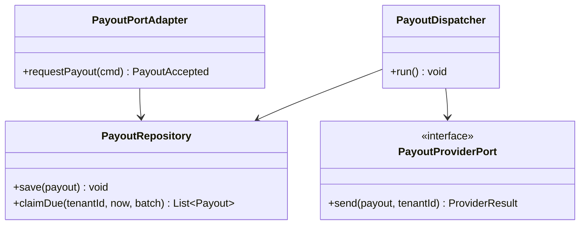
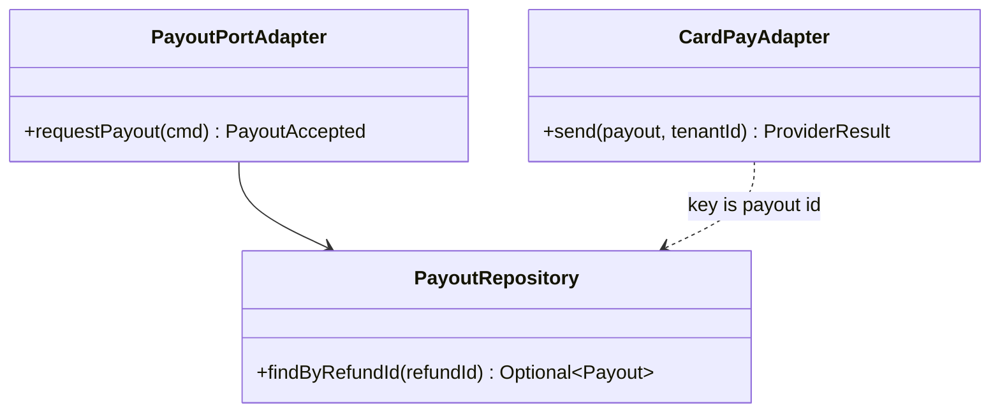
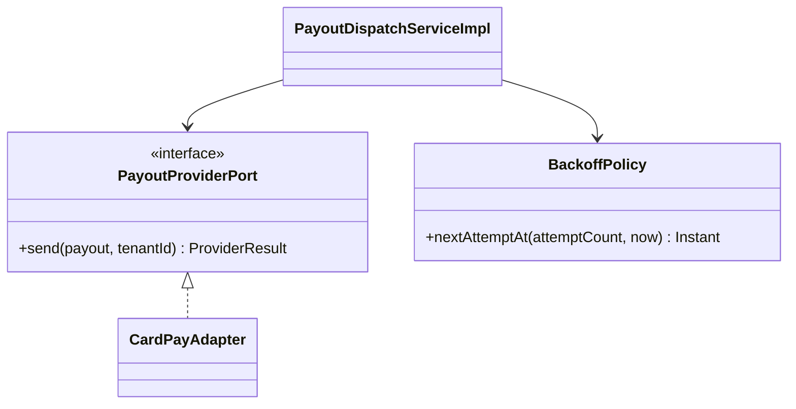
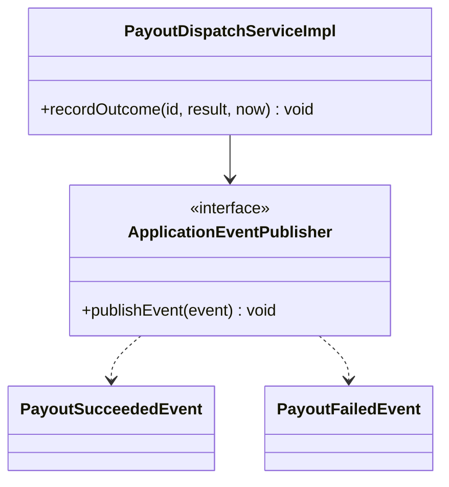
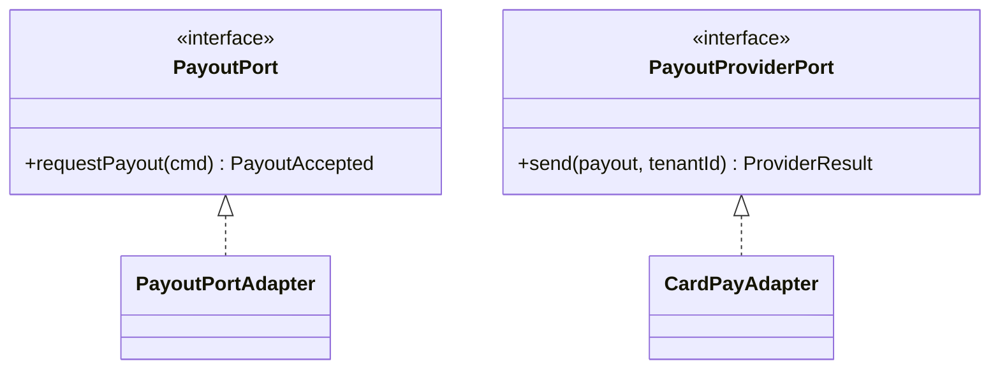
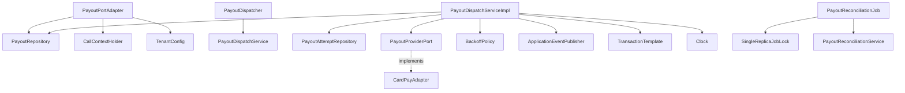
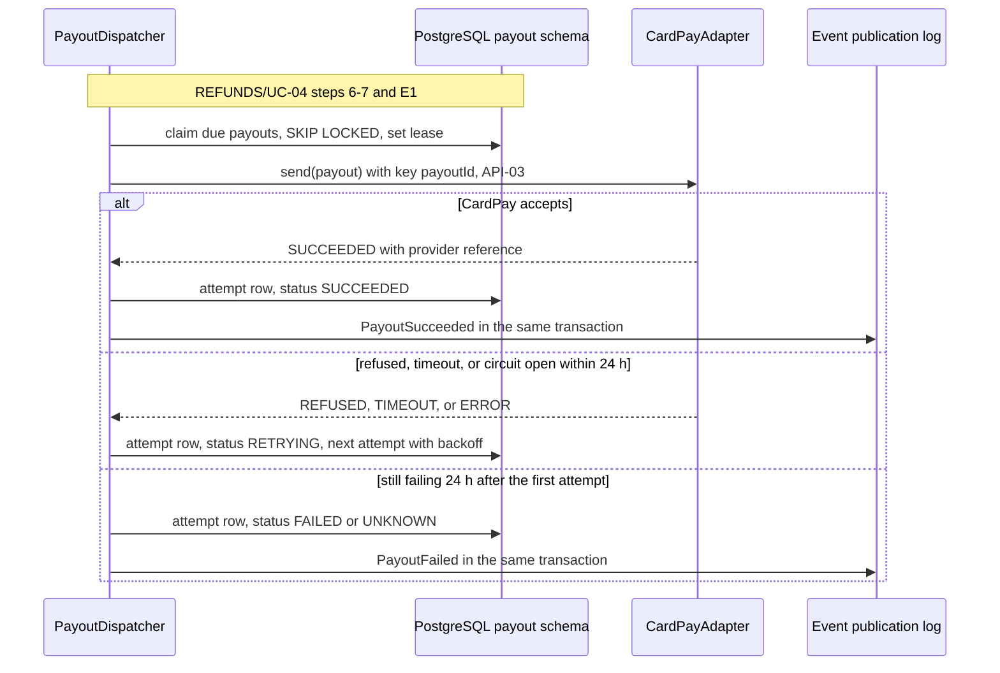
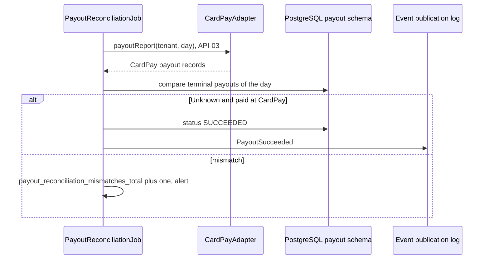

<!--
CHUNK: 04
TITLE: Per-Service Implementation - payout
PROJECT: Refunds Platform
VERSION: 1.0
DEPENDS_ON: 03, 09
PART OF: LLD - Refunds Platform
-->

# 7. Per-Service Implementation - payout

> **Bounded context:** SDD §13 row `payout` and [SDD §17.2 Boundaries](../../sdd-refunds-platform/13b-service-payout.md#boundaries)
>
> **Type:** module (SDD §13 Type; one part of the modular monolith's single deployable)
>
> **Source code:** not yet written (from-sdd); top-level package `payout` with sub-packages `api`, `domain`, `application`, `adapter` (ADR-01)
>
> **Owns use cases (SDD 09):** None - pays approved refunds through the payment provider
>
> **Participates in:** REFUNDS/UC-04 (owner: refund)

---

## 7.1 Responsibility

`payout` owns the `Payout` aggregate and its attempt log in schema `payout`: one payout per approved refund, recorded through `PayoutPort.requestPayout` (API-01) inside the approval transaction of `refund`, then sent to CardPay (API-03) by a background dispatcher with the payout ID as the idempotency key. It retries refusals and timeouts for up to 24 hours from the first attempt, ends each payout Succeeded, Failed, or Unknown, and reconciles terminal payouts with CardPay's records daily. It publishes `PayoutSucceeded` (listened to by `refund`) and `PayoutFailed` (listened to by `notification`), consumes no event, and owns no BRD use case. It does not own refund requests or their status (`refund`) or messages (`notification`), and it never reads another schema.

---

## 7.2 Class & Interface Map

> **Convention:** list the load-bearing classes only - controllers, services, service implementations, repositories, mappers, key domain types. Skip DTOs that are obvious from controller signatures.

### Controllers

None - no REST surface (SDD §17.2 API Standards). The driving adapters are:

| Class | Endpoints | Notes |
|-------|-----------|-------|
| `PayoutPortAdapter` | In-process port `PayoutPort.requestPayout` (API-01) | Checks `payout.payout.request` at the port; joins the caller's transaction (`MANDATORY`) |
| `PayoutDispatcher` | Scheduled job, every `PAYOUT_DISPATCH_INTERVAL_MS`, in every replica | Row claims with `FOR UPDATE SKIP LOCKED` and a dispatch lease |
| `PayoutReconciliationJob` | Scheduled daily job, one replica at a time | `SingleReplicaJobLock` (PostgreSQL advisory lock) |

> **Convention:** every entry point a § 7.8 traceability line names (REST method, event listener, scheduled job) carries `@UseCase("[KEY]/UC-NN")` with that use case's keyed ID (`09-cross-cutting.md` § 12.8). Platform endpoints carry none.

None of these carries `@UseCase`: SDD §7.3 lists no payout entry point (see § 7.8).

### Services (interfaces)

| Interface | Purpose | Implementations |
|-----------|---------|-----------------|
| `PayoutPort` (`payout.api`) | API-01: record the payout instruction | `PayoutPortAdapter` |
| `PayoutDispatchService` | Claim due payouts, send, record the outcome | `PayoutDispatchServiceImpl` |
| `PayoutReconciliationService` | Daily comparison with CardPay's records | `PayoutReconciliationServiceImpl` |
| `PayoutProviderPort` (driven port) | Send one payout; read CardPay's payout report (API-03) | `CardPayAdapter` (`adapter.out.cardpay`) |

### Service Implementations

| Class | Implements | Key methods |
|-------|------------|-------------|
| `PayoutPortAdapter` | `PayoutPort` | `requestPayout(...)` |
| `PayoutDispatchServiceImpl` | `PayoutDispatchService` | `dispatchDue(...)`, `recordOutcome(...)`; publishes `PayoutSucceeded`, `PayoutFailed` |
| `PayoutReconciliationServiceImpl` | `PayoutReconciliationService` | `reconcile(...)`; may publish `PayoutSucceeded` for a reconciled Unknown payout |
| `BackoffPolicy` (domain service) | - | `nextAttemptAt(attemptCount, now)`: exponential backoff with full jitter |

### Repositories

| Class | Entity | Notes |
|-------|--------|-------|
| `PayoutRepository` | `Payout` | `findByRefundId`, native `claimDue(tenantId, now, batch)` with `FOR UPDATE SKIP LOCKED` on index (`tenant_id`, `status`, `next_attempt_at`), `findTerminalBetween(from, to)` |
| `PayoutAttemptRepository` | `PayoutAttempt` | Insert-only attempt log |

### Domain Types (records)

| Type | Kind | Purpose |
|------|------|---------|
| `Payout` | entity | Aggregate root; `request`, `claim`, `succeed`, `retryAt`, `end(FAILED or UNKNOWN)`, `reconcile` |
| `PayoutAttempt` | entity | One CardPay call and its outcome |
| `PayoutStatus` | enum | `PENDING`, `RETRYING`, `SUCCEEDED`, `FAILED`, `UNKNOWN` |
| `AttemptOutcome` | enum | `SUCCEEDED`, `REFUSED`, `TIMEOUT`, `ERROR` |
| `ProviderResult` | record | Outcome, provider status, provider reference, failure reason, duration |
| `RequestPayoutCommand`, `PayoutAccepted` | record (`payout.api`) | API-01 DTOs, fields per SDD §15.3 |
| `PayoutSucceededEvent`, `PayoutFailedEvent` | record (`payout.api`) | In-process event DTOs, fields per SDD §14.10 |
| `InvalidPayoutRequestException`, `PayoutNotPermittedException`, `PayoutConflictException` | exception (`payout.api`) | API-01 typed errors (SDD §15.3) |

### Method Signatures (key methods only)

```java
public interface PayoutPort {
  PayoutAccepted requestPayout(RequestPayoutCommand command);
}

public interface PayoutDispatchService {
  int dispatchDue(UUID tenantId, Instant now);
}

public interface PayoutProviderPort {
  ProviderResult send(Payout payout, UUID tenantId);
  PayoutReport payoutReport(UUID tenantId, LocalDate day);
}

public interface PayoutReconciliationService {
  ReconciliationResult reconcile(UUID tenantId, LocalDate day);
}
```

> **Convention:** records are used for all DTOs (CLAUDE.md default). Constructor injection only - no `@Autowired` on fields.

> Confirm: class and method names follow the CLAUDE.md naming conventions plus the hexagonal suffixes; `PayoutReport` and `ReconciliationResult` depend on what CardPay offers (API-03, TBD - external).

### Ports and Adapters (in-process contracts)

| Port interface | Operation | API ID (§15) | Role here | Adapter class |
|----------------|-----------|--------------|-----------|---------------|
| `PayoutPort` | `requestPayout` | [API-01](../../sdd-refunds-platform/11-api-contracts.md#api-01-request-payout-refund---payout) | Provider | `PayoutPortAdapter` |

> **Convention:** modular monolith or hybrid core only: one row per SDD §15 `Internal (in-process)` contract this module provides or calls; the contract itself is in `06-api-contracts.md` § 9.6. The classes that publish or listen to in-process domain events (`07-event-contracts.md` § 10.6) go in the Service Implementations table, naming the event. A microservices SDD writes "Not applicable - no in-process contracts".

### Authorization

| Entry point | Kind | Permission token (SDD §16, verbatim) | Enforcement point |
|-------------|------|--------------------------------------|-------------------|
| `PayoutPort.requestPayout` | Port | `payout.payout.request` | At the port, in `PayoutPortAdapter`: the call context's principal holds the token and its `branch_id` equals `branchId` (SDD §15.3) |
| `PayoutDispatcher.run` | Job | None - system job | None |
| `PayoutReconciliationJob.run` | Job | None - system job | None |

> **Convention:** one row per entry point of this service (REST method, event listener, scheduled job, in-process port). Tokens are the SDD §16 permission tokens, verbatim; the role catalogue stays in the SDD (`sdd-to-lld.md` § One fact, one home). On an internal HTTP entry point the provider's filter or sidecar checks the caller's client-credentials token against the token (SDD §15.1). From code with no SDD: the scopes the code checks.

---

## 7.3 Method-Level Pseudocode (non-trivial logic only)

> **Convention:** include pseudocode only for methods where the algorithm is non-obvious. Skip for plain CRUD.

### `PayoutPortAdapter.requestPayout`

```text
@Transactional(propagation = MANDATORY)                  // joins the approval transaction (SDD §15.3 Behaviour)
1. ctx = callContext.current()
2. if not ctx.hasPermission("payout.payout.request") or ctx.branchId() != cmd.branchId()
     -> PayoutNotPermittedException (FORBIDDEN)
3. validate fields, amount > 0, scale <= 2, currency = tenant currency
     -> InvalidPayoutRequestException (VALIDATION_FAILED)
4. existing = repository.findByRefundId(cmd.refundId())
   if existing and existing.amount == cmd.amount -> return PayoutAccepted(existing.id, existing.status, existing.createdAt)
   if existing and amounts differ              -> PayoutConflictException (CONFLICT)
5. payout = Payout.request(uuidv7(), tenant, cmd, status = PENDING, nextAttemptAt = now)
6. repository.save(payout)                     // no provider call inside the port (ADR-09)
7. return PayoutAccepted(payout.id, PENDING, now)
```

> Confirm: pseudocode derived from SDD §15.3 API-01 and §17.2 Request; the currency check against the tenant currency (SDD §3 assumption 7) is an LLD addition.

### `PayoutDispatchServiceImpl.dispatchDue`

```text
for tenant in tenantConfig.tenants():                        // per-tenant loop, row-level security applies (SDD §11.2)
  callContext.runAsSystem(tenant)
  claimed = tx(REQUIRES_NEW) {
    rows = claimDue(tenant, now, PAYOUT_BATCH_SIZE)          // status PENDING or RETRYING, next_attempt_at <= now,
                                                             // ORDER BY next_attempt_at, FOR UPDATE SKIP LOCKED
    for row: row.firstAttemptAt = coalesce(row.firstAttemptAt, now)
             row.nextAttemptAt  = now + PAYOUT_CLAIM_LEASE   // dispatch lease: other replicas skip it
  }
  for payout in claimed:
    result = providerPort.send(payout, tenant)               // API-03 outside any transaction, key = payout.id
                                                             // open circuit -> ERROR "CIRCUIT_OPEN", counted as an attempt
    tx(REQUIRES_NEW) { recordOutcome(payout.id, result, now) }

recordOutcome(id, result, now):
  p = repository.findById(id)                                // optimistic version check
  attempts.insert(PayoutAttempt(p.id, now, result.outcome, result.providerStatus, result.durationMs, result.response))
  if result.outcome == SUCCEEDED:
    p.succeed(result.providerReference, now)
    events.publishEvent(PayoutSucceededEvent(payoutId, refundId, amount, providerReference, succeededAt = now))
  else if now < p.firstAttemptAt + 24h:
    p.retryAt(backoff.nextAttemptAt(p.attemptCount, now), result.reason)          // RETRYING
  else:
    p.end(result.outcome == REFUSED ? FAILED : UNKNOWN, result.reason)             // SDD §17.2 Failure
    events.publishEvent(PayoutFailedEvent(payoutId, refundId, refundReference, branchId, amount,
                                          firstAttemptAt, lastFailureReason))
```

> Confirm: pseudocode derived from SDD §17.2 Dispatch, Success, Failure, and Figure 17; the claim lease and the call outside the claim transaction are LLD choices (SDD §8.1.3 only says the dispatchers claim with row locks), so no database connection is held during a CardPay call.

> TODO: dispatcher poll interval, backoff initial delay, and maximum interval are open in SDD §17.2; best guess: poll every 30 s, initial delay 1 min doubling to a 1 h cap with full jitter, claim lease 2 min (longer than the CardPay timeout) - verify.

### `PayoutReconciliationServiceImpl.reconcile`

```text
under SingleReplicaJobLock("payout-reconciliation"), per tenant:
1. report = providerPort.payoutReport(tenant, day)            // TBD - external (API-03)
2. for p in repository.findTerminalBetween(day window):       // SUCCEEDED, FAILED, UNKNOWN
     paidAtCardPay = report.paid(p.id)
     if p.status == UNKNOWN and paidAtCardPay   -> p.reconcile(SUCCEEDED); publish PayoutSucceededEvent
     if p.status == UNKNOWN and not paid        -> p.reconcile(FAILED)          // PayoutFailed was already published
     if p.status != SUCCEEDED and paidAtCardPay -> mismatch, payout_reconciliation_mismatches_total++, alert
     if p.status == SUCCEEDED and not paid      -> mismatch, payout_reconciliation_mismatches_total++, alert
```

> TODO: the CardPay data source of the reconciliation (payout report or status query) is TBD - external in SDD §15.3 API-03; best guess: a daily payout report keyed by our idempotency key - verify with the CardPay documentation.

---

## 7.4 Design Patterns Applied

> **Convention:** every applied pattern carries name, triggering CLAUDE.md rule, roles, rationale specific to this service, Mermaid class diagram, and pseudocode skeleton. Patterns inferred from code (from-code) include `> Confirm:` unless a test exercises the pattern (`confidence-rules.md`); patterns proposed (from-sdd) carry the rule attribution explicitly.

### Pattern: Outbox (dispatch table for provider writes)

> **Applied:** Outbox pattern applied to the CardPay write (CLAUDE.md: "Outbox pattern is mandatory for any state change that must produce an event. No dual-writes to DB and Kafka."; SDD ADR-09)
>
> **Rationale (this service):** an approval must never exist without its payout instruction, and a payout must never be lost or sent twice (REFUNDS/NFR-01). Calling CardPay inside the approval would be a dual write of database and provider; instead the `payout` row commits with the approval and a separate dispatcher delivers it at least once, marking it Succeeded only after CardPay confirms.

**Roles:**

| Role | Class / Component | Notes |
|------|-------------------|-------|
| Outbox table | `payout.payout` (the dispatch table) | One row per refund; `status`, `next_attempt_at`, `attempt_count` |
| Outbox writer | `PayoutPortAdapter.requestPayout` (within the approval transaction) | `MANDATORY` propagation |
| Outbox publisher | `PayoutDispatcher` (scheduled, every replica, row claims with a lease) | Sends to CardPay; Succeeded only after CardPay confirms |

**Class diagram:**



**Summary:** the port adapter writes the payout row in the approval transaction, and the dispatcher reads due rows and sends them through the provider port.

**Pseudocode skeleton:**

```text
@Scheduled(fixedDelayString = "${PAYOUT_DISPATCH_INTERVAL_MS}")
void run() {
  for tenant in tenants {
    rows = claimDue(tenant, now, batch);                 // SKIP LOCKED + lease, short transaction
    for row in rows {
      result = provider.send(row, tenant);               // idempotency key = row.id
      if (result.outcome != SUCCEEDED) { recordRetryOrEnd(row, result); continue; }   // row stays retryable
      recordSuccess(row, result);                        // Succeeded only after CardPay confirms
    }
  }
}
```

**Delivery rules:**

- A payout is marked `SUCCEEDED` only after CardPay confirms the payout in its response.
- A refusal, timeout, or error leaves the payout `RETRYING` with a later `next_attempt_at`; nothing is marked done. After 24 hours from the first attempt it ends `FAILED` (last attempt refused) or `UNKNOWN` (outcome not known), never silently dropped.
- Duplicates are expected: a crash after CardPay accepted but before `recordOutcome` committed leaves the payout claimable once the lease ends, and the dispatcher sends it again with the same idempotency key (the payout ID), which CardPay must deduplicate (SDD R-01).

> TODO: whether CardPay deduplicates on an idempotency key, and whether the result returns in the response or by callback, are TBD - external (SDD §15.3 API-03); best guess: synchronous result with key-based deduplication - verify before build, since a callback changes the success path.

### Pattern: Idempotency (API-01 and the CardPay key)

> **Applied:** Idempotency (CLAUDE.md: "Idempotency keys on all write endpoints touching money/wallet/notifications or external providers.")
>
> **Rationale (this service):** API-01 is a money write repeated whenever `refund` retries a decision with the same idempotency key; it must return the first payout, never a second one. Every CardPay call is a money write to an external provider and carries the payout ID, the same on every retry (ADR-09).

**Roles:**

| Role | Class / Component |
|------|-------------------|
| Dedup store | Unique (`tenant_id`, `refund_id`) on `payout.payout` |
| Idempotency check | `PayoutPortAdapter.requestPayout` step 4 |
| Provider key | `CardPayAdapter.send`: the payout ID as the CardPay idempotency key |

**Class diagram:**



**Summary:** API-01 dedups on the refund ID through the repository, and every CardPay call reuses the payout ID as its key.

**Pseudocode skeleton:**

```text
PayoutAccepted requestPayout(cmd) {
  existing = repository.findByRefundId(cmd.refundId());
  if (existing.isPresent()) return sameAmount(existing, cmd) ? accepted(existing) : throw new PayoutConflictException();
  return accepted(repository.save(Payout.request(cmd)));
}
ProviderResult send(payout, tenant) { return cardPay.post(payoutRequest(payout), idempotencyKey = payout.id()); }
```

### Pattern: Resilience4j on the CardPay call

> **Applied:** Resilience defaults (CLAUDE.md: "Resilience defaults: timeouts, retries with exponential backoff and jitter, circuit breakers (Resilience4j), bulkheads for downstream provider calls (e.g., eSIM, payment, SMS).")
>
> **Rationale (this service):** CardPay is a payment provider in the same failure domain as every module (SDD R-06); a bulkhead bounds concurrent calls, a timeout bounds each call, and the circuit breaker stops calls during an outage. Retries with exponential backoff and jitter are the dispatcher's schedule (`BackoffPolicy`), not an in-call retry, so a retry never overlaps a call whose outcome is still unknown.

**Roles:**

| Role | Class / Component |
|------|-------------------|
| Bulkhead, circuit breaker, timeout | Resilience4j instance `cardpay` on `CardPayAdapter.send` (`09-cross-cutting.md` § 12.3) |
| Retry with backoff and jitter | `BackoffPolicy` via `next_attempt_at` |
| Fallback | `ProviderResult` with outcome `ERROR` (open circuit, bulkhead full) |

**Class diagram:**



**Summary:** the dispatch service calls CardPay only through the guarded provider port and schedules retries with `BackoffPolicy`.

**Pseudocode skeleton:**

```text
@Bulkhead(name = "cardpay") @CircuitBreaker(name = "cardpay", fallbackMethod = "notCalled")
ProviderResult send(payout, tenant) { ... HTTP call with the cardpay timeout ... }
ProviderResult notCalled(payout, tenant, Throwable t) { return ProviderResult.error("CIRCUIT_OPEN or BULKHEAD_FULL"); }

Instant nextAttemptAt(n, now) { return now.plus(random(0, min(MAX, INITIAL * 2^n))); }   // full jitter
```

### Pattern: Durable in-process event publication

> **Applied:** In-process domain events from a durable publication log (CLAUDE.md: "Event-driven by default for cross-service flows"; SDD ADR-02, §14.10)
>
> **Rationale (this service):** `PayoutSucceeded` must reach `refund` and `PayoutFailed` must reach `notification` even if the deployable stops right after the outcome commits; publishing them in the outcome transaction keeps `payout` free of any dependency on its listeners (ADR-05: no `payout` to `refund` call).

**Roles:**

| Role | Class / Component |
|------|-------------------|
| Publisher | `PayoutDispatchServiceImpl.recordOutcome`, `PayoutReconciliationServiceImpl.reconcile` via `ApplicationEventPublisher` |
| Publication log | Spring Modulith event publication registry, schema `platform` |
| Listeners (other modules) | `refund` `PayoutSucceededListener`, `notification` `PayoutFailedListener` |

**Class diagram:**



**Summary:** outcome recording publishes `PayoutSucceeded` or `PayoutFailed` through the event publisher in the same transaction.

**Pseudocode skeleton:**

```text
tx { payout.succeed(ref, now); events.publishEvent(new PayoutSucceededEvent(uuidv7(), now, tenant, correlationId, ...)); }
```

### Pattern: Ports and Adapters (hexagonal)

> **Applied:** Ports and adapters (CLAUDE.md: "Layered architecture (controller, service, service impl, entity, repository, dto, etc.) unless specified (e.g., enforce hexagonal)."; SDD §6 Architecture Doctrine)
>
> **Rationale (this service):** `refund` must depend on `PayoutPort` only, never on `payout` classes or its schema, so `payout` stays extractable (ADR-01 trigger); CardPay sits behind `PayoutProviderPort`, an anti-corruption layer whose contract is still TBD - external.

**Roles:**

| Role | Class / Component |
|------|-------------------|
| Provided port and adapter | `PayoutPort` (`payout.api`) / `PayoutPortAdapter` |
| Driven port and adapter | `PayoutProviderPort` / `CardPayAdapter` |

**Class diagram:**



**Summary:** `PayoutPort` is the only way into the module and `PayoutProviderPort` the only way out to CardPay.

**Pseudocode skeleton:**

```text
package payout.api;          public interface PayoutPort { PayoutAccepted requestPayout(RequestPayoutCommand c); }
package payout.application;  class PayoutPortAdapter implements PayoutPort { ... }      // the only entry into payout
package payout.adapter.out.cardpay; class CardPayAdapter implements PayoutProviderPort { ... }
```

### Pattern: RFC 9457 Problem Details

> **Not applied in this module:** no REST surface. The three API-01 errors extend `ServiceException` with their SDD §15.1 `errorCode` and are translated by `refund`'s advice ([refund § 7.7](./refund.md#77-error-handling)).

### Pattern: Saga (choreography, in process)

> **Participant:** step 2 of the choreography described in [refund § 7.4](./refund.md#74-design-patterns-applied), plus the reconciled outcome of an Unknown payout; no compensation is defined for a Failed or Unknown payout (SDD §17.2 After Failed, open). Step detail: § 7.8 below.

---

## 7.5 Dependency Injection Graph

> **Convention:** constructor injection only. Document the wiring graph for non-trivial cases (3+ collaborators, or any factory/strategy/mediator wiring).



**Summary:** the dispatch service composes the repositories, the provider port, the backoff policy, and the event publisher; the reconciliation job runs under the single-replica lock.

---

## 7.6 Transaction Boundaries

| Method | Propagation | Isolation | Rollback rules |
|--------|-------------|-----------|----------------|
| `PayoutPortAdapter.requestPayout` | `MANDATORY` (joins the approval transaction of `refund`) | `READ_COMMITTED` (the caller's) | Any of the three API-01 errors rolls back the whole approval |
| `PayoutDispatchServiceImpl` claim | `REQUIRES_NEW` via `TransactionTemplate` | `READ_COMMITTED` | Rollback releases the claim |
| CardPay call | None (outside any transaction) | - | - |
| `PayoutDispatchServiceImpl.recordOutcome` | `REQUIRES_NEW` | `READ_COMMITTED` | Rollback on any exception: the lease expires and the payout is claimed again |
| `PayoutReconciliationServiceImpl.reconcile` | One `REQUIRES_NEW` transaction per payout | `READ_COMMITTED` | Per-payout rollback; the job continues |

> **Convention:** outbox row insert lives inside the same transaction as the aggregate write. No `@Transactional(propagation = REQUIRES_NEW)` for outbox writes - the whole point of the pattern is one-tx commit.

> Confirm: transaction propagation defaults applied per CLAUDE.md, with `MANDATORY` on the port; verify per method.

---

## 7.7 Error Handling

| Exception | RFC 9457 type | `errorCode` (SDD §15.1) | HTTP Status | When thrown | Caller action |
|-----------|---------------|-------------------------|-------------|-------------|---------------|
| `InvalidPayoutRequestException` | `/problems/payout/invalid-request` | `VALIDATION_FAILED` | None (typed error; 400 at `refund`'s REST edge) | API-01 field missing, amount not more than 0, unknown currency | Roll back the approval; return the error to the manager |
| `PayoutNotPermittedException` | `/problems/payout/not-permitted` | `FORBIDDEN` | None (403 at the REST edge) | Call context lacks `payout.payout.request`, or another branch | Roll back the approval; alert |
| `PayoutConflictException` | `/problems/payout/conflict` | `CONFLICT` | None (409 at the REST edge) | A payout exists for `refundId` with another amount | Roll back the approval; re-read the request |
| CardPay refusal, timeout, error, open circuit | - | - | None (never thrown to a caller) | Dispatcher attempt | Recorded as an attempt outcome; Retrying, then Failed or Unknown (REFUNDS/UC-04 E1 is a state, not an error) |

> **Convention:** all exceptions extend `ServiceException` (CLAUDE.md base class). Global `@RestControllerAdvice` translates to `ProblemDetails` (RFC 9457). Error envelope schema in `09-cross-cutting.md` § Error Model.

---

## 7.8 Use-Case Workflows

> **Convention:** one subsection per active use case this service owns (SDD §7.3 Owner), headed with the SDD's BRD key and the BRD's ID and title exactly. A merged or removed use case gets no block. Cross-service sagas live in the orchestrator service's file. Each workflow has: the traceability line, control flow, sequence diagram (Mermaid), idempotency points, outbox emission points, retry/timeout choices.

`payout` owns no use case (SDD §13).

### Participates in REFUNDS/UC-04: Approve / Reject Refund

> **Owner's block:** [refund § REFUNDS/UC-04](./refund.md#refundsuc-04-approve--reject-refund) · Part realised here: REFUNDS/UC-04 step 6 (payout sent to the original card), step 7 (payout succeeds), E1 (payout fails, retried, branch manager told after one day) · Entry points here: None - SDD §7.3 names no payout entry point; the part runs through the API-01 port and the dispatcher schedule

**Control flow:**

```text
1. PayoutPort.requestPayout inside the approval: PENDING row, no provider call   (REFUNDS/UC-04 step 6)
2. Dispatcher claims the due payout, calls CardPay with the payout ID as key      (REFUNDS/UC-04 step 6)
3. CardPay accepts: SUCCEEDED and PayoutSucceeded in one transaction (publication point)   (REFUNDS/UC-04 step 7)
4. Refused, timed out, or circuit open: RETRYING with backoff and jitter          (REFUNDS/UC-04 E1)
5. 24 h after the first attempt: FAILED (refused) or UNKNOWN (unresolved), PayoutFailed (publication point)
                                                                                  (REFUNDS/UC-04 E1)
```

**Sequence diagram:**



**Summary:** each cycle claims due payouts, calls CardPay outside any transaction, and records success, a retry, or a terminal Failed or Unknown state with its event.

**Idempotency points:** API-01 keyed on `refundId`; every CardPay call keyed on the payout ID; an Unknown payout is never retried or re-requested until reconciled.

**Outbox emission points:** the `payout` row written by API-01 is the dispatch-table outbox entry for the CardPay write; publication points: `PayoutSucceeded` (step 3), `PayoutFailed` (step 5).

**Retry / timeout policy:** dispatcher backoff with full jitter until 24 h after the first attempt (TODO values in § 7.3); Resilience4j `cardpay` bulkhead, circuit breaker, and timeout (`09-cross-cutting.md` § 12.3).

**Error handling:** API-01 errors roll back the approval (§ 7.7); provider failures are attempt outcomes, never errors to a caller.

### Workflow: Daily payout reconciliation

> **Traceability:** No BRD use case - REFUNDS/NFR-01 control ([REFUNDS 10 § NFRs](../../brd-refunds-portal/10-nfrs.md#non-functional-requirements); SDD §17.2 Reconciliation)

**Trigger:** `PayoutReconciliationJob` (daily, one replica under `SingleReplicaJobLock`).

**Control flow:**

```text
1. For each tenant, read CardPay's payout records for the day (API-03, TBD - external)
2. Settle Unknown payouts: paid -> SUCCEEDED and PayoutSucceeded; not paid -> FAILED
3. Count and alert every mismatch (paid at CardPay but not Succeeded, or Succeeded but not paid)
```

**Sequence diagram:**



**Summary:** the daily job compares the day's terminal payouts with CardPay's records, settles Unknown payouts, and alerts on mismatches.

**Idempotency points:** re-running the job for a day changes nothing already settled.

**Outbox emission points:** publication point: `PayoutSucceeded` for a reconciled Unknown payout.

**Retry / timeout policy:** the next daily run retries a failed report read; Resilience4j `cardpay` applies.

**Error handling:** a report read failure is logged at ERROR and alerted; no payout changes state.

### Cross-service Saga (orchestrator role)

> **Only present if this service is the orchestrator of a multi-service saga.** Choreography-style sagas (each service reacts to events without an orchestrator) are documented per-step in the participating services' workflow sections.

Not applicable for this service: participant of a choreography (see [refund § 7.4](./refund.md#74-design-patterns-applied)).

<!-- MASTER: refunds-platform-lld-master.md | PREV: 04-implementation/notification.md | NEXT: 04-implementation/refund.md -->
