<!--
CHUNK: 04
TITLE: Per-Service Implementation - refund
PROJECT: Refunds Platform
VERSION: 1.0
DEPENDS_ON: 03, 09
PART OF: LLD - Refunds Platform
-->

# 7. Per-Service Implementation - refund

> **Bounded context:** SDD §13 row `refund` and [SDD §17.1 Boundaries](../../sdd-refunds-platform/13a-service-refund.md#boundaries)
>
> **Type:** module (SDD §13 Type; one part of the modular monolith's single deployable)
>
> **Source code:** not yet written (from-sdd); top-level package `refund` with sub-packages `api`, `domain`, `application`, `adapter` (ADR-01)
>
> **Owns use cases (SDD 09):** [REFUNDS/UC-01](../../brd-refunds-portal/06a-use-cases-customer.md#uc-01-request-a-refund), [REFUNDS/UC-02](../../brd-refunds-portal/06a-use-cases-customer.md#uc-02-track-refund-status-web-and-mobile), [REFUNDS/UC-03](../../brd-refunds-portal/06a-use-cases-customer.md#uc-03-cancel-a-refund-request), [REFUNDS/UC-04](../../brd-refunds-portal/06b-use-cases-branch-manager.md#uc-04-approve--reject-refund)
>
> **Participates in:** None

---

## 7.1 Responsibility

`refund` owns the `RefundRequest` aggregate: the request, its items (one POS receipt line each), its status history, the branch manager's decision, and the customer contact snapshot taken at submission, plus per-tenant reference numbers and the branch refund report. It is the only writer of schema `refund`. It reads receipts from POS Records (API-02) and, on approval, records the payout instruction through `PayoutPort.requestPayout` (API-01) in the approval transaction. It publishes four in-process events (`RefundSubmitted`, `RefundCancelled`, `RefundRejected`, `RefundPaid`) that `notification` and `loyalty` consume, and it consumes one (`PayoutSucceeded`) to move a request from Approved to Paid. It does not own payouts (`payout`), messages (`notification`), points (`loyalty`), or receipts (POS Records).

---

## 7.2 Class & Interface Map

> **Convention:** list the load-bearing classes only - controllers, services, service implementations, repositories, mappers, key domain types. Skip DTOs that are obvious from controller signatures.

### Controllers

| Class | Endpoints | Notes |
|-------|-----------|-------|
| `ReceiptController` | `GET /v1/receipts/{receiptNumber}/refundable-items` | `refund.receipt.read`; `@UseCase("REFUNDS/UC-01")`; rate-limited per customer at the gateway |
| `RefundRequestController` | `POST /v1/refund-requests`, `GET /v1/refund-requests`, `GET /v1/refund-requests/{refundId}`, `POST /v1/refund-requests/{refundId}/cancellation`, `POST /v1/refund-requests/{refundId}/decision` | Tokens per method (Authorization below); `Idempotency-Key` required on the three POSTs; `@UseCase` values: `REFUNDS/UC-01`, `REFUNDS/UC-02`, `REFUNDS/UC-02,REFUNDS/UC-04`, `REFUNDS/UC-03`, `REFUNDS/UC-04` in that order |
| `BranchRefundController` | `GET /v1/branches/{branchId}/refund-requests`, `GET /v1/branches/{branchId}/refund-report` | `@UseCase("REFUNDS/UC-04")` on the queue; the report carries none (no §7.3 use case) |
| `PayoutSucceededListener` (`adapter.in.event`) | In-process listener for `PayoutSucceeded` | System principal; no `@UseCase` (§7.3 lists no event entry point) |

> **Convention:** every entry point a § 7.8 traceability line names (REST method, event listener, scheduled job) carries `@UseCase("[KEY]/UC-NN")` with that use case's keyed ID (`09-cross-cutting.md` § 12.8). Platform endpoints carry none.

> Confirm: SDD §7.3 lists no event entry point for REFUNDS/UC-04 step 7, so `PayoutSucceededListener` carries no `use_case` and its log lines and spans are not found by a use-case search; an SDD §7.3 update (`Event: PayoutSucceeded`) would add `@UseCase("REFUNDS/UC-04")`.

> Confirm: `GET /v1/branches/{branchId}/refund-report` serves REFUNDS 09 Reporting, which no BRD use case covers; it carries no `@UseCase` (behaviour no BRD use case covers: an open question, never a new UC).

### Services (interfaces)

| Interface | Purpose | Implementations |
|-----------|---------|-----------------|
| `ReceiptLookupService` | Refundable lines of a receipt (REFUNDS/UC-01 steps 1-2) | `ReceiptLookupServiceImpl` |
| `RefundRequestService` | Submit, list own, read one, cancel | `RefundRequestServiceImpl` |
| `RefundDecisionService` | Branch queue, approve, reject | `RefundDecisionServiceImpl` |
| `RefundPaymentService` | Approved to Paid on `PayoutSucceeded` | `RefundPaymentServiceImpl` |
| `BranchRefundReportService` | Daily branch refund report | `BranchRefundReportServiceImpl` |
| `ReceiptLookupPort` (driven port) | Receipt read from POS Records (API-02) | `PosReceiptAdapter` (`adapter.out.pos`) |
| `ReferenceNumberGenerator` (driven port) | Next per-tenant reference number | `JdbcReferenceNumberGenerator` |

### Service Implementations

| Class | Implements | Key methods |
|-------|------------|-------------|
| `ReceiptLookupServiceImpl` | `ReceiptLookupService` | `refundableItems(...)` |
| `RefundRequestServiceImpl` | `RefundRequestService` | `submit(...)`, `listOwn(...)`, `get(...)`, `cancel(...)` |
| `RefundDecisionServiceImpl` | `RefundDecisionService` | `branchQueue(...)`, `decide(...)` |
| `RefundPaymentServiceImpl` | `RefundPaymentService` | `onPayoutSucceeded(...)` |
| `BranchRefundReportServiceImpl` | `BranchRefundReportService` | `report(...)` |
| `RefundAccessPolicy` (domain service) | - | `requireReadable(request, ctx)`, `requireOwnBranch(branchId, ctx)`, `requireNotOwnRequest(request, ctx)` |
| `RefundWindowPolicy` (domain service) | - | `isWithinWindow(purchasedAt, at)`: one function for the 30-day rule (SDD §3 assumption 8) |

### Repositories

| Class | Entity | Notes |
|-------|--------|-------|
| `RefundRequestRepository` | `RefundRequest` (cascades items and history) | Spring Data JPA; `findByIdAndCustomerId`, `findByCustomerId(cursor)`, `findBranchQueue(branchId, cursor)` (Submitted, oldest first), `findByIdForDecision` |
| `RefundRequestItemRepository` | `RefundRequestItem` | `findActivePosLineIds(receiptNumber)`: partial unique index `uq_refund_item_active` backs it |
| `BranchRefundReportQuery` | - (read model) | `JdbcClient` aggregates over `refund_status_history` and `refund_request` |
| `IdempotencyRecordRepository` | `IdempotencyRecord` | PK (`tenant_id`, `idempotency_key`) |

### Domain Types (records)

| Type | Kind | Purpose |
|------|------|---------|
| `RefundRequest` | entity | Aggregate root; transitions `submit`, `cancel`, `approve`, `reject`, `attachPayout`, `markPaid`, each guarded by status and `version` |
| `RefundRequestItem`, `RefundStatusHistory` | entity | Item (one POS line, `active` flag) and one row per status change |
| `RefundStatus` | enum | `SUBMITTED`, `APPROVED`, `REJECTED`, `CANCELLED`, `PAID` |
| `ContactSnapshot` | record (embeddable) | `email`, `mobile`, `locale` from the token claims (ADR-07) |
| `PosReceipt`, `PosReceiptLine` | record | Port DTOs of API-02 (fields per the API-02 marker, TBD - external) |
| `RefundRequestCreate`, `RefundDecision` | record | Request bodies, SDD §17.1 names and fields |
| `RefundableReceipt`, `RefundRequestCreated`, `RefundRequestPage`, `RefundRequestDetail`, `BranchRefundReport` | record | Response bodies, SDD §17.1 List of APIs names (shapes in 06 § 9.2) |
| `RefundSubmittedEvent`, `RefundCancelledEvent`, `RefundRejectedEvent`, `RefundPaidEvent`, `ContactPoint` | record (`refund.api`) | In-process event DTOs, fields per SDD §14.10 and §14.9.0 |

### Method Signatures (key methods only)

```java
public interface RefundRequestService {
  RefundRequestCreated submit(RefundRequestCreate body, IdempotencyKey key, CallContext ctx);
  RefundRequestPage listOwn(PageCursor cursor, int size, CallContext ctx);
  RefundRequestDetail get(UUID refundId, CallContext ctx);
  RefundRequestDetail cancel(UUID refundId, IdempotencyKey key, CallContext ctx);
}

public interface RefundDecisionService {
  RefundRequestPage branchQueue(String branchId, PageCursor cursor, int size, CallContext ctx);
  RefundRequestDetail decide(UUID refundId, RefundDecision body, IdempotencyKey key, CallContext ctx);
}

public interface ReceiptLookupService {
  RefundableReceipt refundableItems(String receiptNumber, CallContext ctx);
}

public interface RefundPaymentService {
  void onPayoutSucceeded(PayoutSucceededEvent event);
}

public interface BranchRefundReportService {
  BranchRefundReport report(String branchId, LocalDate day, CallContext ctx);
}

public interface ReceiptLookupPort {
  PosReceipt lookup(String receiptNumber, UUID tenantId);
}
```

> **Convention:** records are used for all DTOs (CLAUDE.md default). Constructor injection only - no `@Autowired` on fields.

> Confirm: class and method names follow the CLAUDE.md naming conventions (`*Controller`, `*Service`, `*ServiceImpl`, `*Repository`) plus the hexagonal suffixes (`*Port`, `*Adapter`, `*Listener`); verify with the team.

### Ports and Adapters (in-process contracts)

| Port interface | Operation | API ID (§15) | Role here | Adapter class |
|----------------|-----------|--------------|-----------|---------------|
| `PayoutPort` | `requestPayout` | [API-01](../../sdd-refunds-platform/11-api-contracts.md#api-01-request-payout-refund---payout) | Caller | - (provider side: `PayoutPortAdapter` in `payout`) |

> **Convention:** modular monolith or hybrid core only: one row per SDD §15 `Internal (in-process)` contract this module provides or calls; the contract itself is in `06-api-contracts.md` § 9.6. The classes that publish or listen to in-process domain events (`07-event-contracts.md` § 10.6) go in the Service Implementations table, naming the event. A microservices SDD writes "Not applicable - no in-process contracts".

Publishers and listeners here: `RefundRequestServiceImpl` publishes `RefundSubmitted` and `RefundCancelled`; `RefundDecisionServiceImpl` publishes `RefundRejected`; `RefundPaymentServiceImpl` publishes `RefundPaid`; `PayoutSucceededListener` listens to `PayoutSucceeded`.

### Authorization

| Entry point | Kind | Permission token (SDD §16, verbatim) | Enforcement point |
|-------------|------|--------------------------------------|-------------------|
| `GET /v1/receipts/{receiptNumber}/refundable-items` | REST | `refund.receipt.read` | `@PreAuthorize` on `ReceiptController.refundableItems`; no ownership gate (SDD §16.5 footnote ¹, R-08) |
| `POST /v1/refund-requests` | REST | `refund.request.create` | `@PreAuthorize` on `RefundRequestController.submit`; owner is the token subject |
| `GET /v1/refund-requests` | REST | `refund.request.read` | `@PreAuthorize`; query bound to `customer_id` = subject |
| `GET /v1/refund-requests/{refundId}` | REST | `refund.request.read` | `@PreAuthorize`; `RefundAccessPolicy.requireReadable`: role `CUSTOMER` own request (else 404), role `BRANCH_MANAGER` own branch (else 403), SDD §16.8 rule 6 |
| `POST /v1/refund-requests/{refundId}/cancellation` | REST | `refund.request.cancel` | `@PreAuthorize`; own request (else 404) |
| `POST /v1/refund-requests/{refundId}/decision` | REST | `refund.request.decide` | `@PreAuthorize`; `requireOwnBranch` (403) and `requireNotOwnRequest` (403, self-decision guard); API-01 re-checks `payout.payout.request` at the port |
| `GET /v1/branches/{branchId}/refund-requests` | REST | `refund.request.read` | `@PreAuthorize`; path `branchId` equals the `branch_id` claim (else 403) |
| `GET /v1/branches/{branchId}/refund-report` | REST | `refund.report.read` | `@PreAuthorize`; own branch (else 403) |
| `PayoutSucceededListener.on` | Listener | None - system consumer | None |

> **Convention:** one row per entry point of this service (REST method, event listener, scheduled job, in-process port). Tokens are the SDD §16 permission tokens, verbatim; the role catalogue stays in the SDD (`sdd-to-lld.md` § One fact, one home). On an internal HTTP entry point the provider's filter or sidecar checks the caller's client-credentials token against the token (SDD §15.1). From code with no SDD: the scopes the code checks.

---

## 7.3 Method-Level Pseudocode (non-trivial logic only)

> **Convention:** include pseudocode only for methods where the algorithm is non-obvious. Skip for plain CRUD.

### `ReceiptLookupServiceImpl.refundableItems`

```text
1. receipt = receiptLookupPort.lookup(receiptNumber, ctx.tenantId())     // API-02, no DB transaction open
     unknown receipt                -> ReceiptNotFoundException (404 RECEIPT_NOT_FOUND)  (REFUNDS/UC-01 E2)
     timeout, 503, circuit open     -> PosUnavailableException (503 UNAVAILABLE)
2. if not windowPolicy.isWithinWindow(receipt.purchasedAt(), clock.instant())
     -> RefundWindowExpiredException (422)                                 (REFUNDS/UC-01 E1)
3. if receipt.cardPaidAmount() == 0 -> NoCardPaymentException (422 NO_CARD_PAYMENT)
4. active = itemRepository.findActivePosLineIds(receiptNumber)            // short read-only transaction
5. lines = receipt.lines().map(l -> l with refundable = !active.contains(l.lineId()) && !l.refundedAtPos())
                                                                          (REFUNDS/UC-01 A1)
6. return RefundableReceipt(receipt, lines)
```

> Confirm: pseudocode derived from SDD §17.1 Business Logic (Receipt lookup); the POS field names are placeholders until API-02 is supplied.

### `RefundRequestServiceImpl.submit`

```text
1. replay = idempotency.replayIfPresent(tenant, key, sha256(body))       // stored 201, or 409 CONFLICT on another body
   if replay present -> return replay
2. receipt = receiptLookupPort.lookup(body.receiptNumber(), tenant)       // before the transaction opens (SDD §17.1 Submit)
3. contact = ContactSnapshot(ctx.email(), ctx.phoneNumber(), ctx.locale())  // no email claim -> 400 VALIDATION_FAILED
4. transactionTemplate.execute:                                           // REQUIRED, READ_COMMITTED
   a. window check as in refundableItems step 2; no card payment -> NO_CARD_PAYMENT
   b. selected = receipt lines matching body.items[].posLineId; unknown line -> 400 VALIDATION_FAILED
   c. any selected line active or refunded at POS -> ITEM_ALREADY_REFUNDED
                                       (REFUNDS/UC-01 BR-2: an item is refunded only once)
   d. requested = sum(selected.amount); requested > receipt.cardPaidAmount() -> CARD_AMOUNT_EXCEEDED
   e. reference = referenceNumbers.next(tenant)
   f. request = RefundRequest.submit(uuidv7(), tenant, reference, ctx.subject(), contact,
                                     receipt, selected, body.reason(), now)  // SUBMITTED, items active, history row
   g. repository.saveAndFlush(request)   // uq_refund_item_active violation -> ITEM_ALREADY_REFUNDED
   h. events.publishEvent(RefundSubmittedEvent(...))                      // publication log, same transaction
   i. idempotency.store(tenant, key, hash, 201, response)                 // PK violation -> rollback, then step 1
5. return RefundRequestCreated(refundId, referenceNumber, status, requestedAmount)
```

> Confirm: pseudocode derived from SDD §17.1 Submit; the replay-on-PK-violation step is an LLD design that uses the SDD `idempotency_record` table as defined (no in-progress status).

### `RefundRequestServiceImpl.cancel`

```text
1. replay check as in submit step 1
2. in one transaction:
   a. request = repository.findByIdAndCustomerId(refundId, ctx.subject()) else 404 NOT_FOUND
   b. request.cancel(ctx.subject(), now)      // status != SUBMITTED -> REFUND_ALREADY_DECIDED (REFUNDS/UC-03 E1)
                                              // items active = false, history row
   c. events.publishEvent(RefundCancelledEvent(...))
   d. idempotency.store(...)
3. commit; ObjectOptimisticLockingFailureException (a decision committed first) -> 409 REFUND_ALREADY_DECIDED
```

### `RefundDecisionServiceImpl.decide`

```text
1. replay check as in submit step 1
2. in one transaction (REQUIRED, READ_COMMITTED):
   a. request = repository.findByIdForDecision(refundId) else 404 NOT_FOUND
   b. accessPolicy.requireOwnBranch(request.branchId(), ctx)   // 403 (REFUNDS/UC-04 BR-1: own branch only)
   c. accessPolicy.requireNotOwnRequest(request, ctx)          // 403, self-decision guard (SDD §17.1)
   d. request.status() != SUBMITTED -> 409 REFUND_ALREADY_DECIDED
   e. REJECT: blank reason -> 422 REJECTION_REASON_REQUIRED          (REFUNDS/UC-04 A2)
              request.reject(reason, actor, now); events.publishEvent(RefundRejectedEvent(...))
   f. APPROVE: approved = body.amount() == null ? request.requestedAmount() : body.amount()
              partial and not (0 < amount < requested, same currency, scale <= 2, reason present)
                -> 422 PARTIAL_AMOUNT_INVALID   (REFUNDS/UC-04 BR-2: partial amount more than 0 and less than the requested amount)
              request.approve(approved, reason, actor, now)
              accepted = payoutPort.requestPayout(new RequestPayoutCommand(
                  refundId, referenceNumber, branchId, purchaseReference, approved))   // API-01, joins this transaction
              request.attachPayout(accepted.payoutId())
              API-01 errors propagate -> rollback -> VALIDATION_FAILED 400 / FORBIDDEN 403 / CONFLICT 409
   g. idempotency.store(...)
3. commit; optimistic lock failure (a cancellation committed first) -> 409 REFUND_ALREADY_DECIDED
4. return RefundRequestDetail
```

> Confirm: pseudocode derived from SDD §17.1 Approve, Reject, Self-decision guard, and Figure 14; a missing reason on a partial approval maps to `PARTIAL_AMOUNT_INVALID` as Figure 14 draws it.

### `RefundPaymentServiceImpl.onPayoutSucceeded`

```text
@ApplicationModuleListener on PayoutSucceededListener   // after the payout commit, async, own transaction
1. callContext.runAsSystem(event.tenantId(), event.correlationId())
2. request = repository.findById(event.refundId()) else poison (log ERROR, alert, throw)
3. if request.status() == PAID and request.payoutId() == event.payoutId() -> return     // repeat: no-op
4. if request.status() != APPROVED or event.amount() != request.approvedAmount()
     -> log ERROR, refund_poison_events_total++, throw PoisonEventException            // publication stays incomplete
5. request.markPaid(event.succeededAt())                                                // history row
6. events.publishEvent(RefundPaidEvent(refundId, referenceNumber, customerId, contact,
                                       purchaseReference, paidAmount = approvedAmount, paidAt = succeededAt))
7. commit -> the publication of PayoutSucceeded to this listener is marked complete
```

> Confirm: SDD §17.1 says the listener dedups on `eventId`; this LLD dedups on the Approved to Paid transition and the `payoutId` (a re-delivered publication carries the same `eventId` and finds the request Paid), with no consumed-event table.

### `BranchRefundReportServiceImpl.report`

```text
1. accessPolicy.requireOwnBranch(branchId, ctx)                                          // 403
2. zone = tenantConfig.timeZone(tenant); [from, to) = day 00:00 .. next day 00:00 in zone, as UTC
3. perStatus  = count of refund_status_history rows by to_status with changed_at in [from, to), branch filter
4. amountPaid = sum(approved_amount) of requests with a PAID history row in [from, to)
5. avgDecision = avg(decided_at - created_at) of requests with decided_at in [from, to)
6. return BranchRefundReport(branchId, day, perStatus, amountPaid, avgDecision)
```

> TODO: SDD §17.1 leaves open whether "Daily" also means the report is pushed to the branch manager each day; best guess: read on demand only (no scheduled push) - verify.

---

## 7.4 Design Patterns Applied

> **Convention:** every applied pattern carries name, triggering CLAUDE.md rule, roles, rationale specific to this service, Mermaid class diagram, and pseudocode skeleton. Patterns inferred from code (from-code) include `> Confirm:` unless a test exercises the pattern (`confidence-rules.md`); patterns proposed (from-sdd) carry the rule attribution explicitly.

### Pattern: Outbox

> **Not applied in this module:** `refund` publishes no integration event (SDD ADR-02, no broker). Its in-process events go through the durable publication log (Pattern: Durable in-process event publication, below), which the skill's outbox rule excludes (`07-event-contracts.md` § 10.6), and it makes no provider write.

### Pattern: Idempotency (Idempotency-Key on POST)

> **Applied:** Idempotency (CLAUDE.md: "Idempotency keys on all write endpoints touching money/wallet/notifications or external providers.")
>
> **Rationale (this service):** submit and cancel trigger customer messages and the decision instructs a payout (money); a client retry after a timeout must return the first result, never create a second request or a second decision. SDD §17.1 API Standards requires the key on every POST.

**Roles:**

| Role | Class / Component | Notes |
|------|-------------------|-------|
| Idempotency record table | `refund.idempotency_record` | PK (`tenant_id`, `idempotency_key`); stores `request_hash`, `response_status`, `response_body` |
| Idempotency check | `IdempotencyService.replayIfPresent` (platform component, called first by each POST service method) | Same key and hash: stored response; same key, other hash: 409 `CONFLICT` |
| Cached-response storage | `IdempotencyService.store`, inside the business transaction | A concurrent duplicate fails on the PK, rolls back, and replays |

**Class diagram:**

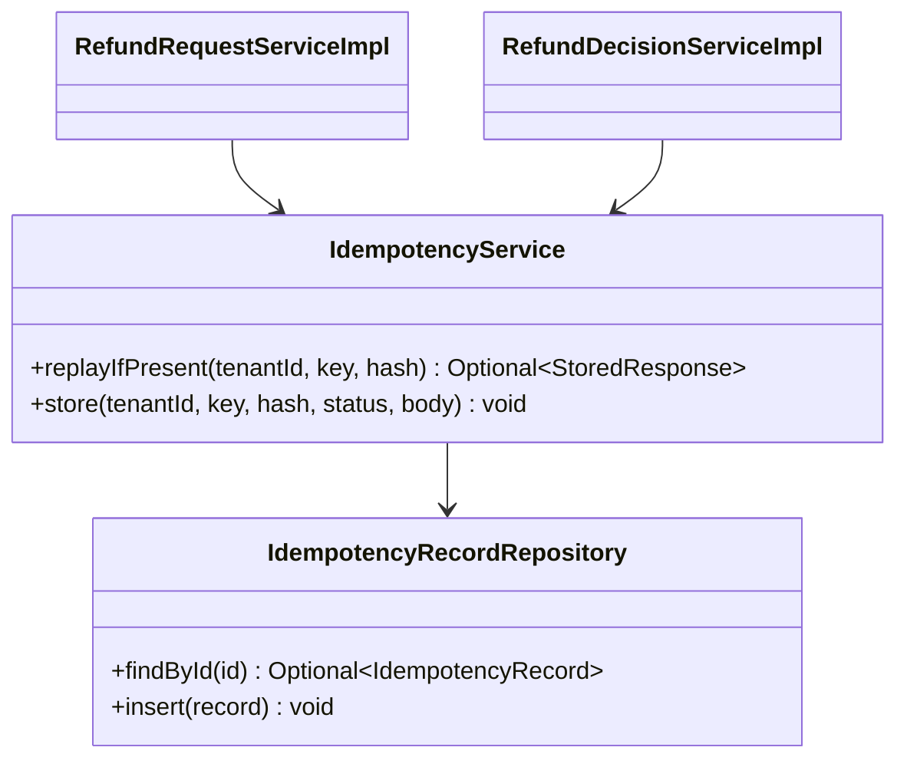

**Summary:** both POST services call one `IdempotencyService`, which reads and writes `refund.idempotency_record` inside the business transaction.

**Pseudocode skeleton:**

```text
Optional<StoredResponse> replayIfPresent(tenant, key, hash) {
  record = repository.findById(tenant, key);
  if (record.isEmpty()) return Optional.empty();
  if (!record.requestHash.equals(hash)) throw new IdempotencyKeyReusedException();   // 409 CONFLICT
  return Optional.of(record.response());
}
void store(tenant, key, hash, status, body) {
  repository.insert(new IdempotencyRecord(tenant, key, hash, status, body, now));    // same transaction as the write
}
```

### Pattern: RFC 9457 Problem Details

> **Applied:** RFC 9457 error model (CLAUDE.md: "Global @RestControllerAdvice, Problem Details (RFC 9457). Business exceptions extend a base ServiceException with error code.")
>
> **Rationale (this service):** `refund` is the busiest REST surface, with eight domain error codes from SDD §17.1 Error Handling; one advice maps every `ServiceException` to `application/problem+json` with the SDD §15.1 `errorCode`, so the web app shows a plain-language next step and never a stack trace.

**Roles:**

| Role | Class / Component |
|------|-------------------|
| Base exception | `ServiceException` (platform) |
| Per-domain subclasses | `RefundException` and its subclasses (§ 7.7) |
| Translator | `ProblemDetailsAdvice` (`@RestControllerAdvice`, platform, `09-cross-cutting.md` § 12.6) |

**Class diagram:**

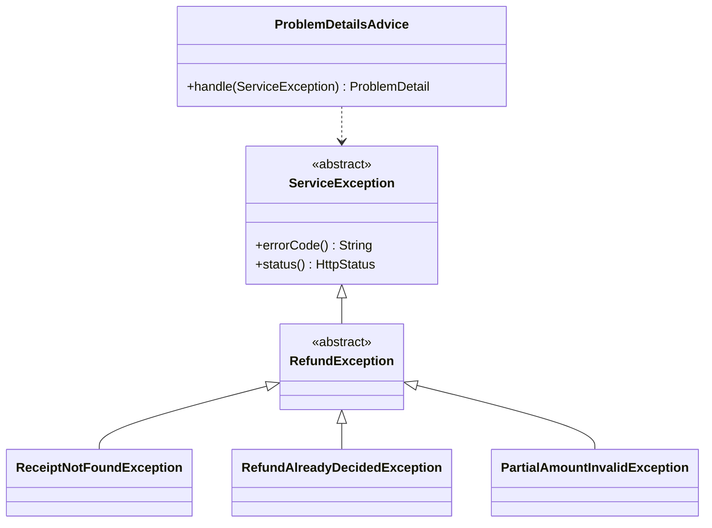

**Summary:** every refund error is a `RefundException` subclass of `ServiceException`, and one advice turns it into Problem Details.

**Pseudocode skeleton:**

```text
abstract class RefundException extends ServiceException {
  RefundException(String errorCode, HttpStatus status, String detail) { super(errorCode, status, detail); }
}
final class RefundAlreadyDecidedException extends RefundException {
  RefundAlreadyDecidedException() { super("REFUND_ALREADY_DECIDED", CONFLICT, "This request has already been decided and can no longer change."); }
}
```

### Pattern: Ports and Adapters (hexagonal)

> **Applied:** Ports and adapters (CLAUDE.md: "Layered architecture (controller, service, service impl, entity, repository, dto, etc.) unless specified (e.g., enforce hexagonal)."; SDD §6 Architecture Doctrine specifies hexagonal per module)
>
> **Rationale (this service):** the POS receipt read (API-02) is TBD - external and must be stubbable in tests (SDD §17.1 Developer Notes); a driven port keeps the domain free of the provider's format, and the only call into `payout` goes through `payout`'s `PayoutPort`, never its classes or schema.

**Roles:**

| Role | Class / Component |
|------|-------------------|
| Driving adapters | `ReceiptController`, `RefundRequestController`, `BranchRefundController`, `PayoutSucceededListener` |
| Driven port and adapter | `ReceiptLookupPort` / `PosReceiptAdapter` (anti-corruption layer for API-02) |
| Port of another module | `PayoutPort` (in `payout.api`) |
| Persistence adapters | `RefundRequestRepository`, `RefundRequestItemRepository`, `BranchRefundReportQuery` |

**Class diagram:**

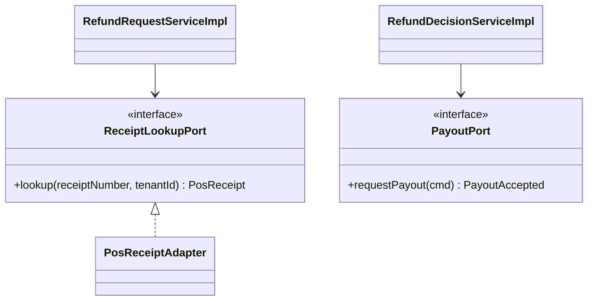

**Summary:** the services depend on ports only: `ReceiptLookupPort`, implemented by the POS adapter, and `payout`'s `PayoutPort`.

**Pseudocode skeleton:**

```text
class PosReceiptAdapter implements ReceiptLookupPort {
  @Bulkhead(name = "pos-records") @CircuitBreaker(name = "pos-records") @Retry(name = "pos-records")
  PosReceipt lookup(receiptNumber, tenantId) {
    credentials = secrets.posCredentials(tenantId);
    response = posClient.get(receiptPath(receiptNumber), credentials, correlationId());   // API-02, TBD - external
    return PosReceiptMapper.toDomain(response);                                          // provider format stops here
  }
}
```

### Pattern: Durable in-process event publication

> **Applied:** In-process domain events from a durable publication log (CLAUDE.md: "Event-driven by default for cross-service flows" and "Idempotency on every consumer and every write endpoint. Assume at-least-once delivery everywhere."; SDD ADR-02, §14.10)
>
> **Rationale (this service):** `RefundSubmitted`, `RefundCancelled`, `RefundRejected`, and `RefundPaid` must never be lost (REFUNDS/NFR-01, LOYALTY/NFR-01) yet must not make the request wait for `notification` or `loyalty`; writing the event to the publication log in the business transaction and delivering it after commit gives both, and `PayoutSucceeded` reaches this module the same way.

**Roles:**

| Role | Class / Component | Notes |
|------|-------------------|-------|
| Publisher | `RefundRequestServiceImpl`, `RefundDecisionServiceImpl`, `RefundPaymentServiceImpl` via `ApplicationEventPublisher` | Inside the business transaction |
| Publication log | Spring Modulith event publication registry, schema `platform` | PII fields encrypted by `PiiEncryptingEventSerializer` (SDD §14.10 rule 8) |
| Listener | `PayoutSucceededListener` (`@ApplicationModuleListener`) | After commit, own transaction, idempotent on the status transition |
| Re-delivery | `EventRedeliveryJob` (platform, `09-cross-cutting.md` § 12.4) | By age, one replica at a time |

**Class diagram:**

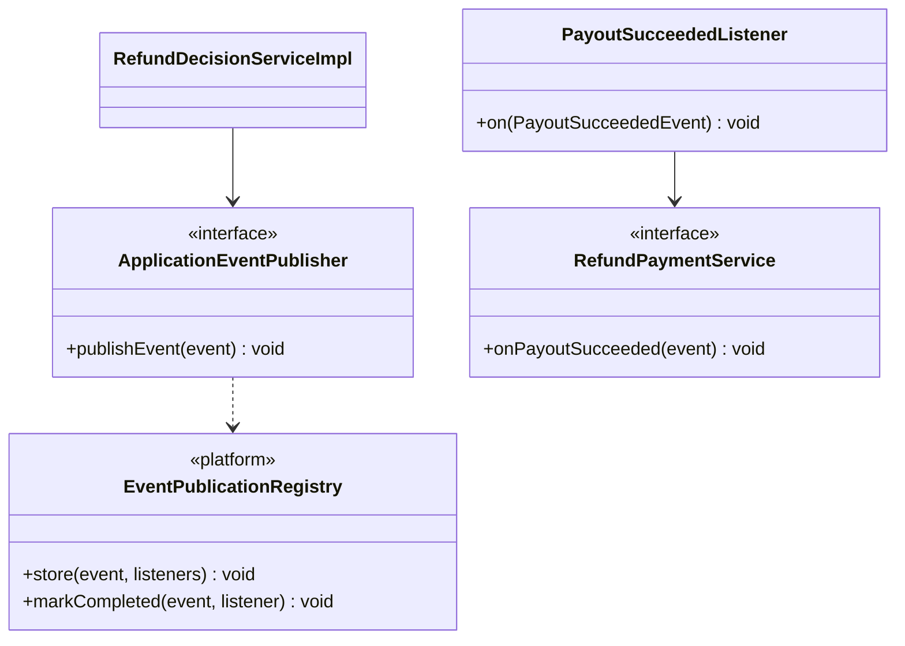

**Summary:** publishers hand events to `ApplicationEventPublisher`, the registry stores them with the transaction, and listeners such as `PayoutSucceededListener` receive them after commit.

**Pseudocode skeleton:**

```text
@Transactional void reject(...) {
  request.reject(reason, actor, now);
  events.publishEvent(new RefundRejectedEvent(uuidv7(), now, tenant, correlationId, ...));   // stored with the commit
}

@ApplicationModuleListener(id = "refund.payout-succeeded")   // listener identity is part of the contract (SDD §14.10 rule 7)
void on(PayoutSucceededEvent event) { refundPaymentService.onPayoutSucceeded(event); }
```

> Confirm: the stable listener identity (`id` attribute) assumes the Spring Modulith version in use supports naming a listener; otherwise the identity is the listener's class and method name, and a rename follows the expand-contract rule of SDD §14.10 rule 7.

### Pattern: Saga (choreography, in process)

> **Applied:** Saga, choreography (CLAUDE.md: "Sagas (choreography by default, orchestration when the flow is complex or needs central visibility) for cross-service business transactions. No distributed 2PC.")
>
> **Rationale (this service):** a refund decision changes state in `refund` (Approved, then Paid), `payout` (Pending to a terminal state), and `loyalty` (take-back). The approval and the payout instruction commit together (API-01, one database), and the rest proceeds by events: `payout` reports `PayoutSucceeded`, `refund` re-publishes `RefundPaid` (SDD §14.7 payout outcome doctrine). No step is compensated: a payout that keeps failing leaves the request Approved and alerts the branch manager (REFUNDS/UC-04 E1).

**Roles:**

| Step | Module | Action | Compensation |
|------|--------|--------|--------------|
| 1 | `refund` | Approve and call API-01 in one transaction | Rollback of the whole transaction on an API-01 error |
| 2 | `payout` | Dispatch to CardPay, publish `PayoutSucceeded` or `PayoutFailed` | None: Failed or Unknown waits for reconciliation (SDD §17.2) |
| 3 | `refund` | Approved to Paid, publish `RefundPaid` | None |
| 4 | `loyalty`, `notification` | Take back points; tell the customer | None |

**Class diagram:**

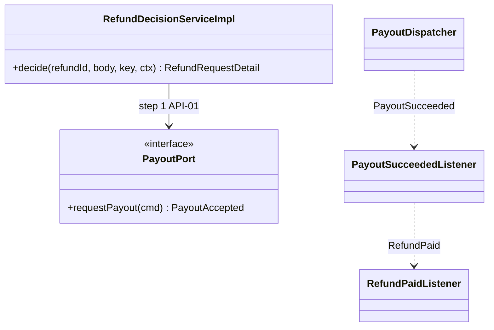

**Summary:** the decision calls API-01 in one transaction, and the later steps travel as `PayoutSucceeded` and `RefundPaid` events.

**Pseudocode skeleton:**

```text
step 1  refund:  tx { request.approve(...); payoutPort.requestPayout(cmd); }        // atomic, no 2PC
step 2  payout:  dispatcher -> CardPay -> tx { payout.succeed(); publish PayoutSucceeded }
step 3  refund:  on PayoutSucceeded -> tx { request.markPaid(); publish RefundPaid }
step 4  loyalty: on RefundPaid -> tx { take back points }    notification: on RefundPaid -> tx { insert messages }
```

> Confirm: the SDD does not name this flow a saga; it is recorded here as a choreography saga with no compensation, because the SDD keeps a failed payout Approved and leaves "After Failed" handling open (SDD §17.2).

---

## 7.5 Dependency Injection Graph

> **Convention:** constructor injection only. Document the wiring graph for non-trivial cases (3+ collaborators, or any factory/strategy/mediator wiring).

```mermaid
graph TB
  ReceiptController --> ReceiptLookupService
  RefundRequestController --> RefundRequestService
  RefundRequestController --> RefundDecisionService
  BranchRefundController --> RefundDecisionService
  BranchRefundController --> BranchRefundReportService
  PayoutSucceededListener --> RefundPaymentService
  RefundRequestServiceImpl --> ReceiptLookupPort
  RefundRequestServiceImpl --> RefundRequestRepository
  RefundRequestServiceImpl --> ReferenceNumberGenerator
  RefundRequestServiceImpl --> IdempotencyService
  RefundRequestServiceImpl --> ApplicationEventPublisher
  RefundDecisionServiceImpl --> PayoutPort
  RefundDecisionServiceImpl --> RefundRequestRepository
  RefundDecisionServiceImpl --> RefundAccessPolicy
  RefundDecisionServiceImpl --> IdempotencyService
  ReceiptLookupServiceImpl --> RefundWindowPolicy
  ReceiptLookupServiceImpl --> RefundRequestItemRepository
  ReceiptLookupPort -.implements.-> PosReceiptAdapter
  RefundRequestServiceImpl --> Clock
```

**Summary:** controllers depend on service interfaces, and the implementations receive their ports, repositories, and platform components through constructors.

---

## 7.6 Transaction Boundaries

| Method | Propagation | Isolation | Rollback rules |
|--------|-------------|-----------|----------------|
| `ReceiptLookupServiceImpl.refundableItems` | None for the POS call; the active-line query runs in its own read-only transaction | `READ_COMMITTED` | Not applicable (no write) |
| `RefundRequestServiceImpl.submit` | POS read outside; then `TransactionTemplate` `REQUIRED` | `READ_COMMITTED` | Rollback on `ServiceException` and `DataIntegrityViolationException` (active-item index or idempotency PK) |
| `RefundRequestServiceImpl.cancel` | `REQUIRED` | `READ_COMMITTED` | Rollback on `ServiceException`; optimistic lock failure mapped to 409 |
| `RefundDecisionServiceImpl.decide` | `REQUIRED`; `PayoutPort.requestPayout` joins with `MANDATORY` | `READ_COMMITTED` | Rollback on `ServiceException`, including the three API-01 errors |
| `RefundPaymentServiceImpl.onPayoutSucceeded` | `REQUIRES_NEW` (the listener's own transaction) | `READ_COMMITTED` | Rollback on any exception: the publication stays incomplete and is re-delivered |
| `BranchRefundReportServiceImpl.report` | `REQUIRED`, read-only | `REPEATABLE_READ` (one snapshot for the three measures) | Not applicable |

> **Convention:** outbox row insert lives inside the same transaction as the aggregate write. No `@Transactional(propagation = REQUIRES_NEW)` for outbox writes - the whole point of the pattern is one-tx commit.

> Confirm: transaction propagation defaults applied per CLAUDE.md (`REQUIRED`, `READ_COMMITTED`); verify per method, in particular `REPEATABLE_READ` for the report.

---

## 7.7 Error Handling

| Exception | RFC 9457 type | `errorCode` (SDD §15.1) | HTTP Status | When thrown | Caller action |
|-----------|---------------|-------------------------|-------------|-------------|---------------|
| `ReceiptNotFoundException` | `/problems/refund/receipt-not-found` | `RECEIPT_NOT_FOUND` | 404 | POS reports the receipt unknown (REFUNDS/UC-01 E2) | Check the number and try again |
| `RefundWindowExpiredException` | `/problems/refund/refund-window-expired` | `REFUND_WINDOW_EXPIRED` | 422 | Purchase older than 30 days (REFUNDS/UC-01 E1) | Visit the branch |
| `ItemAlreadyRefundedException` | `/problems/refund/item-already-refunded` | `ITEM_ALREADY_REFUNDED` | 422 | A selected line is not refundable (REFUNDS/UC-01 A1) | Reselect lines |
| `NoCardPaymentException` | `/problems/refund/no-card-payment` | `NO_CARD_PAYMENT` | 422 | Receipt not paid by card | Visit the branch |
| `CardAmountExceededException` | `/problems/refund/card-amount-exceeded` | `CARD_AMOUNT_EXCEEDED` | 422 | Selected lines exceed the card-paid amount | Select fewer lines |
| `RefundAlreadyDecidedException` | `/problems/refund/refund-already-decided` | `REFUND_ALREADY_DECIDED` | 409 | Cancel or decision on a request no longer Submitted, or a lost optimistic-lock race (REFUNDS/UC-03 E1) | Re-read the request |
| `PartialAmountInvalidException` | `/problems/refund/partial-amount-invalid` | `PARTIAL_AMOUNT_INVALID` | 422 | Partial amount out of bounds or without a reason (REFUNDS/UC-04 A1) | Fix the amount or add a reason |
| `RejectionReasonRequiredException` | `/problems/refund/rejection-reason-required` | `REJECTION_REASON_REQUIRED` | 422 | Reject without a reason (REFUNDS/UC-04 A2) | Add a reason |
| `RefundForbiddenException` | `/problems/refund/forbidden` | `FORBIDDEN` | 403 | Another branch's request, or the decider's own request | Do not retry |
| `RefundNotFoundException` | `/problems/refund/not-found` | `NOT_FOUND` | 404 | Unknown ID, or another customer's request (REFUNDS/NFR-04) | None (terminal) |
| `IdempotencyKeyReusedException` | `/problems/idempotency/conflict` | `CONFLICT` | 409 | Same key with another body | Use a new key |
| `PosUnavailableException` | `/problems/refund/pos-unavailable` | `UNAVAILABLE` | 503 | API-02 timeout, 503, or open circuit | Try again later |
| API-01 errors (`InvalidPayoutRequestException`, `PayoutNotPermittedException`, `PayoutConflictException`) | `/problems/payout/...` | `VALIDATION_FAILED`, `FORBIDDEN`, `CONFLICT` | 400, 403, 409 | Raised by `PayoutPort.requestPayout`; the approval rolls back | Fix and retry, or re-read |
| Bean Validation failures | `/problems/validation` | `VALIDATION_FAILED` | 400 | Malformed body, unknown `posLineId`, missing key | Fix the request |

> **Convention:** all exceptions extend `ServiceException` (CLAUDE.md base class). Global `@RestControllerAdvice` translates to `ProblemDetails` (RFC 9457). Error envelope schema in `09-cross-cutting.md` § Error Model.

> Confirm: a customer token without the `email` claim is refused at submission with 400 `VALIDATION_FAILED` (`customer_email` is not null in SDD §17.1); SDD ADR-07 names the claim but not the case where it is missing.

---

## 7.8 Use-Case Workflows

> **Convention:** one subsection per active use case this service owns (SDD §7.3 Owner), headed with the SDD's BRD key and the BRD's ID and title exactly. A merged or removed use case gets no block. Cross-service sagas live in the orchestrator service's file. Each workflow has: the traceability line, control flow, sequence diagram (Mermaid), idempotency points, outbox emission points, retry/timeout choices.

### REFUNDS/UC-01: Request a Refund

> **Traceability:** BRD [REFUNDS/UC-01](../../brd-refunds-portal/06a-use-cases-customer.md#uc-01-request-a-refund) · SDD [§7.3](../../sdd-refunds-platform/03-users-and-use-cases.md#73-use-case-traceability-brd--sdd) · Owner: refund · Entry points: `GET /v1/receipts/{receiptNumber}/refundable-items`, `POST /v1/refund-requests` · UAT/BAT: [REFUNDS/TC-REQ-01](../../brd-refunds-portal/16-uat-bat-test-cases.md#1-refund-requests-uc-01-uc-02-uc-03-scr-01-scr-02), [REFUNDS/TC-REQ-02](../../brd-refunds-portal/16-uat-bat-test-cases.md#1-refund-requests-uc-01-uc-02-uc-03-scr-01-scr-02), [REFUNDS/TC-REQ-03](../../brd-refunds-portal/16-uat-bat-test-cases.md#1-refund-requests-uc-01-uc-02-uc-03-scr-01-scr-02), [REFUNDS/TC-REQ-04](../../brd-refunds-portal/16-uat-bat-test-cases.md#1-refund-requests-uc-01-uc-02-uc-03-scr-01-scr-02), [REFUNDS/TC-UIX-01](../../brd-refunds-portal/16-uat-bat-test-cases.md#3-cross-cutting-uiux-standards-chunk-11) · Screens: [REFUNDS/SCR-01](../../brd-refunds-portal/14-todo.md#mockup-coverage) via `/refunds/new`

**Trigger:** `ReceiptController.refundableItems` and `RefundRequestController.submit`, both with `@UseCase("REFUNDS/UC-01")`.

**Pre-conditions:** signed-in customer with `refund.receipt.read` and `refund.request.create`; the tenant resolved from the token.

**Post-conditions:** one `SUBMITTED` request with a reference number, active items, a history row, and a stored `RefundSubmitted` publication; replays of the same key return the same 201.

**Control flow:**

```text
1. Customer enters the receipt number; GET refundable-items reads it through API-02   (REFUNDS/UC-01 step 1)
2. Lines returned with their refundable flag                                         (REFUNDS/UC-01 step 2, A1)
   - unknown receipt -> 404 RECEIPT_NOT_FOUND                                        (REFUNDS/UC-01 E2)
   - older than 30 days -> 422 REFUND_WINDOW_EXPIRED                                 (REFUNDS/UC-01 E1)
3. Client shows the amount of the selected lines (no server call)                    (REFUNDS/UC-01 steps 3-4)
4. POST refund-requests with Idempotency-Key: idempotency check first                (REFUNDS/UC-01 step 5)
5. POS re-read outside the transaction; then one transaction re-checks window, card payment,
   selected lines, saves the request, and writes RefundSubmitted (publication point)  (REFUNDS/UC-01 step 6)
6. 201 with the reference number; notification sends email and SMS after commit     (REFUNDS/UC-01 step 6)
```

**Sequence diagram:**

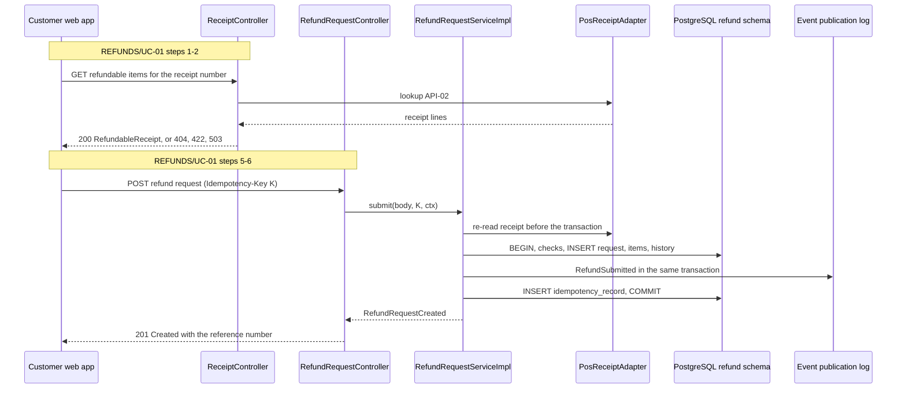

**Summary:** the lookup reads POS once; the submit re-reads it, then one transaction saves the request, its publication, and the idempotency record.

**Idempotency points:** `Idempotency-Key` required on the POST; dedup tuple (`tenant_id`, `idempotency_key`); same key and body replays the 201, another body gives 409 `CONFLICT`; the partial unique index on active items blocks a second request for a line even under a new key.

**Outbox emission points:** none (no integration event); publication point: `RefundSubmitted` written to the event publication log in step 5's transaction.

**Retry / timeout policy:** API-02 through the `pos-records` Resilience4j instance: one retry with jitter on timeout or 503 (SDD §12 INT-03), then 503 `UNAVAILABLE`; timeout open (`09-cross-cutting.md` § 12.3).

**Error handling:** E2 → 404 `RECEIPT_NOT_FOUND`; E1 → 422 `REFUND_WINDOW_EXPIRED`; A1 at submit → 422 `ITEM_ALREADY_REFUNDED`; no card → 422 `NO_CARD_PAYMENT`; above card amount → 422 `CARD_AMOUNT_EXCEEDED`; POS down → 503 `UNAVAILABLE`; validation → 400 `VALIDATION_FAILED`.

### REFUNDS/UC-02: Track Refund Status (Web and Mobile)

> **Traceability:** BRD [REFUNDS/UC-02](../../brd-refunds-portal/06a-use-cases-customer.md#uc-02-track-refund-status-web-and-mobile) · SDD [§7.3](../../sdd-refunds-platform/03-users-and-use-cases.md#73-use-case-traceability-brd--sdd) · Owner: refund · Entry points: `GET /v1/refund-requests`, `GET /v1/refund-requests/{refundId}` · UAT/BAT: [REFUNDS/TC-REQ-05](../../brd-refunds-portal/16-uat-bat-test-cases.md#1-refund-requests-uc-01-uc-02-uc-03-scr-01-scr-02), [REFUNDS/TC-REQ-06](../../brd-refunds-portal/16-uat-bat-test-cases.md#1-refund-requests-uc-01-uc-02-uc-03-scr-01-scr-02), [REFUNDS/TC-UIX-01](../../brd-refunds-portal/16-uat-bat-test-cases.md#3-cross-cutting-uiux-standards-chunk-11) · Screens: [REFUNDS/SCR-02](../../brd-refunds-portal/14-todo.md#mockup-coverage) via `/refunds` and `/refunds/:refundId`

**Trigger:** `RefundRequestController.list` with `@UseCase("REFUNDS/UC-02")` and `RefundRequestController.get` with `@UseCase("REFUNDS/UC-02,REFUNDS/UC-04")`.

**Pre-conditions:** signed-in customer with `refund.request.read`.

**Post-conditions:** none (read only).

**Control flow:**

```text
1. GET refund-requests: own requests, newest first, cursor-paged, with reference, amount, status
                                                                       (REFUNDS/UC-02 steps 1-2)
   - no requests -> 200 with an empty page                             (REFUNDS/UC-02 A1)
2. GET refund-requests/{refundId}: role CUSTOMER -> own request only (else 404 NOT_FOUND),
   with the status history (date of each change, rejection reason)     (REFUNDS/UC-02 steps 3-4)
```

**Sequence diagram:**

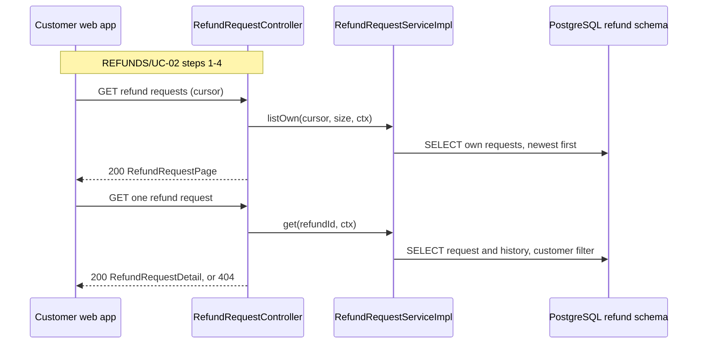

**Summary:** both reads are bound to the caller: the list to the customer, the detail to the customer or, for a manager, the branch.

**Idempotency points:** not applicable (reads).

**Outbox emission points:** none.

**Retry / timeout policy:** none server-side; the client may retry reads.

**Error handling:** another customer's request → 404 `NOT_FOUND` (existence not disclosed, REFUNDS/NFR-04); malformed cursor → 400 `VALIDATION_FAILED`.

### REFUNDS/UC-03: Cancel a Refund Request

> **Traceability:** BRD [REFUNDS/UC-03](../../brd-refunds-portal/06a-use-cases-customer.md#uc-03-cancel-a-refund-request) · SDD [§7.3](../../sdd-refunds-platform/03-users-and-use-cases.md#73-use-case-traceability-brd--sdd) · Owner: refund · Entry points: `POST /v1/refund-requests/{refundId}/cancellation` · UAT/BAT: [REFUNDS/TC-REQ-07](../../brd-refunds-portal/16-uat-bat-test-cases.md#1-refund-requests-uc-01-uc-02-uc-03-scr-01-scr-02), [REFUNDS/TC-REQ-08](../../brd-refunds-portal/16-uat-bat-test-cases.md#1-refund-requests-uc-01-uc-02-uc-03-scr-01-scr-02) · Screens: [REFUNDS/SCR-02](../../brd-refunds-portal/14-todo.md#mockup-coverage) via `/refunds` and `/refunds/:refundId`

**Trigger:** `RefundRequestController.cancel` with `@UseCase("REFUNDS/UC-03")`.

**Pre-conditions:** own request in `SUBMITTED`; `refund.request.cancel`.

**Post-conditions:** request `CANCELLED`, items inactive (released for a new request), history row, `RefundCancelled` stored.

**Control flow:**

```text
1. Customer opens a Submitted request and chooses cancel; the client confirms   (REFUNDS/UC-03 steps 1-4)
2. POST cancellation with Idempotency-Key: idempotency check
3. One transaction: load own request with version; status must be SUBMITTED     (REFUNDS/UC-03 BR-1: only Submitted requests can be cancelled)
4. Mark CANCELLED, release items, history row, write RefundCancelled (publication point)   (REFUNDS/UC-03 step 5)
5. Commit; a decision that committed first fails the version check -> 409 REFUND_ALREADY_DECIDED   (REFUNDS/UC-03 E1)
```

**Sequence diagram:**

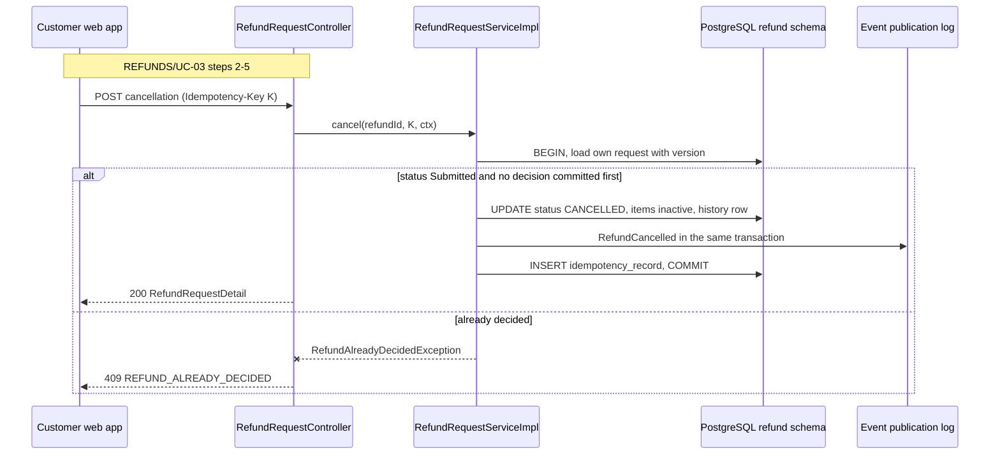

**Summary:** a guarded, version-checked transition either cancels and publishes `RefundCancelled` or returns 409 when a decision committed first.

**Idempotency points:** `Idempotency-Key` required; replay returns the stored 200; the version check settles the cancel-versus-decide race.

**Outbox emission points:** none; publication point: `RefundCancelled` in step 4's transaction.

**Retry / timeout policy:** no provider call; a client retry with the same key is safe.

**Error handling:** E1 → 409 `REFUND_ALREADY_DECIDED`; another customer's request → 404 `NOT_FOUND`; missing key → 400 `VALIDATION_FAILED`.

### REFUNDS/UC-04: Approve / Reject Refund

> **Traceability:** BRD [REFUNDS/UC-04](../../brd-refunds-portal/06b-use-cases-branch-manager.md#uc-04-approve--reject-refund) · SDD [§7.3](../../sdd-refunds-platform/03-users-and-use-cases.md#73-use-case-traceability-brd--sdd) · Owner: refund · Entry points: `GET /v1/branches/{branchId}/refund-requests`, `GET /v1/refund-requests/{refundId}`, `POST /v1/refund-requests/{refundId}/decision` · UAT/BAT: [REFUNDS/TC-DEC-01](../../brd-refunds-portal/16-uat-bat-test-cases.md#2-refund-decisions-uc-04-mk-03), [REFUNDS/TC-DEC-02](../../brd-refunds-portal/16-uat-bat-test-cases.md#2-refund-decisions-uc-04-mk-03), [REFUNDS/TC-DEC-03](../../brd-refunds-portal/16-uat-bat-test-cases.md#2-refund-decisions-uc-04-mk-03), [REFUNDS/TC-DEC-04](../../brd-refunds-portal/16-uat-bat-test-cases.md#2-refund-decisions-uc-04-mk-03), [REFUNDS/TC-DEC-05](../../brd-refunds-portal/16-uat-bat-test-cases.md#2-refund-decisions-uc-04-mk-03), [REFUNDS/TC-UIX-01](../../brd-refunds-portal/16-uat-bat-test-cases.md#3-cross-cutting-uiux-standards-chunk-11) · Screens: [REFUNDS/MK-03](../../brd-refunds-portal/14-todo.md#mockup-coverage) via `/manager/refunds` and `/manager/refunds/:refundId`

**Trigger:** `BranchRefundController.queue` with `@UseCase("REFUNDS/UC-04")`, `RefundRequestController.get` with `@UseCase("REFUNDS/UC-02,REFUNDS/UC-04")`, and `RefundRequestController.decide` with `@UseCase("REFUNDS/UC-04")`; step 7 is realised by `PayoutSucceededListener` (no `@UseCase`, § 7.2).

**Pre-conditions:** `BRANCH_MANAGER` of the request's branch, not its customer; request `SUBMITTED`.

**Post-conditions:** rejected: `REJECTED` with the reason, items released, `RefundRejected` stored. Approved: `APPROVED` with `approved_amount` and `payout_id`, and one `payout` row `PENDING` committed in the same transaction; later `PAID` and `RefundPaid` stored once `PayoutSucceeded` arrives.

**Control flow:**

```text
1. GET branches/{branchId}/refund-requests: Submitted requests of the own branch, oldest first,
   with amount and reason                                                    (REFUNDS/UC-04 steps 1-2)
2. GET refund-requests/{refundId}: role BRANCH_MANAGER -> own branch (else 403)   (REFUNDS/UC-04 step 3)
3. POST decision with Idempotency-Key; checks: own branch, not own request, SUBMITTED
4. Reject: reason required; REJECTED, items released, RefundRejected (publication point)   (REFUNDS/UC-04 A2)
5. Approve: full amount, or partial amount with a reason within bounds         (REFUNDS/UC-04 steps 4-5, A1)
6. APPROVED and PayoutPort.requestPayout in the same transaction (API-01)      (REFUNDS/UC-04 step 6)
7. After the payout succeeds: PayoutSucceeded -> PAID, RefundPaid (publication point)   (REFUNDS/UC-04 step 7)
8. Payout still failing after 24 h: request stays APPROVED; payout and notification alert the manager   (REFUNDS/UC-04 E1)
```

**Sequence diagram (decision, steps 3-6):**

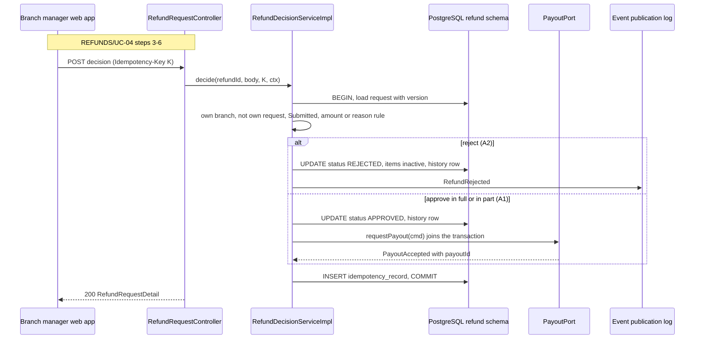

**Summary:** a rejection publishes `RefundRejected`; an approval records the payout instruction through API-01 in the same transaction.

**Sequence diagram (payment, step 7):**

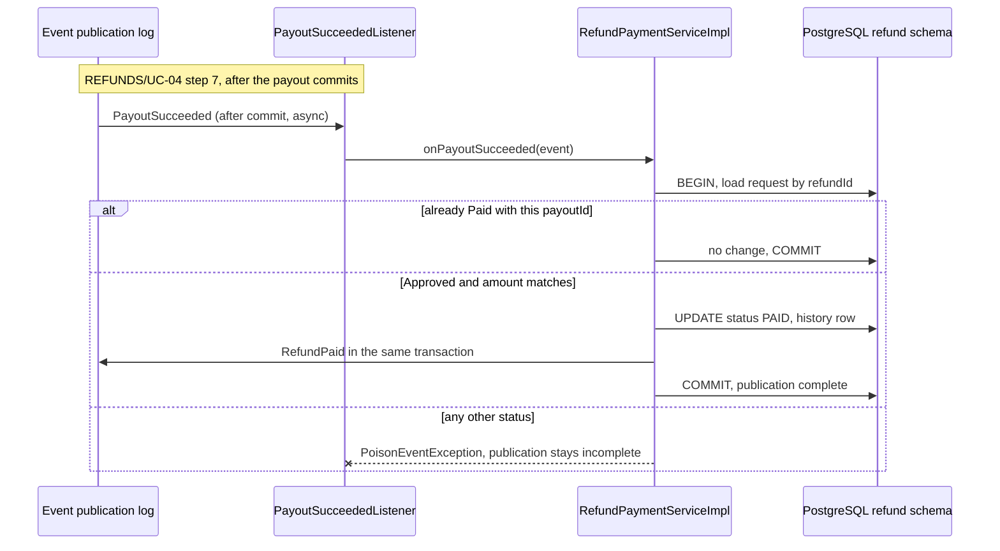

**Summary:** `PayoutSucceeded` moves an Approved request to Paid and publishes `RefundPaid`; a repeat is a no-op and any other status is a poison event.

**Idempotency points:** `Idempotency-Key` on the decision; API-01 is idempotent on `refundId` (a repeat with the same amount returns the existing `PayoutAccepted`); the `PayoutSucceeded` listener is idempotent on the Approved to Paid transition.

**Outbox emission points:** none; publication points: `RefundRejected` (step 4), `RefundPaid` (step 7). The payout instruction is the `payout` row written through API-01 in step 6 (the `payout` dispatch table, ADR-09).

**Retry / timeout policy:** no provider call in the decision; CardPay retries belong to `payout` ([payout § Participates in REFUNDS/UC-04](./payout.md#participates-in-refundsuc-04-approve--reject-refund)); a failed listener run is re-delivered by age (`09-cross-cutting.md` § 12.4).

**Error handling:** A2 without a reason → 422 `REJECTION_REASON_REQUIRED`; A1 out of bounds → 422 `PARTIAL_AMOUNT_INVALID`; another branch or own request → 403 `FORBIDDEN` (REFUNDS/UC-04 BR-1: own branch only); not Submitted → 409 `REFUND_ALREADY_DECIDED`; API-01 errors → 400, 403, 409 with the approval rolled back.

### Cross-service Saga (orchestrator role)

> **Only present if this service is the orchestrator of a multi-service saga.** Choreography-style sagas (each service reacts to events without an orchestrator) are documented per-step in the participating services' workflow sections.

Not applicable for this service: the refund-to-payout flow is a choreography (§ 7.4 Pattern: Saga), with no orchestrator.

<!-- MASTER: refunds-platform-lld-master.md | PREV: 04-implementation/payout.md | NEXT: 05-data-model.md -->
