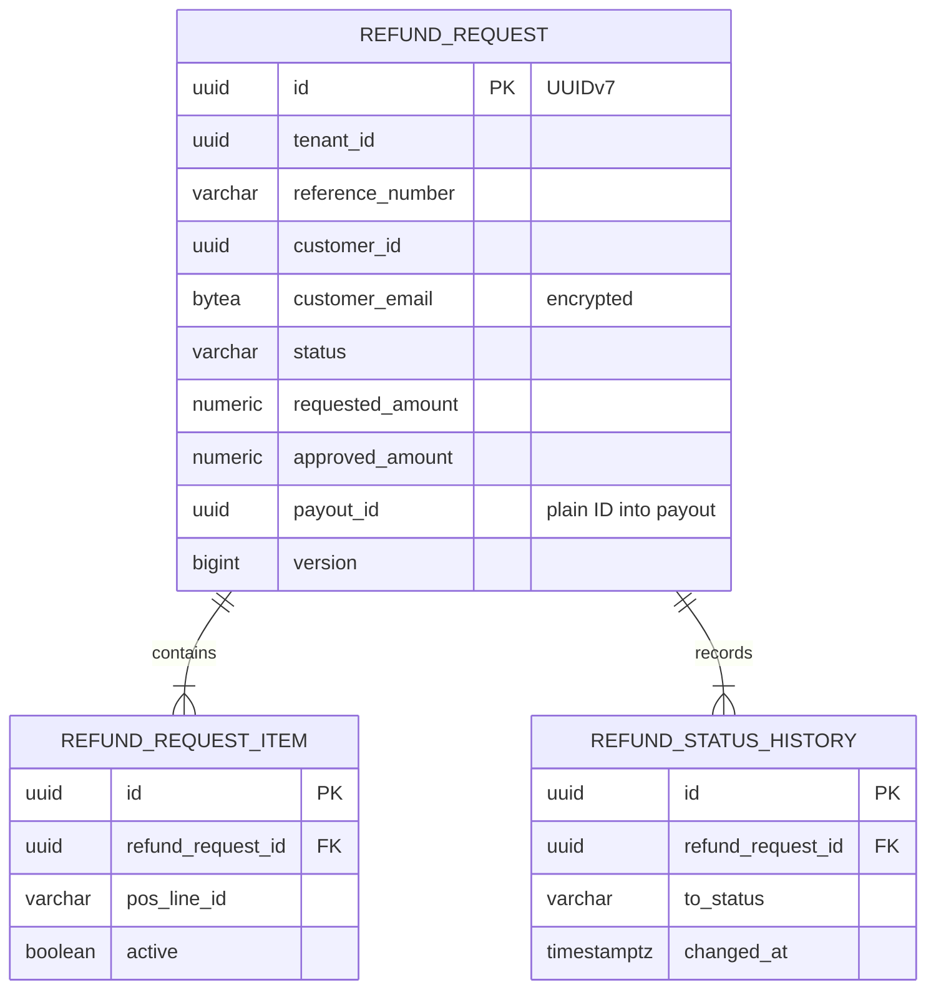
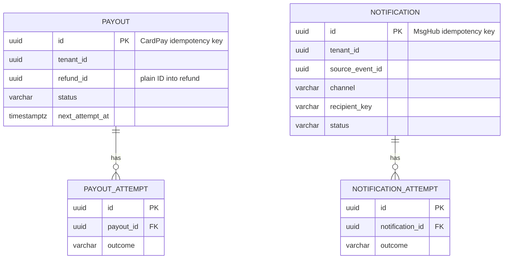
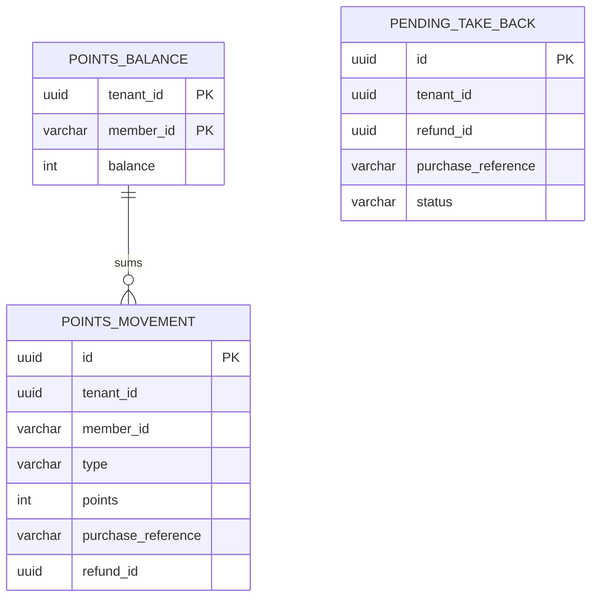

<!--
CHUNK: 05
TITLE: Data Model
PROJECT: Refunds Platform
VERSION: 1.0
DEPENDS_ON: 04
PART OF: LLD - Refunds Platform
-->

# 8. Data Model

> **Per-service ownership:** each service owns its own private PostgreSQL schema (CLAUDE.md default). This chunk covers all schemas in the LLD scope.

The logical tables are the SDD's ([§17.1](../sdd-refunds-platform/13a-service-refund.md#tables-design), [§17.2](../sdd-refunds-platform/13b-service-payout.md#tables-design), [§17.3](../sdd-refunds-platform/13c-service-notification.md#tables-design), [§17.4](../sdd-refunds-platform/13d-service-loyalty.md#tables-design)); this chunk adds the physical delta: auditing columns (SDD §11.1), constraint and index names, encrypted column storage, row-level security, and the few LLD-only tables and columns, each flagged.

## 8.1 Entity Relationship (system-wide)

One database, five schemas, no cross-schema foreign key (ADR-06): `refund_request.payout_id` and `payout.refund_id` are plain IDs. One diagram per schema keeps each under 30 lines.

**Summary:** a refund request owns its items and history; `payout_id` points into `payout` with no foreign key.

**Summary:** `payout` and `notification` each own a dispatch table with an attempt log.

**Summary:** `refund` owns requests with their items and history; `payout` and `notification` each own a dispatch table with an attempt log; `loyalty` owns an append-only ledger, its balance projection, and pending take-backs. Schema `platform` (not drawn) holds only the event publication log.

## 8.2 Tables (per service)

Every table below also carries `created_at timestamptz not null`, `created_by varchar(64) not null`, `updated_at timestamptz not null`, `updated_by varchar(64) not null` (SDD §11.1: the actor is the token subject or `system`); they are not repeated per table.

### Service: `refund` - schema `refund`

| Table | Column | Type | Constraints | Notes |
|-------|--------|------|-------------|-------|
| `refund_request` | `id`, `tenant_id`, `reference_number`, `customer_id` | uuid, uuid, varchar(20), uuid | PK; not null; `uq_refund_request_reference` (`tenant_id`, `reference_number`) | As SDD §17.1 |
| `refund_request` | `customer_email`, `customer_mobile` | bytea, bytea | email not null; mobile null | LLD delta: ciphertext of the SDD varchar(254) and varchar(20) values (§ 8.7) |
| `refund_request` | `customer_locale`, `branch_id`, `receipt_number`, `purchased_at`, `purchase_reference`, `reason` | varchar(10), varchar(32), varchar(64), timestamptz, varchar(64), varchar(500) | As SDD §17.1 | |
| `refund_request` | `currency`, `requested_amount`, `approved_amount` | char(3), numeric(19,4), numeric(19,4) | `ck_refund_amounts`: requested > 0; approved null or (> 0 and <= requested) | |
| `refund_request` | `status`, `decision_reason`, `decided_by`, `decided_at`, `payout_id`, `version` | varchar(16), varchar(500), uuid, timestamptz, uuid, bigint | `ck_refund_status` (5 values); `ck_refund_decision_reason`: REJECTED needs a reason | |
| `refund_request_item` | `id`, `tenant_id`, `refund_request_id`, `receipt_number`, `pos_line_id`, `description`, `quantity`, `amount`, `active` | uuid, uuid, uuid, varchar(64), varchar(64), varchar(200), int, numeric(19,4), boolean | PK; `fk_item_request`; `uq_refund_item_active` partial | As SDD §17.1 |
| `refund_status_history` | `id`, `tenant_id`, `refund_request_id`, `from_status`, `to_status`, `changed_at`, `changed_by`, `reason` | uuid, uuid, uuid, varchar(16), varchar(16), timestamptz, uuid, varchar(500) | PK; `fk_history_request` | `changed_by` null for system transitions (Paid) |
| `idempotency_record` | `tenant_id`, `idempotency_key`, `request_hash`, `response_status`, `response_body`, `created_at` | uuid, uuid, char(64), int, jsonb, timestamptz | PK (`tenant_id`, `idempotency_key`) | As SDD §17.1 |
| `reference_sequence` | `tenant_id`, `next_value` | uuid, bigint | PK (`tenant_id`) | LLD-only table: per-tenant reference counter |

> Confirm: `reference_sequence` is an LLD-only table backing the SDD's "per-tenant sequence" for reference numbers (`UPDATE ... SET next_value = next_value + 1 RETURNING next_value` inside the submit transaction); a row lock per tenant serialises submissions, acceptable at about 40 a day.

> TODO: the reference number format is not stated in SDD §17.1 (varchar(20)); best guess: `R` followed by a 9-digit zero-padded counter, for example `R000001234` - verify.

> Confirm: `changed_by` is null for system transitions because SDD §17.1 types it uuid while SDD §11.1 names the system actor `system`.

### Service: `payout` - schema `payout`

| Table | Column | Type | Constraints | Notes |
|-------|--------|------|-------------|-------|
| `payout` | `id`, `tenant_id`, `refund_id` | uuid | PK; not null; `uq_payout_refund` (`tenant_id`, `refund_id`) | As SDD §17.2 |
| `payout` | `refund_reference`, `branch_id`, `purchase_reference`, `currency`, `amount` | varchar(20), varchar(32), varchar(64), char(3), numeric(19,4) | `ck_payout_amount`: amount > 0 | |
| `payout` | `status`, `first_attempt_at`, `next_attempt_at`, `attempt_count` | varchar(16), timestamptz, timestamptz, int | `ck_payout_status` (5 values incl. UNKNOWN); `next_attempt_at` not null | Lease and backoff live in `next_attempt_at` |
| `payout` | `provider_reference`, `last_failure_reason`, `version` | varchar(64), varchar(500), bigint | | |
| `payout` | `trace_parent` | varchar(55) | null | LLD-only column: W3C `traceparent` of the approval, linked from the dispatch span (SDD §17.2 Tracing) |
| `payout_attempt` | `id`, `tenant_id`, `payout_id`, `attempted_at`, `outcome`, `provider_status`, `duration_ms`, `provider_response` | uuid, uuid, uuid, timestamptz, varchar(16), varchar(32), int, jsonb | PK; `fk_attempt_payout`; `ck_attempt_outcome` | Response without card data |

> Confirm: `trace_parent` is an LLD-only column realising "the trace context of the approval is stored with the payout" (SDD §17.2 Tracing).

### Service: `notification` - schema `notification`

| Table | Column | Type | Constraints | Notes |
|-------|--------|------|-------------|-------|
| `notification` | `id`, `tenant_id`, `source_event_id`, `event_type`, `channel`, `recipient_key` | uuid, uuid, uuid, varchar(32), varchar(8), varchar(64) | PK; `uq_notification_event` (`tenant_id`, `source_event_id`, `channel`, `recipient_key`); `ck_notification_channel` | As SDD §17.3 |
| `notification` | `refund_id`, `recipient_type`, `recipient`, `template_key`, `locale` | uuid, varchar(16), bytea, varchar(64), varchar(10) | not null | `recipient` ciphertext (§ 8.7) |
| `notification` | `reference_number`, `amount`, `currency`, `reason` | varchar(20), numeric(19,4), char(3), varchar(500) | reference not null; others null | LLD-only columns: the render data the dispatcher needs |
| `notification` | `status`, `attempt_count`, `next_attempt_at`, `provider_message_id`, `last_error`, `sent_at` | varchar(16), int, timestamptz, varchar(64), varchar(500), timestamptz | `ck_notification_status` | |
| `notification_attempt` | `id`, `tenant_id`, `notification_id`, `attempted_at`, `outcome`, `provider_status` | uuid, uuid, uuid, timestamptz, varchar(16), varchar(32) | PK; `fk_attempt_notification` | |

> Confirm: SDD §17.3 renders templates at dispatch time but its `notification` table has no column for the data the template needs; this LLD adds typed columns (`reference_number`, `amount`, `currency`, `reason`) rather than a JSON column, which SDD §11.1 reserves for event payloads and provider responses.

### Service: `loyalty` - schema `loyalty`

| Table | Column | Type | Constraints | Notes |
|-------|--------|------|-------------|-------|
| `points_movement` | `id`, `tenant_id`, `member_id`, `type`, `points` | uuid, uuid, varchar(32), varchar(16), int | PK; `ck_movement_sign`: EARN points > 0, TAKE_BACK points < 0 | As SDD §17.4 |
| `points_movement` | `purchase_reference`, `purchase_amount`, `currency` | varchar(64), numeric(19,4), char(3) | not null; `uq_movement_earn` partial | |
| `points_movement` | `refund_id`, `refund_reference`, `paid_amount`, `occurred_at` | uuid, varchar(20), numeric(19,4), timestamptz | TAKE_BACK only; `uq_movement_take_back` partial | |
| `points_balance` | `tenant_id`, `member_id`, `balance`, `last_movement_at`, `version` | uuid, varchar(32), int, timestamptz, bigint | PK (`tenant_id`, `member_id`); `ck_balance_non_negative` | Projection |
| `pending_take_back` | `id`, `tenant_id`, `refund_id`, `purchase_reference`, `refund_reference`, `paid_amount`, `currency`, `paid_at`, `status` | uuid, uuid, uuid, varchar(64), varchar(20), numeric(19,4), char(3), timestamptz, varchar(8) | PK; `uq_pending_refund` (`tenant_id`, `refund_id`); `ck_pending_status` | As SDD §17.4 |

### Schema `platform` (no owning module)

| Table | Column | Type | Constraints | Notes |
|-------|--------|------|-------------|-------|
| `event_publication` | as Spring Modulith's JDBC registry defines it (publication ID, listener ID, event type, serialized event, publication and completion dates) | - | - | Created by a Flyway migration in schema `platform` that copies the registry DDL of the pinned Spring Modulith version; no `tenant_id` column (SDD §11.1 exception) |
| `event_publication_redelivery` | `publication_id`, `redelivery_count`, `last_redelivered_at` | uuid, int, timestamptz | PK (`publication_id`) | LLD-only table counting re-deliveries for SDD §14.10 rule 5 |

> TODO: SDD §14.10 rule 5 stops re-delivery after a maximum count, but the Spring Modulith registry keeps no re-delivery count in the versions this LLD assumes; best guess: the LLD-only `event_publication_redelivery` table, maintained by `EventRedeliveryJob` - verify against the pinned Spring Modulith version.

## 8.3 Indexes

| Index | Table | Columns | Type | Rationale |
|-------|-------|---------|------|-----------|
| `idx_refund_customer` | `refund_request` | `(tenant_id, customer_id, created_at)` | btree | REFUNDS/UC-02 own list (SDD §17.1) |
| `idx_refund_branch_queue` | `refund_request` | `(tenant_id, branch_id, status, created_at)` | btree | REFUNDS/UC-04 branch queue (SDD §17.1) |
| `uq_refund_item_active` | `refund_request_item` | `(tenant_id, receipt_number, pos_line_id) WHERE active` | partial unique | REFUNDS/UC-01 BR-2: an item is refunded only once |
| `idx_history_request` | `refund_status_history` | `(tenant_id, refund_request_id, changed_at)` | btree | Request detail history (SDD §17.1) |
| `idx_history_changed` | `refund_status_history` | `(tenant_id, changed_at)` | btree | LLD-only: branch report day window |
| `idx_payout_claim` | `payout` | `(tenant_id, status, next_attempt_at)` | btree | Dispatcher claim (SDD §17.2) |
| `idx_payout_attempt` | `payout_attempt` | `(tenant_id, payout_id, attempted_at)` | btree | SDD §17.2 |
| `idx_notification_claim` | `notification` | `(tenant_id, status, next_attempt_at)` | btree | Dispatcher claim (SDD §17.3) |
| `idx_notification_attempt` | `notification_attempt` | `(tenant_id, notification_id)` | btree | SDD §17.3 |
| `idx_movement_member` | `points_movement` | `(tenant_id, member_id, occurred_at DESC)` | btree | LOYALTY/UC-02 history (SDD §17.4) |
| `uq_movement_earn` | `points_movement` | `(tenant_id, purchase_reference) WHERE type = 'EARN'` | partial unique | Idempotent intake |
| `uq_movement_take_back` | `points_movement` | `(tenant_id, refund_id) WHERE type = 'TAKE_BACK'` | partial unique | Idempotent take-back |
| `idx_movement_purchase` | `points_movement` | `(tenant_id, purchase_reference)` | btree | LLD-only: cumulative cap sum of take-backs per purchase |
| `idx_pending_purchase` | `pending_take_back` | `(tenant_id, purchase_reference)` | btree | Earn step match (SDD §17.4) |
| `idx_pending_expiry` | `pending_take_back` | `(tenant_id, status, paid_at)` | btree | LLD-only: nightly expiry |

Every index and unique constraint starts with `tenant_id` (SDD §11.1, CLAUDE.md), except in schema `platform` (SDD §11.1 exception).

## 8.4 Multi-Tenancy Strategy

> **Default per CLAUDE.md:** schema-per-tenant for high-volume services; shared-schema with `tenant_id` for low-volume.

| Service | Strategy | Rationale |
|---------|----------|-----------|
| `refund` | Shared schema with `tenant_id` | SDD ADR-03: low volume, one tenant today |
| `payout` | Shared schema with `tenant_id` | SDD ADR-03 |
| `notification` | Shared schema with `tenant_id` | SDD ADR-03 |
| `loyalty` | Shared schema with `tenant_id` | SDD ADR-03 |

**Tenant filter enforcement:** two guards (SDD §11.2). (1) Hibernate's `@TenantId` on every entity, resolved from `CallContext` by a `CurrentTenantIdentifierResolver`, so every JPA query carries the tenant predicate; native queries (claims, advisory-locked writes) add `tenant_id = :tenant` explicitly. (2) PostgreSQL row-level security on every module table: `ENABLE` and `FORCE ROW LEVEL SECURITY`, policy `tenant_isolation USING (tenant_id = current_setting('app.tenant_id')::uuid) WITH CHECK (same)`; `TenantAwareTransactionManager` runs `SELECT set_config('app.tenant_id', :tenant, true)` as the first statement of every transaction.

**Cross-tenant queries:** forbidden at the application layer (CLAUDE.md). Enforced by the two guards above; background jobs loop over the tenants of the tenant configuration and open one transaction per tenant (SDD §11.2), so row-level security applies to them too.

> Confirm: `@TenantId` (Hibernate 6) and the transaction-start `set_config` hook are the LLD's choice of mechanism for the SDD's "repository tenant filter plus row-level security"; verify both with the Spring Boot 3.5 Hibernate version.

## 8.5 Migration Plan (Flyway)

| Version | File | Purpose |
|---------|------|---------|
| `V1__create_event_publication.sql` | `src/main/resources/db/migration/platform` | Spring Modulith registry table and `event_publication_redelivery` |
| `V1__create_refund_tables.sql` | `src/main/resources/db/migration/refund` | `refund_request`, `refund_request_item`, `refund_status_history`, `reference_sequence`, indexes |
| `V2__create_refund_idempotency.sql` | `.../db/migration/refund` | `idempotency_record` |
| `V3__enable_refund_rls.sql` | `.../db/migration/refund` | Row-level security policies |
| `V1__create_payout_tables.sql`, `V2__enable_payout_rls.sql` | `.../db/migration/payout` | `payout`, `payout_attempt`, policies |
| `V1__create_notification_tables.sql`, `V2__enable_notification_rls.sql` | `.../db/migration/notification` | `notification`, `notification_attempt`, policies |
| `V1__create_loyalty_tables.sql`, `V2__enable_loyalty_rls.sql` | `.../db/migration/loyalty` | `points_movement`, `points_balance`, `pending_take_back`, policies |

One Flyway location and one history table per schema (SDD ADR-06), run once per release by the Helm pre-upgrade job as the schema owner role; the application role owns no table (ADR-06).

> **Convention per CLAUDE.md:** versioned SQL only; backward-compatible changes only; expand-contract for breaking changes.

## 8.6 Retention & Archival

| Table | Hot retention | Archival destination | Restore SLA |
|-------|---------------|---------------------|-------------|
| `refund_request`, `refund_request_item`, `refund_status_history` | Open (SDD §17.1) | Open | Open |
| `idempotency_record` | Open (SDD §17.1); best guess 24 h | Cleanup job (delete) | N/A |
| `payout`, `payout_attempt` | Open (SDD §17.2, financial records) | Open | Open |
| `notification`, `notification_attempt` | Open (SDD §17.3) | None: daily purge (SDD §17.3) | N/A |
| `points_movement`, `points_balance` | Open (SDD §17.4) | Open; balance must equal retained movements plus an opening balance | Open |
| `pending_take_back` | Deleted when applied; EXPIRED rows follow the ledger | N/A | N/A |
| `platform.event_publication` | Deleted when its last listener completes (SDD §14.10 rule 8) | N/A | N/A |

> TODO: every retention period above is open in SDD §17.1 to §17.4; best guess: financial records (refund, payout, ledger) 10 years, messages 90 days, idempotency records 24 hours - verify with legal and compliance.

## 8.7 Encryption

| Concern | Approach |
|---------|----------|
| At rest | Database storage encryption, plus application-level column encryption of `refund_request.customer_email`, `refund_request.customer_mobile`, `notification.recipient` (SDD §11.6) |
| In transit | TLS 1.2+ between the deployable and PostgreSQL, and to every provider |
| Key management | Keys in the secrets manager (SDD §6); `EncryptedStringConverter` (JPA `AttributeConverter<String, byte[]>`, AES-256-GCM) prefixes each ciphertext with its key version so a rotation re-encrypts lazily |
| PII columns | The three encrypted columns above, plus `points_movement.member_id` (pseudonymous); synthetic or masked values in non-production data (SDD §17.1, §17.3, §17.4) |

> Confirm: column encryption is done in the application (AES-256-GCM converter) and stored as `bytea`, because the SDD's varchar(254) and varchar(20) cannot hold the ciphertext of a full-length value; the PII fields of event publications use the same key (SDD §14.10 rule 8).

> TODO: key rotation cadence is open in SDD §17.1 and §11.6; best guess: yearly rotation with lazy re-encryption on write - verify.

<!-- MASTER: refunds-platform-lld-master.md | PREV: 04-implementation/refund.md | NEXT: 06-api-contracts.md -->
