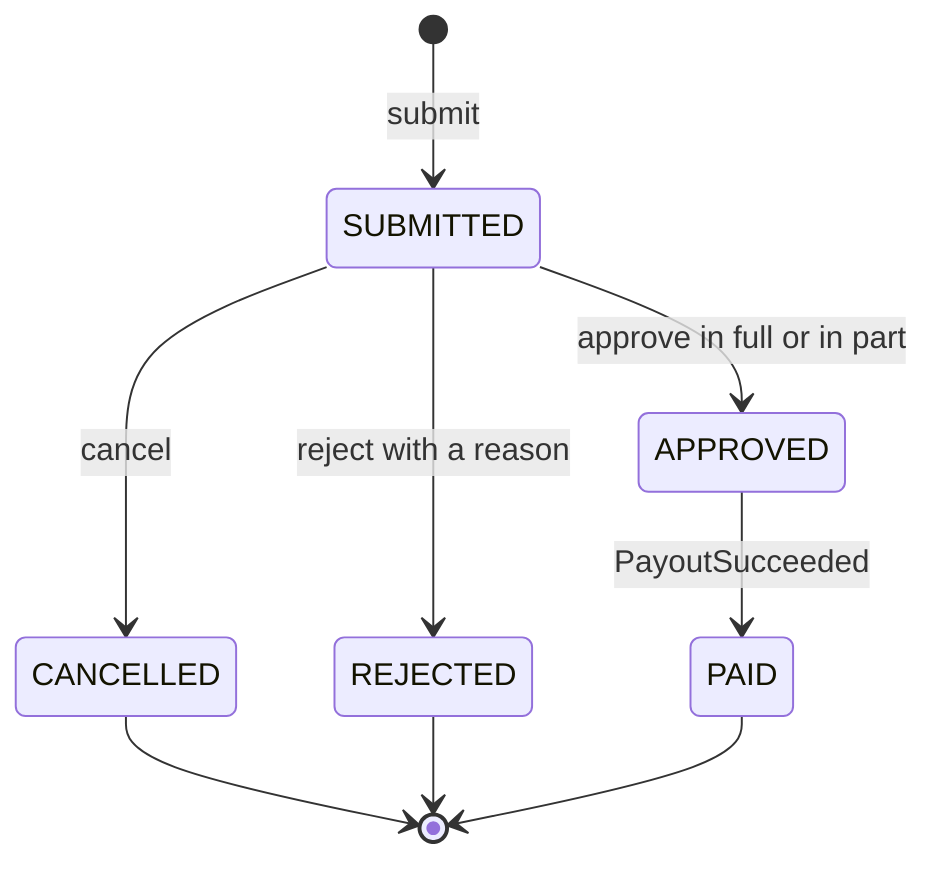
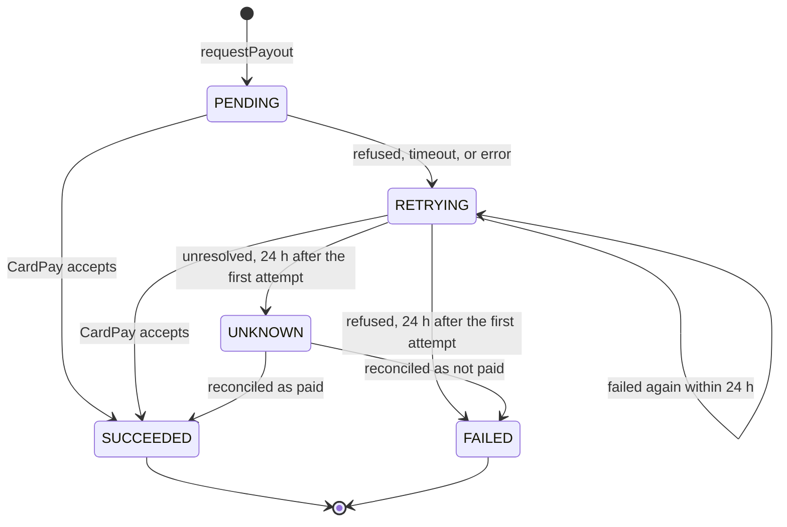

<!--
CHUNK: 08
TITLE: State Machines & Business Rules
PROJECT: Refunds Platform
VERSION: 1.0
DEPENDS_ON: 04
PART OF: LLD - Refunds Platform
-->

# 11. State Machines & Business Rules

> **Convention:** include a state machine only for entities that are genuinely stateful with named states. Stateless services have no state machine here. Per-service rules that are mostly local stay in `04-implementation/<service>.md`; rules that span services live here.

## 11.1 Aggregate State Machines

### `RefundRequest` aggregate (in `refund`)

**States:** `SUBMITTED`, `APPROVED`, `REJECTED`, `CANCELLED`, `PAID` (SDD §17.1 Figure 12).



**Summary:** a request starts Submitted and ends Cancelled, Rejected, or Paid through Approved; every transition checks the status and the version.

**Transition rules:**

| From | Event | To | Guard | Side effect |
|------|-------|----|-------|-------------|
| - | `submit` | `SUBMITTED` | Within the window, card paid, lines refundable, lines within the card-paid amount | Items active, history row, publish `RefundSubmitted` |
| `SUBMITTED` | `cancel` | `CANCELLED` | Caller is the customer; `version` matches | Items inactive, history row, publish `RefundCancelled` |
| `SUBMITTED` | `reject` | `REJECTED` | Own branch, not own request, reason present | Items inactive, history row, publish `RefundRejected` |
| `SUBMITTED` | `approve` | `APPROVED` | Own branch, not own request, amount rule | History row, API-01 in the same transaction, `payout_id` set |
| `APPROVED` | `PayoutSucceeded` | `PAID` | Event amount equals `approved_amount` | History row, publish `RefundPaid` |

> **Invariants enforced at every transition:**
> - Optimistic lock version must match.
> - Tenant ID immutable.
> - Created-at immutable.
> - `approved_amount`, `decided_by`, `decided_at` are written once, at the decision.

### `Payout` aggregate (in `payout`)

**States:** `PENDING`, `RETRYING`, `SUCCEEDED`, `FAILED`, `UNKNOWN` (SDD §17.2 Figure 15).



**Summary:** a payout retries until it succeeds or 24 hours pass after its first attempt, then ends Failed or waits in Unknown for the daily reconciliation.

**Transition rules:**

| From | Event | To | Guard | Side effect |
|------|-------|----|-------|-------------|
| - | `requestPayout` | `PENDING` | Permission, branch, fields, no payout for the refund | `next_attempt_at` = now |
| `PENDING`, `RETRYING` | CardPay accepts | `SUCCEEDED` | Claimed row, `version` matches | Attempt row, publish `PayoutSucceeded` |
| `PENDING`, `RETRYING` | refused, timeout, error | `RETRYING` | now < first attempt + 24 h | Attempt row, `next_attempt_at` by backoff |
| `RETRYING` | last attempt refused | `FAILED` | now >= first attempt + 24 h | Attempt row, publish `PayoutFailed` |
| `RETRYING` | last attempt unresolved | `UNKNOWN` | now >= first attempt + 24 h | Attempt row, publish `PayoutFailed`; never retried until reconciled |
| `UNKNOWN` | reconciliation | `SUCCEEDED` or `FAILED` | CardPay's records | `SUCCEEDED` publishes `PayoutSucceeded` |

> **Invariants enforced at every transition:** optimistic lock version must match; `first_attempt_at` is written once; `amount` never changes after `PENDING`.

### `Notification` (in `notification`) and `PendingTakeBack` (in `loyalty`)

Too small to draw (SDD §17.3, §17.4):

| Entity | From | Event | To | Guard | Side effect |
|--------|------|-------|----|-------|-------------|
| `Notification` | - | listener insert | `PENDING` (or `FAILED` with no usable recipient) | Unique event, channel, recipient key | Alert when `FAILED` at insert |
| `Notification` | `PENDING`, `RETRYING` | MsgHub accepts | `SENT` | Claimed row | `provider_message_id`, `sent_at` |
| `Notification` | `PENDING`, `RETRYING` | send fails | `RETRYING` or `FAILED` | Attempt count against the limit | Alert when `FAILED` |
| `PendingTakeBack` | - | `RefundPaid` with no earn | `OPEN` | Unique (`tenant_id`, `refund_id`) | `loyalty_pending_take_backs` up |
| `PendingTakeBack` | `OPEN` | purchase arrives | deleted (applied) | Cumulative cap | TAKE_BACK movement |
| `PendingTakeBack` | `OPEN` | wait passed | `EXPIRED` | Nightly job | Kept for audit, never applied |

## 11.2 Cross-Service Business Rules

> **Rules that one service depends on another to enforce.** When you change a rule here, check downstream consumers.

### Rule: One payout per approved refund

**Statement:** an approved refund has exactly one payout, created in the approval transaction, and is never paid twice (REFUNDS/NFR-01).

**Source of truth:** `payout` (API-01 idempotency, unique (`tenant_id`, `refund_id`)).

**Enforcement points:** `RefundDecisionServiceImpl.decide` (one call per approval, same transaction); `PayoutPortAdapter.requestPayout`; `CardPayAdapter` (payout ID as the idempotency key).

**Validation matrix:**

| Input condition | Expected outcome |
|-----------------|------------------|
| First approval of a request | One `PENDING` payout, committed with the approval |
| Decision retried with the same `Idempotency-Key` | Stored response; no second API-01 call |
| API-01 called again for the refund with the same amount | Existing `PayoutAccepted`, no new row |
| API-01 called again with another amount | `PayoutConflictException`; approval rolled back |
| API-01 raises any error | Approval rolled back; request stays `SUBMITTED` |

### Rule: A request becomes Paid only after its payout succeeded

**Statement:** `refund` moves a request to `PAID` only on `PayoutSucceeded` for an `APPROVED` request with the same amount (SDD §14.7 payout outcome doctrine).

**Source of truth:** `payout` (the outcome); `refund` (the request status).

**Enforcement points:** `RefundPaymentServiceImpl.onPayoutSucceeded`.

**Validation matrix:**

| Input condition | Expected outcome |
|-----------------|------------------|
| `APPROVED`, amount matches | `PAID`, `RefundPaid` published |
| Already `PAID` with this `payoutId` | No-op (re-delivery) |
| Any other status, or amount differs | Poison: ERROR log, alert, publication left incomplete |

### Rule: Take-backs of one purchase never exceed its earned points

**Statement:** the sum of TAKE_BACK points of a purchase is at most its EARN points, whatever the number of refunds (LOYALTY/NFR-01).

**Source of truth:** `loyalty`.

**Enforcement points:** `TakeBackServiceImpl.onRefundPaid` and `PurchaseIntakeServiceImpl.ingest`, both under the per-purchase advisory lock.

**Validation matrix:**

| Input condition | Expected outcome |
|-----------------|------------------|
| Full refund of a purchase that earned 50 | TAKE_BACK -50 (LOYALTY/UC-02 AC-1: -50 points with the refund reference) |
| Second refund after the cap is reached | Nothing recorded |
| Refund before the purchase arrived | Pending take-back, applied on arrival under the cap |
| Two refunds paid concurrently | Serialised by the lock; the cap holds |

### Rule: The purchase reference joins a refund to its points

**Statement:** `refund` stores the purchase reference POS returns with the receipt and sends it as `purchaseReference` in API-01 and `RefundPaid`; `loyalty` matches EARN movements on it (SDD §5 Receipt number / purchase reference).

**Source of truth:** POS Records (API-02 and the purchase intake).

**Enforcement points:** `RefundRequestServiceImpl.submit` (stores it), `TakeBackServiceImpl` (matches it).

**Validation matrix:**

| Input condition | Expected outcome |
|-----------------|------------------|
| Intake uses the same reference as API-02 | Take-backs match their earn |
| Intake uses another identifier | Every refund ends as a pending take-back, then EXPIRED |

> TODO: whether the member purchase intake carries the receipt number customers enter, and whether receipt numbers are unique across branches, is open in SDD §5 (Retail IT); best guess: one identifier, unique per tenant, so no `branch_id` joins the receipt keys - verify.

## 11.3 Algorithm Pseudocode (non-trivial only)

> **Convention:** include only algorithms whose correctness isn't obvious from the code structure. Skip plain loops, plain CRUD, plain validation.

### Algorithm: 30-day refund window

**Input:** `purchasedAt` (UTC, from POS), `at` (UTC, lookup or submission time).

**Output:** in window or not.

```text
boolean isWithinWindow(purchasedAt, at) {
  return !at.isAfter(purchasedAt.plus(Duration.ofHours(REFUND_WINDOW_HOURS)));   // 720 h = 30 x 24 h (SDD §3 assumption 8)
}
```

**Edge cases:** one minute before and one minute after the boundary (SDD §17.1 Developer Notes); a purchase timestamp in the future (clock skew) is in window.

**Complexity:** O(1).

> TODO: elapsed 30 x 24 hours or 30 calendar days in the tenant's time zone is open in SDD §3 assumption 8; best guess: elapsed hours with the boundary inclusive, kept in this one function so the answer is a one-line change - verify against the Store refund policy v3.

### Algorithm: Backoff with full jitter (dispatchers)

**Input:** `attemptCount`, `now`, `INITIAL`, `MAX`.

**Output:** `next_attempt_at`.

```text
Instant nextAttemptAt(attemptCount, now) {
  cap = min(MAX, INITIAL * 2^attemptCount);
  return now.plus(random.uniform(0, cap));               // full jitter
}
```

**Edge cases:** large `attemptCount` overflow (cap the exponent at 20); a near-zero delay is harmless because the dispatcher poll interval is the effective floor; the payout window still ends 24 h after the first attempt whatever the delay.

**Complexity:** O(1).

### Algorithm: Cumulative take-back cap

**Input:** earn movement, `paidAmount`, sum of earlier take-backs of the purchase.

**Output:** points to take back (0 or more).

```text
remaining = earn.points - abs(sumTakenBack(purchaseReference))
proposed  = takeBackPolicy.points(earn, paidAmount)       // rule open (04 loyalty § 7.3 TODO)
return max(0, min(remaining, proposed))
```

**Edge cases:** `remaining` is 0 (record nothing); a currency mismatch is a poison event, not a 0.

**Complexity:** O(1) with `idx_movement_purchase`.

<!-- MASTER: refunds-platform-lld-master.md | PREV: 07-event-contracts.md | NEXT: 09-cross-cutting.md -->
