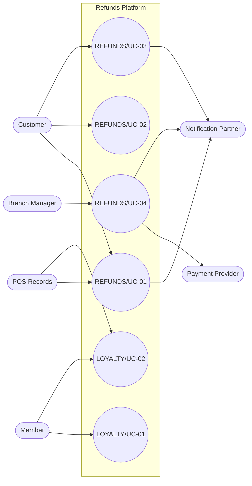

<!--
CHUNK: 03
TITLE: System Users & Use Cases
PROJECT: Refunds Platform
VERSION: 1.1
DEPENDS_ON: 01 (§7.3 also reads 05, 09, 10, 11, and 13x)
PART OF: SDD - Refunds Platform
-->

# 7. System Users & Use Cases

## 7.1 Actors

| Actor | Type (Human / System) | Description | Primary Interface |
|-------|-----------------------|-------------|-------------------|
| Customer | Human | REFUNDS Customer: buyer who requests refunds and follows them; own requests only ([REFUNDS 04 § Personas / Actors](../brd-refunds-portal/04-scope-and-personas.md#personas--actors)). Shares one end-customer identity with Member (role `CUSTOMER`, §16). | Responsive web app (REFUNDS SCR-01, SCR-02) |
| Member | Human | LOYALTY Member: a customer in the loyalty program who views their points; own points only ([LOYALTY 04 § Personas / Actors](../brd-loyalty-points/04-scope-and-personas.md#personas--actors)). A different role from Customer on the same end-customer identity (role `MEMBER`, §16). | Responsive web app (LOYALTY LP-01, LP-02) |
| Branch Manager | Human | REFUNDS Branch Manager: decides on the refund requests of their own branch ([REFUNDS 04 § Personas / Actors](../brd-refunds-portal/04-scope-and-personas.md#personas--actors)). | Responsive web app (REFUNDS MK-03) |
| Payment Provider (CardPay Ltd) | System | Sends payouts to the original card and returns payout results (INT-01). | HTTPS API (API-03) |
| Notification Partner (MsgHub) | System | Delivers email and SMS to customers (INT-02). | HTTPS API (API-04) |
| POS Records (Retail IT team) | System | Supplies receipts for refund requests and member purchases for points (INT-03). | HTTPS API (API-02); purchase intake (mode open, §12) |

## 7.2 Use Case Diagram

**Figure 1: Use Case Diagram**

**Summary:** Customers drive the refund request, tracking, and cancellation use cases, branch managers decide on requests, and members read their points; POS records feed receipts and member purchases, CardPay pays approved refunds, and MsgHub carries the customer messages. [REFUNDS/UC-05](../brd-refunds-portal/05-user-journeys-overview.md#use-case-summary) is merged into [REFUNDS/UC-04](../brd-refunds-portal/06b-use-cases-branch-manager.md#uc-04-approve--reject-refund) and is not drawn.

## 7.3 Use Case Traceability (BRD → SDD)

| Use case (BRD) | Title | Owner (§17.X) | Entry points | Flows (§8.4 / §8.5) | APIs (§15) | Events (§14) | Status |
|----------------|-------|---------------|--------------|---------------------|------------|--------------|--------|
| **[Refunds Portal v1.0](../brd-refunds-portal/refunds-portal-brd-master.md) (REFUNDS)** | | | | | | | |
| [REFUNDS/UC-01](../brd-refunds-portal/06a-use-cases-customer.md#uc-01-request-a-refund) | Request a Refund | [refund](./13a-service-refund.md) | `GET /v1/receipts/{receiptNumber}/refundable-items`, `POST /v1/refund-requests` | [§8.4.1](./05-workflows-and-sequences.md#841-workflow-refund-request-to-payout), [§8.5.1](./05-workflows-and-sequences.md#851-sequence-refund-submission) | API-02, API-04 | `RefundSubmitted` | Active |
| [REFUNDS/UC-02](../brd-refunds-portal/06a-use-cases-customer.md#uc-02-track-refund-status-web-and-mobile) | Track Refund Status (Web and Mobile) | [refund](./13a-service-refund.md) | `GET /v1/refund-requests`, `GET /v1/refund-requests/{refundId}` | - | - | - | Active |
| [REFUNDS/UC-03](../brd-refunds-portal/06a-use-cases-customer.md#uc-03-cancel-a-refund-request) | Cancel a Refund Request | [refund](./13a-service-refund.md) | `POST /v1/refund-requests/{refundId}/cancellation` | [§8.4.1](./05-workflows-and-sequences.md#841-workflow-refund-request-to-payout), [§8.5.3](./05-workflows-and-sequences.md#853-sequence-cancel-a-refund-request) | API-04 | `RefundCancelled` | Active |
| [REFUNDS/UC-04](../brd-refunds-portal/06b-use-cases-branch-manager.md#uc-04-approve--reject-refund) | Approve / Reject Refund | [refund](./13a-service-refund.md) | `GET /v1/branches/{branchId}/refund-requests`, `GET /v1/refund-requests/{refundId}`, `POST /v1/refund-requests/{refundId}/decision` | [§8.4.1](./05-workflows-and-sequences.md#841-workflow-refund-request-to-payout), [§8.4.2](./05-workflows-and-sequences.md#842-workflow-points-take-back-after-a-paid-refund), [§8.5.2](./05-workflows-and-sequences.md#852-sequence-refund-decision-and-payout) | API-01, API-03, API-04 | `RefundRejected`, `PayoutSucceeded`, `RefundPaid`, `PayoutFailed` | Active |
| [REFUNDS/UC-05](../brd-refunds-portal/05-user-journeys-overview.md#use-case-summary) | Issue Partial Refund | - | - | - | - | - | Merged into REFUNDS/UC-04 |
| **[Loyalty Points v1.0](../brd-loyalty-points/loyalty-points-brd-master.md) (LOYALTY)** | | | | | | | |
| [LOYALTY/UC-01](../brd-loyalty-points/06a-use-cases-member.md#uc-01-view-points-balance) | View Points Balance | [loyalty](./13d-service-loyalty.md) | `GET /v1/members/me/points` | - | - | - | Active |
| [LOYALTY/UC-02](../brd-loyalty-points/06a-use-cases-member.md#uc-02-view-points-history) | View Points History | [loyalty](./13d-service-loyalty.md) | `GET /v1/members/me/points-movements`, `GET /v1/members/me/points-movements/{movementId}` | [§8.4.2](./05-workflows-and-sequences.md#842-workflow-points-take-back-after-a-paid-refund) | - | - | Active |

<!-- MASTER: refunds-platform-sdd-master.md | PREV: 02-ecosystem-overview.md | NEXT: 04-architecture-style-and-diagrams.md -->
