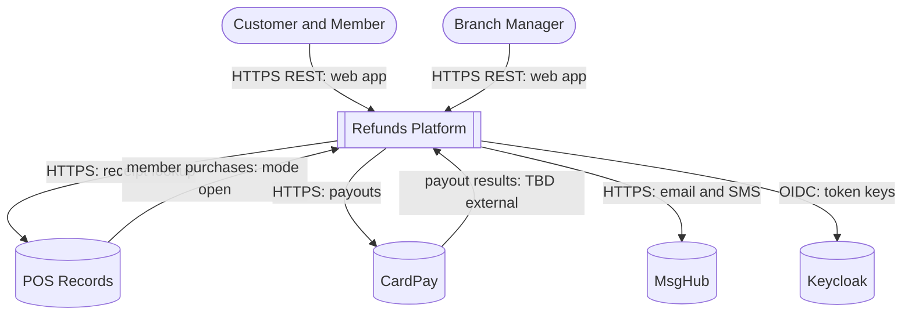
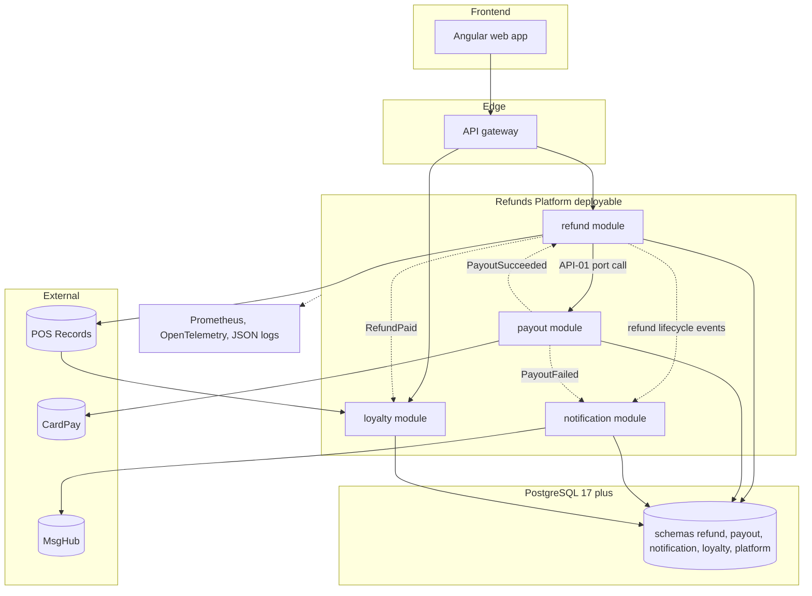

<!--
CHUNK: 04
TITLE: System Design - Architecture Style, Context & HLA Diagrams
PROJECT: Refunds Platform
VERSION: 1.1
DEPENDS_ON: 01, 02
PART OF: SDD - Refunds Platform
-->

# 8. System Design / High-Level Architecture

## 8.1 Architecture Style

### 8.1.1 What

A modular monolith (ADR-01): one Spring Boot deployable built from four DDD modules (`refund`, `payout`, `notification`, `loyalty`), each hexagonal inside and owning one schema of one PostgreSQL database. Modules interact only in process: a synchronous `Internal (in-process)` port call when a command must commit in the caller's transaction (API-01, the payout instruction on approval), and in-process domain events for facts, stored in a durable event publication log in the publishing transaction and delivered to listeners after commit (§14.10, ADR-05). There is no message broker and no cross-schema read. Calls to external providers (POS records, CardPay, MsgHub) go through anti-corruption adapters; provider writes are recorded in module dispatch tables and sent after commit with idempotency keys (ADR-09). Clients use REST/JSON over HTTPS through an API gateway (ADR-04).

### 8.1.2 Why

- **Stage and team:** a first production release of two products that will grow (online-shop refunds in [REFUNDS 12 § Wishlist](../brd-refunds-portal/12-appendix-and-wishlist.md#wishlist); redemption later in [LOYALTY 04 § Out of Scope](../brd-loyalty-points/04-scope-and-personas.md#out-of-scope)), built by one team (assumed; both BRDs are silent): one deployable is the cheapest to build, test, and run.
- **Load:** about 1,200 refund requests a month across 40 branches, three times that for about three weeks in seasonal sales ([REFUNDS 02 § Facts](../brd-refunds-portal/02-glossary-assumptions-facts.md#facts), REFUNDS/NFR-03): no module needs independent scaling.
- **Correctness:** REFUNDS/NFR-01 (never lost or paid twice) is simplest to guarantee when the approval and the payout instruction commit in one database transaction (API-01) and every provider write is idempotent.
- **Cross-product dependency:** loyalty depends on one refund fact, a paid refund ([LOYALTY 02 § Dependencies](../brd-loyalty-points/02-glossary-assumptions-facts.md#dependencies), [LOYALTY/UC-02](../brd-loyalty-points/06a-use-cases-member.md#uc-02-view-points-history) BR-1: points taken back when the purchase is refunded); an in-process event keeps that dependency explicit and extractable.

### 8.1.3 How

- **Bounded contexts:** `refund` owns refund requests and decisions ([REFUNDS/UC-01](../brd-refunds-portal/06a-use-cases-customer.md#uc-01-request-a-refund) to [REFUNDS/UC-04](../brd-refunds-portal/06b-use-cases-branch-manager.md#uc-04-approve--reject-refund)); `payout` owns payouts to CardPay; `notification` owns customer and branch manager messages; `loyalty` owns the points ledger ([LOYALTY/UC-01](../brd-loyalty-points/06a-use-cases-member.md#uc-01-view-points-balance), [LOYALTY/UC-02](../brd-loyalty-points/06a-use-cases-member.md#uc-02-view-points-history)).
- **Inter-module communication:** one port call (API-01, `PayoutPort.requestPayout`) and six in-process domain events (§14.10); listeners are idempotent on `eventId`; no module reads another module's schema; dependencies are acyclic (§6 rules).
- **Data ownership:** one PostgreSQL 17+ database with schemas `refund`, `payout`, `notification`, `loyalty`, plus `platform` for the event publication log; each module migrates its own schema with Flyway; shared schema with `tenant_id` (ADR-03, ADR-06).
- **Deployment model:** one container image and one Helm chart on Kubernetes, two or more replicas behind the gateway; the payout and notification dispatchers run in every replica and claim work with row locks (`FOR UPDATE SKIP LOCKED`).
- **Extraction readiness:** a module's port interfaces and event DTOs are its future service contract; the extraction trigger is in ADR-01.

## 8.2 Context Diagram

**Figure 2: System Context Diagram**

**Summary:** Customers, members, and branch managers use the platform through the web app over HTTPS; the platform looks up receipts in and receives member purchases from POS records, sends payouts to CardPay, sends email and SMS through MsgHub, and validates tokens issued by Keycloak. The purchase intake mode and the CardPay result channel are still open (§12).

## 8.3 High-Level Architecture Diagram

**Figure 3: High-Level Architecture**

**Summary:** The web app reaches the `refund` and `loyalty` modules through the gateway; `refund` calls `payout` through its port and the modules exchange in-process domain events (dashed edges), all persisting to their own schemas in one PostgreSQL database. Only the provider adapters leave the process, and the deployable exports metrics, traces, and logs.

<!-- MASTER: refunds-platform-sdd-master.md | PREV: 03-users-and-use-cases.md | NEXT: 05-workflows-and-sequences.md -->
