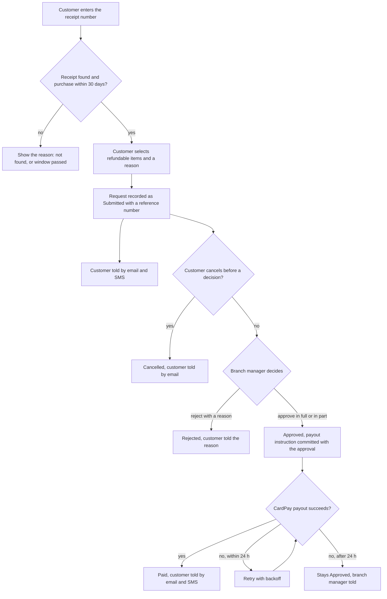
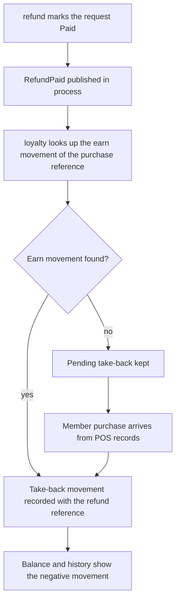
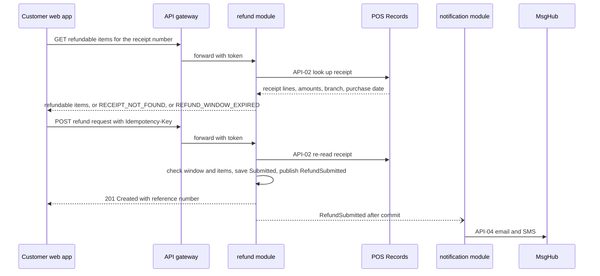
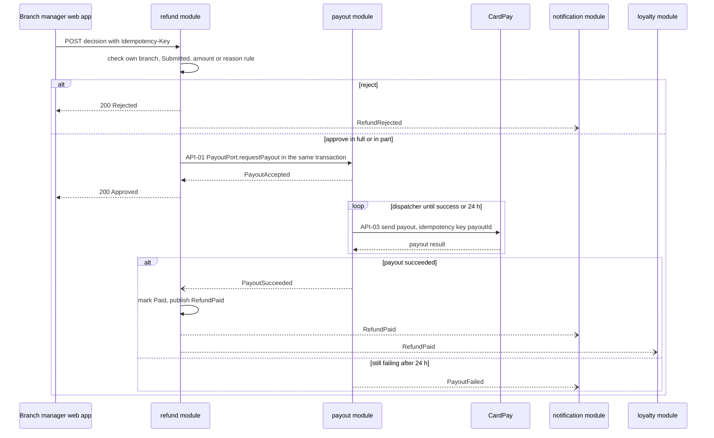
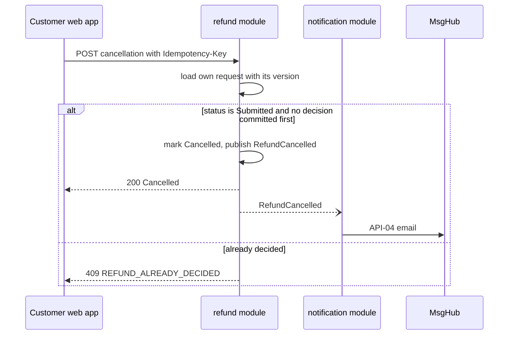

<!--
CHUNK: 05
TITLE: System Design - Workflow & Sequence Diagrams
PROJECT: Refunds Platform
VERSION: 1.1
DEPENDS_ON: 04
PART OF: SDD - Refunds Platform
-->

## 8.4 Workflow Diagrams

<!-- This chunk continues the System Design section from chunk 04 (Architecture Style & Diagrams). -->

### 8.4.1 Workflow: Refund request to payout

**Use cases:** [REFUNDS/UC-01](../brd-refunds-portal/06a-use-cases-customer.md#uc-01-request-a-refund), [REFUNDS/UC-03](../brd-refunds-portal/06a-use-cases-customer.md#uc-03-cancel-a-refund-request), [REFUNDS/UC-04](../brd-refunds-portal/06b-use-cases-branch-manager.md#uc-04-approve--reject-refund)

**Figure 4: Workflow - Refund request to payout**

**Summary:** A refund request is checked against the receipt and the 30-day window, recorded as Submitted, and then either cancelled by the customer or decided by the branch manager; an approval commits the payout instruction, and the payout is retried for up to 24 hours before the branch manager is told. The customer hears about submission, cancellation, rejection, and payment.

### 8.4.2 Workflow: Points take-back after a paid refund

**Use cases:** [REFUNDS/UC-04](../brd-refunds-portal/06b-use-cases-branch-manager.md#uc-04-approve--reject-refund), [LOYALTY/UC-02](../brd-loyalty-points/06a-use-cases-member.md#uc-02-view-points-history)

**Figure 5: Workflow - Points take-back after a paid refund**

**Summary:** When a refund is paid, the `loyalty` module takes back the points earned on that purchase and records the movement with the refund reference, within the one-hour target of LOYALTY/NFR-02; if the purchase has not reached `loyalty` yet, the take-back waits as pending and is applied when the purchase arrives.

## 8.5 Sequence Diagrams

### 8.5.1 Sequence: Refund submission

**Use cases:** [REFUNDS/UC-01](../brd-refunds-portal/06a-use-cases-customer.md#uc-01-request-a-refund)

**Figure 6: Sequence - Refund submission**

**Summary:** The customer first reads the refundable lines of a receipt, then submits; the `refund` module re-reads the receipt, re-checks the window and the items, stores the Submitted request, and publishes `RefundSubmitted`, which the `notification` module turns into an email and an SMS after commit.

### 8.5.2 Sequence: Refund decision and payout

**Use cases:** [REFUNDS/UC-04](../brd-refunds-portal/06b-use-cases-branch-manager.md#uc-04-approve--reject-refund)

**Figure 7: Sequence - Refund decision and payout**

**Summary:** A rejection commits and publishes `RefundRejected`; an approval calls `PayoutPort.requestPayout` inside the approval transaction, after which the payout dispatcher sends the payout to CardPay with the payout ID as idempotency key. Success flows back as `PayoutSucceeded`, `refund` marks the request Paid and publishes `RefundPaid` for `notification` and `loyalty`; after 24 hours of failures `PayoutFailed` makes `notification` tell the branch manager.

### 8.5.3 Sequence: Cancel a refund request

**Use cases:** [REFUNDS/UC-03](../brd-refunds-portal/06a-use-cases-customer.md#uc-03-cancel-a-refund-request)

**Figure 8: Sequence - Cancel a refund request**

**Summary:** The cancellation is a guarded transition with optimistic locking, so a decision that commits first wins and the customer gets `REFUND_ALREADY_DECIDED`; a successful cancellation publishes `RefundCancelled`, which the `notification` module sends as an email.

<!-- MASTER: refunds-platform-sdd-master.md | PREV: 04-architecture-style-and-diagrams.md | NEXT: 06-principles-and-decisions.md -->
