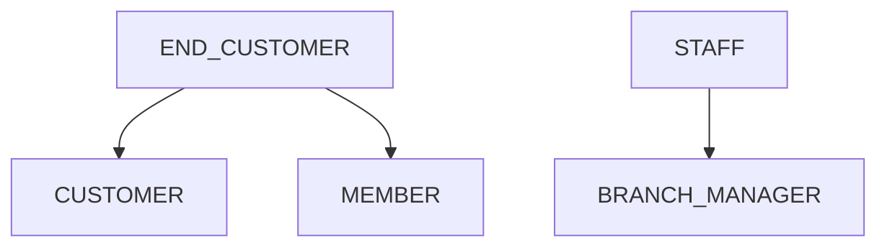
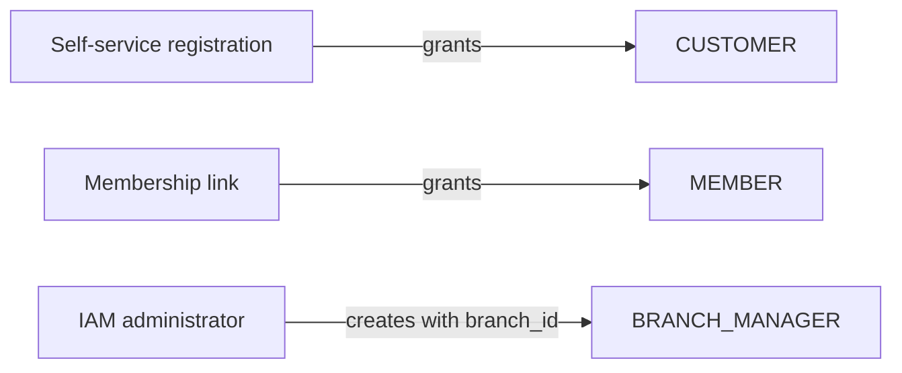
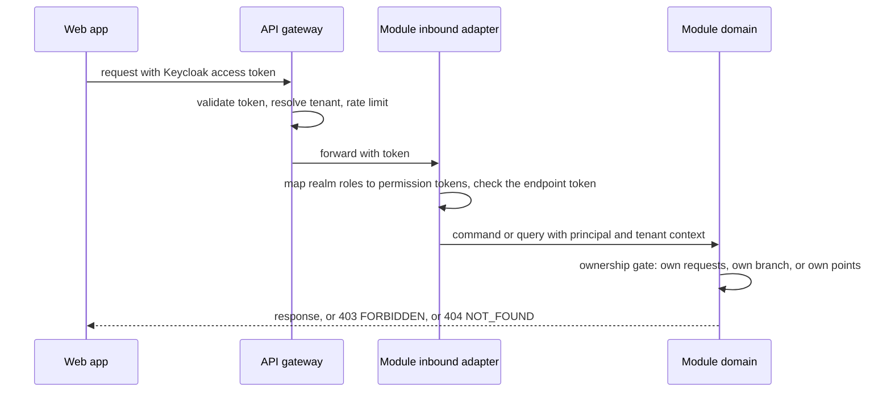

<!--
CHUNK: 12
TITLE: Centralized User Roles & Authorities (Platform-Wide)
PROJECT: Refunds Platform
VERSION: 1.1
DEPENDS_ON: 03, 07, 09 (+ per-module chunks 13a, 13b, 13c, 13d for per-module authorization notes)
PART OF: SDD - Refunds Platform
PURPOSE: Single platform-wide reference for user types, roles, and their authorities - who can do what, who can create whom, which modules each role touches, and how a role resolves to an allowed action at request time. Consolidates the REFUNDS and LOYALTY Users & Use Cases Matrices and the per-module authorization notes into one canonical catalogue.
CONSISTENCY_RULE: Role names, permission tokens, and per-module authorization notes in the 13x chunks MUST match this catalogue verbatim. Divergences are flagged here (see the drift register), never silently reconciled.
-->

# 16. Centralized User Roles & Authorities (Platform-Wide)

> **What this chunk is.** The one place that answers: what user types exist, which roles they break into, what each role is allowed to do, who may create whom, and which modules each role interacts with. The LLD and the Keycloak and authorization implementation seed from this catalogue.

---

## 16.1 Business Overview

Two planes of users meet in one deployable. In the end-customer plane, one person can hold two roles: a **Customer** who requests and follows refunds (REFUNDS) and, when enrolled in the loyalty program, a **Member** who reads their points (LOYALTY). In the tenant plane, the retailer's **Branch Managers** decide on the refund requests of their own branch. Every role sees only its own scope: own requests, own branch, or own points ([REFUNDS 04 § Personas / Actors](../brd-refunds-portal/04-scope-and-personas.md#personas--actors), [LOYALTY 04 § Personas / Actors](../brd-loyalty-points/04-scope-and-personas.md#personas--actors)). Neither BRD names a platform operator persona.

## 16.2 Resolution Model - How a Role Becomes an Allowed Action

Per ADR-08 (Proposed): (1) the user signs in to the Keycloak realm and the web app sends the access token; (2) the API gateway validates the token (issuer, signature, expiry), resolves the tenant from the `tenant_id` claim, and applies rate limits; (3) the deployable's inbound adapter maps the token's realm roles to permission tokens with the static map of §16.11 and checks the token the endpoint or port requires; (4) the module enforces the contextual gate in its query or command: own requests (`customer_id` = token subject), own branch (request `branchId` = `branch_id` claim), or own points (`member_id` claim). In-process port calls (API-01) re-check their token against the same call context. Listeners and dispatchers run with the system principal and check no permission token.

## 16.3 User Types (Tier 1)

| User type | Tenancy plane | Identity source | Description |
|---|---|---|---|
| `END_CUSTOMER` | End-customer | Keycloak realm (self-service account, §3 assumption 1) | A retail customer; holds `CUSTOMER`, and `MEMBER` when linked to a loyalty membership |
| `STAFF` | Tenant | Keycloak realm (created by IAM administrators, §3 assumption 6) | A retailer employee; holds `BRANCH_MANAGER` with a `branch_id` claim |

No service user type: modules never call each other over the network, and dispatchers call only external providers, with provider credentials.

## 16.4 Role Catalogue - Authorities & Related Services

### 16.4.1 END_CUSTOMER Roles

| Role | Scope | Core authorities | Related services |
|---|---|---|---|
| `CUSTOMER` | own requests | Look up a receipt, submit, track, and cancel own refund requests | refund |
| `MEMBER` | own points | Read own points balance and movements | loyalty |

### 16.4.2 STAFF Roles

| Role | Scope | Core authorities | Related services |
|---|---|---|---|
| `BRANCH_MANAGER` | own branch | Read the branch's refund requests, approve in full or in part, reject, read the branch refund report; the approval instructs the payout | refund, payout |

### 16.4.3 Platform Plane (operator - outside tenant tenancy)

Not applicable for this release: no BRD persona operates the platform; accounts and roles are managed in Keycloak outside the platform's use cases.

## 16.5 Capability Matrix (canonical)

| Capability | `CUSTOMER` | `MEMBER` | `BRANCH_MANAGER` |
|---|---|---|---|
| Look up a receipt and request a refund ([REFUNDS/UC-01](../brd-refunds-portal/06a-use-cases-customer.md#uc-01-request-a-refund)) | Yes¹ | - | - |
| Track own refund requests ([REFUNDS/UC-02](../brd-refunds-portal/06a-use-cases-customer.md#uc-02-track-refund-status-web-and-mobile)) | Yes¹ | - | - |
| Cancel a Submitted request ([REFUNDS/UC-03](../brd-refunds-portal/06a-use-cases-customer.md#uc-03-cancel-a-refund-request)) | Yes¹ | - | - |
| Read the branch queue and decide on requests, which instructs the payout ([REFUNDS/UC-04](../brd-refunds-portal/06b-use-cases-branch-manager.md#uc-04-approve--reject-refund)) | - | - | Yes² |
| Read the branch refund report ([REFUNDS 09 § Reporting / Analytics](../brd-refunds-portal/09-reporting-and-analytics.md#reporting--analytics)) | - | - | Yes² |
| Read the points balance ([LOYALTY/UC-01](../brd-loyalty-points/06a-use-cases-member.md#uc-01-view-points-balance)) | - | Yes³ | - |
| Read the points history ([LOYALTY/UC-02](../brd-loyalty-points/06a-use-cases-member.md#uc-02-view-points-history)) | - | Yes³ | - |

¹ Own requests only ([REFUNDS 04 § Personas / Actors](../brd-refunds-portal/04-scope-and-personas.md#personas--actors) access level; [REFUNDS/UC-02](../brd-refunds-portal/06a-use-cases-customer.md#uc-02-track-refund-status-web-and-mobile) BR-1: customers see only their own requests). The receipt lookup has no ownership gate: any receipt of the tenant (R-08).
² Own branch only ([REFUNDS 07 § Users & Use Cases Matrix](../brd-refunds-portal/07-users-use-cases-matrix.md#users--use-cases-matrix) footnote ¹).
³ Own points only ([LOYALTY 07 § Users & Use Cases Matrix](../brd-loyalty-points/07-users-use-cases-matrix.md#users--use-cases-matrix) footnote (1)).

## 16.6 Grant / Invitation Authority (who can create whom)

| Grantor role | May create / invite | Constraints |
|---|---|---|
| Self-service registration (no role) | `CUSTOMER` | Every end-customer account gets `CUSTOMER` (§3 assumption 1) |
| Loyalty membership link (no role) | `MEMBER` | Granted with the `member_id` claim when the account is linked to a membership (§3 assumption 2) |
| IAM administrator (outside the platform roles) | `BRANCH_MANAGER` | One `branch_id` per account; a manager runs one branch ([REFUNDS 04 § Personas / Actors](../brd-refunds-portal/04-scope-and-personas.md#personas--actors)) |

No platform role can create or invite another role; no BRD use case grants roles.

## 16.7 Role → Related-Services Matrix (platform-wide)

| Role | refund | payout | notification | loyalty |
|---|---|---|---|---|
| `CUSTOMER` | write | - | - | - |
| `MEMBER` | - | - | - | read |
| `BRANCH_MANAGER` | write | write (through API-01) | - | - |

## 16.8 Lifecycle, Scope & Revocation Rules

1. **Grant:** `CUSTOMER` at registration; `MEMBER` with the membership link; `BRANCH_MANAGER` with a `branch_id` by an IAM administrator.
2. **Change:** a branch change updates the `branch_id` claim and takes effect on the next token; requests already decided keep their `decided_by`.
3. **Suspension / revocation:** a disabled account or a removed role takes effect when the current access token expires; a decision already committed stands, and its payout continues.
4. **Erasure:** an end-customer erasure clears the contact columns of their refund requests, the recipients of their messages, and the `contact` of their incomplete event publications (§14.10 rule 8), and keeps the financial fields; the retention periods are open in §17.1, §17.3, and §17.4.
5. **Claim sources:** `tenant_id`, `branch_id`, and `member_id` come from account attributes the account owner can never edit. `tenant_id` is written when the account is created, from the tenant web app the customer registers through (§11.5 tenant configuration); an end customer of two tenants holds one account per tenant. `branch_id` is written by the IAM administrator (rule 1); `member_id` only by the membership link. A token without `tenant_id` is refused with 403 `FORBIDDEN`.
6. **One user type per account:** an account holds the roles of one user type only; IAM administrators never grant `BRANCH_MANAGER` to an account that holds `CUSTOMER` or `MEMBER`. The read gate follows the role: `CUSTOMER` reads own requests, `BRANCH_MANAGER` reads own-branch requests.

## 16.9 Diagrams

### 16.9.1 Role Taxonomy (user types → roles → sub-roles)

**Figure 9: Role taxonomy**

**Summary:** End customers hold `CUSTOMER` and, when enrolled, `MEMBER`; staff hold `BRANCH_MANAGER`. There are no sub-roles.

### 16.9.2 Grant / Invitation Authority (who may create whom)

**Figure 10: Grant authority**

**Summary:** Roles come from registration, the membership link, or an IAM administrator; no platform role grants another.

### 16.9.3 Per-Request Authorization (how a role yields a decision)

**Figure 11: Per-request authorization**

**Summary:** The gateway authenticates and resolves the tenant, the module checks the permission token and then the ownership rule; a missing permission token gives 403, and a resource outside the caller's scope gives 403 for another branch or 404 for another customer's or member's data.

## 16.10 Traceability

| Capability / rule | Source (BRD UC / matrix row / ADR / 13x chunk) |
|---|---|
| Request a refund | [REFUNDS/UC-01](../brd-refunds-portal/06a-use-cases-customer.md#uc-01-request-a-refund); UC-01 row in [REFUNDS 07](../brd-refunds-portal/07-users-use-cases-matrix.md#users--use-cases-matrix); §17.1 |
| Track own requests | [REFUNDS/UC-02](../brd-refunds-portal/06a-use-cases-customer.md#uc-02-track-refund-status-web-and-mobile); UC-02 row in [REFUNDS 07](../brd-refunds-portal/07-users-use-cases-matrix.md#users--use-cases-matrix); §17.1 |
| Cancel a Submitted request | [REFUNDS/UC-03](../brd-refunds-portal/06a-use-cases-customer.md#uc-03-cancel-a-refund-request); UC-03 row in [REFUNDS 07](../brd-refunds-portal/07-users-use-cases-matrix.md#users--use-cases-matrix); §17.1 |
| Decide on own-branch requests and instruct the payout | [REFUNDS/UC-04](../brd-refunds-portal/06b-use-cases-branch-manager.md#uc-04-approve--reject-refund); UC-04 row and footnote ¹ in [REFUNDS 07](../brd-refunds-portal/07-users-use-cases-matrix.md#users--use-cases-matrix); §17.1, §17.2 (API-01) |
| Read the branch refund report | [REFUNDS 09 § Reporting / Analytics](../brd-refunds-portal/09-reporting-and-analytics.md#reporting--analytics) (audience Branch Manager); footnote ¹ scope; §17.1 |
| Read the points balance | [LOYALTY/UC-01](../brd-loyalty-points/06a-use-cases-member.md#uc-01-view-points-balance); UC-01 row in [LOYALTY 07](../brd-loyalty-points/07-users-use-cases-matrix.md#users--use-cases-matrix); §17.4 |
| Read the points history | [LOYALTY/UC-02](../brd-loyalty-points/06a-use-cases-member.md#uc-02-view-points-history); UC-02 row in [LOYALTY 07](../brd-loyalty-points/07-users-use-cases-matrix.md#users--use-cases-matrix); §17.4 |
| Ownership gates and enforcement split | REFUNDS/NFR-04; ADR-07; ADR-08 |

## 16.11 Permission × Role Matrix (platform-wide)

| Permission token | `CUSTOMER` | `MEMBER` | `BRANCH_MANAGER` |
|---|---|---|---|
| `refund.receipt.read` | ✓ | - | - |
| `refund.request.create` | ✓¹ | - | - |
| `refund.request.read` | ✓¹ | - | ✓² |
| `refund.request.cancel` | ✓¹ | - | - |
| `refund.request.decide` | - | - | ✓² |
| `refund.report.read` | - | - | ✓² |
| `payout.payout.request` | - | - | ✓² |
| `loyalty.balance.read` | - | ✓³ | - |
| `loyalty.movement.read` | - | ✓³ | - |

¹ Own requests only. ² Own branch only. ³ Own points only (footnotes of §16.5).

## 16.12 Implementation Seed & Reconciliation

### 16.12.1 Seed Strategy

Realm roles (`CUSTOMER`, `MEMBER`, `BRANCH_MANAGER`) are created by the Keycloak realm configuration, versioned with the deployment. The role-to-permission map of §16.11 is a static map in the deployable (ADR-08, Proposed), changed only together with this chunk in the same release.

### 16.12.2 Per-Role Action Counts (drift baseline)

| Role | Seeded permission count |
|---|---|
| `CUSTOMER` | 4 |
| `MEMBER` | 2 |
| `BRANCH_MANAGER` | 4 |

### 16.12.3 Drift & Reconciliation Register

No divergence found: the permission tokens and roles in chunks 13a, 13b, 13d, and 11 match §16.11, and the role scopes match the REFUNDS and LOYALTY matrices.

| # | Where | Divergence | Resolution / flag | Status |
|---|---|---|---|---|

<!-- MASTER: refunds-platform-sdd-master.md | PREV: 11-api-contracts.md | NEXT: 13a-service-refund.md -->
