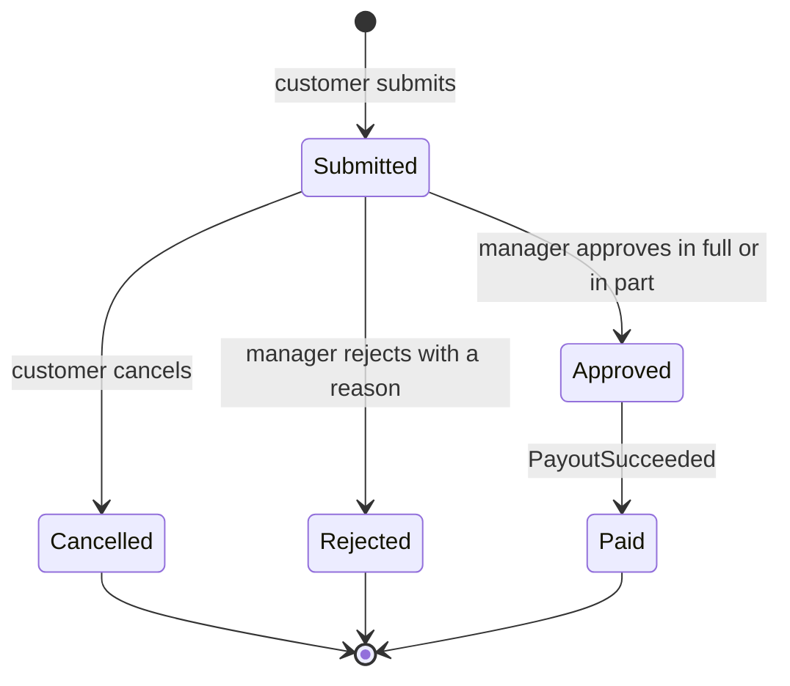
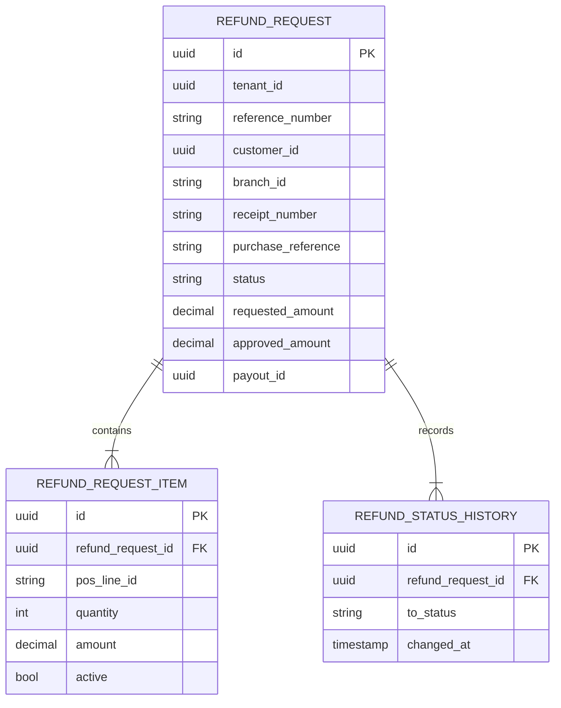
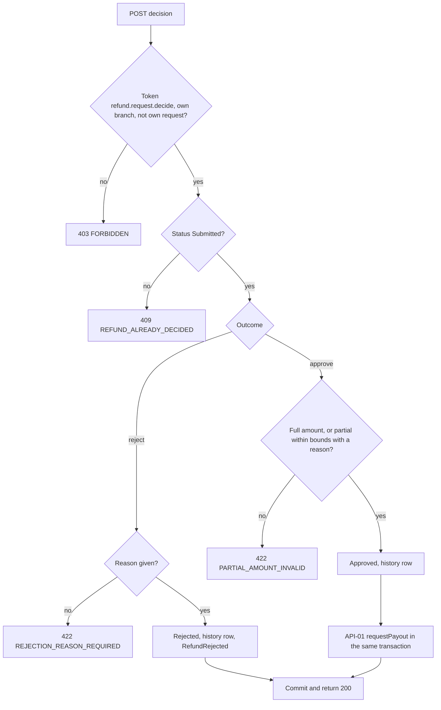

<!--
CHUNK: 13a
TITLE: Detailed Service Spec - refund
PROJECT: Refunds Platform
VERSION: 1.1
DEPENDS_ON: 09, 07, 10 (event hub - in-process event names and DTO fields must match chunk 10 §14.10 verbatim), 11 (API contracts - API-01 and API-02 match chunk 11 verbatim), 12 (roles - permission tokens match chunk 12 verbatim)
PART OF: SDD - Refunds Platform
-->

# 17. Detailed Service Specs

---

## 17.1 refund

### What

The `refund` module (a module of the one deployable, ADR-01) owns the refund request bounded context: receipt-based refund requests, their lifecycle ([REFUNDS 03 § Refund request lifecycle](../brd-refunds-portal/03-definitions-and-domain-concepts.md#refund-request-lifecycle)), branch managers' decisions within their own branch ([REFUNDS 03 § Branch ownership](../brd-refunds-portal/03-definitions-and-domain-concepts.md#branch-ownership)), and the branch refund report.

### Boundaries

- **Owns:** the `RefundRequest` aggregate (items, status history, decision, customer contact snapshot), reference numbers, the branch refund report query.
- **Does not own:** payouts and provider attempts (`payout`), messages (`notification`), points (`loyalty`), receipts (POS records, read through API-02).
- **Upstream consumers:** the web app (customer and branch manager screens) through the gateway; `notification` and `loyalty` listen to its in-process events.
- **Downstream dependencies:** POS Records (API-02); `payout` through `PayoutPort` (API-01) and its `PayoutSucceeded` event.

### Input

| Type | Source | Description |
|------|--------|-------------|
| REST | Customer web app | Receipt lookup, submit, own list and detail, cancel (List of APIs) |
| REST | Branch manager web app | Branch queue, request detail, decision, branch refund report |
| In-process event | `payout` | `PayoutSucceeded`: moves the request from Approved to Paid |

### Business Logic

Responsibility: record every refund request, keep it visible to its customer, and decide it exactly once.

- **Receipt lookup** ([REFUNDS/UC-01](../brd-refunds-portal/06a-use-cases-customer.md#uc-01-request-a-refund) steps 1-2, A1, E1, E2): reads the receipt through API-02 and marks each line refundable unless it belongs to an active request of the tenant (Submitted, Approved, or Paid) or the POS record reports it refunded; a purchase older than 30 days returns `REFUND_WINDOW_EXPIRED` (BR-1: refund only within 30 days, measured per §3 assumption 8); an unknown receipt returns `RECEIPT_NOT_FOUND`. A receipt with no card payment returns 422 `NO_CARD_PAYMENT` (not paid by card; visit the branch); for a purchase paid partly by card, the selected lines may not exceed the card-paid amount (422 `CARD_AMOUNT_EXCEEDED`); Submit re-checks both.
- **Submit** ([REFUNDS/UC-01](../brd-refunds-portal/06a-use-cases-customer.md#uc-01-request-a-refund) steps 4-6, BR-2: an item is refunded only once): re-reads the receipt (API-02) before the transaction opens; then, in one transaction, re-checks the window and every selected line, sets `requestedAmount` to the sum of the selected lines, stores the request as Submitted with a per-tenant reference number, the POS purchase reference, and the customer's email, mobile, and locale from the token claims `email`, `phone_number`, and `locale` (ADR-07), and publishes `RefundSubmitted`. A unique index on active items blocks two concurrent requests for one line.
- **Track** ([REFUNDS/UC-02](../brd-refunds-portal/06a-use-cases-customer.md#uc-02-track-refund-status-web-and-mobile) steps 1-4, A1, BR-1: customers see only their own requests): lists the caller's requests newest first with reference number, amount, and status, and returns one request with its status history (date of each change and the rejection reason); an empty list is a normal answer.
- **Cancel** ([REFUNDS/UC-03](../brd-refunds-portal/06a-use-cases-customer.md#uc-03-cancel-a-refund-request) steps 2-5, E1, BR-1: only Submitted requests can be cancelled): guarded transition Submitted to Cancelled with optimistic locking; any other status, or a decision that commits first, returns `REFUND_ALREADY_DECIDED`; publishes `RefundCancelled`. The confirmation of step 3 is a client step.
- **Branch queue** ([REFUNDS/UC-04](../brd-refunds-portal/06b-use-cases-branch-manager.md#uc-04-approve--reject-refund) steps 1-2): Submitted requests whose `branchId` equals the manager's `branch_id` claim, oldest first, with amount and reason.
- **Approve** ([REFUNDS/UC-04](../brd-refunds-portal/06b-use-cases-branch-manager.md#uc-04-approve--reject-refund) steps 3-6, A1, BR-2: partial amount more than 0 and less than the requested amount): a full approval sets `approvedAmount` to the requested amount; a partial approval needs the lower amount and a reason. The request moves Submitted to Approved and `PayoutPort.requestPayout` (API-01) runs in the same transaction, so an approval never exists without its payout instruction (REFUNDS/NFR-01).
- **Reject** ([REFUNDS/UC-04](../brd-refunds-portal/06b-use-cases-branch-manager.md#uc-04-approve--reject-refund) A2, BR-3: a rejection always has a reason): moves Submitted to Rejected with the reason and publishes `RefundRejected`.
- **Self-decision guard** (Approve and Reject): the decision is refused with 403 `FORBIDDEN` when the request's `customer_id` equals the deciding principal.
- **Paid** ([REFUNDS/UC-04](../brd-refunds-portal/06b-use-cases-branch-manager.md#uc-04-approve--reject-refund) step 7, AC-1: payout sent and customer told): on `PayoutSucceeded` the request moves Approved to Paid and `RefundPaid` is published in the same transaction. A payout that keeps failing (E1) leaves the request Approved; `payout` raises the alert.
- **Own branch** ([REFUNDS/UC-04](../brd-refunds-portal/06b-use-cases-branch-manager.md#uc-04-approve--reject-refund) BR-1: own branch only): every manager query and command compares the request's `branchId` with the `branch_id` claim.
- **Branch refund report** ([REFUNDS 09 § Reporting / Analytics](../brd-refunds-portal/09-reporting-and-analytics.md#reporting--analytics)): for one branch and one calendar day in the tenant's time zone (§11.5): per status, the requests that entered that status during the day (`refund_status_history`); amounts paid, the sum of `approved_amount` of the requests that became Paid during the day; average time to decision, the mean of `decided_at` minus `created_at` of the requests decided during the day. The report is read on demand. **[NEEDS CLARIFICATION: does REFUNDS 09 'Daily' also mean the report is sent to the branch manager each day?]**
- **Cross-cutting:** tenant filter on every query; `Idempotency-Key` on every POST; the `PayoutSucceeded` listener dedups on `eventId`.

**State machine (if applicable):**

**Figure 12: refund - request state machine**

**Summary:** A request starts Submitted and ends Cancelled (customer), Rejected (manager), or Paid (after the payout succeeds through Approved); every transition is guarded by the current status and the row version.

Write bodies: `RefundRequestCreate` = `receiptNumber`, `items[]` (`posLineId`), `reason`; `RefundDecision` = `outcome` (`APPROVE` or `REJECT`), `amount` (Money, only for a partial approval), `reason` (required for a rejection and a partial approval).

### Output

| Type | Destination | Description |
|------|-------------|-------------|
| REST response | Web app | Refundable lines, requests, history, decisions, branch report |
| In-process event | `notification`, `loyalty` | `RefundSubmitted`, `RefundCancelled`, `RefundRejected`, `RefundPaid` (§14.10) |
| Port call | `payout` | `PayoutPort.requestPayout` on approval (API-01) |

### Integrations

| Integration | Direction | Protocol | Purpose | Contract | Failure Handling |
|-------------|-----------|----------|---------|----------|------------------|
| POS Records | Outbound, sync | HTTPS | Receipt lookup at lookup and at submission | API-02 (§15) | One retry on timeout or 503, then 503 `UNAVAILABLE` to the customer (§12 INT-03) |
| `payout` | Outbound, sync (in-process) | Java port | Payout instruction on approval | API-01 (§15) | A raised error rolls back the approval and returns it to the manager |
| `payout` | Inbound, async (in-process) | In-process event | Payout outcome | `PayoutSucceeded` (§14.10) | Listener retried from the publication log while incomplete |
| `notification`, `loyalty` | Outbound, async (in-process) | In-process event | Refund lifecycle facts | `RefundSubmitted`, `RefundCancelled`, `RefundRejected`, `RefundPaid` (§14.10) | Durable publication; a failing listener never fails the request |

### DB Modeling

#### Entity Relationship

**Figure 13: refund - entity relationship**

**Summary:** A refund request owns its items and its status history; `payout_id` is a plain reference to the `payout` module's row, with no cross-schema key.

#### Tables Design

| Table | Column | Type | Constraints | Notes |
|-------|--------|------|-------------|-------|
| `refund_request` | `id` | uuid | PK | UUIDv7 |
| `refund_request` | `tenant_id` | uuid | not null | first in every index |
| `refund_request` | `reference_number` | varchar(20) | not null; unique (`tenant_id`, `reference_number`) | per-tenant sequence |
| `refund_request` | `customer_id` | uuid | not null; index (`tenant_id`, `customer_id`, `created_at`) | token subject |
| `refund_request` | `customer_email`, `customer_mobile` | varchar(254), varchar(20) | email not null; mobile null | pii, column-encrypted |
| `refund_request` | `customer_locale` | varchar(10) | null | BCP 47, from the `locale` claim |
| `refund_request` | `branch_id` | varchar(32) | not null; index (`tenant_id`, `branch_id`, `status`, `created_at`) | from the POS receipt |
| `refund_request` | `receipt_number`, `purchased_at` | varchar(64), timestamptz | not null | from the POS receipt |
| `refund_request` | `purchase_reference` | varchar(64) | not null | POS purchase reference of the receipt (§5) |
| `refund_request` | `reason` | varchar(500) | not null | customer's reason |
| `refund_request` | `currency`, `requested_amount`, `approved_amount` | char(3), numeric(19,4), numeric(19,4) | requested > 0; approved null or > 0 and <= requested | ISO 4217 |
| `refund_request` | `status` | varchar(16) | not null; SUBMITTED, APPROVED, REJECTED, CANCELLED, PAID | |
| `refund_request` | `decision_reason`, `decided_by`, `decided_at` | varchar(500), uuid, timestamptz | reason required for REJECTED and partial approval | |
| `refund_request` | `payout_id` | uuid | null | from API-01 |
| `refund_request` | `version` | bigint | not null | optimistic lock |
| `refund_request_item` | `id`, `tenant_id`, `refund_request_id` | uuid | PK; not null; FK in schema | |
| `refund_request_item` | `receipt_number`, `pos_line_id`, `description`, `quantity`, `amount` | varchar(64), varchar(64), varchar(200), int, numeric(19,4) | not null | copied from the receipt line; a line is refunded once and in full (§5 Refundable item) |
| `refund_request_item` | `active` | boolean | not null; unique (`tenant_id`, `receipt_number`, `pos_line_id`) where `active` | false once the request is Rejected or Cancelled |
| `refund_status_history` | `id`, `tenant_id`, `refund_request_id` | uuid | PK; not null; index (`tenant_id`, `refund_request_id`, `changed_at`) | |
| `refund_status_history` | `from_status`, `to_status`, `changed_at`, `changed_by`, `reason` | varchar(16), varchar(16), timestamptz, uuid, varchar(500) | to_status, changed_at not null | feeds UC-02 history and the branch report |
| `idempotency_record` | `tenant_id`, `idempotency_key`, `request_hash`, `response_status`, `response_body`, `created_at` | uuid, uuid, char(64), int, jsonb, timestamptz | PK (`tenant_id`, `idempotency_key`) | replay returns the stored response |

#### Migration Strategy

- **Tool:** Flyway, versioned SQL in the module's own location for schema `refund`.
- **Backward compatibility:** additive changes; expand-contract for renames and type changes across two releases.
- **Data backfill:** a separate versioned migration per backfill, idempotent and batched.
- **Rollback:** forward-fix with a new migration; the previous image stays compatible with the expanded schema.

#### Retention Policy

- `refund_request`, `refund_request_item`, `refund_status_history`: [NEEDS CLARIFICATION: retention period for refund records and for the customer contact columns; neither BRD states one.]
- `idempotency_record`: [NEEDS CLARIFICATION: replay window for idempotency keys.]

#### Archival

- **Cold storage:** [NEEDS CLARIFICATION: archival target for closed requests (Paid, Rejected, Cancelled), if any.]
- **Format:** depends on the target above.
- **Schedule:** depends on the retention period above.
- **Restore SLA:** depends on the target above.

#### Data Encryption

- **At rest:** database storage encryption, plus column-level encryption of `customer_email` and `customer_mobile`.
- **In transit:** TLS between the deployable and PostgreSQL and to POS records.
- **Key management:** keys in the secrets manager (§6). [NEEDS CLARIFICATION: key rotation cadence.]
- **PII columns:** `customer_email`, `customer_mobile`; replaced with synthetic values in non-production data.

### Multi-Tenancy Specifications

- **Strategy override:** none (shared schema with `tenant_id`, ADR-03).
- **Tenant filter:** every repository query and the row-level security policy on `tenant_id`.
- **Cross-tenant queries:** none.

### API Standards

- **Style:** REST, JSON (ADR-04).
- **Versioning:** URI prefix `/v1`.
- **Authentication:** Keycloak JWT, validated at the gateway and in the deployable (ADR-07).
- **Idempotency:** `Idempotency-Key` required on every POST; a replay with the same key and body returns the stored response; the same key with another body returns 409 `CONFLICT`.
- **Pagination:** cursor-based on list endpoints, newest first for customers, oldest first for the branch queue.
- **Error envelope:** Problem Details per the §15.1 error model.

#### List of APIs (Swagger-friendly)

| Method | Path | Summary | Request Body | Response | Permission token (§16) | API ID (§15) |
|--------|------|---------|--------------|----------|------------------------|--------------|
| GET | `/v1/receipts/{receiptNumber}/refundable-items` | Receipt lines with their refundability | - | `RefundableReceipt` | `refund.receipt.read` | - |
| POST | `/v1/refund-requests` | Submit a refund request | `RefundRequestCreate` | `RefundRequestCreated` (201) | `refund.request.create` | - |
| GET | `/v1/refund-requests` | The caller's requests, newest first | - | `RefundRequestPage` | `refund.request.read` | - |
| GET | `/v1/refund-requests/{refundId}` | One request with its status history | - | `RefundRequestDetail` | `refund.request.read` | - |
| POST | `/v1/refund-requests/{refundId}/cancellation` | Cancel a Submitted request | - | `RefundRequestDetail` | `refund.request.cancel` | - |
| GET | `/v1/branches/{branchId}/refund-requests` | Submitted requests of the branch, oldest first | - | `RefundRequestPage` | `refund.request.read` | - |
| POST | `/v1/refund-requests/{refundId}/decision` | Approve in full or in part, or reject | `RefundDecision` | `RefundRequestDetail` | `refund.request.decide` | - |
| GET | `/v1/branches/{branchId}/refund-report` | Branch refund report for one day (`date` query parameter) | - | `BranchRefundReport` | `refund.report.read` | - |

### Event-Driven Architecture (If Applicable)

#### Event Model

**Published events:**

None: no integration events in this release (ADR-02). The module's facts are in-process domain events (below).

**Consumed events:**

None: no integration events in this release (ADR-02).

**In-process domain events (modules only):**

| Event | Publisher module | Listener modules | Transaction phase (before commit / after commit) | Payload (DTO) | Notes |
|---|---|---|---|---|---|
| `RefundSubmitted` | refund | notification | after commit | `RefundSubmittedEvent`: `refundId`, `referenceNumber`, `customerId`, `contact`, `branchId`, `requestedAmount` | published here |
| `RefundCancelled` | refund | notification | after commit | `RefundCancelledEvent`: `refundId`, `referenceNumber`, `customerId`, `contact` | published here |
| `RefundRejected` | refund | notification | after commit | `RefundRejectedEvent`: `refundId`, `referenceNumber`, `customerId`, `contact`, `rejectionReason` | published here |
| `RefundPaid` | refund | notification, loyalty | after commit | `RefundPaidEvent`: `refundId`, `referenceNumber`, `customerId`, `contact`, `purchaseReference`, `paidAmount`, `paidAt` | published here |
| `PayoutSucceeded` | payout | refund | after commit | `PayoutSucceededEvent`: `payoutId`, `refundId`, `amount`, `providerReference`, `succeededAt` | handled here: Approved to Paid |

#### Messaging Infra

Not applicable - no integration events.

### Constraints

- **Authorization, [REFUNDS/UC-01](../brd-refunds-portal/06a-use-cases-customer.md#uc-01-request-a-refund), [REFUNDS/UC-02](../brd-refunds-portal/06a-use-cases-customer.md#uc-02-track-refund-status-web-and-mobile), [REFUNDS/UC-03](../brd-refunds-portal/06a-use-cases-customer.md#uc-03-cancel-a-refund-request):** role `CUSTOMER`, own requests only (`customer_id` equals the token subject); tokens `refund.receipt.read`, `refund.request.create`, `refund.request.read`, `refund.request.cancel`.
- **Authorization, [REFUNDS/UC-04](../brd-refunds-portal/06b-use-cases-branch-manager.md#uc-04-approve--reject-refund):** role `BRANCH_MANAGER`, own branch only ([REFUNDS 07 § Users & Use Cases Matrix](../brd-refunds-portal/07-users-use-cases-matrix.md#users--use-cases-matrix) footnote ¹); tokens `refund.request.read`, `refund.request.decide`, and `payout.payout.request` (checked at API-01).
- **Authorization, branch refund report:** role `BRANCH_MANAGER`, own branch only; token `refund.report.read`.
- **Visibility:** a request is visible only to its customer and to the managers of its branch (REFUNDS/NFR-04).
- **Rules:** [REFUNDS/UC-01](../brd-refunds-portal/06a-use-cases-customer.md#uc-01-request-a-refund) BR-1: refund only within 30 days and BR-2: an item is refunded only once; [REFUNDS/UC-04](../brd-refunds-portal/06b-use-cases-branch-manager.md#uc-04-approve--reject-refund) BR-2: partial amount more than 0 and less than the requested amount and BR-3: a rejection always has a reason; payouts only to the original card ([REFUNDS 02 § Assumptions / Constraints](../brd-refunds-portal/02-glossary-assumptions-facts.md#assumptions--constraints) 2), executed by `payout`.
- **Abuse control:** receipt lookups are rate-limited per customer at the gateway. [NEEDS CLARIFICATION: lookup limit per customer per hour.]
- **Proof of purchase:** **[NEEDS CLARIFICATION: must a customer prove the purchase beyond the receipt number? [REFUNDS/UC-01](../brd-refunds-portal/06a-use-cases-customer.md#uc-01-request-a-refund) step 1 names only the number.]**
- **Self-decision across accounts:** **[NEEDS CLARIFICATION: may a branch manager decide a refund of their own purchase made through their separate customer account, or must another manager decide it? REFUNDS 03 Branch ownership is silent.]**
- **Non-card purchases:** **[NEEDS CLARIFICATION: confirm that purchases not paid by card are refused online (REFUNDS 04 Out of Scope: cash refunds), and how a purchase paid partly by card is refunded.]**

### Error Handling

- **Synchronous APIs:** Problem Details (§15.1) with a plain-language `detail`.
- **Validation errors:** 400 `VALIDATION_FAILED` with `errors[]`.
- **Domain errors:** [REFUNDS/UC-01](../brd-refunds-portal/06a-use-cases-customer.md#uc-01-request-a-refund) E2 -> 404 `RECEIPT_NOT_FOUND` (check the number and try again); [REFUNDS/UC-01](../brd-refunds-portal/06a-use-cases-customer.md#uc-01-request-a-refund) E1 -> 422 `REFUND_WINDOW_EXPIRED` (older than 30 days, visit the branch); [REFUNDS/UC-01](../brd-refunds-portal/06a-use-cases-customer.md#uc-01-request-a-refund) A1 -> 422 `ITEM_ALREADY_REFUNDED` (a selected line is not refundable); [REFUNDS/UC-03](../brd-refunds-portal/06a-use-cases-customer.md#uc-03-cancel-a-refund-request) E1 -> 409 `REFUND_ALREADY_DECIDED`, also returned for a decision on a request that is no longer Submitted; [REFUNDS/UC-04](../brd-refunds-portal/06b-use-cases-branch-manager.md#uc-04-approve--reject-refund) A1 -> 422 `PARTIAL_AMOUNT_INVALID` (BR-2: more than 0 and less than the requested amount); [REFUNDS/UC-04](../brd-refunds-portal/06b-use-cases-branch-manager.md#uc-04-approve--reject-refund) A2 -> 422 `REJECTION_REASON_REQUIRED` (BR-3: a rejection always has a reason); a receipt not paid by card -> 422 `NO_CARD_PAYMENT` (visit the branch); selected lines above the card-paid amount -> 422 `CARD_AMOUNT_EXCEEDED`.
- **Auth errors:** 401 `UNAUTHENTICATED`; a request of another branch -> 403 `FORBIDDEN` ([REFUNDS/UC-04](../brd-refunds-portal/06b-use-cases-branch-manager.md#uc-04-approve--reject-refund) BR-1: own branch only); a decision on the decider's own request -> 403 `FORBIDDEN` (self-decision guard); a request of another customer -> 404 `NOT_FOUND`, so its existence is not disclosed (REFUNDS/NFR-04).
- **Server errors:** 500 `INTERNAL_ERROR`; POS records unavailable -> 503 `UNAVAILABLE` (try again later); an error raised by API-01 rolls back the approval and is returned as its §15.1 code.
- **Async consumers:** the `PayoutSucceeded` listener is idempotent on `eventId`; a repeat for a Paid request is a no-op.
- **Poison messages:** a `PayoutSucceeded` for a request that is not Approved is logged at ERROR and alerted, and its publication stays incomplete for the §20 procedure.

### Observability & Monitoring

#### Logging

- JSON per §11.4, with `module=refund`.
- Reference number, status, and branch at INFO; customer contact never logged; `tenant_id` only at DEBUG.
- Retention per the central log store (§6).

#### Metrics

| Metric | Type | Labels | Purpose |
|--------|------|--------|---------|
| `refund_requests_total` | counter | `status` | Lifecycle volume per status |
| `refund_decision_seconds` | histogram | `outcome` | Time from Submitted to decision (branch report, objective of 3 days to payout) |
| `refund_awaiting_decision` | gauge | - | Submitted requests waiting for a decision |
| `refund_pos_lookup_seconds` | histogram | `outcome` | API-02 latency and errors |

#### Tracing

- Spans for every REST request, API-01 call, and listener run.
- W3C trace context propagated to POS records (API-02) and into event publications.
- Sampling per §11.4.

### Developer Notes

- **Recommended patterns:** state transitions as aggregate methods; optimistic locking on `version`; an idempotency filter on POST endpoints; the POS adapter behind a port so tests can stub it.
- **Avoid:** reading the `payout` schema; calling CardPay or MsgHub; publishing an event outside the business transaction.
- **Testing:** JUnit 5 + Mockito for the aggregate and rules; Testcontainers PostgreSQL integration tests for queries, the unique active-item index, and the cancel-versus-decide race; a module test for API-01 atomicity (an error in `payout` rolls back the approval); the window one minute before and one minute after the 30-day boundary.

### Service-Level Diagrams

#### Implementation Flow Chart

**Figure 14: refund - decision command**

**Summary:** The decision command checks the permission and the branch, then the status, then the outcome rule; an approval writes the request and the payout instruction in one transaction, and a rejection publishes `RefundRejected`.

#### Sequence Diagram (Service-Internal)

Not drawn here: the module's interactions are shown in §8.5.1, §8.5.2, and §8.5.3 (chunk 05).

### Compliance

- **GDPR:** customer email and mobile are personal data, stored only to send refund messages. [NEEDS CLARIFICATION: lawful basis, retention window, and the erasure flow for closed requests.]
- **PCI-DSS:** not applicable: the module stores no card data; payouts go to the original card through CardPay.
- **ISO 27001 / SOC 2:** per §11.6.
- **Local regulations:** [NEEDS CLARIFICATION: consumer refund or record-keeping rules that apply to the retailer.]

### Deployment Strategy

- **Service-specific override:** none; part of the one deployable (§11.3).
- **Replicas:** those of the deployable (two or more).
- **Strategy:** rolling update.
- **Health checks:** liveness and readiness probes on the deployable; readiness includes the database connection.
- **Rollback:** Helm rollback to the previous image; migrations are expand-only within a release.

### Future Enhancements

- Bulk approval of small refunds ([REFUNDS/UC-04](../brd-refunds-portal/06b-use-cases-branch-manager.md#uc-04-approve--reject-refund) Future Enhancements); each approval would still call API-01 once per request.
- Push notifications for status changes ([REFUNDS/UC-02](../brd-refunds-portal/06a-use-cases-customer.md#uc-02-track-refund-status-web-and-mobile) Future Enhancements) are a `notification` channel (§17.3).

<!-- MASTER: refunds-platform-sdd-master.md | PREV: 12-centralized-user-roles.md | NEXT: 13b-service-payout.md -->
