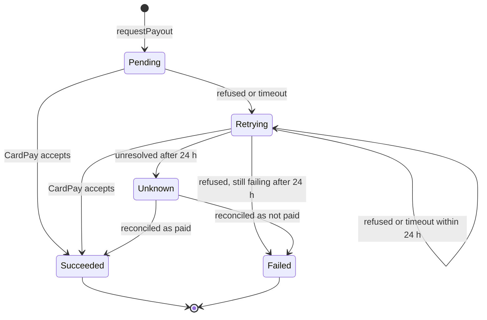
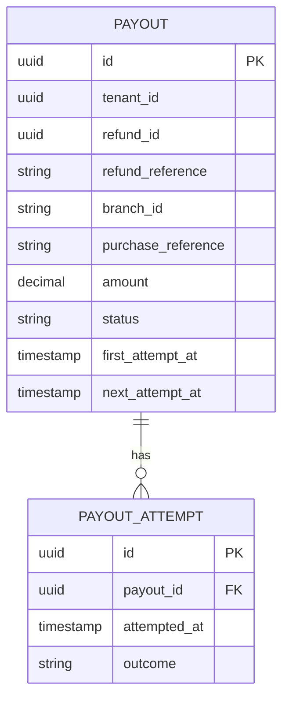
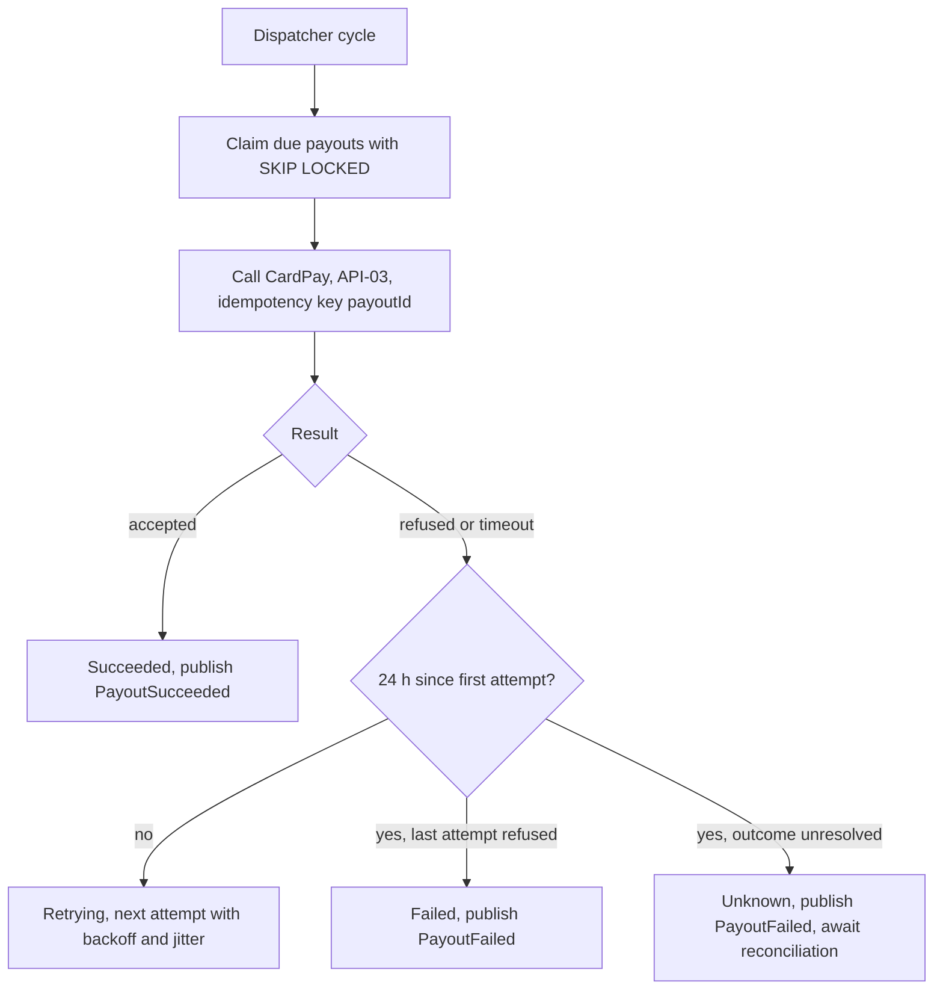

<!--
CHUNK: 13b
TITLE: Detailed Service Spec - payout
PROJECT: Refunds Platform
VERSION: 1.1
DEPENDS_ON: 09, 07, 10 (event hub - in-process event names and DTO fields must match chunk 10 §14.10 verbatim), 11 (API contracts - API-01 and API-03 match chunk 11 verbatim), 12 (roles - permission tokens match chunk 12 verbatim)
PART OF: SDD - Refunds Platform
-->

# 17. Detailed Service Specs

---

## 17.2 payout

### What

The `payout` module owns payout execution: it takes the payout instruction of an approved refund, sends it to CardPay to the customer's original card, retries failures, and reports the outcome. It owns no BRD use case; it realises the payout steps of [REFUNDS/UC-04](../brd-refunds-portal/06b-use-cases-branch-manager.md#uc-04-approve--reject-refund) (steps 6-7 and E1) for the `refund` module.

### Boundaries

- **Owns:** the `Payout` aggregate and its attempts, the payout dispatcher, the CardPay adapter.
- **Does not own:** refund requests, decisions, or statuses (`refund`); customer or manager messages (`notification`).
- **Upstream consumers:** `refund` through `PayoutPort` (API-01); `refund` and `notification` listen to its in-process events.
- **Downstream dependencies:** CardPay (API-03).

### Input

| Type | Source | Description |
|------|--------|-------------|
| Port call | `refund` | `PayoutPort.requestPayout` (API-01): payout instruction inside the approval transaction |
| Schedule | Payout dispatcher | Claims due payouts and sends them to CardPay |

### Business Logic

Responsibility: pay each approved refund exactly once to the original card, or report that it could not.

- **Request** (API-01, §15.3): implements the port contract and stores a Pending payout with `nextAttemptAt` now, in the caller's transaction; no provider call happens inside the port.
- **Dispatch** ([REFUNDS/UC-04](../brd-refunds-portal/06b-use-cases-branch-manager.md#uc-04-approve--reject-refund) step 6): the dispatcher in each replica claims due payouts (Pending or Retrying with `nextAttemptAt` reached) with `FOR UPDATE SKIP LOCKED`, calls CardPay through API-03 with the payout ID as idempotency key, and logs the attempt.
- **Success** ([REFUNDS/UC-04](../brd-refunds-portal/06b-use-cases-branch-manager.md#uc-04-approve--reject-refund) step 7): the payout moves to Succeeded and `PayoutSucceeded` is published in the same transaction; `refund` then marks the request Paid.
- **Failure** ([REFUNDS/UC-04](../brd-refunds-portal/06b-use-cases-branch-manager.md#uc-04-approve--reject-refund) E1, AC-2: branch manager told after one day): a refusal or a timeout moves the payout to Retrying with exponential backoff and jitter; a call skipped by the open circuit breaker counts as a failed attempt, so the clock of [REFUNDS/UC-04](../brd-refunds-portal/06b-use-cases-branch-manager.md#uc-04-approve--reject-refund) E1 runs during an outage. Once 24 hours have passed since the first attempt, a payout whose last attempt was refused moves to Failed; one whose last attempt timed out or failed without a refusal has an unknown outcome and moves to Unknown, never to Failed. Both publish `PayoutFailed` with the reason in `lastFailureReason` (AC-2: the branch manager is told after one day); an Unknown payout is never retried or re-requested until reconciled; the refund request stays Approved. [NEEDS CLARIFICATION: dispatcher poll interval and backoff schedule (initial delay, maximum interval).]
- **Unknown outcome:** after a timeout the retry reuses the same idempotency key, so CardPay cannot pay twice (REFUNDS/NFR-01, R-01); this relies on CardPay's idempotency support (API-03).
- **After Failed:** [NEEDS CLARIFICATION: after the one-day alert, may anyone retry or cancel the payout, and through which use case? [REFUNDS/UC-04](../brd-refunds-portal/06b-use-cases-branch-manager.md#uc-04-approve--reject-refund) E1 ends at telling the branch manager.]
- **Reconciliation** (REFUNDS/NFR-01): a daily job compares Succeeded, Failed, and Unknown payouts with CardPay's records and alerts on any payout CardPay paid that is not Succeeded and any Succeeded payout CardPay did not pay; a reconciled Unknown payout moves to Succeeded (publishing `PayoutSucceeded`) or to Failed. **[TBD - EXTERNAL: CardPay payout report or status query (API-03)]**
- **Completeness check** (REFUNDS/NFR-01): a gauge exposes the oldest payout not yet Succeeded, Failed, or Unknown; an alert fires when it is older than 24 hours plus one dispatcher cycle.

**State machine (if applicable):**

**Figure 15: payout - payout state machine**

**Summary:** A payout starts Pending, ends Succeeded when CardPay accepts it, or keeps retrying for up to 24 hours from the first attempt; it then ends Failed when the last attempt was refused, or waits in Unknown until the daily reconciliation with CardPay settles it as Succeeded or Failed.

### Output

| Type | Destination | Description |
|------|-------------|-------------|
| Port response | `refund` | `PayoutAccepted` (API-01) |
| In-process event | `refund` | `PayoutSucceeded` (§14.10) |
| In-process event | `notification` | `PayoutFailed` (§14.10) |
| Provider call | CardPay | Payout request (API-03) |

### Integrations

| Integration | Direction | Protocol | Purpose | Contract | Failure Handling |
|-------------|-----------|----------|---------|----------|------------------|
| `refund` | Inbound, sync (in-process) | Java port | Payout instruction on approval | API-01 (§15) | Errors raised to the caller roll back the approval |
| CardPay | Outbound, sync | HTTPS | Send the payout to the original card | API-03 (§15) | Retry with backoff for up to 24 h, circuit breaker and bulkhead per §12 INT-01 |
| `refund` | Outbound, async (in-process) | In-process event | Payout succeeded | `PayoutSucceeded` (§14.10) | Durable publication; listener retried while incomplete |
| `notification` | Outbound, async (in-process) | In-process event | Payout failed after 24 h | `PayoutFailed` (§14.10) | Durable publication; listener retried while incomplete |

### DB Modeling

#### Entity Relationship

**Figure 16: payout - entity relationship**

**Summary:** One payout per refund (`refund_id` unique per tenant) with its attempt log; `refund_id` is a plain reference to the `refund` module.

#### Tables Design

| Table | Column | Type | Constraints | Notes |
|-------|--------|------|-------------|-------|
| `payout` | `id` | uuid | PK | UUIDv7; the CardPay idempotency key |
| `payout` | `tenant_id` | uuid | not null | first in every index |
| `payout` | `refund_id` | uuid | not null; unique (`tenant_id`, `refund_id`) | one payout per refund |
| `payout` | `refund_reference`, `branch_id`, `purchase_reference` | varchar(20), varchar(32), varchar(64) | not null | from API-01 |
| `payout` | `currency`, `amount` | char(3), numeric(19,4) | amount > 0 | |
| `payout` | `status` | varchar(16) | not null; PENDING, RETRYING, SUCCEEDED, FAILED, UNKNOWN; index (`tenant_id`, `status`, `next_attempt_at`) | dispatcher claim index |
| `payout` | `first_attempt_at`, `next_attempt_at`, `attempt_count` | timestamptz, timestamptz, int | | 24 h clock starts at the first attempt |
| `payout` | `provider_reference`, `last_failure_reason` | varchar(64), varchar(500) | null | from CardPay |
| `payout` | `version` | bigint | not null | optimistic lock |
| `payout_attempt` | `id`, `tenant_id`, `payout_id` | uuid | PK; not null; index (`tenant_id`, `payout_id`, `attempted_at`) | |
| `payout_attempt` | `attempted_at`, `outcome`, `provider_status`, `duration_ms`, `provider_response` | timestamptz, varchar(16), varchar(32), int, jsonb | outcome: SUCCEEDED, REFUSED, TIMEOUT, ERROR | response without card data |

#### Migration Strategy

- **Tool:** Flyway, versioned SQL in the module's own location for schema `payout`.
- **Backward compatibility:** additive changes; expand-contract across two releases.
- **Data backfill:** separate idempotent migrations.
- **Rollback:** forward-fix; the previous image stays compatible with the expanded schema.

#### Retention Policy

- `payout`, `payout_attempt`: [NEEDS CLARIFICATION: retention period for payout records and attempt logs (financial records).]

#### Archival

- **Cold storage:** [NEEDS CLARIFICATION: archival target for closed payouts, if any.]
- **Format:** depends on the target above.
- **Schedule:** depends on the retention period above.
- **Restore SLA:** depends on the target above.

#### Data Encryption

- **At rest:** database storage encryption; the module stores no card data and no contact data.
- **In transit:** TLS to PostgreSQL and to CardPay.
- **Key management:** CardPay credentials in the secrets manager (§6).
- **PII columns:** none.

### Multi-Tenancy Specifications

- **Strategy override:** none (ADR-03).
- **Tenant filter:** repository filter and row-level security; the dispatcher runs per tenant (§11.2) and calls CardPay with that tenant's credentials.
- **Cross-tenant queries:** None; background work runs per tenant (§11.2).

### API Standards

- **Style:** no REST endpoint; the inbound surface is the in-process port `PayoutPort` (API-01).
- **Versioning:** the port and its DTOs live in the module `api` package and change additively.
- **Authentication:** the caller's principal travels in the call context (§15.1).
- **Idempotency:** per API-01 (§15.3); CardPay calls carry the payout ID (ADR-09).
- **Pagination:** not applicable.
- **Error envelope:** typed errors carrying the §15.1 `errorCode`.

#### List of APIs (Swagger-friendly)

Not applicable: the module exposes no REST endpoint. Its port operation `PayoutPort.requestPayout` is contract API-01 (§15).

### Event-Driven Architecture (If Applicable)

#### Event Model

**Published events:**

None: no integration events in this release (ADR-02).

**Consumed events:**

None: no integration events in this release (ADR-02).

**In-process domain events (modules only):**

| Event | Publisher module | Listener modules | Transaction phase (before commit / after commit) | Payload (DTO) | Notes |
|---|---|---|---|---|---|
| `PayoutSucceeded` | payout | refund | after commit | `PayoutSucceededEvent`: `payoutId`, `refundId`, `amount`, `providerReference`, `succeededAt` | published here |
| `PayoutFailed` | payout | notification | after commit | `PayoutFailedEvent`: `payoutId`, `refundId`, `refundReference`, `branchId`, `amount`, `firstAttemptAt`, `lastFailureReason` | published here |

#### Messaging Infra

Not applicable - no integration events.

### Constraints

- **Authorization:** `PayoutPort.requestPayout` checks `payout.payout.request` (role `BRANCH_MANAGER`, own branch only, [REFUNDS 07 § Users & Use Cases Matrix](../brd-refunds-portal/07-users-use-cases-matrix.md#users--use-cases-matrix) footnote ¹) against the call context of the approving manager.
- **Original card only:** payouts go only to the card used for the purchase ([REFUNDS 02 § Assumptions / Constraints](../brd-refunds-portal/02-glossary-assumptions-facts.md#assumptions--constraints) 2); the module never accepts another destination.
- **One payout per refund:** enforced by the unique `refund_id` and by idempotent API-01.
- **No user-facing waits:** CardPay is called only by the dispatcher (ADR-09).

### Error Handling

- **Port errors:** the API-01 errors (§15.3); [REFUNDS/UC-04](../brd-refunds-portal/06b-use-cases-branch-manager.md#uc-04-approve--reject-refund) E1 is a state (Retrying, then Failed or Unknown), not an error to the caller.
- **Server errors:** provider errors are mapped per API-03 and counted as failed attempts; the circuit breaker opens on repeated failures and the dispatcher skips CardPay until it half-opens.
- **Async consumers:** none consumed; the dispatcher and the daily reconciliation job are the only background actors.
- **Poison messages:** a payout whose attempts keep failing ends Failed or Unknown after 24 hours and raises `PayoutFailed`; it is never dropped.

### Observability & Monitoring

#### Logging

- JSON per §11.4, with `module=payout`.
- Payout ID, refund reference, status, attempt outcome at INFO; no card or contact data.
- Retention per the central log store (§6).

#### Metrics

| Metric | Type | Labels | Purpose |
|--------|------|--------|---------|
| `payout_attempts_total` | counter | `outcome` | Success, refusal, and timeout rate of CardPay |
| `payout_oldest_open_seconds` | gauge | - | Age of the oldest payout not Succeeded, Failed, or Unknown (REFUNDS/NFR-01 alert) |
| `payout_failed_total` | counter | - | Payouts that ended Failed or Unknown after 24 h |
| `payout_reconciliation_mismatches_total` | counter | - | Daily reconciliation differences with CardPay's records (REFUNDS/NFR-01) |
| `payout_cardpay_seconds` | histogram | `outcome` | API-03 latency |

#### Tracing

- Spans for API-01, each dispatcher claim, and each CardPay call.
- The trace context of the approval is stored with the payout and linked from the dispatch span.
- Sampling per §11.4.

### Developer Notes

- **Recommended patterns:** dispatch table with `FOR UPDATE SKIP LOCKED`; Resilience4j timeout, retry, circuit breaker, and bulkhead around the CardPay adapter; the payout ID as the only idempotency key.
- **Avoid:** calling CardPay from the port or in the approval transaction; generating a new idempotency key on retry; reading the `refund` schema.
- **Testing:** unit tests for the state machine and the 24-hour rule with a fixed clock; Testcontainers PostgreSQL tests for concurrent dispatch claims across two dispatcher instances; a stubbed CardPay adapter for refusals, timeouts, and duplicates.

### Service-Level Diagrams

#### Implementation Flow Chart

**Figure 17: payout - dispatcher cycle**

**Summary:** Each cycle claims due payouts without blocking other replicas, sends them with the payout ID as idempotency key, and records success, a retry with backoff, or, after 24 hours, Failed for a refusal or Unknown for an unresolved outcome.

#### Sequence Diagram (Service-Internal)

Not drawn here: the module's interactions are shown in §8.5.2 (chunk 05).

### Compliance

- **GDPR:** not applicable: the module stores no personal data.
- **PCI-DSS:** not applicable while CardPay pays to the original card without the platform handling card data. [NEEDS CLARIFICATION: confirm that the CardPay payout needs no cardholder data from the platform (API-03).]
- **ISO 27001 / SOC 2:** per §11.6.
- **Local regulations:** [NEEDS CLARIFICATION: payment record-keeping rules that apply to the retailer.]

### Deployment Strategy

- **Service-specific override:** none; part of the one deployable (§11.3).
- **Replicas:** those of the deployable; the dispatcher runs in every replica.
- **Strategy:** rolling update; a dispatcher stops claiming on shutdown and finishes its in-flight attempt.
- **Health checks:** readiness includes the database connection; CardPay availability is not a readiness condition (the circuit breaker handles it).
- **Rollback:** Helm rollback; payout rows are compatible across one release.

### Future Enhancements

- Receive payout results by CardPay callback, if CardPay supports it (API-03), instead of waiting for the synchronous result.

<!-- MASTER: refunds-platform-sdd-master.md | PREV: 13a-service-refund.md | NEXT: 13c-service-notification.md -->
