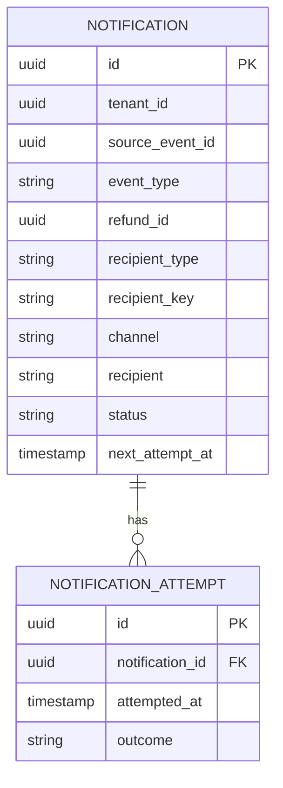
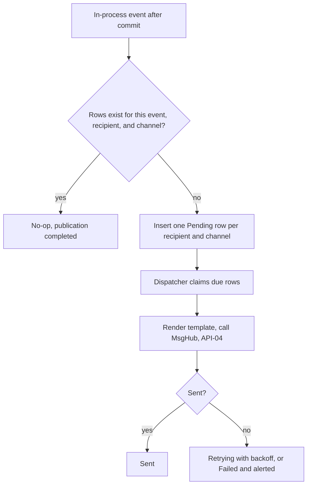

<!--
CHUNK: 13c
TITLE: Detailed Service Spec - notification
PROJECT: Refunds Platform
VERSION: 1.1
DEPENDS_ON: 09, 07, 10 (event hub - in-process event names and DTO fields must match chunk 10 §14.10 verbatim), 11 (API contracts - API-04 matches chunk 11 verbatim), 12 (roles)
PART OF: SDD - Refunds Platform
-->

# 17. Detailed Service Specs

---

## 17.3 notification

### What

The `notification` module owns outbound messages: it turns refund and payout facts into email and SMS messages and delivers them through MsgHub. It owns no BRD use case; it realises the "customer is told" steps of [REFUNDS/UC-01](../brd-refunds-portal/06a-use-cases-customer.md#uc-01-request-a-refund), [REFUNDS/UC-03](../brd-refunds-portal/06a-use-cases-customer.md#uc-03-cancel-a-refund-request), and [REFUNDS/UC-04](../brd-refunds-portal/06b-use-cases-branch-manager.md#uc-04-approve--reject-refund) and the branch manager alert of [REFUNDS/UC-04](../brd-refunds-portal/06b-use-cases-branch-manager.md#uc-04-approve--reject-refund) E1.

### Boundaries

- **Owns:** `Notification` records (one per event and channel), message templates, the notification dispatcher, the MsgHub adapter.
- **Does not own:** refund or payout state; customer contact data at rest beyond the message it sends (the contact arrives in the event DTO).
- **Upstream consumers:** none; the module has no REST endpoint and no port.
- **Downstream dependencies:** MsgHub (API-04); in-process events from `refund` and `payout`.

### Input

| Type | Source | Description |
|------|--------|-------------|
| In-process event | `refund` | `RefundSubmitted`, `RefundCancelled`, `RefundRejected`, `RefundPaid` |
| In-process event | `payout` | `PayoutFailed` |
| Schedule | Notification dispatcher | Claims due messages and sends them to MsgHub |

### Business Logic

Responsibility: tell the customer at each step and alert the branch manager when a payout keeps failing, without ever delaying a refund.

- `RefundSubmitted` -> email and SMS with the reference number ([REFUNDS/UC-01](../brd-refunds-portal/06a-use-cases-customer.md#uc-01-request-a-refund) step 6).
- `RefundCancelled` -> email ([REFUNDS/UC-03](../brd-refunds-portal/06a-use-cases-customer.md#uc-03-cancel-a-refund-request) step 5).
- `RefundRejected` -> email and SMS with the rejection reason ([REFUNDS/UC-04](../brd-refunds-portal/06b-use-cases-branch-manager.md#uc-04-approve--reject-refund) A2; channels per §3 assumption 4).
- `RefundPaid` -> email and SMS with the paid amount ([REFUNDS/UC-04](../brd-refunds-portal/06b-use-cases-branch-manager.md#uc-04-approve--reject-refund) step 7, AC-1: the customer is told).
- `PayoutFailed` -> alert to the managers of the request's branch ([REFUNDS/UC-04](../brd-refunds-portal/06b-use-cases-branch-manager.md#uc-04-approve--reject-refund) E1, AC-2: the branch manager is told). [NEEDS CLARIFICATION: channel of the branch manager alert and the source of the managers' contact details for a branch.]
- **Idempotent listener:** each event creates one row per recipient and channel, unique on (`tenant_id`, `source_event_id`, `channel`, `recipient_key`), so a redelivered event creates nothing new. An SMS row is skipped when the contact has no mobile number.
- **Dispatch:** the dispatcher claims due rows with `FOR UPDATE SKIP LOCKED`, renders the template in the customer's locale (tenant locale by default), formats amounts with their currency ([REFUNDS 11 § UI/UX Expectations](../brd-refunds-portal/11-summary-and-uiux.md#uiux-expectations)), and calls MsgHub through API-04 with the notification ID as idempotency key.
- **Retries:** failures retry with exponential backoff and jitter; a message that exhausts its retries is marked Failed and alerted; refund state never depends on it. [NEEDS CLARIFICATION: maximum attempts or age before a message is marked Failed.]

**State machine (if applicable):** a message moves Pending -> Sent, or Pending -> Retrying -> Sent or Failed; too small to draw.

### Output

| Type | Destination | Description |
|------|-------------|-------------|
| Provider call | MsgHub | Email or SMS send request (API-04) |

### Integrations

| Integration | Direction | Protocol | Purpose | Contract | Failure Handling |
|-------------|-----------|----------|---------|----------|------------------|
| `refund` | Inbound, async (in-process) | In-process event | Refund lifecycle facts | `RefundSubmitted`, `RefundCancelled`, `RefundRejected`, `RefundPaid` (§14.10) | Listener retried from the publication log while incomplete |
| `payout` | Inbound, async (in-process) | In-process event | Payout failed after 24 h | `PayoutFailed` (§14.10) | Listener retried from the publication log while incomplete |
| MsgHub | Outbound, sync | HTTPS | Send email and SMS | API-04 (§15) | Retry with backoff, circuit breaker and bulkhead per §12 INT-02 |

### DB Modeling

#### Entity Relationship

**Figure 18: notification - entity relationship**

**Summary:** One notification per source event and channel, with its delivery attempts; `refund_id` is a plain reference used for support lookups.

#### Tables Design

| Table | Column | Type | Constraints | Notes |
|-------|--------|------|-------------|-------|
| `notification` | `id` | uuid | PK | UUIDv7; the MsgHub idempotency key |
| `notification` | `tenant_id` | uuid | not null | first in every index |
| `notification` | `source_event_id`, `event_type`, `channel` | uuid, varchar(32), varchar(8) | not null; channel EMAIL or SMS | listener idempotency |
| `notification` | `recipient_key` | varchar(64) | not null; unique (`tenant_id`, `source_event_id`, `channel`, `recipient_key`) | the customer ID for customer messages, the manager's user ID for branch manager alerts |
| `notification` | `refund_id`, `recipient_type` | uuid, varchar(16) | not null; recipient_type CUSTOMER or BRANCH_MANAGER | |
| `notification` | `recipient`, `template_key`, `locale` | varchar(254), varchar(64), varchar(10) | not null | recipient is pii, column-encrypted |
| `notification` | `status`, `attempt_count`, `next_attempt_at` | varchar(16), int, timestamptz | PENDING, RETRYING, SENT, FAILED; index (`tenant_id`, `status`, `next_attempt_at`) | dispatcher claim index |
| `notification` | `provider_message_id`, `last_error`, `sent_at` | varchar(64), varchar(500), timestamptz | null | |
| `notification_attempt` | `id`, `tenant_id`, `notification_id`, `attempted_at`, `outcome`, `provider_status` | uuid, uuid, uuid, timestamptz, varchar(16), varchar(32) | PK; index (`tenant_id`, `notification_id`) | |

#### Migration Strategy

- **Tool:** Flyway, versioned SQL in the module's own location for schema `notification`.
- **Backward compatibility:** additive changes; expand-contract across two releases.
- **Data backfill:** separate idempotent migrations.
- **Rollback:** forward-fix.

#### Retention Policy

- `notification`, `notification_attempt`: [NEEDS CLARIFICATION: retention period for message records and recipients.]

#### Archival

- **Cold storage:** none planned; records are deleted at the end of retention.
- **Format:** not applicable.
- **Schedule:** a daily purge job once the retention period is set.
- **Restore SLA:** not applicable.

#### Data Encryption

- **At rest:** database storage encryption plus column-level encryption of `recipient`.
- **In transit:** TLS to PostgreSQL and MsgHub.
- **Key management:** keys and MsgHub credentials in the secrets manager (§6).
- **PII columns:** `recipient`; synthetic values in non-production data.

### Multi-Tenancy Specifications

- **Strategy override:** none (ADR-03).
- **Tenant filter:** repository filter and row-level security; the dispatcher runs per tenant (§11.2) and uses that tenant's MsgHub credentials and templates.
- **Cross-tenant queries:** None; background work runs per tenant (§11.2).

### API Standards

- **Style:** no REST endpoint and no port; the module is driven by in-process events.
- **Versioning:** not applicable.
- **Authentication:** not applicable; listeners run with the system principal and the tenant from the event.
- **Idempotency:** listener dedup on (`source_event_id`, `channel`, `recipient_key`); MsgHub calls carry the notification ID.
- **Pagination:** not applicable.
- **Error envelope:** not applicable (no API).

#### List of APIs (Swagger-friendly)

Not applicable: the module exposes no REST endpoint and no port.

### Event-Driven Architecture (If Applicable)

#### Event Model

**Published events:**

None: no integration events in this release (ADR-02); the module publishes no in-process event either.

**Consumed events:**

None: no integration events in this release (ADR-02).

**In-process domain events (modules only):**

| Event | Publisher module | Listener modules | Transaction phase (before commit / after commit) | Payload (DTO) | Notes |
|---|---|---|---|---|---|
| `RefundSubmitted` | refund | notification | after commit | `RefundSubmittedEvent`: `refundId`, `referenceNumber`, `customerId`, `contact`, `branchId`, `requestedAmount` | handled here: email and SMS |
| `RefundCancelled` | refund | notification | after commit | `RefundCancelledEvent`: `refundId`, `referenceNumber`, `customerId`, `contact` | handled here: email |
| `RefundRejected` | refund | notification | after commit | `RefundRejectedEvent`: `refundId`, `referenceNumber`, `customerId`, `contact`, `rejectionReason` | handled here: email and SMS |
| `RefundPaid` | refund | notification, loyalty | after commit | `RefundPaidEvent`: `refundId`, `referenceNumber`, `customerId`, `contact`, `purchaseReference`, `paidAmount`, `paidAt` | handled here: email and SMS |
| `PayoutFailed` | payout | notification | after commit | `PayoutFailedEvent`: `payoutId`, `refundId`, `refundReference`, `branchId`, `amount`, `firstAttemptAt`, `lastFailureReason` | handled here: branch manager alert |

#### Messaging Infra

Not applicable - no integration events.

### Constraints

- **Authorization:** no permission token: the module has no inbound API or port, and its listeners run with the system principal.
- **Content:** messages carry the reference number, amounts with currency, and the rejection reason; never card data.
- **Channels:** per §3 assumption 4 where a use case does not name one.

### Error Handling

- **Synchronous APIs:** not applicable.
- **Validation errors:** an event without a usable recipient (no email, and no mobile for SMS) is recorded as Failed with the reason and alerted.
- **Domain errors:** none.
- **Auth errors:** a MsgHub authentication failure opens the circuit breaker and alerts; messages stay pending.
- **Server errors:** MsgHub errors are mapped per API-04 and retried.
- **Async consumers:** listeners are idempotent on (`source_event_id`, `channel`, `recipient_key`) and only insert rows, so they rarely fail; a failing listener is retried from the publication log.
- **Poison messages:** a message that exhausts its retries is marked Failed and alerted, never dropped silently.

### Observability & Monitoring

#### Logging

- JSON per §11.4, with `module=notification`.
- Notification ID, event type, channel, status at INFO; recipient and message body never logged.
- Retention per the central log store (§6).

#### Metrics

| Metric | Type | Labels | Purpose |
|--------|------|--------|---------|
| `notification_messages_total` | counter | `channel`, `status` | Delivery volume and failures |
| `notification_oldest_pending_seconds` | gauge | `channel` | Backlog age, for MsgHub outages |
| `notification_msghub_seconds` | histogram | `channel`, `outcome` | API-04 latency |

#### Tracing

- Spans for each listener run and each MsgHub call, linked to the trace of the source event.
- Sampling per §11.4.

### Developer Notes

- **Recommended patterns:** insert-only idempotent listeners; dispatch table with `FOR UPDATE SKIP LOCKED`; Resilience4j around the MsgHub adapter; templates per message type and locale.
- **Avoid:** calling MsgHub inside a listener; reading the `refund` schema for contact data; logging recipients.
- **Testing:** unit tests for the event-to-channel mapping; Testcontainers PostgreSQL tests for duplicate events and concurrent dispatchers; a stubbed MsgHub adapter.

### Service-Level Diagrams

#### Implementation Flow Chart

**Figure 19: notification - event to message**

**Summary:** A listener only records the messages an event needs, ignoring a redelivered event; the dispatcher renders and sends them through MsgHub and retries failures until they are sent or marked Failed.

#### Sequence Diagram (Service-Internal)

Not drawn here: the module's interactions are shown in §8.5.1, §8.5.2, and §8.5.3 (chunk 05).

### Compliance

- **GDPR:** recipients (email, mobile) are personal data used only to send refund messages. [NEEDS CLARIFICATION: retention window and erasure flow for message records.]
- **PCI-DSS:** not applicable: no card data.
- **ISO 27001 / SOC 2:** per §11.6.
- **Local regulations:** [NEEDS CLARIFICATION: consent or opt-out rules for transactional SMS and email.]

### Deployment Strategy

- **Service-specific override:** none; part of the one deployable (§11.3).
- **Replicas:** those of the deployable; the dispatcher runs in every replica.
- **Strategy:** rolling update; a dispatcher stops claiming on shutdown.
- **Health checks:** readiness includes the database connection; MsgHub availability is not a readiness condition.
- **Rollback:** Helm rollback.

### Future Enhancements

- Push notifications in the mobile app ([REFUNDS/UC-02](../brd-refunds-portal/06a-use-cases-customer.md#uc-02-track-refund-status-web-and-mobile) Future Enhancements), as a third channel.

<!-- MASTER: refunds-platform-sdd-master.md | PREV: 13b-service-payout.md | NEXT: 13d-service-loyalty.md -->
