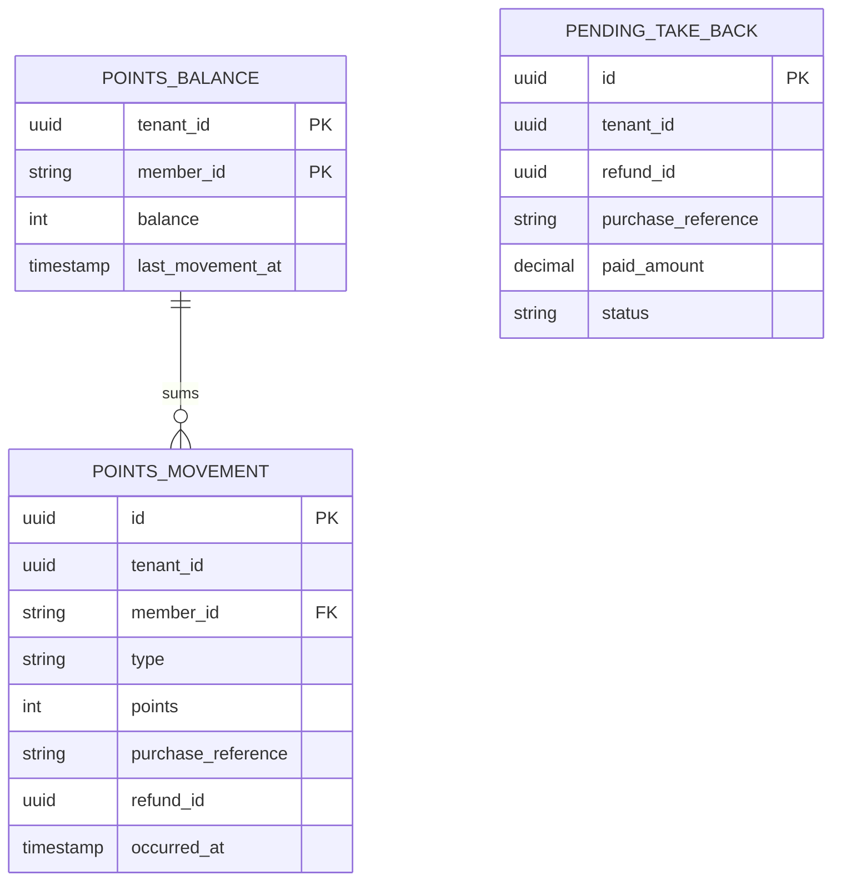
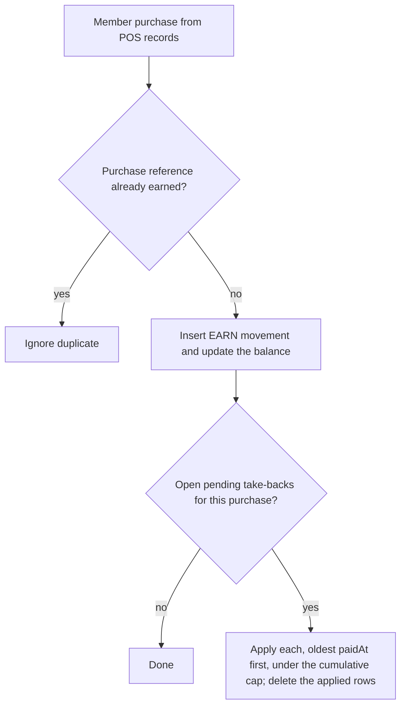

<!--
CHUNK: 13d
TITLE: Detailed Service Spec - loyalty
PROJECT: Refunds Platform
VERSION: 1.1
DEPENDS_ON: 09, 07, 10 (event hub - in-process event names and DTO fields must match chunk 10 §14.10 verbatim), 11 (API contracts), 12 (roles - permission tokens match chunk 12 verbatim)
PART OF: SDD - Refunds Platform
-->

# 17. Detailed Service Specs

---

## 17.4 loyalty

### What

The `loyalty` module owns the points ledger: points earned on member purchases, points taken back when a purchase is refunded, and each member's balance and history ([LOYALTY 03 § Points movement](../brd-loyalty-points/03-definitions-and-domain-concepts.md#points-movement)).

### Boundaries

- **Owns:** `PointsMovement` (append-only), `PointsBalance` (per member), `PendingTakeBack`, the POS purchase intake adapter.
- **Does not own:** refunds (`refund`), purchases (POS records), member identities and enrolment (Keycloak, §3 assumption 2).
- **Upstream consumers:** the member web screens through the gateway.
- **Downstream dependencies:** POS records (member purchase intake); `refund` (`RefundPaid` event).

### Input

| Type | Source | Description |
|------|--------|-------------|
| REST | Member web app | Balance, history, movement detail (List of APIs) |
| Purchase intake | POS Records | Member purchases that earn points (mode open, §12 INT-03) |
| In-process event | `refund` | `RefundPaid`: take back the points of the refunded purchase |

### Business Logic

Responsibility: keep every member's balance equal to the sum of their movements and show where each point comes from.

- **Balance** ([LOYALTY/UC-01](../brd-loyalty-points/06a-use-cases-member.md#uc-01-view-points-balance) steps 1-2, A1, BR-1: members see only their own points): reads `points_balance` for the `member_id` claim and returns the balance and the date of the last movement; with no row it returns 0 and the client explains how points are earned.
- **History** ([LOYALTY/UC-02](../brd-loyalty-points/06a-use-cases-member.md#uc-02-view-points-history) steps 1-4, BR-2: members see only their own points): lists the member's movements newest first (date, purchase or refund reference, signed points), cursor-paged; one movement returns the purchase or refund it came from (reference, date, amount) from the ledger's own columns, with no call to another module.
- **Earn** (no use case; feeds the two above): one `EARN` movement per member purchase from POS records, at 1 point per 1 EUR spent ([LOYALTY 02 § Glossary](../brd-loyalty-points/02-glossary-assumptions-facts.md#glossary)); idempotent on (`tenant_id`, `purchase_reference`). [NEEDS CLARIFICATION: rounding of amounts with cents, for example 12.50 EUR; points are whole numbers per LOYALTY 11.]
- **Take-back** ([LOYALTY/UC-02](../brd-loyalty-points/06a-use-cases-member.md#uc-02-view-points-history) BR-1: points taken back when the purchase is refunded, A1: negative movement with the refund reference): the `RefundPaid` listener finds the `EARN` movement by `purchaseReference` and records a `TAKE_BACK` movement with negative points and the refund reference, idempotent on (`tenant_id`, `refund_id`), capped so that all take-backs of one purchase together never exceed its earned points: the listener records at most the earned points minus the points already taken back for that `purchaseReference`, and records nothing when the remainder is zero. [NEEDS CLARIFICATION: for a refund of some items or a lower amount, take back all points of the purchase or the points for `paidAmount` (§5 Glossary, R-04)?]
- **Pending take-back:** when no `EARN` movement exists yet (R-05), the listener stores a `PendingTakeBack`; the earn step applies every pending take-back of the purchase, oldest `paidAt` first, under the same cap. Most pending take-backs are refunds of non-member purchases, which never earn. [NEEDS CLARIFICATION: how long a pending take-back waits before it is reported as unmatched.] A pending take-back older than that wait moves to EXPIRED: kept for audit, never applied, no longer counted by `loyalty_pending_take_backs`; a purchase arriving after expiry earns normally and increments `loyalty_late_purchase_after_expiry_total`.
- **Timeliness** (LOYALTY/NFR-02: within 1 hour of the refund being paid): the listener runs right after the `RefundPaid` commit; the lag is measured from `paidAt`.
- **Balance integrity** (LOYALTY/NFR-01): each movement updates `points_balance` in the same transaction; a nightly job compares every balance with the sum of its movements and alerts on any difference.

**State machine (if applicable):** not applicable: movements are immutable facts; only `PendingTakeBack` has a lifecycle (stored, then applied and deleted, or expired).

### Output

| Type | Destination | Description |
|------|-------------|-------------|
| REST response | Member web app | Balance, movements, movement detail |

### Integrations

| Integration | Direction | Protocol | Purpose | Contract | Failure Handling |
|-------------|-----------|----------|---------|----------|------------------|
| POS Records | Inbound | Mode open (§12 INT-03) | Member purchases that earn points | Not yet defined: the intake mode decides whether a contract is needed | Idempotent on the purchase reference; late purchases apply pending take-backs |
| `refund` | Inbound, async (in-process) | In-process event | Refund paid | `RefundPaid` (§14.10) | Listener retried from the publication log while incomplete |

### DB Modeling

#### Entity Relationship

**Figure 20: loyalty - entity relationship**

**Summary:** A member's balance row sums their movements; earn and take-back movements both reference the purchase, and a pending take-back waits for a purchase that has not arrived yet.

#### Tables Design

| Table | Column | Type | Constraints | Notes |
|-------|--------|------|-------------|-------|
| `points_movement` | `id` | uuid | PK | UUIDv7 |
| `points_movement` | `tenant_id`, `member_id` | uuid, varchar(32) | not null; index (`tenant_id`, `member_id`, `occurred_at` desc) | member ID from POS records |
| `points_movement` | `type`, `points` | varchar(16), int | EARN (points > 0) or TAKE_BACK (points < 0) | whole numbers |
| `points_movement` | `purchase_reference`, `purchase_amount`, `currency` | varchar(64), numeric(19,4), char(3) | not null; unique (`tenant_id`, `purchase_reference`) where type = EARN | |
| `points_movement` | `refund_id`, `refund_reference`, `paid_amount` | uuid, varchar(20), numeric(19,4) | TAKE_BACK only; unique (`tenant_id`, `refund_id`) where type = TAKE_BACK | |
| `points_movement` | `occurred_at` | timestamptz | not null | purchase time or `paidAt` |
| `points_balance` | `tenant_id`, `member_id` | uuid, varchar(32) | PK (`tenant_id`, `member_id`) | |
| `points_balance` | `balance`, `last_movement_at`, `version` | int, timestamptz, bigint | balance >= 0 | projection of the movements |
| `pending_take_back` | `id`, `tenant_id`, `refund_id` | uuid | PK; unique (`tenant_id`, `refund_id`) | |
| `pending_take_back` | `purchase_reference`, `refund_reference`, `paid_amount`, `currency`, `paid_at` | varchar(64), varchar(20), numeric(19,4), char(3), timestamptz | index (`tenant_id`, `purchase_reference`) | matched by the earn step |
| `pending_take_back` | `status` | varchar(8) | not null; OPEN or EXPIRED | EXPIRED rows are kept for audit and never applied |

#### Migration Strategy

- **Tool:** Flyway, versioned SQL in the module's own location for schema `loyalty`.
- **Backward compatibility:** additive changes; expand-contract across two releases.
- **Data backfill:** a backfill of historical member purchases, if wanted, is a separate idempotent migration job.
- **Rollback:** forward-fix.

#### Retention Policy

- `points_movement`, `points_balance`: [NEEDS CLARIFICATION: retention period for the points ledger.]
- `pending_take_back`: deleted when applied; EXPIRED rows follow the ledger retention above.

#### Archival

- **Cold storage:** [NEEDS CLARIFICATION: archival of old movements, if any; the balance must stay equal to the sum of retained movements plus an opening balance.]
- **Format:** depends on the target above.
- **Schedule:** depends on the retention period above.
- **Restore SLA:** depends on the target above.

#### Data Encryption

- **At rest:** database storage encryption; the ledger holds member IDs and purchase references, no contact data.
- **In transit:** TLS to PostgreSQL and POS records.
- **Key management:** POS intake credentials in the secrets manager (§6).
- **PII columns:** `member_id` is a pseudonymous identifier; masked in non-production data.

### Multi-Tenancy Specifications

- **Strategy override:** none (ADR-03).
- **Tenant filter:** repository filter and row-level security; the listener and the intake set the tenant from the DTO or the purchase record.
- **Cross-tenant queries:** None; background work runs per tenant (§11.2).

### API Standards

- **Style:** REST, JSON (ADR-04).
- **Versioning:** URI prefix `/v1`.
- **Authentication:** Keycloak JWT with the `member_id` claim (ADR-07).
- **Idempotency:** read-only endpoints; the listener and the intake are idempotent (above).
- **Pagination:** cursor-based, newest first.
- **Error envelope:** Problem Details per the §15.1 error model.

#### List of APIs (Swagger-friendly)

| Method | Path | Summary | Request Body | Response | Permission token (§16) | API ID (§15) |
|--------|------|---------|--------------|----------|------------------------|--------------|
| GET | `/v1/members/me/points` | Current balance and date of the last movement | - | `PointsBalance` | `loyalty.balance.read` | - |
| GET | `/v1/members/me/points-movements` | Movements, newest first | - | `PointsMovementPage` | `loyalty.movement.read` | - |
| GET | `/v1/members/me/points-movements/{movementId}` | One movement with its purchase or refund | - | `PointsMovementDetail` | `loyalty.movement.read` | - |

### Event-Driven Architecture (If Applicable)

#### Event Model

**Published events:**

None: no integration events in this release (ADR-02); the module publishes no in-process event either.

**Consumed events:**

None: no integration events in this release (ADR-02).

**In-process domain events (modules only):**

| Event | Publisher module | Listener modules | Transaction phase (before commit / after commit) | Payload (DTO) | Notes |
|---|---|---|---|---|---|
| `RefundPaid` | refund | notification, loyalty | after commit | `RefundPaidEvent`: `refundId`, `referenceNumber`, `customerId`, `contact`, `purchaseReference`, `paidAmount`, `paidAt` | handled here: take-back by `purchaseReference`, idempotent on `refundId` |

#### Messaging Infra

Not applicable - no integration events.

### Constraints

- **Authorization, [LOYALTY/UC-01](../brd-loyalty-points/06a-use-cases-member.md#uc-01-view-points-balance) and [LOYALTY/UC-02](../brd-loyalty-points/06a-use-cases-member.md#uc-02-view-points-history):** role `MEMBER`, own points only ([LOYALTY 07 § Users & Use Cases Matrix](../brd-loyalty-points/07-users-use-cases-matrix.md#users--use-cases-matrix) footnote (1)); tokens `loyalty.balance.read`, `loyalty.movement.read`; every query is bound to the `member_id` claim, never to a path parameter.
- **Display:** points are whole numbers and negative movements carry a minus sign ([LOYALTY 11 § UI/UX Expectations](../brd-loyalty-points/11-summary-and-uiux.md#uiux-expectations)).
- **Ledger:** movements are never updated or deleted; a correction is a new movement.

### Error Handling

- **Synchronous APIs:** Problem Details (§15.1).
- **Validation errors:** 400 `VALIDATION_FAILED` for a malformed cursor or movement ID.
- **Domain errors:** a balance with no movements is 0, not an error ([LOYALTY/UC-01](../brd-loyalty-points/06a-use-cases-member.md#uc-01-view-points-balance) A1).
- **Auth errors:** 401 `UNAUTHENTICATED`; a signed-in user without a `member_id` claim -> 403 `FORBIDDEN`; a movement of another member -> 404 `NOT_FOUND`.
- **Server errors:** 500 `INTERNAL_ERROR`.
- **Async consumers:** the `RefundPaid` listener is idempotent on `refundId`; an unmatched purchase becomes a pending take-back, not an error.
- **Poison messages:** a `RefundPaid` that cannot be processed (for example, a currency mismatch) is logged at ERROR and alerted, and its publication stays incomplete for the §20 procedure.

### Observability & Monitoring

#### Logging

- JSON per §11.4, with `module=loyalty`.
- Movement ID, type, purchase or refund reference at INFO; `member_id` only at DEBUG.
- Retention per the central log store (§6).

#### Metrics

| Metric | Type | Labels | Purpose |
|--------|------|--------|---------|
| `loyalty_take_back_lag_seconds` | histogram | - | `paidAt` to take-back movement (LOYALTY/NFR-02 SLO) |
| `loyalty_pending_take_backs` | gauge | - | Open pending take-backs (R-05) |
| `loyalty_late_purchase_after_expiry_total` | counter | - | Member purchases that arrived after their pending take-back expired |
| `loyalty_balance_mismatch_total` | counter | - | Nightly integrity check failures (LOYALTY/NFR-01) |
| `loyalty_purchases_ingested_total` | counter | `outcome` | Purchase intake volume and duplicates |

#### Tracing

- Spans for REST requests, the `RefundPaid` listener, and each intake batch or call.
- Sampling per §11.4.

### Developer Notes

- **Recommended patterns:** append-only ledger with a transactional balance projection; idempotency through unique constraints; the POS intake behind a port so its mode can change without touching the domain.
- **Avoid:** recomputing balances on every read; updating a movement; reading the `refund` schema.
- **Testing:** unit tests for earn and take-back rules; Testcontainers PostgreSQL tests for duplicate `RefundPaid`, refund-before-purchase ordering, and the nightly integrity job; two refunds of one purchase, paid before and after the purchase arrives.

### Service-Level Diagrams

#### Implementation Flow Chart

**Figure 21: loyalty - purchase intake and pending take-backs**

**Summary:** The intake records each member purchase once and immediately applies every open take-back that arrived before the purchase, oldest first and never beyond the points the purchase earned, so the balance reflects a refund as soon as both facts are known.

#### Sequence Diagram (Service-Internal)

Not drawn here: the take-back path is shown in §8.4.2 (chunk 05).

### Compliance

- **GDPR:** the ledger is linked to a person through `member_id`. [NEEDS CLARIFICATION: lawful basis, retention window, and the erasure flow for a member who leaves the program.]
- **PCI-DSS:** not applicable: no card data.
- **ISO 27001 / SOC 2:** per §11.6.
- **Local regulations:** [NEEDS CLARIFICATION: loyalty program rules that apply to the retailer, if any.]

### Deployment Strategy

- **Service-specific override:** none; part of the one deployable (§11.3).
- **Replicas:** those of the deployable.
- **Strategy:** rolling update.
- **Health checks:** readiness includes the database connection.
- **Rollback:** Helm rollback.

### Future Enhancements

- Export of the points history ([LOYALTY/UC-02](../brd-loyalty-points/06a-use-cases-member.md#uc-02-view-points-history) Future Enhancements).

<!-- MASTER: refunds-platform-sdd-master.md | PREV: 13c-service-notification.md | NEXT: 14-performance-and-capacity.md -->
