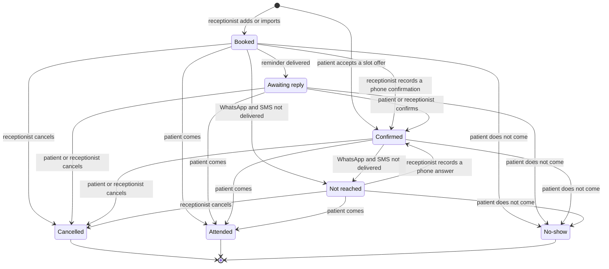
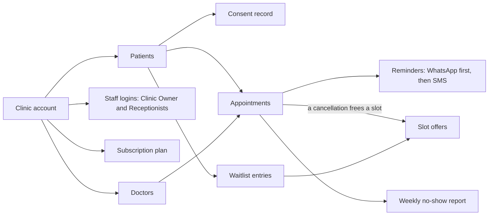

<!--
CHUNK: 03
TITLE: Definitions & Important Details
PROJECT: Clinic Reminders
VERSION: 1.0
DEPENDS_ON: 02
PART OF: BRD - Clinic Reminders
LANGUAGE: Business language only. Explain domain concepts as the business understands them - lifecycles, rules, relationships. No data-schema, protocol, or implementation detail; that is owned by the SDD.
-->

# Definitions & Important Details

## Clinic account

### Overview

Each subscribing clinic has one clinic account. The Clinic Owner opens it (UC-01). It holds the clinic's details and doctors, the staff logins, the subscription plan, and the clinic's patients, appointments, consent records, and waitlist.

Each clinic is the controller of its patients' data, and Clinic Reminders processes the data for the clinic ([chunk 02](./02-glossary-assumptions-facts.md#assumptions--constraints), assumption 27). So one clinic never sees another clinic's patients.

### Staff and doctors

- The Clinic Owner has the owner login. Each Receptionist has a separate receptionist login (UC-02).
- A clinic has 1 to 5 doctors. The plan follows the number of doctors (see [Subscription plans](#subscription-plans)).
- With per-doctor calendars (Should, Q2-2027), each doctor has a separate calendar inside the clinic account, and each appointment belongs to one doctor. Per-doctor calendars come with the Clinic plan only (Table 6). Other clinics keep all their appointments in one clinic calendar. In this BRD, "once per-doctor calendars are live" means for clinics on the Clinic plan.

## Appointment

### Overview

An appointment is one patient's booked visit at a set date and time. Once per-doctor calendars are live, it also names one doctor. The Receptionist adds it (UC-07) or imports it (UC-09). Its status changes as the patient answers and as reception records what happened.

### Appointment statuses

**Table 5 - Appointment statuses**

| Status | Meaning | Set by |
|--------|---------|--------|
| Booked | The appointment is entered. No reminder has been delivered yet. | The system, when the Receptionist adds or imports the appointment |
| Awaiting reply | A reminder was delivered, and the patient has not answered. | The system |
| Confirmed | The patient confirmed by WhatsApp or through the SMS link, or the Receptionist recorded a confirmation given by phone, or the patient accepted a slot offer (UC-16). **[NEEDS CLARIFICATION: proposed: an appointment booked from a slot offer starts as Confirmed and still gets the normal reminders when its reminder time is ahead; confirm or replace]** | The system, or the Receptionist; the system, when a patient accepts a slot offer |
| Cancelled | The patient cancelled by WhatsApp or through the SMS link, or the Receptionist cancelled for the patient. | The system, or the Receptionist |
| Not reached | Neither the WhatsApp reminder nor the SMS was delivered. **[NEEDS CLARIFICATION: proposed: the system sets Not reached when neither channel delivers the reminder, and the appointment joins the Receptionist's call list (UC-10, UC-15); confirm or replace]** | The system |
| Attended | The patient came. | The Receptionist (UC-13) |
| No-show | The appointment was not cancelled, and the patient did not come. | The Receptionist (UC-13) |

**Day view labels.** The day view also shows labels that are not statuses: No consent (the patient has no consent record, so no message goes), Opted out (the patient stopped all messages), Refilled (a waitlisted patient took this slot), Free slot (a cancelled slot that nobody took), and Booked too late (no reminder goes because the visit was booked too late; this label exists only if the UC-07 E1 question is answered "send none"). A label never changes the status.

**[NEEDS CLARIFICATION: proposed: a Confirmed appointment stays Confirmed when a later reminder is delivered and not answered; when neither channel delivers a reminder for it, it becomes Not reached and joins the call list; confirm or replace]**

**Figure 1 - Appointment statuses**

**Summary:** An appointment starts as Booked, or as Confirmed when a patient accepts a slot offer; a Booked appointment can also be confirmed by phone before any reminder. It becomes Awaiting reply once a reminder is delivered, or Not reached when no channel delivers it; the patient or the Receptionist then confirms or cancels it, and after the visit time the Receptionist records Attended or No-show.

## Reminders

### Timing

- The first reminder goes out at a set time before each visit. The default is 24 hours before ([pre-BRD 01 Concept Sheet](../../run/pre-brd-clinic-reminders/01-concept-sheet.md), Proposed Solution).
- The Clinic Owner can change the timing (UC-04; Should).
- A second reminder can go out on the visit day (UC-04; Should, Q2-2027).

### Channels

- WhatsApp comes first. The reminder uses an approved template, in Arabic or English, with Confirm and Cancel buttons (pre-BRD 01).
- When the WhatsApp reminder is not delivered, the same reminder goes by SMS with a short confirm or cancel link. The SMS needs a link because patients cannot reply to an SMS ([chunk 02](./02-glossary-assumptions-facts.md#assumptions--constraints), constraint 19).
- A patient gets the SMS only when the WhatsApp reminder is not delivered (UC-15).
- If WhatsApp cannot send at all, for example because the daily sending limit is reached, WhatsApp is down, or Meta pauses a template, the reminder goes by SMS as UC-15 describes. **[NEEDS CLARIFICATION: proposed: an SMS sent for one of these reasons is not charged to the clinic and does not count toward its allowance; confirm or replace]**
- **[NEEDS CLARIFICATION: proposed: when a patient answers on both WhatsApp and the SMS link, the latest answer before the visit time counts, and a Confirm never brings back a cancelled appointment; confirm or replace]**

### Message content

- Each patient gets messages in one language, Arabic or English. **[NEEDS CLARIFICATION: proposed: the message language belongs to the patient; it is set when the patient is first added (UC-07, UC-09, or UC-12) and can be changed later; a change applies to messages not yet sent; confirm or replace]**
- No message carries a diagnosis or other health detail (constraint 14).
- Reminder, confirmation, and slot-offer messages carry no promotion (constraint 17).
- An SMS carries no medicine-related content (constraint 20).
- **[NEEDS CLARIFICATION: proposed: each reminder names the clinic, the date and time of the appointment, and, once per-doctor calendars are live, the doctor; confirm or replace]**

## Consent record

### Overview

The clinic keeps one consent record per patient. It holds:

- who agreed: the patient, or the guardian for a patient under 15 (constraint 7);
- what the agreement covers: one agreement covers WhatsApp reminders, SMS reminders, and slot offers ([pre-BRD 08 PESTLE](../../run/pre-brd-clinic-reminders/08-pestle-analysis.md), Legal (4));
- when and how the agreement was given, and which staff member recorded it (UC-08);
- any opt-out, with its date and time (UC-17).

### Rules

- No message goes to a patient without a consent record (constraint 12).
- An opt-out stops all messages to that patient (constraint 13; UC-17).
- Consent records are kept for at least three years (constraint 15).
- Each clinic keeps its own consent records, because each clinic is the controller of its patients' data (assumption 27).
- One mobile number can belong to several patients, such as a family phone or a guardian with several children. Each patient keeps a separate consent record. **[NEEDS CLARIFICATION: proposed: the system tells patients apart by name and mobile number together; each reminder and slot offer names the patient by first name; an opt-out from a shared number stops messages for every patient on that number at this clinic; confirm or replace]**
- **[NEEDS CLARIFICATION: proposed: the Receptionist marks a patient as under 15, and the system asks for no date of birth; the Receptionist confirms the mark at each new appointment and records the patient's own consent (UC-08) once the patient is 15 or older; counsel to confirm; confirm or replace]**

## Waitlist and slot offers

### Overview

The waitlist is the clinic's list of patients who asked for an earlier slot. The Receptionist adds a patient at the patient's request (UC-12). When an appointment is cancelled, the system offers the freed slot to waitlisted patients in waitlist order. The first patient to accept takes the slot (UC-16) ([pre-BRD 01](../../run/pre-brd-clinic-reminders/01-concept-sheet.md), Proposed Solution; [pre-BRD 14](../../run/pre-brd-clinic-reminders/14-moscow-method.md), Must (7)). **[NEEDS CLARIFICATION: pre-BRD 24 OI-11 is open: should waitlist refill start as a manual-assist version (the system proposes the next patient and reception sends the offer in one click), with a keep-or-drop test in the pilot?]**

### Rules

- Only patients on the waitlist get slot offers, and each offer answers the patient's own waitlist request (constraint 17).
- Slot offers go only to patients with a consent record (constraint 12).
- **[NEEDS CLARIFICATION: proposed: patients are kept in the order they joined the waitlist; a waitlist entry is for one doctor once per-doctor calendars are live, and any freed slot of that doctor matches it; confirm or replace]**
- **[NEEDS CLARIFICATION: "offers to waitlisted patients in order, and the first to accept takes the slot" can be read two ways: does the system offer the slot to one patient at a time in waitlist order, or to all matching patients at once?]**
- **[NEEDS CLARIFICATION: how long does a slot offer stay open, and how close to the visit time can a freed slot still go to the waitlist?]**
- A patient leaves the waitlist when the patient accepts an offer (UC-16) or asks to leave (UC-12 A1). **[NEEDS CLARIFICATION: proposed: an entry also ends when the patient opts out (UC-17), or when the patient's own booked appointment takes place or is cancelled; how long does an entry stay when the patient has no booked appointment?; confirm or replace]**

## Subscription plans

The plans, prices, and allowances come from [pre-BRD 21 Pricing & packaging](../../run/pre-brd-clinic-reminders/21-roadmap-project-plan.md). Revenue streams are in [pre-BRD 03 Lean Canvas](../../run/pre-brd-clinic-reminders/03-lean-canvas.md), Revenue Streams. Paying a year in advance gives a two-month discount (pre-BRD 03).

**Table 6 - Subscription plans**

| Plan | For | Price | What it includes |
|------|-----|-------|------------------|
| Starter | Clinics with 1 to 2 doctors | EGP 549 a month, or EGP 5,490 a year paid in advance | Up to 2 doctors; 600 WhatsApp reminders a month with confirm or cancel; SMS fallback at cost; waitlist refill; weekly report |
| Clinic | Clinics with 3 to 5 doctors | EGP 999 a month, or EGP 9,990 a year paid in advance | Up to 5 doctors; 2,000 reminders a month; per-doctor calendars and reports |
| Message top-up | Any plan | EGP 50 per 100 extra WhatsApp reminders; SMS at cost plus 20% | Reminders beyond the monthly allowance |

- **[NEEDS CLARIFICATION: pre-BRD 24 OI-16 (5) is open: the Starter plan charges SMS fallback at cost, but the top-up row charges SMS at cost plus 20%. Which SMS charge applies to each plan?]**
- **[NEEDS CLARIFICATION: pre-BRD 24 OI-09 is open: the cost side leaves out charged replies, slot offers, and hosting; should the top-up price be set on the reply-inclusive cost?]**
- **[NEEDS CLARIFICATION: pre-BRD 21 lists per-doctor reports in the Clinic plan, but pre-BRD 14 puts the no-show breakdown by doctor in Could have. Are per-doctor reports in this release?]**
- **[NEEDS CLARIFICATION: proposed: plan and top-up prices exclude the 14% VAT; billing adds VAT to each payment and gives the Clinic Owner a receipt that shows it; confirm or replace]**

**Pilot clinics.** **[NEEDS CLARIFICATION: proposed: pilot clinics use the service without paying from go-live until the paid launch, with no message allowance limit; at the paid launch the Clinic Owner chooses a plan and pays (UC-05); by which date must a pilot clinic pay before its reminders stop?; confirm or replace]**

## How the main concepts relate

**Figure 2 - How the main concepts relate**

**Summary:** A clinic account holds the doctors, staff logins, plan, and patients. Each patient has a consent record and appointments. Appointments drive the reminders and the weekly report, and a cancelled appointment frees a slot for the waitlist.

<!-- MASTER: clinic-reminders-brd-master.md | PREV: 02-glossary-assumptions-facts.md | NEXT: 04-scope-and-personas.md -->
