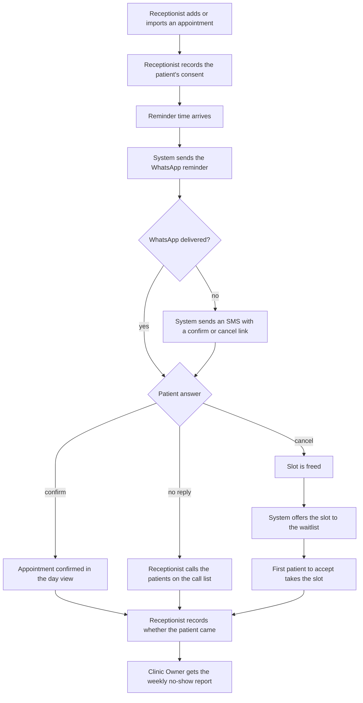

<!--
CHUNK: 05
TITLE: User Journeys & Use Cases - Overview
PROJECT: Clinic Reminders
VERSION: 1.0
DEPENDS_ON: 04
PART OF: BRD - Clinic Reminders
LANGUAGE: Business language only. No technology names, protocols, or implementation terminology - the how is owned by the SDD.
-->

# User Journeys & Use Cases

## User Journeys

### Clinic Owner Journey

The Clinic Owner wants a full schedule without paying staff to make reminder calls. The owner opens the clinic account, adds the doctors, and gives each receptionist a login. The owner sets when reminders go out, and pays for the plan in EGP. After that, the service runs on its own. Each week, the owner gets a no-show report on WhatsApp that shows the no-show rate, the confirmed share, and the slots refilled from the waitlist. When a change looks wrong, the owner checks the staff activity log. The owner leaves with fuller days and one weekly number to act on.

### Receptionist Journey

The Receptionist wants a confirmed list each morning without a round of calls. The Receptionist adds or imports the appointments and records each patient's consent. When a patient asks for an earlier slot, the Receptionist adds the patient to the waitlist. Each morning, the Receptionist opens the day view and sees who confirmed, who cancelled, and who did not reply. The Receptionist calls only the patients on the call list: those who did not reply or could not be reminded. When a patient cancels by phone, the Receptionist cancels the appointment, and the freed slot goes to the waitlist. After the visits, the Receptionist records who came. The Receptionist leaves with a calm morning and fewer calls.

### Patient Journey

The Patient wants to remember the appointment and change plans without an awkward call. At booking, the patient (or the guardian of a child) agrees to receive messages. Before the visit, the patient gets a WhatsApp reminder in Arabic or English, or an SMS with a link when WhatsApp is not delivered. The patient confirms or cancels with one tap. A patient on the waitlist gets an offer when a slot frees up and takes it by accepting first. The patient can stop all messages with an opt-out reply. The patient leaves with fewer missed visits and earlier slots.

## Summarized Workflow

1. The Receptionist adds or imports appointments and records each patient's consent (UC-07, UC-08, UC-09).
2. At the reminder time, the system sends the patient a WhatsApp reminder (UC-14).
3. If WhatsApp is not delivered, the system sends an SMS with a confirm or cancel link (UC-15).
4. The patient confirms or cancels with one tap (UC-14, UC-15).
5. A cancellation frees the slot. The system offers it to the waitlist, and the first patient to accept takes it (UC-11, UC-16).
6. Each morning, the Receptionist checks the day view and calls only the patients on the call list (UC-10).
7. After each visit, the Receptionist records whether the patient came (UC-13).
8. Each week, the Clinic Owner receives the no-show report on WhatsApp (UC-03).

**Figure 3 - Summarized workflow**

**Summary:** The Receptionist enters appointments and consent, and the system reminds each patient on WhatsApp or, when WhatsApp is not delivered, by SMS. Patients confirm or cancel; cancelled slots go to the waitlist, attendance is recorded after the visit, and the owner gets a weekly no-show report.

## Use Case Summary

Rows follow the persona order of chunk 04. Within each persona, Must-have use cases come first, then Should-have ones ([pre-BRD 14 MoSCoW](../../run/pre-brd-clinic-reminders/14-moscow-method.md)).

**Table 9 - Use Case Summary**

| UC ID | Use Case | Primary Actor | Description |
|-------|----------|---------------|-------------|
| **Clinic Owner** | | | |
| UC-01 | Set up the clinic account | Clinic Owner | The owner opens the clinic account, adds the doctors, and gets the owner login. |
| UC-02 | Give a receptionist a login | Clinic Owner | The owner gives a receptionist a separate login, and removes it when the receptionist leaves. |
| UC-03 | Read the weekly no-show report | Clinic Owner | Each week the owner gets the no-show report on WhatsApp. |
| UC-04 | Set the reminder timing | Clinic Owner | The owner changes when the first reminder goes out and turns the visit-day reminder on or off. |
| UC-05 | Pay for the subscription | Clinic Owner | The owner pays for the plan in EGP through the payment gateway, monthly or a year in advance, and buys top-ups. |
| UC-06 | Review the staff activity log | Clinic Owner | The owner sees which staff member did what, and when. |
| **Receptionist** | | | |
| UC-07 | Add an appointment | Receptionist | The receptionist enters a booked visit so the patient gets reminders. |
| UC-08 | Record a patient's consent | Receptionist | The receptionist records the patient's (or guardian's) agreement to receive messages. |
| UC-09 | Import appointments from a file | Receptionist | The receptionist adds many appointments at once from a CSV file. |
| UC-10 | Check the day's appointment statuses | Receptionist | The receptionist sees who confirmed, who cancelled, and who did not reply, and calls only the patients on the call list. |
| UC-11 | Cancel an appointment for a patient | Receptionist | The receptionist cancels when a patient calls, and the freed slot goes to the waitlist. |
| UC-12 | Add a patient to the waitlist | Receptionist | The receptionist puts a patient who wants an earlier slot on the waitlist. |
| UC-13 | Record whether the patient came | Receptionist | After the visit time, the receptionist records Attended or No-show for the weekly report. |
| **Patient** | | | |
| UC-14 | Confirm or cancel from the WhatsApp reminder | Patient | The patient confirms or cancels with one tap on the WhatsApp reminder. |
| UC-15 | Confirm or cancel through the SMS link | Patient | When WhatsApp is not delivered, the patient confirms or cancels through the link in the SMS. |
| UC-16 | Accept a waitlist slot offer | Patient | A waitlisted patient takes a freed slot by accepting the offer first. |
| UC-17 | Stop all messages | Patient | The patient opts out, and the system stops all messages to that patient. |

<!-- MASTER: clinic-reminders-brd-master.md | PREV: 04-scope-and-personas.md | NEXT: 06a-use-cases-clinic-owner.md -->
