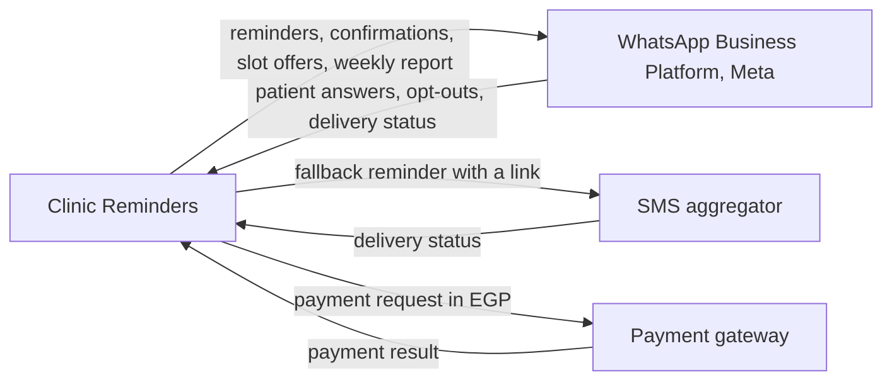

<!--
CHUNK: 08
TITLE: Integrations
PROJECT: Clinic Reminders
VERSION: 1.0
DEPENDS_ON: 05, 03
PART OF: BRD - Clinic Reminders
LANGUAGE: Business language only. Name the business system or partner and the business purpose of the integration (e.g., "Integration with Payment Gateway"). Protocols, data formats, authentication, and SLAs are technical design - they are owned by the SDD.
-->

# Integrations

The partners come from [pre-BRD 02 Product Charter](../../run/pre-brd-clinic-reminders/02-product-charter.md), Stakeholders, and [pre-BRD 03 Lean Canvas](../../run/pre-brd-clinic-reminders/03-lean-canvas.md), Key Partners.

**Table 11 - Integrations**

| Business System / Partner | Business Purpose | Information Exchanged | Direction | Criticality | Provider / Owner |
|---------------------------|------------------|-----------------------|-----------|-------------|------------------|
| WhatsApp Business Platform | Send reminders, confirmations, and slot offers to patients, and the weekly report to Clinic Owners; receive patients' answers and opt-outs (UC-03, UC-14, UC-16, UC-17) | Messages from approved templates; patients' button taps and replies; whether each message was delivered and read | Both ways | Critical | Meta. **[NEEDS CLARIFICATION: pre-BRD 24 OI-15 is open: do the clinic's messages go from the clinic's own WhatsApp number or from one shared Clinic Reminders number? This decides set-up, the sender name patients see, and whether the 250-user limit binds.]** |
| SMS aggregator | Send the fallback reminder with a confirm or cancel link when the WhatsApp reminder is not delivered (UC-15) | SMS text with the link; whether each SMS was delivered | Both ways | Critical | An NTRA-licensed Egyptian SMS aggregator (constraint 3), not chosen yet ([chunk 02 Dependencies](./02-glossary-assumptions-facts.md#dependencies)) |
| Payment gateway | Collect subscription and top-up payments from clinics in EGP (UC-05) | Payment requests and payment results | Both ways | Important (Should, Q2-2027) | A local Egyptian payment gateway, not chosen yet ([chunk 02 Dependencies](./02-glossary-assumptions-facts.md#dependencies)) |

**Figure 4 - Integrations**

**Summary:** Clinic Reminders sends its messages through the WhatsApp Business Platform and gets the patients' answers back. It sends fallback reminders through a licensed SMS aggregator, and it collects clinic payments in EGP through a local payment gateway.

> Technical integration details (protocols, authentication, data formats, availability targets) are defined in the SDD, not here.

<!-- MASTER: clinic-reminders-brd-master.md | PREV: 07-users-use-cases-matrix.md | NEXT: 09-reporting-and-analytics.md -->
