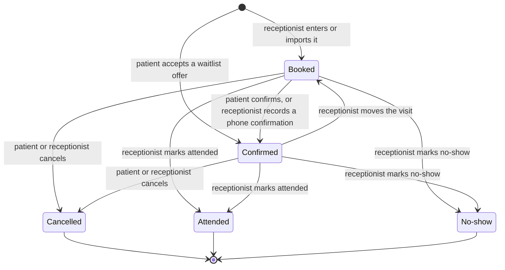

<!--
CHUNK: 03
TITLE: Definitions & Important Details
PROJECT: Clinic Reminders
VERSION: 1.0
DEPENDS_ON: 02
PART OF: BRD - Clinic Reminders
LANGUAGE: Business language only. Explain domain concepts as the business understands them - lifecycles, rules, relationships. No data-schema, protocol, or implementation detail; that is owned by the SDD.
-->

# Definitions & Important Details

## Appointment

### Overview

An appointment is a booked visit of one patient with one doctor of the clinic, at a set date and time. Reception enters it by hand (UC-07) or imports it from a file (UC-08). The appointment's status drives the reminders, the waitlist offers, and the weekly no-show report.

### Appointment lifecycle

An appointment starts as Booked, or as Confirmed when a waitlisted patient accepts an offer. The patient's reply moves it to Confirmed or Cancelled. After the visit time, reception marks it Attended or No-show (UC-12). These statuses come from [pre-BRD 06 Market Comparison, Schedule and calendar management](../../run/pre-brd-clinic-reminders/06-market-comparison.md).

#### Figure 1 - Appointment lifecycle

**Summary:** A new appointment is Booked, or Confirmed when a waitlisted patient accepts an offer; the patient or reception then confirms or cancels it, and a moved visit becomes Booked again. After the visit time, the receptionist marks a booked or confirmed appointment as Attended or No-show.

- A patient who confirmed can still cancel by tapping Cancel, until the visit time. **[NEEDS CLARIFICATION: proposed: a patient who confirmed can still cancel with the Cancel button of the same reminder until the visit time; confirm or replace]**
- A cancelled appointment cannot be marked Attended or No-show. **[NEEDS CLARIFICATION: proposed: a cancelled appointment cannot be marked Attended or No-show; confirm or replace]**
- A moved appointment becomes Booked again and gets a new reminder (UC-11, A2).
- The status changes that come from proposals stand or fall with them: a patient who cancels after confirming (the first bullet under Figure 1, and UC-15, E3 on the link page), a phone confirmation (UC-11, A1), a moved visit (UC-11, A2), and a booking from an accepted waitlist offer ([Offer rules](#offer-rules), rule 8). Cancelled as an end state, with no attendance mark, rests on the second bullet under Figure 1. If one is replaced, its edge in Figure 1 and its sentence change with it.

### What an appointment holds

**[NEEDS CLARIFICATION: proposed: an appointment holds the patient's name and mobile number, the message language (Arabic or English), the doctor, and the date and time; for a patient under 15, it also holds the guardian's name and mobile number; confirm or replace]**

- A patient is known by their name and mobile number together. Several patients can share one mobile number, for example family members, or the children of one guardian. Each patient has their own consent record, and a patient who books again keeps it ([Consent and opt-out](#consent-and-opt-out)). For a patient under 15, the mobile number is the guardian's, and the guardian's consent is recorded for each child.
- The doctor must be one of the clinic's doctors ([Clinic account and roles](#clinic-account-and-roles)).
- **[NEEDS CLARIFICATION: Do appointments need a length, so that a freed slot goes only to a waitlisted patient whose visit fits? Dental visits can differ in length.]**

---

## Reminders and replies

### Overview

At a set time before each visit, Clinic Reminders sends the patient a WhatsApp reminder. The reminder uses an approved Arabic or English template with Confirm and Cancel buttons. If WhatsApp does not deliver it, an SMS with a short confirm-or-cancel link follows. The patient's reply updates the appointment status ([pre-BRD 01 Concept Sheet, Proposed Solution](../../run/pre-brd-clinic-reminders/01-concept-sheet.md); [pre-BRD 14 MoSCoW, Must (3) to (5)](../../run/pre-brd-clinic-reminders/14-moscow-method.md)).

### Channel rules

- The reminder goes 24 hours before the visit by default. Until configurable timing exists (UC-05), every clinic uses 24 hours.
- An appointment entered after its reminder time gets its reminder at once. **[NEEDS CLARIFICATION: proposed: an appointment entered less than 24 hours before the visit gets its reminder at once, if the visit has not started; confirm or replace]**
- WhatsApp comes first. The SMS goes only when the WhatsApp reminder is not delivered, so a patient never gets the same reminder twice ([pre-BRD 06 Market Comparison, Automatic SMS fallback](../../run/pre-brd-clinic-reminders/06-market-comparison.md)). **[NEEDS CLARIFICATION: How long does Clinic Reminders wait for WhatsApp delivery before it sends the SMS? Pre-BRD 06 says the SMS follows when WhatsApp "fails or is not delivered in time" but sets no time.]**
- When neither WhatsApp nor SMS delivers the reminder, the day view shows the appointment as not reached, and the appointment is on the call list (UC-10, step 4).
- A second reminder on the visit day comes with the paid launch ([04 / In Scope](./04-scope-and-personas.md#in-scope)). **[NEEDS CLARIFICATION: At what time on the visit day does the second reminder go, and does it also go to patients who already confirmed?]**
- An appointment booked from a waitlist offer after its reminder time gets no reminder. The acceptance message (UC-16, step 4) serves as its reminder.
- No message goes to a patient without consent, or after an opt-out ([Consent and opt-out](#consent-and-opt-out)).

### Message content

- Reminders, confirmations, and waitlist offers carry no promotion (02 / Constraint 19), no diagnosis and no health information (02 / Constraint 10). An SMS carries no medicine-related content (02 / Constraint 18).
- **[NEEDS CLARIFICATION: proposed: a reminder shows the clinic name, the patient's first name, and the visit date and time, and nothing about the reason for the visit; confirm or replace]**
- Messages go in the appointment's message language, Arabic or English. Arabic messages use short text and tap buttons (02 / Fact 5).

### Reply rules

- A tap on Confirm sets the appointment to Confirmed. A tap on Cancel sets it to Cancelled and frees the slot for the waitlist ([pre-BRD 01 Concept Sheet, Proposed Solution](../../run/pre-brd-clinic-reminders/01-concept-sheet.md)).
- A Confirm tap on a Confirmed appointment keeps it Confirmed.
- A tap on a reminder for an appointment that was cancelled, or moved to another time, changes nothing. The patient is told the current status.
- Each reminder answers only its own appointment, even when one mobile number has several appointments. **[NEEDS CLARIFICATION: proposed: when one mobile number has several appointments, each reminder names its patient and its buttons answer only that appointment; confirm or replace]**
- **[NEEDS CLARIFICATION: proposed: after a Confirm or Cancel tap, the patient gets a short acknowledgement message; confirm or replace]**
- **[NEEDS CLARIFICATION: proposed: a typed reply that is neither a button tap nor an opt-out word leaves the status unchanged, and the day view shows the typed text next to the appointment; confirm or replace]**
- **[NEEDS CLARIFICATION: proposed: a reply after the visit time changes nothing, and the patient is told that the visit time has passed; confirm or replace]**
- A reply of STOP, or its Arabic equivalent, is an opt-out (UC-17).

---

## Waitlist and slot offers

### Overview

The clinic keeps a waitlist of patients who asked to be seen earlier. When an appointment is cancelled, Clinic Reminders offers the freed slot to waitlisted patients in order. The first patient to accept takes the slot ([pre-BRD 01 Concept Sheet, Proposed Solution](../../run/pre-brd-clinic-reminders/01-concept-sheet.md); [pre-BRD 14 MoSCoW, Must (7)](../../run/pre-brd-clinic-reminders/14-moscow-method.md)).

**[NEEDS CLARIFICATION: Does the MVP send waitlist offers automatically, or does reception send each offer with one click during the pilot, with automatic offers only if the pilot keeps the waitlist? Should the pilot also require that at least half of pilot clinics keep an active waitlist? (pre-BRD 24, OI-11 and OI-12)]**

The waitlist assumes that each patient holds a timed slot (open question: 02 / Assumption 21).

### Offer rules

1. A patient joins the waitlist only at their own request, and only with consent ([pre-BRD 08 PESTLE, Technological (1) and Legal (4)](../../run/pre-brd-clinic-reminders/08-pestle-analysis.md)).
2. Any cancellation starts the offers: a Cancel tap, a cancel on the SMS link page, or a cancellation that reception records. A cancellation starts the offers only when no other appointment that is not Cancelled holds the same doctor, date, and start time.
3. **[NEEDS CLARIFICATION: Which waitlisted patients can get an offer for a freed slot (the same doctor only, any doctor, or a preferred time of day)? What happens to a later appointment that the accepting patient already holds?]**
4. **[NEEDS CLARIFICATION: proposed: waitlisted patients are ranked by the date and time they joined the waitlist; confirm or replace]**
5. **[NEEDS CLARIFICATION: How many waitlisted patients get the offer at the same time: one at a time in order, or several at once? Pre-BRD 01 says offers go "in order", and pre-BRD 06 says the others are told when the slot is filled.]**
6. An offer stays open for a set time ([pre-BRD 06 Market Comparison, Waitlist auto-fill](../../run/pre-brd-clinic-reminders/06-market-comparison.md)). **[NEEDS CLARIFICATION: How long does a waitlist offer stay open, and how close to the visit time can a freed slot still be offered?]**
7. The first patient who accepts takes the slot. Every other patient who got the offer is told that the slot is filled ([pre-BRD 06 Market Comparison, Waitlist auto-fill](../../run/pre-brd-clinic-reminders/06-market-comparison.md)).
8. An accepted offer ends the patient's waitlist entry (rule 12). **[NEEDS CLARIFICATION: proposed: an accepted offer books the slot for the patient as a Confirmed appointment; confirm or replace]**
9. **[NEEDS CLARIFICATION: proposed: if nobody accepts in time, the slot stays free and the day view shows it as free; confirm or replace]**
10. **[NEEDS CLARIFICATION: proposed: waitlist offers go by WhatsApp only, with no SMS fallback; confirm or replace]**
11. Offers carry no promotion (02 / Constraint 19). **[NEEDS CLARIFICATION: Do waitlist offers count as electronic marketing that needs its own licence? (pre-BRD 08, Legal (2))]**
12. A waitlist entry ends when the patient accepts an offer, when reception removes it (UC-13, A1), when the patient opts out (UC-17), or when the patient's own booked visit with the clinic has passed. **[NEEDS CLARIFICATION: proposed: an entry for a patient with no booked visit ends after 30 days, unless reception renews it; confirm or replace]**

---

## Consent and opt-out

### Overview

Clinic Reminders keeps a consent record for every patient. The record shows when and how consent was given, the guardian for a patient under 15, and any opt-out ([pre-BRD 01 Concept Sheet, Proposed Solution](../../run/pre-brd-clinic-reminders/01-concept-sheet.md); [pre-BRD 06 Market Comparison, section 4](../../run/pre-brd-clinic-reminders/06-market-comparison.md); [pre-BRD 14 MoSCoW, Must (6)](../../run/pre-brd-clinic-reminders/14-moscow-method.md)).

### Consent rules

1. Reception records consent when the patient books, or the import file carries it (UC-09, UC-08).
2. One consent, given at booking with its time, covers WhatsApp and SMS reminders and waitlist offers ([pre-BRD 08 PESTLE, Legal (4)](../../run/pre-brd-clinic-reminders/08-pestle-analysis.md)).
3. Consent must be written and explicit (02 / Constraint 2). **[NEEDS CLARIFICATION: Does a WhatsApp opt-in count as written consent under the PDPL? (pre-BRD 08, Legal (2))]**
4. For a patient under 15, the guardian gives consent and receives the messages (02 / Constraint 3).
5. A patient with no consent gets no message (02 / Constraint 8).
6. A reply of STOP, or its Arabic equivalent, stops every message to that patient: reminders, SMS, and waitlist offers. The opt-out time goes into the consent record (02 / Constraint 9). **[NEEDS CLARIFICATION: Which Arabic word or words count as an opt-out?]** **[NEEDS CLARIFICATION: When several patients share one mobile number, does a STOP reply stop the messages for all of them?]** An opt-out covers every message from the sender that the patient answered. With a sender number for each clinic, it stops that clinic's messages only. With one shared Clinic Reminders number, it stops the messages of every clinic, and each of those clinics' records shows an opt-out by reply, without naming the other clinic. Each clinic keeps its own consent records. Reception can also record an opt-out that the patient gives at the desk or by phone (UC-09, A3).
7. **[NEEDS CLARIFICATION: proposed: after an opt-out, messages start again only when reception records new consent from the patient; confirm or replace]**
8. The clinic can export its consent records for an audit (UC-04).
9. Each consent record also holds the staff member who recorded the consent and where the written proof is: a signed form kept at the clinic, the patient's WhatsApp message, or an imported file. For imported consent, the record holds the import date and the receptionist who confirmed it.

---

## Weekly no-show report

### Overview

Each week, the Clinic Owner gets a no-show report on WhatsApp, in Arabic (UC-03). The report goes only to an owner who opted in, and its fee estimates need each doctor's fee per visit ([pre-BRD 06 Market Comparison, section 4](../../run/pre-brd-clinic-reminders/06-market-comparison.md)). **[NEEDS CLARIFICATION: On which day and at what time does the weekly report go, and which seven days does it cover?]** **[NEEDS CLARIFICATION: For the MVP, is the weekly report a fixed WhatsApp message with the measures below only, with any further analysis later? (pre-BRD 24, OI-12)]**

### Measures

The report covers the past week. It shows:

- for the clinic: the no-show rate, the confirmed share, and the slots refilled from the waitlist ([pre-BRD 04 Value Proposition Canvas, Clinic owner](../../run/pre-brd-clinic-reminders/04-value-proposition-canvas.md));
- for the clinic: the late cancellations ([pre-BRD 06 Market Comparison, section 4](../../run/pre-brd-clinic-reminders/06-market-comparison.md));
- for each doctor: the estimated lost fees and the estimated recovered fees ([pre-BRD 06 Market Comparison, section 4](../../run/pre-brd-clinic-reminders/06-market-comparison.md)).

**[NEEDS CLARIFICATION: proposed: no-show rate = no-shows divided by (attended plus no-shows); confirmed share = confirmed appointments divided by appointments reminded; refilled slots = cancelled slots that a waitlisted patient took; estimated lost fees = no-shows times the doctor's fee; estimated recovered fees = refilled slots times the doctor's fee; confirm or replace]**

**[NEEDS CLARIFICATION: How does the report count a past appointment that reception did not mark: as attended, as a no-show, or as "not marked"? Pre-BRD 06 notes that clinics resist marking no-shows by hand.]**

A late cancellation is defined in the Glossary (02).

---

## Clinic account and roles

### Overview

Each clinic has one clinic account, with one owner login and receptionist logins ([pre-BRD 14 MoSCoW, Must (1)](../../run/pre-brd-clinic-reminders/14-moscow-method.md)). Each user sees only their own clinic's data ([10 / NFR-05](./10-nfrs.md)). The Users & Use Cases Matrix ([07](./07-users-use-cases-matrix.md)) sets what each role can do.

### Doctors and fees

- The clinic account lists the clinic's doctors, with each doctor's fee per visit in EGP. The fee feeds the estimated lost and recovered fees in the weekly report ([pre-BRD 06 Market Comparison, section 4](../../run/pre-brd-clinic-reminders/06-market-comparison.md)).
- The subscription tier depends on the number of doctors ([pre-BRD 01 Concept Sheet, Business Model](../../run/pre-brd-clinic-reminders/01-concept-sheet.md)).
- Per-doctor calendars inside one clinic come with the paid launch ([04 / In Scope](./04-scope-and-personas.md#in-scope)).

### Staff action log

From go-live, Clinic Reminders records which staff member did what, and when ([pre-BRD 14 MoSCoW, Should](../../run/pre-brd-clinic-reminders/14-moscow-method.md)). The owner can read this record from the Growth phase ([09](./09-reporting-and-analytics.md)). **[NEEDS CLARIFICATION: Which activity must Clinic Reminders log under the Anti-Cybercrime Law 175/2018 (02 / Constraint 7)? Counsel to confirm.]** The retention period is in 02 / Constraint 7.

---

## Subscription and message allowance

The clinic pays a subscription in EGP, tiered by the number of doctors, with a monthly reminder allowance. Reminders above the allowance are sold as top-ups. A clinic can prepay a year at a discount ([pre-BRD 03 Lean Canvas, Revenue Streams](../../run/pre-brd-clinic-reminders/03-lean-canvas.md)). Plans and prices are in [pre-BRD 21 Roadmap, Pricing & packaging](../../run/pre-brd-clinic-reminders/21-roadmap-project-plan.md). Payment through a local payment gateway comes with the paid launch (UC-06).

- There are two plans ([pre-BRD 21 Roadmap, Pricing & packaging](../../run/pre-brd-clinic-reminders/21-roadmap-project-plan.md)): Starter, for 1 to 2 doctors, and Clinic, for 3 to 5 doctors. Prices stay in pre-BRD 21.
- The owner picks the clinic's plan at the first payment (UC-06, A3).
- Pilot clinics pay nothing during the pilot (test-fixture value; owner: product manager). **[NEEDS CLARIFICATION: proposed: at the paid launch, each pilot clinic gets the plan that fits its number of doctors, and its first payment falls due on 2027-04-01; confirm or replace]**
- A Starter clinic that adds a third doctor moves to the Clinic plan. **[NEEDS CLARIFICATION: proposed: the system shows the owner the new price before it saves the doctor, and the new price applies from the next payment; confirm or replace]** A Clinic plan clinic that goes down to 2 doctors can move to Starter from its next payment.
- **[NEEDS CLARIFICATION: Do per-doctor calendars and the per-doctor fee estimates come with every plan, or only with the Clinic plan, as pre-BRD 21 lists them?]**

- **[NEEDS CLARIFICATION: When a clinic uses up its monthly reminder allowance, does Clinic Reminders keep sending and bill top-ups, or stop until the owner buys a top-up?]**
- **[NEEDS CLARIFICATION: What happens to reminders when a subscription payment is not made by its due date?]**

<!-- MASTER: clinic-reminders-brd-master.md | PREV: 02-glossary-assumptions-facts.md | NEXT: 04-scope-and-personas.md -->
