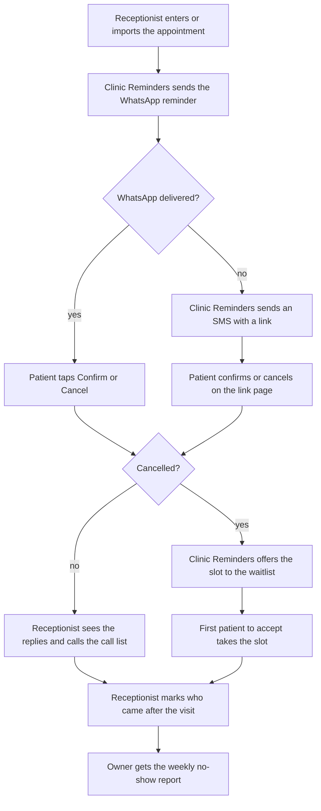

<!--
CHUNK: 05
TITLE: User Journeys & Use Cases - Overview
PROJECT: Clinic Reminders
VERSION: 1.0
DEPENDS_ON: 04
PART OF: BRD - Clinic Reminders
LANGUAGE: Business language only. No technology names, protocols, or implementation terminology - the how is owned by the SDD.
-->

# User Journeys & Use Cases

## User Journeys

### Clinic Owner Journey

The Clinic Owner sets up the clinic account with a founder's help at the onboarding visit. The owner lists the doctors and their fees, agrees to get the weekly report, and adds receptionist logins. After that, the owner does not need to sign in every day. Each week, a no-show report arrives on WhatsApp. It shows the no-show rate, the confirmed share, the late cancellations, the refilled slots, and the estimated lost and recovered fees. When the clinic needs proof of lawful messaging, the owner exports the consent records. From the paid launch, the owner pays the subscription in EGP.

### Receptionist Journey

The Receptionist enters each new appointment, or imports a file of appointments, and records consent for new patients. Each morning, the receptionist opens the day view to see who confirmed, who cancelled, and who has not replied. The receptionist calls only the patients on the call list: no reply, not reached, no consent, or opted out. When a patient calls to cancel, the receptionist records it, and the freed slot goes to the waitlist. Patients who want an earlier visit go on the waitlist. After each visit, the receptionist marks who came and who did not.

### Patient Journey

The Patient gets a WhatsApp reminder before the visit, with Confirm and Cancel buttons, and taps one. When WhatsApp does not reach the patient, an SMS arrives with a link; the patient opens it and confirms or cancels there. A patient on the waitlist gets an offer when a slot frees up and accepts it with one tap. The first patient to accept takes the slot. At any time, the patient can reply STOP to end all messages.

## Summarized Workflow

1. The receptionist enters or imports the appointment.
2. Before the visit, Clinic Reminders sends the WhatsApp reminder.
3. If WhatsApp does not deliver it, Clinic Reminders sends an SMS with a link.
4. The patient confirms or cancels.
5. A cancellation sends the freed slot to the waitlist, and the first patient to accept takes it.
6. The receptionist sees the replies and calls only the patients on the call list.
7. After the visit, the receptionist marks who came.
8. Each week, the owner gets the no-show report.

#### Figure 2 - Summarized workflow

**Summary:** An appointment gets a WhatsApp reminder, or an SMS link when WhatsApp fails, and a cancellation sends the slot to the waitlist. Reception marks attendance after the visit, and the owner gets a weekly no-show report.

## Use Case Summary

| UC ID | Use Case | Primary Actor | Description |
|-------|----------|---------------|-------------|
| **Clinic Owner** | | | |
| UC-01 | Set up the clinic account | Clinic Owner | The owner sets up the clinic account, lists the doctors and their fees, and opts in to the weekly report. |
| UC-02 | Manage receptionist logins | Clinic Owner | The owner gives each receptionist a login and removes it when the receptionist leaves. |
| UC-03 | Read the weekly no-show report | Clinic Owner | The owner gets the weekly report on WhatsApp and sees what was lost, kept, and refilled. |
| UC-04 | Export the consent records | Clinic Owner | The owner exports the clinic's consent records to show that it messages patients lawfully. |
| UC-05 | Change the reminder timing | Clinic Owner | The owner sets when reminders go out, instead of the default 24 hours (Growth). |
| UC-06 | Pay the subscription | Clinic Owner | The owner pays the subscription in EGP through a local payment gateway (paid launch). |
| **Receptionist** | | | |
| UC-07 | Enter an appointment | Receptionist | The receptionist adds a booked visit so that the patient gets a reminder. |
| UC-08 | Import appointments from a file | Receptionist | The receptionist adds many appointments at once from a file. |
| UC-09 | Record a patient's consent | Receptionist | The receptionist records the patient's consent, or the guardian's, so the clinic may message the patient. |
| UC-10 | Check the day's replies | Receptionist | The receptionist sees who confirmed, who cancelled, and who has not replied. |
| UC-11 | Change or cancel an appointment | Receptionist | The receptionist records a cancellation or a change that a patient gives by phone or at the desk. |
| UC-12 | Mark who attended | Receptionist | The receptionist marks each past appointment as Attended or No-show. |
| UC-13 | Add a patient to the waitlist | Receptionist | The receptionist puts a patient who wants an earlier visit on the waitlist. |
| **Patient** | | | |
| UC-14 | Confirm or cancel from the WhatsApp reminder | Patient | The patient taps Confirm or Cancel on the WhatsApp reminder. |
| UC-15 | Confirm or cancel through the SMS link | Patient | The patient opens the SMS link and confirms or cancels there. |
| UC-16 | Accept a waitlist offer | Patient | The patient takes an earlier slot that another patient cancelled. |
| UC-17 | Stop all messages | Patient | The patient opts out, and all messages stop. |

<!-- MASTER: clinic-reminders-brd-master.md | PREV: 04-scope-and-personas.md | NEXT: 06a-use-cases-clinic-owner.md -->
