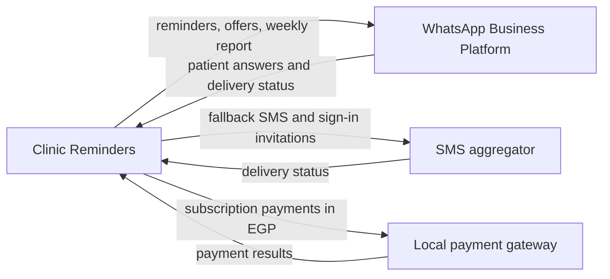

<!--
CHUNK: 08
TITLE: Integrations
PROJECT: Clinic Reminders
VERSION: 1.0
DEPENDS_ON: 05, 03
PART OF: BRD - Clinic Reminders
LANGUAGE: Business language only. Name the business system or partner and the business purpose of the integration (e.g., "Integration with Payment Gateway"). Protocols, data formats, authentication, and SLAs are technical design - they are owned by the SDD.
-->

# Integrations

| Business System / Partner | Business Purpose | Information Exchanged | Direction | Criticality | Provider / Owner |
|---------------------------|------------------|-----------------------|-----------|-------------|------------------|
| WhatsApp Business Platform | Send reminders, waitlist offers, and the weekly report; receive patient answers (UC-03, UC-14, UC-16, UC-17) | Reminders with Confirm and Cancel buttons; waitlist offers with an Accept button; the weekly report; patient taps and typed replies, including opt-out words; delivery status of each message; the read status of each weekly report | Both ways | Critical | Meta. **[NEEDS CLARIFICATION: Do messages go out from each clinic's own WhatsApp number or from one shared Clinic Reminders number? This decides the sender name patients see, whether each clinic needs its own verified WhatsApp business account, and who pays Meta. (pre-BRD 24, OI-15)]** |
| SMS aggregator | Send the fallback SMS when the WhatsApp reminder is not delivered (UC-15), and send sign-in invitations to staff (UC-02) | The fallback SMS with the confirm-or-cancel link, under the registered sender name; sign-in invitations; delivery status of each SMS | Both ways | Critical | **[NEEDS CLARIFICATION: Which NTRA-licensed SMS aggregator? Pre-BRD 09 names candidates but makes no choice.]** |
| Local payment gateway | Collect the subscription in EGP, from the paid launch (UC-06) | Payment requests for plans and top-ups; payment results | Both ways | Important | **[NEEDS CLARIFICATION: Which local payment gateway? The contract is a paid-launch dependency (02 / Dependencies).]** |

#### Figure 3 - Business partners

**Summary:** Clinic Reminders sends reminders, offers, and the weekly report through WhatsApp, and receives the answers back. It sends fallback SMS and staff sign-in invitations through the SMS aggregator, and collects subscription payments through a local payment gateway.

> Technical integration details (protocols, authentication, data formats, availability targets) are defined in the SDD, not here.

<!-- MASTER: clinic-reminders-brd-master.md | PREV: 07-users-use-cases-matrix.md | NEXT: 09-reporting-and-analytics.md -->
