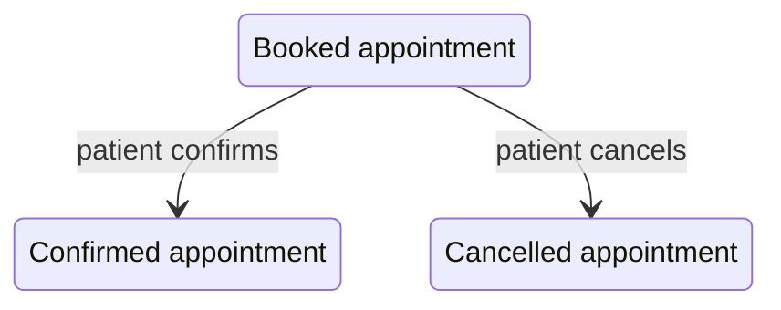

<!--
CHUNK: 03
TITLE: Definitions & Important Details
PROJECT: Clinic Reminders
VERSION: 1.0
DEPENDS_ON: 02
PART OF: BRD - Clinic Reminders
LANGUAGE: Business language only. Explain domain concepts as the business understands them - lifecycles, rules, relationships. No data-schema, protocol, or implementation detail; that is owned by the SDD.
-->

# Definitions & Important Details

## Appointment and reply

An appointment connects a patient, a clinic, a doctor and a visit time. Reception maintains the appointment; a patient reply changes its confirmation or cancellation status. Source: [pre-BRD 01](../../run/pre-brd-clinic-reminders/01-concept-sheet.md) and [pre-BRD 14](../../run/pre-brd-clinic-reminders/14-moscow-method.md).

### Figure 1 - Appointment reply lifecycle

**Summary:** The source states confirmation and cancellation of a booked visit. Other transitions remain owner questions in UC-09.

## Waitlist and slot allocation

The governing offer and acceptance behaviour is in [UC-07](./06b-use-cases-receptionist.md#uc-07-maintain-the-waitlist) and [UC-10](./06c-use-cases-patient.md#uc-10-take-an-offered-slot). A queued visit is not assumed to be a timed slot. **[NEEDS CLARIFICATION: Founders and pilot clinic owners to confirm timed-slot eligibility; pre-BRD 24 OI-03 affects pre-BRD 01 and 13.]**

## Consent and message eligibility

The consent record and opt-out behaviour are in UC-04 and UC-11. Appointment confirmation is not attendance. Reports need the explicit measures in [09](./09-reporting-and-analytics.md); an unanswered message alone does not establish a no-show.

## Clinic boundaries

The clinic is the scope of its appointments, staff logins and subscription. **[NEEDS CLARIFICATION: Founders and clinic owners to confirm staff access boundaries, shared-family-phone identity and guardian authority across clinics; pre-BRD 01 and 04 describe roles but not the full access rules.]**

## Upstream questions

- **[NEEDS CLARIFICATION: Founders and clinic owners to validate timed-slot admission and waitlist suitability; pre-BRD 24 OI-03 remains Open.]** Source: [pre-BRD OI-03](../../run/pre-brd-clinic-reminders/24-open-items-and-assumptions-log.md#oi-03-the-problem-and-the-waitlist-assume-timed-slots-but-many-target-clinics-may-admit-patients-in-arrival-order).

<!-- MASTER: clinic-reminders-brd-master.md | PREV: 02-glossary-assumptions-facts.md | NEXT: 04-scope-and-personas.md -->
