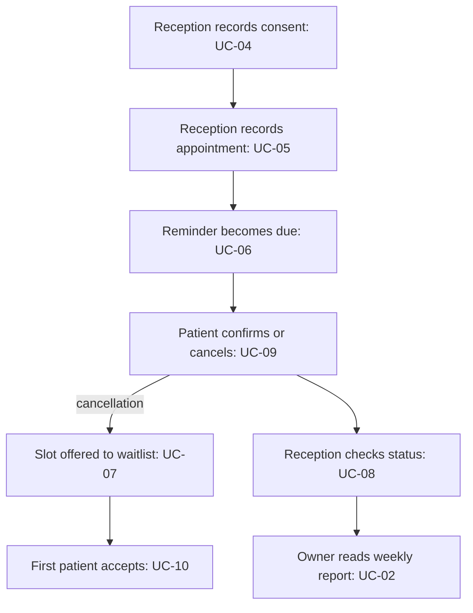

<!--
CHUNK: 05
TITLE: User Journeys & Use Cases - Overview
PROJECT: Clinic Reminders
VERSION: 1.0
DEPENDS_ON: 04
PART OF: BRD - Clinic Reminders
LANGUAGE: Business language only. No technology names, protocols, or implementation terminology - the how is owned by the SDD.
-->

# User Journeys & Use Cases

## User Journeys

### Clinic Owner Journey

The Clinic Owner uses the clinic account, reads the weekly report, and pays the subscription at paid launch. The job is to understand empty slots without chasing reminder calls. Sources: [pre-BRD 03](../../run/pre-brd-clinic-reminders/03-lean-canvas.md), [pre-BRD 04](../../run/pre-brd-clinic-reminders/04-value-proposition-canvas.md), [pre-BRD 05](../../run/pre-brd-clinic-reminders/05-empathy-map.md) and [pre-BRD 14](../../run/pre-brd-clinic-reminders/14-moscow-method.md).

### Receptionist Journey

The Receptionist records consent and appointments, maintains the waitlist, and checks who confirmed, cancelled or has not replied. Reminder delivery and replies feed that work. Sources: [pre-BRD 03](../../run/pre-brd-clinic-reminders/03-lean-canvas.md), [pre-BRD 04](../../run/pre-brd-clinic-reminders/04-value-proposition-canvas.md) and [pre-BRD 05](../../run/pre-brd-clinic-reminders/05-empathy-map.md).

### Patient Journey

The Patient, or a child's guardian, receives a reminder and confirms or cancels. A waiting patient can take an earlier offered slot. The Patient can stop messages. Sources: [pre-BRD 03](../../run/pre-brd-clinic-reminders/03-lean-canvas.md), [pre-BRD 04](../../run/pre-brd-clinic-reminders/04-value-proposition-canvas.md) and [pre-BRD 05](../../run/pre-brd-clinic-reminders/05-empathy-map.md).

## Summarized Workflow

### Figure 2 - Reminder and refill journey

**Summary:** The main journey connects consent, appointments, reminders, replies and waitlist refill. The weekly report also needs attendance evidence; its collection is an open question in 09.

## Use Case Summary

| UC ID | Use Case | Primary Actor | Description |
|-------|----------|---------------|-------------|
| UC-01 | Use the clinic account | Clinic Owner | Enter the clinic workspace through the owner or receptionist login. |
| UC-02 | Read the weekly no-show report | Clinic Owner | See whether the clinic is losing or recovering booked visits. |
| UC-03 | Pay the clinic subscription | Clinic Owner | Pay for the clinic reminder service in EGP. |
| UC-04 | Record patient consent | Receptionist | Record whether the patient agrees to receive clinic messages. |
| UC-05 | Maintain clinic appointments | Receptionist | Keep the clinic appointment list available for reminders and status tracking. |
| UC-06 | Run and inspect appointment reminders | Receptionist | Reach patients before visits and see their responses. |
| UC-07 | Maintain the waitlist | Receptionist | Make cancelled slots available to waiting patients. |
| UC-08 | Review the day's appointment status | Receptionist | See who confirmed, cancelled or has not replied. |
| UC-09 | Confirm or cancel a visit | Patient | Tell the clinic whether the booked visit will be kept. |
| UC-10 | Take an offered slot | Patient | Take an earlier clinic appointment from the waitlist. |
| UC-11 | Stop patient messages | Patient | Stop receiving clinic messages. |

## Upstream questions

- **[NEEDS CLARIFICATION: Founders and clinic owners to validate timed-slot admission and waitlist suitability; pre-BRD 24 OI-03 remains Open.]** Source: [pre-BRD OI-03](../../run/pre-brd-clinic-reminders/24-open-items-and-assumptions-log.md#oi-03-the-problem-and-the-waitlist-assume-timed-slots-but-many-target-clinics-may-admit-patients-in-arrival-order).
- **[NEEDS CLARIFICATION: Founders and clinic owners to decide waitlist demand and automatic versus manual-assist scope; pre-BRD 24 OI-11 remains Open.]** Source: [pre-BRD OI-11](../../run/pre-brd-clinic-reminders/24-open-items-and-assumptions-log.md#oi-11-the-headline-differentiator-is-the-least-evidenced-must-have).
- **[NEEDS CLARIFICATION: Founders to re-estimate scope and build dates; waitlist and report reductions remain unaccepted upstream proposals; pre-BRD 24 OI-12 remains Open.]** Source: [pre-BRD OI-12](../../run/pre-brd-clinic-reminders/24-open-items-and-assumptions-log.md#oi-12-the-mvp-schedule-assumes-all-founder-time-goes-to-coding).

<!-- MASTER: clinic-reminders-brd-master.md | PREV: 04-scope-and-personas.md | NEXT: 06a-use-cases-clinic-owner.md -->
