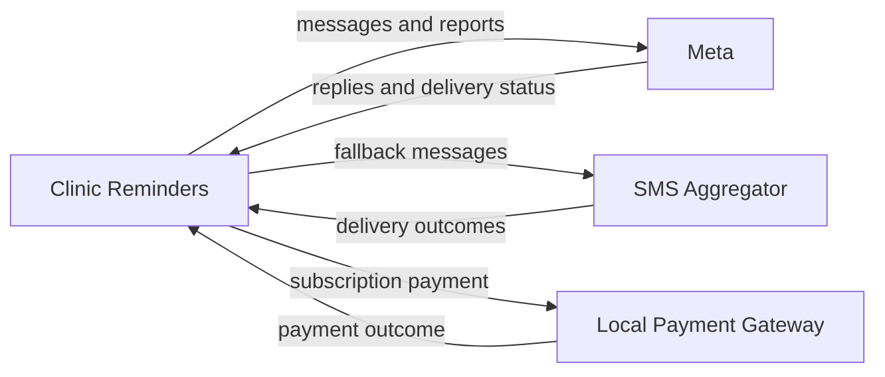

<!--
CHUNK: 08
TITLE: Integrations
PROJECT: Clinic Reminders
VERSION: 1.0
DEPENDS_ON: 05, 03
PART OF: BRD - Clinic Reminders
LANGUAGE: Business language only. Name the business system or partner and the business purpose of the integration (e.g., "Integration with Payment Gateway"). Protocols, data formats, authentication, and SLAs are technical design - they are owned by the SDD.
-->

# Integrations

| Business System / Partner | Business Purpose | Information Exchanged | Direction | Criticality | Provider / Owner |
|---------------------------|------------------|-----------------------|-----------|-------------|------------------|
| Meta | Patient reminders, replies, waitlist offers and owner report | Messages, responses and delivery status | Both ways | Critical | Meta; founders own onboarding |
| SMS Aggregator | Fallback when a WhatsApp reminder is not delivered | Fallback messages and delivery outcomes | Both ways | Critical | NTRA-licensed Egyptian partner; provider open in 02 |
| Local Payment Gateway | Collect the clinic subscription in EGP at paid launch | Subscription payment request and outcome | Both ways | Required for UC-03 | Provider open in 02 |

Sources: [pre-BRD 01](../../run/pre-brd-clinic-reminders/01-concept-sheet.md), [pre-BRD 03](../../run/pre-brd-clinic-reminders/03-lean-canvas.md) and [pre-BRD 14](../../run/pre-brd-clinic-reminders/14-moscow-method.md). Technical mandates are parked in [12](./12-appendix-and-wishlist.md). Failures and unresolved business outcomes are in UC-02, UC-03, UC-06, UC-09, UC-10 and UC-11.

### Figure 3 - Business partners

**Summary:** The messaging partners carry patient and owner messages. The local payment partner supports clinic subscription billing, not appointment fees.

## Upstream questions

- **[NEEDS CLARIFICATION: Founders to validate messaging cost, pricing and payback assumptions before subscription rules are final; pre-BRD 24 OI-09 remains Open.]** Source: [pre-BRD OI-09](../../run/pre-brd-clinic-reminders/24-open-items-and-assumptions-log.md#oi-09-gross-margin-and-churn-behind-ltvcac-are-assumptions-and-the-cost-side-omits-charged-replies-offers-and-hosting).
- **[NEEDS CLARIFICATION: Founders to decide the WhatsApp sender identity, onboarding and billing model; pre-BRD 24 OI-15 remains Open.]** Source: [pre-BRD OI-15](../../run/pre-brd-clinic-reminders/24-open-items-and-assumptions-log.md#oi-15-the-whatsapp-sender-model-is-undecided-but-drives-cost-limits-billing-and-trust).

<!-- MASTER: clinic-reminders-brd-master.md | PREV: 07-users-use-cases-matrix.md | NEXT: 09-reporting-and-analytics.md -->
