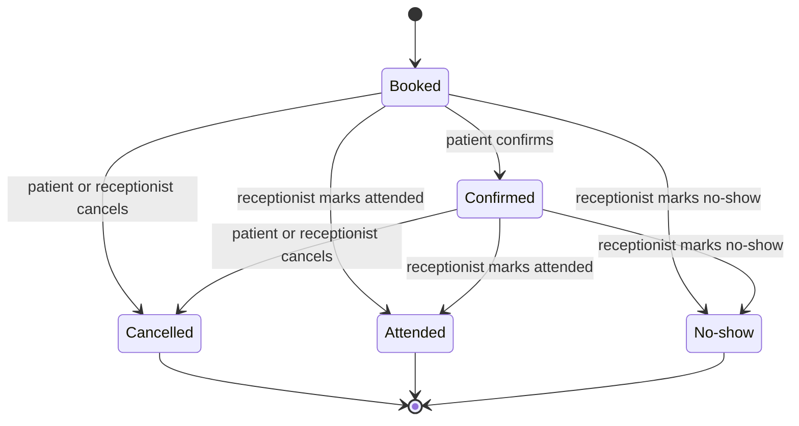

<!--
CHUNK: 03
TITLE: Definitions & Important Details
PROJECT: Clinic Reminders
VERSION: 1.0
DEPENDS_ON: 02
PART OF: BRD - Clinic Reminders
LANGUAGE: Business language only. Explain domain concepts as the business understands them - lifecycles, rules, relationships. No data-schema, protocol, or implementation detail; that is owned by the SDD.
-->

# Definitions & Important Details

## Appointment

### Overview

An appointment is one patient's visit with one doctor at a set date and time. The receptionist enters it (UC-07) or imports it (UC-08). Each appointment holds the patient's name, mobile number, message language, the doctor, the date and time, and a link to the patient's consent record. Its status drives the reminders, the day's list (UC-12), and the weekly no-show report (UC-03).

### Lifecycle

An appointment starts as **Booked**. The patient's reply moves it to **Confirmed** or **Cancelled** (UC-13, UC-14). The receptionist can also cancel it (UC-10). After the visit time, the receptionist marks it **Attended** or **No-show** (UC-12). A cancelled slot that a waitlisted patient accepts becomes a new Booked appointment for that patient (UC-15).

**Figure 1 - Appointment lifecycle**

**Summary:** An appointment is booked, then confirmed or cancelled by the patient's reply, and finally marked attended or no-show by the receptionist. A booked appointment with no reply can still end as attended or no-show.

## Reminder

### Overview

A reminder asks the patient to confirm or cancel an appointment. WhatsApp is always tried first. SMS is the fallback.

### Channel order

1. At the reminder time (24 hours before the visit by default), the system sends a WhatsApp reminder from an approved service template. It is in the patient's language and has Confirm and Cancel buttons (UC-13).
2. If the WhatsApp reminder is not delivered, the system sends one SMS with a confirm or cancel link (UC-14). **[NEEDS CLARIFICATION: How long after sending does the system wait for WhatsApp delivery before it sends the SMS?]**
3. From the paid launch, a clinic can turn on a second reminder on the visit day (UC-04).

### Content rules

- Every reminder names the clinic, the doctor, and the date and time of the visit.
- No message ever states a diagnosis or a medicine.
- Messages are in Arabic or English. **[NEEDS CLARIFICATION: proposed message language: Arabic by default, English when the receptionist sets it for the patient; confirm or replace]**

## Waitlist and slot offers

### Overview

The waitlist holds patients who asked the clinic for an earlier slot (UC-11). When a slot is cancelled, the system offers it to waitlisted patients in waitlist order. The first patient to accept takes the slot. The others are told the slot is filled (UC-15).

### Rules

- A slot offer is a service message tied to the patient's own waitlist request. It never contains promotion.
- An offer stays open for a set time only. **[NEEDS CLARIFICATION: Are offers sent to all matching waitlisted patients at once or a few at a time, and how long does each offer stay open?]**
- A waitlisted patient matches a slot when the slot is with the doctor the patient asked for. **[NEEDS CLARIFICATION: proposed matching rule; confirm or replace]**

## Consent and opt-out

### Overview

The clinic may message a patient only after the patient agrees. One consent, recorded at booking, covers WhatsApp reminders, SMS reminders, and slot offers. For a child under 15, the guardian gives consent and receives the messages.

### Consent record

Each consent record holds the patient, who gave consent (patient or guardian), and how it was given. It also holds the date and time and the staff member who recorded it (UC-09). A patient who replies to stop messages is opted out: no further message of any kind is sent to that patient (UC-16). The owner can export the clinic's consent and opt-out log (chunk 09).

## Weekly no-show report measures

The report (UC-03) covers one clinic and one week. **[NEEDS CLARIFICATION: proposed report week and send time: Saturday to Friday, sent on Saturday at 09:00 Cairo time; confirm or replace]**

| Measure | Meaning |
|---------|---------|
| Appointments due | Appointments of the week that were not cancelled |
| No-shows | Appointments marked No-show |
| No-show rate | No-shows divided by appointments due **[NEEDS CLARIFICATION: proposed formula; confirm or replace]** |
| Confirmed share | Appointments confirmed by the patient, divided by reminders sent |
| Cancellations | Appointments cancelled, with late cancellations shown apart **[NEEDS CLARIFICATION: How close to the visit time does a cancellation count as late?]** |
| Slots refilled | Cancelled slots taken by a waitlisted patient, and their share of all cancelled slots |
| Estimated lost fees | Each no-show times the consultation fee of its doctor (fee set in UC-01) |
| Estimated recovered fees | Each refilled slot times the consultation fee of its doctor |

<!-- MASTER: clinic-reminders-brd-master.md | PREV: 02-glossary-assumptions-facts.md | NEXT: 04-scope-and-personas.md -->
