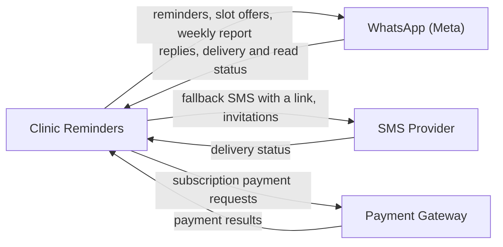

<!--
CHUNK: 08
TITLE: Integrations
PROJECT: Clinic Reminders
VERSION: 1.0
DEPENDS_ON: 05, 03
PART OF: BRD - Clinic Reminders
LANGUAGE: Business language only. Name the business system or partner and the business purpose of the integration (e.g., "Integration with Payment Gateway"). Protocols, data formats, authentication, and SLAs are technical design - they are owned by the SDD.
-->

# Integrations

| Business System / Partner | Business Purpose | Information Exchanged | Direction | Criticality | Provider / Owner |
|---------------------------|------------------|-----------------------|-----------|-------------|------------------|
| WhatsApp (Meta) | Reach patients and owners on WhatsApp: reminders, confirmation replies, slot offers, the opt-out confirmation, and the weekly report (UC-01, UC-03, UC-13, UC-15, UC-16) | We send: messages from approved service templates. We receive: patient replies (Confirm, Cancel, Accept, STOP, free text), delivery status, and read status. | Both ways | Critical | Meta. Sender model per clinic: see UC-01, step 6. |
| SMS Provider | Reach patients whom WhatsApp does not reach, and send receptionist sign-in invitations (UC-02, UC-14, UC-15) | We send: the fallback SMS with a confirm or cancel link, and invitations. We receive: delivery status. | Both ways | Important | An NTRA-licensed SMS provider, to be selected (chunk 02, Dependencies) |
| Payment Gateway | Collect subscription payments in EGP from the paid launch (UC-06) | We send: payment requests with the amount due. We receive: payment results and receipts. | Both ways | Important | A local payment gateway, to be selected (chunk 02, Dependencies) |

**Figure 3 - Business partners of Clinic Reminders**

**Summary:** Clinic Reminders reaches patients and owners through WhatsApp (Meta), and uses the SMS Provider for patients whom WhatsApp does not reach. It collects subscription payments through the Payment Gateway.

> Technical integration details (protocols, authentication, data formats, availability targets) are defined in the SDD, not here. Technical statements from the source are parked in chunk 12, Technical Inputs for the SDD.

<!-- MASTER: clinic-reminders-brd-master.md | PREV: 07-users-use-cases-matrix.md | NEXT: 09-reporting-and-analytics.md -->
